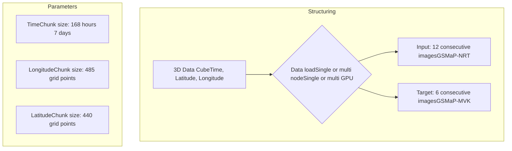

IEEE Access logo

Received 28 January 2026, accepted 27 February 2026, date of publication 5 March 2026, date of current version 12 March 2026.

Digital Object Identifier 10.1109/ACCESS.2026.3670767

APPLIED RESEARCH banner

# A Regional Benchmark for Deep Learning-Based Hourly Precipitation Nowcasting in Latin America

ADRIANO P. ALMEIDA1, HENRIQUE M. J. BARBOSA2, SÂMIA R. GARCIA3, DAVID J. GAGNE4, KANGHUI ZHOU5, TAKUJI KUBOTA6, (Member, IEEE), TOMOO USHIO7, SHIGENORI OTSUKA8, SIMON PFREUNDSCHUH9, AND ALAN J. P. CALHEIROS1

1National Institute for Space Research, São José dos Campos, São Paulo 12227-010, Brazil

2University of Maryland Baltimore County, Baltimore, MD 21250, USA

3Federal University of São Paulo, São José dos Campos, São Paulo 12231-280, Brazil

4University Corporation for Atmospheric Research, Boulder, CO 80305, USA

5National Meteorological Center of China, Beijing 100081, China

6Japan Aerospace Exploration Agency, Tokyo 182-8522, Japan

7The University of Osaka, Osaka 565-0871, Japan

8RIKEN Center for Computational Science, Kobe 650-0047, Japan

9Colorado State University, Fort Collins, CO 80523, USA

Corresponding author: Adriano P. Almeida (adriano.almeida@inpe.br)

This work was supported in part by the National Council for Scientific and Technological Development (CNPq) under Grant 438310/2018-7, Grant 141451/2021-1, and Grant 444205/2024-1; in part by Brazilian Federal Agency for Support and Evaluation of Higher Education (CAPES); in part by the National Institute for Space Research (INPE); in part by Brazilian Space Agency (AEB) of the Ministry of Science, Technology and Innovation (MCTI); in part by the Laboratório Nacional de Computação Científica (LNCC), (MCTI/Brazil) through the Resources of Santos Dumont Supercomputer in the projects IDeepS and Centro de Previsão de Tempo e Estudos Climáticos (CPTEC); in part by the 4th Research Announcement on the Earth Observations of Japan Aerospace Exploration Agency (JAXA) under Grant ER4GPN102; and in part by the World Meteorological Organization (WMO).

**ABSTRACT** Accurate short-term precipitation forecasting is critical for Latin America, but the region lacks a standardized framework to evaluate data-driven approaches due to the sparse coverage in the ground. This study introduces the Artificial Intelligence for Nowcasting Pilot Project (AINPP) Precipitation Benchmark (AINPP-PB-LATAM), providing curated datasets and a scalable, optimized training pipeline designed to accelerate deep learning development in high-performance computing environments. Beyond establishing a baseline using seven years of satellite-based data (2018–2024), the framework reduces engineering barriers, enabling researchers to focus on fine-tuning strategies to extract the full predictive capacity of models for regional specificities. As a demonstration use case, we trained and evaluated five deep learning architectures, AFNO, Inception-V4, ResNet-50, U-Net, and Xception, comparing them against Lagrangian Persistence and the operational AI Nowcast. The results reveal critical trade-offs: spectral methods like AFNO excel in continuous skill by capturing large-scale dependencies, while convolutional architectures offer robust categorical performance. However, pixel-wise optimization challenges persist, with systematic under-prediction of heavy rainfall. By providing open-access code and optimized baseline implementations for distributed computing, AINPP-PB-LATAM establishes a scalable foundation for collaborative research, facilitating the advancement of operational AI-based nowcasting and transferability assessments in data-scarce regions.

**INDEX TERMS** AINPP precipitation benchmark, deep learning, latin america, nowcasting.

## I. INTRODUCTION

Accurate short-term precipitation forecasting, known as nowcasting, plays a fundamental role in mitigating the impacts of extreme rainfall, flash floods, and landslides,

The associate editor coordinating the review of this manuscript and approving it for publication was Ines Domingues.

38306

© 2026 The Authors. This work is licensed under a Creative Commons Attribution 4.0 License. For more information, see https://creativecommons.org/licenses/by/4.0/

VOLUME 14, 2026

---

A. P. Almeida et al.: Regional Benchmark for Deep Learning–Based Hourly Precipitation Nowcasting

IEEE Access logo

particularly in tropical and subtropical regions such as Latin America. Reliable forecasts with lead times of 1–6 hours are essential for early warning systems, hydrometeorological operations, and urban flood management [1], [2]. However, precipitation remains one of the most challenging atmospheric variables to predict, due to the highly nonlinear and multiscale nature of convective systems, and the limitations of traditional numerical weather prediction (NWP) models in resolving small-scale processes at high spatial and temporal resolutions [3], [4].

Recent advances in deep learning (DL) have led to remarkable progress in data-driven precipitation nowcasting. Unlike NWP models, which require the numerical integration of complex physical equations, DL architectures can directly learn spatio-temporal dependencies from large datasets, capturing nonlinear relationships and motion dynamics through convolutional, recurrent, and transformer-based structures. The last decade has witnessed a rapid evolution of DL techniques applied to precipitation nowcasting. Pioneering work such as 5 introduced the Convolutional LSTM (ConvLSTM), which jointly models spatial and temporal correlations in precipitation fields. Subsequent studies expanded this paradigm with encoder–decoder structures, skip connections, and attention mechanisms to improve spatial coherence and temporal stability. For example, 6 proposed RainNet, a U-Net-based architecture trained on European radar composites, while 3 compared several convolutional architectures for radar-based nowcasting in the United States. These models demonstrate superior performance compared to traditional extrapolation techniques.

Satellite-based precipitation products provide near real-time rainfall estimates with quasi-global coverage at hourly resolutions, offering a crucial alternative in regions where in-situ rain gauge networks are sparse or nonexistent [7], [8]. Although observed data from rain gauge remain the ground truth for accuracy, products such as the Global Satellite Mapping of Precipitation (GSMaP) integrate these observations to improve the estimation reliability. Despite its increasing use in hydrological and meteorological applications, few studies have systematically assessed the potential of GSMaP data to benchmark deep learning models in highly heterogeneous climatic regimes of Latin America [9], [10], [11].

Benchmarking is an important step toward the development of reliable and reproducible AI-based forecasting systems [12]. The increasing availability of benchmark datasets has been a cornerstone for advancing model evaluation and reproducibility. The SEVIR dataset [13] provides one of the first large-scale collections of geolocated storm events with radar, lightning, and satellite imagery, allowing standardized comparisons between different models, as demonstrated in [14], [15], and [16]. Similarly, 2 introduced a generative adversarial framework for probabilistic nowcasting using UK radar composites, showing that deep generative models can outperform operational systems at short lead times. More recent studies have explored diffusion models [4] and spectral-transformer architectures such as Adaptive Fourier

Neural Operators (AFNO) [17], [18], which enhance spatial generalization and support global-scale applications.

Although several studies have evaluated deep learning models for nowcasting using regional precipitation datasets [13], [19], [20], [21], there is currently no standardized benchmark using satellite-derived rainfall for the Latin American domain. This gap limits the cross-comparison, reproducibility, and development of regionally adapted operational solutions. In addition, the diversity of climatic regimes in Latin America, spanning tropical convection, Andean orographic precipitation, and subtropical storm systems, poses an additional challenge for models trained primarily on mid-latitude radar datasets. The combination of satellite observations with the scalability of deep neural networks opens up possibilities for applications for nowcasting in regions with sparse radar coverage, as is the case for large parts of Latin America [22], [23].

Operational systems such as MS-nowcasting [24] and Global MetNet [25] have demonstrated the efficacy of deep learning in precipitation forecasting. However, these models frequently rely on high-quality radar data and dense observation networks [26], typically found in Northern Hemisphere countries or in well-instrumented regions of Europe and Asia. In contrast, Latin America lacks a dense ground-based radar network or sufficient rain gauge coverage for operational nowcasting. Consequently, the region must rely on satellite-based precipitation products, which leverage Passive Microwave radiometry to estimate rainfall rates across broad areas. While these products offer the necessary spatial scalability to cover the continent, they inherently suffer from higher latency and estimation errors compared to ground-based radar [27], [28]. The challenge, therefore, lies in utilizing DL to effectively adapt these broad-scale satellite inputs to specific regional dynamics. By learning local convective patterns, from the Amazon Basin to the Andean orography, DL models can potentially bridge the gap between coarse satellite estimations and the precision required for regional nowcasting. A standardized benchmark is thus essential to evaluate whether data-driven architectures can extract reliable local signal from these large-scale inputs in data-scarce regions.

To address these limitations, we present the first open and fully reproducible benchmark for hourly precipitation nowcasting developed for the WMO AINPP in Latin America, developed under the Artificial Intelligence for Nowcasting Pilot Project (AINPP) of the World Meteorological Organization (WMO).1 A primary contribution of this study is the delivery of a highly optimized and modular pipeline, capable of handling terabytes of satellite data in high performance computing (HPC) environments. This infrastructure is explicitly designed to serve as a launchpad for future research, by providing pre-processed, curated data, and standardized loading mechanisms. We enable the community to move beyond training from scratch. This facilitates advanced fine

1 https://www.ainpp.org

VOLUME 14, 2026

38307

---

IEEE Access logo

A. P. Almeida et al.: Regional Benchmark for Deep Learning–Based Hourly Precipitation Nowcasting

tuning experiments, allowing generic global models to be specialized for the complex hydroclimatic contexts of Latin America with greater efficiency.

The AINPP Precipitation Benchmark (AINPP-PB-LATAM) included a DOI-registered and curated dataset, standardized training/validation/test splits, and a comprehensive public repository containing preprocessing pipelines, training workflows, inference scripts, and evaluation metrics. Together, these components define a unified protocol that enables a fair and transparent comparison between classical and AI-based nowcasting models across study area.

In this framework, we performed a systematic evaluation of well-known DL architectures using a consistent experimental setup, ensuring reproducibility and equitable assessment across models. We analyzed spatial and temporal error patterns across distinct climatic regimes, offering insights into model strengths, limitations, and potential avenues for hybrid approaches that integrate physical constraints with machine learning techniques.

These frameworks can be readily extended by a broad range of users, including operational forecasting centers throughout Latin America, as well as researchers and developers of global-scale machine learning models seeking systematic validation across distinct continental and climatic regimes. Moreover, the evaluated models are intended to form part of a broader operational platform, where precipitation monitoring and nowcasting outputs can be visualized and accessed in near real-time, depending on the latency of the selected data sources.

# II. STUDY AREA AND DATA

## A. STUDY AREA AND CHARACTERISTICS

For AINPP-PB-LATAM, we used a continental subset of the GSMaP that was extracted to cover the entire Latin American domain, defined by latitudes from 55° S to 33° N and longitudes from 120° W to 23° W, as shown in Figure 1. This spatial extent encompasses the full spectrum of precipitation regimes in Latin America and the Caribbean, ranging from tropical convection in the Amazon Basin, Central America and Caribbean islands to extratropical cyclones and frontal systems in southern South America. The selected period spans from 2018 to 2024, providing a seven-year archive suitable for training, validation, and testing, thus enabling long-term evaluation under diverse climatic conditions.

This region is one of the most topographically and climatically diverse settings on Earth, with elevations ranging from near sea level to and beyond 5,500 m in the Andes Mountains [29]. Continental and insular physiography can be broadly categorized into four major units: (i) the Andes mountain range, extending along much of the western margin of South America and acting as a dominant orographic barrier; (ii) the interior plains of the Amazon and La Plata basins, with low elevations below 500 m; (iii) the Brazilian and Guiana Highlands, with intermediate elevations from 500 to 2,000 m; and (iv) the mountainous terrain of

Central America and Mexico, where elevations frequently exceed 3,000 m.

This complex topography exerts strong control over regional and mesoscale precipitation patterns, producing marked orographic gradients that modulate the atmospheric circulation throughout the continent. The Andes act as longitudinal barriers that shape both Pacific and Atlantic moisture fluxes, generating distinct windward and lee-side effects. In the Caribbean/central domain, easterly low-level jet (the Caribbean Low - level jet) contributes significantly to moisture transport and precipitation modulation [30]. The lowlands of the Amazon Basin also facilitate continental moisture transport, for example, via the South American low-level jet, which produces precipitation amounts that often exceeding several thousand millimeters [31]. In contrast, in semi-arid and arid regions in northeastern Brazil, northern Mexico, and the Atacama Desert in Chile, the annual precipitation may fall well below 100 mm. This remarkable spatial heterogeneity provides an ideal framework for evaluating the robustness and generalization capacity of deep-learning architectures in modeling precipitation variability across highly distinct climatic and geographic regimes.

## B. DATA SOURCE

The AINPP-PB-LATAM provides a multi-source precipitation dataset encompassing several operational products, including specific variants of the JAXA (Japan Aerospace Exploration Agency) GSMaP suite (NOW, NRT, and MVK) [22], [23], NASA’s IMERG Early Run [32], MERGE product from National Institute for Space Research (INPE) [33], and rain gauge observations. Although the framework supports flexible configurations, the experiments in this study specifically utilize GSMaP-NRT and GSMaP-MVK. This configuration balances operational constraints with verification rigor; the benchmark experiments are specifically configured with GSMaP-NRT as the model input and GSMaP-MVK as the learning target. In the GSMaP products, GSMaP-MVK was selected as the target because of its superior estimation accuracy derived from a bidirectional (forward and backward) Kalman filter algorithm that incorporates future passive microwave observations to refine interpolation gaps. Conversely, GSMaP-NRT is employed as the input because it represents the optimal trade-off for nowcasting workflows and utilizes a forward-only Kalman filter. It maintains a manageable latency of approximately 4 h, substantially lower than standard research products, while offering greater physical consistency than the extrapolation-based GSMaP-NOW.

## C. DATA ORGANIZATION AND PARTITIONING

All datasets were stored using the Zarr format, which enables fragmented access optimized for parallel I/O operations in high-performance computing (HPC) environments. The overall data structure follows the organization shown in Figure 2. Three hierarchical groups were defined:

38308

VOLUME 14, 2026

---

A. P. Almeida et al.: Regional Benchmark for Deep Learning–Based Hourly Precipitation Nowcasting

IEEE Access logo

Map of the study area covering Latin America with topographical features and country labels.

**FIGURE 1.** Study area covering the Latin American domain, including topographical features from southern South America to northern Mexico and the Caribbean. Elevation ranges from sea level to above approximately 5,500 m in the Andes Mountains.

training, validation, and testing groups. To avoid temporal leakage, the partitioning adopts a strict year-based split: training uses the 2018–2022 period, validation is performed in 2023, and independent testing is conducted in 2024.

Each dataset contains precipitation fields from multiple satellite products and rain gauges with different temporal resolutions, latencies, and spatial coverage (see Figure 2). These include GSMaP-NOW, GSMaP-NRT, GSMaP-MVK, IMERG-Early, MERGE-Hourly and in-situ rain gauge observations. All products are on a common grid and stored as multidimensional arrays with dimensions ($T$, $H$, $W$), where $T$ denotes time, $H$ denotes latitude, and $W$ denotes longitude.

To support scalable HPC training, each dataset was internally chunked along time, latitude, and longitude dimensions. The time is divided into blocks of 168 h (7 days), latitude into chunks of 440 grid points, and longitude into chunks of 485 grid points. This structure enables efficient distributed data loading across single- or multi-node, single- or multi-GPU systems.

Training samples were constructed as spatio-temporal sequences composed of $L_{in}$ consecutive inputs and $L_{out}$ future targets. In the benchmark configuration, GSMaP-NRT

provides the input sequence and GSMaP-MVK provides the target sequence. Thus, we set $L_{in} = 12$ and $L_{out} = 6$, yielding a nowcasting horizon of 6 hours ahead. This design balances operational relevance and computational tractability while ensuring consistency between products and experimental settings.

All these datasets are encapsulated within the benchmark, thereby simplifying the analyses and enabling users to extract relevant information on the skill of these products across different regions of interest. To quantify the inherent distribution shift between the input (GSMaP-NRT) and target (GSMaP-MVK), we performed a statistical comparison on the test set, as shown in Figure 3. The Probability Density Functions (Figure 3a) indicate a high degree of global similarity between the products, quantitatively confirmed by the low Kullback–Leibler (KL) divergence of 0.0040. This suggests that for the majority of precipitation regimes, particularly low-to-moderate intensities, the GSMaP-NRT and GSMaP-MVK distributions are statistically consistent.

However, the Quantile–Quantile (Q–Q) plot (Figure 3b) and the intensity percentiles reveal significant deviations in the extreme tail of the distribution. While the quantiles follow the 1:1 line closely for lower intensities,

VOLUME 14, 2026

38309

---

IEEE Access logo

A. P. Almeida et al.: Regional Benchmark for Deep Learning–Based Hourly Precipitation Nowcasting

<table>
  <thead>
    <tr>
        <th colspan="5">Products</th>
    </tr>
<tr>
        <th>Precipitation Product</th>
        <th>Temporal Resolution</th>
        <th>Data Latency</th>
        <th>Spatial Coverage</th>
        <th>Data Provider</th>
    </tr>
  </thead>
  <tbody>
    <tr>
        <td>GSMaP-NOW</td>
<td>30 minutes</td>
<td>30 minutes</td>
<td>Global (60°N–60°S)</td>
<td>JAXA / Earth Observation Research Center</td>
    </tr>
<tr>
        <td>GSMaP-NRT</td>
<td>1 hour</td>
<td>4 hours</td>
<td>Global (90°N–90°S)</td>
<td>JAXA / Earth Observation Research Center</td>
    </tr>
<tr>
        <td>GSMaP-MVK</td>
<td>1 hour</td>
<td>3 days</td>
<td>Global (90°N–90°S)</td>
<td>JAXA / Earth Observation Research Center</td>
    </tr>
<tr>
        <td>IMERG-Early</td>
<td>30 minutes</td>
<td>4 hours</td>
<td>Global (90°N–90°S)</td>
<td>NASA / GPM (Global Precipitation Mission)</td>
    </tr>
<tr>
        <td>MERGE-Hourly</td>
<td>1 hour</td>
<td>1 hour</td>
<td>Brazil</td>
<td>CPTEC/INPE</td>
    </tr>
<tr>
        <td>Rain Gauge</td>
<td>1 hour</td>
<td>N/A</td>
<td>Brazil</td>
<td>CPTEC/INPE</td>
    </tr>
  </tbody>
</table>

<table>
  <thead>
    <tr>
        <th colspan="7">Partitioning</th>
    </tr>
<tr>
        <th colspan="5">Training</th>
        <th>Validation</th>
        <th>Test</th>
    </tr>
  </thead>
  <tbody>
    <tr>
        <td>2018</td>
<td>2019</td>
<td>2020</td>
<td>2021</td>
<td>2022</td>
<td>2023</td>
<td>2024</td>
    </tr>
  </tbody>
</table>

**FIGURE 2.** Overview of the precipitation products, data partitioning strategy, and data-structuring pipeline adopted in this benchmark. (Top) summary of temporal resolution, latency, spatial coverage, and data providers for all precipitation products considered: GSMaP-NOW, GSMaP-NRT, GSMaP-MVK, IMERG-Early, MERGE-Hourly, and in-situ rain gauge observations. (Middle) Temporal partitioning of the dataset, with years 2018–2022 used for training, 2023 for validation, and 2024 reserved for independent testing. (Bottom) Schematic representation of the data structuring workflow, including spatial and temporal chunking (time chunks of 168 hours, longitude chunks of 485 grid points, and latitude chunks of 440 grid points), followed by the construction of training samples using sequences of 12 consecutive GSMaP-NRT images as inputs and 6 consecutive GSMaP-MVK images as targets.

a divergence becomes apparent above 50 mm h−1, where GSMaP-NRT systematically exhibits higher intensity values than GSMaP-MVK. At the 99.9th percentile, the NRT intensity (50.03 mm h−1) notably exceeds the corresponding MVK value (40.90 mm h−1). This behavior is consistent with the additional incorporation of subsequent passive microwave overpasses in the GSMaP-MVK

product, which allows for a posterior temporal adjustment of precipitation intensities [23], [22]. In contrast, the GSMaP-NRT product relies exclusively on forward propagation from the most recent observation, thereby retaining short-lived intensity peaks that may be later attenuated in the reprocessed MVK fields to enforce temporal coherence.

38310

VOLUME 14, 2026

---

A. P. Almeida et al.: Regional Benchmark for Deep Learning–Based Hourly Precipitation Nowcasting

IEEE Access logo

Quantitative analysis of distribution shift between GSMaP-NRT and GSMaP-MVK products, including PDF, Q-Q plot, and Joint Distribution Density.

<table>
  <thead>
    <tr>
        <th colspan="3">Intensity Percentiles</th>
    </tr>
<tr>
        <th>Percentile</th>
        <th>NRT (mm/h)</th>
        <th>MVK (mm/h)</th>
    </tr>
  </thead>
  <tbody>
    <tr>
        <td>25th</td>
<td>0.00</td>
<td>0.00</td>
    </tr>
<tr>
        <td>50th</td>
<td>0.44</td>
<td>0.44</td>
    </tr>
<tr>
        <td>75th</td>
<td>1.29</td>
<td>1.23</td>
    </tr>
<tr>
        <td>90th</td>
<td>1.74</td>
<td>1.17</td>
    </tr>
<tr>
        <td>95th</td>
<td>5.21</td>
<td>5.11</td>
    </tr>
<tr>
        <td>99th</td>
<td>14.71</td>
<td>13.39</td>
    </tr>
<tr>
        <td>99.9th</td>
<td>30.03</td>
<td>26.90</td>
    </tr>
  </tbody>
</table>

**FIGURE 3.** Quantitative analysis of the distribution shift between the input (GSMaP-NRT) and target (GSMaP-MVK) products computed over the test set. (a) Probability Density Functions (PDF) comparing precipitation intensity distributions. (b) Quantile-Quantile (Q-Q) plot illustrating deviations in the distribution tails. (c) Joint distribution density showing pixel-wise scatter between input and target. The tables summarize metrics, including Kullback-Leibler (KL) divergence, Spearman correlation, Bias, RMSE, and rain frequencies at specific precipitation thresholds, as well as a comparison of intensity percentiles.

This discrepancy is further characterized in the Joint Distribution Density (Figure 3c), which shows the pixel-wise dispersion between the products. The data exhibits a monotonic association, evidenced by a Spearman correlation of 0.73. Despite this strong rank agreement and a negligible systematic global bias (0.08 mm h−1), the scatter increases with intensity, reflecting the cumulative effect of additional observational constraints introduced during the GSMaP-MVK reanalysis. Consequently, the observed RMSE of 2.79 mm h−1 between input and target should be interpreted as an irreducible error floor (aleatoric uncertainty) associated with data latency and retrospective assimilation of observations, rather than as a deficiency of the learning framework itself.

# III. BENCHMARK DESIGN

## A. OVERVIEW

The AINPP-PB-LATAM was designed to provide a unified, reproducible, and scalable framework for evaluating deep learning models in the hourly precipitation forecast over Latin America. The benchmark integrates datasets, model architectures, and evaluation metrics under a consistent experimental protocol, ensuring comparability between architectures, lead times, and rainfall intensity. This design supports both scientific reproducibility and operational assessment of artificial intelligence (AI) methods within the WMO/AINPP.

## B. FORECAST SETUP

The core experimental configuration follows an image-to-image forecasting paradigm. Although AINPP-PB-LATAM

allows users to flexibly select different product combinations, such as IMERG, GSMaP-NOW, NRT, or MVK, to match specific latency constraints or validation goals, this study uses GSMaP-NRT as the input sequence and GSMaP-MVK as the prediction target. This specific setup simulates a realistic operational scenario in which the model must rely on available low-latency (NRT) data to approximate the high-fidelity estimates provided by the consolidated product (MVK).

Consequently, each training sample consists of Lin = 12 consecutive hours of GSMaP-NRT and Lin = 6 subsequent hours of GSMaP-MVK. This direct multi-step formulation enables the model to jointly learn spatial and temporal dependencies across a continuous forecast window (t + 1 to t + 6h), avoiding the error accumulation typical of autoregressive approaches [34]. As the benchmark evolves, additional datasets are progressively incorporated to broaden the scope of validation, thereby granting users the flexibility to utilize the benchmark according to their specific needs.

Model training was performed in a distributed setting using 4 NVIDIA H100 GPUs, using data parallelism to efficiently scale the learning process. During training, spatial patches of size 320 × 320 were extracted from the full domain and used as input to the model. The patch size, which is fully configurable within the AINPP-PB-LATAM, was empirically selected to mitigate learning of biased spatial artifacts associated with region-specific climatological patterns. By training in localized patches, models are encouraged to learn local spatial invariances rather than memorizing fixed geographical features [5].

Additionally, this patch-based strategy acts as an implicit form of spatial data augmentation, as the same precipitation system may appear at different relative positions within the input samples throughout training. Although model optimization is conducted using patches, all evaluations are performed over the full spatial domain by adjusting the network input configuration accordingly. This evaluation strategy preserves large-scale spatial coherence and reflects the intended operational deployment, while maintaining the regularization benefits introduced during training.

## C. MODEL SUITE

Seven representative model classes were compared in the benchmark, encompassing two baselines, convolutional-based architectures, and spectral-transform paradigms:

*   **U-Net** [[35]](https://doi.org/10.1007/978-3-319-24574-4_28): A fully convolutional encoder–decoder network with skip connections that preserve spatial detail.

*   **Residual Netework (ResNet-50)** [[36]](https://doi.org/10.1109/CVPR.2016.90): A residual convolutional model that facilitates a deeper architecture and stable gradient flow.

*   **Xception** [[37]](https://doi.org/10.1109/CVPR.2017.201): Employs separable convolutions in depth for efficient feature extraction.

*   **Inception-V4** [[38]](https://doi.org/10.1609/aaai.v31i1.11231): A multi-branch convolutional design that captures precipitation structures at multiple scales.

VOLUME 14, 2026

38311

---

IEEE Access logo

A. P. Almeida et al.: Regional Benchmark for Deep Learning–Based Hourly Precipitation Nowcasting

* **AFNO** [17], [18]: A transformer-style model using Fourier neural operators for global spectral representation.

* **Persistence (Baseline)**: A naive baseline, which assumes that future precipitation is simply the last observed field displaced by vectors from our convective tracking algorithm pyForTraCC (Python library for Forecasting and Tracking the Evolution of Configurable Clusters) [39], was used as a lower performance limit.

* **RAIN (Baseline)** [40]: An operational baseline developed by the RIKEN Center for Computational Science (Japan), included for cross-institutional benchmarking.

To ensure reproducibility and operational flexibility, all models were implemented within a unified PyTorch framework that shared identical data loading and evaluation protocols. The experimental execution is governed by a centralized configuration file that encapsulates all training hyperparameters and optimization settings. Although the framework provides a suite of standard default configuration files to establish consistent baselines, it is explicitly designed to be adaptable, allowing users to easily modify specific parameters to explore diverse training strategies or accommodate different hardware constraints.

## D. EVALUATION METHODS

The AINPP-PB-LATAM is designed to support a comprehensive evaluation framework. Addresses continuous, categorical, and spatial perception metrics to ensure a physically meaningful and comprehensive comparison of precipitation forecasts. Although the benchmark suite supports a wide range of diagnostic tools, including spectral analysis and object-based verification, the baseline experiments presented in this study focus on a core set of widely established metrics. However, all other metrics are available for use in the benchmark provided in the GitHub repository. These were selected to provide a robust initial characterization of the model performance in terms of error magnitude, temporal correlation, detection skill, and spatial reliability.

### 1) CONTINUOUS METRICS

To quantify the direct correspondence between the predicted and observed rainfall intensities, four primary continuous metrics were employed.

The Mean Absolute Error (MAE) provides a linear measure of forecast accuracy, representing the average magnitude of errors without considering their direction:

$$ \text{MAE} = \frac{1}{n} \sum_{i=1}^{n} |f_i - o_i| $$

where $f_i$ is the forecast value, $o_i$ is the observed value and $n$ is the total number of pixels.

The Mean Squared Error (MSE) is calculated to assess the average squared difference between estimates and observations, serving as a direct proxy for the loss functions

**TABLE 1. Contingency table for dichotomous verification.**

<table>
  <thead>
    <tr>
        <th> </th>
        <th colspan="2">Observation</th>
    </tr>
<tr>
        <th>Forecast \ Observation</th>
        <th>Yes</th>
        <th>No</th>
    </tr>
  </thead>
  <tbody>
    <tr>
        <td>Yes</td>
<td>(a) Hits</td>
<td>(b) False Alarm</td>
    </tr>
<tr>
        <td>No</td>
<td>(c) Misses</td>
<td>(d) Correct Negatives</td>
    </tr>
  </tbody>
</table>

commonly optimized during training.

$$ \text{MSE} = \frac{1}{n} \sum_{i=1}^{n} (f_i - o_i)^2 $$

Derived from MSE, the Root Mean Square Error (RMSE) was used to provide an error metric in the same physical units as the precipitation data (mm h−1), giving greater weight to larger errors and penalizing outliers:

$$ \text{RMSE} = \sqrt{\text{MSE}} = \sqrt{\frac{1}{n} \sum_{i=1}^{n} (f_i - o_i)^2} $$

To evaluate the monotonic association between forecasts and observations, we compute the Spearman Rank Correlation Coefficient ($\rho_s$):

$$ \rho_s = 1 - \frac{6 \sum_{i=1}^{n} d_i^2}{n(n^2 - 1)} $$

where $d_i = R(f_i) - R(o_i)$ denotes the difference between the forecast rank and the observation value, and $n$ is the total number of paired samples.

The systematic error is quantified through the Mean Error (bias), which measures the tendency toward over- or underestimation.

$$ \text{Bias} = \frac{1}{n} \sum_{i=1}^{n} (f_i - o_i) $$

### 2) CATEGORICAL METRICS

To assess the capability of the models to detect precipitation events in different intensity regimes, continuous outputs were thresholded to 0.1, 1.0, 5.0, and 10.0 mm h−1. We employed a contingency table approach (Table 1) to derive the following skill scores:

Probability of Detection (POD) measures the fraction of observed events correctly predicted.

$$ \text{POD} = \frac{\text{hits}}{\text{hits} + \text{misses}} $$

The False Alarm Ratio (FAR) quantifies the fraction of predicted events that did not occur.

$$ \text{FAR} = \frac{\text{false alarms}}{\text{hits} + \text{false alarms}} $$

The Critical Success Index (CSI) offers a balanced view of detection performance, accounting for both misses and false alarms.

$$ \text{CSI} = \frac{\text{hits}}{\text{hits} + \text{misses} + \text{false alarms}} $$

All metrics are independently computed for each forecast lead time ($t + 1$ to $t + 6$ h) and aggregated over the test dataset to evaluate temporal degradation and stability.

38312

VOLUME 14, 2026

---

A. P. Almeida et al.: Regional Benchmark for Deep Learning–Based Hourly Precipitation Nowcasting

IEEE Access logo

**TABLE 2.** Comparison of continuous performance metrics for different nowcasting models across forecast lead times. Arrows in the column headers indicate whether higher (↑) or lower (↓) values correspond to better performance. Best values for each metric at a given lead time are highlighted in bold.

<table>
  <thead>
    <tr>
        <th>Lead Time</th>
        <th>Model</th>
        <th>MSE (↓)</th>
        <th>MAE (↓)</th>
        <th>Bias (→ 0)</th>
        <th>RMSE (↓)</th>
        <th>Spearman ρ (↑)</th>
    </tr>
  </thead>
  <tbody>
    <tr>
        <td rowspan="7">+1h</td>
<td>AFNO</td>
<td><strong>0.6987</strong></td>
<td><strong>0.0858</strong></td>
<td>-0.0277</td>
<td><strong>0.7914</strong></td>
<td>0.3997</td>
    </tr>
<tr>
        <td>InceptionV4</td>
<td>0.8810</td>
<td>0.1417</td>
<td>0.0093</td>
<td>0.8910</td>
<td>0.4643</td>
    </tr>
<tr>
        <td>ResNet50</td>
<td>0.8989</td>
<td>0.1327</td>
<td><strong>-0.0020</strong></td>
<td>0.8988</td>
<td>0.4852</td>
    </tr>
<tr>
        <td>UNet</td>
<td>0.8952</td>
<td>0.1383</td>
<td>0.0083</td>
<td>0.8938</td>
<td>0.4975</td>
    </tr>
<tr>
        <td>Xception</td>
<td>1.0013</td>
<td>0.1393</td>
<td>0.0044</td>
<td>0.9285</td>
<td>0.4600</td>
    </tr>
<tr>
        <td>Persistence (Baseline)</td>
<td>1.1067</td>
<td>0.1196</td>
<td>0.0305</td>
<td>0.8359</td>
<td>0.4381</td>
    </tr>
<tr>
        <td>RAIN (Baseline)</td>
<td>1.4335</td>
<td>0.1191</td>
<td>0.0137</td>
<td>0.8821</td>
<td><strong>0.5249</strong></td>
    </tr>
<tr>
        <td rowspan="7">+2h</td>
<td>AFNO</td>
<td><strong>0.7743</strong></td>
<td><strong>0.0979</strong></td>
<td>-0.0355</td>
<td><strong>0.8326</strong></td>
<td>0.3730</td>
    </tr>
<tr>
        <td>InceptionV4</td>
<td>0.9070</td>
<td>0.1553</td>
<td>0.0200</td>
<td>0.9099</td>
<td>0.4323</td>
    </tr>
<tr>
        <td>ResNet50</td>
<td>0.9155</td>
<td>0.1371</td>
<td><strong>-0.0087</strong></td>
<td>0.9153</td>
<td><strong>0.4578</strong></td>
    </tr>
<tr>
        <td>UNet</td>
<td>0.9152</td>
<td>0.1519</td>
<td>0.0171</td>
<td>0.9143</td>
<td>0.4465</td>
    </tr>
<tr>
        <td>Xception</td>
<td>0.9712</td>
<td>0.1406</td>
<td>-0.0144</td>
<td>0.9322</td>
<td>0.4213</td>
    </tr>
<tr>
        <td>Persistence (Baseline)</td>
<td>1.7918</td>
<td>0.1619</td>
<td>0.0481</td>
<td>1.0802</td>
<td>0.3466</td>
    </tr>
<tr>
        <td>RAIN (Baseline)</td>
<td>4.5156</td>
<td>0.1380</td>
<td>0.0212</td>
<td>1.1449</td>
<td>0.2245</td>
    </tr>
<tr>
        <td rowspan="7">+3h</td>
<td>AFNO</td>
<td><strong>0.8373</strong></td>
<td><strong>0.1080</strong></td>
<td>-0.0431</td>
<td><strong>0.8617</strong></td>
<td>0.3443</td>
    </tr>
<tr>
        <td>InceptionV4</td>
<td>0.8487</td>
<td>0.1720</td>
<td>0.0341</td>
<td>0.8841</td>
<td>0.3980</td>
    </tr>
<tr>
        <td>ResNet50</td>
<td>0.8416</td>
<td>0.1494</td>
<td><strong>0.0055</strong></td>
<td>0.8798</td>
<td><strong>0.4209</strong></td>
    </tr>
<tr>
        <td>UNet</td>
<td>0.8614</td>
<td>0.1640</td>
<td>0.0231</td>
<td>0.8895</td>
<td>0.4011</td>
    </tr>
<tr>
        <td>Xception</td>
<td>0.8869</td>
<td>0.1477</td>
<td>-0.0087</td>
<td>0.8936</td>
<td>0.3881</td>
    </tr>
<tr>
        <td>Persistence (Baseline)</td>
<td>2.2661</td>
<td>0.1899</td>
<td>0.0587</td>
<td>1.2289</td>
<td>0.2826</td>
    </tr>
<tr>
        <td>RAIN (Baseline)</td>
<td>6.9362</td>
<td>0.1556</td>
<td>0.0281</td>
<td>1.3348</td>
<td>0.2189</td>
    </tr>
<tr>
        <td rowspan="7">+4h</td>
<td>AFNO</td>
<td>0.8553</td>
<td><strong>0.1111</strong></td>
<td>-0.0457</td>
<td>0.8723</td>
<td>0.3270</td>
    </tr>
<tr>
        <td>InceptionV4</td>
<td>0.8067</td>
<td>0.1762</td>
<td>0.0311</td>
<td>0.8641</td>
<td>0.3740</td>
    </tr>
<tr>
        <td>ResNet50</td>
<td><strong>0.7976</strong></td>
<td>0.1596</td>
<td>0.0154</td>
<td><strong>0.8579</strong></td>
<td><strong>0.3792</strong></td>
    </tr>
<tr>
        <td>UNet</td>
<td>0.8159</td>
<td>0.1709</td>
<td>0.0246</td>
<td>0.8668</td>
<td>0.3513</td>
    </tr>
<tr>
        <td>Xception</td>
<td>0.8355</td>
<td>0.1519</td>
<td><strong>-0.0056</strong></td>
<td>0.8677</td>
<td>0.3546</td>
    </tr>
<tr>
        <td>Persistence (Baseline)</td>
<td>2.5988</td>
<td>0.2097</td>
<td>0.0655</td>
<td>1.3288</td>
<td>0.2364</td>
    </tr>
<tr>
        <td>RAIN (Baseline)</td>
<td>8.1969</td>
<td>0.1686</td>
<td>0.0340</td>
<td>1.4475</td>
<td>0.2073</td>
    </tr>
<tr>
        <td rowspan="7">+5h</td>
<td>AFNO</td>
<td>0.9100</td>
<td><strong>0.1138</strong></td>
<td>-0.0485</td>
<td>0.8978</td>
<td>0.3132</td>
    </tr>
<tr>
        <td>InceptionV4</td>
<td>0.8696</td>
<td>0.1749</td>
<td>0.0186</td>
<td>0.8913</td>
<td>0.3429</td>
    </tr>
<tr>
        <td>ResNet50</td>
<td><strong>0.8493</strong></td>
<td>0.1620</td>
<td><strong>0.0088</strong></td>
<td><strong>0.8802</strong></td>
<td><strong>0.3457</strong></td>
    </tr>
<tr>
        <td>UNet</td>
<td>0.8634</td>
<td>0.1787</td>
<td>0.0267</td>
<td>0.8873</td>
<td>0.3303</td>
    </tr>
<tr>
        <td>Xception</td>
<td>0.8957</td>
<td>0.1549</td>
<td>-0.0097</td>
<td>0.8915</td>
<td>0.3179</td>
    </tr>
<tr>
        <td>Persistence (Baseline)</td>
<td>2.8309</td>
<td>0.2240</td>
<td>0.0699</td>
<td>1.3978</td>
<td>0.2010</td>
    </tr>
<tr>
        <td>RAIN (Baseline)</td>
<td>8.8491</td>
<td>0.1774</td>
<td>0.0372</td>
<td>1.5153</td>
<td>0.1950</td>
    </tr>
<tr>
        <td rowspan="7">+6h</td>
<td>AFNO</td>
<td>1.0343</td>
<td><strong>0.1213</strong></td>
<td>-0.0549</td>
<td>0.9576</td>
<td>0.3004</td>
    </tr>
<tr>
        <td>InceptionV4</td>
<td>1.0434</td>
<td>0.1742</td>
<td><strong>0.0007</strong></td>
<td>0.9665</td>
<td><strong>0.3100</strong></td>
    </tr>
<tr>
        <td>ResNet50</td>
<td><strong>1.0045</strong></td>
<td>0.1673</td>
<td>0.0009</td>
<td><strong>0.9496</strong></td>
<td>0.3090</td>
    </tr>
<tr>
        <td>UNet</td>
<td>1.0189</td>
<td>0.1883</td>
<td>0.0268</td>
<td>0.9571</td>
<td>0.3024</td>
    </tr>
<tr>
        <td>Xception</td>
<td>1.0396</td>
<td>0.1651</td>
<td>-0.0063</td>
<td>0.9566</td>
<td>0.2934</td>
    </tr>
<tr>
        <td>Persistence (Baseline)</td>
<td>2.9944</td>
<td>0.2344</td>
<td>0.0727</td>
<td>1.4472</td>
<td>0.1727</td>
    </tr>
<tr>
        <td>RAIN (Baseline)</td>
<td>8.9083</td>
<td>0.1827</td>
<td>0.0380</td>
<td>1.5457</td>
<td>0.1843</td>
    </tr>
  </tbody>
</table>

## E. IMPLEMENTATION AND COMPUTATIONAL SETUP

All experiments were performed on the *Santos Dumont* high-performance computing (HPC) system operated by the Brazilian National Laboratory for Scientific Computing (LNCC). The training and inference used NVIDIA 4x H100 and 4x GH200 GPUs with PyTorch’s distributed data parallel (DDP) implementation. Each model was trained for up to 100 epochs with mixed-precision acceleration (FP16) to optimize GPU memory and throughput, using an early stopping strategy with patience of 15 epochs. Zarr-based datasets were accessed through `xarray` and `Dask` for efficient I/O parallelization across multiple computing nodes.

The source code, configuration files, evaluation scripts and more information in AINPP-PB-LATAM follow open-science principles and are version-controlled in the AINPP public repository.2 Reproducibility is guaranteed 

 through fixed random seeds, environmental specifications, and explicit documentation of the data preprocessing steps.

## IV. MODEL ARCHITECTURES

### A. OVERVIEW

The AINPP-PB-LATAM includes five representative deep learning architectures (in addition to two baselines) encompassing the main paradigms used in spatio-temporal modeling: convolutional, residual, and spectral-transform networks. These architectures were selected based on their prominence in the literature, interpretability, and proven applicability to precipitation nowcasting and related geophysical prediction tasks [6], [41], [42], [43], [44], [45], [46]. Each model was trained using the same data partitions, input–output configuration, and loss functions to ensure a fair comparison under identical conditions. The general workflow of the proposed nowcasting system is illustrated in Figure 4.

2 https://doi.org/10.60748/ainpp.pb.latam.code

VOLUME 14, 2026

38313

---

IEEE Access logo

A. P. Almeida et al.: Regional Benchmark for Deep Learning–Based Hourly Precipitation Nowcasting

Schematic representation of the proposed deep learning-based nowcasting workflow showing Training, Evaluation, and Production stages.
Flowchart of the Evaluation stage showing baseline and testing datasets, precipitation thresholds, and statistical metrics.
Flowchart of the Production stage showing near real-time precipitation estimates, deep learning models, and georeferenced precipitation forecasts.

**FIGURE 4. Schematic representation of the proposed deep learning-based nowcasting workflow. The process is divided into three stages: Training, where historical datasets train various architectures to forecast up to 6 hours ahead; Evaluation, where models are validated against baselines using specific precipitation thresholds and statistical metrics (POD, FAR, CSI, etc.); and production, where the models generate georeferenced precipitation forecasts using estimates.**

## B. CONVOLUTIONAL ARCHITECTURES
### 1) U-NET

U-Net [35] is a fully convolutional encoder–decoder network with skip connections that preserves spatial information during upsampling. It consists of successive convolutional and pooling layers in the encoder, followed by symmetric transposed convolutions in the decoder. Skip connections concatenate the corresponding encoder and decoder features, allowing the network to maintain fine-scale precipitation patterns while capturing large-scale structures. Its simplicity and robustness make it a baseline architecture in many nowcasting studies.

### 2) RESIDUAL NETWORK

ResNet [36] introduces identity skip connections to facilitate deeper network training and mitigate the vanishing gradient problems. Each residual block can be expressed as:

$$ \mathbf{y} = \mathcal{F}(\mathbf{x}, \{W_i\}) + \mathbf{x}, $$

where $\mathcal{F}$ represents a nonlinear transformation (two or three convolutional layers) applied to input $\mathbf{x}$. This residual formulation enables efficient learning of spatial features at multiple scales, improving the model’s ability to capture mesoscale precipitation patterns and sharp intensity gradients.

### 3) XCEPTION

The Xception model [37] employs separable depthwise convolutions that decouple spatial and channel-wise correlations, substantially reducing the parameter count while preserving performance. Its architecture replaces standard convolutions with a sequence of depthwise and pointwise operations, making it highly efficient for high-resolution rainfall images where the input channels correspond to temporal frames.

### 4) Inception-V4

Inception-V4 [38] extended the original Inception architecture by combining multiple convolutional branches with varying kernel sizes to capture spatial variability in multiple receptive fields. The architecture also integrates residual connections to stabilize the gradient propagation. This diversity of feature extraction scales is advantageous for representing multiscale rainfall phenomena, from localized convective cores to synoptic-scale stratiform systems.

## C. SPECTRAL-TRANSFORM ARCHITECTURE
### 1) THE ADAPTIVE FOURIER NEURAL OPERATOR

AFNO [17], [18] operates in the spectral domain by learning transformations directly in the frequency space.

38314

VOLUME 14, 2026

---

A. P. Almeida et al.: Regional Benchmark for Deep Learning–Based Hourly Precipitation Nowcasting

IEEE Access logo

TABLE 3. Categorical metrics (CSI, POD, FAR) averaged over all lead times by precipitation threshold. The last row block shows the average over all thresholds. Arrows in the column headers indicate whether higher (↑) or lower (↓) values correspond to better performance. Best values for each metric at a given lead time are highlighted in bold.

<table>
  <thead>
    <tr>
        <th>Threshold</th>
        <th>Model</th>
        <th>CSI (↑)</th>
        <th>POD (↑)</th>
        <th>FAR (↓)</th>
    </tr>
  </thead>
  <tbody>
    <tr>
        <td rowspan="7">≥0.1 mm</td>
<td>AFNO</td>
<td>0.3294</td>
<td>0.5201</td>
<td>0.5272</td>
    </tr>
<tr>
        <td>Inception-V4</td>
<td>0.2382</td>
<td>0.5478</td>
<td>0.7044</td>
    </tr>
<tr>
        <td>ResNet-50</td>
<td>0.2962</td>
<td>0.5838</td>
<td>0.6216</td>
    </tr>
<tr>
        <td>U-Net</td>
<td>0.2691</td>
<td><strong>0.6508</strong></td>
<td>0.6866</td>
    </tr>
<tr>
        <td>Xception</td>
<td>0.2683</td>
<td>0.4692</td>
<td>0.6147</td>
    </tr>
<tr>
        <td>Persistence (Baseline)</td>
<td>0.2620</td>
<td>0.3907</td>
<td>0.5721</td>
    </tr>
<tr>
        <td>RAIN (Baseline)</td>
<td><strong>0.3566</strong></td>
<td>0.5233</td>
<td><strong>0.4736</strong></td>
    </tr>
<tr>
        <td rowspan="7">≥1.0 mm</td>
<td>AFNO</td>
<td>0.2141</td>
<td>0.2574</td>
<td><strong>0.4554</strong></td>
    </tr>
<tr>
        <td>Inception-V4</td>
<td>0.1655</td>
<td>0.2344</td>
<td>0.6491</td>
    </tr>
<tr>
        <td>ResNet-50</td>
<td>0.2069</td>
<td>0.2845</td>
<td>0.5816</td>
    </tr>
<tr>
        <td>U-Net</td>
<td>0.2081</td>
<td>0.3015</td>
<td>0.6195</td>
    </tr>
<tr>
        <td>Xception</td>
<td>0.1624</td>
<td>0.2076</td>
<td>0.5921</td>
    </tr>
<tr>
        <td>Persistence (Baseline)</td>
<td>0.2162</td>
<td><strong>0.4263</strong></td>
<td>0.7066</td>
    </tr>
<tr>
        <td>RAIN (Baseline)</td>
<td><strong>0.2813</strong></td>
<td>0.4260</td>
<td>0.5522</td>
    </tr>
<tr>
        <td rowspan="7">≥5.0 mm</td>
<td>AFNO</td>
<td>0.0638</td>
<td>0.0704</td>
<td><strong>0.5379</strong></td>
    </tr>
<tr>
        <td>Inception-V4</td>
<td>0.0183</td>
<td>0.0191</td>
<td>0.7150</td>
    </tr>
<tr>
        <td>ResNet-50</td>
<td>0.0376</td>
<td>0.0410</td>
<td>0.6721</td>
    </tr>
<tr>
        <td>U-Net</td>
<td>0.0298</td>
<td>0.0314</td>
<td>0.6810</td>
    </tr>
<tr>
        <td>Xception</td>
<td>0.0292</td>
<td>0.0345</td>
<td>0.6035</td>
    </tr>
<tr>
        <td>Persistence (Baseline)</td>
<td>0.1372</td>
<td><strong>0.3424</strong></td>
<td>0.8234</td>
    </tr>
<tr>
        <td>RAIN (Baseline)</td>
<td><strong>0.1466</strong></td>
<td>0.2434</td>
<td>0.7395</td>
    </tr>
<tr>
        <td rowspan="7">≥10.0 mm</td>
<td>AFNO</td>
<td>0.0310</td>
<td>0.0335</td>
<td><strong>0.5788</strong></td>
    </tr>
<tr>
        <td>Inception-V4</td>
<td>0.0038</td>
<td>0.0038</td>
<td>0.7283</td>
    </tr>
<tr>
        <td>ResNet-50</td>
<td>0.0121</td>
<td>0.0129</td>
<td>0.7244</td>
    </tr>
<tr>
        <td>U-Net</td>
<td>0.0063</td>
<td>0.0064</td>
<td>0.8047</td>
    </tr>
<tr>
        <td>Xception</td>
<td>0.0152</td>
<td>0.0185</td>
<td>0.8055</td>
    </tr>
<tr>
        <td>Persistence (Baseline)</td>
<td><strong>0.0993</strong></td>
<td><strong>0.2740</strong></td>
<td>0.8736</td>
    </tr>
<tr>
        <td>RAIN (Baseline)</td>
<td>0.0903</td>
<td>0.1636</td>
<td>0.8411</td>
    </tr>
<tr>
        <td rowspan="7">Mean</td>
<td>AFNO</td>
<td>0.1596</td>
<td>0.2204</td>
<td><strong>0.5249</strong></td>
    </tr>
<tr>
        <td>Inception-V4</td>
<td>0.1065</td>
<td>0.2013</td>
<td>0.6992</td>
    </tr>
<tr>
        <td>ResNet-50</td>
<td>0.1382</td>
<td>0.2306</td>
<td>0.6499</td>
    </tr>
<tr>
        <td>U-Net</td>
<td>0.1283</td>
<td>0.2475</td>
<td>0.6980</td>
    </tr>
<tr>
        <td>Xception</td>
<td>0.1188</td>
<td>0.1824</td>
<td>0.6540</td>
    </tr>
<tr>
        <td>Persistence (Baseline)</td>
<td>0.1787</td>
<td><strong>0.3583</strong></td>
<td>0.7439</td>
    </tr>
<tr>
        <td>RAIN (Baseline)</td>
<td><strong>0.2187</strong></td>
<td>0.3391</td>
<td>0.6516</td>
    </tr>
  </tbody>
</table>

It decomposes the input tensors using a 2-D Fast Fourier Transform (FFT), applies learned complex-valued filters to the spectral coefficients, and reconstructs the output through an inverse FFT. The transformation is expressed as follows:

$$ \mathcal{F}^{-1}(W(\mathbf{k}) \odot \mathcal{F}(\mathbf{x})) , $$

where $\mathcal{F}$ and $\mathcal{F}^{-1}$ denote the forward and inverse Fourier transforms respectively, **k** represents the wavenumbers, and $W(\mathbf{k})$ is the trainable filters. The AFNO architecture captures long-range spatial dependencies and is capable of modeling coherent precipitation structures over continental scales. This approach bridges the gap between local convolutional models and global transformer-based architectures.

# D. BASELINE MODELS

The Persistence model represents a fundamental baseline approach that assumes a minimal evolution of precipitation structures over time. In our implementation, this model utilized the last observed precipitation field and applied displacement vectors derived from the pyForTraCC algorithm [39] to generate forecasts. Mathematically, this can be

TABLE 4. Skill score metrics (CSI, POD, SR) by forecast horizon for a precipitation threshold of 0.1 mm. Arrows (↑) indicate that higher values are better. Best values are highlighted in bold.

<table>
  <thead>
    <tr>
        <th>Lead Time</th>
        <th>Model</th>
        <th>CSI Skill (↑)</th>
        <th>POD Skill (↑)</th>
        <th>SR Skill (↑)</th>
    </tr>
  </thead>
  <tbody>
    <tr>
        <td rowspan="6">+1h</td>
<td>AFNO</td>
<td><strong>0.0025</strong></td>
<td>0.0161</td>
<td><strong>-0.0141</strong></td>
    </tr>
<tr>
        <td>Inception-V4</td>
<td>-0.1205</td>
<td>0.0457</td>
<td>-0.2577</td>
    </tr>
<tr>
        <td>ResNet-50</td>
<td>-0.0278</td>
<td>0.0683</td>
<td>-0.1177</td>
    </tr>
<tr>
        <td>U-Net</td>
<td>-0.0583</td>
<td><strong>0.1601</strong></td>
<td>-0.2079</td>
    </tr>
<tr>
        <td>Xception</td>
<td>-0.0718</td>
<td>-0.0375</td>
<td>-0.1181</td>
    </tr>
<tr>
        <td>RAIN</td>
<td>-0.0085</td>
<td>0.0036</td>
<td>-0.0232</td>
    </tr>
<tr>
        <td rowspan="6">+2h</td>
<td>AFNO</td>
<td>0.0477</td>
<td>0.0777</td>
<td>0.0259</td>
    </tr>
<tr>
        <td>Inception-V4</td>
<td>-0.0490</td>
<td>0.1233</td>
<td>-0.1736</td>
    </tr>
<tr>
        <td>ResNet-50</td>
<td>0.0371</td>
<td>0.1076</td>
<td>-0.0204</td>
    </tr>
<tr>
        <td>U-Net</td>
<td>-0.0048</td>
<td><strong>0.2253</strong></td>
<td>-0.1410</td>
    </tr>
<tr>
        <td>Xception</td>
<td>-0.0108</td>
<td>0.0230</td>
<td>-0.0494</td>
    </tr>
<tr>
        <td>RAIN</td>
<td><strong>0.0765</strong></td>
<td>0.1110</td>
<td><strong>0.0530</strong></td>
    </tr>
<tr>
        <td rowspan="6">+3h</td>
<td>AFNO</td>
<td>0.0660</td>
<td>0.1104</td>
<td>0.0471</td>
    </tr>
<tr>
        <td>Inception-V4</td>
<td>-0.0171</td>
<td>0.1682</td>
<td>-0.1312</td>
    </tr>
<tr>
        <td>ResNet-50</td>
<td>0.0515</td>
<td>0.1923</td>
<td>-0.0322</td>
    </tr>
<tr>
        <td>U-Net</td>
<td>0.0128</td>
<td><strong>0.2657</strong></td>
<td>-0.1132</td>
    </tr>
<tr>
        <td>Xception</td>
<td>0.0165</td>
<td>0.0854</td>
<td>-0.0367</td>
    </tr>
<tr>
        <td>RAIN</td>
<td><strong>0.1077</strong></td>
<td>0.1449</td>
<td><strong>0.1035</strong></td>
    </tr>
<tr>
        <td rowspan="6">+4h</td>
<td>AFNO</td>
<td>0.0873</td>
<td>0.1568</td>
<td>0.0654</td>
    </tr>
<tr>
        <td>Inception-V4</td>
<td>0.0029</td>
<td>0.2015</td>
<td>-0.1019</td>
    </tr>
<tr>
        <td>ResNet-50</td>
<td>0.0475</td>
<td>0.2601</td>
<td>-0.0515</td>
    </tr>
<tr>
        <td>U-Net</td>
<td>0.0247</td>
<td><strong>0.2840</strong></td>
<td>-0.0894</td>
    </tr>
<tr>
        <td>Xception</td>
<td>0.0314</td>
<td>0.1092</td>
<td>-0.0162</td>
    </tr>
<tr>
        <td>RAIN</td>
<td><strong>0.1228</strong></td>
<td>0.1662</td>
<td><strong>0.1326</strong></td>
    </tr>
<tr>
        <td rowspan="6">+5h</td>
<td>AFNO</td>
<td>0.0996</td>
<td>0.1948</td>
<td>0.0741</td>
    </tr>
<tr>
        <td>Inception-V4</td>
<td>0.0172</td>
<td>0.2025</td>
<td>-0.0731</td>
    </tr>
<tr>
        <td>ResNet-50</td>
<td>0.0505</td>
<td>0.2610</td>
<td>-0.0376</td>
    </tr>
<tr>
        <td>U-Net</td>
<td>0.0305</td>
<td><strong>0.3082</strong></td>
<td>-0.0762</td>
    </tr>
<tr>
        <td>Xception</td>
<td>0.0345</td>
<td>0.1270</td>
<td>-0.0147</td>
    </tr>
<tr>
        <td>RAIN</td>
<td><strong>0.1324</strong></td>
<td>0.1798</td>
<td><strong>0.1558</strong></td>
    </tr>
<tr>
        <td rowspan="6">+6h</td>
<td>AFNO</td>
<td>0.1011</td>
<td>0.2204</td>
<td>0.0707</td>
    </tr>
<tr>
        <td>Inception-V4</td>
<td>0.0238</td>
<td>0.2013</td>
<td>-0.0564</td>
    </tr>
<tr>
        <td>ResNet-50</td>
<td>0.0466</td>
<td>0.2693</td>
<td>-0.0377</td>
    </tr>
<tr>
        <td>U-Net</td>
<td>0.0376</td>
<td><strong>0.3172</strong></td>
<td>-0.0596</td>
    </tr>
<tr>
        <td>Xception</td>
<td>0.0378</td>
<td>0.1635</td>
<td>-0.0203</td>
    </tr>
<tr>
        <td>RAIN</td>
<td><strong>0.1369</strong></td>
<td>0.1900</td>
<td><strong>0.1691</strong></td>
    </tr>
  </tbody>
</table>

expressed as

$$ \hat{P}_{t+\tau} = \mathcal{T}(P_t, \vec{v}_t), $$

where $\mathcal{T}$ represents the translation operation based on the motion vectors $\vec{v}_t$ estimated from recent observations. Although simplistic in nature, this approach provides a critical lower bound for performance against which more sophisticated deep learning architectures can be meaningfully evaluated. The persistence baseline is particularly valuable for contextualizing skill improvements at short forecast horizons (2–2 hours), where the assumption of limited precipitation field evolution often holds reasonably well for many meteorological situations. Performance degradation relative to this baseline at longer lead times offers insights into a model’s ability to capture the nonlinear dynamics of precipitation evolution beyond simple advection.

### 1) RAIN

The GSMaP RIKEN Nowcast (RNC) (without AI) system was developed by the Data Assimilation Research Team at RIKEN to provide global precipitation nowcasting capability based solely on satellite observations [40]. Since January 2016, the RNC has combined an extrapolation-based advection–diffusion model with ensemble-based data assimilation, using the GSMaP-NRT product as input. The

VOLUME 14, 2026

38315

---

IEEE Access logo

A. P. Almeida et al.: Regional Benchmark for Deep Learning–Based Hourly Precipitation Nowcasting

**TABLE 5. Categorical metrics (CSI, POD, FAR) for threshold 0.1 mm/h. Arrows in the column headers indicate whether higher (↑) or lower (↓) values correspond to better performance. Best values for each metric at a given lead time are highlighted in bold.**

<table>
  <thead>
    <tr>
        <th>Lead Time</th>
        <th>Model</th>
        <th>CSI (↑)</th>
        <th>POD (↑)</th>
        <th>FAR (↓)</th>
    </tr>
  </thead>
  <tbody>
    <tr>
        <td rowspan="7">+1h</td>
<td>AFNO</td>
<td><strong>0.4163</strong></td>
<td>0.5680</td>
<td>0.3909</td>
    </tr>
<tr>
        <td>Inception-V4</td>
<td>0.2933</td>
<td>0.5976</td>
<td>0.6345</td>
    </tr>
<tr>
        <td>ResNet-50</td>
<td>0.3859</td>
<td>0.6202</td>
<td>0.4946</td>
    </tr>
<tr>
        <td>U-Net</td>
<td>0.3555</td>
<td><strong>0.7120</strong></td>
<td>0.5848</td>
    </tr>
<tr>
        <td>Xception</td>
<td>0.3420</td>
<td>0.5144</td>
<td>0.4949</td>
    </tr>
<tr>
        <td>Persistence (Baseline)</td>
<td>0.4138</td>
<td>0.5519</td>
<td><strong>0.3769</strong></td>
    </tr>
<tr>
        <td>RAIN (Baseline)</td>
<td>0.4053</td>
<td>0.5555</td>
<td>0.4001</td>
    </tr>
<tr>
        <td rowspan="7">+2h</td>
<td>AFNO</td>
<td>0.3678</td>
<td>0.5410</td>
<td>0.4653</td>
    </tr>
<tr>
        <td>Inception-V4</td>
<td>0.2711</td>
<td>0.5866</td>
<td>0.6649</td>
    </tr>
<tr>
        <td>ResNet-50</td>
<td>0.3572</td>
<td>0.5709</td>
<td>0.5116</td>
    </tr>
<tr>
        <td>U-Net</td>
<td>0.3153</td>
<td><strong>0.6886</strong></td>
<td>0.6322</td>
    </tr>
<tr>
        <td>Xception</td>
<td>0.3093</td>
<td>0.4863</td>
<td>0.5407</td>
    </tr>
<tr>
        <td>Persistence (Baseline)</td>
<td>0.3201</td>
<td>0.4633</td>
<td>0.4912</td>
    </tr>
<tr>
        <td>RAIN (Baseline)</td>
<td><strong>0.3966</strong></td>
<td>0.5743</td>
<td><strong>0.4382</strong></td>
    </tr>
<tr>
        <td rowspan="7">+3h</td>
<td>AFNO</td>
<td>0.3267</td>
<td>0.5080</td>
<td>0.5221</td>
    </tr>
<tr>
        <td>Inception-V4</td>
<td>0.2436</td>
<td>0.5658</td>
<td>0.7004</td>
    </tr>
<tr>
        <td>ResNet-50</td>
<td>0.3122</td>
<td>0.5899</td>
<td>0.6013</td>
    </tr>
<tr>
        <td>U-Net</td>
<td>0.2735</td>
<td><strong>0.6633</strong></td>
<td>0.6824</td>
    </tr>
<tr>
        <td>Xception</td>
<td>0.2772</td>
<td>0.4830</td>
<td>0.6059</td>
    </tr>
<tr>
        <td>Persistence (Baseline)</td>
<td>0.2607</td>
<td>0.3976</td>
<td>0.5691</td>
    </tr>
<tr>
        <td>RAIN (Baseline)</td>
<td><strong>0.3684</strong></td>
<td>0.5425</td>
<td><strong>0.4656</strong></td>
    </tr>
<tr>
        <td rowspan="7">+4h</td>
<td>AFNO</td>
<td>0.3076</td>
<td>0.5048</td>
<td>0.5595</td>
    </tr>
<tr>
        <td>Inception-V4</td>
<td>0.2232</td>
<td>0.5495</td>
<td>0.7269</td>
    </tr>
<tr>
        <td>ResNet-50</td>
<td>0.2677</td>
<td>0.6081</td>
<td>0.6765</td>
    </tr>
<tr>
        <td>U-Net</td>
<td>0.2450</td>
<td><strong>0.6320</strong></td>
<td>0.7143</td>
    </tr>
<tr>
        <td>Xception</td>
<td>0.2517</td>
<td>0.4572</td>
<td>0.6411</td>
    </tr>
<tr>
        <td>Persistence (Baseline)</td>
<td>0.2203</td>
<td>0.3480</td>
<td>0.6249</td>
    </tr>
<tr>
        <td>RAIN (Baseline)</td>
<td><strong>0.3431</strong></td>
<td>0.5142</td>
<td><strong>0.4924</strong></td>
    </tr>
<tr>
        <td rowspan="7">+5h</td>
<td>AFNO</td>
<td>0.2898</td>
<td>0.5030</td>
<td>0.5938</td>
    </tr>
<tr>
        <td>Inception-V4</td>
<td>0.2075</td>
<td>0.5107</td>
<td>0.7411</td>
    </tr>
<tr>
        <td>ResNet-50</td>
<td>0.2408</td>
<td>0.5691</td>
<td>0.7055</td>
    </tr>
<tr>
        <td>U-Net</td>
<td>0.2207</td>
<td><strong>0.6163</strong></td>
<td>0.7441</td>
    </tr>
<tr>
        <td>Xception</td>
<td>0.2248</td>
<td>0.4351</td>
<td>0.6826</td>
    </tr>
<tr>
        <td>Persistence (Baseline)</td>
<td>0.1903</td>
<td>0.3082</td>
<td>0.6679</td>
    </tr>
<tr>
        <td>RAIN (Baseline)</td>
<td><strong>0.3227</strong></td>
<td>0.4880</td>
<td><strong>0.5121</strong></td>
    </tr>
<tr>
        <td rowspan="7">+6h</td>
<td>AFNO</td>
<td>0.2679</td>
<td>0.4958</td>
<td>0.6317</td>
    </tr>
<tr>
        <td>Inception-V4</td>
<td>0.1907</td>
<td>0.4767</td>
<td>0.7588</td>
    </tr>
<tr>
        <td>ResNet-50</td>
<td>0.2135</td>
<td>0.5447</td>
<td>0.7402</td>
    </tr>
<tr>
        <td>U-Net</td>
<td>0.2045</td>
<td><strong>0.5926</strong></td>
<td>0.7620</td>
    </tr>
<tr>
        <td>Xception</td>
<td>0.2047</td>
<td>0.4389</td>
<td>0.7228</td>
    </tr>
<tr>
        <td>Persistence (Baseline)</td>
<td>0.1669</td>
<td>0.2754</td>
<td>0.7025</td>
    </tr>
<tr>
        <td>RAIN (Baseline)</td>
<td><strong>0.3038</strong></td>
<td>0.4654</td>
<td><strong>0.5334</strong></td>
    </tr>
  </tbody>
</table>

system estimates the motion vectors of precipitation fields through a modified cross-correlation technique known as the Tracking Radar Echoes by Correlation (TREC) method [47], and applies a Local Ensemble Transform Kalman Filter (LETKF) [48] to constrain the advection model and generate smooth and dynamically consistent motion fields.

In 2024, RIKEN extended the original extrapolation-based framework by developing a DL version of the RNC (referred to in this work as RAIN) that leverages adversarial training with a ConvLSTM generator and spatial–temporal discriminators. The model assimilates multiple geophysical predictors, including topography, land–sea mask, latitude, and day-of-year, along with GSMaP NRT inputs, and is trained against the GSMaP-MVK product using a composite loss function that combines Huber loss pixel-wise, non-local regularization, and adversarial components. The generator consists of hierarchically connected ConvLSTM blocks that form an encoder–decoder structure, whereas separate discriminators enforce spatial and temporal coherence.

**TABLE 6. Categorical metrics (CSI, POD, FAR) for threshold 1.0 mm/h. Arrows in the column headers indicate whether higher (↑) or lower (↓) values correspond to better performance. Best values for each metric at a given lead time are highlighted in bold.**

<table>
  <thead>
    <tr>
        <th>Lead Time</th>
        <th>Model</th>
        <th>CSI (↑)</th>
        <th>POD (↑)</th>
        <th>FAR (↓)</th>
    </tr>
  </thead>
  <tbody>
    <tr>
        <td rowspan="7">+1h</td>
<td>AFNO</td>
<td>0.3566</td>
<td>0.4287</td>
<td><strong>0.3207</strong></td>
    </tr>
<tr>
        <td>Inception-V4</td>
<td>0.2825</td>
<td>0.3500</td>
<td>0.4057</td>
    </tr>
<tr>
        <td>ResNet-50</td>
<td>0.3331</td>
<td>0.4165</td>
<td>0.3754</td>
    </tr>
<tr>
        <td>U-Net</td>
<td>0.3553</td>
<td>0.4638</td>
<td>0.3969</td>
    </tr>
<tr>
        <td>Xception</td>
<td>0.2789</td>
<td>0.3480</td>
<td>0.4158</td>
    </tr>
<tr>
        <td>Persistence (Baseline)</td>
<td><strong>0.3789</strong></td>
<td><strong>0.6381</strong></td>
<td>0.5175</td>
    </tr>
<tr>
        <td>RAIN (Baseline)</td>
<td>0.3628</td>
<td>0.5365</td>
<td>0.4715</td>
    </tr>
<tr>
        <td rowspan="7">+2h</td>
<td>AFNO</td>
<td>0.2733</td>
<td>0.3317</td>
<td><strong>0.3919</strong></td>
    </tr>
<tr>
        <td>Inception-V4</td>
<td>0.2358</td>
<td>0.3313</td>
<td>0.5503</td>
    </tr>
<tr>
        <td>ResNet-50</td>
<td>0.2541</td>
<td>0.3264</td>
<td>0.4656</td>
    </tr>
<tr>
        <td>U-Net</td>
<td>0.2818</td>
<td>0.4120</td>
<td>0.5286</td>
    </tr>
<tr>
        <td>Xception</td>
<td>0.1993</td>
<td>0.2457</td>
<td>0.4869</td>
    </tr>
<tr>
        <td>Persistence (Baseline)</td>
<td>0.2741</td>
<td><strong>0.5239</strong></td>
<td>0.6349</td>
    </tr>
<tr>
        <td>RAIN (Baseline)</td>
<td><strong>0.3300</strong></td>
<td>0.4857</td>
<td>0.4928</td>
    </tr>
<tr>
        <td rowspan="7">+3h</td>
<td>AFNO</td>
<td>0.2154</td>
<td>0.2603</td>
<td><strong>0.4444</strong></td>
    </tr>
<tr>
        <td>Inception-V4</td>
<td>0.1917</td>
<td>0.3105</td>
<td>0.6662</td>
    </tr>
<tr>
        <td>ResNet-50</td>
<td>0.2187</td>
<td>0.3185</td>
<td>0.5890</td>
    </tr>
<tr>
        <td>U-Net</td>
<td>0.2124</td>
<td>0.3216</td>
<td>0.6151</td>
    </tr>
<tr>
        <td>Xception</td>
<td>0.1634</td>
<td>0.2122</td>
<td>0.5844</td>
    </tr>
<tr>
        <td>Persistence (Baseline)</td>
<td>0.2132</td>
<td><strong>0.4386</strong></td>
<td>0.7068</td>
    </tr>
<tr>
        <td>RAIN (Baseline)</td>
<td><strong>0.2907</strong></td>
<td>0.4333</td>
<td>0.5310</td>
    </tr>
<tr>
        <td rowspan="7">+4h</td>
<td>AFNO</td>
<td>0.1766</td>
<td>0.2131</td>
<td><strong>0.4922</strong></td>
    </tr>
<tr>
        <td>Inception-V4</td>
<td>0.1473</td>
<td>0.2318</td>
<td>0.7121</td>
    </tr>
<tr>
        <td>ResNet-50</td>
<td>0.1873</td>
<td>0.2926</td>
<td>0.6578</td>
    </tr>
<tr>
        <td>U-Net</td>
<td>0.1641</td>
<td>0.2492</td>
<td>0.6755</td>
    </tr>
<tr>
        <td>Xception</td>
<td>0.1370</td>
<td>0.1836</td>
<td>0.6497</td>
    </tr>
<tr>
        <td>Persistence (Baseline)</td>
<td>0.1719</td>
<td>0.3713</td>
<td>0.7574</td>
    </tr>
<tr>
        <td>RAIN (Baseline)</td>
<td><strong>0.2577</strong></td>
<td><strong>0.3951</strong></td>
<td>0.5744</td>
    </tr>
<tr>
        <td rowspan="7">+5h</td>
<td>AFNO</td>
<td>0.1444</td>
<td>0.1725</td>
<td><strong>0.5305</strong></td>
    </tr>
<tr>
        <td>Inception-V4</td>
<td>0.0983</td>
<td>0.1382</td>
<td>0.7459</td>
    </tr>
<tr>
        <td>ResNet-50</td>
<td>0.1471</td>
<td>0.2177</td>
<td>0.6878</td>
    </tr>
<tr>
        <td>U-Net</td>
<td>0.1314</td>
<td>0.2035</td>
<td>0.7296</td>
    </tr>
<tr>
        <td>Xception</td>
<td>0.1052</td>
<td>0.1368</td>
<td>0.6866</td>
    </tr>
<tr>
        <td>Persistence (Baseline)</td>
<td>0.1411</td>
<td>0.3153</td>
<td>0.7965</td>
    </tr>
<tr>
        <td>RAIN (Baseline)</td>
<td><strong>0.2336</strong></td>
<td><strong>0.3650</strong></td>
<td>0.6064</td>
    </tr>
<tr>
        <td rowspan="7">+6h</td>
<td>AFNO</td>
<td>0.1180</td>
<td>0.1382</td>
<td><strong>0.5528</strong></td>
    </tr>
<tr>
        <td>Inception-V4</td>
<td>0.0374</td>
<td>0.0448</td>
<td>0.8143</td>
    </tr>
<tr>
        <td>ResNet-50</td>
<td>0.1011</td>
<td>0.1352</td>
<td>0.7143</td>
    </tr>
<tr>
        <td>U-Net</td>
<td>0.1034</td>
<td>0.1590</td>
<td>0.7716</td>
    </tr>
<tr>
        <td>Xception</td>
<td>0.0904</td>
<td>0.1196</td>
<td>0.7295</td>
    </tr>
<tr>
        <td>Persistence (Baseline)</td>
<td>0.1182</td>
<td>0.2704</td>
<td>0.8265</td>
    </tr>
<tr>
        <td>RAIN (Baseline)</td>
<td><strong>0.2133</strong></td>
<td><strong>0.3406</strong></td>
<td>0.6368</td>
    </tr>
  </tbody>
</table>

In the AINPP-PB-LATAM, the RAIN is included as a cross-institutional baseline, serving both as an operationally validated system and as a representative of hybrid nowcasting methodologies that bridge physically informed extrapolation and data-driven learning. Its inclusion enables consistent international comparison and reproducibility across participating centers: INPE and RIKEN.

## E. LOSS FUNCTIONS

To mitigate smoothing artifacts commonly associated with optimization of pure mean squared error [2], [49] and to improve the representation of convective cores, all deep learning architectures in the AINPP-PB-LATAM were trained using a composite objective function. This approach aggregates three distinct components to balance pixel-wise accuracy, structural consistency, and the preservation of high-intensity events. The total loss function is defined as:

$$ \mathcal{L}_{\text{Total}} = \lambda_{\text{mse}}\mathcal{L}_{\text{WMSE}} + \lambda_{l1}\mathcal{L}_{L1} + \lambda_{\text{ssim}}(1 - \text{SSIM}(y, \hat{y})), $$
$$ (1) $$

38316

VOLUME 14, 2026

---

A. P. Almeida et al.: Regional Benchmark for Deep Learning–Based Hourly Precipitation Nowcasting

IEEE Access logo

**TABLE 7.** Categorical metrics (CSI, POD, FAR) for threshold 5.0 mm/h. Arrows in the column headers indicate whether higher (↑) or lower (↓) values correspond to better performance. Best values for each metric at a given lead time are highlighted in bold.

<table>
  <thead>
    <tr>
        <th>Lead Time</th>
        <th>Model</th>
        <th>CSI (↑)</th>
        <th>POD (↑)</th>
        <th>FAR (↓)</th>
    </tr>
  </thead>
  <tbody>
    <tr>
        <td rowspan="7">+1h</td>
<td>AFNO</td>
<td>0.2113</td>
<td>0.2398</td>
<td>0.3596</td>
    </tr>
<tr>
        <td>Inception-V4</td>
<td>0.0741</td>
<td>0.0779</td>
<td>0.4024</td>
    </tr>
<tr>
        <td>ResNet-50</td>
<td>0.1161</td>
<td>0.1296</td>
<td>0.4734</td>
    </tr>
<tr>
        <td>U-Net</td>
<td>0.0900</td>
<td>0.0947</td>
<td><strong>0.3574</strong></td>
    </tr>
<tr>
        <td>Xception</td>
<td>0.1468</td>
<td>0.1787</td>
<td>0.5489</td>
    </tr>
<tr>
        <td>Persistence (Baseline)</td>
<td><strong>0.2987</strong></td>
<td><strong>0.6072</strong></td>
<td>0.6298</td>
    </tr>
<tr>
        <td>RAIN (Baseline)</td>
<td>0.2528</td>
<td>0.4201</td>
<td>0.6116</td>
    </tr>
<tr>
        <td rowspan="7">+2h</td>
<td>AFNO</td>
<td>0.0957</td>
<td>0.1040</td>
<td><strong>0.4543</strong></td>
    </tr>
<tr>
        <td>Inception-V4</td>
<td>0.0229</td>
<td>0.0235</td>
<td>0.5156</td>
    </tr>
<tr>
        <td>ResNet-50</td>
<td>0.0461</td>
<td>0.0488</td>
<td>0.5481</td>
    </tr>
<tr>
        <td>U-Net</td>
<td>0.0426</td>
<td>0.0451</td>
<td>0.5644</td>
    </tr>
<tr>
        <td>Xception</td>
<td>0.0187</td>
<td>0.0190</td>
<td>0.4724</td>
    </tr>
<tr>
        <td>Persistence (Baseline)</td>
<td>0.1852</td>
<td><strong>0.4561</strong></td>
<td>0.7623</td>
    </tr>
<tr>
        <td>RAIN (Baseline)</td>
<td><strong>0.1898</strong></td>
<td>0.3049</td>
<td>0.6654</td>
    </tr>
<tr>
        <td rowspan="7">+3h</td>
<td>AFNO</td>
<td>0.0434</td>
<td>0.0456</td>
<td>0.5258</td>
    </tr>
<tr>
        <td>Inception-V4</td>
<td>0.0086</td>
<td>0.0088</td>
<td>0.7087</td>
    </tr>
<tr>
        <td>ResNet-50</td>
<td>0.0284</td>
<td>0.0302</td>
<td>0.6761</td>
    </tr>
<tr>
        <td>U-Net</td>
<td>0.0272</td>
<td>0.0293</td>
<td>0.7180</td>
    </tr>
<tr>
        <td>Xception</td>
<td>0.0051</td>
<td>0.0051</td>
<td><strong>0.4973</strong></td>
    </tr>
<tr>
        <td>Persistence (Baseline)</td>
<td>0.1272</td>
<td><strong>0.3486</strong></td>
<td>0.8331</td>
    </tr>
<tr>
        <td>RAIN (Baseline)</td>
<td><strong>0.1451</strong></td>
<td>0.2379</td>
<td>0.7288</td>
    </tr>
<tr>
        <td rowspan="7">+4h</td>
<td>AFNO</td>
<td>0.0200</td>
<td>0.0205</td>
<td><strong>0.5782</strong></td>
    </tr>
<tr>
        <td>Inception-V4</td>
<td>0.0023</td>
<td>0.0023</td>
<td>0.8306</td>
    </tr>
<tr>
        <td>ResNet-50</td>
<td>0.0210</td>
<td>0.0223</td>
<td>0.7457</td>
    </tr>
<tr>
        <td>U-Net</td>
<td>0.0127</td>
<td>0.0133</td>
<td>0.7714</td>
    </tr>
<tr>
        <td>Xception</td>
<td>0.0030</td>
<td>0.0030</td>
<td>0.6433</td>
    </tr>
<tr>
        <td>Persistence (Baseline)</td>
<td>0.0917</td>
<td><strong>0.2687</strong></td>
<td>0.8778</td>
    </tr>
<tr>
        <td>RAIN (Baseline)</td>
<td><strong>0.1148</strong></td>
<td>0.1937</td>
<td>0.7802</td>
    </tr>
<tr>
        <td rowspan="7">+5h</td>
<td>AFNO</td>
<td>0.0082</td>
<td>0.0084</td>
<td><strong>0.6487</strong></td>
    </tr>
<tr>
        <td>Inception-V4</td>
<td>0.0017</td>
<td>0.0017</td>
<td>0.9041</td>
    </tr>
<tr>
        <td>ResNet-50</td>
<td>0.0111</td>
<td>0.0116</td>
<td>0.7926</td>
    </tr>
<tr>
        <td>U-Net</td>
<td>0.0054</td>
<td>0.0055</td>
<td>0.7957</td>
    </tr>
<tr>
        <td>Xception</td>
<td>0.0009</td>
<td>0.0009</td>
<td>0.7319</td>
    </tr>
<tr>
        <td>Persistence (Baseline)</td>
<td>0.0681</td>
<td><strong>0.2086</strong></td>
<td>0.9082</td>
    </tr>
<tr>
        <td>RAIN (Baseline)</td>
<td><strong>0.0957</strong></td>
<td>0.1637</td>
<td>0.8128</td>
    </tr>
<tr>
        <td rowspan="7">+6h</td>
<td>AFNO</td>
<td>0.0039</td>
<td>0.0040</td>
<td><strong>0.6609</strong></td>
    </tr>
<tr>
        <td>Inception-V4</td>
<td>0.0004</td>
<td>0.0004</td>
<td>0.9284</td>
    </tr>
<tr>
        <td>ResNet-50</td>
<td>0.0032</td>
<td>0.0032</td>
<td>0.7966</td>
    </tr>
<tr>
        <td>U-Net</td>
<td>0.0007</td>
<td>0.0007</td>
<td>0.8792</td>
    </tr>
<tr>
        <td>Xception</td>
<td>0.0005</td>
<td>0.0005</td>
<td>0.7272</td>
    </tr>
<tr>
        <td>Persistence (Baseline)</td>
<td>0.0523</td>
<td><strong>0.1651</strong></td>
<td>0.9289</td>
    </tr>
<tr>
        <td>RAIN (Baseline)</td>
<td><strong>0.0812</strong></td>
<td>0.1401</td>
<td>0.8380</td>
    </tr>
  </tbody>
</table>

where $y$ and $\hat{y}$ denote the observed and predicted precipitation fields, respectively. The first component is the Weighted Mean Squared Error ($\mathcal{L}_{\text{WMSE}}$), which imposes a strictly higher penalty on errors that occur in regions with precipitation intensities above a defined threshold. A penalty weight $\omega$ is applied to these high-intensity pixels to counteract the imbalance of precipitation data and the tendency of regression models to underestimate extreme values [50]. The second component is the distance $L_1$, which promotes the sharpness of the image and reduces the background noise often induced by optimization based on $L_2$ [51], [52]. Finally, optimization explicitly minimizes the complement of the Structural Similarity Index (SSIM) [53] to encourage the retrieval of high-frequency spatial structures and textures. In the experiments conducted for this study, the hyperparameters were set to $\lambda_{\text{mse}} = 1.0$, $\lambda_{L1} = 0.5$, and $\lambda_{\text{ssim}} = 0.1$, with a high-intensity penalty weight of $\omega = 5.0$ applied to values exceeding the threshold of

**TABLE 8.** Categorical metrics (CSI, POD, FAR) for threshold 10.0 mm/h. Arrows in the column headers indicate whether higher (↑) or lower (↓) values correspond to better performance. Best values for each metric at a given lead time are highlighted in bold.

<table>
  <thead>
    <tr>
        <th>Lead Time</th>
        <th>Model</th>
        <th>CSI (↑)</th>
        <th>POD (↑)</th>
        <th>FAR (↓)</th>
    </tr>
  </thead>
  <tbody>
    <tr>
        <td rowspan="7">+1h</td>
<td>AFNO</td>
<td>0.1301</td>
<td>0.1431</td>
<td>0.4099</td>
    </tr>
<tr>
        <td>Inception-V4</td>
<td>0.0192</td>
<td>0.0195</td>
<td>0.4696</td>
    </tr>
<tr>
        <td>ResNet-50</td>
<td>0.0531</td>
<td>0.0577</td>
<td>0.5979</td>
    </tr>
<tr>
        <td>U-Net</td>
<td>0.0238</td>
<td>0.0241</td>
<td><strong>0.3942</strong></td>
    </tr>
<tr>
        <td>Xception</td>
<td>0.0881</td>
<td>0.1074</td>
<td>0.6708</td>
    </tr>
<tr>
        <td>Persistence (Baseline)</td>
<td><strong>0.2534</strong></td>
<td><strong>0.5654</strong></td>
<td>0.6852</td>
    </tr>
<tr>
        <td>RAIN (Baseline)</td>
<td>0.1964</td>
<td>0.3447</td>
<td>0.6866</td>
    </tr>
<tr>
        <td rowspan="7">+2h</td>
<td>AFNO</td>
<td>0.0389</td>
<td>0.0405</td>
<td>0.5048</td>
    </tr>
<tr>
        <td>Inception-V4</td>
<td>0.0024</td>
<td>0.0024</td>
<td>0.5625</td>
    </tr>
<tr>
        <td>ResNet-50</td>
<td>0.0109</td>
<td>0.0110</td>
<td>0.5864</td>
    </tr>
<tr>
        <td>U-Net</td>
<td>0.0091</td>
<td>0.0093</td>
<td>0.6461</td>
    </tr>
<tr>
        <td>Xception</td>
<td>0.0034</td>
<td>0.0034</td>
<td><strong>0.2480</strong></td>
    </tr>
<tr>
        <td>Persistence (Baseline)</td>
<td><strong>0.1384</strong></td>
<td><strong>0.3884</strong></td>
<td>0.8230</td>
    </tr>
<tr>
        <td>RAIN (Baseline)</td>
<td>0.1228</td>
<td>0.2184</td>
<td>0.7808</td>
    </tr>
<tr>
        <td rowspan="7">+3h</td>
<td>AFNO</td>
<td>0.0116</td>
<td>0.0117</td>
<td><strong>0.5573</strong></td>
    </tr>
<tr>
        <td>Inception-V4</td>
<td>0.0006</td>
<td>0.0006</td>
<td>0.5950</td>
    </tr>
<tr>
        <td>ResNet-50</td>
<td>0.0042</td>
<td>0.0043</td>
<td>0.6787</td>
    </tr>
<tr>
        <td>U-Net</td>
<td>0.0040</td>
<td>0.0041</td>
<td>0.8888</td>
    </tr>
<tr>
        <td>Xception</td>
<td>0.0000</td>
<td>0.0000</td>
<td>0.9143</td>
    </tr>
<tr>
        <td>Persistence (Baseline)</td>
<td><strong>0.0848</strong></td>
<td><strong>0.2690</strong></td>
<td>0.8898</td>
    </tr>
<tr>
        <td>RAIN (Baseline)</td>
<td>0.0804</td>
<td>0.1471</td>
<td>0.8492</td>
    </tr>
<tr>
        <td rowspan="7">+4h</td>
<td>AFNO</td>
<td>0.0033</td>
<td>0.0033</td>
<td><strong>0.6719</strong></td>
    </tr>
<tr>
        <td>Inception-V4</td>
<td>0.0003</td>
<td>0.0003</td>
<td>0.8070</td>
    </tr>
<tr>
        <td>ResNet-50</td>
<td>0.0026</td>
<td>0.0026</td>
<td>0.8223</td>
    </tr>
<tr>
        <td>U-Net</td>
<td>0.0009</td>
<td>0.0009</td>
<td>0.9461</td>
    </tr>
<tr>
        <td>Xception</td>
<td>0.0000</td>
<td>0.0000</td>
<td>1.0000</td>
    </tr>
<tr>
        <td>Persistence (Baseline)</td>
<td>0.0548</td>
<td><strong>0.1875</strong></td>
<td>0.9281</td>
    </tr>
<tr>
        <td>RAIN (Baseline)</td>
<td><strong>0.0581</strong></td>
<td>0.1094</td>
<td>0.8897</td>
    </tr>
<tr>
        <td rowspan="7">+5h</td>
<td>AFNO</td>
<td>0.0014</td>
<td>0.0014</td>
<td><strong>0.6839</strong></td>
    </tr>
<tr>
        <td>Inception-V4</td>
<td>0.0002</td>
<td>0.0002</td>
<td>0.9482</td>
    </tr>
<tr>
        <td>ResNet-50</td>
<td>0.0017</td>
<td>0.0017</td>
<td>0.8379</td>
    </tr>
<tr>
        <td>U-Net</td>
<td>0.0002</td>
<td>0.0002</td>
<td>0.9529</td>
    </tr>
<tr>
        <td>Xception</td>
<td>0.0000</td>
<td>0.0000</td>
<td>1.0000</td>
    </tr>
<tr>
        <td>Persistence (Baseline)</td>
<td>0.0373</td>
<td><strong>0.1337</strong></td>
<td>0.9509</td>
    </tr>
<tr>
        <td>RAIN (Baseline)</td>
<td><strong>0.0458</strong></td>
<td>0.0882</td>
<td>0.9130</td>
    </tr>
<tr>
        <td rowspan="7">+6h</td>
<td>AFNO</td>
<td>0.0009</td>
<td>0.0009</td>
<td><strong>0.6451</strong></td>
    </tr>
<tr>
        <td>Inception-V4</td>
<td>0.0000</td>
<td>0.0000</td>
<td>0.9875</td>
    </tr>
<tr>
        <td>ResNet-50</td>
<td>0.0002</td>
<td>0.0002</td>
<td>0.8234</td>
    </tr>
<tr>
        <td>U-Net</td>
<td>0.0000</td>
<td>0.0000</td>
<td>1.0000</td>
    </tr>
<tr>
        <td>Xception</td>
<td>0.0000</td>
<td>0.0000</td>
<td>1.0000</td>
    </tr>
<tr>
        <td>Persistence (Baseline)</td>
<td>0.0270</td>
<td><strong>0.1000</strong></td>
<td>0.9643</td>
    </tr>
<tr>
        <td>RAIN (Baseline)</td>
<td><strong>0.0381</strong></td>
<td>0.0741</td>
<td>0.9271</td>
    </tr>
  </tbody>
</table>

0.1 mm h−1, in order to mitigate the class imbalance between raining and non-raining pixels.

# V. RESULTS AND DISCUSSION

In this section, we evaluate DL models tested within AINPP-PB-LATAM. The goal is to highlight the key aspects of the evaluation process that users can address when improving the baseline models provided with the framework. As more models are tested and additional data are incorporated, these assessments will support the selection of the most suitable approaches for operational precipitation nowcasting across Latin America and their regional adaptation. All the results can be easily implemented in an operational environment using a web-based platform. The benchmark also includes a ready-to-use inference container designed for operational deployment, enabling the immediate integration of the evaluated models into real-time nowcasting workflows.

VOLUME 14, 2026

38317

---

IEEE Access logo

A. P. Almeida et al.: Regional Benchmark for Deep Learning–Based Hourly Precipitation Nowcasting

**TABLE 9. Skill score metrics (CSI, POD, SR) by forecast horizon for a precipitation threshold of 1.0 mm. Arrows (↑) indicate that higher values are better. Best values are highlighted in bold.**

<table>
  <thead>
    <tr>
        <th>Lead Time</th>
        <th>Model</th>
        <th>CSI Skill (↑)</th>
        <th>POD Skill (↑)</th>
        <th>SR Skill (↑)</th>
    </tr>
  </thead>
  <tbody>
    <tr>
        <td rowspan="6">+1h</td>
<td>AFNO</td>
<td>-0.0223</td>
<td>-0.2094</td>
<td><strong>0.1967</strong></td>
    </tr>
<tr>
        <td>Inception-V4</td>
<td>-0.0964</td>
<td>-0.2881</td>
<td>0.1117</td>
    </tr>
<tr>
        <td>ResNet-50</td>
<td>-0.0457</td>
<td>-0.2216</td>
<td>0.1421</td>
    </tr>
<tr>
        <td>U-Net</td>
<td>-0.0235</td>
<td>-0.1743</td>
<td>0.1206</td>
    </tr>
<tr>
        <td>Xception</td>
<td>-0.1000</td>
<td>-0.2902</td>
<td>0.1017</td>
    </tr>
<tr>
        <td>RAIN</td>
<td><strong>-0.0160</strong></td>
<td><strong>-0.1016</strong></td>
<td>0.0459</td>
    </tr>
<tr>
        <td rowspan="6">+2h</td>
<td>AFNO</td>
<td>-0.0008</td>
<td>-0.1921</td>
<td><strong>0.2430</strong></td>
    </tr>
<tr>
        <td>Inception-V4</td>
<td>-0.0384</td>
<td>-0.1925</td>
<td>0.0846</td>
    </tr>
<tr>
        <td>ResNet-50</td>
<td>-0.0200</td>
<td>-0.1974</td>
<td>0.1694</td>
    </tr>
<tr>
        <td>U-Net</td>
<td>0.0077</td>
<td>-0.1119</td>
<td>0.1063</td>
    </tr>
<tr>
        <td>Xception</td>
<td>-0.0748</td>
<td>-0.2781</td>
<td>0.1480</td>
    </tr>
<tr>
        <td>RAIN</td>
<td><strong>0.0559</strong></td>
<td><strong>-0.0382</strong></td>
<td>0.1421</td>
    </tr>
<tr>
        <td rowspan="6">+3h</td>
<td>AFNO</td>
<td>0.0022</td>
<td>-0.1784</td>
<td><strong>0.2623</strong></td>
    </tr>
<tr>
        <td>Inception-V4</td>
<td>-0.0215</td>
<td>-0.1282</td>
<td>0.0406</td>
    </tr>
<tr>
        <td>ResNet-50</td>
<td>0.0055</td>
<td>-0.1202</td>
<td>0.1177</td>
    </tr>
<tr>
        <td>U-Net</td>
<td>-0.0008</td>
<td>-0.1170</td>
<td>0.0917</td>
    </tr>
<tr>
        <td>Xception</td>
<td>-0.0498</td>
<td>-0.2265</td>
<td>0.1224</td>
    </tr>
<tr>
        <td>RAIN</td>
<td><strong>0.0775</strong></td>
<td><strong>-0.0054</strong></td>
<td>0.1758</td>
    </tr>
<tr>
        <td rowspan="6">+4h</td>
<td>AFNO</td>
<td>0.0047</td>
<td>-0.1582</td>
<td><strong>0.2652</strong></td>
    </tr>
<tr>
        <td>Inception-V4</td>
<td>-0.0246</td>
<td>-0.1395</td>
<td>0.0453</td>
    </tr>
<tr>
        <td>ResNet-50</td>
<td>0.0153</td>
<td>-0.0787</td>
<td>0.0996</td>
    </tr>
<tr>
        <td>U-Net</td>
<td>-0.0079</td>
<td>-0.1221</td>
<td>0.0820</td>
    </tr>
<tr>
        <td>Xception</td>
<td>-0.0350</td>
<td>-0.1877</td>
<td>0.1078</td>
    </tr>
<tr>
        <td>RAIN</td>
<td><strong>0.0857</strong></td>
<td><strong>0.0238</strong></td>
<td>0.1830</td>
    </tr>
<tr>
        <td rowspan="6">+5h</td>
<td>AFNO</td>
<td>0.0033</td>
<td>-0.1428</td>
<td><strong>0.2661</strong></td>
    </tr>
<tr>
        <td>Inception-V4</td>
<td>-0.0428</td>
<td>-0.1771</td>
<td>0.0507</td>
    </tr>
<tr>
        <td>ResNet-50</td>
<td>0.0060</td>
<td>-0.0976</td>
<td>0.1087</td>
    </tr>
<tr>
        <td>U-Net</td>
<td>-0.0098</td>
<td>-0.1118</td>
<td>0.0669</td>
    </tr>
<tr>
        <td>Xception</td>
<td>-0.0359</td>
<td>-0.1785</td>
<td>0.1099</td>
    </tr>
<tr>
        <td>RAIN</td>
<td><strong>0.0925</strong></td>
<td><strong>0.0497</strong></td>
<td>0.1901</td>
    </tr>
<tr>
        <td rowspan="6">+6h</td>
<td>AFNO</td>
<td>-0.0001</td>
<td>-0.1322</td>
<td><strong>0.2737</strong></td>
    </tr>
<tr>
        <td>Inception-V4</td>
<td>-0.0807</td>
<td>-0.2256</td>
<td>0.0122</td>
    </tr>
<tr>
        <td>ResNet-50</td>
<td>-0.0171</td>
<td>-0.1352</td>
<td>0.1123</td>
    </tr>
<tr>
        <td>U-Net</td>
<td>-0.0147</td>
<td>-0.1114</td>
<td>0.0550</td>
    </tr>
<tr>
        <td>Xception</td>
<td>-0.0277</td>
<td>-0.1508</td>
<td>0.0971</td>
    </tr>
<tr>
        <td>RAIN</td>
<td><strong>0.0951</strong></td>
<td><strong>0.0702</strong></td>
<td>0.1898</td>
    </tr>
  </tbody>
</table>

# A. QUALITATIVE CASE STUDY ANALYSIS

To assess the spatial forecast capabilities of the trained architectures and baselines, a case study is presented in Figure 5 for a precipitation event initialized on 3 August 2024, at 18:00 UTC. This scenario features extensive convective activity in the northern tropical region and scattered systems along the southeastern coast. Visual inspection revealed that the Persistence baseline provided an accurate estimate at the first lead time but degrades significantly by the +6 h horizon, as it failed to account for the advection and morphological evolution of the storm cells, leading to a rapid loss of spatial overlap and intensity consistency.

In contrast, DL models demonstrate the capacity to capture the non-linear dynamics of the precipitation fields. This behavior is reflected in lower RMSE values and higher categorical skill at the first forecast hour, with the AFNO model achieving an RMSE of approximately 0.940 and a CSI close to 0.489 at +1 h, outperforming convolutional counterparts. The influence of the composite sharpness loss function is evident in the retention of structural boundaries in models such as AFNO and Inception-V4, which maintain coherent patterns that are distinct from the background, as also supported by consistently high SSIM values (> 0.980) across the first lead times.

However, specific architectural biases were observable. The U-Net model tends to overestimate the spatial extent

**TABLE 10. Skill score metrics (CSI, POD, SR) by forecast horizon for a precipitation threshold of 5.0 mm. Arrows (↑) indicate that higher values are better. Best values are highlighted in bold.**

<table>
  <thead>
    <tr>
        <th>Lead Time</th>
        <th>Model</th>
        <th>CSI Skill (↑)</th>
        <th>POD Skill (↑)</th>
        <th>SR Skill (↑)</th>
    </tr>
  </thead>
  <tbody>
    <tr>
        <td rowspan="6">+1h</td>
<td>AFNO</td>
<td>-0.0873</td>
<td>-0.3674</td>
<td>0.2702</td>
    </tr>
<tr>
        <td>Inception-V4</td>
<td>-0.2246</td>
<td>-0.5292</td>
<td>0.2275</td>
    </tr>
<tr>
        <td>ResNet-50</td>
<td>-0.1826</td>
<td>-0.4776</td>
<td>0.1564</td>
    </tr>
<tr>
        <td>U-Net</td>
<td>-0.2087</td>
<td>-0.5125</td>
<td><strong>0.2724</strong></td>
    </tr>
<tr>
        <td>Xception</td>
<td>-0.1518</td>
<td>-0.4284</td>
<td>0.0809</td>
    </tr>
<tr>
        <td>RAIN</td>
<td><strong>-0.0458</strong></td>
<td><strong>-0.1871</strong></td>
<td>0.0183</td>
    </tr>
<tr>
        <td rowspan="6">+2h</td>
<td>AFNO</td>
<td>-0.0895</td>
<td>-0.3521</td>
<td><strong>0.3080</strong></td>
    </tr>
<tr>
        <td>Inception-V4</td>
<td>-0.1623</td>
<td>-0.4326</td>
<td>0.2467</td>
    </tr>
<tr>
        <td>ResNet-50</td>
<td>-0.1391</td>
<td>-0.4073</td>
<td>0.2142</td>
    </tr>
<tr>
        <td>U-Net</td>
<td>-0.1426</td>
<td>-0.4110</td>
<td>0.1979</td>
    </tr>
<tr>
        <td>Xception</td>
<td>-0.1665</td>
<td>-0.4371</td>
<td>0.2899</td>
    </tr>
<tr>
        <td>RAIN</td>
<td><strong>0.0046</strong></td>
<td><strong>-0.1512</strong></td>
<td>0.0969</td>
    </tr>
<tr>
        <td rowspan="6">+3h</td>
<td>AFNO</td>
<td>-0.0838</td>
<td>-0.3029</td>
<td>0.3073</td>
    </tr>
<tr>
        <td>Inception-V4</td>
<td>-0.1187</td>
<td>-0.3398</td>
<td>0.1244</td>
    </tr>
<tr>
        <td>ResNet-50</td>
<td>-0.0988</td>
<td>-0.3184</td>
<td>0.1569</td>
    </tr>
<tr>
        <td>U-Net</td>
<td>-0.1000</td>
<td>-0.3193</td>
<td>0.1151</td>
    </tr>
<tr>
        <td>Xception</td>
<td>-0.1221</td>
<td>-0.3435</td>
<td><strong>0.3358</strong></td>
    </tr>
<tr>
        <td>RAIN</td>
<td><strong>0.0179</strong></td>
<td><strong>-0.1106</strong></td>
<td>0.1042</td>
    </tr>
<tr>
        <td rowspan="6">+4h</td>
<td>AFNO</td>
<td>-0.0717</td>
<td>-0.2482</td>
<td><strong>0.2996</strong></td>
    </tr>
<tr>
        <td>Inception-V4</td>
<td>-0.0894</td>
<td>-0.2664</td>
<td>0.0472</td>
    </tr>
<tr>
        <td>ResNet-50</td>
<td>-0.0707</td>
<td>-0.2464</td>
<td>0.1321</td>
    </tr>
<tr>
        <td>U-Net</td>
<td>-0.0789</td>
<td>-0.2554</td>
<td>0.1064</td>
    </tr>
<tr>
        <td>Xception</td>
<td>-0.0887</td>
<td>-0.2657</td>
<td>0.2345</td>
    </tr>
<tr>
        <td>RAIN</td>
<td><strong>0.0231</strong></td>
<td><strong>-0.0750</strong></td>
<td>0.0976</td>
    </tr>
<tr>
        <td rowspan="6">+5h</td>
<td>AFNO</td>
<td>-0.0598</td>
<td>-0.2003</td>
<td><strong>0.2595</strong></td>
    </tr>
<tr>
        <td>Inception-V4</td>
<td>-0.0664</td>
<td>-0.2069</td>
<td>0.0041</td>
    </tr>
<tr>
        <td>ResNet-50</td>
<td>-0.0570</td>
<td>-0.1970</td>
<td>0.1156</td>
    </tr>
<tr>
        <td>U-Net</td>
<td>-0.0627</td>
<td>-0.2032</td>
<td>0.1125</td>
    </tr>
<tr>
        <td>Xception</td>
<td>-0.0672</td>
<td>-0.2078</td>
<td>0.1763</td>
    </tr>
<tr>
        <td>RAIN</td>
<td><strong>0.0276</strong></td>
<td><strong>-0.0449</strong></td>
<td>0.0954</td>
    </tr>
<tr>
        <td rowspan="6">+6h</td>
<td>AFNO</td>
<td>-0.0483</td>
<td>-0.1611</td>
<td><strong>0.2680</strong></td>
    </tr>
<tr>
        <td>Inception-V4</td>
<td>-0.0519</td>
<td>-0.1647</td>
<td>0.0005</td>
    </tr>
<tr>
        <td>ResNet-50</td>
<td>-0.0491</td>
<td>-0.1619</td>
<td>0.1323</td>
    </tr>
<tr>
        <td>U-Net</td>
<td>-0.0516</td>
<td>-0.1644</td>
<td>0.0497</td>
    </tr>
<tr>
        <td>Xception</td>
<td>-0.0518</td>
<td>-0.1646</td>
<td>0.2017</td>
    </tr>
<tr>
        <td>RAIN</td>
<td><strong>0.0289</strong></td>
<td><strong>-0.0250</strong></td>
<td>0.0909</td>
    </tr>
  </tbody>
</table>

of precipitation, producing smoother and broader forecast regions compared to Ground Truth, which is associated with a lower CSI despite relatively high structural similarity. In contrast, the ResNet-50 and Xception models generated sharper but occasionally fragmented features, yielding intermediate CSI values while maintaining comparable SSIM scores.

While the deep learning ensemble successfully predicts the general motion of the system, a gradual attenuation of high-frequency details and peak intensities is observed with increasing lead time. This degradation is quantitatively manifested by increasing RMSE and a monotonic decline in CSI beyond the first few hours, even as SSIM remains relatively high. It is reflecting the inherent uncertainty and reduced categorical skill of pixel-wise nowcasting over extended prediction horizons.

# B. QUANTITATIVE ANALYSIS OF CONTINUOUS METRICS

Quantitative assessment of the tested nowcasting models revealed distinct patterns in predictive skill relative to forecast horizons and model architectures. As illustrated in Figure 6, and supplemented by Table 2, the predictive performance of all the models evaluated, quantified here by the Spearman correlation, exhibits a characteristic monotonic decay as the forecast lead time increases from 1 to 6 hours. This trend is consistent with the chaotic nature of atmospheric

38318

VOLUME 14, 2026

---

A. P. Almeida et al.: Regional Benchmark for Deep Learning–Based Hourly Precipitation Nowcasting

IEEE Access logo

Spatiotemporal comparison of observed and predicted precipitation fields

**FIGURE 5.** Spatiotemporal comparison of observed and predicted precipitation fields initialized on 2024-08-03 18:00 (UTC). The panel is organized by lead time (rows) and model architecture (columns). The first column shows the observed data (Ground Truth), while the remaining columns display the forecasts generated by the deep learning models. Quantitative performance metrics, including RMSE, CSI, and SSIM, are reported for each lead time using a precipitation threshold of 0.1 mm. All values are expressed in mm/h.

dynamics, where the predictability of precipitation systems decreases naturally over longer temporal horizons. Specifically, convolutional architectures, such as ResNet-50 and U-Net, demonstrate the highest structural consistency, starting with correlations of approximately 0.49 on the 1-hour horizon and degrading to roughly 0.31 on the 6th hour. In comparison, the AFNO model, while robust, exhibits slightly lower correlation values, ranging from 0.40 (+1h) to 0.30 (+6 h). Crucially, all deep learning models substantially outperform the Persistence baseline at longer lead times, which collapses from a competitive correlation of 0.44 in the first hour to a negligible 0.17 at the end of the forecast period.

However, in terms of error minimization, the model performance hierarchy changes. The AFNO architecture achieves the lowest mean RMSE of 0.87 mm/h throughout all lead times, outperforming ResNet-50 (0.90 mm/h) and U-Net (0.90 mm/h). This indicates that while convolutional models may be better at preserving the monotonic ranking

of intensities (higher Spearman correlation), AFNO is more effective at minimizing the magnitude of pixel-wise errors. All deep learning approaches represented a substantial improvement over the Persistence baseline, which recorded a higher mean RMSE of 1.22 mm/h. This trade-off suggests that the global token-mixing mechanism of the AFNO may favor a more conservative prediction strategy that minimizes large deviations, whereas the local receptive fields of CNNs (ResNet and U-Net) may be more aggressive in capturing structural patterns, yielding higher rank correlations but slightly larger absolute errors.

Furthermore, analysis of model sensitivity to precipitation intensity revealed the inherent challenges of the domain. As depicted in the threshold-stratified panels in Figure 6, the predictive skill was notably higher for light precipitation thresholds and exhibited a sharper decline for convective-scale intensities. This degradation highlights the difficulty of forecasting high-intensity events, driven by class imbalance

VOLUME 14, 2026

38319

---

IEEE Access logo

A. P. Almeida et al.: Regional Benchmark for Deep Learning–Based Hourly Precipitation Nowcasting

### a) Mean Squared Error

<table>
  <thead>
    <tr>
        <th>Lead Time (hours)</th>
        <th>AFNO</th>
        <th>InceptionV4</th>
        <th>ResNet50</th>
        <th>UNet</th>
        <th>Xception</th>
        <th>Persistence (Baseline)</th>
        <th>RAIN (Baseline)</th>
    </tr>
  </thead>
  <tbody>
    <tr>
        <td>1</td>
<td>0.8</td>
<td>1.0</td>
<td>1.1</td>
<td>1.2</td>
<td>1.3</td>
<td>1.4</td>
<td>1.5</td>
    </tr>
<tr>
        <td>2</td>
<td>1.0</td>
<td>1.2</td>
<td>1.3</td>
<td>1.4</td>
<td>1.8</td>
<td>2.2</td>
<td>4.6</td>
    </tr>
<tr>
        <td>3</td>
<td>0.8</td>
<td>1.0</td>
<td>1.1</td>
<td>1.2</td>
<td>2.3</td>
<td>3.2</td>
<td>6.9</td>
    </tr>
<tr>
        <td>4</td>
<td>0.8</td>
<td>1.0</td>
<td>1.1</td>
<td>1.2</td>
<td>2.6</td>
<td>4.1</td>
<td>8.2</td>
    </tr>
<tr>
        <td>5</td>
<td>0.9</td>
<td>1.0</td>
<td>1.1</td>
<td>1.2</td>
<td>2.8</td>
<td>4.8</td>
<td>9.1</td>
    </tr>
<tr>
        <td>6</td>
<td>1.0</td>
<td>1.1</td>
<td>1.2</td>
<td>1.3</td>
<td>3.0</td>
<td>5.2</td>
<td>9.2</td>
    </tr>
  </tbody>
</table>

### b) Mean Absolute Error

<table>
  <thead>
    <tr>
        <th>Lead Time (hours)</th>
        <th>AFNO</th>
        <th>InceptionV4</th>
        <th>ResNet50</th>
        <th>UNet</th>
        <th>Xception</th>
        <th>Persistence (Baseline)</th>
        <th>RAIN (Baseline)</th>
    </tr>
  </thead>
  <tbody>
    <tr>
        <td>1</td>
<td>0.085</td>
<td>0.12</td>
<td>0.13</td>
<td>0.14</td>
<td>0.14</td>
<td>0.14</td>
<td>0.14</td>
    </tr>
<tr>
        <td>2</td>
<td>0.098</td>
<td>0.138</td>
<td>0.145</td>
<td>0.155</td>
<td>0.162</td>
<td>0.18</td>
<td>0.152</td>
    </tr>
<tr>
        <td>3</td>
<td>0.108</td>
<td>0.15</td>
<td>0.16</td>
<td>0.165</td>
<td>0.19</td>
<td>0.205</td>
<td>0.158</td>
    </tr>
<tr>
        <td>4</td>
<td>0.112</td>
<td>0.16</td>
<td>0.17</td>
<td>0.175</td>
<td>0.21</td>
<td>0.225</td>
<td>0.168</td>
    </tr>
<tr>
        <td>5</td>
<td>0.115</td>
<td>0.165</td>
<td>0.175</td>
<td>0.18</td>
<td>0.225</td>
<td>0.24</td>
<td>0.178</td>
    </tr>
<tr>
        <td>6</td>
<td>0.122</td>
<td>0.17</td>
<td>0.182</td>
<td>0.188</td>
<td>0.235</td>
<td>0.25</td>
<td>0.182</td>
    </tr>
  </tbody>
</table>

### c) Bias

<table>
  <thead>
    <tr>
        <th>Lead Time (hours)</th>
        <th>AFNO</th>
        <th>InceptionV4</th>
        <th>ResNet50</th>
        <th>UNet</th>
        <th>Xception</th>
        <th>Persistence (Baseline)</th>
        <th>RAIN (Baseline)</th>
    </tr>
  </thead>
  <tbody>
    <tr>
        <td>1</td>
<td>-0.028</td>
<td>0.008</td>
<td>0.012</td>
<td>0.015</td>
<td>0.03</td>
<td>0.01</td>
<td>0.01</td>
    </tr>
<tr>
        <td>2</td>
<td>-0.035</td>
<td>-0.015</td>
<td>0.02</td>
<td>0.022</td>
<td>0.05</td>
<td>0.005</td>
<td>0.025</td>
    </tr>
<tr>
        <td>3</td>
<td>-0.042</td>
<td>0.005</td>
<td>0.035</td>
<td>0.025</td>
<td>0.06</td>
<td>0.028</td>
<td>0.03</td>
    </tr>
<tr>
        <td>4</td>
<td>-0.045</td>
<td>0.015</td>
<td>0.03</td>
<td>0.025</td>
<td>0.065</td>
<td>0.032</td>
<td>0.035</td>
    </tr>
<tr>
        <td>5</td>
<td>-0.048</td>
<td>0.008</td>
<td>0.02</td>
<td>0.028</td>
<td>0.07</td>
<td>0.038</td>
<td>0.038</td>
    </tr>
<tr>
        <td>6</td>
<td>-0.055</td>
<td>0.001</td>
<td>0.01</td>
<td>0.028</td>
<td>0.072</td>
<td>0.038</td>
<td>0.038</td>
    </tr>
  </tbody>
</table>

### d) Root Mean Squared Error

<table>
  <thead>
    <tr>
        <th>Lead Time (hours)</th>
        <th>AFNO</th>
        <th>InceptionV4</th>
        <th>ResNet50</th>
        <th>UNet</th>
        <th>Xception</th>
        <th>Persistence (Baseline)</th>
        <th>RAIN (Baseline)</th>
    </tr>
  </thead>
  <tbody>
    <tr>
        <td>1</td>
<td>0.78</td>
<td>0.88</td>
<td>0.9</td>
<td>0.92</td>
<td>0.92</td>
<td>0.92</td>
<td>0.92</td>
    </tr>
<tr>
        <td>2</td>
<td>0.82</td>
<td>0.92</td>
<td>0.93</td>
<td>0.94</td>
<td>1.08</td>
<td>1.15</td>
<td>1.15</td>
    </tr>
<tr>
        <td>3</td>
<td>0.86</td>
<td>0.88</td>
<td>0.88</td>
<td>0.88</td>
<td>1.22</td>
<td>1.34</td>
<td>1.34</td>
    </tr>
<tr>
        <td>4</td>
<td>0.87</td>
<td>0.87</td>
<td>0.87</td>
<td>0.87</td>
<td>1.33</td>
<td>1.45</td>
<td>1.45</td>
    </tr>
<tr>
        <td>5</td>
<td>0.88</td>
<td>0.89</td>
<td>0.89</td>
<td>0.89</td>
<td>1.4</td>
<td>1.52</td>
<td>1.52</td>
    </tr>
<tr>
        <td>6</td>
<td>0.95</td>
<td>0.96</td>
<td>0.96</td>
<td>0.96</td>
<td>1.45</td>
<td>1.55</td>
<td>1.55</td>
    </tr>
  </tbody>
</table>

### e) Spearman Correlation

<table>
  <thead>
    <tr>
        <th>Lead Time (hours)</th>
        <th>AFNO</th>
        <th>InceptionV4</th>
        <th>ResNet50</th>
        <th>UNet</th>
        <th>Xception</th>
        <th>Persistence (Baseline)</th>
        <th>RAIN (Baseline)</th>
    </tr>
  </thead>
  <tbody>
    <tr>
        <td>1</td>
<td>0.40</td>
<td>0.46</td>
<td>0.47</td>
<td>0.49</td>
<td>0.52</td>
<td>0.46</td>
<td>0.46</td>
    </tr>
<tr>
        <td>2</td>
<td>0.37</td>
<td>0.42</td>
<td>0.43</td>
<td>0.45</td>
<td>0.35</td>
<td>0.22</td>
<td>0.44</td>
    </tr>
<tr>
        <td>3</td>
<td>0.34</td>
<td>0.38</td>
<td>0.39</td>
<td>0.40</td>
<td>0.28</td>
<td>0.22</td>
<td>0.39</td>
    </tr>
<tr>
        <td>4</td>
<td>0.32</td>
<td>0.35</td>
<td>0.36</td>
<td>0.37</td>
<td>0.23</td>
<td>0.21</td>
<td>0.35</td>
    </tr>
<tr>
        <td>5</td>
<td>0.31</td>
<td>0.33</td>
<td>0.34</td>
<td>0.35</td>
<td>0.20</td>
<td>0.19</td>
<td>0.33</td>
    </tr>
<tr>
        <td>6</td>
<td>0.29</td>
<td>0.30</td>
<td>0.30</td>
<td>0.30</td>
<td>0.18</td>
<td>0.18</td>
<td>0.30</td>
    </tr>
  </tbody>
</table>

**FIGURE 6.** Evolution of continuous precipitation forecast metrics across lead times for different architectures. Five panels display standard regression metrics as a function of lead time (t+1 h to t+6 h): Mean Squared Error (MSE), Mean Absolute Error (MAE), Bias, Root Mean Squared Error (RMSE), and Correlation coefficient. Each colored line represents a different model architecture (AFNO, Inception-V4, Persistence, ResNet-50, RAIN, Xception). Lower values indicate better performance for MSE, MAE, RMSE, and Bias, while higher correlation values are preferable.

and the stochastic nature of rapidly evolving convective systems [50], [54]. Nevertheless, the sustained performance advantage of DL models over baselines at extended horizons confirms their capacity to learn meaningful spatiotemporal representations beyond simple extrapolation.

## C. CATEGORICAL PERFORMANCE AND THRESHOLD SENSITIVITY

Although the continuous metrics analyzed in the previous section quantify the overall magnitude of pixel-wise errors, they can be dominated by the prevalence of low-intensity values and often mask the model’s ability to capture high-impact events. To address this limitation, we shifted the focus to categorical verification, which assesses the specific skill of the models in discriminating between rainfall events and non-events at operational relevance levels. This perspective is critical for nowcasting, as the reliability of issuing alerts for convective thresholds is often prioritized over minimizing the global mean error.

Figure 7 presents performance diagrams for all architectures evaluated in 6 forecast lead times and four precipitation thresholds. Additionally, Table 3 presents a general overview of the metrics, with the average for each threshold and the global average. While Table 3 provides the time-averaged performance metrics to facilitate a broad comparison, a granular breakdown is essential for rigorous benchmarking. To ensure full transparency and reproducibility, the Appendix

provides detailed tables listing the categorical metrics (CSI, POD, FAR) for each individual forecast lead time across all evaluated precipitation thresholds (0.1, 1.0, 5.0, and 10.0 mm h−1).

To interpret the performance diagram, we assess each model by how close its points lie to the upper-right corner, where both the POD and the Success Ratio (1 – FAR) are maximized. Points nearer this corner indicate better performance. CSI contours provide an integrated measure of skill, penalizing both missed events and false alarms. A comparison of the distribution of points across rainfall thresholds and lead times reveals which model best balances detection capability against the false-alarm rate.

The diagrams show the trade-off between the POD and Success Ratio, with the CSI isolines indicating the overall forecast skill. The performance landscape differs notably from continuous error metrics. Although deep learning models excelled in minimizing the RMSE, categorical analysis reveals the persistent challenge of accurately localizing high-intensity convective events. In general, the RAIN baseline demonstrated the highest mean CSI of 0.21 across all thresholds, closely followed by the Persistence baseline (0.17). Among the evaluated DL architectures, the AFNO emerged as the best candidate, achieving a mean CSI of 0.16, outperforming ResNet-50 (0.13) and U-Net (0.12), respectively.

38320

VOLUME 14, 2026

---

A. P. Almeida et al.: Regional Benchmark for Deep Learning–Based Hourly Precipitation Nowcasting

IEEE Access logo

<table>
  <thead>
    <tr>
        <th colspan="5">Performance Comparison across Lead Times and Thresholds</th>
    </tr>
  </thead>
  <tbody>
    <tr>
        <td>Lead Time</td>
<td>Threshold (mm)</td>
<td>Model</td>
<td>Success Ratio (1 - FAR)</td>
<td>Probability of Detection (POD)</td>
    </tr>
<tr>
        <td>Lead Time: +1.0h</td>
<td>0.1</td>
<td>AFNO</td>
<td>0.53</td>
<td>0.52</td>
    </tr>
<tr>
        <td>Lead Time: +1.0h</td>
<td>0.1</td>
<td>Inception-V4</td>
<td>0.38</td>
<td>0.58</td>
    </tr>
<tr>
        <td>Lead Time: +1.0h</td>
<td>0.1</td>
<td>ResNet-50</td>
<td>0.35</td>
<td>0.62</td>
    </tr>
<tr>
        <td>Lead Time: +1.0h</td>
<td>0.1</td>
<td>U-Net</td>
<td>0.31</td>
<td>0.65</td>
    </tr>
<tr>
        <td>Lead Time: +1.0h</td>
<td>0.1</td>
<td>Xception</td>
<td>0.42</td>
<td>0.51</td>
    </tr>
<tr>
        <td>Lead Time: +1.0h</td>
<td>1.0</td>
<td>AFNO</td>
<td>0.45</td>
<td>0.35</td>
    </tr>
<tr>
        <td>Lead Time: +1.0h</td>
<td>1.0</td>
<td>U-Net</td>
<td>0.28</td>
<td>0.48</td>
    </tr>
<tr>
        <td>Lead Time: +1.0h</td>
<td>5.0</td>
<td>AFNO</td>
<td>0.32</td>
<td>0.15</td>
    </tr>
<tr>
        <td>Lead Time: +1.0h</td>
<td>10.0</td>
<td>AFNO</td>
<td>0.25</td>
<td>0.08</td>
    </tr>
<tr>
        <td>Lead Time: +1.0h</td>
<td>10.0</td>
<td>Persistence</td>
<td>0.42</td>
<td>0.12</td>
    </tr>
<tr>
        <td>Lead Time: +6.0h</td>
<td>0.1</td>
<td>AFNO</td>
<td>0.35</td>
<td>0.32</td>
    </tr>
<tr>
        <td>Lead Time: +6.0h</td>
<td>0.1</td>
<td>U-Net</td>
<td>0.22</td>
<td>0.45</td>
    </tr>
<tr>
        <td>Lead Time: +6.0h</td>
<td>10.0</td>
<td>AFNO</td>
<td>0.05</td>
<td>0.02</td>
    </tr>
  </tbody>
</table>

**FIGURE 7.** Performance comparison of the different architectures across varying lead times and detection thresholds. Each panel shows results for lead times from +1.0h to +6.0h. The x-axis represents the success ratio (1 - FAR), while the y-axis shows the POD. Contour lines indicate the CSI. Different markers represent various architectures (AFNO, InceptionV4, ResNet, Riken, U-Net, Xception), while colors denote precipitation intensity thresholds (0.1 mm, 1.0 mm, 5.0 mm, 10.0 mm). Points closer to the upper-right corner indicate better overall performance, balancing both POD and success ratio.

Analysis of detection capabilities at the light precipitation threshold ($\ge$ 0.1 mm/h) highlights a distinct trade-off between sensitivity and precision. The U-Net architecture exhibited the highest POD of 0.65, indicating a strong capacity to identify rainfall occurrences. However, this sensitivity comes at the cost of a high FAR of 0.69 (CSI of 0.27), confirming the visual tendency of the model to produce broader, less defined precipitation blobs. In contrast, the AFNO model offers a more balanced profile with a POD of 0.52 and a lower FAR of 0.47 (CSI of 0.33), suggesting that its spectral mixing mechanism filters out spurious background predictions than the purely convolutional encoders.

Performance degradation became more apparent at the more intense threshold ($\ge$ 10.0 mm/h). In this regime, all deep learning models struggle to retain structural coherence over time. The AFNO model typically yields a CSI of approximately 0.03, whereas CNN-based models such as U-Net and ResNet-50 drop to negligible values (< 0.01). Interestingly, the Persistence baseline retained a higher numerical score (0.09) at this threshold. This anomaly occurs because persistence mechanically preserves the initial high-intensity pixels, whereas deep learning models, driven by loss functions that penalize large spatial displacements, tend to diffuse or dampen extreme peaks rapidly to minimize the ‘‘double penalty’’ error [55], [56], [57]. This finding

underscores that while the proposed Sharpness Loss improved structural fidelity compared to standard MSE, capturing the exact pixel-wise location of rare, extreme events remains an open challenge for end-to-end learning systems.

It is important to emphasize that the models presented here rely on a standardized training configuration, without undergoing the extensive hyperparameter tuning and architectural search that characterize state-of-the-art foundation models such as Aurora [58], GraphCast [59] and Pangu-Weather [60]. The intention here is precisely to show how much these models can still be improved and to allow the community to introduce regional requirements and adaptations according to the needs of each model and location.

To evaluate the utility of the forecasts beyond simple error minimization, the Skill Score of categorical metrics was calculated relative to the Persistence baseline. The evaluation of the forecast skill of deep learning models’ in relation to persistence is shown in Figure 8, supplemented by Table 4. In this analysis, we use the lowest rainfall threshold (0.1 mm h−1) to compute the skill scores, as it is the standard identifier of the occurrence of rain and is widely used in operational and research applications. However, for a more granular assessment of the models at higher precipitation intensities, the Skill Score tables corresponding to thresholds of 1.0, 5.0, and 10.0 mm h−1 are included in the Appendix.

VOLUME 14, 2026

38321

---

IEEE Access logo

A. P. Almeida et al.: Regional Benchmark for Deep Learning–Based Hourly Precipitation Nowcasting

**TABLE 11.** **Skill score metrics (CSI, POD, SR) by forecast horizon for a precipitation threshold of 10.0 mm. Arrows (↑) indicate that higher values are better. Best values are highlighted in bold.**

<table>
  <thead>
    <tr>
        <th>Lead Time</th>
        <th>Model</th>
        <th>CSI Skill (↑)</th>
        <th>POD Skill (↑)</th>
        <th>SR Skill (↑)</th>
    </tr>
  </thead>
  <tbody>
    <tr>
        <td rowspan="6">+1h</td>
<td>AFNO</td>
<td>-0.1233</td>
<td>-0.4223</td>
<td>0.2753</td>
    </tr>
<tr>
        <td>Inception-V4</td>
<td>-0.2343</td>
<td>-0.5459</td>
<td>0.2157</td>
    </tr>
<tr>
        <td>ResNet-50</td>
<td>-0.2003</td>
<td>-0.5077</td>
<td>0.0873</td>
    </tr>
<tr>
        <td>U-Net</td>
<td>-0.2297</td>
<td>-0.5413</td>
<td><strong>0.2911</strong></td>
    </tr>
<tr>
        <td>Xception</td>
<td>-0.1653</td>
<td>-0.4580</td>
<td>0.0144</td>
    </tr>
<tr>
        <td>RAIN</td>
<td><strong>-0.0570</strong></td>
<td><strong>-0.2207</strong></td>
<td>-0.0013</td>
    </tr>
<tr>
        <td rowspan="6">+2h</td>
<td>AFNO</td>
<td>-0.0996</td>
<td>-0.3480</td>
<td>0.3182</td>
    </tr>
<tr>
        <td>Inception-V4</td>
<td>-0.1361</td>
<td>-0.3860</td>
<td>0.2605</td>
    </tr>
<tr>
        <td>ResNet-50</td>
<td>-0.1276</td>
<td>-0.3774</td>
<td>0.2366</td>
    </tr>
<tr>
        <td>U-Net</td>
<td>-0.1293</td>
<td>-0.3792</td>
<td>0.1768</td>
    </tr>
<tr>
        <td>Xception</td>
<td>-0.1351</td>
<td>-0.3851</td>
<td><strong>0.5749</strong></td>
    </tr>
<tr>
        <td>RAIN</td>
<td><strong>-0.0156</strong></td>
<td><strong>-0.1700</strong></td>
<td>0.0422</td>
    </tr>
<tr>
        <td rowspan="6">+3h</td>
<td>AFNO</td>
<td>-0.0732</td>
<td>-0.2573</td>
<td><strong>0.3325</strong></td>
    </tr>
<tr>
        <td>Inception-V4</td>
<td>-0.0842</td>
<td>-0.2684</td>
<td>0.2948</td>
    </tr>
<tr>
        <td>ResNet-50</td>
<td>-0.0806</td>
<td>-0.2647</td>
<td>0.2112</td>
    </tr>
<tr>
        <td>U-Net</td>
<td>-0.0808</td>
<td>-0.2649</td>
<td>0.0011</td>
    </tr>
<tr>
        <td>Xception</td>
<td>-0.0847</td>
<td>-0.2690</td>
<td>-0.0244</td>
    </tr>
<tr>
        <td>RAIN</td>
<td><strong>-0.0043</strong></td>
<td><strong>-0.1219</strong></td>
<td>0.0406</td>
    </tr>
<tr>
        <td rowspan="6">+4h</td>
<td>AFNO</td>
<td>-0.0515</td>
<td>-0.1842</td>
<td><strong>0.2562</strong></td>
    </tr>
<tr>
        <td>Inception-V4</td>
<td>-0.0545</td>
<td>-0.1872</td>
<td>0.1211</td>
    </tr>
<tr>
        <td>ResNet-50</td>
<td>-0.0523</td>
<td>-0.1849</td>
<td>0.1058</td>
    </tr>
<tr>
        <td>U-Net</td>
<td>-0.0540</td>
<td>-0.1866</td>
<td>-0.0180</td>
    </tr>
<tr>
        <td>Xception</td>
<td>-0.0548</td>
<td>-0.1875</td>
<td>-0.0719</td>
    </tr>
<tr>
        <td>RAIN</td>
<td><strong>0.0033</strong></td>
<td><strong>-0.0781</strong></td>
<td>0.0384</td>
    </tr>
<tr>
        <td rowspan="6">+5h</td>
<td>AFNO</td>
<td>-0.0358</td>
<td>-0.1323</td>
<td><strong>0.2670</strong></td>
    </tr>
<tr>
        <td>Inception-V4</td>
<td>-0.0371</td>
<td>-0.1335</td>
<td>0.0027</td>
    </tr>
<tr>
        <td>ResNet-50</td>
<td>-0.0356</td>
<td>-0.1320</td>
<td>0.1129</td>
    </tr>
<tr>
        <td>U-Net</td>
<td>-0.0371</td>
<td>-0.1336</td>
<td>-0.0021</td>
    </tr>
<tr>
        <td>Xception</td>
<td>-0.0373</td>
<td>-0.1337</td>
<td>-0.0491</td>
    </tr>
<tr>
        <td>RAIN</td>
<td><strong>0.0085</strong></td>
<td><strong>-0.0455</strong></td>
<td>0.0379</td>
    </tr>
<tr>
        <td rowspan="6">+6h</td>
<td>AFNO</td>
<td>-0.0262</td>
<td>-0.0991</td>
<td><strong>0.3191</strong></td>
    </tr>
<tr>
        <td>Inception-V4</td>
<td>-0.0270</td>
<td>-0.1000</td>
<td>-0.0232</td>
    </tr>
<tr>
        <td>ResNet-50</td>
<td>-0.0268</td>
<td>-0.0998</td>
<td>0.1408</td>
    </tr>
<tr>
        <td>U-Net</td>
<td>-0.0270</td>
<td>-0.1000</td>
<td>-0.0357</td>
    </tr>
<tr>
        <td>Xception</td>
<td>-0.0270</td>
<td>-0.1000</td>
<td>-0.0357</td>
    </tr>
<tr>
        <td>RAIN</td>
<td><strong>0.0111</strong></td>
<td><strong>-0.0259</strong></td>
<td>0.0372</td>
    </tr>
  </tbody>
</table>

This result reveals different behavioral patterns at different lead times. Dissecting the categorical Skill Score, the POD and FAR, provides insights into the specific operational biases of each architecture. An analysis of the POD Skill Score, calculated relative to the Persistence baseline, revealed that the U-Net architecture is the most aggressive detector among the evaluated models. At the 6-hour forecast horizon, the U-Net achieves a POD skill score of approximately 0.44, indicating a substantial improvement in identifying precipitation events that the stationary baseline does not capture. ResNet-50 follows closely with a score of 0.37, while AFNO records a more moderate improvement of 0.30. This suggests that the encoder-decoder structure of the U-Net, with its direct skip connections, is particularly effective at maintaining high sensitivity to rainfall features, ensuring that fewer events are missed compared to both the baseline-based and the vision transformer-based approaches.

However, this heightened sensitivity comes at a notable cost to precision, as evidenced by the FAR Skill Score analysis. When evaluating the reduction of false alarms relative to Persistence, the U-Net and convolutional backbones exhibit negative skill scores, with the U-Net showing a degradation of approximately 8.5% and Inception-V4 over 8.0% compared to the baseline at the 6-hour mark. This implies that these models achieve their high detection rates by over-forecasting

the spatial extent of precipitation, effectively adding a wide margin of error to their forecasts, low-confidence blobs that encompass non-raining regions. In stark contrast, the AFNO architecture demonstrates the ability to balance these metrics, achieving a positive score of almost 10% in the FAR Skill Score. This indicates that the AFNO is the DL model capable of simultaneously improving detection while reducing the rate of false alarms relative to the persistence assumption, a characteristic likely attributable to the spectral filtering properties of the Fourier Neural Operator which suppresses high-frequency noise.

The synthesis of these competing factors is reflected in the Critical Success Index, which penalizes both misses and false alarms. The RAIN baseline demonstrates a distinct operational characteristic, achieving the highest reduction in false alarms with a FAR skill score that exceeds 15% at +6 h. The AFNO model offers the highest categorical skill among the DL architectures. Maintains a stable trade-off between detection and precision, avoiding the excessive smoothing often observed in pure regression tasks. In contrast, more complex convolutional networks such as Inception-V4 and Xception occupy a suboptimal region of the performance landscape. They incur the high false alarm penalties associated with CNNs without delivering the commensurate gain in detection sensitivity observed in the U-Net, ultimately resulting in the lowest overall utility for precise nowcasting tasks.

In summary, models that undergo more rigorous development and are prepared for operational use tend to yield better results, and this should encourage users to develop improved architectures in the future. Because nowcasting depends on models that capture local characteristics, regional adjustments are expected to produce even more satisfactory results compared to more global models such as RAIN. This hypothesis is supported by recent advances in foundation models, where fine-tuning global backbones on high-resolution regional datasets has been shown to significantly enhance predictive skill for local phenomena compared to using generalized global weights alone [61]. Similar fine-tuning approaches, where global models are adapted to local datasets, have demonstrated substantial gains in CSI and POD for precipitation nowcasting [62], [63]. This supports the argument that localized adaptation improves forecast quality, especially when using near real-time global products like GSMaP-NRT.

## D. SPATIAL ANALYSIS OF POD, FAR, AND CSI

In the previous sections, we analyzed the models as a whole. We now examine how these behaviors behave in a spatial manner. Each subsection in the following highlights a specific aspect that needs to be addressed in the model evaluation process. The spatial evolution of POD, FAR, and CSI across the forecast horizons for the evaluated models are presented in Figures 9, 10, and 11, respectively. The analysis reveals distinct performance behaviors between the DL architectures

38322

VOLUME 14, 2026

---

A. P. Almeida et al.: Regional Benchmark for Deep Learning–Based Hourly Precipitation Nowcasting

IEEE Access logo

### POD Skill Score (vs Persistence)

<table>
  <thead>
    <tr>
        <th>Model architecture</th>
        <th>+1h</th>
        <th>+2h</th>
        <th>+3h</th>
        <th>+4h</th>
        <th>+5h</th>
        <th>+6h</th>
    </tr>
  </thead>
  <tbody>
    <tr>
        <td>U-Net</td>
<td>26.5</td>
<td>27.5</td>
<td>28.5</td>
<td>29.5</td>
<td>31.0</td>
<td>32.0</td>
    </tr>
<tr>
        <td>ResNet-50</td>
<td>23.0</td>
<td>24.0</td>
<td>25.0</td>
<td>26.0</td>
<td>26.5</td>
<td>27.0</td>
    </tr>
<tr>
        <td>Inception-V4</td>
<td>16.0</td>
<td>17.0</td>
<td>18.0</td>
<td>20.0</td>
<td>20.5</td>
<td>20.5</td>
    </tr>
<tr>
        <td>RAIN</td>
<td>12.0</td>
<td>14.0</td>
<td>16.5</td>
<td>18.0</td>
<td>19.0</td>
<td>19.5</td>
    </tr>
<tr>
        <td>AFNO</td>
<td>11.0</td>
<td>13.0</td>
<td>16.0</td>
<td>19.5</td>
<td>21.0</td>
<td>22.5</td>
    </tr>
<tr>
        <td>Xception</td>
<td>-4.0</td>
<td>2.0</td>
<td>5.0</td>
<td>11.0</td>
<td>13.5</td>
<td>16.5</td>
    </tr>
  </tbody>
</table>

### Success Ratio Skill Score (vs Persistence)

<table>
  <thead>
    <tr>
        <th>Model architecture</th>
        <th>+1h</th>
        <th>+2h</th>
        <th>+3h</th>
        <th>+4h</th>
        <th>+5h</th>
        <th>+6h</th>
    </tr>
  </thead>
  <tbody>
    <tr>
        <td>U-Net</td>
<td>-16.0</td>
<td>-12.0</td>
<td>-8.0</td>
<td>-6.0</td>
<td>-4.0</td>
<td>-2.0</td>
    </tr>
<tr>
        <td>ResNet-50</td>
<td>-4.0</td>
<td>-3.0</td>
<td>-2.0</td>
<td>-1.0</td>
<td>1.0</td>
<td>2.0</td>
    </tr>
<tr>
        <td>Inception-V4</td>
<td>-22.0</td>
<td>-18.0</td>
<td>-12.0</td>
<td>-6.0</td>
<td>-3.0</td>
<td>-1.0</td>
    </tr>
<tr>
        <td>RAIN</td>
<td>-2.0</td>
<td>1.0</td>
<td>4.0</td>
<td>13.0</td>
<td>15.0</td>
<td>17.0</td>
    </tr>
<tr>
        <td>AFNO</td>
<td>-1.0</td>
<td>1.0</td>
<td>3.0</td>
<td>5.0</td>
<td>7.0</td>
<td>8.0</td>
    </tr>
<tr>
        <td>Xception</td>
<td>-12.0</td>
<td>-6.0</td>
<td>-4.0</td>
<td>-2.0</td>
<td>-1.0</td>
<td>1.0</td>
    </tr>
  </tbody>
</table>

### CSI Skill Score (vs Persistence)

<table>
  <thead>
    <tr>
        <th>Model architecture</th>
        <th>+1h</th>
        <th>+2h</th>
        <th>+3h</th>
        <th>+4h</th>
        <th>+5h</th>
        <th>+6h</th>
    </tr>
  </thead>
  <tbody>
    <tr>
        <td>U-Net</td>
<td>-6.0</td>
<td>-3.0</td>
<td>1.0</td>
<td>2.0</td>
<td>3.0</td>
<td>4.0</td>
    </tr>
<tr>
        <td>ResNet-50</td>
<td>-2.0</td>
<td>0.0</td>
<td>2.0</td>
<td>4.0</td>
<td>5.0</td>
<td>5.0</td>
    </tr>
<tr>
        <td>Inception-V4</td>
<td>-12.0</td>
<td>-9.0</td>
<td>-4.0</td>
<td>1.0</td>
<td>2.0</td>
<td>3.0</td>
    </tr>
<tr>
        <td>RAIN</td>
<td>-1.0</td>
<td>2.0</td>
<td>5.0</td>
<td>10.0</td>
<td>12.0</td>
<td>13.0</td>
    </tr>
<tr>
        <td>AFNO</td>
<td>0.0</td>
<td>2.0</td>
<td>4.0</td>
<td>6.0</td>
<td>8.0</td>
<td>10.0</td>
    </tr>
<tr>
        <td>Xception</td>
<td>-8.0</td>
<td>-4.0</td>
<td>-1.0</td>
<td>1.0</td>
<td>2.0</td>
<td>3.0</td>
    </tr>
  </tbody>
</table>

<table>
  <thead>
    <tr>
        <th colspan="2">Lead Time</th>
    </tr>
  </thead>
  <tbody>
    <tr>
        <td>+1h</td>
<td>+4h</td>
    </tr>
<tr>
        <td>+2h</td>
<td>+5h</td>
    </tr>
<tr>
        <td>+3h</td>
<td>+6h</td>
    </tr>
  </tbody>
</table>

**FIGURE 8.** Comparison of relative skill scores of deep learning models against persistence across different forecast horizons (+1 h to +6 h), considering a precipitation threshold of 0.1. The panels display the percentage improvement for the following metrics: (a) POD, (b) SR, and (c) CSI. The dashed red vertical line represents the persistence baseline (0%); bars extending to the right indicate performance superior to persistence.

and the persistence baseline, particularly in terms of temporal stability and spatial feature retention.

## 1) DEGRADATION OF PERSISTENCE

Analyzing the POD (Figure 9) alongside the CSI (Figure 11), a critical observation is the rapid degradation of the Persistence model. At the +1 h horizon, Persistence exhibits a reasonable spatial structure, comparable to the DL models. However, its performance decays abruptly as the lead time increases. By +3 h and +4 h, the maps are predominantly characterized by low POD values (light green/white), and by +6 h, the model loses almost all predictive skill, a collapse that is visually consistent across both detection and overall skill metrics.

Spatially, this degradation is most acute along the dynamic boundaries of precipitation fronts and in regions dominated by scattered, rapidly evolving convection, where the assumption of stationarity fails rapidly [64]. Although the cores of large organized systems, typical of Amazonian

Mesoscale Convective Systems (MCS) or stable portions of the South Atlantic Convergence Zone (SACZ), initially show slightly more resilience due to their scale, widespread failure across the continent at longer lead times underscores the fundamental inability of persistence to account for the fast lifecycle and advection characteristic of tropical and subtropical precipitation regimes.

This behavior is consistent with the dynamic nature of precipitation systems in the tropics. Persistence assumes the so-called frozen field hypothesis, an adaptation of the concept of frozen turbulence [65], later applied to precipitation fields by [66], which presumes that spatial patterns remain unchanged while advected by the mean flow. This assumption does not account for the rapid initiation, evolution and dissipation of convective cells common in the Amazon and ITCZ regions [64], [65], [66]. As noted by [5], the lack of motion flow modeling in simple persistence leads to inevitable failure in the long-term nowcasting.

VOLUME 14, 2026

38323

---

IEEE Access logo

A. P. Almeida et al.: Regional Benchmark for Deep Learning–Based Hourly Precipitation Nowcasting

**Probability of Detection (POD) Evolution (Threshold: 0.1mm)**

<table>
  <thead>
    <tr>
        <th> </th>
        <th>+1h</th>
        <th>+2h</th>
        <th>+3h</th>
        <th>+4h</th>
        <th>+5h</th>
        <th>+6h</th>
    </tr>
  </thead>
  <tbody>
    <tr>
        <td>AFNO</td>
<td>[image]</td>
<td>[image]</td>
<td>[image]</td>
<td>[image]</td>
<td>[image]</td>
<td>[image]</td>
    </tr>
<tr>
        <td>InceptionV4</td>
<td>[image]</td>
<td>[image]</td>
<td>[image]</td>
<td>[image]</td>
<td>[image]</td>
<td>[image]</td>
    </tr>
<tr>
        <td>ResNet-50</td>
<td>[image]</td>
<td>[image]</td>
<td>[image]</td>
<td>[image]</td>
<td>[image]</td>
<td>[image]</td>
    </tr>
<tr>
        <td>U-Net</td>
<td>[image]</td>
<td>[image]</td>
<td>[image]</td>
<td>[image]</td>
<td>[image]</td>
<td>[image]</td>
    </tr>
<tr>
        <td>Xception</td>
<td>[image]</td>
<td>[image]</td>
<td>[image]</td>
<td>[image]</td>
<td>[image]</td>
<td>[image]</td>
    </tr>
<tr>
        <td>Persistence (Baseline)</td>
<td>[image]</td>
<td>[image]</td>
<td>[image]</td>
<td>[image]</td>
<td>[image]</td>
<td>[image]</td>
    </tr>
<tr>
        <td>RAIN (Baseline)</td>
<td>[image]</td>
<td>[image]</td>
<td>[image]</td>
<td>[image]</td>
<td>[image]</td>
<td>[image]</td>
    </tr>
  </tbody>
</table>

**FIGURE 9.** Spatiotemporal distribution of the POD for a precipitation threshold of 0.1 mm h−1. The panels are organized in a grid where rows represent the evaluated architectures (AFNO, InceptionV4, Persistence, ResNet, RAIN, U-Net, and Xception) and columns correspond to forecast lead times ranging from +1 h to +6 h. The values are mapped to a color gradient ranging from white (0.0) to dark green (1.0), with superimposed black lines delineating continental coastlines and national borders.

## 2) ROBUSTNESS OF DEEP LEARNING MODELS

In stark contrast, deep learning models (AFNO, Inception-V4, ResNet-50, U-Net, Xception) demonstrate remarkable temporal stability. As visually confirmed in the POD (Figure 9) and further supported by the CSI maps (Figure 11), these architectures successfully mitigate the rapid signal degradation observed in the Persistence method. Models such as AFNO and U-Net maintain high POD values (dark green regions, indicating $POD > 0.6$) even at the +6 h horizon. This resilience is spatially consistent across the domain, effectively preserving the large-scale 

 structure of precipitation fields over the Amazon basin and the SACZ region long after the persistence forecast has collapsed.

This stability suggests that these architectures successfully learn the spatiotemporal transformations of the precipitation field rather than simply memorizing the input state. The AFNO model, which leverages token mixing in the frequency domain, appears particularly effective in preserving global spatial structures over time, consistent with the findings by [18] regarding Fourier Neural Operators in weather forecasting.

38324

VOLUME 14, 2026

---

A. P. Almeida et al.: Regional Benchmark for Deep Learning–Based Hourly Precipitation Nowcasting

IEEE Access logo

Spatially, this robustness is most pronounced in the Amazon Basin and SACZ. In these regions, precipitation is typically organized into large-scale MCS and persistent synoptic bands. The global receptive field of the AFNO architecture allows it to maintain the structural integrity of these extensive precipitation envelopes, mitigating the fragmentation often observed in localized convolutional models. In contrast, over the complex topography of the Andes or the highly dynamic squall lines of the La Plata Basin, the performance gain is slightly moderated, reflecting the challenge of resolving interactions between fast-moving frontal systems and local orographic features.

In addition, a sharp boundary is evident over the eastern Pacific Ocean. This feature is fundamentally driven by regional climatology rather than model artifacts. This area is dominated by the subtropical anticyclone of the South Pacific, a region characterized by strong atmospheric subsidence and cold sea surface temperatures associated with the Humboldt Current, which effectively suppress deep convection [67]. Deep learning models, particularly AFNO and U-Net, accurately capture this persistent dry zone, effectively suppressing spurious predictions in a region where precipitation is climatologically rare. This confirms that the architectures encode valid physical constraints of the regional climate system.

### 3) ARCHITECTURE COMPARISON

A holistic assessment of the architectures, analyzing POD (Figure 9), FAR (Figure 10), and CSI (Figure 11) jointly, reveals distinct operational behaviors among CNN-based models. Among these, U-Net and ResNet-50 show marginally higher retention of signal intensity in the southern regions of the domain than the RAIN model. Although RAIN consistently outperforms Persistence, it exhibits notably faster fading of the POD signal and a corresponding decline in CSI by the +5 h horizon compared to its AFNO counterparts. Spatially, this degradation is most pronounced in the subtropical latitudes of Southern Brazil and the La Plata Basin. In these regions, the rapid displacement of extratropical systems associated with extreme rainfall events [68] exposes the limitations of the RAIN model in capturing non-linear intensity evolution over long lead times.

However, viewing this through the lens of FAR (Figure 10) clarifies the mechanism: RAIN’s rapid signal decay is accompanied by suppressed false alarms, indicating a conservative strategy often favored in operational nowcasting systems to avoid over-warning [40]. In contrast, Inception-V4 and Xception maintain higher PODs and CSI scores but at the expense of slightly higher FAR, suggesting that their deeper features extraction layers are more aggressive in propagating convective features into the future, although with increased uncertainty [69].

### 4) ARCHITECTURAL ARTIFACTS

Specific structural artifacts were visible in the U-Net results (see Figure 10). Horizontal banding patterns (distinct horizontal stripes of varying red intensities) were observed across the domain. These are likely boundary artifacts arising from padding strategies (e.g., zero-padding) used in the convolutional encoder-decoder structure, which propagate through the network layers [70]. By contrast, Inception-V4 and Xception display more organic cloud-like error structures, suggesting that their receptive fields and pooling operations handle spatial transitions more naturally, although they still suffer from a high FAR in the dynamic ITCZ region.

### 5) TEMPORAL DEGRADATION COMPARISON

The Persistence model showed a rapid transition from structured error (+1 h) to incoherent noise (+3 h onward). However, it is worth noting that in the first hour Persistence arguably has a clearer definition of ‘‘non-raining’’ areas (lighter background) compared to U-Net. This reinforces the finding that while deep learning models excel at retaining the existence of precipitation (high POD), they struggle to define the boundaries of precipitation systems (high FAR) as lead time increases, often degenerating into a safe strategy of predicting low-grade rain over wide areas.

The FAR analysis highlights a critical trade-off: models like U-Net maximize POD by sacrificing precision, effectively hedge their bets by spreading precipitation probability. Models like Inception-V4 and ResNet appear to retain sharper features with localized low-FAR regions (white spots), suggesting that they may be more realistic despite potential displacement errors.

### 6) THE PREDICTABILITY HORIZON

CSI, typically considered the most holistic deterministic metric for rare events such as precipitation, is presented in Figure 11. This metric penalizes both the over-forecasting observed in the FAR analysis and the missed events. Consequently, CSI values are consistently lower than POD values throughout the domain, with maximum intensities rarely exceeding 0.4 (medium purple), reflecting the inherent difficulty of pixel-wise precipitation matching at high resolutions [71].

As mentioned previously, the most immediate observation is the rapid decay of the Persistence model. Although it retains some coherent structure at +1 h (matching the initial state of the atmosphere), its skill essentially vanishes by +3 h, leaving the map almost entirely white (CSI $\approx$ 0). This confirms the short ‘‘predictability lifetime’’ of convective systems in the Amazon region [39]. As established by [64], the decorrelation time of convective precipitation on the kilometer scale is often less than 2 hours. The Persistence model fails because it cannot account for the advection and rapid lifecycle (growth/decay) of these systems.

### 7) DEEP LEARNING VS. THE BLUR PENALTY

DL models exhibit a slower decay rate than Persistence, maintaining identifiable structures of skill up to +6 h.

VOLUME 14, 2026

38325

---

IEEE Access logo

A. P. Almeida et al.: Regional Benchmark for Deep Learning–Based Hourly Precipitation Nowcasting

<table>
  <thead>
    <tr>
        <th colspan="7">False Alarm Ratio (FAR) Evolution (Threshold: 0.1mm)</th>
    </tr>
<tr>
        <th>Model</th>
        <th>+1h</th>
        <th>+2h</th>
        <th>+3h</th>
        <th>+4h</th>
        <th>+5h</th>
        <th>+6h</th>
    </tr>
  </thead>
  <tbody>
    <tr>
        <td>AFNO</td>
<td>[image]</td>
<td>[image]</td>
<td>[image]</td>
<td>[image]</td>
<td>[image]</td>
<td>[image]</td>
    </tr>
<tr>
        <td>Inception-V4</td>
<td>[image]</td>
<td>[image]</td>
<td>[image]</td>
<td>[image]</td>
<td>[image]</td>
<td>[image]</td>
    </tr>
<tr>
        <td>ResNet-50</td>
<td>[image]</td>
<td>[image]</td>
<td>[image]</td>
<td>[image]</td>
<td>[image]</td>
<td>[image]</td>
    </tr>
<tr>
        <td>U-Net</td>
<td>[image]</td>
<td>[image]</td>
<td>[image]</td>
<td>[image]</td>
<td>[image]</td>
<td>[image]</td>
    </tr>
<tr>
        <td>Xception</td>
<td>[image]</td>
<td>[image]</td>
<td>[image]</td>
<td>[image]</td>
<td>[image]</td>
<td>[image]</td>
    </tr>
<tr>
        <td>Persistence (Baseline)</td>
<td>[image]</td>
<td>[image]</td>
<td>[image]</td>
<td>[image]</td>
<td>[image]</td>
<td>[image]</td>
    </tr>
<tr>
        <td>RAIN (Baseline)</td>
<td>[image]</td>
<td>[image]</td>
<td>[image]</td>
<td>[image]</td>
<td>[image]</td>
<td>[image]</td>
    </tr>
  </tbody>
</table>

**FIGURE 10.** Spatiotemporal distribution of the FAR for a precipitation threshold of 0.1 mm h−1. Similar to Figure 9, rows display the different models and columns denote the forecast horizons from +1 h to +6 h. The color scale ranges from white (0.0) to dark red (1.0), representing the proportion of false alarms, where higher saturation indicates a higher ratio of false positives.

However, a critical trade-off is visible. Although the U-Net model achieved high POD scores (Figure 9), its CSI map is noticeably washed out compared to ResNet-50 or AFNO. The U-Net displays a diffuse, low-intensity zonal band across the equatorial region (likely the ITCZ). This suggests that while U-Net correctly identifies the region where rain is likely (high POD), it covers such a large area with false alarms (high FAR) that the intersection over union (CSI) remains low. This aligns with findings by [2], who noted that regression-based models often optimize for a ‘‘climatological mean’’ to minimize loss, resulting in forecasts that are statistically safe but lacking in fine-scale precision.

## 8) STRUCTURAL RETENTION IN ResNet AND AFNO

Among the DLs on the benchmark, ResNet-50 and AFNO appear to offer the best balance in terms of spatial coherence. Unlike the diffuse fog seen in U-Net, these architectures retain darker purple patches in the western and central Amazon even at +4 h and +5 h. This indicates a capacity to model non-linear advection and, to a limited extent, the evolution of larger MCS. The success of AFNO here supports the hypothesis that frequency-domain learning is effective in capturing global dependencies and large-scale flow features that are lost in purely local convolution operations [17].

38326

VOLUME 14, 2026

---

A. P. Almeida et al.: Regional Benchmark for Deep Learning–Based Hourly Precipitation Nowcasting

IEEE Access logo

# Critical Success Index (CSI) Evolution (Threshold: 0.1mm)

<table>
    <tr>
        <th></th>
        <th>+1h</th>
        <th>+2h</th>
        <th>+3h</th>
        <th>+4h</th>
        <th>+5h</th>
        <th>+6h</th>
    </tr>
<tr>
        <td>**AFNO**</td>
<td>Map</td>
<td>Map</td>
<td>Map</td>
<td>Map</td>
<td>Map</td>
<td>Map</td>
    </tr>
<tr>
        <td>**Inception-V4**</td>
<td>Map</td>
<td>Map</td>
<td>Map</td>
<td>Map</td>
<td>Map</td>
<td>Map</td>
    </tr>
<tr>
        <td>**ResNet-50**</td>
<td>Map</td>
<td>Map</td>
<td>Map</td>
<td>Map</td>
<td>Map</td>
<td>Map</td>
    </tr>
<tr>
        <td>**U-Net**</td>
<td>Map</td>
<td>Map</td>
<td>Map</td>
<td>Map</td>
<td>Map</td>
<td>Map</td>
    </tr>
<tr>
        <td>**Xception**</td>
<td>Map</td>
<td>Map</td>
<td>Map</td>
<td>Map</td>
<td>Map</td>
<td>Map</td>
    </tr>
<tr>
        <td>**Persistence (Baseline)**</td>
<td>Map</td>
<td>Map</td>
<td>Map</td>
<td>Map</td>
<td>Map</td>
<td>Map</td>
    </tr>
<tr>
        <td>**RAIN (Baseline)**</td>
<td>Map</td>
<td>Map</td>
<td>Map</td>
<td>Map</td>
<td>Map</td>
<td>Map</td>
    </tr>
</table>

CSI color scale from 0.0 to 1.0

**FIGURE 11.** Spatiotemporal distribution of the CSI for a precipitation threshold of 0.1 mm h−1. The matrix layout compares the seven models (rows) across 6 consecutive hourly lead times (columns). The quantitative skill is visualized using a purple color scale, extending from white (0.0) to deep purple (1.0), indicating the aggregated measure of hits relative to the total number of hits, misses, and false alarms.

### 9) THE DOUBLE PENALTY IMPACT ON CSI

The generally low CSI values across all models are also a symptom of the ‘‘double penalty’’ problem in pixel-wise verification [55], [56], [57]. A forecasted precipitation that is structurally correct but displaced by 20km will result in a Hit count of zero for those pixels, while increasing both Misses and False Alarms, significantly lowering the CSI score. The fact that Inception-V4 and Xception show scattered, noisy textures in the CSI map (dots of purple vs. smooth gradients) suggests they are attempting to generate sharper, more discrete features. Although meteorologically more realistic, these sharp features are heavily penalized by 

 the CSI metric when not perfectly aligned with the ground truth.

## VI. CONCLUSION

This study established AINPP-PB-LATAM, a standardized framework to evaluate deep learning-based precipitation nowcasting models in the Latin American domain. Using satellite-based large-scale precipitation estimation, we systematically assessed the performance of eight distinct architectures in various climatic regimes, ranging from the tropical convection of the Amazon and Central America to the orographic systems of the Andes.

VOLUME 14, 2026

38327

---

IEEE Access logo

A. P. Almeida et al.: Regional Benchmark for Deep Learning–Based Hourly Precipitation Nowcasting

The experimental results demonstrate that data-driven models significantly outperform the persistence baseline for forecast horizons exceeding one hour. Although persistence provides a competitive frozen field estimate for the immediate future (+1 h), its predictive skill collapses exponentially due to its inability to model the non-linear initiation and decay of convective cells.

A critical analysis of the spatial error fields revealed an inherent trade-off dictated by the optimization of pixel-wise loss functions. Although models like U-Net maximize the POD, they suffer from severe ‘‘over-smoothing’’, generating diffuse precipitation fields that lack heavy precipitation structure. This contrasts with the RAIN operational baseline, which preserves sharper features. Nevertheless, the analysis of Figure 9 confirms the general superiority of data-driven approaches over persistence for horizons that exceed 1 hour. The ability of deep learning models to maintain high detection probabilities up to +6 h highlights their potential for operational nowcasting in Latin America, provided that the associated FAR remains within acceptable limits.

However, the CSI evolution demonstrates that while deep learning models outperform Persistence, they do not simply solve the predictability problem. Instead, as lead time increases, they functionally transition from nowcasting specific, more intense cells to short-term forecasting of favorable probabilistic areas. Within this context, the evaluation reveals a nuanced performance landscape where no single architecture unequivocally dominates across all operational criteria. The AFNO model achieved the lowest global error (RMSE of 0.63 mm h−1), suggesting that its spectral token-mixing mechanism effectively captures long-range spatial dependencies, while ResNet offered the most balanced trade-off in categorical metrics, achieving consistent CSI skill scores without excessive false alarms.

It must be emphasized that the identification of a definitive state-of-the-art architecture was not the primary objective of this study. These experiments were designed as a demonstration use case to validate the AINPP-PB-LATAM pipeline and establish a reproducible baseline. The models were trained using standard configurations without extensive hyperparameter fine-tuning or architectural customization, leaving significant room for optimization. Users are encouraged to build on these baselines, implementing regional adjustments or advanced loss functions, akin to the operational improvements already deployed in our testbeds. Finally, a persistent challenge remains to forecast high-intensity precipitation regimes. The current baselines still struggle to resolve extreme convective cores, indicating that further research into generative approaches or physics-informed constraints is required. Crucially, the statistical analysis of the distribution shift revealed that not all forecast errors are attributable to model limitations. The intrinsic RMSE of 2.79 mm h−1 and the high-frequency noise observed in the GSMaP-NRT tails impose an irreducible error floor (aleatoric uncertainty). Consequently, the tendency of deep learning models to under-predict extreme peaks may be

partly a learned behavior to filter out input noise that does not persist in the bi-directionally corrected GSMaP-MVK target.

The AINPP-PB-LATAM confirms that while deep learning models have transitioned from experimental to operationally viable tools for Latin America, future efforts must address the blurring effect inherent in deterministic regression. Future iterations of this benchmark will investigate probabilistic approaches and generative architectures (e.g., Diffusion Models or GANs) to resolve extreme events and convective boundaries better. Over time, the benchmark is expected to be expanded by incorporating additional data sources, including infrared observations from geostationary satellites and numerical weather prediction analysis fields. These additions aim to provide a more comprehensive representation of cloud properties and the associated atmospheric environment. By making data set, code, and evaluation protocols openly available, this work provides the necessary foundation for the collaborative advancement of meteorological AI in the region.

# APPENDIX A
# DETAILED NUMERICAL PERFORMANCE EVALUATION

To ensure the reproducibility of the AINPP-PB-LATAM benchmark and facilitate direct comparison for future studies, this appendix provides the granular numerical breakdown of model performance. Tables 5 through 8 detail the categorical metrics (CSI, POD, FAR) across all forecast horizons (t+1 to t+6 h) for each precipitation threshold: 0.1, 1.0, 5.0, and 10.0 mm h−1, respectively.

Tables 9, 10, and 11 present the CSI, POD, and SR Skill Scores relative to the persistence baseline for all models across all lead times, corresponding to precipitation thresholds of 1.0, 5.0, and 10.0 mm h−1, respectively.

# REFERENCES

[1] J. Sun et al., ‘‘A review of operational radar precipitation nowcasting,’’ *Bull. Amer. Meteorol. Soc.*, vol. 95, no. 4, pp. 639–658, 2014.

[2] S. Ravuri, K. Lenc, M. Willson, D. Kangin, R. Lam, P. Mirowski, M. Fitzsimons, M. Athanassiadou, S. Kashem, S. Madge, R. Prudden, and A. Arribas, ‘‘Skilful precipitation nowcasting using deep generative models of radar,’’ *Nature*, vol. 597, no. 7878, pp. 672–677, Sep. 2021.

[3] S. Agrawal, L. Barrington, C. Bromberg, J. Burge, C. Gazen, and J. Hickey, ‘‘Machine learning for precipitation nowcasting from radar images,’’ 2019, arXiv:1912.12132.

[4] J. Leinonen, U. Hamann, D. Nerini, U. Germann, and G. Franch, ‘‘Latent diffusion models for generative precipitation nowcasting with accurate uncertainty quantification,’’ 2023, arXiv:2304.12891.

[5] X. Shi, Z. Chen, H. Wang, D.-Y. Yeung, W.-K. Wong, and W.-C. Woo, ‘‘Convolutional lstm network: A machine learning approach for precipitation nowcasting,’’ in *Proc. Adv. Neural Inf. Process. Syst.*, vol. 28, 2015, pp. 1–12.

[6] G. Ayzel, T. Scheffer, and M. Heistermann, ‘‘Rainnet v1. 0: A convolutional neural network for radar-based precipitation nowcasting,’’ *Geoscientific Model Develop.*, vol. 13, no. 6, pp. 2631–2644, 2020.

[7] J. Zhou and K.-M. Lau, ‘‘Principal modes of interannual and decadal variability of summer rainfall over South America,’’ *Int. J. Climatol.*, vol. 21, no. 13, pp. 1623–1644, 2001.

[8] R. M. Pereira, V. B. Bufon, and F. C. O. Maia, ‘‘Improving GSMaP V06 precipitation products over the upper tocantins river basin in the Brazilian Cerrado, based on local rain-gauge network,’’ *Theor. Appl. Climatol.*, vol. 148, nos. 3–4, pp. 1249–1260, May 2022.

38328

VOLUME 14, 2026

---

A. P. Almeida et al.: Regional Benchmark for Deep Learning–Based Hourly Precipitation Nowcasting

IEEE Access logo

[9] M. A. E. Bhuiyan, E. I. Nikolopoulos, and E. N. Anagnostou, ‘‘Machine learning–based blending of satellite and reanalysis precipitation datasets: A multiregional tropical complex terrain evaluation,’’ *J. Hydrometeorol.*, vol. 20, no. 11, pp. 2147–2161, Nov. 2019.

[10] J. Shi, B. Wang, G. Wang, F. Yuan, C. Shi, X. Zhou, L. Zhang, and C. Zhao, ‘‘Are the latest GSMaP satellite precipitation products feasible for daily and hourly discharge simulations in the yellow river source region?’’ *Remote Sens.*, vol. 13, no. 21, p. 4199, Oct. 2021.

[11] T. Tashima, T. Kubota, T. Mega, T. Ushio, and R. Oki, ‘‘Precipitation extremes monitoring using the near-real-time GSMaP product,’’ *IEEE J. Sel. Topics Appl. Earth Observ. Remote Sens.*, vol. 13, pp. 5640–5651, 2020.

[12] M. G. Schultz, C. Betancourt, B. Gong, F. Kleinert, M. Langguth, L. H. Leufen, A. Mozaffari, and S. Stadtler, ‘‘Can deep learning beat numerical weather prediction?’’ *Phil. Trans. Roy. Soc. A, Math., Phys. Eng. Sci.*, vol. 379, no. 2194, Apr. 2021, Art. no. 20200097.

[13] M. Veillette, S. Samsi, and C. Mattioli, ‘‘Sevir: A storm event imagery dataset for deep learning,’’ in *Proc. Adv. Neural Inf. Process. Syst. (NeurIPS)*, 2020, pp. 22009–22019.

[14] Z. Gao, X. Shi, H. Wang, Y. Zhu, Y. B. Wang, M. Li, and D.-Y. Yeung, ‘‘Earthformer: Exploring space-time transformers for earth system forecasting,’’ in *Proc. Adv. Neural Inf. Process. Syst.*, vol. 35, 2022, pp. 25390–25403.

[15] Y. Yin, S. Chen, Y. Li, L. Wang, R. Jin, W. Cui, and S. Xiang, ‘‘SimCast: Enhancing precipitation nowcasting with short-to-long term knowledge distillation,’’ in *Proc. IEEE Int. Conf. Multimedia Expo (ICME)*, Jun. 2025, pp. 1–6.

[16] L. Wang, C. Xu, Y. Yin, C. X. Yeo, P. Heng, and S. Xiang, ‘‘Uncertainty analysis in deep evidential learning for radar-based weather nowcasting,’’ in *Proc. IEEE Radar Conf. (RadarConf25)*, Oct. 2025, pp. 1–6.

[17] J. Guibas, M. Mardani, Z. Li, A. Tao, A. Anandkumar, and B. Catanzaro, ‘‘Adaptive Fourier neural operators: Efficient token mixers for transformers,’’ 2022, arXiv:2111.13587.

[18] J. Pathak, S. Subramanian, P. Harrington, S. Raja, A. Chattopadhyay, M. Mardani, T. Kurth, D. Hall, Z. Li, K. Azizzadenesheli, P. Hassanzadeh, K. Kashinath, and A. Anandkumar, ‘‘FourCastNet: A global data-driven high-resolution weather model using adaptive Fourier neural operators,’’ 2022, arXiv:2202.11214.

[19] X. Chen, K. Feng, N. Liu, Z. Liu, Y. Lu, B. Ni, and Z. Tong, ‘‘RainNet: A large-scale imagery dataset and benchmark for spatial precipitation downscaling,’’ in *Proc. Adv. Neural Inf. Process. Syst.*, 2022, pp. 9797–9812.

[20] X. Zhu, Y. Xiong, M. Wu, G. Nie, B. Zhang, and Z. Yang, ‘‘Weather2k: A multivariate spatio-temporal benchmark dataset for meteorological forecasting based on real-time observation data from ground weather stations,’’ in *Proc. 26th Int. Conf. Artif. Intell. Statist.*, vol. 206, pp. 2704–2722.

[21] S. Pfreundschuh, M. Arulraj, A. Behrangi, L. Bogerd, A. J. P. Calheiros, D. Casella, N. Dolatabadi, C. Guilloteau, J. Gong, C. D. Kummerow, P. Kirstetter, G. Lee, M. Maahn, L. Milani, G. Panegrossi, R. Palharini, V. Petković, S. Ryu, P. Sanó, and J. Tan, ‘‘A benchmark dataset for satellite-based estimation and detection of rain,’’ *Sci. Data*, vol. 12, Jan. 2026, Art. no. 244.

[22] T. Ushio, K. Sasashige, T. Kubota, S. Shige, K. Okamoto, K. Aonashi, T. Inoue, N. Takahashi, T. Iguchi, M. Kachi, O. Riko, T. Morimoto, and Z.-I. Kawasaki, ‘‘A Kalman filter approach to the global satellite mapping of precipitation (GSMaP) from combined passive microwave and infrared radiometric data,’’ *J. Meteorol. Soc. Japan. Ser. II*, vol. 87A, pp. 137–151, Jul. 2009.

[23] T. Kubota et al., ‘‘Global satellite mapping of precipitation (gsmap) products in the gpm era,’’ in *Satellite Precipitation Measurement*. Springer, 2020, pp. 355–373.

[24] S. Klocek, H. Dong, M. Dixon, P. Kanengoni, N. Kazmi, P. Luferenko, Z. Lv, S. Sharma, J. Weyn, and S. Xiang, ‘‘MS-nowcasting: Operational precipitation nowcasting with convolutional LSTMs at Microsoft weather,’’ 2021, arXiv:2111.09954.

[25] S. Agrawal, M. A. Hassen, E. A. Brempong, B. Babenko, F. Zyda, O. Graham, D. Li, S. Merchant, S. H. Potes, T. Russell, D. Cheresnick, A. P. Kakkirala, S. Rasp, A. Hassidim, Y. Matias, N. Kalchbrenner, P. Gupta, J. Hickey, and A. Bell, ‘‘An operational deep learning system for satellite-based high-resolution global nowcasting,’’ 2025, arXiv:2510.13050.

[26] Z. Sokol, J. Szturc, J. Orellana-Alvear, J. Popová, A. Jurczyk, and R. Célleri, ‘‘The role of weather radar in rainfall estimation and its application in meteorological and hydrological modelling—A review,’’ *Remote Sens.*, vol. 13, no. 3, p. 351, Jan. 2021.

[27] P. D. Dueben, M. G. Schultz, M. Chantry, D. J. Gagne, D. M. Hall, and A. McGovern, ‘‘Challenges and benchmark datasets for machine learning in the atmospheric sciences: Definition, status, and outlook,’’ *Artif. Intell. for Earth Syst.*, vol. 1, no. 3, Jul. 2022, Art. no. 210002.

[28] S. Bojinski, D. Blaauboer, X. Calbet, E. de Coning, F. Debie, T. Montmerle, V. Nietosvaara, K. Norman, L. Bañón Peregrín, F. Schmid, N. Strelec Mahovic, and K. Wapler, ‘‘Towards nowcasting in Europe in 2030,’’ *Meteorological Appl.*, vol. 30, no. 4, p. 2124, Jul. 2023.

[29] R. D. Garreaud, M. Vuille, R. Compagnucci, and J. Marengo, ‘‘Present-day South American climate,’’ *Palaeogeography, Palaeoclimatol., Palaeoecol.*, vol. 281, nos. 3–4, pp. 180–195, 2009.

[30] C. Wang and S.-K. Lee, ‘‘Atlantic warm pool, Caribbean low-level jet, and their potential impact on Atlantic hurricanes,’’ *Geophys. Res. Lett.*, vol. 34, no. 2, pp. 1–14, Jan. 2007.

[31] J. M. Arraut, C. Nobre, H. M. Barbosa, G. Obregon, and J. Marengo, ‘‘Aerial rivers and lakes: Looking at large-scale moisture transport and its relation to Amazonia and to subtropical rainfall in South America,’’ *J. Climate*, vol. 25, no. 2, pp. 543–556, 2012.

[32] G. J. Huffman, D. T. Bolvin, D. Braithwaite, K. Hsu, R. Joyce, P. Xie, and S.-H. Yoo, ‘‘Nasa global precipitation measurement (GPM) integrated multi-satellite retrievals for GPM (IMERG),’’ *Algorithm Theor. Basis Document (ATBD) version*, vol. 4, no. 26, p. 30, 2015.

[33] J. R. Rozante, D. S. Moreira, L. G. G. de Goncalves, and D. A. Vila, ‘‘Combining TRMM and surface observations of precipitation: Technique and validation over South America,’’ *Weather Forecasting*, vol. 25, no. 3, pp. 885–894, Jun. 2010.

[34] R. Villegas, J. Yang, Y. Zou, S. Sohn, X. Lin, and H. Lee, ‘‘Learning to generate long-term future via hierarchical prediction,’’ in *Proc. IEEE Conf. Comput. Vis. Pattern Recognit. (CVPR)*, Jun. 2017, pp. 3560–3568.

[35] O. Ronneberger, P. Fischer, and T. Brox, ‘‘U-net: Convolutional networks for biomedical image segmentation,’’ in *Proc. Int. Conf. Med. Image Comput. Comput.-Assist. Intervent.* Cham, Switzerland: Springer, 2015, pp. 234–241.

[36] K. He, X. Zhang, S. Ren, and J. Sun, ‘‘Deep residual learning for image recognition,’’ in *Proc. IEEE Conf. Comput. Vis. Pattern Recognit. (CVPR)*, Jun. 2016, pp. 770–778.

[37] F. Chollet, ‘‘Xception: Deep learning with depthwise separable convolutions,’’ in *Proc. IEEE Conf. Comput. Vis. Pattern Recognit. (CVPR)*, Jul. 2017, pp. 1800–1807.

[38] C. Szegedy, S. Ioffe, V. Vanhoucke, and A. A. Alemi, ‘‘Inception-v4, inception-resnet and the impact of residual connections on learning,’’ in *Proc. AAAI Conf. Artif. Intell.*, 2017, vol. 31, no. 1, pp. 4278–4284.

[39] H. B. Leal, A. J. P. Calheiros, H. M. J. Barbosa, A. P. Almeida, A. Sanchez, D. A. Vila, S. R. Garcia, and E. E. N. Macau, ‘‘Impact of multi-thresholds and vector correction for tracking precipitating systems over the Amazon basin,’’ *Remote Sens.*, vol. 14, no. 21, p. 5408, Oct. 2022.

[40] S. Otsuka, S. Kotsuki, M. Ohhigashi, and T. Miyoshi, ‘‘GSMaP RIKEN nowcast: Global precipitation nowcasting with data assimilation,’’ *J. Meteorological Soc. Japan. Ser. II*, vol. 97, no. 6, pp. 1099–1117, 2019.

[41] X. Dong, Z. Zhao, Y. Wang, J. Wang, and C. Hu, ‘‘Motion-guided global–local aggregation transformer network for precipitation nowcasting,’’ *IEEE Trans. Geosci. Remote Sens.*, vol. 60, 2022, Art. no. 5119816.

[42] Q. Huang, S. Chen, and J. Tan, ‘‘TSRC: A deep learning model for precipitation short-term forecasting over China using radar echo data,’’ *Remote Sens.*, vol. 15, no. 1, p. 142, Dec. 2022.

[43] J. Tan, Q. Huang, and S. Chen, ‘‘Deep learning model based on multi-scale feature fusion for precipitation nowcasting,’’ *Geoscientific Model Develop.*, vol. 17, no. 1, pp. 53–69, Jan. 2024.

[44] Z. Zhang, Q. Song, M. Duan, H. Liu, J. Huo, and C. Han, ‘‘Deep learning model for precipitation nowcasting based on residual and attention mechanisms,’’ *Remote Sens.*, vol. 17, no. 7, p. 1123, Mar. 2025.

[45] J. Park and C. Lee, ‘‘CPrecNet: Enhanced nowcast of high-resolution short-term precipitation using deep learning,’’ *Geophys. Res. Lett.*, vol. 52, no. 13, p. 2024, Jul. 2025.

[46] M. Zou, L. Wen, Y. Huang, Y. He, and J. Xiao, ‘‘STVMamba: Precipitation nowcasting with spatiotemporal prediction model,’’ *Sci. Rep.*, vol. 15, no. 1, p. 22568, Jul. 2025.

[47] R. Rinehart and E. Garvey, ‘‘Three-dimensional storm motion detection by conventional weather radar,’’ *Nature*, vol. 273, no. 5660, pp. 287–289, May 1978.

VOLUME 14, 2026

38329

---

IEEE Access logo

A. P. Almeida et al.: Regional Benchmark for Deep Learning–Based Hourly Precipitation Nowcasting

[48] B. R. Hunt, E. J. Kostelich, and I. Szunyogh, ‘‘Efficient data assimilation for spatiotemporal chaos: A local ensemble transform Kalman filter,’’ *Phys. D, Nonlinear Phenomena*, vol. 230, nos. 1–2, pp. 112–126, Jun. 2007.

[49] M. Mathieu, C. Couprie, and Y. LeCun, ‘‘Deep multi-scale video prediction beyond mean square error,’’ in *Proc. Int. Conf. Learn. Represent.*, 2016.

[50] X. Shi, Z. Gao, L. Lausen, H. Wang, D.-Y. Yeung, W.-K. Wong, and W.-C. Woo, ‘‘Deep learning for precipitation nowcasting: A benchmark and a new model,’’ in *Proc. Adv. Neural Inf. Process. Syst.*, vol. 30, 2017, pp. 5622–5632.

[51] P. Isola, J.-Y. Zhu, T. Zhou, and A. A. Efros, ‘‘Image-to-image translation with conditional adversarial networks,’’ in *Proc. IEEE Conf. Comput. Vis. Pattern Recognit. (CVPR)*, Jul. 2017, pp. 1125–1134.

[52] H. Zhao, O. Gallo, I. Frosio, and J. Kautz, ‘‘Loss functions for image restoration with neural networks,’’ *IEEE Trans. Comput. Imag.*, vol. 3, no. 1, pp. 47–57, Mar. 2017.

[53] Z. Wang, A. C. Bovik, H. R. Sheikh, and E. P. Simoncelli, ‘‘Image quality assessment: From error visibility to structural similarity,’’ *IEEE Trans. Image Process.*, vol. 13, no. 4, pp. 600–612, Apr. 2004.

[54] J. Sun, M. Xue, J. W. Wilson, I. Zawadzki, S. P. Ballard, J. Onvlee-Hooimeyer, P. Joe, D. M. Barker, P.-W. Li, B. Golding, M. Xu, and J. Pinto, ‘‘Use of NWP for nowcasting convective precipitation: Recent progress and challenges,’’ *Bull. Amer. Meteorological Soc.*, vol. 95, no. 3, pp. 409–426, Mar. 2014.

[55] E. E. Ebert, ‘‘Fuzzy verification of high-resolution gridded forecasts: A review and proposed framework,’’ *Meteorol. Appl.*, vol. 15, no. 1, pp. 51–64, Mar. 2008.

[56] D. Ahijevych, E. Gilleland, B. G. Brown, and E. E. Ebert, ‘‘Application of spatial verification methods to idealized and NWP-gridded precipitation forecasts,’’ *Weather Forecasting*, vol. 24, no. 6, pp. 1485–1497, Dec. 2009.

[57] I. Ebert-Uphoff, R. Lagerquist, K. Hilburn, Y. Lee, K. Haynes, J. Stock, C. Kumler, and J. Q. Stewart, ‘‘CIRA guide to custom loss functions for neural networks in environmental sciences–version 1,’’ 2021, arXiv:2106.09757.

[58] C. Bodnar et al., ‘‘A foundation model for the earth system,’’ *Nature*, vol. 2025, pp. 1–8, Jun. 2025.

[59] R. Lam, A. Sanchez-Gonzalez, M. Willson, P. Wirnsberger, M. Fortunato, F. Alet, S. Ravuri, T. Ewalds, Z. Eaton-Rosen, W. Hu, A. Merose, B. Hoyer, G. Holland, O. Vinyals, J. Stott, and A. Pritzel, ‘‘Learning skillful medium-range global weather forecasting,’’ *Science*, vol. 382, no. 6677, pp. 1416–1421, Dec. 2023.

[60] K. Bi, L. Xie, H. Zhang, X. Chen, X. Gu, and Q. Tian, ‘‘Accurate medium-range global weather forecasting with 3D neural networks,’’ *Nature*, vol. 619, no. 7970, pp. 533–538, Jul. 2023.

[61] T. Nguyen, J. Brandstetter, A. Kapoor, J. K. Gupta, and A. Grover, ‘‘ClimaX: A foundation model for weather and climate,’’ 2023, arXiv:2301.10343.

[62] J. Ko, K. Lee, H. Hwang, S.-G. Oh, S.-W. Son, and K. Shin, ‘‘Effective training strategies for deep-learning-based precipitation nowcasting and estimation,’’ *Comput. Geosci.*, vol. 161, Apr. 2022, Art. no. 105072.

[63] D. Kong, X. Zhi, Y. Ji, C. Yang, Y. Wang, Y. Tian, G. Li, and X. Zeng, ‘‘Precipitation nowcasting based on deep learning over Guizhou, China,’’ *Atmosphere*, vol. 14, no. 5, p. 807, 2023.

[64] U. Germann and I. Zawadzki, ‘‘Scale-dependence of the predictability of precipitation from continental radar images. Part I: Description of the methodology,’’ *Monthly Weather Rev.*, vol. 130, no. 12, pp. 2859–2873, Dec. 2002.

[65] G. I. Taylor, ‘‘The spectrum of turbulence,’’ *Proc. Roy. Soc. London. Ser. A-Mathematical Phys. Sci.*, vol. 164, no. 919, pp. 476–490, 1938.

[66] I. I. Zawadzki, ‘‘Statistical properties of precipitation patterns,’’ *J. Appl. Meteorol.*, vol. 12, no. 3, pp. 459–472, Apr. 1973.

[67] R. D. Garreaud, ‘‘The Andes climate and weather,’’ *Adv. Geosci.*, vol. 22, pp. 3–11, Jul. 2009.

[68] N. Boers, H. M. J. Barbosa, B. Bookhagen, J. A. Marengo, N. Marwan, and J. Kurths, ‘‘Propagation of strong rainfall events from Southeastern South America to the central Andes,’’ *J. Climate*, vol. 28, no. 19, pp. 7641–7658, Oct. 2015.

[69] K. Trebing, T. Stanczyk, and S. Mehrkanoon, ‘‘SmaAt-UNet: Precipitation nowcasting using a small attention-UNet architecture,’’ *Pattern Recognit. Lett.*, vol. 145, pp. 178–186, May 2021.

[70] G. Liu, K. J. Shih, T.-C. Wang, F. A. Reda, K. Sapra, Z. Yu, A. Tao, and B. Catanzaro, ‘‘Partial convolution based padding,’’ 2018, arXiv:1811.11718.

[71] N. M. Roberts and H. W. Lean, ‘‘Scale-selective verification of rainfall forecasts from an operational area-model and three high-resolution models,’’ *Monthly Weather Rev.*, vol. 136, no. 1, pp. 78–97, 2008.

Adriano P. Almeida

**ADRIANO P. ALMEIDA** received the B.Sc. degree in computer science in 2018, and the M.Sc. degree in applied computing from the National Institute for Space Research (INPE), São José dos Campos, São Paulo, Brazil. He is currently pursuing the Ph.D. degree. He is a Data Engineer with the AmazonFACE Program. His research interests include artificial intelligence and deep learning applied to atmospheric sciences, with particular emphasis on lightning and precipitation

nowcasting, spatiotemporal environmental data analysis, and large-scale data processing using high-performance computing (HPC) infrastructures.

Henrique M. J. Barbosa

**HENRIQUE M. J. BARBOSA** is currently an Associate Professor with the Department of Physics of UMBC. His work emphasizes water vapor transport over South America and the Amazon forests crucial role in moisture recycling through evapotranspiration and precipitation. He employs physical models based on complex networks and atmospheric models to investigate biosphere-atmosphere interactions. Before joining UMBC in 2022, he was a Faculty Member with

the Physics Institute, University of São Paulo, from 2008 to 2021, and the Head of the Department of Applied Physics, from 2018 to 2021. He held Visiting Professor positions with the University of Granada, Spain, in 2019, and the University of Manchester, U.K., in 2015. From 2004 to 2008, he was an Assistant Researcher with Brazilian Institute for Space Research. His published over 80 papers and advised more than 30 graduate and undergraduate students, in USA, Brazil, Germany, and Spain. His research interests include role of water vapor and clouds in the climate system and their response to anthropogenic influences, particularly changes in aerosols. He was a member of the International Commission on Clouds and Precipitation (ICCP). Brazil’s Science Minister has recognized his leadership with the ‘‘Productivity in Research Award,’’ in 2015, 2018, and 2022. At UMBC, he received the Excellence in Research and Creative Achievement Latinex Award in 2023.

Sâmia R. Garcia

**SÂMIA R. GARCIA** received the B.Sc. and Teaching degrees in mathematics from the University of São Paulo (USP), and the M.Sc. and Ph.D. degrees in meteorology from the National Institute for Space Research (INPE), Brazil. She is currently an Associate Professor with the Institute of Science and Technology (ICT), Federal University of São Paulo (UNIFESP), São José dos Campos campus. Her research interests include climatology, climate variability, and tropical meteorology, with partic-

ular emphasis on the onset and demise of the rainy season in regions of South American Monsoon Systems, as well as on multivariate statistical techniques.

38330

VOLUME 14, 2026

---

A. P. Almeida et al.: Regional Benchmark for Deep Learning–Based Hourly Precipitation Nowcasting IEEE Access logo

Photograph of David J. Gagne

**DAVID J. GAGNE** received the Ph.D. degree in meteorology from the University of Oklahoma, in 2016. He is currently a Machine Learning Scientist V and the Head of the Machine Integration and Learning for Earth Systems (MILES) Group with the NSF National Center for Atmospheric Research (NCAR) in Boulder, CO, USA. He has led the development of machine learning systems that enhance understanding and prediction of high impact weather and critical Earth system

processes, including NCAR’s CREDIT AI Earth System prediction research platform. He completed an NCAR ASP Postdoctoral Fellowship. He Co-leads the WMO AI for Nowcasting Pilot Project and is advising many organizations on the future directions of AI for Earth system science.

Photograph of Kanghui Zhou

**KANGHUI ZHOU** received the B.S. degree in lightning protection science and technology from Nanjing University of Information Science and Technology, in 2009, the M.S. degree in atmospheric sciences from Chinese Academy of Meteorological Sciences, in 2012, and the Ph.D. degree in atmospheric sciences from the University of Chinese Academy of Sciences, in 2021. He completed a Severe Weather Forecasting Training Workshop with the University

of Oklahoma, in 2019. From 2012 to 2022, he was a Severe Convective Weather Forecaster with the National Meteorological Center (NMC), gaining rich experience in operational weather forecasting. He was a Junior Professional Officer with the World Meteorological Organization (WMO), from 2022 to 2024, initiating the WMO AI Nowcasting Pilot Project, and has been a Senior AI Researcher with CMA’s Xiong’an Institute of Meteorological Artificial Intelligence, since 2024. A pioneer in AI-meteorology integration, he developed an AI-driven convective weather forecast system now used across multiple Chinese provinces and in aviation. He has published over ten articles in top journals and holds five invention patent, and has won awards including the 2024 Meteorological Science and Technology Innovation Award of CMA and 2023 China Association for Science and Technology Outstanding Paper Award.

Photograph of Takuji Kubota

**TAKUJI KUBOTA** (Member, IEEE) received the B.S., M.S., and Ph.D. degree in science from Kyoto University, in 1999, 2001, and 2004, respectively. He was with the Disaster Prevention Research Institute, Kyoto University, Kyoto, Japan, from 2004 to 2005, and Japanese Science Technology Agency, from 2005 to 2007. Since 2007, he has been a Researcher with the Earth Observation Research Center, Japan Aerospace Exploration Agency, Tsukuba, Japan. His current

research interests include algorithm development and validation for space-borne radar and microwave radiometers for the TRMM, GPM, EarthCARE, PMM missions. He is a member of the Remote Sensing Society of Japan, the Meteorological Society of Japan, Japan Geoscience Union, American Meteorological Society, and American Geophysical Union. He was a recipient of the Prizes for Science and Technology in the Commendation for Science and Technology by the Minister of Education, Culture, Sports, Science and Technology in 2016, and the Gambo-Tatehira Award by the Meteorological Society of Japan in 2019.

Photograph of Tomoo Ushio

**TOMOO USHIO** received the B.S., M.S., and Ph.D. degrees in electrical engineering from Osaka University, in 1993, 1995, and 1998, respectively. He was with the Global Hydrology and Climate Center, Huntsville, AL, USA, as a Postdoctorate Researcher, from 1998 to 2000. In 2000, he joined the Department of Aerospace Engineering, Osaka Prefecture University. In 2006, he was with the Department of Electrical, Electronic and Infocommunication Engineering, The University of

Osaka, as an Associate Professor, where he is currently a Professor. His research interests include radar-based remote sensing, passive and active remote sensing of atmosphere from space borne platforms, and atmospheric electricity.

Photograph of Shigenori Otsuka

**SHIGENORI OTSUKA** received the B.S., M.S., and Ph.D. degrees in meteorology from Kyoto University, Kyoto, Japan, in 2004, 2006, and 2009, respectively. From 2009 to 2012, he was a Postdoctoral Research Associate with Kyoto University. In 2012, he was an Assistant Professor with Kyoto University. From 2013 to 2016, he was a Postdoctoral Researcher with RIKEN, Kobe, Japan. From 2016 to 2025, he was a Research Scientist with RIKEN. Since 2025, he has been

a Senior Research Scientist with RIKEN. His research interest includes weather prediction, data assimilation, and application of machine learning to meteorology. He is an Editor of the *Journal of the Meteorological Society of Japan*. He is a member of the Meteorological Society of Japan.

Photograph of Simon Pfreundschuh

**SIMON PFREUNDSCHUH** received the Ph.D. degree in atmospheric science from Chalmers University of Technology, Gothenburg, Sweden, in 2022. He is currently a Research Scientist with the Department of Atmospheric Science, Colorado State University, Fort Collins, CO, USA. His research focuses on satellite-based precipitation retrievals, machine-learning methods for remote sensing, and the development and evaluation of large-scale benchmark datasets for atmospheric

applications. He is actively involved in the International Precipitation Working Group (IPWG) Machine-Learning Working Group and has contributed to several operational and research systems, including the GPROF-NN precipitation retrieval framework and the Prithvi-WxC machine-learning–based weather forecasting system. His current interests include multi-sensor data fusion, uncertainty-aware retrievals, and scalable machine-learning systems for Earth observation.

Photograph of Alan J. P. Calheiros

**ALAN J. P. CALHEIROS** received the bachelor’s degree in meteorology from the Federal University of Alagoas, Maceió, AL, Brazil, in 2006, and the M.Sc. and Ph.D. degrees in meteorology from the National Institute for Space Research (INPE), São José dos Campos, São Paulo, Brazil, in 2008 and 2013, respectively. His major field of study is meteorology. He has been a Technologist with the National Institute for Space Research (INPE), São José dos Campos, since 2015. He is currently a

Member of the General Coordination of Earth Sciences (CGCT) and a Professor in the Graduate Program in Applied Computing (PGCAP). His professional experience is in meteorology, with emphasis on atmospheric remote sensing. His research activities focus on automated short-term storm forecasting systems, precipitation estimation using satellite and weather radar data, cloud and precipitation microphysics, and radiative process modeling for atmospheric remote sensing. His current research interests include satellite-based precipitation estimation, nowcasting of convective systems, machine learning applied to meteorology, and the development of operational tools for atmospheric monitoring and forecasting.

Coordenação de Aperfeiçoamento de Pessoal de Nível Superior (CAPES) - ROR identifier: 00x0ma614

VOLUME 14, 2026

38331