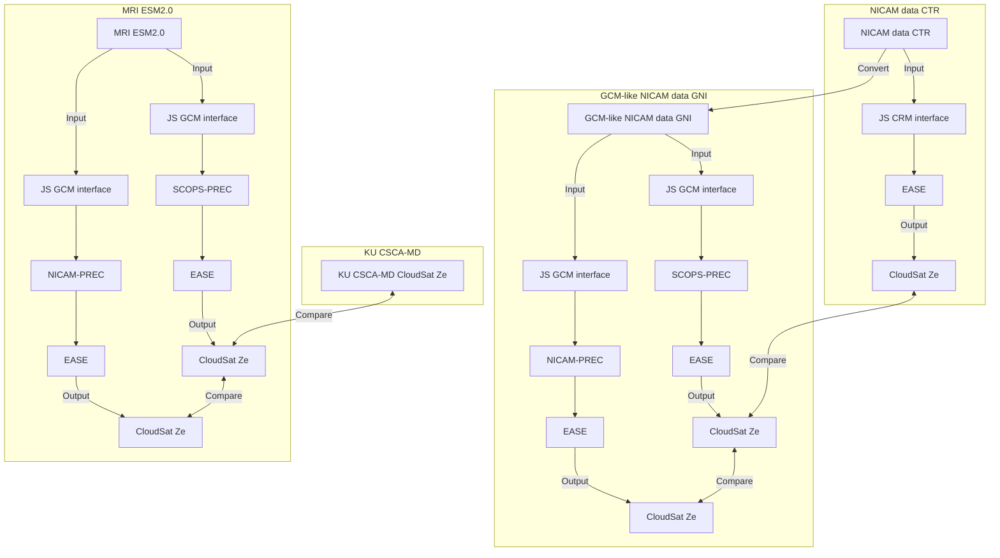
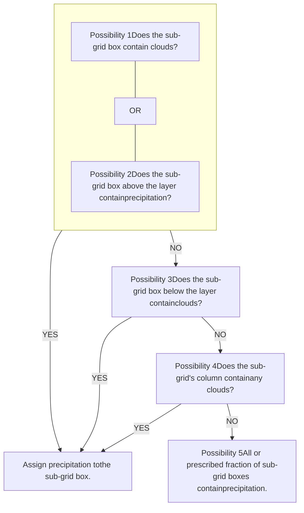
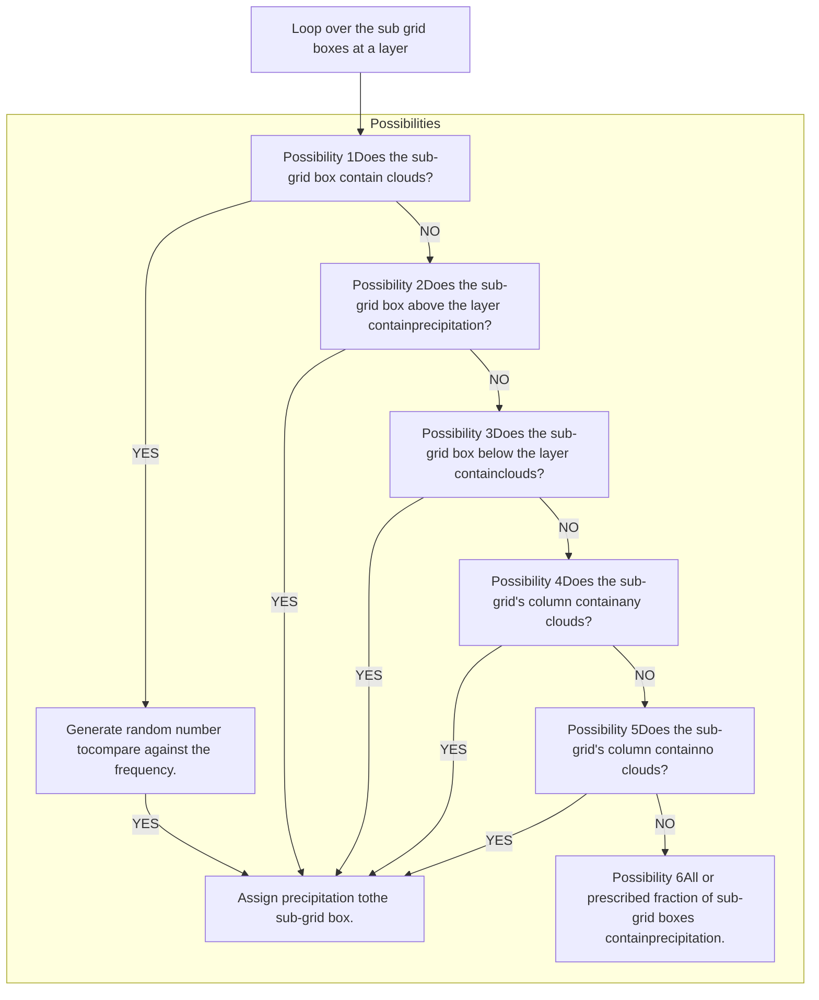

AGU ADVANCING EARTH AND SPACE SCIENCES logo

# JGR Atmospheres

Check for updates icon

RESEARCH ARTICLE

10.1029/2024JD042597

# A Sub-Grid Precipitation Generator Based on NICAM for Simulating Cloud Radar Signals With GCMs

Key Points:

* Precipitation fraction generation can be improved by introducing the probability of occurrence from global storm-resolving models

* Sub-grid precipitation mass fluxes can be generated with a generalized gamma distribution

* The disagreement in simulated reflectivity between the two generators was found significant in the tropics

Tempei Hashino1, Masaki Satoh2, Takuji Kubota3, Tsuyoshi Koshiro4, Kozo Okamoto4, Yuichiro Hagihara5, Hajime Okamoto6, and Tatsuya Seiki7

1Engineering Science, Kochi University of Technology, Kami, Japan, 2Atmosphere and Ocean Research Institute, The University of Tokyo, Tokyo, Japan, 3Japan Aerospace Exploration Agency, Tsukuba, Japan, 4Meteorological Research Institute, Japan Meteorological Agency, Tsukuba, Japan, 5Radio Research Institute, National Institute of Information and Communications Technology, Koganei, Tokyo, Japan, 6Research Institute for Applied Mechanics, Kyushu University, Kasuga, Japan, 7Japan Agency for Marine-Earth Science and Technology, Yokohama, Japan

**Supporting Information:**

Supporting Information may be found in the online version of this article.

**Correspondence to:**

T. Hashino, hashino.tempei@kochi-tech.ac.jp

**Citation:**

Hashino, T., Satoh, M., Kubota, T., Koshiro, T., Okamoto, K., Hagihara, Y., et al. (2025). A sub-grid precipitation generator based on NICAM for simulating cloud radar signals with GCMs. *Journal of Geophysical Research: Atmospheres*, 130, e2024JD042597. [https://doi.org/10.1029/2024JD042597](https://doi.org/10.1029/2024JD042597)

Received 1 OCT 2024
Accepted 19 MAY 2025

**Author Contributions:**

**Conceptualization:** Tempei Hashino
**Data curation:** Yuichiro Hagihara, Hajime Okamoto, Tatsuya Seiki
**Formal analysis:** Tempei Hashino, Tsuyoshi Koshiro
**Funding acquisition:** Tempei Hashino, Takuji Kubota
**Investigation:** Tempei Hashino, Tatsuya Seiki
**Methodology:** Tempei Hashino
**Project administration:** Tempei Hashino, Takuji Kubota
**Software:** Tempei Hashino
**Supervision:** Masaki Satoh, Kozo Okamoto
**Visualization:** Tempei Hashino, Tsuyoshi Koshiro

**Abstract** The forward simulation of radar reflectivity requires details of clouds and precipitation from general circulation models (GCMs). But such details are represented as sub-grid processes that involve parameterizations and assumptions about the spatial coverage and thus depend on the GCM. In this research, we propose the use of a statistical method to generate sub-grid precipitation for generic use. The sub-grid variability is obtained from simulation with a global storm-resolving model called NICAM (non-hydrostatic icosahedral atmospheric model). The proposed method first generates sub-grid precipitation masks based on probabilistic scenarios and then sub-grid precipitation rates are generated from the generalized gamma distribution for the given cloud fraction and grid-scale precipitation rates. Compared to the standard method (which neglects the probabilities) that overestimates the precipitation fraction, our method well reproduces the NICAM data set profiles of both the precipitation fraction and the radar-based cloud fraction. The in-cloud signal frequencies are also reproduced, although less accurately over a tropical region. Inclusion of sub-grid variability in precipitation rates was particularly important for the tropical region to obtain agreement of the precipitation fraction. Application of the two methods to a GCM shows it to have a robust bias for low-level liquid clouds. Furthermore, the sub-grid variability of precipitation led to more occurrences of the small signals, particularly for a range of high precipitation rates. The proposed method was designed to produce geographically dependent sub-grid variability in precipitation, indicating an effective way to use a global storm-resolving model to evaluate conventional GCMs.

**Plain Language Summary** To improve climate predictions, it is critical to carefully evaluate how well clouds and precipitation are simulated with general circulation models (GCMs). To this end, global satellite data can be effectively compared against sensor signals that are calculated based on clouds and precipitation output from GCMs. However, clouds and precipitation are parameterized as a sub-grid process, and usually no outputs for sub-grid processes are available. Instead, they are generated in a satellite sensor simulator. An issue is that the sub-grid representation of these can vary widely amongst GCMs. In this manuscript, we present a statistical framework to generate sub-grid precipitation for the purpose of simulating cloud radar signals for GCMs. We use a data set obtained with a global storm-resolving model (GSRM) and construct relationships between sub-grid clouds and precipitation, as well as derive parameters that determine sub-grid precipitation rates. As a key result, we are able to reproduce the radar signals as well as the precipitation rates. We also point out that parameterization of the sub-grid variability in precipitation can be used to identify robust characteristics of GCMs. We demonstrate that outputs from GSRMs help parameterize regional dependency of sub-grid precipitation fluxes across the globe.

## 1. Introduction

Clouds and precipitation play a central role in regional and global hydrological cycles and energy budgets. In particular, the global assessment of simulated clouds and precipitation systems by weather forecasting models and climate models requires the use of satellite data and forward simulation of satellite signals that are based on outputs from numerical models. The forward simulation of satellite sensor signals makes use of software packages that handle visible-IR, microwave passive and active sensors (e.g., CRTM (B. T. Johnson et al., 2023), ECSIM (Donovan et al., 2023), RTTOV (Saunders et al., 2018), and SDSU (Masunaga et al., 2010)). Also,

© 2025. The Author(s). This is an open access article under the terms of the Creative Commons Attribution License, which permits use, distribution and reproduction in any medium, provided the original work is properly cited.

HASHINO ET AL.

1 of 29

---

21698996, 2025, 11, Downloaded from https://agupubs.onlinelibrary.wiley.com/doi/10.1029/2024JD042597 by Capes, Wiley Online Library on [16/07/2026]. See the Terms and Conditions (https://onlinelibrary.wiley.com/terms-and-conditions) on Wiley Online Library for rules of use; OA articles are governed by the applicable Creative Commons License

AGU ADVANCING EARTH AND SPACE SCIENCES logo

# Journal of Geophysical Research: Atmospheres

10.1029/2024JD042597

**Writing – original draft:**
Tempei Hashino, Tsuyoshi Koshiro
**Writing – review & editing:**
Tempei Hashino, Masaki Satoh, Takuji Kubota, Tsuyoshi Koshiro, Kozo Okamoto, Yuichiro Hagihara, Hajime Okamoto, Tatsuya Seiki

various radiative transfer models have been widely used to both (a) develop retrieval algorithms for the relevant geophysical quantities (e.g., Hagihara et al., 2023; Liu et al., 2022; M. Wang et al., 2023) and (b) calculate the data assimilation operator (e.g., Geer et al., 2019; K. Okamoto et al., 2021). In particular, synergetic use of satellite sensors and associated software has enabled model developers to evaluate atmospheric numerical models directly from the radiative parameters (e.g., Imura & Michibata, 2022; Matsui et al., 2016; Suzuki et al., 2015).

To evaluate the vertical profiles of cloud and precipitation particles that are simulated by atmospheric numerical models, researchers use atmospheric lidars such as CALIOP (cloud-aerosol lidar with orthogonal polarization) (Winker et al., 2003) and cloud/precipitation radars such as CloudSat CPR (Stephens et al., 2008). For the global storm-resolving model (GSRM), NICAM (Satoh et al., 2014), Hashino et al. (2013) introduced the BETTER (beta-temperature, radar-conditioned) diagram that is constructed with the lidar backscatter conditioned on radar reflectivity ranges that can be used to diagnose the hydrometeor effective radius and cloud water content. BETTER was later combined successfully to CERES broadband fluxes over the Arctic (Hashino et al., 2016). More recently, a way to diagnose the thermodynamic phases of cloud particles was introduced by Roh et al. (2020) using the depolarization ratio and a cloud extinction proxy. To examine cloud microphysics of cirrus clouds, Seiki et al. (2015) used the cloud optical depth as a vertical axis, finding that a better representation of the clouds requires a vertical grid spacing of 400 m or less. Furthermore, improvements on the double-moment cloud microphysics scheme in NICAM have been achieved by using both CFAD (contoured frequency by altitude diagram, Yuter and Houze (1995)076<1907:CFBADF>2.0.CO;2)) of the radar reflectivity and CERES observations (Seiki & Ohno, 2023). Simulated clouds in GCMs have been evaluated with cloud radar and lidar, particularly using COSP (Cloud Feedback Model Intercomparison Project Observation Simulator Package; Bodas-Salcedo et al., 2011; Swales et al., 2018) (see e.g., Cesana & Chepfer, 2013). Konsta et al. (2022) found that the simulated CALIPSO and PARASOL signals from GCMs in the Coupled Model Intercomparison Project (CMIP6, see Eyring et al., 2016) underestimated low-level cloud cover while overestimating cloud reflectance over the tropics.

Validation of clouds and precipitation simulated by GCMs is not as easy as that for GSRMs and cloud resolving models (CRMs) because (a) the representation of clouds and precipitation in GCMs involves the concept of spatial "fraction" in a grid box and (b) their variability in the grid is parameterized (e.g., Forbes & Tompkins, 2011; Haynes et al., 2007; Kawai et al., 2019). This parameterization of variability must be appropriately considered in the forward radiative transfer simulations so as to connect calculated signals and the model formulation. As for the clouds, their variability in GCMs is often generated using the maximum-random overlap scheme (Klein & Jakob, 1999012<3132:COIRTM>2.0.CO;2)) in the simulator based on the cloud fraction outputs of the GCM, a method widely used for radiative heating calculations. However, precipitation is treated as a grid-scale mass flux, with the precipitation fraction typically not available as an output. Therefore, when the satellite sensor in the model evaluation is sensitive to precipitating particles, the relevant sensor simulator must generate subgrid-scale precipitation fluxes. The subcolumn cloud generator in COSP (called SCOPS) with the maximum-random overlap scheme was evaluated based on the "scenes" constructed using two CloudSat cloud products by Oreopoulos et al. (2022), showing that another generator with parameterization of decorrelation lengths of cloudy layers and cloud optical depth PDFs outperformed SCOPS. COSP is also equipped with a simple method to generate sub-grid precipitation fraction and fluxes (SCOPS-PREC), which was evaluated with the multiscale modeling framework (MMF) with use of CloudSat simulator (Hillman et al., 2018; Song et al., 2018). Overestimation of occurrences of large reflectivity values and narrow distribution with the CFAD were found in both the studies. Hillman et al. (2018) emphasized the importance of introducing the sub-grid variability in the fluxes as well as constraining the precipitation occurrences to reproduce the signals from embedded CRM in the GCM.

The aim of this paper is to propose an improved method to generate sub-grid precipitation occurrence and precipitation mass fluxes that can be used to evaluate such GCM output. As such, the method may help to improve the simulation of clouds and precipitation in GCMs. We use a comprehensive satellite sensor simulator called Joint-Simulator (Hashino et al., 2013), which uses cloud resolving model outputs to simulate four sensors of EarthCARE satellite (Illingworth et al., 2015), namely the cloud profiling radar with Doppler capability, atmospheric lidar (ATLID), multi-spectral imager (MSI), and the broadband radiometer (BBR). The subgrid generator is developed using the NICAM global storm resolving simulation in which cloud and precipitation processes are consistently parameterized with a cloud microphysics scheme and without assumption of the sub-grid variability. The subgrid precipitation by the proposed method can be examined through a forward simulation using the original and generated data sets. Furthermore, we apply the proposed method to output from MRI-ESM2.0 (Yukimoto, Kawai, et al., 2019), a GCM that participates in CMIP6.

HASHINO ET AL.

2 of 29

---

21698996, 2025, 11, Downloaded from https://agupubs.onlinelibrary.wiley.com/doi/10.1029/2024JD042597 by Capes, Wiley Online Library on [16/07/2026]. See the Terms and Conditions (https://onlinelibrary.wiley.com/terms-and-conditions) on Wiley Online Library for rules of use; OA articles are governed by the applicable Creative Commons License

AGU ADVANCING EARTH AND SPACE SCIENCES logo

# Journal of Geophysical Research: Atmospheres

10.1029/2024JD042597

Figure 1. Forward simulation work flow in this study. JS stands for Joint‐Simulator. Two kinds of sub‐grid precipitation generators (SCOPS‐PREC and NICAM‐PREC) are applied to the GCM inputs.

In the next section, we describe the simulation data sets and reference observation data sets. Section 3 describes the proposed methods to generate sub‐grid precipitation occurrence and fluxes. In Sections 4 and 5 we use a NICAM data set and application to a GCM data set to evaluate the methods. Section 6 provides conclusion and outlooks on the sub‐grid generation.

## 2. Data Sets

### 2.1. CloudSat‐CALIPSO Merged Data Set

For a reference data set, we use the KU CloudSat–CALIPSO merged data set (CSCA‐MD) (Hagihara et al., 2010), a combined data set of CloudSat and CALIPSO observations. The CSCA‐MD data set consists of KU‐obs (Kyushu University observables), KU‐mask (cloud mask products), KU‐type (cloud particle type products), and KU‐micro (cloud microphysics products). The KU‐obs contains vertical profiles of CloudSat radar reflectivity and CALIOP backscattering coefficients that have been adjusted to the CloudSat vertical grid of 240 m and a horizontal resolution of 1.1 km. The KU‐mask includes four types of cloud masks based on the radar and lidar signals. In this study, a radar‐based cloud mask called C1 is applied for detecting cloud occurrences (see Hashino et al., 2016 for details). Also, so we can categorize the vertical profiles based on surface precipitation rate over the ocean, we collocated the surface precipitation retrieval product 2C‐PRECIP‐COLUMN (Haynes et al., 2009) onto the CSCA‐MD horizontal grid. KU CSCA‐MD is shown at bottom left in the flow diagram of Figure 1.

### 2.2. Simulation Data Sets

From June 15 06Z to 25 00Z of 2008, we ran a low‐resolution simulation with NICAM by following the numerical settings described in Hashino et al. (2013). The horizontal resolution is about 14 km. We consider this resolution

HASHINO ET AL. 3 of 29

---

21698996, 2025, 11, Downloaded from https://agupubs.onlinelibrary.wiley.com/doi/10.1029/2024JD042597 by Capes, Wiley Online Library on [16/07/2026]. See the Terms and Conditions (https://onlinelibrary.wiley.com/terms-and-conditions) on Wiley Online Library for rules of use; OA articles are governed by the applicable Creative Commons License

AGU ADVANCING EARTH AND SPACE SCIENCES logo

# Journal of Geophysical Research: Atmospheres

10.1029/2024JD042597

to be adequate for testing our proposed methodology since this resolution enables us to handle the data set with less computation time and it has been used to study GCM cloud inhomogeneity (Hotta et al., 2020). However, we note that meso-scale variability that may exist in satellite observations of 1-km resolution is not resolved with this simulation data set, which is a source of uncertainty in the analysis. For the cloud microphysics scheme in NICAM, we chose the single-moment bulk scheme NSW6 because it is a best-practice scheme widely used in GSRMs (Seiki et al., 2022). The input variables to Joint-Simulator necessary to simulate the radar signals are listed in Table 1. NSW6 consists of two categories for liquid particles (cloud and rain drops) and three categories for ice particles (cloud ice, snow, and graupel) among which water mass is transferred. The data from 20 06Z to 25 00Z with 6-hr intervals are considered for the evaluation. Hereafter, this data set is referred to as CTR (top left of diagram in Figure 1).

**Table 1**
*NICAM Outputs Used as Input to Joint-Simulator*

<table>
  <thead>
    <tr>
        <th>Name</th>
        <th>Description</th>
    </tr>
  </thead>
  <tbody>
    <tr>
        <td>z</td>
<td>Altitude of model full-levels</td>
    </tr>
<tr>
        <td>zz</td>
<td>Altitude of model half-levels</td>
    </tr>
<tr>
        <td>W</td>
<td>Vertical wind velocity</td>
    </tr>
<tr>
        <td>P</td>
<td>Air pressure</td>
    </tr>
<tr>
        <td>T</td>
<td>Air temperature</td>
    </tr>
<tr>
        <td>SLP</td>
<td>Sea level pressure</td>
    </tr>
<tr>
        <td>Qv</td>
<td>Vapor mixing ratio</td>
    </tr>
<tr>
        <td>Qc</td>
<td>Cloud mixing ratio</td>
    </tr>
<tr>
        <td>Qr</td>
<td>Rain mixing ratio</td>
    </tr>
<tr>
        <td>Qi</td>
<td>Cloud ice mixing ratio</td>
    </tr>
<tr>
        <td>Qs</td>
<td>Snow mixing ratio</td>
    </tr>
<tr>
        <td>Qg</td>
<td>Graupel mixing ratio</td>
    </tr>
  </tbody>
</table>

To estimate the uncertainty due to the sub-grid generation of cloud and precipitation fields, we used the NICAM data set to construct a coarse-resolution GCM-like data set (hereafter, GNI). The construction involved averaging the variables in an icosahedral grid of NICAM into a 2.5 × 2.5°

latitude–longitude grid with a 200-m vertical resolution, which gives about 390 samples over the tropics and 100 samples over the 75°N band for each single time output per grid box. The cloud fraction of a lat–lon grid box is defined as follows. We set the cloudiness flag (0 or 1) according to whether or not the cloud water content exceeds 10−5 g m−3, and determine the cloud water content from the cloud water and cloud ice mixing ratios in the original icosahedral grid. For the cloud fraction, we average the flag over the icosahedral grids whose centers are in the lat–lon grid box. To designate cloud type, we apply a simple stratiform/convective mask to the profiles of the cloud mixing ratios. A vertical profile is defined as convective if at least one grid box has a vertical wind speed exceeding 1 m s−1, otherwise it is stratiform. The same method is applied to the grid-mean effective radius of cloud categories (cloud water and cloud ice) and to the precipitation mass fluxes of precipitation categories (rain, snow, and graupel). We end up with 10 categories of hydrometeors: stratiform/convective cloud water and ice, and stratiform/convective rain, snow, and graupel. Finally, other thermodynamical, dynamical, and microphysical variables in the lat–lon grid are calculated, but without use of any flags. The GNI is shown at top right of Figure 1.

One of the GCMs participating in CMIP6 is MRI-ESM2.0. For this model's 2008 AMIP experiment, the variables in the CF3hr table defined by CMIP6, which are the 3-hourly thermodynamical and hydrometeor-related variables corresponding to the inputs to COSP, are available from the Earth System Grid Federation (ESGF). For June 2008, we used the CF3hr variables listed in Table 2. The grid sizes are 320 points in longitude and 160 points in latitude with 80 vertical levels, which gives 1.125 × 1.125° resolution. Also, six categories of hydrometeors are put into Joint-Simulator: stratiform cloud water and ice categories as well as precipitating particles (rain and snow) in both convective and stratiform categories.

## 2.3. Forward Simulation of Sensor Signals

To generate the simulated satellite output, we apply Joint-Simulator to the output of the CTR, GNI, and MRI-ESM2.0 data sets (Figure 1). Forward simulation of CTR is simple because there is no concept of sub-grid scale in the cloud/precipitation variables in the NICAM outputs; the single grid box is either totally occupied by clouds or nothing, and cloud fraction is not required as input. The mixing ratios (Qc, Qr, Qi, Qs, Qg in Table 1) are input into the sensor simulators through the CRM interface (Figure 1). CRMs generally have a cloud microphysics scheme that assumes particle size distributions (PSDs) and mass-dimensional (m-D) relationships. The CTR forward simulation uses those from NSW6 to ensure consistency between the simulated signals and the model assumption (see Table 2 of Hashino et al. (2013)).

In contrast, the GCM application requires sub-grid scale fields to be generated before running the forward simulation. Joint-Simulator has a sub-grid generator based on grid-scale inputs and parameterization for this purpose (Figure 1), similar to that in COSP. In GCMs, the inhomogeneity of clouds in each resolved column of the atmosphere is usually parameterized for calculating the radiative heating/cooling rates and fluxes. When it comes

HASHINO ET AL.

4 of 29

---

21698996, 2025, 11, Downloaded from https://agupubs.onlinelibrary.wiley.com/doi/10.1029/2024JD042597 by Capes, Wiley Online Library on [16/07/2026]. See the Terms and Conditions (https://onlinelibrary.wiley.com/terms-and-conditions) on Wiley Online Library for rules of use; OA articles are governed by the applicable Creative Commons License

AGU ADVANCING EARTH AND SPACE SCIENCES logo

Journal of Geophysical Research: Atmospheres

10.1029/2024JD042597

**Table 2**
*MRI ESM2.0 Outputs Used for Joint-Simulator*

<table>
  <thead>
    <tr>
        <th>Name</th>
        <th>Description</th>
    </tr>
  </thead>
  <tbody>
    <tr>
        <td>zfull</td>
<td>Altitude of model full-levels</td>
    </tr>
<tr>
        <td>zhalf</td>
<td>Altitude of model half-levels</td>
    </tr>
<tr>
        <td>ta</td>
<td>Air temperature</td>
    </tr>
<tr>
        <td>h2o</td>
<td>Total water mixing ratio</td>
    </tr>
<tr>
        <td>cls</td>
<td>Stratiform cloud fraction</td>
    </tr>
<tr>
        <td>clws</td>
<td>Mass fraction of stratiform cloud liquid water</td>
    </tr>
<tr>
        <td>clis</td>
<td>Mass fraction of stratiform cloud ice</td>
    </tr>
<tr>
        <td>reffclws</td>
<td>Effective radius of stratiform cloud liquid water</td>
    </tr>
<tr>
        <td>reffciws</td>
<td>Effective radius of stratiform cloud ice</td>
    </tr>
<tr>
        <td>prcprof</td>
<td>Convective rainfall mass flux</td>
    </tr>
<tr>
        <td>prlsprof</td>
<td>Stratiform rainfall mass flux</td>
    </tr>
<tr>
        <td>prsnc</td>
<td>Convective snowfall mass flux</td>
    </tr>
<tr>
        <td>prlsns</td>
<td>Stratiform snowfall mass flux</td>
    </tr>
  </tbody>
</table>

to linking the model errors found in the analysis to the model parameterization, the consistency between the cloud generation schemes in the forward simulator and in GCMs is particularly important. As the sub-grid cloud distribution is not provided from MRI ESM2.0, we generate the overlaps of sub-grid cloud layers by using the simulated grid-scale 3D cloud fraction, which uses the maximum-random overlap scheme (Klein & Jakob, 1999). Here, the stratiform cloud fraction (Table 2) is input to the generator, resulting in 81 sub-columns for each column to satisfy the cloud fraction input at each layer. As the convective cloud fraction is not available, we assume a precipitation fraction equal to 5% of the sub-columns, which is the default in COSP (Zhang et al., 2010).

For the GCM case, another difference from the CRM application is that the sub-grid values of cloud and precipitation variables must be determined. For these variables, six hydrometeor categories are considered for the MRI ESM2.0 data set with six grid-scale variables: mass fractions of stratiform cloud water (clws) and cloud ice (clis) plus the stratiform and convective mass fluxes of both rain (prlsprof, prcprof) and snow (prlsns, prsnc). These six are listed in Table 2. As in COSP, the sub-grid mixing ratios of cloud water and cloud ice are set to the grid-scale value divided by the stratiform cloud fraction (cls). The effective radius of cloud water and ice, which control the single-scattering characteristics in the shortwave, are directly input without

sub-grid variation. With this method, no sub-grid variability exists in the active sensor signals associated with cloud particles except for the attenuation due to vertical overlaps.

The particle size distributions and mass-dimensional relationships assumed for the forward simulation of the MRI ESM2.0 data set are listed in Table 3. (Differing from CRMs, many GCMs instead make no explicit assumption on these relationships for cloud and precipitating particles in the numerical schemes.) However, here we apply the MMF-v3-Single-Moment setting available in COSP to the PSDs and m-D and velocity-diameter (v-D) relationships. The sub-grid generation of precipitation is described in the next section.

For the GCM forward simulation (i.e., MRI ESM2.0), the thermodynamical variables, such as air temperature and specific humidity, as well as the wind, at sub-grid scales are assumed to be the same as the grid-scale values.

**Table 3**
*Parameters Used in the Forward Calculation With MRI ESM2.0*

<table>
  <thead>
    <tr>
        <th>Particle size distribution</th>
        <th>Specified parameters</th>
        <th>Fixed density or m-D relation</th>
        <th>Fixed terminal velocity or v-D relation</th>
    </tr>
  </thead>
  <tbody>
    <tr>
        <td colspan="4">Cloud water</td>
    </tr>
<tr>
        <td>Lognormala</td>
<td>$D_n = 6 \times 10^{-4}$ [cm] $\sigma = 0.3$</td>
<td>1 [g cm-3]</td>
<td>0 [cm s-1]</td>
    </tr>
<tr>
        <td colspan="4">Stratiform rain, convective rain</td>
    </tr>
<tr>
        <td>Inverse exponentialb</td>
<td>$N_0 = 0.08$ [cm-4]</td>
<td>1 [g cm-3]</td>
<td>$c = 2115$ $d = 0.8$ [cgs]</td>
    </tr>
<tr>
        <td colspan="4">Cloud ice</td>
    </tr>
<tr>
        <td>Gammac</td>
<td>$N_0 = 750$ [cm-4]</td>
<td>$a = 0.1677$ $b = 2.91$ [cgs]</td>
<td>0 [cm s-1]</td>
    </tr>
<tr>
        <td colspan="4">Stratiform snow, convective snow</td>
    </tr>
<tr>
        <td>Inverse exponentialb</td>
<td>$N_0 = 0.03$ [cm-4]</td>
<td>0.1 [g cm-3]</td>
<td>$c = 153.1$ $d = 0.25$ [cgs]</td>
    </tr>
  </tbody>
</table>

Note. Values come from the MMF-V3-Single-Moment setting available in COSP. $D$ is the diameter or maximum dimension of hydrometeors. a$N(D) = \frac{N_T}{D\sigma\sqrt{2\pi}} \exp\left(-\frac{1}{2} \left(\frac{\log(D/D_n)}{\sigma}\right)^2\right)$. b$N(D) = N_0 \exp(-\lambda D)$. c$N(D) = N_0 D^2 \exp(-\lambda D)$.

HASHINO ET AL.

5 of 29

---

21698996, 2025, 11, Downloaded from https://agupubs.onlinelibrary.wiley.com/doi/10.1029/2024JD042597 by Capes, Wiley Online Library on [16/07/2026]. See the Terms and Conditions (https://onlinelibrary.wiley.com/terms-and-conditions) on Wiley Online Library for rules of use; OA articles are governed by the applicable Creative Commons License

AGU ADVANCING EARTH AND SPACE SCIENCES logo

Journal of Geophysical Research: Atmospheres

10.1029/2024JD042597

Figure 2. The SCOPS‐PREC deterministic assignment of subgrid precipitation. It is implemented layer by layer from the model top to the bottom only when a positive grid‐scale precipitation flux is present at the layer.

For the coarse‐resolution GCM‐like data set, or GNI, the same method used for MRI ESM2.0 is applied in the forward calculation (Figure 1). But, to help evaluate the proposed parameterization, both the stratiform and convective cloud fractions are input. Also, as described in the previous section, the mixing ratio and effective radius are used for cloud categories, and mass fluxes are used for precipitating particles. The PSDs, m‐D, and v‐D relationships of the 10 categories of hydrometers are assumed to be the same as those for CTR.

Finally, sub‐grid columns of the atmosphere are individually input into the sensor simulator EASE (earthCARE active sensor simulator for radar and lidar) (Nishizawa et al., 2008; H. Okamoto et al., 2008). EASE calculates attenuated 95 GHz radar reflectivity by considering the attenuation from both hydrometeors and water vapor. Even though EASE included non‐spherical scattering models, we use the Mie approximation with a volume‐equivalent sphere approach for simplicity. To reduce computational burden, the MRI‐ESM2.0 data set is input every 15 hr, and the grid boxes are sampled with every four grid boxes.

# 3. Parameterizing Sub‐Grid Precipitation

## 3.1. Sub‐Grid Precipitation Generation

For generating sub‐grid precipitation distribution, we evaluate two methods: SCOPS‐PREC (Zhang et al., 2010), which is the COSP default, and NICAM‐PREC, our proposed method. SCOPS‐PREC, like many other sub‐grid generation methods for precipitation, is neither physically nor statistically constructed, although the cloud overlaps have been evaluated against observations and CRMs (see O’Dell et al., 2007 and references therein).

SCOPS‐PREC generates sub‐grid precipitation based on the sub‐grid cloud distribution and grid‐scale precipitation fluxes. Five conditions called Possibilities are evaluated from the model top to the bottom when the precipitation flux at a layer is positive (Figure 2). Possibilities 1 and 2 (P1 and P2) consider the existence of sub‐grid cloudiness in the layer or precipitation above the layer. If P1 or P2 (or both) is true, then precipitation is assigned to the sub‐grid box. Otherwise, P3 checks if the sub‐grid cloud below the layer is cloudy. If not, then P4 tests the cloudiness of the sub‐grid column from top to bottom, assigning sub‐grid precipitation when at least one of the sub‐grids is cloudy. Finally, P5 generates sub‐grid precipitation with a pre‐defined fraction when no clouds

HASHINO ET AL.

6 of 29

---

AGU ADVANCING EARTH AND SPACE SCIENCES logo

Journal of Geophysical Research: Atmospheres

10.1029/2024JD042597

21698996, 2025, 11, Downloaded from https://agupubs.onlinelibrary.wiley.com/doi/10.1029/2024JD042597 by Capes, Wiley Online Library on [16/07/2026]. See the Terms and Conditions (https://onlinelibrary.wiley.com/terms-and-conditions) on Wiley Online Library for rules of use; OA articles are governed by the applicable Creative Commons License

Loop over the sub grid boxes at a layer

**Figure 3.** NICAM‐PREC probabilistic assignment of subgrid precipitation. Possibilities 1–5 are allowed to occur in a resolved grid box. Similarly to SCOPS‐PREC, it is implemented only when a grid‐scale precipitation flux is positive at a layer.

exist in the sub‐column. Note that sub‐grid precipitation is not assigned to a sub‐grid of the layer when the grid‐scale precipitation flux is zero.

NICAM‐PREC improves upon SCOPS‐PREC by introducing the estimated probabilities for each of SCOPS‐PREC's five possibilities (Figure 3). These probabilities come from the NICAM data set. As in SCOPS‐PREC, only layers with positive precipitation fluxes are considered for precipitation generation. However, unlike SCOPS‐PREC, with NICAM‐PREC we evaluate the five possibilities for a given sub‐grid box in sequence at a single layer. The evaluations are done as follows. First, if the P1 condition is satisfied, a random number is generated. If the random number is smaller than the occurrence of P1 obtained from the NICAM data set, then we assign precipitation to the sub‐grid box. Otherwise, we move on and repeat the procedure for P2. If neither P1 nor P2 generates precipitation for the sub‐grid box, then P3 is evaluated by considering the existence of sub‐grid clouds below the layer. As the sub‐grid cloud itself is generated by a maximum‐random scheme, it may not possess the vertical relationship that exists in the NICAM data set. Therefore, the fraction of the sub‐grid cloudiness is first calculated for the whole lower layer, and if a random number generated is below this value, then P3 is satisfied. And if another random number is below the P3 occurrence from the data set, then sub‐grid precipitation is assigned to the sub‐grid box. Next, P4 generates the sub‐grid precipitation when sub‐grid clouds exist in the sub‐column at any layer and a random number generated is smaller than the P4 probability. Similarly, P5 generates sub‐grid precipitation when no clouds exist in the sub‐column. For instance, P5 precipitation occurs where precipitating particles contained in anvil clouds are advected into the surrounding sub‐columns. If none of the possibilities lead to generation of sub‐grid precipitation for the layer, then we apply P6 in which sub‐grid precipitation is deterministically assigned to sub‐grid boxes based on a user‐defined fraction (usually 5%, the default in COSP).

HASHINO ET AL.

7 of 29

---

21698996, 2025, 11, Downloaded from https://agupubs.onlinelibrary.wiley.com/doi/10.1029/2024JD042597 by Capes, Wiley Online Library on [16/07/2026]. See the Terms and Conditions (https://onlinelibrary.wiley.com/terms-and-conditions) on Wiley Online Library for rules of use; OA articles are governed by the applicable Creative Commons License

AGU ADVANCING EARTH AND SPACE SCIENCES logo

Journal of Geophysical Research: Atmospheres

10.1029/2024JD042597

<table>
  <thead>
    <tr>
        <th colspan="6">a) TWP</th>
    </tr>
<tr>
        <th>Height [km]</th>
        <th>P1</th>
        <th>P2</th>
        <th>P3</th>
        <th>P4*10</th>
        <th>P5*10</th>
    </tr>
  </thead>
  <tbody>
    <tr>
        <td>0</td>
<td>1.00</td>
<td>0.10</td>
<td>0.00</td>
<td>0.00</td>
<td>0.00</td>
    </tr>
<tr>
        <td>1</td>
<td>1.00</td>
<td>0.15</td>
<td>0.00</td>
<td>0.00</td>
<td>0.00</td>
    </tr>
<tr>
        <td>2</td>
<td>1.00</td>
<td>0.20</td>
<td>0.00</td>
<td>0.00</td>
<td>0.00</td>
    </tr>
<tr>
        <td>3</td>
<td>1.00</td>
<td>0.30</td>
<td>0.00</td>
<td>0.00</td>
<td>0.00</td>
    </tr>
<tr>
        <td>4</td>
<td>1.00</td>
<td>0.45</td>
<td>0.00</td>
<td>0.00</td>
<td>0.00</td>
    </tr>
<tr>
        <td>5</td>
<td>1.00</td>
<td>0.60</td>
<td>0.00</td>
<td>0.00</td>
<td>0.00</td>
    </tr>
<tr>
        <td>6</td>
<td>1.00</td>
<td>0.55</td>
<td>0.10</td>
<td>0.00</td>
<td>0.00</td>
    </tr>
<tr>
        <td>7</td>
<td>1.00</td>
<td>0.50</td>
<td>0.20</td>
<td>0.00</td>
<td>0.00</td>
    </tr>
<tr>
        <td>8</td>
<td>1.00</td>
<td>0.45</td>
<td>0.35</td>
<td>0.00</td>
<td>0.00</td>
    </tr>
<tr>
        <td>9</td>
<td>1.00</td>
<td>0.40</td>
<td>0.50</td>
<td>0.00</td>
<td>0.00</td>
    </tr>
<tr>
        <td>10</td>
<td>1.00</td>
<td>0.35</td>
<td>0.65</td>
<td>0.00</td>
<td>0.00</td>
    </tr>
<tr>
        <td>11</td>
<td>1.00</td>
<td>0.30</td>
<td>0.75</td>
<td>0.00</td>
<td>0.00</td>
    </tr>
<tr>
        <td>12</td>
<td>1.00</td>
<td>0.25</td>
<td>0.85</td>
<td>0.00</td>
<td>0.00</td>
    </tr>
<tr>
        <td>13</td>
<td>1.00</td>
<td>0.20</td>
<td>0.90</td>
<td>0.00</td>
<td>0.00</td>
    </tr>
<tr>
        <td>14</td>
<td>0.95</td>
<td>0.15</td>
<td>0.95</td>
<td>0.10</td>
<td>0.00</td>
    </tr>
<tr>
        <td>15</td>
<td>0.80</td>
<td>0.10</td>
<td>0.90</td>
<td>0.20</td>
<td>0.00</td>
    </tr>
<tr>
        <td>16</td>
<td>0.60</td>
<td>0.05</td>
<td>0.70</td>
<td>0.30</td>
<td>0.00</td>
    </tr>
<tr>
        <td>17</td>
<td>0.40</td>
<td>0.02</td>
<td>0.40</td>
<td>0.40</td>
<td>0.00</td>
    </tr>
<tr>
        <td>18</td>
<td>0.20</td>
<td>0.01</td>
<td>0.10</td>
<td>0.30</td>
<td>0.00</td>
    </tr>
<tr>
        <td>19</td>
<td>0.05</td>
<td>0.00</td>
<td>0.02</td>
<td>0.10</td>
<td>0.00</td>
    </tr>
<tr>
        <td>20</td>
<td>0.00</td>
<td>0.00</td>
<td>0.00</td>
<td>0.00</td>
<td>0.00</td>
    </tr>
<tr>
        <th colspan="6">b) CAL</th>
    </tr>
<tr>
        <th>Height [km]</th>
        <th>P1</th>
        <th>P2</th>
        <th>P3</th>
        <th>P4*10</th>
        <th>P5*10</th>
    </tr>
<tr>
        <td>0</td>
<td>0.90</td>
<td>0.05</td>
<td>0.00</td>
<td>0.00</td>
<td>0.00</td>
    </tr>
<tr>
        <td>1</td>
<td>0.80</td>
<td>0.10</td>
<td>0.00</td>
<td>0.00</td>
<td>0.00</td>
    </tr>
<tr>
        <td>2</td>
<td>0.70</td>
<td>0.15</td>
<td>0.00</td>
<td>0.00</td>
<td>0.00</td>
    </tr>
<tr>
        <td>3</td>
<td>0.85</td>
<td>0.20</td>
<td>0.00</td>
<td>0.00</td>
<td>0.00</td>
    </tr>
<tr>
        <td>4</td>
<td>0.95</td>
<td>0.30</td>
<td>0.00</td>
<td>0.00</td>
<td>0.00</td>
    </tr>
<tr>
        <td>5</td>
<td>1.00</td>
<td>0.45</td>
<td>0.00</td>
<td>0.00</td>
<td>0.00</td>
    </tr>
<tr>
        <td>6</td>
<td>1.00</td>
<td>0.55</td>
<td>0.05</td>
<td>0.00</td>
<td>0.00</td>
    </tr>
<tr>
        <td>7</td>
<td>1.00</td>
<td>0.65</td>
<td>0.10</td>
<td>0.00</td>
<td>0.00</td>
    </tr>
<tr>
        <td>8</td>
<td>1.00</td>
<td>0.75</td>
<td>0.20</td>
<td>0.00</td>
<td>0.00</td>
    </tr>
<tr>
        <td>9</td>
<td>1.00</td>
<td>0.85</td>
<td>0.30</td>
<td>0.00</td>
<td>0.00</td>
    </tr>
<tr>
        <td>10</td>
<td>1.00</td>
<td>0.90</td>
<td>0.40</td>
<td>0.00</td>
<td>0.00</td>
    </tr>
<tr>
        <td>11</td>
<td>1.00</td>
<td>0.95</td>
<td>0.50</td>
<td>0.00</td>
<td>0.00</td>
    </tr>
<tr>
        <td>12</td>
<td>1.00</td>
<td>0.90</td>
<td>0.60</td>
<td>0.00</td>
<td>0.00</td>
    </tr>
<tr>
        <td>13</td>
<td>1.00</td>
<td>0.80</td>
<td>0.70</td>
<td>0.00</td>
<td>0.00</td>
    </tr>
<tr>
        <td>14</td>
<td>0.90</td>
<td>0.60</td>
<td>0.80</td>
<td>0.05</td>
<td>0.00</td>
    </tr>
<tr>
        <td>15</td>
<td>0.70</td>
<td>0.40</td>
<td>0.70</td>
<td>0.10</td>
<td>0.00</td>
    </tr>
<tr>
        <td>16</td>
<td>0.50</td>
<td>0.20</td>
<td>0.50</td>
<td>0.15</td>
<td>0.00</td>
    </tr>
<tr>
        <td>17</td>
<td>0.30</td>
<td>0.10</td>
<td>0.30</td>
<td>0.10</td>
<td>0.00</td>
    </tr>
<tr>
        <td>18</td>
<td>0.15</td>
<td>0.05</td>
<td>0.15</td>
<td>0.05</td>
<td>0.00</td>
    </tr>
<tr>
        <td>19</td>
<td>0.05</td>
<td>0.02</td>
<td>0.05</td>
<td>0.02</td>
<td>0.00</td>
    </tr>
<tr>
        <td>20</td>
<td>0.00</td>
<td>0.00</td>
<td>0.00</td>
<td>0.00</td>
<td>0.00</td>
    </tr>
<tr>
        <th colspan="6">c) SO</th>
    </tr>
<tr>
        <th>Height [km]</th>
        <th>P1</th>
        <th>P2</th>
        <th>P3</th>
        <th>P4*10</th>
        <th>P5*10</th>
    </tr>
<tr>
        <td>0</td>
<td>0.95</td>
<td>0.05</td>
<td>0.00</td>
<td>0.00</td>
<td>0.10</td>
    </tr>
<tr>
        <td>1</td>
<td>0.90</td>
<td>0.10</td>
<td>0.00</td>
<td>0.00</td>
<td>0.05</td>
    </tr>
<tr>
        <td>2</td>
<td>0.85</td>
<td>0.15</td>
<td>0.05</td>
<td>0.00</td>
<td>0.02</td>
    </tr>
<tr>
        <td>3</td>
<td>0.90</td>
<td>0.20</td>
<td>0.10</td>
<td>0.00</td>
<td>0.01</td>
    </tr>
<tr>
        <td>4</td>
<td>0.95</td>
<td>0.30</td>
<td>0.20</td>
<td>0.00</td>
<td>0.00</td>
    </tr>
<tr>
        <td>5</td>
<td>1.00</td>
<td>0.45</td>
<td>0.35</td>
<td>0.00</td>
<td>0.00</td>
    </tr>
<tr>
        <td>6</td>
<td>1.00</td>
<td>0.60</td>
<td>0.50</td>
<td>0.00</td>
<td>0.00</td>
    </tr>
<tr>
        <td>7</td>
<td>1.00</td>
<td>0.75</td>
<td>0.65</td>
<td>0.00</td>
<td>0.00</td>
    </tr>
<tr>
        <td>8</td>
<td>1.00</td>
<td>0.85</td>
<td>0.75</td>
<td>0.00</td>
<td>0.00</td>
    </tr>
<tr>
        <td>9</td>
<td>1.00</td>
<td>0.95</td>
<td>0.85</td>
<td>0.00</td>
<td>0.00</td>
    </tr>
<tr>
        <td>10</td>
<td>1.00</td>
<td>0.98</td>
<td>0.90</td>
<td>0.00</td>
<td>0.00</td>
    </tr>
<tr>
        <td>11</td>
<td>1.00</td>
<td>0.95</td>
<td>0.85</td>
<td>0.00</td>
<td>0.00</td>
    </tr>
<tr>
        <td>12</td>
<td>1.00</td>
<td>0.85</td>
<td>0.75</td>
<td>0.00</td>
<td>0.00</td>
    </tr>
<tr>
        <td>13</td>
<td>0.95</td>
<td>0.65</td>
<td>0.60</td>
<td>0.00</td>
<td>0.00</td>
    </tr>
<tr>
        <td>14</td>
<td>0.80</td>
<td>0.45</td>
<td>0.45</td>
<td>0.00</td>
<td>0.00</td>
    </tr>
<tr>
        <td>15</td>
<td>0.60</td>
<td>0.25</td>
<td>0.30</td>
<td>0.00</td>
<td>0.00</td>
    </tr>
<tr>
        <td>16</td>
<td>0.40</td>
<td>0.10</td>
<td>0.15</td>
<td>0.00</td>
<td>0.00</td>
    </tr>
<tr>
        <td>17</td>
<td>0.20</td>
<td>0.05</td>
<td>0.05</td>
<td>0.00</td>
<td>0.00</td>
    </tr>
<tr>
        <td>18</td>
<td>0.10</td>
<td>0.02</td>
<td>0.02</td>
<td>0.00</td>
<td>0.00</td>
    </tr>
<tr>
        <td>19</td>
<td>0.05</td>
<td>0.01</td>
<td>0.01</td>
<td>0.00</td>
<td>0.00</td>
    </tr>
<tr>
        <td>20</td>
<td>0.00</td>
<td>0.00</td>
<td>0.00</td>
<td>0.00</td>
<td>0.00</td>
    </tr>
<tr>
        <th colspan="6">d) NP</th>
    </tr>
<tr>
        <th>Height [km]</th>
        <th>P1</th>
        <th>P2</th>
        <th>P3</th>
        <th>P4*10</th>
        <th>P5*10</th>
    </tr>
<tr>
        <td>0</td>
<td>0.90</td>
<td>0.05</td>
<td>0.00</td>
<td>0.00</td>
<td>0.00</td>
    </tr>
<tr>
        <td>1</td>
<td>0.85</td>
<td>0.10</td>
<td>0.00</td>
<td>0.00</td>
<td>0.00</td>
    </tr>
<tr>
        <td>2</td>
<td>0.80</td>
<td>0.15</td>
<td>0.05</td>
<td>0.00</td>
<td>0.00</td>
    </tr>
<tr>
        <td>3</td>
<td>0.85</td>
<td>0.20</td>
<td>0.10</td>
<td>0.00</td>
<td>0.00</td>
    </tr>
<tr>
        <td>4</td>
<td>0.95</td>
<td>0.30</td>
<td>0.20</td>
<td>0.00</td>
<td>0.00</td>
    </tr>
<tr>
        <td>5</td>
<td>1.00</td>
<td>0.45</td>
<td>0.35</td>
<td>0.00</td>
<td>0.00</td>
    </tr>
<tr>
        <td>6</td>
<td>1.00</td>
<td>0.60</td>
<td>0.50</td>
<td>0.00</td>
<td>0.00</td>
    </tr>
<tr>
        <td>7</td>
<td>1.00</td>
<td>0.75</td>
<td>0.65</td>
<td>0.00</td>
<td>0.00</td>
    </tr>
<tr>
        <td>8</td>
<td>1.00</td>
<td>0.85</td>
<td>0.75</td>
<td>0.00</td>
<td>0.00</td>
    </tr>
<tr>
        <td>9</td>
<td>1.00</td>
<td>0.95</td>
<td>0.85</td>
<td>0.00</td>
<td>0.00</td>
    </tr>
<tr>
        <td>10</td>
<td>1.00</td>
<td>0.98</td>
<td>0.90</td>
<td>0.00</td>
<td>0.00</td>
    </tr>
<tr>
        <td>11</td>
<td>1.00</td>
<td>0.95</td>
<td>0.85</td>
<td>0.00</td>
<td>0.00</td>
    </tr>
<tr>
        <td>12</td>
<td>1.00</td>
<td>0.85</td>
<td>0.75</td>
<td>0.00</td>
<td>0.00</td>
    </tr>
<tr>
        <td>13</td>
<td>0.95</td>
<td>0.65</td>
<td>0.60</td>
<td>0.00</td>
<td>0.00</td>
    </tr>
<tr>
        <td>14</td>
<td>0.80</td>
<td>0.45</td>
<td>0.45</td>
<td>0.00</td>
<td>0.00</td>
    </tr>
<tr>
        <td>15</td>
<td>0.60</td>
<td>0.25</td>
<td>0.30</td>
<td>0.00</td>
<td>0.00</td>
    </tr>
<tr>
        <td>16</td>
<td>0.40</td>
<td>0.10</td>
<td>0.15</td>
<td>0.00</td>
<td>0.00</td>
    </tr>
<tr>
        <td>17</td>
<td>0.20</td>
<td>0.05</td>
<td>0.05</td>
<td>0.00</td>
<td>0.00</td>
    </tr>
<tr>
        <td>18</td>
<td>0.10</td>
<td>0.02</td>
<td>0.02</td>
<td>0.00</td>
<td>0.00</td>
    </tr>
<tr>
        <td>19</td>
<td>0.05</td>
<td>0.01</td>
<td>0.01</td>
<td>0.00</td>
<td>0.00</td>
    </tr>
<tr>
        <td>20</td>
<td>0.00</td>
<td>0.00</td>
<td>0.00</td>
<td>0.00</td>
<td>0.00</td>
    </tr>
  </tbody>
</table>

**Figure 4.** Probability of precipitation for the five possibility conditions (P1–P5), as calculated from NICAM. TWP: tropical warm pool; CAL: off the coast of California; SO: Southern Ocean; NP: North Pacific. P4 and P5 are shown multiplied by 10.

The probabilities for P1–P5 are calculated from the NICAM data set and tabulated in terms of 2.5 × 2.5° lat–lon coordinates with 200-m vertical layers. The resulting probabilities depend on the identification of cloud and precipitation particles in the data set. For NSW6, the "cloud" category includes cloud water and cloud ice, and the "precipitation" category includes rain, snow, and graupel. The mass contents of "cloud" and "precipitation" are calculated by adding the mass contents of the corresponding categories. If the mass content of "cloud" ("precipitation") is greater than a threshold mass content of 10−5 g m−3, then the layer is assumed to contain cloud particles (precipitation particles). Probabilities for P1 and P2 are computed independently. For calculating P3, we include only samples that do not satisfy P1 and P2. The same holds for calculating P4 and P5, in order. For the calculations, we do not separate stratiform from convective cases.

Consider the probabilities for P1–P5 scenarios summarized over four regions. These regions are TWP, a tropical warm pool region (70°E–150°E, 5°S–20°N); CAL, an oceanic region off the coast of California (110°W–140°W, 15°N–35°N); SO, in the Southern Ocean (180°W–180°E, 70°S–40°S); and NP, in the North Pacific (160°E–220°E, 30°N–60°N). For the P1 condition, Figure 4 shows the probability of precipitation as nearly 1 below 14 km over all regions, meaning that precipitating particles exist almost always in the NICAM data set when cloud particles exist in a sub-grid box. However, there is a local minimum for the P1 condition over CAL where low-level stratiform clouds are usually observed, indicating that cloudy sub-grids do not necessarily produce precipitation (rain). For P1, similar dips associated with rain occur over SO and NP. P2 tends to decrease at the middle levels and have a local maximum near 5 km, corresponding to the melting level. The P3 probability of precipitation differs from the previous two, instead showing a maximum at the middle levels. Lowest of all, the probabilities for P4 and P5, which address a whole sub-grid column, barely reach 0.1. Their upper-level peaks for TWP and CAL appear to be related to detrained precipitation from convective systems. As shown by P5, sub-grid precipitation without clouds may occur at the lower levels over SO.

For the region TWP, consider now an example of the stratiform precipitation fraction in a resolved vertical column. Figure 5 shows SCOPS-PREC at left and NICAM-PREC at right. For SCOPS-PREC, co-occurrence of P1 and P2 in a resolved grid is allowed, but P3−P5 are exclusively assigned to the whole grid box. In contrast, NICAM-PREC generates precipitation using different possibilities in a resolved grid box at the layer (Figure 5). SCOPS-PREC generates sub-grid precipitation where sub-grid clouds exist (P1) and where sub-grid precipitation already exists at the upper level (P2), but no precipitation in cloud-free sub-columns. In contrast, NICAM-PREC generates much less sub-grid precipitation. Yet P5 can generate sub-grid precipitation in the cloud-free

HASHINO ET AL.

8 of 29

---

21698996, 2025, 11, Downloaded from https://agupubs.onlinelibrary.wiley.com/doi/10.1029/2024JD042597 by Capes, Wiley Online Library on [16/07/2026]. See the Terms and Conditions (https://onlinelibrary.wiley.com/terms-and-conditions) on Wiley Online Library for rules of use; OA articles are governed by the applicable Creative Commons License

AGU ADVANCING EARTH AND SPACE SCIENCES logo

# Journal of Geophysical Research: Atmospheres

10.1029/2024JD042597

<table>
  <thead>
    <tr><th colspan="3">a) SCOPS-PREC</th></tr>
<tr><th>Sub-column number</th><th>Height [km]</th><th>Precipitation Category</th></tr>
  </thead>
  <tbody>
    <tr><td>1</td><td>0-16</td><td>P1</td></tr>
<tr><td>2</td><td>0-16</td><td>P1</td></tr>
<tr><td>3</td><td>0-16</td><td>P1</td></tr>
<tr><td>4</td><td>0-16</td><td>P1</td></tr>
<tr><td>5</td><td>0-16</td><td>P1</td></tr>
<tr><td>6</td><td>0-16</td><td>P1</td></tr>
<tr><td>7</td><td>0-16</td><td>P1</td></tr>
<tr><td>8</td><td>0-16</td><td>P1</td></tr>
<tr><td>9</td><td>0-16</td><td>P1</td></tr>
<tr><td>10</td><td>0-16</td><td>P1</td></tr>
<tr><td>11</td><td>0-16</td><td>P1</td></tr>
<tr><td>12</td><td>0-16</td><td>P1</td></tr>
<tr><td>13</td><td>0-16</td><td>P1</td></tr>
<tr><td>14</td><td>0-16</td><td>P1</td></tr>
<tr><td>15</td><td>0-16</td><td>P1</td></tr>
<tr><td>16</td><td>0-16</td><td>P1</td></tr>
<tr><td>17</td><td>0-16</td><td>P1</td></tr>
<tr><td>18</td><td>0-16</td><td>P1</td></tr>
<tr><td>19</td><td>0-16</td><td>P1</td></tr>
<tr><td>20</td><td>0-16</td><td>P1</td></tr>
<tr><td>21</td><td>0-16</td><td>P1</td></tr>
<tr><td>22</td><td>0-16</td><td>P1</td></tr>
<tr><td>23</td><td>0-16</td><td>P1</td></tr>
<tr><td>24</td><td>0-16</td><td>P1</td></tr>
<tr><td>25</td><td>0-16</td><td>P1</td></tr>
  </tbody>
</table>

<table>
  <thead>
    <tr><th colspan="3">b) NICAM-PREC</th></tr>
<tr><th>Sub-column number</th><th>Height [km]</th><th>Precipitation Category</th></tr>
  </thead>
  <tbody>
    <tr><td>1</td><td>0-16</td><td>P1</td></tr>
<tr><td>2</td><td>0-16</td><td>P1</td></tr>
<tr><td>3</td><td>0-16</td><td>P1</td></tr>
<tr><td>4</td><td>0-16</td><td>P1</td></tr>
<tr><td>5</td><td>0-16</td><td>P1</td></tr>
<tr><td>6</td><td>0-16</td><td>P1</td></tr>
<tr><td>7</td><td>0-16</td><td>P1</td></tr>
<tr><td>8</td><td>0-16</td><td>P1</td></tr>
<tr><td>9</td><td>0-16</td><td>P1</td></tr>
<tr><td>10</td><td>0-16</td><td>P1</td></tr>
<tr><td>11</td><td>0-16</td><td>P1</td></tr>
<tr><td>12</td><td>0-16</td><td>P1</td></tr>
<tr><td>13</td><td>0-16</td><td>P1</td></tr>
<tr><td>14</td><td>0-16</td><td>P1</td></tr>
<tr><td>15</td><td>0-16</td><td>P1</td></tr>
<tr><td>16</td><td>0-16</td><td>P1</td></tr>
<tr><td>17</td><td>0-16</td><td>P1</td></tr>
<tr><td>18</td><td>0-16</td><td>P1</td></tr>
<tr><td>19</td><td>0-16</td><td>P1</td></tr>
<tr><td>20</td><td>0-16</td><td>P1</td></tr>
<tr><td>21</td><td>0-16</td><td>P1</td></tr>
<tr><td>22</td><td>0-16</td><td>P1</td></tr>
<tr><td>23</td><td>0-16</td><td>P1</td></tr>
<tr><td>24</td><td>0-16</td><td>P1</td></tr>
<tr><td>25</td><td>0-16</td><td>P1</td></tr>
  </tbody>
</table>

Figure 5. Example of generated sub‐grid stratiform precipitation in a resolved column of the atmosphere. The color fills indicate P1–P6 for (a) SCOPS‐PREC, and for (b) NICAM‐PREC. Dots indicate sub‐grid cloud assigned by the maximum random method.

sub‐column six, followed by P2 precipitation. Also, P3 or P4 can initiate sub‐grid precipitation where no sub‐grid clouds and precipitation exist at the same level or upper level.

For convective precipitation, we found that use of probabilities overestimated the convective precipitation fraction, so we applied the deterministic method of SCOPS‐PREC for convective precipitation generation in NICAM‐PREC.

## 3.2. Precipitation Fraction of Each Hydrometeor Category

If we were to classify observations of precipitating hydrometeors in a lat–lon grid box at a given level into rain, snow, and graupel categories, then each category would likely occupy a certain space for the grid box. This means that each category can have its own precipitation fraction, or spatial area, at the level. Let $C_p$ be the total fraction due to all categories of precipitating particles in a resolved grid box. From this total fraction, we get precipitation fraction $C_{p,i}$ for category $i$ as

$$ C_{p,i} = C_p \times R_{p,i} $$ (1)

where $R_{p,i}$ is the ratio of the fraction of the category $i$ to the total fraction. Then, the sub‐grid mean of precipitation mass flux ($\overline{P_{sb,i}}$) of category $i$ is calculated as

$$ \overline{P_{sb,i}} = \overline{P_i} / C_{p,i} $$ (2)

where $\overline{P_i}$ is the grid‐mean precipitating mass flux of category $i$. The $\overline{P_i}$ usually comes from the GCM output, but $C_p$ is determined by SCOPS‐PREC or NICAM‐PREC. Based on the NICAM data set, $R_{p,i}$ is tabulated for stratiform and convective regimes separately and in the same grid as the probability of precipitation for P1–P6.

The sub‐grid mean of precipitation mass flux $\overline{P_{sb,i}}$ increases when we include the difference in the precipitation coverage. For instance, the snow category can have 0.8 as the precipitation fraction whereas the rain category may be 0.3 for the grid box. These fractions are always smaller than the total fraction (0.8–1).

## 3.3. Sub‐Grid Precipitation Mass Flux Generation

Another important consideration is the variability in the sub‐grid precipitation mass fluxes. SCOPS‐PREC simply assigns the average mass fluxes $\overline{P_{sb,i}}$ to all the precipitating sub‐grid boxes. However, spatial variability exists in

HASHINO ET AL.

9 of 29

---

21698996, 2025, 11, Downloaded from https://agupubs.onlinelibrary.wiley.com/doi/10.1029/2024JD042597 by Capes, Wiley Online Library on [16/07/2026]. See the Terms and Conditions (https://onlinelibrary.wiley.com/terms-and-conditions) on Wiley Online Library for rules of use; OA articles are governed by the applicable Creative Commons License

AGU ADVANCING EARTH AND SPACE SCIENCES logo

# Journal of Geophysical Research: Atmospheres

10.1029/2024JD042597

the precipitating mass fluxes over the km-scale observation and precipitation fields simulated with CRMs. Typically, the sub-grid distribution of the mass fluxes is assumed to obey a log-normal distribution (Kubota et al., 2009), whereas the gamma distribution has been used to represent temporal variation of precipitation rate at a point (Wilks, 1990029<1140:PPOPRW>2.0.CO;2)). But here, instead of the log-normal, we use the generalized gamma distribution (GGM) (Thurai & Bringi, 2018) because it gives a better fit to the precipitation mass fluxes of the NICAM data set.

The GGM, written here as $f$, is a flexible gamma-type function with four parameters. We write it here in terms of the first moments $M_1$ and second moment $M_2$ of the precipitation mass flux distribution for category $i$:

$$f(P_{sb,i}; N'_0, P'_m, c, \mu) = N'_0 h_{GG}(x), \text{where} \tag{3}$$

$$N'_0 = M_1^3 M_2^{-2}, \tag{4}$$

$$x = \tilde{P}_{sb,i} / P'_m, \tag{5}$$

$$P'_m = M_2 / M_1, \tag{6}$$

$$h_{GG}(x) = c \Gamma_1^{-(2+c\mu)} \Gamma_2^{1+c\mu} x^{c\mu-1} \exp \left[ -\left( \frac{\Gamma_2}{\Gamma_1} \right)^c x^c \right], \tag{7}$$

$$\Gamma_1 = \Gamma \left( \mu + \frac{1}{c} \right), \quad \Gamma_2 = \Gamma \left( \mu + \frac{2}{c} \right) \tag{8}$$

$$M_1 = \tilde{P}_{sb,i}$$

$$M_2 = \sigma_{sb,i}^2 + \tilde{P}_{sb,i}^2 \tag{9}$$

where $\tilde{P}_{sb,i}$ is the normalized sub-grid mass flux to $10^5$ Pa from the pressure $p$ of the grid by $\tilde{P}_{sb,i} = P_{sb,i} \left( \frac{p}{10^5} \right)^{0.5}$,

$\tilde{P}_{sb,i}$ is the mean of sub-grid mass flux, $\sigma_{sb,i}$ is the standard deviation of sub-grid mass flux, and $c$ and $\mu$ are the two parameters that can be determined beforehand as explained below. $M_1$ is just the sub-grid mean mass flux, and $M_2$ is related to the sub-grid standard deviation of mass flux.

As $c$ and $\mu$ are expected to depend on the cloud-precipitation systems associated with local/large-scale forcings as well as the space and time scales for the statistical calculation, they are obtained from samples in the TWP, CAL, SO, and NP regions as well as from global samples. We chose these four regions for the following reasons: TWP is useful for evaluating precipitation from deep convective systems and cumulus congestus clouds (e.g., Bodas-Salcedo et al., 2008); CAL, because it has low-level clouds with high reflectance that are related to variability in climate sensitivity estimates (e.g., Zelinka et al., 2020); SO, because it has mid-latitude cyclones that have attracted attention due to the mixed-phase conditions with large shortwave cloud radiative effects (e.g., Furtado et al., 2016); NP, because storm-tracks here are influenced by atmospheric rivers (e.g., Kodama et al., 2012).

First, we make histograms of the precipitation mass fluxes by binning the samples over a lat-lon grid with $10 \times 10^\circ$ resolution in the horizontal and 5 or $10^\circ\text{C}$ air-temperature increments in the vertical from $-100$ to $30^\circ\text{C}$ (Table 4). Let $h_{j,k}$ be the frequency of a $j$-th bin in the $k$-th grid box in a temperature range. Then, we normalize $h_{j,k}$ using both $N'_{0k}$ that was calculated with the sample estimates of the two moments (Equation 4) and the width of the bins $\Delta P$ for the $j$-th lat-lon grid:

$$y_{j,k} = \frac{h_{j,k}}{\Delta P N'_{0k}} \tag{10}$$

The two parameters ($c$ and $\mu$) at each temperature range are obtained by minimizing a cost function (mean squared errors) on a logarithmic scale:

$$C(c, \mu) = \sum_{k=1}^N \sum_{j=1}^M \left( \ln(y_{j,k}) - \ln(\widehat{h_{GGj,k}}) \right)^2 \tag{11}$$

HASHINO ET AL.

10 of 29

---

21698996, 2025, 11, Downloaded from https://agupubs.onlinelibrary.wiley.com/doi/10.1029/2024JD042597 by Capes, Wiley Online Library on [16/07/2026]. See the Terms and Conditions (https://onlinelibrary.wiley.com/terms-and-conditions) on Wiley Online Library for rules of use; OA articles are governed by the applicable Creative Commons License

AGU ADVANCING EARTH AND SPACE SCIENCES logo

Journal of Geophysical Research: Atmospheres

10.1029/2024JD042597

**Table 4**
*Settings for Calculating the Histograms of Precipitation Mass Flux*

<table>
  <thead>
    <tr>
        <th> </th>
        <th> </th>
        <th>Rain</th>
        <th>Snow</th>
        <th>Graupel</th>
    </tr>
  </thead>
  <tbody>
    <tr>
        <td rowspan="3">Precipitation mass flux [mm hr⁻¹]n</td>
<td>Min</td>
<td>0.05</td>
<td>0.01</td>
<td>0.05</td>
    </tr>
<tr>
        <td>Max</td>
<td>40.0</td>
<td>5.05</td>
<td>30.0</td>
    </tr>
<tr>
        <td>Increment</td>
<td>0.2</td>
<td>0.05</td>
<td>0.1</td>
    </tr>
<tr>
        <td rowspan="3">Temperature [°C]</td>
<td>Min</td>
<td>−100</td>
<td>−100</td>
<td>−100</td>
    </tr>
<tr>
        <td>Max</td>
<td>30</td>
<td>30</td>
<td>30</td>
    </tr>
<tr>
        <td>Increment</td>
<td>5</td>
<td>10</td>
<td>10</td>
    </tr>
  </tbody>
</table>

where

$$
\begin{aligned}
\ln(\widehat{h_{GGj,k}}) = & \ln(c) - (2 + c\mu)\ln(\Gamma(\mu + 1/c)) \\
& + (1 + c\mu)\ln(\Gamma(\mu + 2/c)) + (-1 + c\mu) \cdot \ln(x_{j,k}) \\
& - \exp(c(\ln(\Gamma(\mu + 2/c)) - \ln(\Gamma(\mu + 1/c)))) \cdot x_{j,k}^c
\end{aligned} \tag{12}
$$

$M$ is the number of the mass flux bins, and $N$ is the number of $10 \times 10^\circ$ grid boxes.

Figure 6 shows the normalized distributions $h_{GG}(x)$ for rain, snow, and graupel categories in TWP. The fitting errors defined with Equation 11 are 0.63, 0.26, and 0.85, respectively. The GGM fits well to the samples, especially at the smaller normalized precipitation rates $x$. However, a large variability exists at $x$ greater than 1 for rain and graupel. The two parameters obtained in this study are listed in Tables S1–S3 in Supporting Information S1. We adopt the fitted parameters with the error less than 1.1.

In generating sub-grid fluxes with the GGMs for category $i$, the two moments $M_1$ and $M_2$ are first calculated by $\tilde{P}_{sb,i}$ and $P'_m$ for each resolved-grid box. The $M_1$ is just $\tilde{P}_{sb,i}$ (Equation 8) and calculated by Equation 2 where the grid-scale mean mass flux is one of the GCM outputs, and the precipitation fraction comes from NICAM-PREC and Equation 1. $M_2$ is calculated based on $M_1$ and $P'_m$ (Equation 6). We estimate $P'_m$ that is conditional on $\tilde{P}_{sb,i}$ values using the NICAM data sets. First, the precipitation mass flux statistics ($\tilde{P}_{sb,i}$ and $P'_m$) are calculated over a lat–lon grid of $2.5 \times 2.5^\circ$ resolution in the horizontal and with a $2^\circ$ temperature increment in the vertical. Then, the mean and standard deviation of $P'_m$ area are calculated for a given $\tilde{P}_{sb,i}$ and temperature for each region as well as for the globe. In general, the mean $P'_m$ is a monotonically increasing function of $\tilde{P}_{sb,i}$ (Figure 7). Because the

Example of fitted generalized gamma distribution and 2D histograms for rain (a), snow (b), and graupel (c).

Figure 6. Example of fitted generalized gamma distribution and 2D histograms for rain (a), snow (b), and graupel (c). The number of samples for rain, snow, and graupel are indicated by color on the logarithmic scales at right. Rain were taken from temperatures 5 to 10 °C, snow from −20 to −10 °C, and graupel from −20 to −10 °C.

HASHINO ET AL.

11 of 29

---

21698996, 2025, 11, Downloaded from https://agupubs.onlinelibrary.wiley.com/doi/10.1029/2024JD042597 by Capes, Wiley Online Library on [16/07/2026]. See the Terms and Conditions (https://onlinelibrary.wiley.com/terms-and-conditions) on Wiley Online Library for rules of use; OA articles are governed by the applicable Creative Commons License

AGU ADVANCING EARTH AND SPACE SCIENCES logo

Journal of Geophysical Research: Atmospheres

10.1029/2024JD042597

<table>
  <thead>
    <tr>
        <th>Panel</th>
        <th>T [C]</th>
        <th>Pbar_sb [mm/hr]</th>
        <th>Mean P'_m</th>
    </tr>
<tr>
        <th colspan="4">a) rain</th>
    </tr>
  </thead>
  <tbody>
    <tr>
        <td>rain</td>
<td>20</td>
<td>1</td>
<td>14</td>
    </tr>
<tr>
        <td>rain</td>
<td>10</td>
<td>0.1</td>
<td>8</td>
    </tr>
<tr>
        <td>rain</td>
<td>0</td>
<td>0.01</td>
<td>2</td>
    </tr>
<tr>
        <th colspan="4">b) snow</th>
    </tr>
<tr>
        <td>snow</td>
<td>-10</td>
<td>0.01</td>
<td>1</td>
    </tr>
<tr>
        <td>snow</td>
<td>-40</td>
<td>0.001</td>
<td>0.1</td>
    </tr>
<tr>
        <td>snow</td>
<td>-70</td>
<td>0.0001</td>
<td>0.001</td>
    </tr>
<tr>
        <th colspan="4">c) graupel</th>
    </tr>
<tr>
        <td>graupel</td>
<td>-10</td>
<td>0.1</td>
<td>4</td>
    </tr>
<tr>
        <td>graupel</td>
<td>-40</td>
<td>0.01</td>
<td>1</td>
    </tr>
<tr>
        <td>graupel</td>
<td>-70</td>
<td>0.001</td>
<td>0.1</td>
    </tr>
  </tbody>
</table>

Figure 7. Mean $P'_m$ for a range of subgrid mean precipitation rates and air temperatures over TWP. (a) Rain. (b) Snow. (c) Graupel.

variability in $P'_m$ does not change the results very much, $P'_m$ of a sub-grid box is simply set to the mean value for a given temperature.

Once the two moments are determined, a sequence of $x$ that follow the GGM (Equation 3) is randomly generated based on $c$ and $\mu$, and then a sequence of $\tilde{P}_{sb,i}$ in the resolved grid box is calculated with Equation 5.

# 4. Evaluation Against the NICAM Data Set

In this section, NICAM-PREC is applied to GNI (GCM-like data set constructed from the NICAM original data set) and its reproducibility is evaluated against the original data set (CTR).

## 4.1. Comparison of Generated Precipitation Fraction

NICAM-PREC applied to GNI reproduces the precipitation fraction of CTR well. For example, consider the vertical profiles of cloud fraction (CF) and precipitation fraction (PF) calculated from CTR and plotted in Figure 8. The PF is generally larger than CF in the data set. We also show both the NICAM-PREC and the SCOPS-PREC applied to GNI. The latter tends to overestimate the PF profiles, especially with deeper cloud systems such as in TWP below 10 km, where it is more than double the CTR, but also in SO and NP. In contrast, NICAM-PREC tends to underestimate PF between 7 and 11 km in TWP, as well as between 3 and 8 km in NP, but by at most 0.1. Thus, we confirm that the NICAM-PREC's precipitation mask scheme properly reproduces the PF of the training data set.

SCOPS-PREC's overestimation can be attributed to the assignment of $P_2$. As shown in Figure 5, once SCOPS-PREC generates sub-grid precipitation with $P_1$ above a layer, then $P_2$ is satisfied for this layer and sub-grid precipitation is assigned to the sub-grid boxes below for as long as a grid-mean precipitation at the level is positive. This issue was also pointed out by Hillman et al. (2018). Consider the relative frequency of occurrence

HASHINO ET AL.

12 of 29

---

AGU ADVANCING EARTH AND SPACE SCIENCES logo **Journal of Geophysical Research: Atmospheres** 10.1029/2024JD042597

21698996, 2025, 11, Downloaded from https://agupubs.onlinelibrary.wiley.com/doi/10.1029/2024JD042597 by Capes, Wiley Online Library on [16/07/2026]. See the Terms and Conditions (https://onlinelibrary.wiley.com/terms-and-conditions) on Wiley Online Library for rules of use; OA articles are governed by the applicable Creative Commons License

<table>
  <thead>
    <tr>
        <th colspan="5">a) TWP</th>
    </tr>
<tr>
        <th>Height [km]</th>
        <th>CF</th>
        <th>PF-NICAM</th>
        <th>SCOPS-PREC</th>
        <th>NICAM-PREC</th>
    </tr>
  </thead>
  <tbody>
    <tr>
        <td>20</td>
<td>0.0</td>
<td>0.0</td>
<td>0.0</td>
<td>0.0</td>
    </tr>
<tr>
        <td>15</td>
<td>0.4</td>
<td>0.5</td>
<td>0.7</td>
<td>0.5</td>
    </tr>
<tr>
        <td>10</td>
<td>0.3</td>
<td>0.4</td>
<td>0.7</td>
<td>0.4</td>
    </tr>
<tr>
        <td>5</td>
<td>0.2</td>
<td>0.2</td>
<td>0.5</td>
<td>0.2</td>
    </tr>
<tr>
        <td>0</td>
<td>0.1</td>
<td>0.1</td>
<td>0.2</td>
<td>0.1</td>
    </tr>
<tr>
        <th colspan="5">b) CAL</th>
    </tr>
<tr>
        <th>Height [km]</th>
        <th>CF</th>
        <th>PF-NICAM</th>
        <th>SCOPS-PREC</th>
        <th>NICAM-PREC</th>
    </tr>
<tr>
        <td>20</td>
<td>0.0</td>
<td>0.0</td>
<td>0.0</td>
<td>0.0</td>
    </tr>
<tr>
        <td>15</td>
<td>0.1</td>
<td>0.1</td>
<td>0.2</td>
<td>0.1</td>
    </tr>
<tr>
        <td>10</td>
<td>0.1</td>
<td>0.1</td>
<td>0.2</td>
<td>0.1</td>
    </tr>
<tr>
        <td>5</td>
<td>0.05</td>
<td>0.05</td>
<td>0.1</td>
<td>0.05</td>
    </tr>
<tr>
        <td>0</td>
<td>0.0</td>
<td>0.0</td>
<td>0.0</td>
<td>0.0</td>
    </tr>
<tr>
        <th colspan="5">c) SO</th>
    </tr>
<tr>
        <th>Height [km]</th>
        <th>CF</th>
        <th>PF-NICAM</th>
        <th>SCOPS-PREC</th>
        <th>NICAM-PREC</th>
    </tr>
<tr>
        <td>20</td>
<td>0.0</td>
<td>0.0</td>
<td>0.0</td>
<td>0.0</td>
    </tr>
<tr>
        <td>15</td>
<td>0.1</td>
<td>0.1</td>
<td>0.1</td>
<td>0.1</td>
    </tr>
<tr>
        <td>10</td>
<td>0.2</td>
<td>0.3</td>
<td>0.5</td>
<td>0.3</td>
    </tr>
<tr>
        <td>5</td>
<td>0.3</td>
<td>0.4</td>
<td>0.6</td>
<td>0.4</td>
    </tr>
<tr>
        <td>0</td>
<td>0.1</td>
<td>0.1</td>
<td>0.2</td>
<td>0.1</td>
    </tr>
<tr>
        <th colspan="5">d) NP</th>
    </tr>
<tr>
        <th>Height [km]</th>
        <th>CF</th>
        <th>PF-NICAM</th>
        <th>SCOPS-PREC</th>
        <th>NICAM-PREC</th>
    </tr>
<tr>
        <td>20</td>
<td>0.0</td>
<td>0.0</td>
<td>0.0</td>
<td>0.0</td>
    </tr>
<tr>
        <td>15</td>
<td>0.1</td>
<td>0.1</td>
<td>0.2</td>
<td>0.1</td>
    </tr>
<tr>
        <td>10</td>
<td>0.3</td>
<td>0.4</td>
<td>0.6</td>
<td>0.4</td>
    </tr>
<tr>
        <td>5</td>
<td>0.4</td>
<td>0.5</td>
<td>0.7</td>
<td>0.5</td>
    </tr>
<tr>
        <td>0</td>
<td>0.1</td>
<td>0.1</td>
<td>0.2</td>
<td>0.1</td>
    </tr>
  </tbody>
</table>

Figure 8. Precipitation fraction based on generated sub‐grid precipitation occurrence for GNI over the four regions. (a) TWP. (b) CAL. (c) SO. (d) NP. CF is input cloud fraction, CTR is the precipitation fraction calculated with the original NICAM data set, SCOPS‐PREC is SCOPS‐PREC applied to GNI, whereas NICAM‐PREC is NICAM‐PREC applied to GNI.

for P1‐P6 in TWP at each height. 9a, b shows that SCOPS‐PREC generates sub‐grid precipitation mostly with P2 below 12 km, with P1‐generated precipitation being limited above that height. On the other hand, NICAM‐PREC reduces the P2 occurrence by introducing a probability of occurrence. Furthermore, allowing different possibility scenarios in a resolved grid at a layer leads to more occurrences of P1, P3, and P4. Consider the same for SO. Figures 9c and 9d show that the two methods now give similar results. The P2 frequency dominates between 2 and 7.5 km, which corresponds to the overestimation of precipitation fraction for SCOPS‐PREC, but not for NICAM‐PREC (Figure 8c).

## 4.2. Evaluation of Sub‐Grid Mass Fluxes and Precipitation Overlaps

According to Equations 2 and 5, sub‐grid mass‐flux generation is affected by the precipitation fraction generation. In order to evaluate only the sub‐grid mass‐flux generation scheme, we assign the stratiform and convective precipitation fractions of CTR to the Joint‐Simulator and apply the maximum‐random overlap scheme for GNI.

Consider the CFADs of sub‐grid mass fluxes of stratiform rain derived from the CTR data set. For the case of region TWP, we show the median profile in Figure 10a. The plot shows a tendency for a precipitation rate of 0.1 mm hr−1 near the surface that increases to 0.3 mm hr−1 at around 4 km above the surface. Just below, Figure 10d shows the difference between sub‐grid mass fluxes generated with NICAM‐PREC from GNI and CTR. The differences over TWP are actually the smallest among the four regions.

Consider the snow and graupel at the higher levels. Between 4 and 8 km, the stratiform snow in CTR shows a discontinuous mode in the vertical (Figure 10b), and the values are underestimated with NICAM‐PREC (Figure 10e). Figure 10f shows that the arch‐like characteristics of graupel in CTR below 10 km is well captured.

To examine the importance of the fraction ratio ($R_{p,i}$ of Equation 1), we set $R_{p,i} = 1$ (R1) in the sub‐grid mass flux generation and compare to the model results. The bottom row of Figure 10 shows the differences in CFADs between R1 and the default setting. The differences are significant at the altitudes where mixed‐phase conditions

HASHINO ET AL. 13 of 29

---

AGU ADVANCING EARTH AND SPACE SCIENCES logo

Journal of Geophysical Research: Atmospheres

10.1029/2024JD042597

21698996, 2025, 11, Downloaded from https://agupubs.onlinelibrary.wiley.com/doi/10.1029/2024JD042597 by Capes, Wiley Online Library on [16/07/2026]. See the Terms and Conditions (https://onlinelibrary.wiley.com/terms-and-conditions) on Wiley Online Library for rules of use; OA articles are governed by the applicable Creative Commons License

<table>
  <thead>
    <tr>
        <th colspan="7">a) SCOPS-P; TWP</th>
    </tr>
<tr>
        <th>Height [km]</th>
        <th>P1</th>
        <th>P2</th>
        <th>P3</th>
        <th>P4</th>
        <th>P5</th>
        <th>P6</th>
    </tr>
<tr>
        <th colspan="7">b) NICAM-P; TWP</th>
    </tr>
<tr>
        <th>Height [km]</th>
        <th>P1</th>
        <th>P2</th>
        <th>P3</th>
        <th>P4</th>
        <th>P5</th>
        <th>P6</th>
    </tr>
<tr>
        <th colspan="7">c) SCOPS-P; SO</th>
    </tr>
<tr>
        <th>Height [km]</th>
        <th>P1</th>
        <th>P2</th>
        <th>P3</th>
        <th>P4</th>
        <th>P5</th>
        <th>P6</th>
    </tr>
<tr>
        <th colspan="7">d) NICAM-P; SO</th>
    </tr>
<tr>
        <th>Height [km]</th>
        <th>P1</th>
        <th>P2</th>
        <th>P3</th>
        <th>P4</th>
        <th>P5</th>
        <th>P6</th>
    </tr>
  </thead>
</table>

**Figure 9.** Relative frequency of possibilities P1–P6 for TWP (top) and SO (bottom) from SCOPS‐PREC (left) and NICAM‐PREC (right). Each layer's frequency adds up to 100%.

prevail (4–8 km) (Figures 10g and 10h) and above 10 km for graupel (Figure 10i). As Equation 2 indicates, smaller $R_{p,i}$ leads to larger sub‐grid mean of mass fluxes, $\overline{P_{sb,i}}$. In turn, the GGMs with larger $\overline{P_{sb,i}}$ generated more samples in the large mass fluxes. Particularly, the 50 and 95th percentiles of graupel mass fluxes improve above 10 km, where stratiform graupel coexist with stratiform snow. This improvement highlights the importance of the precipitation overlaps of different hydrometeor species, a feature included in NICAM‐PREC.

In the other regions, the models generally overestimate the occurrence of low precipitation rates (<0.03 mm hr−1) and underestimate the percentiles. Figure 11a shows that for CAL, the CFAD of rain underestimates the peak between 0.03 and 0.1 mm hr−1 below 1.2 km, and the median and 95th percentile, which corresponds to an overestimate of the non‐precipitating signals with the NICAM‐PREC method over CAL. A possible reason for the overestimate is an inability to estimate $P'_m$ properly with the mean value due to the large variability in $P'_m$ (more than 10 mm hr−1 in CAL as opposed to 3 mm hr−1 in the other regions) for a mean sub‐grid mass flux larger than 0.3 mm hr−1. This inability suggests that another parameter is required to reproduce the sub‐grid mass fluxes for the boundary layer clouds. Over the mid‐latitude regions (SO and NP), medians of the stratiform rain, snow and graupel are underestimated although the 95 percentiles are well captured. The effects of precipitation overlaps in the three regions are much smaller than those found in TWP, but similar increases of the mass fluxes were found with use of $R_{p,i}$ (not shown).

HASHINO ET AL.

14 of 29

---

21698996, 2025, 11, Downloaded from https://agupubs.onlinelibrary.wiley.com/doi/10.1029/2024JD042597 by Capes, Wiley Online Library on [16/07/2026]. See the Terms and Conditions (https://onlinelibrary.wiley.com/terms-and-conditions) on Wiley Online Library for rules of use; OA articles are governed by the applicable Creative Commons License

AGU ADVANCING EARTH AND SPACE SCIENCES logo

# Journal of Geophysical Research: Atmospheres

10.1029/2024JD042597

CFADs of mass fluxes for CTR, GNI-CTR, and R1-GNI across stratiform rain, snow, and graupel.

**Figure 10.** CFADs of mass fluxes constructed for CTR over TWP and their difference from NICAM-PREC. Columns left-to-right: stratiform rain, snow, and graupel. Top row: The CFADs. Middle row: mass fluxes from NICAM-PREC minus those of CTR. Bottom row: Differences assuming precipitation fraction ratio being unity and those with NICAM-PREC. Thin solid and dashed contour lines are the 5, 25, 50, 75, and 95th percentiles of CTR, GNI, and R1. Dotted contours in the middle and bottom panels are the 50 and 95th percentiles of CTR. Note that the precipitation fractions from CTR were used in NICAM-PREC.

## 4.3. Comparison of Cloud Mask C1 Fraction and CFADs

In general, clouds defined using the mixing ratios from CRMs and GCMs are not what radar observations define as clouds. Discrepancies arise because the signal-based definition of clouds can depend on the radar frequency. Also, the concept of "cloud" in models usually involves negligible fall velocity relative to the air or vapor deposition process being the main growth process, which may be ignored in the observations. Here, we show that

HASHINO ET AL.

15 of 29

---

21698996, 2025, 11, Downloaded from https://agupubs.onlinelibrary.wiley.com/doi/10.1029/2024JD042597 by Capes, Wiley Online Library on [16/07/2026]. See the Terms and Conditions (https://onlinelibrary.wiley.com/terms-and-conditions) on Wiley Online Library for rules of use; OA articles are governed by the applicable Creative Commons License

AGU ADVANCING EARTH AND SPACE SCIENCES logo

Journal of Geophysical Research: Atmospheres

10.1029/2024JD042597

Nine contour plots showing precipitation rates for different regions (CAL, SO, NP) and categories (strat rain, strat snow, strat graupel) as a function of height and precipitation rate.

Figure 11. Same as the middle row of Figure 10 except for region CAL (top row), SO (middle row), and NP (bottom row).

the radar-defined cloud fraction that includes signals from cloud and precipitating particles is improved with NICAM-PREC.

We start by applying a radar-defined cloud mask called the C1 mask (Hagihara et al., 2010; Hashino et al., 2013) to the simulated radar reflectivity. The C1 scheme simply considers a grid box with simulated reflectivity $\ge -30$ dBZ cloudy, whereas it defines cloudy grids with the CPR cloud mask $\ge 20$ for observational data sets. For each region, we then compare the vertical profiles of the C1 cloud fraction (C1 CF) to that from NICAM-PREC and SCOPS-PREC. For comparison, we also examine a forward simulation using mean sub-grid mass fluxes (i.e., without consideration of the distributions) with GNI (UNI) to investigate the sensitivity of using the mean sub-grid mass flux when the precipitation fraction is exactly the same as that of NICAM-PREC.

Results in Figure 12 show that NICAM-PREC reproduces the C1 CF well over the four regions with errors below 0.1. Closer inspection reveals that NICAM-PREC tends to overestimate C1 CF at upper levels in TWP, SO, and

HASHINO ET AL.

16 of 29
16

---

AGU ADVANCING EARTH AND SPACE SCIENCES logo

Journal of Geophysical Research: Atmospheres

10.1029/2024JD042597

21698996, 2025, 11, Downloaded from https://agupubs.onlinelibrary.wiley.com/doi/10.1029/2024JD042597 by Capes, Wiley Online Library on [16/07/2026]. See the Terms and Conditions (https://onlinelibrary.wiley.com/terms-and-conditions) on Wiley Online Library for rules of use; OA articles are governed by the applicable Creative Commons License

<table>
  <thead>
    <tr>
        <th colspan="17">Cloud Fraction [-]</th>
    </tr>
<tr>
        <th rowspan="2">Height [km]</th>
        <th colspan="4">a) TWP</th>
        <th colspan="4">b) CAL</th>
        <th colspan="4">c) SO</th>
        <th colspan="4">d) NP</th>
    </tr>
<tr>
        <th>CTR</th>
        <th>NICAM-PREC</th>
        <th>UNI</th>
        <th>SCOPS-PREC</th>
        <th>CTR</th>
        <th>NICAM-PREC</th>
        <th>UNI</th>
        <th>SCOPS-PREC</th>
        <th>CTR</th>
        <th>NICAM-PREC</th>
        <th>UNI</th>
        <th>SCOPS-PREC</th>
        <th>CTR</th>
        <th>NICAM-PREC</th>
        <th>UNI</th>
        <th>SCOPS-PREC</th>
    </tr>
  </thead>
  <tbody>
    <tr>
        <td>20</td>
<td>0.00</td>
<td>0.00</td>
<td>0.00</td>
<td>0.00</td>
<td>0.00</td>
<td>0.00</td>
<td>0.00</td>
<td>0.00</td>
<td>0.00</td>
<td>0.00</td>
<td>0.00</td>
<td>0.00</td>
<td>0.00</td>
<td>0.00</td>
<td>0.00</td>
<td>0.00</td>
    </tr>
<tr>
        <td>15</td>
<td>0.02</td>
<td>0.02</td>
<td>0.02</td>
<td>0.02</td>
<td>0.01</td>
<td>0.01</td>
<td>0.01</td>
<td>0.01</td>
<td>0.01</td>
<td>0.01</td>
<td>0.01</td>
<td>0.01</td>
<td>0.05</td>
<td>0.05</td>
<td>0.05</td>
<td>0.05</td>
    </tr>
<tr>
        <td>12.5</td>
<td>0.35</td>
<td>0.30</td>
<td>0.45</td>
<td>0.40</td>
<td>0.03</td>
<td>0.03</td>
<td>0.04</td>
<td>0.04</td>
<td>0.15</td>
<td>0.15</td>
<td>0.15</td>
<td>0.15</td>
<td>0.30</td>
<td>0.25</td>
<td>0.35</td>
<td>0.30</td>
    </tr>
<tr>
        <td>10</td>
<td>0.25</td>
<td>0.35</td>
<td>0.55</td>
<td>0.45</td>
<td>0.02</td>
<td>0.02</td>
<td>0.03</td>
<td>0.03</td>
<td>0.30</td>
<td>0.30</td>
<td>0.30</td>
<td>0.30</td>
<td>0.35</td>
<td>0.30</td>
<td>0.40</td>
<td>0.35</td>
    </tr>
<tr>
        <td>7.5</td>
<td>0.15</td>
<td>0.25</td>
<td>0.35</td>
<td>0.35</td>
<td>0.01</td>
<td>0.01</td>
<td>0.02</td>
<td>0.02</td>
<td>0.35</td>
<td>0.35</td>
<td>0.35</td>
<td>0.35</td>
<td>0.25</td>
<td>0.20</td>
<td>0.30</td>
<td>0.25</td>
    </tr>
<tr>
        <td>5</td>
<td>0.10</td>
<td>0.15</td>
<td>0.15</td>
<td>0.30</td>
<td>0.01</td>
<td>0.01</td>
<td>0.01</td>
<td>0.01</td>
<td>0.25</td>
<td>0.25</td>
<td>0.25</td>
<td>0.25</td>
<td>0.15</td>
<td>0.15</td>
<td>0.20</td>
<td>0.20</td>
    </tr>
<tr>
        <td>2.5</td>
<td>0.15</td>
<td>0.20</td>
<td>0.20</td>
<td>0.35</td>
<td>0.01</td>
<td>0.01</td>
<td>0.01</td>
<td>0.01</td>
<td>0.15</td>
<td>0.15</td>
<td>0.15</td>
<td>0.15</td>
<td>0.15</td>
<td>0.15</td>
<td>0.20</td>
<td>0.20</td>
    </tr>
<tr>
        <td>0</td>
<td>0.00</td>
<td>0.00</td>
<td>0.00</td>
<td>0.00</td>
<td>0.00</td>
<td>0.00</td>
<td>0.00</td>
<td>0.00</td>
<td>0.00</td>
<td>0.00</td>
<td>0.00</td>
<td>0.00</td>
<td>0.00</td>
<td>0.00</td>
<td>0.00</td>
<td>0.00</td>
    </tr>
  </tbody>
</table>

**Figure 12.** C1 cloud fraction profiles for the four regions. The C1 cloud mask is based on the radar reflectivity profiles.

NP, but slightly underestimate C1 CF at middle-levels for TWP and NP. Below 5 km, C1 CF is overestimated in TWP. These error trends are consistent with those in the cloud fraction profile defined by the mass content in Figure 8. Use of the mean sub-grid mass flux (UNI) produces even larger errors for the upper-level clouds because the small mass fluxes there that are not detected by the C1 mask are not simulated in the generation.

In contrast, with SCOPS-PREC, the C1 CF is much larger than that of CTR, especially in TWP and CAL. The large overestimates over tropical regions can lead to a qualitatively different conclusion about C1 CF than would occur if using observations. In SO and NP, SCOPS-PREC does better, yet still overestimates the C1 CF.

We now consider the CFADs of radar reflectivity for just TWP and CAL. Figure 13 shows the results for the CTR, NICAM-PREC, UNI, and SCOPS-PREC simulations, all using the C1 mask. For TWP, a comparison to CTR shows that NICAM-PREC underestimates the occurrences of small reflectivity (<−10 dBZ) below 10 km and overestimates those of larger values (>−5 dBZ). Correspondingly, a large overestimate of up to about 5 dBZ occurs on the median and 95th profiles below 10 km. Some of these discrepancies can be attributed to errors in the precipitation fraction, which Figure 8 shows is underestimated between 6 and 12 km. As discussed above for Figure 10, the sub-grid precipitation rates of snow and graupel are well reproduced when the precipitation fraction is properly assigned. Therefore, the overestimate between 6 and 12 km can be explained by the underestimate in the precipitation fraction.

As the radar reflectivity directly depends on the mass content, instead of the mass flux, we now examine the mass content for the stratiform rain, snow, and graupel. For the TWP region, Figure 14 shows the CTR results in the top row and the comparison to that diagnosed with NICAM-PREC in the bottom row. For all three categories, the 5 and 25th percentiles are overestimated, whereas the 75 and 95th percentiles agree well with CTR. Below about 10 km, the largest differences from the CTR results occur near the 50th percentile. For the snow category, the overestimate of median reflectivity correlates well with the overestimate of the median mass content between 5 and 10 km, which is partly due to the underestimate in the precipitation fraction. For the rain category, the overestimate of the 50th percentile below 5 km is not clearly related to the 50th-percentile mass content of the rain category, suggesting errors in the attenuation of the signals.

Running the same comparison for CAL, we found that the 25th percentile of CTR is near −15 dBZ below 4 km. Since −15 dBZ is often regarded as the reflectivity factor that separates cloud from drizzle particles (J. Wang & Geerts, 2003), about 75% of the signals below 4 km are associated with precipitating liquid particles (bottom panel, Figure 13). NICAM-PREC captured the 25th percentile profiles well, although the signal is underestimated

HASHINO ET AL.

17 of 29

---

21698996, 2025, 11, Downloaded from https://agupubs.onlinelibrary.wiley.com/doi/10.1029/2024JD042597 by Capes, Wiley Online Library on [16/07/2026]. See the Terms and Conditions (https://onlinelibrary.wiley.com/terms-and-conditions) on Wiley Online Library for rules of use; OA articles are governed by the applicable Creative Commons License

AGU ADVANCING EARTH AND SPACE SCIENCES logo

# Journal of Geophysical Research: Atmospheres

10.1029/2024JD042597

CFADs of radar reflectivity over TWP and CAL for CTR and three models

Figure 13. CFADs of radar reflectivity over TWP (upper panel) and CAL (lower panel) for CTR and three models. The first column is CTR, the second is NICAM‐PREC, the third is UNI, and the rightmost is SCOPS‐PREC. All have their 5, 25, 50, 75, and 95th percentiles as alternating solid‐ and dashed‐line contours. For the three models, the color fills are the differences from CTR and the dotted contours are the 50 and 95th percentiles of CTR.

at the lowest level. Note that the CFAD constructed with CSCA‐MD indicates that the low‐level liquid clouds below 2 km do not possess precipitating particles in over 75% of the samples (Figure S1 in Supporting Information S1). Thus, the tendency of too frequent precipitation in CTR is reflected in NICAM‐PREC.

NICAM‐PREC performs better for the two mid‐latitude regions (SO and NP) than the tropical and sub‐tropical regions (TWP and CAL). In particular, for SO, Figure 15b shows that the five percentiles of NICAM‐PREC match well with those of CTR, whereas for NP, NICAM‐PREC overestimates some of the percentiles between 3 and 7 km. For NP, we found a similar discrepancy in the CFAD of the mass content of stratiform snow (Figure S2 in Supporting Information S1). This overestimate is related to an underestimate of the precipitation fraction (Figure 8d), which is well simulated for SO.

To reproduce the CTR CFADs, a critical factor is the consideration of sub‐grid mass flux distribution, particularly for the tropical regions. As shown in Figures 13c and 13g for TWP and CAL, the CFADs for UNI significantly overestimate large signals and overestimate the median profile by as much as 10 dBZ below 12 km. Such overestimation was also found with the MMF application of COSP (Song et al. (2018)). In comparison, for SO and NP the impact of sub‐grid mass flux distribution is not as significant for these two mid‐latitude regions (Figures 15c and 15g). The average $P'_m$ values for the mid‐latitude regions, listed in Table 5, are less than those for the tropical regions. In particular, for stratiform precipitation, region SO in the mid‐latitudes has 62%, 46%, and 19% less rain, snow, and graupel precipitation fluxes, respectively, than TWP (Table 5). As $P'_m$ multiplies the variable $x$ to obtain the sub‐grid mass fluxes (Equation 5), the mid‐latitude regions have less variation in the fluxes. Furthermore, the $P'_m$ value generally increases with the sub‐grid mean flux $\bar{P}_{sb,i}$ for a given temperature (Figure 7). As the $\bar{P}_{sb,i}$ values for the mid‐latitude regions tend to be smaller than those in the tropics (Figures 10

HASHINO ET AL.

18 of 29
18 of 29

---

AGU ADVANCING EARTH AND SPACE SCIENCES logo

Journal of Geophysical Research: Atmospheres

10.1029/2024JD042597

21698996, 2025, 11, Downloaded from https://agupubs.onlinelibrary.wiley.com/doi/10.1029/2024JD042597 by Capes, Wiley Online Library on [16/07/2026]. See the Terms and Conditions (https://onlinelibrary.wiley.com/terms-and-conditions) on Wiley Online Library for rules of use; OA articles are governed by the applicable Creative Commons License

Six heatmaps showing mass content of stratiform rain, snow, and graupel for CTR and GNI-CTR models.

**Figure 14.** Same plots as in the top rows as Figure 10 except for the mass contents. Note that the precipitation fractions were generated in NICAM-PREC.

and 11; Table 5), $P'_m$ is expected to be smaller. These two factors probably lead to the regional differences in the sensitivity of sub-grid mass flux distribution. This sensitivity occurs because the mid-latitude precipitation is mostly related to synoptic-scale systems.

SCOPS-PREC also performs better for the two mid-latitude regions than for the tropical regions (cf. Figures 13d, 13h, 15d, and 15h). Occurrences of the in-cloud signals for TWP are underestimated in the range of 5–10 dBZ between 2 and 10 km, and signals occur more frequently below 0 dBZ under 8 km. Overall, the median profile is underestimated by up to about 5 dBZ, which differs qualitatively from NICAM-PREC. CFAD for SO is well reproduced with SCOPS-PREC, whereas the large signals (>0 dBZ) are less frequent than CTR for NP.

Thus, considering all these findings, the proposed sub-grid generation schemes are better suited for mid-latitude regions than for tropical regions.

## 4.4. Comparison of Joint PDFs Conditioned on Precipitation Rate

As the near-surface precipitation rate is a GCM output often used for model evaluation, we classify the signal statistics by this rate. To do so, we first average the precipitation rate estimates from the CSCA-MD over the 2.5 × 2.5° grid that is defined for the GNI data set. Then, to construct joint PDFs of the reflectivity and height, we gather profiles of radar reflectivity to the same grid. Finally, the joint PDFs are combined according to the average precipitation rate into three precipitation groups: 0.001–0.01, 0.01–0.1, and 0.1–1 mm hr−1. Hereafter, we assume −10 dBZ of radar reflectivity as the separation between non-precipitating and precipitating clouds (for details, see Appendix 1 of Hashino et al. (2016)). Motivation to use the joint PDFs instead of the CFADs is to identify relative contribution of the samples to the total counts over height as well as reflectivity.

Figure 16 shows the joint PDF of reflectivity and height over a tropical oceanic band (30°S–30°N). The observed profiles of the percentiles clearly indicate a shift toward larger reflectivity with more intense near-surface precipitation rate. For the lowest precipitation rate (0.001–0.01 mm hr−1), Figure 16a shows a mode associated with non-precipitating clouds below 2 km (shallow cumulus) and a mode related to cirrus clouds near 12 km. More

HASHINO ET AL.

19 of 29
19 of 29

---

AGU ADVANCING EARTH AND SPACE SCIENCES logo

Journal of Geophysical Research: Atmospheres

10.1029/2024JD042597

21698996, 2025, 11, Downloaded from https://agupubs.onlinelibrary.wiley.com/doi/10.1029/2024JD042597 by Capes, Wiley Online Library on [16/07/2026]. See the Terms and Conditions (https://onlinelibrary.wiley.com/terms-and-conditions) on Wiley Online Library for rules of use; OA articles are governed by the applicable Creative Commons License

<table>
  <thead>
    <tr>
        <th colspan="5">SO</th>
    </tr>
<tr>
        <th> </th>
        <th>a) CTR</th>
        <th>b) NICAM-PREC</th>
        <th>c) UNI</th>
        <th>d) SCOPS-PREC</th>
    </tr>
<tr>
        <th>Height [km]</th>
        <th>[Reflectivity vs Height PDF]</th>
        <th>[Reflectivity vs Height PDF]</th>
        <th>[Reflectivity vs Height PDF]</th>
        <th>[Reflectivity vs Height PDF]</th>
    </tr>
<tr>
        <th colspan="5">NP</th>
    </tr>
<tr>
        <th> </th>
        <th>e) CTR</th>
        <th>f) NICAM-PREC</th>
        <th>g) UNI</th>
        <th>h) SCOPS-PREC</th>
    </tr>
<tr>
        <th>Height [km]</th>
        <th>[Reflectivity vs Height PDF]</th>
        <th>[Reflectivity vs Height PDF]</th>
        <th>[Reflectivity vs Height PDF]</th>
        <th>[Reflectivity vs Height PDF]</th>
    </tr>
  </thead>
</table>

Figure 15. Same as Figure 13, except for SO and NP.

than half of the signals are associated with precipitating particles between 4 and 8 km. For the middling precipitation rate (0.01–0.1 mm hr−1), Figure 16b shows a precipitation mode up to about 5 km. This mode is associated with attenuation by rain that possibly originates from cumulus congestus (R. H. Johnson et al., 1999). For the highest precipitation rate (0.1–1 mm hr−1), Figure 16c shows that about 75% of the profiles between 2 and 8 km are associated with precipitation. Also, the precipitation signals form a dominant arch-like mode from 1 to 12 km in the joint PDF, likely including a contribution from cumulonimbus clouds.

We now look at the same joint PDF plots except that they are derived from the CTR and the two models. As with the observations (Figure 16), the percentile profiles from the CTR shift toward large reflectivity values with the precipitation ranges (top row, Figure 17). Also, two modes appear at the upper and lower levels. The precipitation

mode in the middling precipitation rate extends upward to 5 km as seen in the observation. But differing from the observations, a precipitation mode appears below 2 km for the low precipitation range (Figure 17a). Also, the high precipitation range (Figure 17c) has a larger (than observations) contribution from cirrus clouds and the upper level mode is not connected to the lower one. Despite these differences, comparing the median and larger percentiles for the high precipitation range to observation indicates that CTR does not necessarily overestimate the signals associated with heavy precipitating events.

NICAM-PREC is able to capture both the relative precipitation fraction and in-cloud signals. The middle row of Figure 17 shows differences between the joint PDFs of the GNI NICAM-PREC case and those of the CTR case along with the percentiles. The small values support our finding in Section 4.1 that NICAM-PREC simulates the precipitation fraction well over TWP and CAL.

# Table 5
Average $P'_m$ and $\tilde{P}_{sb,i}$ Over the Three Regions in mm hr−1

<table>
  <thead>
    <tr>
        <th rowspan="2"> </th>
        <th colspan="2">TWP</th>
        <th colspan="2">SO</th>
        <th colspan="2">NP</th>
    </tr>
<tr>
        <th>P'm</th>
        <th>$\tilde{P}_{sb,i}$</th>
        <th>P'm</th>
        <th>$\tilde{P}_{sb,i}$</th>
        <th>P'm</th>
        <th>$\tilde{P}_{sb,i}$</th>
    </tr>
  </thead>
  <tbody>
    <tr>
        <td>Rain</td>
<td>3.3</td>
<td>0.90</td>
<td>1.3 (-62)</td>
<td>0.40</td>
<td>2.1 (-35)</td>
<td>0.44</td>
    </tr>
<tr>
        <td>Snow</td>
<td>0.14</td>
<td>0.081</td>
<td>0.076 (-46)</td>
<td>0.047</td>
<td>0.081 (-42)</td>
<td>0.047</td>
    </tr>
<tr>
        <td>Graupel</td>
<td>0.79</td>
<td>0.57</td>
<td>0.64 (-19)</td>
<td>0.26</td>
<td>0.58 (-27)</td>
<td>0.32</td>
    </tr>
  </tbody>
</table>

Note. $P'_m$ was calculated from stratiform precipitation. The values in parentheses are the relative difference of the average $P'_m$ to the TWP value in percentage.

HASHINO ET AL.

20 of 29

---

21698996, 2025, 11, Downloaded from https://agupubs.onlinelibrary.wiley.com/doi/10.1029/2024JD042597 by Capes, Wiley Online Library on [16/07/2026]. See the Terms and Conditions (https://onlinelibrary.wiley.com/terms-and-conditions) on Wiley Online Library for rules of use; OA articles are governed by the applicable Creative Commons License

AGU ADVANCING EARTH AND SPACE SCIENCES logo

# Journal of Geophysical Research: Atmospheres

10.1029/2024JD042597

Joint PDFs of radar reflectivity segregated by precipitation rate

Figure 16. Joint PDFs of radar reflectivity segregated by precipitation rate over the tropical oceanic zonal band (30°S–30°N) constructed from CSCA‐MD.

Although there is a tendency to overestimate the occurrence of higher reflectivities, the transition of percentile profiles with the precipitation range is well captured with NICAM‐PREC.

In contrast, SCOPS‐PREC overestimates the occurrence of clouds below 10 km and underestimates the percentile profiles for the low and medium precipitation ranges. In particular, the bottom row of Figure 17 shows the difference in its joint PDF with that of CTR, indicating an overestimate between 2 and 10 km and an underestimate above 10 km. Comparison of the median percentiles against CTR shows that the reflectivity is underestimated by as much as 10 dBZ for the low precipitation range.

Overall, the performance of NICAM‐PREC is better than SCOPS‐PREC and captures well the transition of percentile profiles with the precipitation range. Caution is required in evaluating the low‐level clouds as both methods underestimate the precipitation signals (>−10 dBZ) for low and medium precipitation rates.

# 5. Application to MRI ESM

## 5.1. Comparison of Forward Simulation Between COSP and Joint‐Simulator

To evaluate the signal simulation by Joint‐Simulator, we now compare joint histograms for the MRI ESM2.0 data set made with Joint‐Simulator over TWP to those made with COSP (Figure 18). For the comparison, the assumptions on PSDs and particle characteristics are the same for both Joint‐Simulator and COSP. The histogram for the observed scattering ratio (SR) (Figure 18a) shows high occurrences of SR = 10 at the altitude of 13.4 km, and negligible occurrences of SR greater than 5 below 9.6 km. These features are simulated with MRI ESM2.0, according to the COSP histogram (Figure 18b) as well as with Joint‐Simulator (Figure 18c). As for the radar reflectivity (bottom row), observations show a bow‐like shape that is well‐simulated both with COSP and Joint‐Simulator over the region except the simulated occurrences are much larger than observations. However, the simulations of COSP and Joint‐Simulator differ both in SR and reflectivity at the small and large ends of the signals. These differences in the histograms can be mostly attributed to different scattering models used in COSP and Joint‐Simulator. For example, different choices of ice scattering models for the reflectivity leads to differences of about 5 dBZ (e.g., Figure 6 of Hashino et al. (2013)).

## 5.2. Comparison of C1 Cloud Fraction and Joint PDFs Segregated by Precipitation Rate

In this section, we discuss the diagnoses obtained using Joint‐Simulator with the sub‐grid precipitation generators of SCOPS‐PREC and NICAM‐PREC for the MRI ESM2.0 data set. As done in Section 4.4, we calculate profiles of C1 cloud fraction (CF) and joint PDF of radar reflectivity over the tropical oceanic band.

Use of different sub‐grid precipitation generators can result in different assessments on the radar‐observed cloud occurrences. Nevertheless, the observed C1 CF below 12 km in Figure 19 generally increases with the precipitation rate, and for all three plots the maximum CF occurs in the lowest layer. The SCOPS‐PREC scheme

HASHINO ET AL. 21 of 29

---

21698996, 2025, 11, Downloaded from https://agupubs.onlinelibrary.wiley.com/doi/10.1029/2024JD042597 by Capes, Wiley Online Library on [16/07/2026]. See the Terms and Conditions (https://onlinelibrary.wiley.com/terms-and-conditions) on Wiley Online Library for rules of use; OA articles are governed by the applicable Creative Commons License

AGU ADVANCING EARTH AND SPACE SCIENCES logo

# Journal of Geophysical Research: Atmospheres

10.1029/2024JD042597

Joint PDFs of reflectivity vs height segregated by surface precipitation rate. Top row (a-c): CTR (NSW). Middle row (d-f): P-NICAM differences. Bottom row (g-i): P-SCOPS differences.

Figure 17. Joint PDFs segregated by surface precipitation rate over the tropics band. Top row: CTR. Middle row: results from GNI NICAM-PREC, shown as differences from CTR. Bottom row: same as middle row except from GNI SCOPS-PREC. Solid and dashed contours are the 5, 25, 50, 75, and 95th percentiles for CTR and GNI. Dotted contours are the 50 and 95th percentiles of CTR.

simulates C1 CF well when the precipitation rate is less than 0.1 mm hr−1 (Figures 19a and 19b), but it overestimates C1 CF for the high precipitation rate by a factor of two above 8 km. In contrast, the NICAM-PREC scheme underestimates C1 CF for the small and middling precipitation rates, and overestimates C1 CF for the high precipitation rate above 7 km. Comparison of these two schemes to that using forward simulation without precipitation fluxes (NO-PREC) clearly indicates that the cloud radar signals calculated only with cloud particles are not frequent enough, and also that sub-grid generation of precipitation is needed to generate sufficient signal.

Use of the two sub-grid precipitation generators gives robust biases in the radar signals that depend on the precipitation rate. Consider the joint PDFs of the reflectivity in Figure 20. The top row are joint PDFs obtained with SCOPS-PREC. As the precipitation group changes from small to high rates (a–c), the percentiles above 5 km

HASHINO ET AL.

22 of 29

---

21698996, 2025, 11, Downloaded from https://agupubs.onlinelibrary.wiley.com/doi/10.1029/2024JD042597 by Capes, Wiley Online Library on [16/07/2026]. See the Terms and Conditions (https://onlinelibrary.wiley.com/terms-and-conditions) on Wiley Online Library for rules of use; OA articles are governed by the applicable Creative Commons License

AGU ADVANCING EARTH AND SPACE SCIENCES logo

# Journal of Geophysical Research: Atmospheres

10.1029/2024JD042597

Joint histograms of scattering ratio/reflectivity vs height for CALIOP and CloudSat observations compared with COSP and Joint-Simulator models.

Figure 18. Joint histograms constructed with observations, COSP, and Joint‐Simulator, based on MRI‐ESM2.0 CMIP6 data set over TWP. Top row: scattering ratio‐height histograms for CALIOP observations. Bottom row: reflectivity‐height histograms for CloudSat observations.

<table>
  <thead>
    <tr>
        <th colspan="13">Vertical profiles of C1 cloud fraction</th>
    </tr>
<tr>
        <th rowspan="2">Height [km]</th>
        <th colspan="4">a) 0.001-0.01 mmhr⁻¹</th>
        <th colspan="4">b) 0.01-0.1 mmhr⁻¹</th>
        <th colspan="4">c) 0.1-1 mmhr⁻¹</th>
    </tr>
<tr>
        <th>OBS</th>
        <th>SCOPS-PREC</th>
        <th>NICAM-PREC</th>
        <th>NO-PREC</th>
        <th>OBS</th>
        <th>SCOPS-PREC</th>
        <th>NICAM-PREC</th>
        <th>NO-PREC</th>
        <th>OBS</th>
        <th>SCOPS-PREC</th>
        <th>NICAM-PREC</th>
        <th>NO-PREC</th>
    </tr>
  </thead>
  <tbody>
    <tr>
        <td>20</td>
<td>0.00</td>
<td>0.00</td>
<td>0.00</td>
<td>0.00</td>
<td>0.00</td>
<td>0.00</td>
<td>0.00</td>
<td>0.00</td>
<td>0.00</td>
<td>0.00</td>
<td>0.00</td>
<td>0.00</td>
    </tr>
<tr>
        <td>18</td>
<td>0.01</td>
<td>0.01</td>
<td>0.01</td>
<td>0.01</td>
<td>0.01</td>
<td>0.01</td>
<td>0.01</td>
<td>0.01</td>
<td>0.01</td>
<td>0.01</td>
<td>0.01</td>
<td>0.01</td>
    </tr>
<tr>
        <td>16</td>
<td>0.02</td>
<td>0.02</td>
<td>0.02</td>
<td>0.02</td>
<td>0.02</td>
<td>0.02</td>
<td>0.02</td>
<td>0.02</td>
<td>0.02</td>
<td>0.02</td>
<td>0.02</td>
<td>0.02</td>
    </tr>
<tr>
        <td>14</td>
<td>0.03</td>
<td>0.05</td>
<td>0.04</td>
<td>0.03</td>
<td>0.03</td>
<td>0.06</td>
<td>0.05</td>
<td>0.03</td>
<td>0.03</td>
<td>0.08</td>
<td>0.06</td>
<td>0.03</td>
    </tr>
<tr>
        <td>12</td>
<td>0.05</td>
<td>0.10</td>
<td>0.08</td>
<td>0.05</td>
<td>0.06</td>
<td>0.15</td>
<td>0.12</td>
<td>0.06</td>
<td>0.08</td>
<td>0.35</td>
<td>0.25</td>
<td>0.15</td>
    </tr>
<tr>
        <td>10</td>
<td>0.08</td>
<td>0.15</td>
<td>0.12</td>
<td>0.08</td>
<td>0.10</td>
<td>0.22</td>
<td>0.18</td>
<td>0.10</td>
<td>0.15</td>
<td>0.45</td>
<td>0.35</td>
<td>0.25</td>
    </tr>
<tr>
        <td>8</td>
<td>0.10</td>
<td>0.18</td>
<td>0.15</td>
<td>0.10</td>
<td>0.12</td>
<td>0.25</td>
<td>0.20</td>
<td>0.12</td>
<td>0.20</td>
<td>0.48</td>
<td>0.38</td>
<td>0.28</td>
    </tr>
<tr>
        <td>6</td>
<td>0.08</td>
<td>0.15</td>
<td>0.12</td>
<td>0.08</td>
<td>0.10</td>
<td>0.22</td>
<td>0.18</td>
<td>0.10</td>
<td>0.25</td>
<td>0.45</td>
<td>0.35</td>
<td>0.25</td>
    </tr>
<tr>
        <td>4</td>
<td>0.05</td>
<td>0.10</td>
<td>0.08</td>
<td>0.05</td>
<td>0.08</td>
<td>0.18</td>
<td>0.15</td>
<td>0.08</td>
<td>0.30</td>
<td>0.42</td>
<td>0.32</td>
<td>0.22</td>
    </tr>
<tr>
        <td>2</td>
<td>0.03</td>
<td>0.25</td>
<td>0.20</td>
<td>0.03</td>
<td>0.05</td>
<td>0.35</td>
<td>0.28</td>
<td>0.05</td>
<td>0.35</td>
<td>0.55</td>
<td>0.45</td>
<td>0.25</td>
    </tr>
<tr>
        <td>0</td>
<td>0.00</td>
<td>0.00</td>
<td>0.00</td>
<td>0.00</td>
<td>0.00</td>
<td>0.00</td>
<td>0.00</td>
<td>0.00</td>
<td>0.00</td>
<td>0.00</td>
<td>0.00</td>
<td>0.00</td>
    </tr>
  </tbody>
</table>

Figure 19. Vertical profiles of C1 cloud fraction for observations and three models over the tropical oceanic band. (a) Lowest precipitation rate. (b) Middling precipitation rate. (c) Highest precipitation rate.

HASHINO ET AL.

23 of 29

---

21698996, 2025, 11, Downloaded from https://agupubs.onlinelibrary.wiley.com/doi/10.1029/2024JD042597 by Capes, Wiley Online Library on [16/07/2026]. See the Terms and Conditions (https://onlinelibrary.wiley.com/terms-and-conditions) on Wiley Online Library for rules of use; OA articles are governed by the applicable Creative Commons License

AGU ADVANCING EARTH AND SPACE SCIENCES logo

# Journal of Geophysical Research: Atmospheres

10.1029/2024JD042597

Joint PDFs of 95 GHz radar reflectivity for MRI-ESM2.0 over the tropical oceanic band. The figure consists of a 4x3 grid of plots. The y-axis for all plots is Height [km] ranging from 0 to 20. The x-axis for all plots is Reflectivity [dBZe] ranging from -30 to 20. Each row represents a different model configuration: SCOPS-P, NICAM-P, NO-PREC, and NICAM-P-UNI. Each column represents a different near-surface precipitation rate: 0.001-0.01 mm/hr, 0.01-0.1 mm/hr, and 0.1-1 mm/hr. Color bars to the right of each plot indicate probability density.

Figure 20. Joint PDFs of 95 GHz radar reflectivity for MRI‐ESM2.0 over the tropical oceanic band. Each column is a different near‐surface precipitation rate, lowest at left, highest at right. Top row: results for SCOPS‐PREC. Second row: NICAM‐PREC. Third row: those without precipitation mass fluxes (NO‐PREC). Bottom row: PREC‐NICAM minus UNI. The 5, 25, 50, 75, and 95th percentiles are shown with solid and dashed lines.

shift toward large values in agreement with observations. However, the modes below 2 km shift toward smaller values. In the third row, the NO‐PREC case shows that most occurrences of the reflectivity occur around −20 to −10 dBZ when the precipitation mass fluxes are ignored. Comparing to the first row, which includes these

HASHINO ET AL.

24 of 29
24 of 29

---

21698996, 2025, 11, Downloaded from https://agupubs.onlinelibrary.wiley.com/doi/10.1029/2024JD042597 by Capes, Wiley Online Library on [16/07/2026]. See the Terms and Conditions (https://onlinelibrary.wiley.com/terms-and-conditions) on Wiley Online Library for rules of use; OA articles are governed by the applicable Creative Commons License

AGU ADVANCING EARTH AND SPACE SCIENCES logo

# Journal of Geophysical Research: Atmospheres

10.1029/2024JD042597

precipitation mass fluxes, we argue that the signal occurrences from the stratiform mass flux must overwhelm the non-precipitating signals at the lowest level when the precipitation rate is below 0.1 mm hr−1. As seen above, the C1 CF profiles for the small and medium precipitation rates agree well with the observation in the SCOPS-PREC assessment. However, the overestimate of C1 CF for the highest precipitation rates (Figure 19c) probably produce a smaller sub-grid mean precipitation rate for a given grid-mean mass flux, and thus did not produce sub-grid fluxes large enough to shift the mode to the large values (Figure 20c).

Assessment with NICAM-PREC on the low-level clouds is somewhat different from that with SCOPS-PREC (Figures 20d and 20e), showing two separate modes (one with non-precipitating and another with precipitating clouds). This is likely due to the sub-grid mass flux distributions considered with NICAM-PREC.

To investigate the importance of sub-grid variability in the mass fluxes on the reflectivity, the mean sub-grid mass fluxes were used for signal calculation (UNI case) after generating sub-grid precipitation with NICAM-PREC. The bottom row of Figure 20 indicates the differences between NICAM-PREC and UNI. Here, the positive values show an increased occurrence due to sub-grid mass flux variability. For the small and medium rates, the occurrence associated with non-precipitating clouds increased and occurrences around 0 dBZ decreased by the consideration of variability. Interestingly, the UNI case emphasizes the occurrences around 0 dBZ, which gives a similar result as SCOPS-PREC. The reason behind the increase in the occurrence of small signals is that sub-grid mass fluxes obey a positively skewed distribution, such as the GGM shown in Figure 6. The mode of a positively skewed distribution is located at a value smaller than the mean. This shifting of the occurrences due to the variability agrees with the results discussed in Section 4.3 over the tropical regions. Occurrence of signal at 10 dBZ is also increased for the small and middling ranges due to the positive skewness.

As for high-level clouds (z > 10 km), the top two rows of Figure 20 show that use of NICAM-PREC leads to a more concentrated distribution than SCOPS-PREC. The modes are located in a range of reflectivity associated with cloud categories (Figures 20g–20i). The variability in the sub-grid mass fluxes increased the occurrence of small signals, particularly for the high precipitation range (Figure 20l).

The above results highlight the importance of considering the sub-grid generation of precipitation in the forward simulation for the low-level liquid clouds as well as for ice clouds. Specifically, the sub-grid generation scheme based on NICAM provides us with an alternative view in the signal analysis. A robust result is that MRI-ESM2.0 gives too high a frequency of precipitation from low-level clouds compared to observations, and the dependence of the mode on the grid-mean precipitation flux is opposite of that in the observations.

## 6. Conclusions and Outlooks

We proposed a scheme called NICAM-PREC to generate precipitation fraction and sub-grid variability in precipitation mass fluxes that is based on input grid-scale cloud fraction and precipitation mass fluxes. A NICAM storm-resolving simulation data set was resampled to form a GCM-like data set (GNI). Then, forward simulations of GNI using both NICAM-PREC and SCOPS-PREC (an established scheme) were evaluated against one with the NICAM data set (CTR). Major findings are as follows:

* GNI SCOPS-PREC tends to overestimate the model precipitation fraction over four regions in the tropics, subtropics, and midlatitudes, whereas GNI NICAM-PREC reproduced it well by reducing the occurrences of sub-grid precipitation at middle and low levels given sub-grid precipitation aloft.

* Vertical profiles of the radar-based mask fraction for GNI were better reproduced with NICAM-PREC than with SCOPS-PREC, particularly over the tropical regions.

* CFADs of the radar reflectivity were reproduced well with both SCOPS-PREC and NICAM-PREC over the midlatitude regions.

* Application of the two schemes to shallow marine stratocumulus clouds such as those off the coast of California requires attention because the schemes underestimate the occurrences of precipitating signals that are the model bias seen in CTR.

* Sub-grid variation of mass flux acts to increase the occurrence of small signals given the mean sub-grid mass fluxes, which counteracts the effect of the increased mean sub-grid mass flux due to the reduction of precipitation fraction.

HASHINO ET AL.

25 of 29

---

21698996, 2025, 11, Downloaded from https://agupubs.onlinelibrary.wiley.com/doi/10.1029/2024JD042597 by Capes, Wiley Online Library on [16/07/2026]. See the Terms and Conditions (https://onlinelibrary.wiley.com/terms-and-conditions) on Wiley Online Library for rules of use; OA articles are governed by the applicable Creative Commons License

AGU ADVANCING EARTH AND SPACE SCIENCES logo

# Journal of Geophysical Research: Atmospheres

10.1029/2024JD042597

Finally, we ran forward simulations of the cloud radar using output from MRI-ESM2.0 with both schemes, which made different impressions on MRI-ESM2.0 performance through diagnoses of radar-based cloud fractions and precipitation-segregated frequency in the signal-height space. In particular, the percentiles of the reflectivity at each level can vary up to 5 dBZ due to the choice of sub-grid precipitation generator. Nevertheless, both methods suggest that MRI-ESM2.0 has low-level clouds that precipitate too often and with a dependency on the mean precipitation rate that is opposite that of observations.

We emphasize that model evaluation with the forward radiative transfer calculation requires the consistency in the assumptions on cloud-precipitation parameterization between the model and the forward simulator (e.g., Hillman et al., 2018; Song et al., 2018). In this sense, NICAM-PREC is considered as a tool to understand ambiguity associated with sub-grid precipitation in the simulated signals, instead of tightening the connection between the GCM input and signals. Also, it is important to recognize that the spatial resolution of the NICAM data set (about 14 km) is not sufficient to capture the meso-scale variability that may exist in the observation of km-order resolution, and the cloud microphysics parameterization (NSW6) has its own biases and errors. Thus, NICAM-PREC should not be regarded as a method to reproduce nature, but rather a method to reproduce the NICAM simulation.

An advantage of using NICAM-PREC over SCOPS-PREC is that it reproduces both precipitation fraction and sub-grid mass fluxes reasonably well. The precipitation fraction was improved by introducing the probability of precipitation occurrences to SCOPS-PREC's possibility scenarios. However, issues remain in the definition of precipitating particles and their detection thresholds. Ideally, these should be consistent with both the model to which NICAM-PREC is applied and the data sets from which the probability is obtained. The generated sub-grid mass flux distributions are expected to depend on the spatial resolution of the grid where the samples are gathered (e.g., Lebsock et al., 2013). The dependency and impacts on simulated signals needs to be investigated.

Since Joint-Simulator is a suite of sensor simulators, it is important to consider applicability of NICAM-PREC to other sensor simulators that are sensitive to large hydrometeors (or precipitation rates) as well. We found that NICAM-PREC was able to reproduce sub-grid mass fluxes up to the 95th percentile reasonably well (about 1 ~ 10 mm hr-1) for the stratiform precipitation of the NICAM data set. This suggests NICAM-PREC may perform well for GPM dual-frequency precipitation radar (DPR) forward simulation because the minimum detectable precipitation rate is 0.21 mm hr-1 for KuPR (Iguchi et al., 2024). Although DPR is sensitive to convective precipitation, we did not construct probabilistic possibility scenarios for convective precipitation—we just used a deterministic scenario that assumed a 5% convective fraction. So, NICAM-PREC's applicability to convective precipitation is unknown. This issue can be addressed by modeling with GPM DPR data sets (Riley Dellaripa et al., 2021) to reduce uncertainty in the diagnosis of the simulated reflectivity for precipitation radars as well as in the NICAM data set. Thus further evaluation of the proposed method is warranted.

The framework proposed here considers regional variability of the precipitation fluxes and their dependence on the vertical distribution of clouds. This was made possible with the use of a global storm-resolving model simulation (GSRM) data set. As GSRM and global high-resolution cloud permitting simulations become more affordable, such data sets will become more indispensable for obtaining robust, physically consistent statistics on sub-grid clouds and precipitation. At the same time, the simulations must be validated against observations that can distinguish clouds from precipitation particles globally. The EarthCARE satellite will provide such observation due to its capability to measure Doppler velocities of cloud and precipitating particles (Hagihara et al., 2023; Illingworth et al., 2015). GSRM data sets also can provide us with the sub-grid variability in vertical motions as well as terminal velocity of hydrometeors (or precipitation mass flux), which can be utilized in the forward simulation of EarthCARE observation from GCM outputs. These issues deserve further research.

## Data Availability Statement

The KU CloudSat-CALIPSO merged data set used in this paper is available from the EarthCARE Research Product Monitor ([https://www.eorc.jaxa.jp/EARTHCARE/A-train/A-train_monitor_e.html](https://www.eorc.jaxa.jp/EARTHCARE/A-train/A-train_monitor_e.html)) by Japan Aerospace Exploration Agency (JAXA) (2020).

CloudSat 2C-PRECIP-COLUMN used in this study is available at The CloudSat Data Processing Center (2025) ([https://www.cloudsat.cira.colostate.edu/data-products/2c-precip-column](https://www.cloudsat.cira.colostate.edu/data-products/2c-precip-column), Haynes et al. (2009)).

HASHINO ET AL.

26 of 29

---

21698996, 2025, 11, Downloaded from https://agupubs.onlinelibrary.wiley.com/doi/10.1029/2024JD042597 by Capes, Wiley Online Library on [16/07/2026]. See the Terms and Conditions (https://onlinelibrary.wiley.com/terms-and-conditions) on Wiley Online Library for rules of use; OA articles are governed by the applicable Creative Commons License

AGU ADVANCING EARTH AND SPACE SCIENCES logo

# Journal of Geophysical Research: Atmospheres

10.1029/2024JD042597

The NICAM 14-km-mesh simulation data used in this paper is available upon request from Dr. T. Seiki at JAMSTEC during the MEXT-Program for the Advanced Studies of Climate Change Projection (SENTAN). The CMIP6 AMIP simulation data with MRI-ESM2.0 used in this paper are available on The Earth System Grid Federation (ESGF) at [https://doi.org/10.22033/ESGF/CMIP6.621](https://doi.org/10.22033/ESGF/CMIP6.621) (Yukimoto, Koshiro, et al., 2019).

The source code availability of the NICAM and the experimental settings are documented by Kodama et al. (2021) in detail. The Joint Simulator for Satellite Sensors equipped with NICAM-PREC is available from JAXA EORC (2025) Joint-Simulator website at [https://www.eorc.jaxa.jp/EARTHCARE/about/jointsimulator.html](https://www.eorc.jaxa.jp/EARTHCARE/about/jointsimulator.html).

## Acknowledgments

This work was supported by a research project (JX-PSPC-565311) at the Earth Observation Research Center (EORC) of the Japan Aerospace Exploration Agency (JAXA). TH is grateful for helpful discussion with Prof. H. Masunaga at Nagoya University and Dr. T. Matsui at NASA Goddard Space Flight Center. MS was supported by JAXA (EORA4) for the EarthCARE mission and JSPS (KAKENHI Grants 20H01967, 24K00703; Core-to-Core Program JPJSCCA20220001). HO was supported by JAXA (EORA3 and EORA4) for the EarthCARE mission, JSPS (KAKENHI Grant JP24H00275), and Collaborative Research Program of the Research Institute for Applied Mechanics, Kyushu University (Fukuoka, Japan). TS was supported by SENTAN (Grant JPMXD0722680395).

The authors would like to thank anonymous reviewers for their constructive comments, which improved the manuscript.

## References

Bodas-Salcedo, A., Webb, M. J., Bony, S., Chepfer, H., Dufresne, J.-L., Klein, S. A., et al. (2011). COSP: Satellite simulation software for model assessment. *Bulletin of the American Meteorological Society*, 92(8), 1023–1043. [https://doi.org/10.1175/2011BAMS2856.1](https://doi.org/10.1175/2011BAMS2856.1)

Bodas-Salcedo, A., Webb, M. J., Brooks, M. E., Ringer, M. A., Williams, K. D., Milton, S. F., & Wilson, D. R. (2008). Evaluating cloud systems in the met office global forecast model using simulated CloudSat radar reflectivities. *Journal of Geophysical Research*, 113(D8). [https://doi.org/10.1029/2007JD009620](https://doi.org/10.1029/2007JD009620)

Cesana, G., & Chepfer, H. (2013). Evaluation of the cloud thermodynamic phase in a climate model using CALIPSO-GOCCP. *Journal of Geophysical Research: Atmospheres*, 118(14), 7922–7937. [https://doi.org/10.1002/jgrd.50376](https://doi.org/10.1002/jgrd.50376)

Donovan, D. P., Kollias, P., Velázquez Blázquez, A., & van Zadelhoff, G. J. (2023). The generation of EARTHCARE L1 test data sets using atmospheric model data sets. *Atmospheric Measurement Techniques*, 16(21), 5327–5356. Retrieved from [https://amt.copernicus.org/articles/16/5327/2023/](https://amt.copernicus.org/articles/16/5327/2023/)

Eyring, V., Bony, S., Meehl, G. A., Senior, C. A., Stevens, B., Stouffer, R. J., & Taylor, K. E. (2016). Overview of the coupled model intercomparison project phase 6 (CMIP6) experimental design and organization. *Geoscientific Model Development*, 9(5), 1937–1958. [https://doi.org/10.5194/gmd-9-1937-2016](https://doi.org/10.5194/gmd-9-1937-2016)

Forbes, R., & Tompkins, A. (2011). An improved representation of cloud and precipitation (Report). In *ECMWF Newsletter*.

Furtado, K., Field, P. R., Boutle, I. A., Morcrette, C. J., & Wilkinson, J. M. (2016). A physically based subgrid parameterization for the production and maintenance of mixed-phase clouds in a general circulation model. *Journal of the Atmospheric Sciences*, 73(1), 279–291. [https://doi.org/10.1175/jas-d-15-0021.1](https://doi.org/10.1175/jas-d-15-0021.1)

Geer, A. J., Migliorini, S., & Matricardi, M. (2019). All-sky assimilation of infrared radiances sensitive to mid- and upper-tropospheric moisture and cloud. *Atmospheric Measurement Techniques*, 12(9), 4903–4929. [https://doi.org/10.5194/amt-12-4903-2019](https://doi.org/10.5194/amt-12-4903-2019)

Hagihara, Y., Ohno, Y., Horie, H., Roh, W., Satoh, M., & Kubota, T. (2023). Global evaluation of Doppler velocity errors of EARTHCARE cloud-profiling radar using a global storm-resolving simulation. *Atmospheric Measurement Techniques*, 16(12), 3211–3219. [https://doi.org/10.5194/amt-16-3211-2023](https://doi.org/10.5194/amt-16-3211-2023)

Hagihara, Y., Okamoto, H., & Yoshida, R. (2010). Development of a combined CloudSat-CALIPSO cloud mask to show global cloud distribution. *Journal of Geophysical Research*, 115(D4). [https://doi.org/10.1029/2009JD012344](https://doi.org/10.1029/2009JD012344)

Hashino, T., Satoh, M., Hagihara, Y., Kato, S., Kubota, T., Matsui, T., et al. (2016). Evaluating arctic cloud radiative effects simulated by NICAM with a-train. *Journal of Geophysical Research: Atmospheres*, 121(12), 7041–7063. [https://doi.org/10.1002/2016JD024775](https://doi.org/10.1002/2016JD024775)

Hashino, T., Satoh, M., Hagihara, Y., Kubota, T., Matsui, T., Nasuno, T., & Okamoto, H. (2013). Evaluating cloud microphysics from NICAM against CloudSat and CALIPSO. *Journal of Geophysical Research: Atmospheres*, 118(13), 7273–7292. [https://doi.org/10.1002/jgrd.50564](https://doi.org/10.1002/jgrd.50564)

Haynes, J. M., L’Ecuyer, T. S., Stephens, G. L., Miller, S. D., Mitrescu, C., Wood, N. B., & Tanelli, S. (2009). Rainfall retrieval over the ocean with spaceborne w-band radar. *Journal of Geophysical Research*, 114(D8). [https://doi.org/10.1029/2008JD009973](https://doi.org/10.1029/2008JD009973)

Haynes, J. M., Marchand, R. T., Luo, Z., Bodas-Salcedo, A., & Stephens, G. L. (2007). A multipurpose radar simulation package: Quickbeam. *Bulletin of the American Meteorological Society*, 88(11), 1723–1728. [https://doi.org/10.1175/BAMS-88-11-1723](https://doi.org/10.1175/BAMS-88-11-1723)

Hillman, B. R., Marchand, R. T., & Ackerman, T. P. (2018). Sensitivities of simulated satellite views of clouds to subgrid-scale overlap and condensate heterogeneity. *Journal of Geophysical Research: Atmospheres*, 123(14), 7506–7529. [https://doi.org/10.1029/2017JD027680](https://doi.org/10.1029/2017JD027680)

Hotta, H., Suzuki, K., Goto, D., & Lebsock, M. (2020). Climate impact of cloud water inhomogeneity through microphysical processes in a global climate model. *Journal of Climate*, 33(12), 5195–5212. [https://doi.org/10.1175/jcli-d-19-0772.1](https://doi.org/10.1175/jcli-d-19-0772.1)

Iguchi, T., Seto, S., Meneghini, R., Yoshida, N., Awaka, J., Le, M., et al. (2024). GPM/DPR level-2 algorithm theoretical basis document (Report). JAXA. Retrieved from [https://www.eorc.jaxa.jp/GPM/doc/algorithm/ATBD_DPR_L2.pdf](https://www.eorc.jaxa.jp/GPM/doc/algorithm/ATBD_DPR_L2.pdf)

Illingworth, A. J., Barker, H. W., Beljaars, A., Ceccaldi, M., Chepfer, H., Clerbaux, N., et al. (2015). The EarthCare satellite: The next step forward in global measurements of clouds, aerosols, precipitation, and radiation. *Bulletin of the American Meteorological Society*, 96(8), 1311–1332. [https://doi.org/10.1175/bams-d-12-00227.1](https://doi.org/10.1175/bams-d-12-00227.1)

Imura, Y., & Michibata, T. (2022). Too frequent and too light arctic snowfall with incorrect precipitation phase partitioning in the MIROC6 GCM. *Journal of Advances in Modeling Earth Systems*, 14(12), e2022MS003046. [https://doi.org/10.1029/2022MS003046](https://doi.org/10.1029/2022MS003046)

Japan Aerospace Exploration Agency (JAXA) EORC. (2020). EarthCare research a-train product monitor [Dataset]. Retrieved from [https://www.eorc.jaxa.jp/EARTHCARE/A-train/A-train_monitor_e.html](https://www.eorc.jaxa.jp/EARTHCARE/A-train/A-train_monitor_e.html)

Japan Aerospace Exploration Agency (JAXA) EORC. (2025). Joint-Simulator (Version 20250501) [Software]. Retrieved from [https://www.eorc.jaxa.jp/EARTHCARE/about/jointsimulator.html](https://www.eorc.jaxa.jp/EARTHCARE/about/jointsimulator.html)

Johnson, B. T., Dang, C., Stegmann, P., Liu, Q., Moradi, I., & Auligne, T. (2023). The community radiative transfer model (CRTM): Community-focused collaborative model development accelerating research to operations. *Bulletin of the American Meteorological Society*, 104(10), E1817–E1830. [https://doi.org/10.1175/bams-d-22-0015.1](https://doi.org/10.1175/bams-d-22-0015.1)

Johnson, R. H., Rickenbach, T. M., Rutledge, S. A., Ciesielski, P. E., & Schubert, W. H. (1999). Trimodal characteristics of tropical convection. *Journal of Climate*, 12(8), 2397–2418. https://doi.org/10.1175/1520-0442(1999)012<2397:tcotc>2.0.co;2012<2397:tcotc>2.0.co;2)

Kawai, H., Yukimoto, S., Koshiro, T., Oshima, N., Tanaka, T., Yoshimura, H., & Nagasawa, R. (2019). Significant improvement of cloud representation in the global climate model MRI-ESM2. *Geoscientific Model Development*, 12(7), 2875–2897. [https://doi.org/10.5194/gmd-12-2875-2019](https://doi.org/10.5194/gmd-12-2875-2019)

Klein, S. A., & Jakob, C. (1999). Validation and sensitivities of frontal clouds simulated by the ECMWF model. *Journal Article]*, 127(10), 2514–2531. https://doi.org/10.1175/1520-0493(1999)127<2514:vasofc>2.0.co;2127<2514:vasofc>2.0.co;2)

HASHINO ET AL.

27 of 29

---

21698996, 2025, 11, Downloaded from https://agupubs.onlinelibrary.wiley.com/doi/10.1029/2024JD042597 by Capes, Wiley Online Library on [16/07/2026]. See the Terms and Conditions (https://onlinelibrary.wiley.com/terms-and-conditions) on Wiley Online Library for rules of use; OA articles are governed by the applicable Creative Commons License

AGU ADVANCING EARTH AND SPACE SCIENCES logo

# Journal of Geophysical Research: Atmospheres

10.1029/2024JD042597

Kodama, C., Noda, A. T., & Satoh, M. (2012). An assessment of the cloud signals simulated by NICAM using ISCCP, CALIPSO, and CloudSat satellite simulators. *Journal of Geophysical Research*, 117(D12). [https://doi.org/10.1029/2011JD017317](https://doi.org/10.1029/2011JD017317)

Kodama, C., Ohno, T., Seiki, T., Yashiro, H., Noda, A. T., Nakano, M., et al. (2021). The nonhydrostatic icosahedral atmospheric model for CMIP6 HighResMip simulations (NICAM16-S): Experimental design, model description, and impacts of model updates. *Geoscientific Model Development*, 14(2), 795–820. [https://doi.org/10.5194/gmd-14-795-2021](https://doi.org/10.5194/gmd-14-795-2021)

Konsta, D., Dufresne, J.-L., Chepfer, H., Vial, J., Koshiro, T., Kawai, H., et al. (2022). Low-level marine tropical clouds in six CMIP6 models are too few, too bright but also too compact and too homogeneous. *Geophysical Research Letters*, 49(11), e2021GL097593. [https://doi.org/10.1029/2021GL097593](https://doi.org/10.1029/2021GL097593)

Kubota, T., Shige, S., Aonashi, K., & Okamoto, K. (2009). Development of nonuniform beamfilling correction method in rainfall retrievals for passive microwave radiometers over ocean using TRMM observations. *Journal of the Meteorological Society of Japan Series II*, 87A, 153–164. [https://doi.org/10.2151/jmsj.87A.153](https://doi.org/10.2151/jmsj.87A.153)

Lebsock, M., Morrison, H., & Gettelman, A. (2013). Microphysical implications of cloud-precipitation covariance derived from satellite remote sensing. *Journal of Geophysical Research: Atmospheres*, 118(12), 6521–6533. [https://doi.org/10.1002/jgrd.50347](https://doi.org/10.1002/jgrd.50347)

Liu, Q., Yan, B., Garrett, K., Ma, Y., Liang, X., Huang, J., et al. (2022). Deriving surface reflectance from visible/near infrared and ultraviolet satellite observations through the community radiative transfer model. *Ieee Journal of Selected Topics in Applied Earth Observations and Remote Sensing*, 15, 2004–2011. [https://doi.org/10.1109/jstars.2022.3149767](https://doi.org/10.1109/jstars.2022.3149767)

Masunaga, H., Matsui, T., Tao, W.-K., Hou, A. Y., Kummerow, C. D., Nakajima, T., et al. (2010). Satellite data simulator unit: A multisensor, multispectral satellite simulator package. *Bulletin of the American Meteorological Society*, 91(12), 1625–1632. [https://doi.org/10.1175/2010bams2809.1](https://doi.org/10.1175/2010bams2809.1)

Matsui, T., Chern, J.-D., Tao, W.-K., Lang, S., Satoh, M., Hashino, T., & Kubota, T. (2016). On the land–ocean contrast of tropical convection and microphysics statistics derived from TRMM satellite signals and global storm-resolving models. *Journal of Hydrometeorology*, 17(5), 1425–1445. [https://doi.org/10.1175/jhm-d-15-0111.1](https://doi.org/10.1175/jhm-d-15-0111.1)

Nishizawa, T., Okamoto, H., Takemura, T., Sugimoto, N., Matsui, I., & Shimizu, A. (2008). Aerosol retrieval from two-wavelength backscatter and one-wavelength polarization lidar measurement taken during the MR01K02 cruise of the R/V Mirai and evaluation of a global aerosol transport model. *Journal of Geophysical Research*, 113(D21). [https://doi.org/10.1029/2007JD009640](https://doi.org/10.1029/2007JD009640)

O’Dell, C. W., Bauer, P., & Bennartz, R. (2007). A fast cloud overlap parameterization for microwave radiance assimilation. *Journal Article]*, 64(11), 3896–3909. [https://doi.org/10.1175/2006jas2133.1](https://doi.org/10.1175/2006jas2133.1)

Okamoto, H., Nishizawa, T., Takemura, T., Sato, K., Kumagai, H., Ohno, Y., et al. (2008). Vertical cloud properties in the tropical western pacific ocean: Validation of the CCSR/NIES/FRCGC GCM by shipborne radar and lidar. *Journal of Geophysical Research*, 113(D24). [https://doi.org/10.1029/2008JD009812](https://doi.org/10.1029/2008JD009812)

Okamoto, K., Hayashi, M., Hashino, T., Nakagawa, M., & Okuyama, A. (2021). Examination of all-sky infrared radiance simulation of Himawari-8 for global data assimilation and model verification. *Quarterly Journal of the Royal Meteorological Society*, 147(740), 3611–3627. [https://doi.org/10.1002/qj.4144](https://doi.org/10.1002/qj.4144)

Oreopoulos, L., Cho, N., Lee, D., Lebsock, M., & Zhang, Z. (2022). Assessment of two stochastic cloud subcolumn generators using observed fields of vertically resolved cloud extinction. *Journal of Atmospheric and Oceanic Technology*, 39(8), 1229–1244. [https://doi.org/10.1175/JTECH-D-21-0166.1](https://doi.org/10.1175/JTECH-D-21-0166.1)

Riley Dellaripa, E. M., Funk, A., Schumacher, C., Bai, H., & Spangehl, T. (2021). Adapting the COSP radar simulator to compare GCM output and GPM precipitation radar observations. *Journal of Atmospheric and Oceanic Technology*, 38(9), 1457–1475. [https://doi.org/10.1175/JTECH-D-20-0089.1](https://doi.org/10.1175/JTECH-D-20-0089.1)

Roh, W., Satoh, M., Hashino, T., Okamoto, H., & Seiki, T. (2020). Evaluations of the thermodynamic phases of clouds in a cloud-system-resolving model using calipso and a satellite simulator over the southern ocean. *Journal of the Atmospheric Sciences*, 77(11), 3781–3801. [https://doi.org/10.1175/jas-d-19-0273.1](https://doi.org/10.1175/jas-d-19-0273.1)

Satoh, M., Tomita, H., Yashiro, H., Miura, H., Kodama, C., Seiki, T., et al. (2014). The non-hydrostatic icosahedral atmospheric model: Description and development. *Progress in Earth and Planetary Science*, 1(1), 18. [https://doi.org/10.1186/s40645-014-0018-1](https://doi.org/10.1186/s40645-014-0018-1)

Saunders, R., Hocking, J., Turner, E., Rayer, P., Rundle, D., Brunel, P., et al. (2018). An update on the RTTOV fast radiative transfer model (currently at version 12). *Geoscientific Model Development*, 11(7), 2717–2737. [https://doi.org/10.5194/gmd-11-2717-2018](https://doi.org/10.5194/gmd-11-2717-2018)

Seiki, T., Kodama, C., Satoh, M., Hashino, T., Hagihara, Y., & Okamoto, H. (2015). Vertical grid spacing necessary for simulating tropical cirrus clouds with a high-resolution atmospheric general circulation model. *Geophysical Research Letters*, 42(10), 4150–4157. [https://doi.org/10.1002/2015gl064282](https://doi.org/10.1002/2015gl064282)

Seiki, T., & Ohno, T. (2023). Improvements of the double-moment bulk cloud microphysics scheme in the nonhydrostatic icosahedral atmospheric model (NICAM). *Journal of the Atmospheric Sciences*, 80(1), 111–127. [https://doi.org/10.1175/jas-d-22-0049.1](https://doi.org/10.1175/jas-d-22-0049.1)

Seiki, T., Roh, W., & Satoh, M. (2022). Cloud microphysics in global cloud resolving models. *Atmosphere-Ocean*, 60(3–4), 477–505. [https://doi.org/10.1080/07055900.2022.2075310](https://doi.org/10.1080/07055900.2022.2075310)

Song, H., Zhang, Z., Ma, P. L., Ghan, S., & Wang, M. (2018). The importance of considering sub-grid cloud variability when using satellite observations to evaluate the cloud and precipitation simulations in climate models. *Geoscientific Model Development*, 11(8), 3147–3158. [https://doi.org/10.5194/gmd-11-3147-2018](https://doi.org/10.5194/gmd-11-3147-2018)

Stephens, G. L., Vane, D. G., Tanelli, S., Im, E., Durden, S., Rokey, M., et al. (2008). Cloudsat mission: Performance and early science after the first year of operation. *Journal of Geophysical Research*, 113(D8). [https://doi.org/10.1029/2008JD009982](https://doi.org/10.1029/2008JD009982)

Suzuki, K., Stephens, G., Bodas-Salcedo, A., Wang, M., Golaz, J.-C., Yokohata, T., & Koshiro, T. (2015). Evaluation of the warm rain formation process in global models with satellite observations. *Journal of the Atmospheric Sciences*, 72(10), 3996–4014. [https://doi.org/10.1175/jas-d-14-0265.1](https://doi.org/10.1175/jas-d-14-0265.1)

Swales, D. J., Pincus, R., & Bodas-Salcedo, A. (2018). The cloud feedback model intercomparison project observational simulator package: Version 2. *Geoscientific Model Development*, 11(1), 77–81. [https://doi.org/10.5194/gmd-11-77-2018](https://doi.org/10.5194/gmd-11-77-2018)

The CloudSat Data Processing Center. (2025). 2c-precip-column [Dataset]. Retrieved from [https://www.cloudsat.cira.colostate.edu/data-products/2c-precip-column](https://www.cloudsat.cira.colostate.edu/data-products/2c-precip-column)

Thurai, M., & Bringi, V. N. (2018). Application of the generalized gamma model to represent the full rain drop size distribution spectra. *Journal of Applied Meteorology and Climatology*, 57(5), 1197–1210. [https://doi.org/10.1175/jamc-d-17-0235.1](https://doi.org/10.1175/jamc-d-17-0235.1)

Wang, J., & Geerts, B. (2003). Identifying drizzle within marine stratus with w-band radar reflectivity. *Atmospheric Research*, 69(1), 1–27. [https://doi.org/10.1016/j.atmosres.2003.08.001](https://doi.org/10.1016/j.atmosres.2003.08.001)

Wang, M., Nakajima, T. Y., Roh, W., Satoh, M., Suzuki, K., Kubota, T., & Yoshida, M. (2023). Evaluation of the spectral misalignment on the earth clouds, aerosols and radiation explorer/multi-spectral imager cloud product. *Atmospheric Measurement Techniques*, 16(2), 603–623. [https://doi.org/10.5194/amt-16-603-2023](https://doi.org/10.5194/amt-16-603-2023)

HASHINO ET AL.

28 of 29

---

21698996, 2025, 11, Downloaded from https://agupubs.onlinelibrary.wiley.com/doi/10.1029/2024JD042597 by Capes, Wiley Online Library on [16/07/2026]. See the Terms and Conditions (https://onlinelibrary.wiley.com/terms-and-conditions) on Wiley Online Library for rules of use; OA articles are governed by the applicable Creative Commons License

AGU ADVANCING EARTH AND SPACE SCIENCES logo

# Journal of Geophysical Research: Atmospheres

10.1029/2024JD042597

Wilks, D. S. (1990). Maximum likelihood estimation for the gamma distribution using data containing zeros. *Journal of Climate*, 3(12), 1495–1501. https://doi.org/10.1175/1520-0442(1990)003<1495:MLEFTG>2.0.CO;2003%3C1495:MLEFTG%3E2.0.CO;2)

Winker, D. M., Pelon, J. R., & McCormick, M. P. (2003). Calipso mission: Spaceborne lidar for observation of aerosols and clouds. In *Proceedings of SPIE* (Vol. 4893, pp. 1–11). [https://doi.org/10.1117/12.466539](https://doi.org/10.1117/12.466539)

Yukimoto, S., Kawai, H., Koshiro, T., Oshima, N., Yoshida, K., Urakawa, S., et al. (2019). The meteorological research institute earth system model version 2.0, MRI-ESM2.0: Description and basic evaluation of the physical component. *Journal of the Meteorological Society of Japan Series II*, 97(5), 931–965. [https://doi.org/10.2151/jmsj.2019-051](https://doi.org/10.2151/jmsj.2019-051)

Yukimoto, S., Koshiro, T., Kawai, H., Oshima, N., Yoshida, K., Urakawa, S., et al. (2019). MRI MRI-ESM2.0 model output prepared for CMIP6 CMIP (Version 20200529) [Dataset]. Earth System Grid Federation. [https://doi.org/10.22033/ESGF/CMIP6.621](https://doi.org/10.22033/ESGF/CMIP6.621)

Yuter, S. E., & Houze, R. A. (1995). Three-dimensional kinematic and microphysical evolution of Florida cumulonimbus. Part II: Frequency distributions of vertical velocity, reflectivity, and differential reflectivity. *Monthly Weather Review*, 123(7), 1941–1963. https://doi.org/10.1175/1520-0493(1995)123<1941:tdkame>2.0.co;2123%3C1941:tdkame%3E2.0.co;2)

Zelinka, M. D., Myers, T. A., McCoy, D. T., Po-Chedley, S., Caldwell, P. M., Ceppi, P., et al. (2020). Causes of higher climate sensitivity in CMIP6 models. *Geophysical Research Letters*, 47(1), e2019GL085782. [https://doi.org/10.1029/2019GL085782](https://doi.org/10.1029/2019GL085782)

Zhang, Y., Klein, S. A., Boyle, J., & Mace, G. G. (2010). Evaluation of tropical cloud and precipitation statistics of community atmosphere model version 3 using Cloudsat and Calipso data. *Journal of Geophysical Research*, 115(D12). [https://doi.org/10.1029/2009JD012006](https://doi.org/10.1029/2009JD012006)

HASHINO ET AL. 29 of 29
