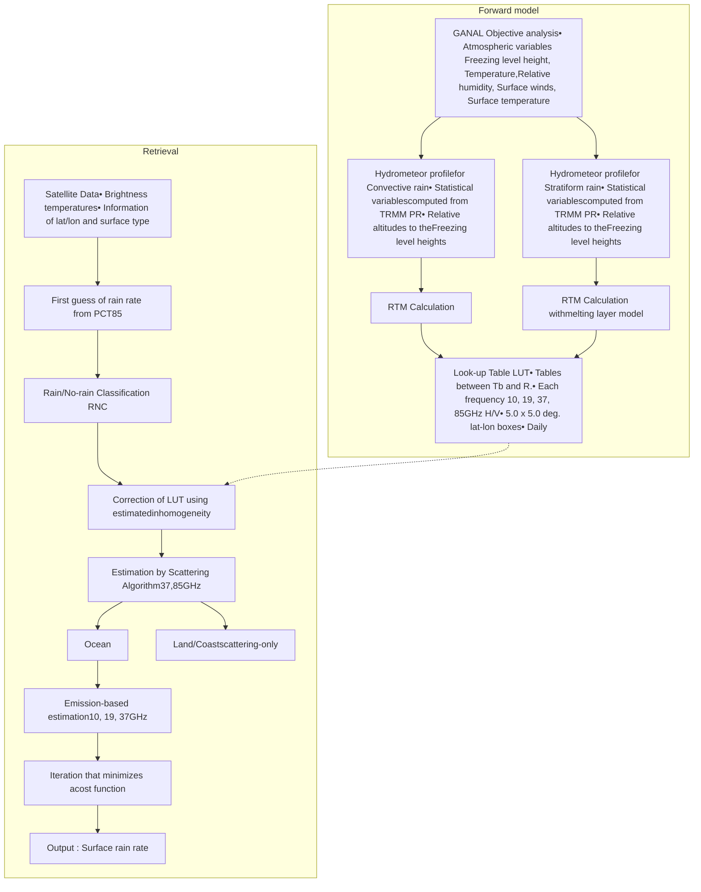

IEEE TRANSACTIONS ON GEOSCIENCE AND REMOTE SENSING, VOL. 45, NO. 7, JULY 2007

2259

# Global Precipitation Map Using Satellite-Borne Microwave Radiometers by the GSMaP Project: Production and Validation

Takuji Kubota, *Member, IEEE*, Shoichi Shige, Hiroshi Hashizume, Kazumasa Aonashi, Nobuhiro Takahashi, *Member, IEEE*, Shinta Seto, Masafumi Hirose, Yukari N. Takayabu, Tomoo Ushio, *Member, IEEE*, Katsuhiro Nakagawa, *Member, IEEE*, Koyuru Iwanami, Misako Kachi, and Ken’ichi Okamoto, *Member, IEEE*

*Abstract*—**This paper documents the production and validation of retrieved rainfall data obtained from satellite-borne microwave radiometers by the Global Satellite Mapping of Precipitation (GSMaP) Project. Using various attributes of precipitation derived from Tropical Rainfall Measuring Mission (TRMM) satellite data, the GSMaP has implemented hydrometeor profiles derived from Precipitation Radar (PR), statistical rain/no-rain classification, and scattering algorithms using polarization-corrected temperatures (PCTs) at 85.5 and 37 GHz. Combined scattering-based surface rainfalls are computed depending on rainfall intensities. PCT85 is not used for stronger rainfalls, because strong depressions of PCT85 are related to tall precipitation-top heights. Therefore, for stronger rainfalls, PCT37 is used, with PCT85 used for weaker rainfalls. With the suspiciously strong rainfalls retrieved from PCT85 deleted, the combined rainfalls correspond well to the PR rain rates over land. The GSMaP algorithm for the TRMM Microwave Imager (TMI) is validated using the TRMM PR, ground radar [Kwajalein (KWAJ) radar and COBRA], and Radar Automated Meteorological Data Acquisition System (AMeDAS) precipitation analysis (RA). Monthly surface rainfalls retrieved from six microwave radiometers (GSMaP_MWR) are compared with the gauge-based dataset. Rain rates retrieved from the TMI**

**(GSMaP_TMI) are in better agreement with the PR estimates over land everywhere except over tropical Africa in the boreal summer. Validation results of the KWAJ radar and COBRA show a good linear relationship for instantaneous rainfall rates, while validation around Japan using the RA shows a good relationship in the warm season. Poor results, connected to weak-precipitation cases, are found in the cold season around Japan.**

*Index Terms*—**Microwave radiometer, precipitation, rain-rate retrieval, validation.**

## I. I NTRODUCTION

R ECENTLY, extensive studies have been conducted on global warming and climate changes [1]. Increasing global surface temperatures can lead to changes in precipitation associated with changes in atmospheric circulation, a more active hydrological cycle, and increases in water-holding capacity throughout the atmosphere. Therefore, monitoring and analyzing precipitation rates using global precipitation datasets are necessary for climate-change detections. However, rain-gauge stations are mainly located over land and placed sparsely in the tropics. In contrast, precipitation estimates derived from satellite remote sensing can offer the prospect of near-global climatologies. Thus, more accurate and higher precision global precipitation maps are needed for many researchers.

Passive microwave radiometer observations have attracted the attention of many studies because they can measure the emitted radiation from rainwater and the scattering caused by cloud ice and snow. Using large observation swaths and high observation frequencies, there is a great expectation for global precipitation maps produced by microwave radiometers. The problems of using sensor algorithms to retrieve rainfall rates have been revealed through the analyses of observation results of the Tropical Rainfall Measuring Mission (TRMM) satellite, developed under a U.S.–Japan joint mission, carrying rain observation sensors such as the TRMM Microwave Imager (TMI) and the Precipitation Radar (PR) [2], [3]. The Global Precipitation Measurement (GPM) mission is an expanded follow-on mission to TRMM with a TRMM-like core satellite carrying dual-frequency PR (DPR) and a GPM Microwave Imager (GMI) onboard, and accompanied by constellations of satellites equipped with microwave radiometers provided by international partners. There is an increasing interest in

Manuscript received June 1, 2006; revised December 22, 2006. This work was supported by the R&D of Hydrological Modeling and Water Resources System in Core Research for Evolutional Science and Technology of the Japan Science and Technology Agency.

T. Kubota and H. Hashizume are with the Japan Science and Technology Agency, Osaka Prefecture University, Osaka 599-8531, Japan (e-mail: kubota@ieee.org).

S. Shige and K. Okamoto are with the Department of Aerospace Engineering, Osaka Prefecture University, Osaka 599-8531, Japan.

K. Aonashi is with Meteorological Research Institute, Japan Meteorological Agency, Ibaraki 305-0052, Japan.

N. Takahashi is with Research and Standards Division, National Institute of Information and Communications Technology, Tokyo 184-8795, Japan.

S. Seto is with the Institute of Industrial Science, University of Tokyo, Tokyo 153-8505, Japan.

M. Hirose and M. Kachi are with Earth Observation Research Center, Japan Aerospace Exploration Agency, Ibaraki 305-8505, Japan.

Y. N. Takayabu is with the Center for Climate System Research, University of Tokyo, Chiba 277-8568, Japan.

T. Ushio is with the Department of Electrical, Electronic, and Information Engineering, Osaka University, Osaka 565-0871, Japan.

K. Nakagawa is with Okinawa Subtropical Environment Remote-Sensing Center, National Institute of Information and Communications Technology, Okinawa 901-0411, Japan.

K. Iwanami is with the Storm, Flood, and Landslide Research Department, National Research Institute for Earth Science and Disaster Prevention, Ibaraki 305-0006, Japan.

Digital Object Identifier 10.1109/TGRS.2007.895337

0196-2892/$25.00 © 2007 IEEE

Authorized licensed use limited to: UNIVERSIDADE DE SAO PAULO. Downloaded on July 11,2026 at 16:01:32 UTC from IEEE Xplore. Restrictions apply.

---

2260

IEEE TRANSACTIONS ON GEOSCIENCE AND REMOTE SENSING, VOL. 45, NO. 7, JULY 2007

advanced retrieval algorithms for microwave radiometers and global precipitation maps utilizing these microwave radiometer data. The over-ocean algorithms utilize the emission information by rainwater at lower microwave frequencies [4]–[8], whereas the over-land algorithms use the scattering information by cloud ice at higher microwave frequencies [9]–[13]. Over-coast algorithms are discussed in [14]. The algorithms can be also divided into two groups: deterministic rain-retrieval algorithms [4], [5], [15]–[18] and probabilistic rain-retrieval algorithms [6]–[8], [19]–[22].

The Global Satellite Mapping of Precipitation (GSMaP) Project [23] started in November 2002. The aims of the GSMaP Project are the development of an advanced microwave radiometer algorithm based on the deterministic rain-retrieval algorithm of [16] and the production of precise high-resolution global precipitation maps. In this project, the algorithms are developed based on physical models of precipitation including melting layers and particle-size distribution. The information obtained by the PR is introduced in order to share a common precipitation model between the microwave radiometers and the PR algorithms.

This paper documents the production and the validation of rainfall retrievals from satellite-borne microwave radiometers by the GSMaP Project. Datasets are briefly described in Section II. The retrieval algorithms of microwave radiometers are documented in Section III. Section IV demonstrates the validation of retrievals. The GSMaP retrievals are compared to TRMM PR rainfalls, the TMI standard product, ground-radar observations, gauge-adjusted radar data, and gauge-based estimates. Summaries are given in Section V.

## II. DATA

### A. Production by the GSMaP Project

In the GSMaP Project, surface rainfalls have been retrieved by the algorithm for brightness temperatures (Tbs) from the TRMM TMI for eight years (1998–2005), from the Advanced Microwave Scanning Radiometer for the Earth Observation System (AMSR-E) for three years (2003–2005) aboard the National Aeronautics and Space Administration (NASA)’s Aqua satellite, from AMSR aboard the Japan Aerospace Exploration Agency’s (JAXA) Advanced Earth Observing Satellite-II (ADEOS-II) for seven months (April–October 2003), and from three Special Sensor Microwave/Imager (SSM/I) aboard the Defense Meteorological Satellite Program for three years (2003–2005). The product combined with these microwave radiometer-derived rainfall estimates is referred to as the GSMaP_MWR. The product of the TMI-only retrievals is referred to as the GSMaP_TMI. The GSMaP Project has also been developing algorithms combined with the passive microwave and geostationary Earth orbit (GEO) infrared (IR) radiometers. High temporal interpolation of the GSMaP_MWR is obtained by the morphed technique [24] and the Kalman filter [25] using the IR information. This product is beyond the scope in this paper, because this paper describes the retrievals of satellite-borne microwave radiometers and their validation (see the GSMaP Project website [[26]]([26]) and follow-on papers for the microwave-GEO-IR-combined algorithm).

### B. Brightness Temperatures (Tbs)

TMI is a nine-channel linear-polarized passive microwave radiometer with five frequencies (10.7, 19.35, 21.3, 37, and 85.5 GHz) [2]. Each frequency has one vertical (v) and one horizontal (h) channel, except for 21 GHz (v-only). We use TMI 1B11 (Algorithm Version “6.5”) for the Tbs. The swath width of the TMI is 760 km.

The SSM/I is a seven channel passive microwave radiometer operating at four frequencies (19.35, 22.235, 37.0, and 85.5 GHz) with dual-polarization in all except the 22.235-GHz frequency (v-only). The Tbs of SSM/I are obtained from Remote Sensing Systems.

The AMSR-E has six frequencies with dual-polarization (6.925, 10.65, 18.7, 23.8, 36.5, and 89.0 GHz) [27]. Tbs at 6.925 GHz are not used in the GSMaP algorithm. The algorithm only utilizes the Tbs of AMSR at 10.65, 18.7, 23.8, 36.5, and 89.0 GHz, although the AMSR has an eight frequency with dual-polarization except two vertical channels in the 50 GHz. We use the Tbs of L1B Version 2 of AMSR-E and AMSR provided by JAXA.

### C. PR 2A25

The TRMM PR is the first spaceborne precipitation radar, and its 128-element active phased-array system operates at 13.8 GHz [28]–[30]. It can provide the 3-D structure of the rainfall, particularly of the vertical distribution, and obtain quantitative rainfall measurements over land, as well as over ocean. The swath width of the PR is 215 km and narrower than that of the TMI. We use PR 2A25 Version 6 and also use the TRMM 3G68 product distributed by the TRMM Science Data and Information System (TSDIS) office for the 0.5 × 0.5° analysis.

The 2A25 algorithm estimates the true effective reflectivity factor Ze at 13.8 GHz at each radar resolution cell from the measured vertical profiles of reflectivity factor Zm. The rainfall rate is then calculated from the estimated Ze [30]. Recently, Shige *et al.* [31] investigated the consistency between TMI-observed Tbs at 10 GHz and those simulated from PR 2A25 V5 and V6 rain profiles for intertropical convergence zone (ITCZ) rain systems during the warm phase of the 1997/1998 El Niño Southern Oscillation, using a radiative transfer model (RTM). They showed that simulated Tbs from PR 2A25 V6 are higher than those from PR 2A25 V5 and exhibit better agreement with the observed Tbs.

### D. TMI 2A12

TMI 2A12 is a product of the Goddard profiling algorithm (GPROF) [6], [32], [33]. The basis of the TMI 2A12 algorithm is a Bayesian framework, in which retrieved precipitation are constructed from those cloud resolving model (CRM)-generated profiles that are radiatively consistent with the observation. We use the 2A12 Version 6 for the comparison with the TMI retrievals of the GSMaP.

Major improvements in Version 6 are the following:

1) greater diversity in the supporting CRM database;

2) adjustment of CRM ice microphysics;

Authorized licensed use limited to: UNIVERSIDADE DE SAO PAULO. Downloaded on July 11,2026 at 16:01:32 UTC from IEEE Xplore. Restrictions apply.

---

KUBOTA et al.: GLOBAL PRECIPITATION MAP USING SATELLITE-BORNE MICROWAVE RADIOMETERS

2261

3) inclusion of the effects of mixed-phase precipitation in CRM simulations;

4) definition of cloud and precipitation properties in simulated footprints;

5) new geographic database;

6) calculation of the “background” rain-free radiance field;

7) reformulation of the convective/nonconvective rain-area constraint.

(see the detailed descriptions in [32] and [33] on improvements made in 2A12 V6).

## E. Radar Rain Data at Okinawa (COBRA)

A field campaign of observing precipitation in Okinawa, Japan (okn-baiu04), was conducted in the 2004 rainy season (May 22 to June 6) with the National Institute of Information and Communications Technology, Okinawa bistatic polarimetric radar known as “COBRA” [34]. The main radar of the COBRA system is a ground-based monostatic-pulse Doppler radar located on Okinawa Island (26.59° N, 128.06° E), using a single wave (5340 MHz) in the C-band [35]. In the campaign, COBRA was operated in 10-min cycles with the 3-D observation scan taking 6 min and the range–height indicator scan taking 4 min. In this paper, the COBRA precipitation dataset Version 1.0 at the elevation of 0.5 km is used for four cases selected for overpasses of the TMI, i.e., 3 : 00–3 : 09 UTC June 1, 2 : 00–2:09 UTC June 2, 1 : 10–1 : 19 UTC June 3, and 22 : 00–22 : 09 UTC June 9. The analyzed area was from 127° E to 129.1° E, and from 25.6° N to 27.5° N.

## F. Radar Rain Data at Kwajalein (KWAJ) (2A53)

The 2A53 Version 5 is the 2-km spatial-resolution instantaneous rainfall product observed by the radar located on KWAJ (8.72° N, 167.73° E) [36], [37], provided by NASA’s Goddard Space Flight Center (GSFC) Distributed Active Archive Center. The radar is a 3-D scanning S-band dual-polarization Doppler weather radar [38]. The area is defined as the area of the circle with a 150-km radius centered on the radar. The data inside of the 15-km radius are not used in order to avoid clutter due to radar reflection off the ocean surface. Over 99% of the KWAJ radar area is ocean.

We chose ten cases for overpasses of the TMI during May 2003, that is, 9 UTC May 4, 6 UTC May 11, 19 UTC May 11, 18 UTC May 14, 4 UTC May 15, 2 UTC May 18, 16 UTC May 18, 1 UTC May 19, 11 UTC May 26, and 10 UTC May 29. These cases were selected in terms of rain areas above 1 mm/h.

## G. Radar-Automated Meteorological Data Acquisition System (AMeDAS) Precipitation Analysis (RA)

The RA is a 1-h accumulated-precipitation estimate produced by the Japan Meteorological Agency (JMA) [39], [40]. Spatial and temporal resolutions of the RA have been upgraded by the JMA. During the period between June 2003 and December 2005, the spatial resolution was 0.025° of latitude and 0.03125° of longitude (about 2.5 × 2.5 km²) and the temporal resolution was 30 min. The JMA operated 20 ground-based weather radars as of October 1999, and their detection range now covers almost all of the Japanese Islands. AMeDAS includes 1320 automatic surface-weather stations. The density of the AMeDAS rain-gauge network is approximately one station in each 17 × 17 km² area. The RA data are created from a composite of JMA operational radars calibrated by rain gauges (the AMeDAS network and gauges operated by the ministry of land, infrastructure, and transport and the prefectural offices), and the calibration technique is described in [39].

Observation areas of the RA are 500 km² per radar. In this paper, they are limited by circles with radii of 150 km from the stations at Nase, Okinawa, and Ishigakijima and by circles with radii of 200 km from the other radar sites. Nase, Okinawa, and Ishigakijima are islands located south of 30° N, and their observation areas are mostly ocean. These limitations are due to apparent biases of the RA, possibly because of detection losses of low precipitation-top heights far from the radar sites and poor calibration over oceanic areas by sparse gauges.

Sampling errors of satellite estimates were investigated using the RA dataset by previous papers [40]–[42]. In order to avoid the sampling errors, RA data are daily averaged only over the area where the swath of the TMI passes, as will be described in Section IV-C.

## H. Global Precipitation Climatology Centre (GPCC) Rain-Gauge Analyses

The land-surface monitoring product is constructed by the GPCC operated by the National Meteorological Service of Germany [43], [44]. The product is based on about 7000 rain-gauge stations worldwide, comprising mostly of synoptic and monthly climate reports collected from the global telecommunications network in real time and supplemented by other worldwide data collections, such as the Monthly Climatic Data for the World. Sophisticated quality control is performed before carrying out the analyses. We use the monthly product of the GPCC with 1.0 × 1.0° boxes that have at least a gauge.

# III. DESCRIPTION OF RETRIEVAL ALGORITHM
## A. Algorithm Developments by the GSMaP Project

In the GSMaP Project, the deterministic rain-retrieval algorithm is utilized for the production of global rainfall estimates for Tbs from the microwave radiometers. The retrieval algorithm is based on the study in [16]. The basic idea of the algorithm is to find the optimal precipitation that gives RTM field-of-view (FOV)-averaged Tbs that fit best with the observed Tbs. A flowchart of the current version “V4.7.2” is illustrated in Fig. 1.

The left panel of Fig. 1 describes the process of making the lookup tables (LUTs) that show the relationship between rainfall rates and Tbs. From forward calculations with a four-stream RTM [45], LUTs for homogeneous precipitation are constructed. Daily LUTs are computed in 5.0 × 5.0° latitute–longitude boxes, with atmospheric variables being given by the JMA Global Analysis (GANAL). Freezing-level heights (FLHs) are computed daily by cubic spline interpolation for the vertical layer of temperature data of the GANAL.

Authorized licensed use limited to: UNIVERSIDADE DE SAO PAULO. Downloaded on July 11,2026 at 16:01:32 UTC from IEEE Xplore. Restrictions apply.

---

2262 IEEE TRANSACTIONS ON GEOSCIENCE AND REMOTE SENSING, VOL. 45, NO. 7, JULY 2007

Fig. 1. Flowchart for the GSMaP rain-retrieval algorithm in this paper.

The RTM calculation uses PR-observed hydrometeor profiles, classified by eight precipitation types. Precipitation types are determined in terms of stratiform pixel ratio, stratiform rain ratio, precipitation area, precipitation-top height, rain intensity, and diurnal cycle [46] from the PR 2A25. Precipitation types consist of five land types (afternoon shower, shallow convection, extratropical cyclone, organized convection, and the Tibetan Plateau) and three ocean types (shallow convection, extratropical cyclone, and organized convection). Global distributions of the precipitation types in $2.5 \times 2.5^\circ$ latitude–longitude boxes are statistically classified trimonthly using the 2A25. Precipitation profiles of the 2A25 data are averaged for each type and binned with rainfall intensities separated into either the convective or stratiform cases, for the period of 1998–2004. In this calculation, the profiles are arranged with altitudes relative to FLHs. The database of precipitation types and profiles makes it possible for the algorithm to deal with trimonthly variation of typical hydrometeor profiles.

The RTM is inputted with the precipitation profiles from the database and with the FLHs from GANAL. In the current algorithm, dynamic separation such as [32] is not utilized for the FOV between the convective and the stratiform rain. Instead, we use a fixed ratio for weighted averages between the LUTs of the convective and stratiform rain. The ratio is then computed from pixel ratios of convective and stratiform rainfalls, binned with rainfall intensities for precipitation types using the 2A25.

The drop-size distribution model in Marshall–Palmer [47] is used for rain, and the exponential distribution is used for snow and graupel. For snow, the slope parameter is a Sekhon–Srivastava [48].

The Nishitsuji melting-layer model [49], [50] is utilized in the RTM calculation for stratiform rain and is also used in

the TRMM PR standard algorithm [30]. The Nishitsuji model was developed through propagation experiments of satellite-to-ground microwave links under sleet and snow conditions. It parameterizes volume water fraction and dielectric constant of mixed-phase particles in terms of temperature and explains the microwave attenuation of the melting layer. Tbs are computed by the RTM with 32 vertical layers consisting of 13 standard pressure levels below 100 hPa and 19 levels with 50-m intervals in a 1-km range bracketing the stratiform rain melting layer. For convective rain, the RTM calculation uses 13 vertical layers (only standard pressure levels).

Fig. 2 shows an example, used in the GSMaP_TMI algorithm, of the LUT for Tbs at 10-GHz vertical polarization [Tbs (10v)] and Type 8 (organized convection over ocean) at the grid point (2.5° E, 2.5° N) on January 1, 1998. The LUT has 21 lines for each precipitation inhomogeneity between zero and two (with steps of 0.1), assuming that precipitation in the real atmosphere is lognormally distributed in the horizontal. Similar tables are computed for the other frequencies at the grid point. In the retrieval process, we use values of the LUTs interpolated linearly by the neighboring four boxes.

The right panel of Fig. 1 shows the process of the retrievals from the Tbs of satellite-borne microwave radiometers. At the beginning of this process, the first guess of precipitation is computed from the observed polarization-corrected temperature (PCT) at 85.5 GHz (PCT85) using the LUTs. PCT85 [51] is given by

$$PCT85 = 1.81 Tb(85v) - 0.81 Tb(85h).$$

The rain rate retrieved from PCT85 is referred to as the Rainpct85.

Authorized licensed use limited to: UNIVERSIDADE DE SAO PAULO. Downloaded on July 11,2026 at 16:01:32 UTC from IEEE Xplore. Restrictions apply.

---

KUBOTA et al.: GLOBAL PRECIPITATION MAP USING SATELLITE-BORNE MICROWAVE RADIOMETERS 2263

<table>
  <thead>
    <tr>
        <th colspan="4">Lookup Table at 10GHz(V) TYPE 08 (2.5E, 2.5N), 01Jan'998</th>
    </tr>
<tr>
        <th>Rain Rate (mm/hr)</th>
        <th>Tb (K) - Inhomogeneity 0</th>
        <th>Tb (K) - Inhomogeneity 1</th>
        <th>Tb (K) - Inhomogeneity 2</th>
    </tr>
  </thead>
  <tbody>
    <tr>
        <td>0</td>
<td>188</td>
<td>188</td>
<td>188</td>
    </tr>
<tr>
        <td>10</td>
<td>235</td>
<td>228</td>
<td>220</td>
    </tr>
<tr>
        <td>20</td>
<td>258</td>
<td>248</td>
<td>238</td>
    </tr>
<tr>
        <td>30</td>
<td>268</td>
<td>258</td>
<td>248</td>
    </tr>
<tr>
        <td>40</td>
<td>272</td>
<td>265</td>
<td>255</td>
    </tr>
<tr>
        <td>50</td>
<td>275</td>
<td>268</td>
<td>260</td>
    </tr>
<tr>
        <td>60</td>
<td>276</td>
<td>270</td>
<td>262</td>
    </tr>
  </tbody>
</table>

Fig. 2. Example of the LUT for Tbs (10v) and Type 8 (organized convection over ocean) at the grid point (2.5◦ E, 2.5◦ N) on January 1, 1998 used in the GSMaP_TMI algorithm. The horizontal and vertical line denotes rain rates and calculated Tbs, respectively. Solid lines labeled “0,” “1,” and “2” denote values with precipitation inhomogeneity of “0,” “1,” and “2,” respectively.

Next, rain or no-rain flags are identified by deterministic methods. The algorithm for the TMI uses surface-type information derived from the land–sea database of the TSDIS toolkit.

Over land for the TMI, the method by the study in [52] is used for rain/no-rain classification (RNC). This RNC method is based upon statistical information for the TMI Tbs under no-rain conditions of the PR 2A25. Tbs (85v) under no-rain conditions are estimated from the database and the observed Tbs (21v). When the observed Tbs (85v) are larger than the estimated values, “no-rain” flags are identified. For radiometers of polar-orbit satellites, databases are computed from the fitting of observed Tbs (89v) to a normal distribution. Tbs (89v) under no-rain conditions are estimated from the database and the observed Tbs (23v) and compared to the observed Tbs (89v) [53]. We use screening of Tbs (23v) < 260.0 K, or surface temperatures < 273.2 K, with no-rain for snow.

Over ocean, rain flags are identified by three conditions: Rainpct85 larger than 1 mm/h; at least one pixel of Rainpct85 larger than 1 mm/h within the scope of 10-GHz effective FOV (EFOV); or by normalized polarization differences [5] at 37 GHz (P37) of less than one.

Rain flags are identified over the coast by using a modified method of the study in [14]. The condition of “T85H > 257, T22V < 269.1” is not used in our algorithm because it often leads to false rainfalls during the winter in midlatitude coastal areas. We use a condition of surface temperatures < 273.2 K for a no-rain state over coastal areas. McCollum and Ferraro’s procedure [14] defined ambiguous classifications as values lying between classes (63) and (66) in their paper. In this paper, ambiguous classes (63)–(65) in the method [14] are results, using their method, are classified as “possible rain,” and an ambiguous class (66) is classified as “no-rain.” A scattering threshold of “Rainpct85 > 1,” instead of their PCT cutoff threshold, is applied to possible-rain cases. This scattering

<table>
  <thead>
    <tr>
        <th colspan="4">Rainpr, Rainpct37, Rainpct85 (0.1x0.1deg)</th>
    </tr>
<tr>
        <th>Surface Rainfall Intensities (mm/hr)</th>
        <th>Rainpr</th>
        <th>Rainpct85</th>
        <th>Rainpct37</th>
    </tr>
  </thead>
  <tbody>
    <tr>
        <td>0</td>
<td>1200000</td>
<td>1200000</td>
<td>1200000</td>
    </tr>
<tr>
        <td>10</td>
<td>150000</td>
<td>200000</td>
<td>180000</td>
    </tr>
<tr>
        <td>20</td>
<td>50000</td>
<td>80000</td>
<td>70000</td>
    </tr>
<tr>
        <td>30</td>
<td>25000</td>
<td>40000</td>
<td>35000</td>
    </tr>
<tr>
        <td>40</td>
<td>15000</td>
<td>25000</td>
<td>20000</td>
    </tr>
<tr>
        <td>50</td>
<td>10000</td>
<td>15000</td>
<td>12000</td>
    </tr>
<tr>
        <td>60</td>
<td>8000</td>
<td>10000</td>
<td>8000</td>
    </tr>
<tr>
        <td>70</td>
<td>5000</td>
<td>7000</td>
<td>5000</td>
    </tr>
<tr>
        <td>80</td>
<td>3000</td>
<td>5000</td>
<td>3000</td>
    </tr>
<tr>
        <td>90</td>
<td>2000</td>
<td>3000</td>
<td>2000</td>
    </tr>
<tr>
        <td>100</td>
<td>1000</td>
<td>2000</td>
<td>1000</td>
    </tr>
  </tbody>
</table>

Fig. 3. Histogram showing sum of rain rates over land during 1998. Lines connected through cross, open circle, and solid circle marks indicate rain rates of PR 2A25, Rainpct85, and Rainpct37, respectively. The width of the histogram bin is 1 mm/h. This analysis is done for 0.1 × 0.1◦ boxes with PR overpasses.

threshold of the GSMaP seems to be suitable except at the winter midlatitudes, as will be shown in Fig. 13.

Precipitation inhomogeneities are estimated from the Rainpct85 classified as “rain” by the RNC method within a scope of a 10-GHz EFOV, according to the method similar to the one used in the study in [18]. The LUTs are corrected using the inhomogeneities by assuming the aforementioned lognormal distribution.

Rainfalls are estimated from the scattering information using Tbs of high frequencies (e.g., 37 and 85.5 GHz for the TMI). This scattering algorithm is documented in the next section.

Over ocean, rainfalls are estimated also from the emission information using Tbs at low frequencies. Weighted averages are calculated using emission-based and scattering-based retrievals, and the optimal precipitation is obtained by the iterative variation method that minimizes a cost function made up of differences between the observed and RTM-calculated Tbs, as described in [16]. The over-ocean algorithm for the SSM/I had to be modified because of the lack of a 10-GHz channel. In the over-ocean algorithm for the SSM/I, the normalized-polarization-difference-based [5] rain estimates are used instead of the original v-polarized 19-GHz Tb-based rain estimates for such strong rain, because the 19-GHz Tb saturates during strong rain (e.g., above 10 mm/h) [54].

In the algorithm, rainfall retrievals are 0 mm/h when increments of the PCT85 are positive for scattering-based estimates or when increments of the Tbs(19v) are negative for emission-based estimates. Here, increments are the differences between the observed Tbs and the Tbs computed by the RTM for the no-rain state.

We do not retrieve rainfalls when FLHs are less than 500 m over the ocean in the current algorithm. Cases that satisfy the low FLH condition are not analyzed for the GSMaP and GPROF products in this paper. The algorithm for snowfall has been left for future work.

Authorized licensed use limited to: UNIVERSIDADE DE SAO PAULO. Downloaded on July 11,2026 at 16:01:32 UTC from IEEE Xplore. Restrictions apply.

---

2264

IEEE TRANSACTIONS ON GEOSCIENCE AND REMOTE SENSING, VOL. 45, NO. 7, JULY 2007

Case study on a MCS over western Africa on July 3, 1998. Panels (a) through (f) show various precipitation and temperature parameters.

Fig. 4. Case study on a MCS over western Africa on July 3, 1998 (orbit number: 3429). Spatial resolution of all panels is 0.125 × 0.125°. (a) Estimated surface rain rate (in millimeters per hour) of PR 2A25. (b) Precipitation-top height (in kilometers) of the 2A25. (c) PCT37 of the TMI (in Kelvin). (d) PCT85 of the TMI (in Kelvin). (e) Rainpct37 (in millimeters per hour). (f) Rainpct85 (in millimeters per hour).

## B. Scattering Algorithm Using 85 and 37 GHz

The scattering algorithm of the GSMaP [55] utilizes 85.5 and 37 GHz PCT (PCT85 and PCT37) [51], [56], [57]. Here, PCT37 is given by

$$ PCT37 = 2.17 \text{ Tb}(37\text{v}) - 1.18 \text{ Tb}(37\text{h}). $$

The histogram in Fig. 3 shows the sum of rain rates during January–December 1998. Rainpct85 and Rainpct37 are the rain rates (in millimeters per hour) estimated from the PCT85 and PCT37, respectively. They are compared to the estimated surface rain rates of the PR 2A25 (Rainpr). Here, orbit datasets are plotted on a grid of 0.1 × 0.1° latitude/longitude boxes, and values observed by both the TMI and PR over land are analyzed. Fig. 3 shows that the Rainpct85 corresponds well to the Rainpr below 10 mm/h. On the other hand, suspicious rainfalls above 30 mm/h, not found in the Rainpr, are distinctly found in the Rainpct85.

Using the numerical-model simulation, Mugnai *et al.* [58] investigated vertical sources of radiation that contribute to the top-of-atmosphere Tbs in terms of the four frequencies corresponding to the SSM/I. They demonstrated that the 85-GHz signals were emissions from the upper level liquid and ice scattering in the upper reaches of tall precipitation clouds.

Therefore, the PCT85 has a large sensitivity to precipitation-top height for tall convection, whereas it is intimately related to surface rainfall for moderate convection. Fig. 4 shows a case study on a mesoscale convective system (MCS) over western Africa on July 3, 1998. Precipitation cores of the MCS are found in estimates of the PR 2A25 [Fig. 4(a)], and there are small rain rates between cores. On the other hand, precipitation-top heights [Fig. 4(b)] are tall even over the area between cores. Precipitation-top heights are tallest in the convective region around 11° N, 8° W. Here, precipitation-top height is defined as the top bin above 0.3 mm/h of the 2A25, as per [59] and [60]. The pattern of the PCT85 [Fig. 4(d)] is more similar to that of the precipitation-top height than surface rain rates of the 2A25. The areas of low PCT85, which are connected to the areas of very large Rainpct85 [Fig. 4(f)], are nearly all located in the areas of tall precipitation-top height. These results are consistent with the study in [58].

In Fig. 3, the Rainpct37 is close to the Rainpr above 20 mm/h, although the Rainpct37 deviates largely from the Rainpr below 10 mm/h. In Fig. 4(e), the Rainpct37 does not show strong rainfalls above 100 mm/h, while the Rainpct85 shows. Moreover, the area of relatively high PCT37 [Fig. 4(c)], which corresponds to that of weak Rainpct37, is found over the area between cores. On the other hand, relatively small

Authorized licensed use limited to: UNIVERSIDADE DE SAO PAULO. Downloaded on July 11,2026 at 16:01:32 UTC from IEEE Xplore. Restrictions apply.

---

KUBOTA et al.: GLOBAL PRECIPITATION MAP USING SATELLITE-BORNE MICROWAVE RADIOMETERS

2265

<table>
  <thead>
    <tr>
        <th>Intensity (mm/hr)</th>
        <th>Rainpr</th>
        <th>Rainpct85</th>
        <th>Rainpct3785</th>
    </tr>
  </thead>
  <tbody>
    <tr>
        <td>0</td>
<td>0</td>
<td>0</td>
<td>0</td>
    </tr>
<tr>
        <td>5</td>
<td>600000</td>
<td>800000</td>
<td>600000</td>
    </tr>
<tr>
        <td>10</td>
<td>1000000</td>
<td>1300000</td>
<td>1000000</td>
    </tr>
<tr>
        <td>15</td>
<td>1200000</td>
<td>1500000</td>
<td>1200000</td>
    </tr>
<tr>
        <td>20</td>
<td>1300000</td>
<td>1600000</td>
<td>1300000</td>
    </tr>
<tr>
        <td>25</td>
<td>1350000</td>
<td>1650000</td>
<td>1350000</td>
    </tr>
<tr>
        <td>30</td>
<td>1380000</td>
<td>1680000</td>
<td>1380000</td>
    </tr>
<tr>
        <td>35</td>
<td>1400000</td>
<td>1700000</td>
<td>1400000</td>
    </tr>
<tr>
        <td>40</td>
<td>1410000</td>
<td>1710000</td>
<td>1410000</td>
    </tr>
<tr>
        <td>45</td>
<td>1420000</td>
<td>1720000</td>
<td>1420000</td>
    </tr>
<tr>
        <td>50</td>
<td>1430000</td>
<td>1730000</td>
<td>1430000</td>
    </tr>
<tr>
        <td>55</td>
<td>1440000</td>
<td>1740000</td>
<td>1440000</td>
    </tr>
<tr>
        <td>60</td>
<td>1450000</td>
<td>1750000</td>
<td>1450000</td>
    </tr>
<tr>
        <td>65</td>
<td>1460000</td>
<td>1760000</td>
<td>1460000</td>
    </tr>
<tr>
        <td>70</td>
<td>1470000</td>
<td>1770000</td>
<td>1470000</td>
    </tr>
  </tbody>
</table>

Fig. 5. Cumulative histogram of rain rates over land during 1998. Lines connected through cross, open circle, and solid circle marks indicate rain rates of PR 2A25, Rainpct85, and Rainpct3785, respectively. Histogram bins are determined only by PR rain rates. The width of the bin is 1 mm/h. This analysis is done for 0.25 × 0.25° boxes with PR overpasses.

gradients of the PCT37 are found over the edges of the rain area, which can be connected to poor correspondences of the Rainpct37 to the Rainpr for weak rain rates. Thus, because strong Rainpct85 is closely related to the tall precipitation-top height, we use the Rainpct85 for small rainfalls and the Rainpct37 for strong rainfalls.

Estimations combined with the Rainpct85 and the Rainpct37, referred to as Rainpct3785 (in millimeters per hours), are summarized as follows:

$$ Rainpct3785 = W \times Rainpct37 + (1 - W) \times Rainpct85 $$
$$ W = 0 \text{ for } Rainpct85 \le 10 $$
$$ W = (Rainpct85 - 10)/10 \text{ for } 10 < Rainpct85 < 20 $$
$$ W = 1 \text{ for } Rainpct85 \ge 20 $$

where $W$ is the weighting function.

Fig. 5 shows the cumulative histogram of rain rates during January–December 1998, comparing the Rainpct85 and Rainpct3785 to the Rainpr. Rain rates observed by both the TMI and the PR over land are analyzed with 0.25 × 0.25° latitude–longitude boxes. In this analysis, histogram bins are determined only by Rainpr intensities. Fig. 5 shows that the Rainpct3785 corresponds well to the Rainpr, whereas the Rainpct85 overestimates heavily. Thus, the Rainpct3785 is used as retrievals over land and coast in the GSMaP algorithm. Tbs at 36.5 and 89.0 GHz are used for retrievals from AMSR-E and AMSR.

# IV. VALIDATION OF THE RAINFALL RETRIEVALS

## A. Comparison With TRMM PR Datasets

In the TRMM satellite, it is possible to compare estimations from the TMI and the PR directly and synchronously. Using the 1998–2005 Rainpr as a reference, the GSMaP_TMI are compared to surface rainfall rates of 2A12 by the GPROF

<table>
  <thead>
    <tr>
        <th colspan="4">(a) December, January, and February</th>
    </tr>
<tr>
        <th>Latitude</th>
        <th>PR 2A25</th>
        <th>TMI 2A12</th>
        <th>GSMaP_TMI</th>
    </tr>
  </thead>
  <tbody>
    <tr>
        <td>40S</td>
<td>50</td>
<td>60</td>
<td>55</td>
    </tr>
<tr>
        <td>30S</td>
<td>60</td>
<td>70</td>
<td>65</td>
    </tr>
<tr>
        <td>20S</td>
<td>70</td>
<td>80</td>
<td>75</td>
    </tr>
<tr>
        <td>10S</td>
<td>120</td>
<td>150</td>
<td>130</td>
    </tr>
<tr>
        <td>EQ</td>
<td>150</td>
<td>200</td>
<td>160</td>
    </tr>
<tr>
        <td>10N</td>
<td>100</td>
<td>130</td>
<td>110</td>
    </tr>
<tr>
        <td>20N</td>
<td>60</td>
<td>70</td>
<td>65</td>
    </tr>
<tr>
        <td>30N</td>
<td>50</td>
<td>60</td>
<td>55</td>
    </tr>
<tr>
        <td>40N</td>
<td>60</td>
<td>70</td>
<td>65</td>
    </tr>
<tr>
        <th colspan="4">(b) March, April, and May</th>
    </tr>
<tr>
        <th>Latitude</th>
        <th>PR 2A25</th>
        <th>TMI 2A12</th>
        <th>GSMaP_TMI</th>
    </tr>
<tr>
        <td>40S</td>
<td>55</td>
<td>65</td>
<td>60</td>
    </tr>
<tr>
        <td>30S</td>
<td>60</td>
<td>70</td>
<td>65</td>
    </tr>
<tr>
        <td>20S</td>
<td>65</td>
<td>75</td>
<td>70</td>
    </tr>
<tr>
        <td>10S</td>
<td>110</td>
<td>140</td>
<td>120</td>
    </tr>
<tr>
        <td>EQ</td>
<td>160</td>
<td>210</td>
<td>170</td>
    </tr>
<tr>
        <td>10N</td>
<td>120</td>
<td>150</td>
<td>130</td>
    </tr>
<tr>
        <td>20N</td>
<td>60</td>
<td>70</td>
<td>65</td>
    </tr>
<tr>
        <td>30N</td>
<td>50</td>
<td>60</td>
<td>55</td>
    </tr>
<tr>
        <td>40N</td>
<td>55</td>
<td>65</td>
<td>60</td>
    </tr>
<tr>
        <th colspan="4">(c) June, July, and August</th>
    </tr>
<tr>
        <th>Latitude</th>
        <th>PR 2A25</th>
        <th>TMI 2A12</th>
        <th>GSMaP_TMI</th>
    </tr>
<tr>
        <td>40S</td>
<td>60</td>
<td>70</td>
<td>65</td>
    </tr>
<tr>
        <td>30S</td>
<td>65</td>
<td>75</td>
<td>70</td>
    </tr>
<tr>
        <td>20S</td>
<td>60</td>
<td>70</td>
<td>65</td>
    </tr>
<tr>
        <td>10S</td>
<td>80</td>
<td>100</td>
<td>90</td>
    </tr>
<tr>
        <td>EQ</td>
<td>120</td>
<td>150</td>
<td>130</td>
    </tr>
<tr>
        <td>10N</td>
<td>180</td>
<td>230</td>
<td>190</td>
    </tr>
<tr>
        <td>20N</td>
<td>80</td>
<td>100</td>
<td>90</td>
    </tr>
<tr>
        <td>30N</td>
<td>60</td>
<td>70</td>
<td>65</td>
    </tr>
<tr>
        <td>40N</td>
<td>65</td>
<td>75</td>
<td>70</td>
    </tr>
<tr>
        <th colspan="4">(d) September, October, and November</th>
    </tr>
<tr>
        <th>Latitude</th>
        <th>PR 2A25</th>
        <th>TMI 2A12</th>
        <th>GSMaP_TMI</th>
    </tr>
<tr>
        <td>40S</td>
<td>55</td>
<td>65</td>
<td>60</td>
    </tr>
<tr>
        <td>30S</td>
<td>60</td>
<td>70</td>
<td>65</td>
    </tr>
<tr>
        <td>20S</td>
<td>65</td>
<td>75</td>
<td>70</td>
    </tr>
<tr>
        <td>10S</td>
<td>100</td>
<td>130</td>
<td>110</td>
    </tr>
<tr>
        <td>EQ</td>
<td>150</td>
<td>200</td>
<td>160</td>
    </tr>
<tr>
        <td>10N</td>
<td>180</td>
<td>230</td>
<td>190</td>
    </tr>
<tr>
        <td>20N</td>
<td>70</td>
<td>80</td>
<td>75</td>
    </tr>
<tr>
        <td>30N</td>
<td>55</td>
<td>65</td>
<td>60</td>
    </tr>
<tr>
        <td>40N</td>
<td>60</td>
<td>70</td>
<td>65</td>
    </tr>
  </tbody>
</table>

Fig. 6. Zonally averaged rain rates over ocean-only for (a) December, January, and February, (b) March, April, and May, (c) June, July, and August, and (d) September, October, and November during 1998–2005. Solid, long-dashed, and short-dashed lines indicate rain rates of PR 2A25, TMI 2A12, and GSMaP_TMI, respectively.

<table>
  <thead>
    <tr>
        <th colspan="4">(a) December, January, and February</th>
    </tr>
<tr>
        <th>Latitude</th>
        <th>PR 2A25</th>
        <th>TMI 2A12</th>
        <th>GSMaP_TMI</th>
    </tr>
  </thead>
  <tbody>
    <tr>
        <td>40S</td>
<td>20</td>
<td>40</td>
<td>25</td>
    </tr>
<tr>
        <td>30S</td>
<td>30</td>
<td>50</td>
<td>35</td>
    </tr>
<tr>
        <td>20S</td>
<td>60</td>
<td>100</td>
<td>70</td>
    </tr>
<tr>
        <td>10S</td>
<td>120</td>
<td>180</td>
<td>130</td>
    </tr>
<tr>
        <td>EQ</td>
<td>100</td>
<td>150</td>
<td>110</td>
    </tr>
<tr>
        <td>10N</td>
<td>60</td>
<td>100</td>
<td>70</td>
    </tr>
<tr>
        <td>20N</td>
<td>30</td>
<td>50</td>
<td>35</td>
    </tr>
<tr>
        <td>30N</td>
<td>40</td>
<td>60</td>
<td>45</td>
    </tr>
<tr>
        <td>40N</td>
<td>50</td>
<td>70</td>
<td>55</td>
    </tr>
<tr>
        <th colspan="4">(b) March, April, and May</th>
    </tr>
<tr>
        <th>Latitude</th>
        <th>PR 2A25</th>
        <th>TMI 2A12</th>
        <th>GSMaP_TMI</th>
    </tr>
<tr>
        <td>40S</td>
<td>25</td>
<td>45</td>
<td>30</td>
    </tr>
<tr>
        <td>30S</td>
<td>40</td>
<td>60</td>
<td>45</td>
    </tr>
<tr>
        <td>20S</td>
<td>70</td>
<td>110</td>
<td>80</td>
    </tr>
<tr>
        <td>10S</td>
<td>110</td>
<td>170</td>
<td>120</td>
    </tr>
<tr>
        <td>EQ</td>
<td>120</td>
<td>180</td>
<td>130</td>
    </tr>
<tr>
        <td>10N</td>
<td>100</td>
<td>150</td>
<td>110</td>
    </tr>
<tr>
        <td>20N</td>
<td>40</td>
<td>60</td>
<td>45</td>
    </tr>
<tr>
        <td>30N</td>
<td>30</td>
<td>50</td>
<td>35</td>
    </tr>
<tr>
        <td>40N</td>
<td>40</td>
<td>60</td>
<td>45</td>
    </tr>
<tr>
        <th colspan="4">(c) June, July, and August</th>
    </tr>
<tr>
        <th>Latitude</th>
        <th>PR 2A25</th>
        <th>TMI 2A12</th>
        <th>GSMaP_TMI</th>
    </tr>
<tr>
        <td>40S</td>
<td>30</td>
<td>50</td>
<td>35</td>
    </tr>
<tr>
        <td>30S</td>
<td>40</td>
<td>60</td>
<td>45</td>
    </tr>
<tr>
        <td>20S</td>
<td>30</td>
<td>50</td>
<td>35</td>
    </tr>
<tr>
        <td>10S</td>
<td>60</td>
<td>100</td>
<td>70</td>
    </tr>
<tr>
        <td>EQ</td>
<td>120</td>
<td>180</td>
<td>130</td>
    </tr>
<tr>
        <td>10N</td>
<td>180</td>
<td>250</td>
<td>190</td>
    </tr>
<tr>
        <td>20N</td>
<td>100</td>
<td>150</td>
<td>110</td>
    </tr>
<tr>
        <td>30N</td>
<td>60</td>
<td>90</td>
<td>70</td>
    </tr>
<tr>
        <td>40N</td>
<td>50</td>
<td>70</td>
<td>55</td>
    </tr>
<tr>
        <th colspan="4">(d) September, October, and November</th>
    </tr>
<tr>
        <th>Latitude</th>
        <th>PR 2A25</th>
        <th>TMI 2A12</th>
        <th>GSMaP_TMI</th>
    </tr>
<tr>
        <td>40S</td>
<td>25</td>
<td>45</td>
<td>30</td>
    </tr>
<tr>
        <td>30S</td>
<td>35</td>
<td>55</td>
<td>40</td>
    </tr>
<tr>
        <td>20S</td>
<td>40</td>
<td>60</td>
<td>45</td>
    </tr>
<tr>
        <td>10S</td>
<td>80</td>
<td>120</td>
<td>90</td>
    </tr>
<tr>
        <td>EQ</td>
<td>130</td>
<td>190</td>
<td>140</td>
    </tr>
<tr>
        <td>10N</td>
<td>140</td>
<td>200</td>
<td>150</td>
    </tr>
<tr>
        <td>20N</td>
<td>60</td>
<td>90</td>
<td>70</td>
    </tr>
<tr>
        <td>30N</td>
<td>40</td>
<td>60</td>
<td>45</td>
    </tr>
<tr>
        <td>40N</td>
<td>45</td>
<td>65</td>
<td>50</td>
    </tr>
  </tbody>
</table>

Fig. 7. Zonally averaged rain rates over land-only during 1998–2005. The lines denote the same as Fig. 6.

algorithm. The gridded data are analyzed with horizontal resolution of 0.5 × 0.5° latitude–longitude boxes only over the PR overpasses.

Fig. 6 compares zonally averaged rain rates over ocean of PR 2A25, TMI 2A12, and GSMaP_TMI. Over tropical oceans such as the ITCZ, 2A12 rain rates are larger than Rainpr, as shown in previous papers [3], [61]–[63]. Over tropical oceans around the ITCZ in all seasons, GSMaP-retrieved rain rates are in better agreement with the Rainprs than the 2A12 rain rates. On the other hand, the GSMaP tends to be larger than the 2A25 over the winter midlatitudes and smaller over the South Pacific convergence zone and the subtropics around 15° N–30° N.

Fig. 7 compares zonally averaged rain rates over land. The 2A12 rain rates are larger than Rainpr in all seasons. On the other hand, GSMaP-retrieved rain rates are in good agreement with the Rainprs, except for the region between 5° N–15° N in

Authorized licensed use limited to: UNIVERSIDADE DE SAO PAULO. Downloaded on July 11,2026 at 16:01:32 UTC from IEEE Xplore. Restrictions apply.

---

2266 IEEE TRANSACTIONS ON GEOSCIENCE AND REMOTE SENSING, VOL. 45, NO. 7, JULY 2007

Line charts showing monthly time series of rain rates for eight different regions (a-h) from 1998 to 2005, comparing PR 2A25, TMI 2A12, and GSMaP_TMI data.

Fig. 8. Monthly time series of rain rates averaged over ocean areas of (a) Indian Ocean (50° E–90° E, 10° S–EQ), (b) ITCZ over the eastern Pacific (150° W–90° W, 5° N–15° N), (c) equatorial Atlantic (40° W–0° E, 5° S–5° N), and (d) Northern Hemisphere midlatitude Pacific (140° E–160° W, 25° N–35° N), or land areas of (e) Amazon Basin (80° W–45° W, 10° S–EQ), (f) Indian Subcontinent (65° E–90° E, 5° N–25° N), (g) tropical northern Africa (5° E–35° E, EQ–15° N), and (h) tropical southern Africa (10° E–40° E, 15° S–EQ). Red solid, green long-dashed, and blue short-dashed lines indicate rain rates of PR 2A25, TMI 2A12, and GSMaP_TMI, respectively.

the boreal summer. Large differences are found over tropical northern Africa.

In the left panels of Fig. 8, monthly rain rates of the PR 2A25, the TMI 2A12, and the GSMaP_TMI are compared for ocean averages over four areas. Correlation coefficients between the monthly series of the GSMaP and the 2A25 are 0.95 for the Indian Ocean, 0.98 for the ITCZ, 0.98 for the equatorial Atlantic region, and 0.87 for the Northern Hemisphere midlatitude Pacific. Variations of the GSMaP and the 2A12 are closely similar to those of the 2A25 over the Indian Ocean and equatorial Atlantic.

In the GSMaP algorithm, surface rainfalls over land are computed by the scattering algorithm using the PCT85 and the PCT37, as described in the previous section. In the right panels of Fig. 8, monthly rain rates of 2A25, 2A12, and GSMaP_TMI are compared for land averages over four areas. Correlation coefficients between the monthly series of GSMaP and 2A25 are 0.97 for the Amazon Basin, 0.96 for the Indian Subcontinent, 0.98 for tropical northern Africa, and 0.99 for tropical southern Africa. The GSMaP results correspond well to the 2A25 over the Amazon Basin and tropical southern Africa,

whereas the 2A12 results are larger than the Rainpr. Variations of the GSMaP and the 2A12 are similar to those of the 2A25 over the Indian Subcontinent. In the tropical northern Africa region, estimates of the GSMaP and the 2A12 are larger than those of the 2A25.

The tendencies of the biases for the GSMaP and the 2A25 are different between tropical northern Africa and the Amazon. The PR–TMI differences depend on storm heights for the 2A12 [64], [65], and the GSMaP [66]. Precipitation systems tend to be deeper and more intense in tropical Africa than in the Amazon [67]. Seto *et al.* [65], [66] investigate the causes of these biases, comparing single or multiple PR pixels within a TMI footprint for 85 GHz and the TMI pixel. They concluded that the overestimates of the GSMaP compared to the 2A25 were due to tall precipitation with a precipitation-top height above 8 km, which can be connected to the differences between tropical Africa and the Amazon. Potential problems in the GSMaP algorithm are the precipitation profiles and the scattering algorithm. The profiles are an influential component of the algorithm, and retrievals tend to decrease over tropical Africa in the experiment using Africa-only profiles. The scattering

Authorized licensed use limited to: UNIVERSIDADE DE SAO PAULO. Downloaded on July 11,2026 at 16:01:32 UTC from IEEE Xplore. Restrictions apply.

---

KUBOTA et al.: GLOBAL PRECIPITATION MAP USING SATELLITE-BORNE MICROWAVE RADIOMETERS

2267

Scatter plot (a) comparing GSMaP_TMI retrievals with Kwajalein Radar data.

Scatter plot (b) comparing TMI 2A12V6 retrievals with Kwajalein Radar data.

Fig. 9. Comparison of TMI retrievals with KWAJ radar data for ten selected overpasses during May 2003. (a) GSMaP_TMI and (b) 2A12. This analysis is done for 0.25 × 0.25° ocean-only boxes.

Scatter plot (a) comparing GSMaP_TMI retrievals with COBRA radar data.

Scatter plot (b) comparing TMI 2A12V6 retrievals with COBRA radar data.

Fig. 10. Comparison of TMI retrievals with COBRA data for four selected overpasses during June 2004. (a) GSMaP_TMI and (b) 2A12. This analysis is done for 0.25 × 0.25° boxes.

algorithm noted in Section III-B uses a simple scheme in the current algorithm, and more elaborate techniques are necessary in view of regional dependence.

A candidate for the problem in the 2A25V6 algorithm is path-integrated attenuation estimates by the surface-reference technique. This technique assumes that the true radar surface cross section remains the same inside and outside the raining area [68], [69]. By this assumption, attenuation-corrected surface-backscattering cross sections are underestimated over land, leading to underestimates of rain rates [70]–[72]. The underestimates due to this are particularly distinct over the tropical Africa area (10° N–15° N), although they cannot account for all differences of the TMI–PR differences.

## B. Comparison With the Ground-Radar Datasets

The GSMaP algorithm utilizes information derived from the TRMM PR, and it is necessary that the retrievals of the GSMaP algorithm be validated with the dataset independent of the TRMM PR. In this section, the GSMaP_TMI is compared with two ground-radar datasets.

Fig. 9 shows a scatter plot of the GSMaP_TMI and the radar rain data at KWAJ with 0.25 × 0.25° resolution. Here, ten overpasses during May 2003 are selected, as noted in Section II-F. This figure does not show the points for which rain from one or both instruments is less than 0.01 mm/h. Both panels of the figure show a good linear relationship. The correlation coefficients (with 1137 degrees of freedom) are 0.65 for the

GSMaP data and 0.64 for the 2A12 data. Root mean-square errors (rmses) are 1.78 mm/h for the GSMaP and 1.79 mm/h for the 2A12. Correlation coefficients between the GSMaP and the KWAJ are 0.66 over ocean only and 0.65 over coast only, while all pixels are “ocean” over the radar area in the 2A12.

Fig. 10 shows a scatter plot of the GSMaP_TMI and the radar rain data from Okinawa (COBRA) with 0.25 × 0.25° resolution. Here, four overpasses during June 2004 are selected, as noted in Section II-E. Both panels of this figure also show a good linear relationship. The correlation coefficients (with 251 degrees of freedom) are 0.82 for the GSMaP data and 0.84 for the 2A12 data. The rmses are 1.37 mm/h for the GSMaP and 1.12 mm/h for the 2A12. Note that surface types are different between the GSMaP and the 2A12 over the observation area of the COBRA, as will be discussed in the next section. The ratio of “ocean” pixels to total pixels in the area is 29% in the GSMaP data, while the ratio is 69% in the 2A12 data.

Thus, the GSMaP retrievals correspond well to the two ground-radar rain rates, and although both algorithms are quite different, the validation results of the GSMaP are similar to those of the 2A12.

## C. Comparison With the RA

The RA is created from estimates of 20 radars calibrated by rain gauges. They are useful for the validation of the microwave retrievals because of the good calibration and relatively large observation ranges that cover almost all of the Japanese islands.

Authorized licensed use limited to: UNIVERSIDADE DE SAO PAULO. Downloaded on July 11,2026 at 16:01:32 UTC from IEEE Xplore. Restrictions apply.

---

2268

IEEE TRANSACTIONS ON GEOSCIENCE AND REMOTE SENSING, VOL. 45, NO. 7, JULY 2007

Map of Radar-AMeDAS (half-hourly) rainfall on June 1, 2004 at 21:00Z

Map of Radar-AMeDAS daily mean rainfall on June 1, 2004 with 0.25x0.25 deg. resolution

Map of 2A12V6 surface types on June 1, 2004

Map of GSMaP surface types (TSDIS Toolkit) on June 1, 2004

Fig. 11. (a) Rainfalls of RA on 21 : 00 UTC June 1, 2004. Gray regions indicate observation areas of the RA not included in the TMI overpass. (b) Daily mean rainfalls of RA averaged within the TMI swath on June 1, 2004. Analyzed areas are limited by the distances from the radar sites. Lower panels show surface types of (c) 2A12V6 and (d) GSMaP_TMI (TSDIS toolkit). Blue, red, and green denote ocean, coast, and land, respectively. Here, (c) and (d) show only grid points that hold in the same surface types as the FOV with 0.25 × 0.25° resolution.

The TRMM satellite visits the RA observation areas at a few times in a day, and RA data are selected according to when the swath of the TMI passes [see Fig. 11(a)]. This selection was calculated half-hourly during the period between January 2004 and December 2005. After the initial data selection, daily averages were calculated using the selected RA in the area limited by the distances from the radar sites [Fig. 11(b)].

In this section, four validation indexes are utilized in addition to the spatial correlation and the rmse. The Heidke skill score (HSS) indicates the degree of consistency between the two with respect to the binary classification of a grid box as raining or not raining [11]. The bias score is the ratio of the number of yes forecasts (TMI retrievals giving "raining") to the number of yes observations (RA observing "raining") [73]. The probability of detection (POD) is the ratio of correct forecasts to the number of times the forecasted event occurred. The false-alarm ratio (FAR) is the fraction of yes forecasts that turn out to be wrong. Further definitions of the statistics are described in the study in [73]. In 2 × 2 contingency tables, the categories are < 1 and >= 1 mm/day as used in the study in [24]. Statistics are computed for daily estimates and averaged monthly during 2004–2005 with 0.25 × 0.25° resolution.

Surface types are different between the GSMaP data (using the TSDIS toolkit) and the 2A12V6 data. The 2A12V6 uses a revised geographic database described in the study in [32]. Fig. 11(c) and (d) shows examples of surface-type distributions over the RA observation area and shows that coastal areas are smaller in the 2A12 data [Fig. 11(c)] than in the GSMaP data [Fig. 11(d)]. Thus, statistics are calculated using only the grid points of the same surface type for both the GSMaP and the 2A12. Border areas that include different surface types of the FOV in a grid point are excluded in this analysis.

Figs. 12–14 indicate monthly series of RA validation during 2004–2005 for ocean, coast, and land, respectively. Note that the grid points of "land," illustrated in green in the lower panels of Fig. 11, are located in the mountainous regions in Japan. Spatial correlation and HSS show distinct seasonal variations in all surface types, while the differences of the algorithms are small, in particular, over ocean. Overall, results over ocean are best, and results over land are worst in surface types for the correlation and the HSS. Correlation coefficients of the GSMaP for ocean, coast, and land are 0.66, 0.55, and 0.40 during May–October and are 0.49, 0.33, and 0.13 during November–April, respectively.

Authorized licensed use limited to: UNIVERSIDADE DE SAO PAULO. Downloaded on July 11,2026 at 16:01:32 UTC from IEEE Xplore. Restrictions apply.

---

KUBOTA et al.: GLOBAL PRECIPITATION MAP USING SATELLITE-BORNE MICROWAVE RADIOMETERS

2269

<table>
  <thead>
    <tr>
        <th colspan="13">Spatial Correlation [• GSMaP, o 2A12] : Ocean-only</th>
    </tr>
<tr>
        <th>Year</th>
        <th>JAN</th>
        <th>FEB</th>
        <th>MAR</th>
        <th>APR</th>
        <th>MAY</th>
        <th>JUN</th>
        <th>JUL</th>
        <th>AUG</th>
        <th>SEP</th>
        <th>OCT</th>
        <th>NOV</th>
        <th>DEC</th>
    </tr>
  </thead>
  <tbody>
    <tr>
        <td>2004</td>
<td>0.42</td>
<td>0.55</td>
<td>0.52</td>
<td>0.50</td>
<td>0.70</td>
<td>0.68</td>
<td>0.65</td>
<td>0.68</td>
<td>0.70</td>
<td>0.60</td>
<td>0.55</td>
<td>0.55</td>
    </tr>
<tr>
        <td>2005</td>
<td>0.45</td>
<td>0.48</td>
<td>0.48</td>
<td>0.55</td>
<td>0.65</td>
<td>0.68</td>
<td>0.65</td>
<td>0.70</td>
<td>0.72</td>
<td>0.60</td>
<td>0.68</td>
<td>0.58</td>
    </tr>
<tr>
        <th colspan="13">Heidke Skill Score [• GSMaP, o 2A12] : Ocean-only</th>
    </tr>
<tr>
        <th>Year</th>
        <th>JAN</th>
        <th>FEB</th>
        <th>MAR</th>
        <th>APR</th>
        <th>MAY</th>
        <th>JUN</th>
        <th>JUL</th>
        <th>AUG</th>
        <th>SEP</th>
        <th>OCT</th>
        <th>NOV</th>
        <th>DEC</th>
    </tr>
<tr>
        <td>2004</td>
<td>0.35</td>
<td>0.45</td>
<td>0.45</td>
<td>0.42</td>
<td>0.60</td>
<td>0.58</td>
<td>0.55</td>
<td>0.52</td>
<td>0.58</td>
<td>0.55</td>
<td>0.45</td>
<td>0.50</td>
    </tr>
<tr>
        <td>2005</td>
<td>0.35</td>
<td>0.42</td>
<td>0.48</td>
<td>0.40</td>
<td>0.45</td>
<td>0.65</td>
<td>0.60</td>
<td>0.58</td>
<td>0.55</td>
<td>0.58</td>
<td>0.52</td>
<td>0.32</td>
    </tr>
<tr>
        <th colspan="13">Bias Score (rain area) [• GSMaP, o 2A12] : Ocean-only</th>
    </tr>
<tr>
        <th>Year</th>
        <th>JAN</th>
        <th>FEB</th>
        <th>MAR</th>
        <th>APR</th>
        <th>MAY</th>
        <th>JUN</th>
        <th>JUL</th>
        <th>AUG</th>
        <th>SEP</th>
        <th>OCT</th>
        <th>NOV</th>
        <th>DEC</th>
    </tr>
<tr>
        <td>2004</td>
<td>0.60</td>
<td>0.95</td>
<td>1.10</td>
<td>0.75</td>
<td>0.82</td>
<td>0.85</td>
<td>0.60</td>
<td>0.58</td>
<td>0.60</td>
<td>0.75</td>
<td>0.85</td>
<td>0.65</td>
    </tr>
<tr>
        <td>2005</td>
<td>0.75</td>
<td>0.95</td>
<td>1.10</td>
<td>0.62</td>
<td>0.70</td>
<td>0.75</td>
<td>0.82</td>
<td>0.55</td>
<td>0.58</td>
<td>0.82</td>
<td>0.65</td>
<td>0.75</td>
    </tr>
<tr>
        <th colspan="13">RMSE (mm/day) [• GSMaP, o 2A12] : Ocean-only</th>
    </tr>
<tr>
        <th>Year</th>
        <th>JAN</th>
        <th>FEB</th>
        <th>MAR</th>
        <th>APR</th>
        <th>MAY</th>
        <th>JUN</th>
        <th>JUL</th>
        <th>AUG</th>
        <th>SEP</th>
        <th>OCT</th>
        <th>NOV</th>
        <th>DEC</th>
    </tr>
<tr>
        <td>2004</td>
<td>8.0</td>
<td>9.5</td>
<td>8.0</td>
<td>11.0</td>
<td>15.0</td>
<td>15.0</td>
<td>14.0</td>
<td>18.0</td>
<td>22.0</td>
<td>15.0</td>
<td>8.5</td>
<td>10.0</td>
    </tr>
<tr>
        <td>2005</td>
<td>12.5</td>
<td>10.0</td>
<td>15.0</td>
<td>12.5</td>
<td>8.5</td>
<td>11.5</td>
<td>21.0</td>
<td>13.0</td>
<td>11.0</td>
<td>11.5</td>
<td>11.5</td>
<td>7.5</td>
    </tr>
<tr>
        <th colspan="13">Probability of Detection [• GSMaP, o 2A12] : Ocean-only</th>
    </tr>
<tr>
        <th>Year</th>
        <th>JAN</th>
        <th>FEB</th>
        <th>MAR</th>
        <th>APR</th>
        <th>MAY</th>
        <th>JUN</th>
        <th>JUL</th>
        <th>AUG</th>
        <th>SEP</th>
        <th>OCT</th>
        <th>NOV</th>
        <th>DEC</th>
    </tr>
<tr>
        <td>2004</td>
<td>0.42</td>
<td>0.58</td>
<td>0.58</td>
<td>0.45</td>
<td>0.62</td>
<td>0.60</td>
<td>0.50</td>
<td>0.48</td>
<td>0.52</td>
<td>0.60</td>
<td>0.40</td>
<td>0.55</td>
    </tr>
<tr>
        <td>2005</td>
<td>0.45</td>
<td>0.52</td>
<td>0.62</td>
<td>0.45</td>
<td>0.48</td>
<td>0.55</td>
<td>0.68</td>
<td>0.58</td>
<td>0.52</td>
<td>0.45</td>
<td>0.60</td>
<td>0.42</td>
    </tr>
<tr>
        <th colspan="13">False Alarm Ratio [• GSMaP, o 2A12] : Ocean-only</th>
    </tr>
<tr>
        <th>Year</th>
        <th>JAN</th>
        <th>FEB</th>
        <th>MAR</th>
        <th>APR</th>
        <th>MAY</th>
        <th>JUN</th>
        <th>JUL</th>
        <th>AUG</th>
        <th>SEP</th>
        <th>OCT</th>
        <th>NOV</th>
        <th>DEC</th>
    </tr>
<tr>
        <td>2004</td>
<td>0.40</td>
<td>0.32</td>
<td>0.42</td>
<td>0.35</td>
<td>0.18</td>
<td>0.20</td>
<td>0.15</td>
<td>0.15</td>
<td>0.22</td>
<td>0.25</td>
<td>0.35</td>
<td>0.42</td>
    </tr>
<tr>
        <td>2005</td>
<td>0.35</td>
<td>0.35</td>
<td>0.25</td>
<td>0.32</td>
<td>0.25</td>
<td>0.18</td>
<td>0.20</td>
<td>0.15</td>
<td>0.22</td>
<td>0.20</td>
<td>0.18</td>
<td>0.35</td>
    </tr>
  </tbody>
</table>

Fig. 12. Time series of RA validation during January 2004–December 2005, with statics generated every month using daily estimates for ocean-only. Solid and open circles indicate the GSMaP_TMI and 2A12, respectively.

Poor results in the winter season are examined further. The effectiveness of the retrievals can be related to areas and intensities of precipitations, in addition to the surface temperature. Area ratios of the number of observations above 1 mm/h to the number of all observations are computed using the above daily RA with 0.25° resolution during 2004–2005. Here, the threshold of 1 mm/h is selected because the algorithm over land and coast uses scattering signals, and we use the threshold that is not very sensitive to weak precipitations. In order to identify days with weak precipitations, we use the criterion of the ratio < 1%, which means that the "precipitation areas above 1 mm/h are less than 1% of the RA." The ratios averaged during the two years were 5.4%, 4.8%, and 4.5% for ocean, coast, and land, respectively. The ratios of days that satisfy the aforementioned criterion are 37%, 52%, and 67% for ocean, coast, and land, respectively. Results of the analyses using the criterion are summarized in Table I. Correlation coefficients are higher when weak-precipitation days are excluded than when only those days are used, and this is particularly noticeable in coast and land areas. These analyses suggest low effectiveness for weak-precipitation cases over coast and land.

Large bias scores show the overestimates of precipitation area in the boreal winter over coast and land. The POD is low in the boreal winter over coast and land, while it is relatively high over ocean throughout the year. Spatial correlations of the GSMaP data are slightly larger than those of the 2A12 data over coastal areas, while the rmses of the GSMaP data are larger. The

FAR also shows a clear seasonal cycle for coast and land, and it indicates that false precipitations are found more often in the boreal winter.

Thus, in the boreal summer, spatial correlations are high, detections of precipitations are relatively high, and false precipitations are lower over all surface types. On the other hand, in the boreal winter over coast and land, there are overestimates of precipitation area, detections of precipitations are low, and false precipitations are found more often, which can be due to the wrong identification of the precipitation areas in the algorithms. The POD is high over ocean throughout the year. Large bias scores and high FARs are connected with the poor correlations in the weak-precipitation days. These results show that the efficiency of the TMI retrievals is better in warm seasons than in the cold season around Japan.

## D. Comparison With Gauge-Based Datasets

Comparison of surface rainfalls retrieved from microwave radiometers with ground-based estimates from gauge datasets can be valuable, although there are significant uncertainties associated with sampling errors and the systematic errors of gauges.

Monthly estimates of the GSMaP_MWR are compared with the gauge-based dataset of the GPCC. Fig. 15 shows a scatter plot of the GSMaP_MWR and the GPCC over 15° S–15° N during January 2004–December 2005. This analysis is done with 1.0 × 1.0° boxes with at least a gauge. The figure shows a

Authorized licensed use limited to: UNIVERSIDADE DE SAO PAULO. Downloaded on July 11,2026 at 16:01:32 UTC from IEEE Xplore. Restrictions apply.

---

2270

IEEE TRANSACTIONS ON GEOSCIENCE AND REMOTE SENSING, VOL. 45, NO. 7, JULY 2007

<table>
  <thead>
    <tr>
        <th>Month</th>
        <th>GSMaP</th>
        <th>2A12</th>
    </tr>
  </thead>
  <tbody>
    <tr>
        <td>JAN 2004</td>
<td>0.25</td>
<td>0.18</td>
    </tr>
<tr>
        <td>APR 2004</td>
<td>0.38</td>
<td>0.35</td>
    </tr>
<tr>
        <td>JUL 2004</td>
<td>0.58</td>
<td>0.55</td>
    </tr>
<tr>
        <td>OCT 2004</td>
<td>0.48</td>
<td>0.45</td>
    </tr>
<tr>
        <td>JAN 2005</td>
<td>0.35</td>
<td>0.30</td>
    </tr>
<tr>
        <td>APR 2005</td>
<td>0.42</td>
<td>0.38</td>
    </tr>
<tr>
        <td>JUL 2005</td>
<td>0.65</td>
<td>0.60</td>
    </tr>
<tr>
        <td>OCT 2005</td>
<td>0.35</td>
<td>0.30</td>
    </tr>
  </tbody>
</table>

<table>
  <thead>
    <tr>
        <th>Month</th>
        <th>GSMaP</th>
        <th>2A12</th>
    </tr>
  </thead>
  <tbody>
    <tr>
        <td>JAN 2004</td>
<td>0.15</td>
<td>0.12</td>
    </tr>
<tr>
        <td>APR 2004</td>
<td>0.25</td>
<td>0.22</td>
    </tr>
<tr>
        <td>JUL 2004</td>
<td>0.40</td>
<td>0.38</td>
    </tr>
<tr>
        <td>OCT 2004</td>
<td>0.25</td>
<td>0.22</td>
    </tr>
<tr>
        <td>JAN 2005</td>
<td>0.15</td>
<td>0.12</td>
    </tr>
<tr>
        <td>APR 2005</td>
<td>0.30</td>
<td>0.28</td>
    </tr>
<tr>
        <td>JUL 2005</td>
<td>0.48</td>
<td>0.45</td>
    </tr>
<tr>
        <td>OCT 2005</td>
<td>0.25</td>
<td>0.22</td>
    </tr>
  </tbody>
</table>

<table>
  <thead>
    <tr>
        <th>Month</th>
        <th>GSMaP</th>
        <th>2A12</th>
    </tr>
  </thead>
  <tbody>
    <tr>
        <td>JAN 2004</td>
<td>0.8</td>
<td>0.6</td>
    </tr>
<tr>
        <td>APR 2004</td>
<td>1.1</td>
<td>0.6</td>
    </tr>
<tr>
        <td>JUL 2004</td>
<td>0.5</td>
<td>0.6</td>
    </tr>
<tr>
        <td>OCT 2004</td>
<td>0.4</td>
<td>0.4</td>
    </tr>
<tr>
        <td>JAN 2005</td>
<td>0.4</td>
<td>0.4</td>
    </tr>
<tr>
        <td>APR 2005</td>
<td>1.1</td>
<td>0.6</td>
    </tr>
<tr>
        <td>JUL 2005</td>
<td>0.5</td>
<td>0.6</td>
    </tr>
<tr>
        <td>OCT 2005</td>
<td>0.4</td>
<td>0.4</td>
    </tr>
  </tbody>
</table>

<table>
  <thead>
    <tr>
        <th>Month</th>
        <th>GSMaP</th>
        <th>2A12</th>
    </tr>
  </thead>
  <tbody>
    <tr>
        <td>JAN 2004</td>
<td>4</td>
<td>5</td>
    </tr>
<tr>
        <td>APR 2004</td>
<td>7</td>
<td>8</td>
    </tr>
<tr>
        <td>JUL 2004</td>
<td>12</td>
<td>13</td>
    </tr>
<tr>
        <td>OCT 2004</td>
<td>18</td>
<td>19</td>
    </tr>
<tr>
        <td>JAN 2005</td>
<td>6</td>
<td>5</td>
    </tr>
<tr>
        <td>APR 2005</td>
<td>7</td>
<td>8</td>
    </tr>
<tr>
        <td>JUL 2005</td>
<td>15</td>
<td>16</td>
    </tr>
<tr>
        <td>OCT 2005</td>
<td>8</td>
<td>9</td>
    </tr>
  </tbody>
</table>

<table>
  <thead>
    <tr>
        <th>Month</th>
        <th>GSMaP</th>
        <th>2A12</th>
    </tr>
  </thead>
  <tbody>
    <tr>
        <td>JAN 2004</td>
<td>0.18</td>
<td>0.15</td>
    </tr>
<tr>
        <td>APR 2004</td>
<td>0.30</td>
<td>0.25</td>
    </tr>
<tr>
        <td>JUL 2004</td>
<td>0.40</td>
<td>0.38</td>
    </tr>
<tr>
        <td>OCT 2004</td>
<td>0.35</td>
<td>0.32</td>
    </tr>
<tr>
        <td>JAN 2005</td>
<td>0.20</td>
<td>0.18</td>
    </tr>
<tr>
        <td>APR 2005</td>
<td>0.35</td>
<td>0.32</td>
    </tr>
<tr>
        <td>JUL 2005</td>
<td>0.42</td>
<td>0.40</td>
    </tr>
<tr>
        <td>OCT 2005</td>
<td>0.30</td>
<td>0.28</td>
    </tr>
  </tbody>
</table>

<table>
  <thead>
    <tr>
        <th>Month</th>
        <th>GSMaP</th>
        <th>2A12</th>
    </tr>
  </thead>
  <tbody>
    <tr>
        <td>JAN 2004</td>
<td>0.65</td>
<td>0.62</td>
    </tr>
<tr>
        <td>APR 2004</td>
<td>0.55</td>
<td>0.52</td>
    </tr>
<tr>
        <td>JUL 2004</td>
<td>0.18</td>
<td>0.30</td>
    </tr>
<tr>
        <td>OCT 2004</td>
<td>0.20</td>
<td>0.25</td>
    </tr>
<tr>
        <td>JAN 2005</td>
<td>0.45</td>
<td>0.42</td>
    </tr>
<tr>
        <td>APR 2005</td>
<td>0.35</td>
<td>0.45</td>
    </tr>
<tr>
        <td>JUL 2005</td>
<td>0.08</td>
<td>0.25</td>
    </tr>
<tr>
        <td>OCT 2005</td>
<td>0.15</td>
<td>0.45</td>
    </tr>
  </tbody>
</table>

Fig. 13. Same as Fig. 12 except for coast-only.

good linear relationship between the two, although rain rates of the GPCC tend to be larger than those of the GSMaP_MWR. Correlation coefficients are calculated between monthly rain rates of the GSMaP_MWR and the GPCC with the resulting correlation coefficient of 0.80 with 5972 degrees of freedom for Fig. 15. The linear regression model is as follows:

$$ y = 1.08 x + 21.9 \text{ (in millimeters per month).} $$

Here, $x$ is the independent variable illustrating the monthly rain rate of the GSMaP_MWR, and $y$ in the dependent variable showing the monthly rain rates of the GPCC. The positive slope and intercept values of the regression model indicate the underestimates of the GSMaP_MWR with reference to the GPCC.

## V. SUMMARY

The GSMaP Project started in November 2002 with the aim of developing a PR-consistent advanced microwave radiometer algorithm based on the study in [16], and the production of precision high-resolution global precipitation maps. In this project, the algorithms have been improved in terms of PR-observed hydrometeor profiles, statistical RNC method, implement of the melting-layer model, and scattering algorithms using a scattering-based method combining PCT85 and PCT37 data, referred to as Rainpct3785. By this method, suspicious strong

rainfalls of retrievals from PCT85 are deleted with the result that the combined Rainpct3785 method corresponds well to the PR rain rates.

We have retrieved surface rainfalls from the TMI for eight years (1998–2005), from the AMSR-E for three years (2003–2005), from the AMSR for seven months (April–October 2003), and from the SSM/I for three years (2003–2005). We combined these rainfall retrievals with the data derived from the microwave radiometers (GSMaP_MWR).

The GSMaP_TMI rain rates are compared to the GPROF retrievals using the PR data as the reference during 1998–2005. The differences between PR 2A25 and TMI 2A12 are large, in particular, over land. In contrast, the GSMaP_TMI is in good agreement with the 2A25 over land except for Africa (5° N–15° N) in the boreal summer.

The instantaneous estimates of TMI retrievals are compared with rain rates of two ground-radar datasets, KWAJ and COBRA, with $0.25 \times 0.25^\circ$ resolutions. For ten overpasses during May 2003, the correlation coefficients using the KWAJ are 0.65 for the GSMaP and 0.64 for the 2A12, with rmses of 1.78 mm/h for the GSMaP and 1.79 mm/h for the 2A12. For four overpasses during June 2004, the correlation coefficients using the COBRA are 0.82 for the GSMaP and 0.84 for the 2A12 with rmses of 1.37 mm/h for the GSMaP and 1.12 mm/h for the 2A12. These results show a good linear relationship between the TMI retrievals of the GSMaP and two rainfall datasets of the ground radar.

Authorized licensed use limited to: UNIVERSIDADE DE SAO PAULO. Downloaded on July 11,2026 at 16:01:32 UTC from IEEE Xplore. Restrictions apply.

---

KUBOTA et al.: GLOBAL PRECIPITATION MAP USING SATELLITE-BORNE MICROWAVE RADIOMETERS

2271

<table>
  <thead>
    <tr>
        <th colspan="3">Spatial Correlation [• GSMaP, ◦ 2A12] : Land-only</th>
    </tr>
<tr>
        <th>Month/Year</th>
        <th>GSMaP</th>
        <th>2A12</th>
    </tr>
  </thead>
  <tbody>
    <tr>
        <td>JAN 2004</td>
<td>0.05</td>
<td>0.05</td>
    </tr>
<tr>
        <td>APR 2004</td>
<td>0.45</td>
<td>0.45</td>
    </tr>
<tr>
        <td>JUL 2004</td>
<td>0.52</td>
<td>0.60</td>
    </tr>
<tr>
        <td>OCT 2004</td>
<td>0.35</td>
<td>0.35</td>
    </tr>
<tr>
        <td>JAN 2005</td>
<td>0.10</td>
<td>0.10</td>
    </tr>
<tr>
        <td>APR 2005</td>
<td>0.28</td>
<td>0.25</td>
    </tr>
<tr>
        <td>JUL 2005</td>
<td>0.55</td>
<td>0.60</td>
    </tr>
<tr>
        <td>OCT 2005</td>
<td>0.15</td>
<td>0.15</td>
    </tr>
  </tbody>
</table>

<table>
  <thead>
    <tr>
        <th colspan="3">Heidke Skill Score [• GSMaP, ◦ 2A12] : Land-only</th>
    </tr>
<tr>
        <th>Month/Year</th>
        <th>GSMaP</th>
        <th>2A12</th>
    </tr>
  </thead>
  <tbody>
    <tr>
        <td>JAN 2004</td>
<td>0.05</td>
<td>0.05</td>
    </tr>
<tr>
        <td>APR 2004</td>
<td>0.25</td>
<td>0.30</td>
    </tr>
<tr>
        <td>JUL 2004</td>
<td>0.32</td>
<td>0.35</td>
    </tr>
<tr>
        <td>OCT 2004</td>
<td>0.20</td>
<td>0.25</td>
    </tr>
<tr>
        <td>JAN 2005</td>
<td>0.05</td>
<td>0.05</td>
    </tr>
<tr>
        <td>APR 2005</td>
<td>0.15</td>
<td>0.15</td>
    </tr>
<tr>
        <td>JUL 2005</td>
<td>0.35</td>
<td>0.35</td>
    </tr>
<tr>
        <td>OCT 2005</td>
<td>0.10</td>
<td>0.10</td>
    </tr>
  </tbody>
</table>

<table>
  <thead>
    <tr>
        <th colspan="3">Bias Score (rain area) [• GSMaP, ◦ 2A12] : Land-only</th>
    </tr>
<tr>
        <th>Month/Year</th>
        <th>GSMaP</th>
        <th>2A12</th>
    </tr>
  </thead>
  <tbody>
    <tr>
        <td>JAN 2004</td>
<td>2.2</td>
<td>3.2</td>
    </tr>
<tr>
        <td>APR 2004</td>
<td>3.2</td>
<td>1.0</td>
    </tr>
<tr>
        <td>JUL 2004</td>
<td>0.8</td>
<td>1.5</td>
    </tr>
<tr>
        <td>OCT 2004</td>
<td>1.5</td>
<td>0.8</td>
    </tr>
<tr>
        <td>JAN 2005</td>
<td>3.2</td>
<td>1.5</td>
    </tr>
<tr>
        <td>APR 2005</td>
<td>2.8</td>
<td>1.5</td>
    </tr>
<tr>
        <td>JUL 2005</td>
<td>0.5</td>
<td>1.2</td>
    </tr>
<tr>
        <td>OCT 2005</td>
<td>3.2</td>
<td>1.0</td>
    </tr>
  </tbody>
</table>

<table>
  <thead>
    <tr>
        <th colspan="3">RMSE (mm/day) [• GSMaP, ◦ 2A12] : Land-only</th>
    </tr>
<tr>
        <th>Month/Year</th>
        <th>GSMaP</th>
        <th>2A12</th>
    </tr>
  </thead>
  <tbody>
    <tr>
        <td>JAN 2004</td>
<td>6</td>
<td>8</td>
    </tr>
<tr>
        <td>APR 2004</td>
<td>10</td>
<td>10</td>
    </tr>
<tr>
        <td>JUL 2004</td>
<td>13</td>
<td>14</td>
    </tr>
<tr>
        <td>OCT 2004</td>
<td>10</td>
<td>10</td>
    </tr>
<tr>
        <td>JAN 2005</td>
<td>7</td>
<td>4</td>
    </tr>
<tr>
        <td>APR 2005</td>
<td>11</td>
<td>11</td>
    </tr>
<tr>
        <td>JUL 2005</td>
<td>9</td>
<td>9</td>
    </tr>
<tr>
        <td>OCT 2005</td>
<td>8</td>
<td>5</td>
    </tr>
  </tbody>
</table>

<table>
  <thead>
    <tr>
        <th colspan="3">Probability of Detection [• GSMaP, ◦ 2A12] : Land-only</th>
    </tr>
<tr>
        <th>Month/Year</th>
        <th>GSMaP</th>
        <th>2A12</th>
    </tr>
  </thead>
  <tbody>
    <tr>
        <td>JAN 2004</td>
<td>0.20</td>
<td>0.15</td>
    </tr>
<tr>
        <td>APR 2004</td>
<td>0.35</td>
<td>0.35</td>
    </tr>
<tr>
        <td>JUL 2004</td>
<td>0.45</td>
<td>0.50</td>
    </tr>
<tr>
        <td>OCT 2004</td>
<td>0.42</td>
<td>0.40</td>
    </tr>
<tr>
        <td>JAN 2005</td>
<td>0.30</td>
<td>0.25</td>
    </tr>
<tr>
        <td>APR 2005</td>
<td>0.35</td>
<td>0.42</td>
    </tr>
<tr>
        <td>JUL 2005</td>
<td>0.42</td>
<td>0.45</td>
    </tr>
<tr>
        <td>OCT 2005</td>
<td>0.35</td>
<td>0.25</td>
    </tr>
  </tbody>
</table>

<table>
  <thead>
    <tr>
        <th colspan="3">False Alarm Ratio [• GSMaP, ◦ 2A12] : Land-only</th>
    </tr>
<tr>
        <th>Month/Year</th>
        <th>GSMaP</th>
        <th>2A12</th>
    </tr>
  </thead>
  <tbody>
    <tr>
        <td>JAN 2004</td>
<td>0.80</td>
<td>0.75</td>
    </tr>
<tr>
        <td>APR 2004</td>
<td>0.35</td>
<td>0.45</td>
    </tr>
<tr>
        <td>JUL 2004</td>
<td>0.40</td>
<td>0.15</td>
    </tr>
<tr>
        <td>OCT 2004</td>
<td>0.35</td>
<td>0.20</td>
    </tr>
<tr>
        <td>JAN 2005</td>
<td>0.82</td>
<td>0.82</td>
    </tr>
<tr>
        <td>APR 2005</td>
<td>0.70</td>
<td>0.75</td>
    </tr>
<tr>
        <td>JUL 2005</td>
<td>0.10</td>
<td>0.10</td>
    </tr>
<tr>
        <td>OCT 2005</td>
<td>0.80</td>
<td>0.70</td>
    </tr>
  </tbody>
</table>

Fig. 14. Same as Fig. 12 except for land-only.

### TABLE I
### CORRELATION COEFFICIENTS BETWEEN THE GSMaP_TMI AND THE RA FOR SURFACE TYPES (OCEAN, COAST, AND LAND) DURING MAY–OCTOBER OR NOVEMBER–APRIL. THE RESULTS ARE ALSO SHOWN USING ONLY WEAK-PRECIPITATION DAYS AND EXCLUDING THOSE SAME DAYS

<table>
  <thead>
    <tr>
        <th> </th>
        <th colspan="2">Correlation</th>
        <th colspan="2">Correlation (only weak precipitation days)</th>
        <th colspan="2">Correlation (exclusion of weak precipitation days)</th>
    </tr>
<tr>
        <th>Period</th>
        <th>May-Oct.</th>
        <th>Nov.-Apr.</th>
        <th>May-Oct.</th>
        <th>Nov.-Apr.</th>
        <th>May-Oct.</th>
        <th>Nov.-Apr.</th>
    </tr>
  </thead>
  <tbody>
    <tr>
        <td>Ocean</td>
<td>0.66</td>
<td>0.49</td>
<td>0.51</td>
<td>0.38</td>
<td>0.71</td>
<td>0.60</td>
    </tr>
<tr>
        <td>Coast</td>
<td>0.55</td>
<td>0.33</td>
<td>0.35</td>
<td>0.22</td>
<td>0.64</td>
<td>0.54</td>
    </tr>
<tr>
        <td>Land</td>
<td>0.40</td>
<td>0.13</td>
<td>0.17</td>
<td>0.06</td>
<td>0.61</td>
<td>0.40</td>
    </tr>
  </tbody>
</table>

The daily estimates of the TMI retrievals around Japan are compared with RA precipitations during 2004–2005. Spatial correlation and the HSS between the TMI retrievals and the RA show that distinct seasonal variations occur in all surface types, although the differences of the algorithms are small, in particular, over ocean. Results of the correlation and the HSS are best over ocean surfaces and worst over land surfaces. Correlation coefficients of the GSMaP are high from May to October and relatively low from November to April. Correlation coefficients of the GSMaP are high throughout the year when cases with weak-precipitation cases are excluded. During the boreal summer, there are relatively high detection rates of precipitations and less false precipitations over all surface types. On the other hand, during the boreal winter over coast and land, there are overestimates of precipitation area, low

Scatter plot showing comparison of GSMaP_MWR monthly estimates with rain-gauge analyses over tropics

Fig. 15. Comparison of GSMaP_MWR monthly estimates with rain-gauge analyses over 15° N–15° S during January 2004–December 2005. This analysis is done for 1.0 × 1.0° boxes with at least a gauge. Dashed line shows a linear regression line.

detections, and more frequent false precipitations. These poor results during the winter lead to the low correlations in the weak precipitation days. These results show that the efficiency of the TMI retrievals around Japan is greater in the warm seasons than in cold.

Authorized licensed use limited to: UNIVERSIDADE DE SAO PAULO. Downloaded on July 11,2026 at 16:01:32 UTC from IEEE Xplore. Restrictions apply.

---

2272

IEEE TRANSACTIONS ON GEOSCIENCE AND REMOTE SENSING, VOL. 45, NO. 7, JULY 2007

Monthly estimates of the GSMaP_MWR are compared with the gauge-based dataset of the GPCC. The correlation coefficient is 0.80 between the GPCC and the GSMaP_MWR over the tropics during 2004–2005. There is a good linear relationship, although the GPCC tends to be larger than the GSMaP.

The GSMaP Project has also been developing algorithms combined with the passive microwave and GEO IR radiometers. High temporal interpolation of the GSMaP_MWR can be obtained using the morphed technique and the Kalman filter using IR information, and this will be described in future papers.

### ACKNOWLEDGMENT

This paper is part of the GSMaP Project led by Prof. K. Okamoto (Osaka Prefecture University, Osaka, Japan) and under the Core Research for Evolutional Science and Technology program of the Japan Science and Technology Agency. The authors would like to thank the members of the GSMaP Project for the many valuable comments and assistance they have provided and to Y. Iida, S. Kida, and T. Watanabe (Osaka Prefecture University) for the helpful computing assistance. They would also like to thank the Associate Editor and the anonymous reviewers for the valuable comments, as well as Dr. G. Liu (Florida State University) for the RTM code. Figures were drawn using the Grid Analysis and Display System and GFD-DENNOU Library. TRMM PR data and Tbs data of microwave radiometers, TMI 1B11, AMSR L1B, and AMSR-E L1B, were provided by JAXA under the cooperative research agreement between Osaka Prefecture University and JAXA. The authors would also like to thank the GPCC and the TSDIS. Radar rain data at KWAJ (2A53) were provided by the NASA GSFC Distributed Active Archive Center. The RA Dataset was provided by JMA. The GSMaP Project website can be found at http://www.radar.aero.osakafu-u.ac.jp/~gsmap/.

### REFERENCES

[1] J. T. Houghton, Y. Ding, D. J. Griggs, M. Noguer, P. J. van der Linden, X. Dai, K. Maskell, and C. A. Johnson, *Climate Change 2001: The Scientific Basis*. Cambridge, U.K.: Cambridge Univ. Press, 2001.

[2] C. Kummerow, W. Barnes, T. Kozu, J. Shiue, and J. Simpson, "The Tropical Rainfall Measuring Mission (TRMM) sensor package," *J. Atmos. Ocean. Technol.*, vol. 15, no. 3, pp. 809–817, Jun. 1998.

[3] C. Kummerow, J. Simpson, O. Thiele, W. Barnes, A. T. C. Chang, E. Stocker, R. F. Adler, A. Hou, R. Kakar, F. Wentz, P. Ashcroft, T. Kozu, Y. Hong, K. Okamoto, T. Iguchi, H. Kuroiwa, E. Im, Z. Haddad, G. Huffman, B. Ferrier, W. S. Olson, E. Zipser, E. A. Smith, T. T. Wilheit, G. North, T. Krishnamurti, and K. Nakamura, "The status of the Tropical Rainfall Measuring Mission (TRMM) after two years in orbit," *J. Appl. Meteorol.*, vol. 39, no. 12, pp. 1965–1982, Dec. 2000.

[4] T. T. Wilheit, A. T. C. Chang, and L. S. Chiu, "Retrieval of monthly rainfall indices from microwave radiometric measurements using probability distribution functions," *J. Atmos. Ocean. Technol.*, vol. 8, no. 1, pp. 118–136, Feb. 1991.

[5] G. W. Petty, "Physical retrievals of over-ocean rain rate from multichannel microwave imagery. Part 2: Algorithm implementation," *Meteorol. Atmos. Phys.*, vol. 54, no. 1–4, pp. 101–121, Mar. 1994.

[6] C. Kummerow, Y. Hong, W. S. Olson, S. Yang, R. F. Adler, J. McCollum, R. Ferraro, G. Petty, D.-B. Shin, and T. T. Wilheit, "The evolution of the Goddard profiling algorithm (GPROF) for rainfall estimation from passive microwave sensors," *J. Appl. Meteorol.*, vol. 40, no. 11, pp. 1801–1820, Nov. 2001.

[7] P. Bauer, "Over-ocean rainfall retrieval from multisensor data of the tropical rainfall measuring mission. Part I: Design and evaluation of inversion databases," *J. Atmos. Ocean. Technol.*, vol. 18, no. 8, pp. 1315–1330, Aug. 2001.

[8] P. Bauer, P. Amayenc, C. D. Kummerow, and E. A. Smith, "Over-ocean rainfall retrieval from multisensor data of the Tropical Rainfall Measuring Mission. Part II: Algorithm implementation," *J. Atmos. Ocean. Technol.*, vol. 18, no. 11, pp. 1838–1855, Nov. 2001.

[9] N. C. Grody, "Classification of snow cover and precipitation using the Special Sensor Microwave Imager," *J. Geophys. Res.*, vol. 96, no. D4, pp. 7423–7435, 1991.

[10] R. R. Ferraro, "Special Sensor Microwave Imager derived global rainfall estimates for climatological applications," *J. Geophys. Res.*, vol. 102, no. D14, pp. 16 715–16 735, 1997.

[11] M. D. Conner and G. W. Petty, "Validation and intercomparison of SSM/I rain-rate retrieval methods over the continental United States," *J. Appl. Meteorol.*, vol. 37, no. 7, pp. 679–700, Jul. 1998.

[12] M. Grecu and E. N. Anagnostou, "Overland precipitation estimation from the TRMM passive microwave observations," *J. Appl. Meteorol.*, vol. 40, no. 8, pp. 1367–1380, Aug. 2001.

[13] J. R. McCollum and R. R. Ferraro, "The next generation of NOAA/NESDIS TMI, SSM/I and AMSR-E microwave land rainfall algorithms," *J. Geophys. Res.*, vol. 108, no. D8, pp. CIP7.1–CIP7.17, 2003. 8382, DOI:10.1029/2001JD001512.

[14] J. R. McCollum and R. R. Ferraro, "Microwave rainfall estimation over coasts," *J. Atmos. Ocean. Technol.*, vol. 22, no. 5, pp. 497–512, 2005.

[15] K. Aonashi, A. Shibata, and G. Liu, "An over-ocean precipitation retrieval using SSM/I multichannel brightness temperatures," *J. Meteorol. Soc. Jpn.*, vol. 74, no. 5, pp. 617–637, 1996.

[16] K. Aonashi and G. Liu, "Passive microwave precipitation retrievals using TMI during the Baiu period of 1999. Part I: Algorithm description and validation," *J. Appl. Meteorol.*, vol. 39, no. 12, pp. 2024–2037, 2000.

[17] G. Liu and J. A. Curry, "Retrieval of precipitation from satellite microwave measurement using both emission and scattering," *J. Geophys. Res.*, vol. 97, no. D9, pp. 9958–9974, 1992.

[18] C. Kummerow and L. Giglio, "A passive microwave technique for estimating rainfall and vertical structure information from space. Part I: Algorithm description," *J. Appl. Meteorol.*, vol. 33, no. 1, pp. 3–18, 1994.

[19] E. A. Smith, X. Xiang, A. Mugnai, and G. J. Tripoli, "Design of an inversion-based precipitation profile retrieval algorithm using an explicit cloud model for initial guess microphysics," *Meteorol. Atmos. Phys.*, vol. 54, no. 1–4, pp. 53–78, Mar. 1994.

[20] N. Pierdicca, F. S. Marzano, G. d’Auria, P. Basili, P. Ciotti, and A. Mugnai, "Precipitation retrieval from spaceborne microwave radiometers using maximum a posteriori probability estimation," *IEEE Trans. Geosci. Remote Sens.*, vol. 34, no. 4, pp. 831–846, Jul. 1996.

[21] F. S. Marzano, A. Mugnai, G. Panegrossi, N. Pierdicca, E. Smith, and J. Turk, "Bayesian estimation of precipitating cloud parameters from combined measurements of spaceborne microwave radiometer and radar," *IEEE Trans. Geosci. Remote Sens.*, vol. 37, no. 1, pp. 596–613, Jan. 1999.

[22] S. Di Michele, A. Tassa, A. Mugnai, F. S. Marzano, P. Bauer, and J. P. V. P. Baptista, "Bayesian algorithm for microwave-based precipitation retrieval: Description and application to TMI measurements over ocean," *IEEE Trans. Geosci. Remote Sens.*, vol. 43, no. 4, pp. 778–791, Apr. 2005.

[23] K. Okamoto, T. Iguchi, N. Takahashi, K. Iwanami, and T. Ushio, "The global satellite mapping of precipitation (GSMaP) project," in *Proc. 25th IGARSS*, 2005, pp. 3414–3416.

[24] R. J. Joyce, J. E. Janowiak, P. A. Arkin, and P. Xie, "CMORPH: A method that produces global precipitation estimates from passive microwave and infrared data at high spatial and temporal resolution," *J. Hydrometeorol.*, vol. 5, no. 3, pp. 487–503, 2004.

[25] T. Ushio, K. Okamoto, T. Kubota, H. Hashizume, S. Shige, S. Noda, Y. Iida, K. Aonashi, T. Inoue, R. Oki, M. Kachi, N. Takahashi, and T. Iguchi, "A combined microwave and infrared radiometer approach for a high resolution global precipitation mapping in the GSMaP project Japan," presented at the 3rd Workshop Int. Precipitation Working Group, Melbourne, Australia, 2006.

[26] K. Okamoto et al. (2006, Apr.). The GSMaP Project Website [Online]. Available: http://www.radar.aero.osakafu-u.ac.jp/~gsmap/

[27] T. Kawanishi, T. Sezai, Y. Ito, K. Imaoka, T. Takeshima, Y. Ishido, A. Shibata, M. Miura, H. Inahata, and R. W. Spencer, "The Advanced Microwave Scanning Radiometer for the Earth Observing System (AMSR-E), NASDA’s contribution to the EOS for global energy and water cycle studies," *IEEE Trans. Geosci. Remote Sens.*, vol. 41, no. 2, pp. 184–194, Feb. 2003.

[28] K. Okamoto, "A short history of the TRMM precipitation radar," *Meteorol. Monogr. Amer. Meteor. Soc.*, vol. 29, no. 51, pp. 187–195,

Authorized licensed use limited to: UNIVERSIDADE DE SAO PAULO. Downloaded on July 11,2026 at 16:01:32 UTC from IEEE Xplore. Restrictions apply.

---

KUBOTA et al.: GLOBAL PRECIPITATION MAP USING SATELLITE-BORNE MICROWAVE RADIOMETERS

2273

Jan. 2003. Cloud Systems, Hurricanes and the Tropical Rainfall Measurement Mission (TRMM): A Tribute to Dr. Joanne Simpson.

[29] T. Kozu, T. Kawanishi, H. Kuroiwa, M. Kojima, K. Oikawa, H. Kumagai, K. Okamoto, M. Okumura, H. Nakatsuka, and K. Nishikawa, “Development of Precipitation Radar onboard the Tropical Rainfall Measuring Mission satellite,” *IEEE Trans. Geosci. Remote Sens.*, vol. 39, no. 1, pp. 102–116, Jan. 2001.

[30] T. Iguchi, T. Kozu, R. Meneghini, J. Awaka, and K. Okamoto, “Rain-profiling algorithm for the TRMM Precipitation Radar,” *J. Appl. Meteorol.*, vol. 39, no. 12, pp. 2038–2052, Dec. 2000.

[31] S. Shige, H. Sasaki, K. Okamoto, and T. Iguchi, “Validation of rainfall estimates from the TRMM Precipitation Radar and Microwave Imager using a radiative transfer model. Part I: Comparison of the version-5 and -6 products,” *Geophys. Res. Lett.*, vol. 33, no. 13, L13803, 2006. DOI:10.1029/2006GL026350.

[32] W. S. Olson, C. D. Kummerow, S. Yang, G. W. Petty, W.-K. Tao, T. L. Bell, S. A. Braun, Y. Wang, S. E. Lang, D. E. Johnson, and C. Chiu, “Precipitation and latent heating distributions from satellite passive microwave radiometry. Part I: Method and uncertainty estimates,” *J. Appl. Meteorol. Climatol.*, vol. 40, no. 5, pp. 702–720, 2006.

[33] S. Yang, W. Olson, J. J. Wang, T. L. Bell, E. A. Smith, and C. D. Kummerow, “Precipitation and latent heating distributions from satellite passive microwave radiometry. Part II: Evaluation of estimates using independent data,” *J. Appl. Meteorol. Climatol.*, vol. 45, no. 5, pp. 721–739, May 2006.

[34] K. Nakagawa, K. Kitamura, K. Iwanami, H. Hanado, and K. Okamoto, “Field campaign of observing precipitation in the 2004 rainy season of Okinawa,” in *Proc. 25th IGARSS*, 2005, pp. 5088–5091.

[35] K. Nakagawa, H. Hanado, S. Satoh, N. Takahashi, T. Iguchi, and K. Fukutani, “Development of a new C-band polarimetric Doppler weather radar in Japan,” in *Proc. 23rd IGARSS*, 2003, pp. 4462–4464.

[36] R. A. Houze, Jr., S. Brodzik, C. Schumacher, S. E. Yuter, and C. R. Williams, “Uncertainties in oceanic radar rain maps at Kwajalein and implications for satellite validation,” *J. Appl. Meteorol.*, vol. 43, no. 8, pp. 1114–1132, Aug. 2004.

[37] M.-J. Kim, J. A. Weinman, and R. A. Houze, “Validation of maritime rainfall retrievals from the TRMM microwave radiometer,” *J. Appl. Meteorol.*, vol. 43, no. 6, pp. 847–859, Jun. 2004.

[38] C. Schumacher and R. A. Houze, Jr., “Comparison of radar data from the TRMM satellite and Kwajalein oceanic validation site,” *J. Appl. Meteorol.*, vol. 39, no. 12, pp. 2151–2164, 2000.

[39] Y. Makihara, “Algorithms for precipitation nowcasting focused on detailed analysis using radar and raingauge data,” in “Study on the Objective Forecasting Techniques,” Meteorological Research Institute, Japan, Tech. Rep. of the Meteorological Research Institute, no. 39, 2000.

[40] R. Oki and A. Sumi, “Sampling simulation of TRMM rainfall estimation using radar-AMeDAS composites,” *J. Appl. Meteorol.*, vol. 33, no. 12, pp. 1597–1608, Dec. 1994.

[41] R. Oki, A. Sumi, and D. A. Short, “TRMM sampling of radar-AMeDAS rainfall using the threshold method,” *J. Appl. Meteorol.*, vol. 36, no. 11, pp. 1480–1492, Nov. 1997.

[42] Y. Iida, K. Okamoto, T. Ushio, and R. Oki, “Simulation of sampling error of average rainfall rates in space and time by five satellites using radar-AMeDAS composites,” *Geophys. Res. Lett.*, vol. 33, no. 1, pp. L01816.1–L01816.4, Jan. 2006. 10.1029/2005GL024910.

[43] B. Rudolf, C. Beck, J. Grieser, and U. Schneider, Global Precipitation Analysis Products. Global Precipitation Climatology Centre (GPCC), pp. 1–8, 2005. DWD, Internet publication. [Online]. Available: http://www.dwd.de/en/FundE/Klima/KLIS/int/GPCC/Reports_Publications/Reports_Publications.htm

[44] R. F. Adler, G. J. Huffman, A. Chang, R. Ferraro, P.-P. Xie, J. Janowiak, B. Rudolf, U. Schneider, S. Curtis, D. Bolvin, A. Gruber, J. Susskind, P. Arkin, and E. Nelkin, “The version-2 global precipitation climatology project (GPCP) monthly precipitation analysis (1979–Present),” *J. Hydrometeorol.*, vol. 4, no. 6, pp. 1147–1167, Dec. 2003.

[45] G. Liu, “A fast and accurate model for microwave radiance calculation,” *J. Meteorol. Soc. Jpn.*, vol. 76, no. 2, pp. 335–343, 1998.

[46] Y. Takayabu and M. Katayama, “Low-latitudes rainfall characteristics and its meteorological factors analyzed with mesoscale statistics of TRMM PR data,” presented at the 1st AOGS, Singapore, 2004, Paper 57-OOA-A1683.

[47] J. S. Marshall and W. M. Palmer, “The distribution of raindrops with size,” *J. Atmos. Sci.*, vol. 5, no. 4, pp. 165–166, 1948.

[48] R. S. Sekhon and R. C. Srivastava, “Snow size spectra and radar reflectivity,” *J. Atmos. Sci.*, vol. 27, no. 2, pp. 299–307, Mar. 1970.

[49] A. Nishitsuji, M. Hoshiyama, J. Awaka, and Y. Furuhama, “An analysis of propagative character at 34.5 GHz and 11.5 GHz between ETS-II satellite and Kasima station—On the precipitation model from stratus,” *IEICE Trans. (Japanese Edition)*, vol. J66-B, no. 9, pp. 1163–1170, 1983. (in Japanese).

[50] N. Takahashi and J. Awaka, “Introduction of a melting layer model to a rain retrieval algorithm for microwave radiometers,” in *Proc. 25th IGARSS*, 2005, pp. 3404–3409.

[51] R. W. Spencer, H. M. Goodman, and R. E. Hood, “Precipitation retrieval over land and ocean with SSM/I: Identification and characteristics of the scattering signal,” *J. Atmos. Ocean. Technol.*, vol. 6, no. 2, pp. 254–273, Apr. 1989.

[52] S. Seto, N. Takahashi, and T. Iguchi, “Rain/no-rain classification methods for microwave radiometer observations over land using statistical information for brightness temperatures under no-rain conditions,” *J. Appl. Meteorol.*, vol. 44, no. 8, pp. 1243–1259, Aug. 2005.

[53] S. Seto, N. Takahashi, and T. Iguchi, “Development of rain/no-rain classification methods for AMSR/AMSR-E,” in *Proc. Meteorological Society Japan Annu. Fall Meeting*, 2005, p. 458. (in Japanese).

[54] H. Hashizume, S. Shige, T. Kubota, T. Ushio, K. Aonashi, and K. Okamoto, “Development of over-ocean SSM/I rain retrieval algorithm in the GSMaP project,” in *Proc. 26th IGARSS*, Denver, CO, Jul. 31–Aug. 4, 2006, pp. 2588–2591.

[55] K. Aonashi, “Development of passive microwave precipitation retrieval algorithms for AMSR/AMSR-E,” presented at the 3rd Workshop Int. Precipitation Working Group, Melbourne, Australia, 2006.

[56] N. C. Grody, “Remote sensing of the atmosphere from satellites using microwave radiometry,” in *Atmospheric Remote Sensing by Microwave Radiometry*, M. A. Janssen, Ed. New York: Wiley, 1993, pp. 259–304.

[57] T. F. Lee, F. J. Turk, J. Hawkins, and K. Richardson, “Interpretation of TRMM TMI images of tropical cyclones,” *Earth Interact.*, vol. 6, no. 3, pp. 1–17, Jan. 2002.

[58] A. Mugnai, H. J. Cooper, E. A. Smith, and G. J. Tripoli, “Simulation of microwave brightness temperatures of an evolving hailstorm at SSM/I frequencies,” *Bull. Amer. Meteorol. Soc.*, vol. 71, no. 1, pp. 2–13, 1990.

[59] Y. N. Takayabu, “Spectral representation of rain features and diurnal variations observed with TRMM PR over the equatorial area,” *Geophys. Res. Lett.*, vol. 29, no. 12, p. 1584, 2002. DOI:10.1029/2001GL014113.

[60] S. Shige, Y. N. Takayabu, W.-K. Tao, and D. E. Johnson, “Spectral retrieval of latent heating profiles from TRMM PR data. Part I: Development of a model-based algorithm,” *J. Appl. Meteorol.*, vol. 43, no. 8, pp. 1095–1113, Aug. 2004.

[61] H. Masunaga, T. Iguchi, R. Oki, and M. Kachi, “Comparison of rainfall products derived from TRMM microwave imager and precipitation radar,” *J. Appl. Meteorol.*, vol. 41, no. 8, pp. 849–862, Aug. 2002.

[62] J. Ikai and K. Nakamura, “Comparison of rain rate over the ocean derived from TRMM microwave imager and precipitation radar,” *J. Atmos. Ocean. Technol.*, vol. 20, no. 12, pp. 1709–1726, Dec. 2003.

[63] W. Berg, T. L’Ecuyer, and C. Kummerow, “Rainfall climate regimes: The relationship of regional TRMM rainfall biases to the environment,” *J. Appl. Meteorol. Climatol.*, vol. 45, no. 3, pp. 434–454, Mar. 2006.

[64] F. A. Furuzawa and K. Nakamura, “Differences of rainfall estimates over land by Tropical Rainfall Measuring Mission (TRMM) precipitation radar (PR) and TRMM microwave imager (TMI)—Dependence on storm height,” *J. Appl. Meteorol.*, vol. 44, no. 3, pp. 367–383, Mar. 2005.

[65] S. Seto, S. Satoh, N. Takahashi, and T. Iguchi, “Biases in the standard rain rate product by the TRMM microwave radiometer over land,” in *Proc. 25th IGARSS*, 2005, pp. 3410–3413.

[66] S. Seto and T. Kubota, “Evaluation of over-land rainfall in GSMaP_TMI product,” presented at the 19th Japan Society Hydrology and Water Resources Annu. Meeting, Okayama, Japan, 2006.

[67] B. Geerts and T. Dejene, “Regional and diurnal variability of the vertical structure of precipitation systems in Africa based on spaceborne radar data,” *J. Climate*, vol. 18, no. 7, pp. 893–916, Apr. 2005.

[68] R. Meneghini, T. Iguchi, T. Kozu, L. Liao, K. Okamoto, J. A. Jones, and J. Kwiatkowski, “Use of the surface reference technique for path attenuation estimates from the TRMM precipitation radar,” *J. Appl. Meteorol.*, vol. 39, no. 12, pp. 2053–2070, Dec. 2000.

[69] R. Meneghini, J. A. Jones, T. Iguchi, K. Okamoto, and J. Kwiatkowski, “A hybrid surface reference technique and its application to the TRMM precipitation radar,” *J. Atmos. Ocean. Technol.*, vol. 21, no. 11, pp. 1645–1658, Nov. 2004.

[70] S. Seto, “A review of TRMM/PR rain rate retrieval algorithm biases caused by surface reference technique,” *Annu. J. Hydraul. Eng, JSCE*, vol. 50, no. 1, pp. 373–378, 2006.

[71] S. Seto and T. Iguchi, “Biases in surface reference estimates by the TRMM PR standard algorithm,” in *Proc. 32nd Conf. Radar Meteorology*, P5R.3, 2005.

Authorized licensed use limited to: UNIVERSIDADE DE SAO PAULO. Downloaded on July 11,2026 at 16:01:32 UTC from IEEE Xplore. Restrictions apply.

---

2274

IEEE TRANSACTIONS ON GEOSCIENCE AND REMOTE SENSING, VOL. 45, NO. 7, JULY 2007

[72] S. Seto and T. Iguchi, “Rainfall-induced changes in actual surface backscattering cross sections and effects on rain rate estimates by space-borne precipitation radar,” *J. Atmos. Ocean. Technol.*, to be published.

[73] D. S. Wilks, *Statistical Methods in the Atmospheric Sciences*, 2nd ed. New York: Academic, 2006. pp. 467.

Photograph of Takuji Kubota

**Takuji Kubota** (M’07) received the B.S., M.S., and Ph.D. degrees from Kyoto University, Kyoto, Japan, in 1999, 2001, and 2004, respectively.

From 2004 to 2005, he was with the Disaster Prevention Research Institute, Kyoto University, as a Postdoctoral Researcher and he worked on predictability of tropical precipitation. Since 2005, he has been a Japanese Science Technology Agency Postdoctoral Researcher at Osaka Prefecture University, Osaka, Japan. His current research interests are in algorithm development for spaceborne microwave

radiometers and in validation of the rainfall retrievals.

Dr. Kubota is a member of the Remote Sensing Society of Japan, Meteorological Society of Japan, American Meteorological Society, and American Geophysical Union.

Photograph of Shoichi Shige

**Shoichi Shige** received the B.S., M.S., and Ph.D. degrees from Kyoto University, Kyoto, Japan, in 1995, 1997, and 2001, respectively.

From 2001 to 2004, he was with Earth Observation Research Center, Japan Aerospace Exploration Agency, as an Invited Scientist. In 2004, he was with the Department of Aerospace Engineering, Osaka Prefecture University, Osaka, Japan, where he is currently a Research Associate. His research interests include mesoscale convective systems and satellite rainfall and heating profiles estimation.

**Hiroshi Hashizume** received the B.S. degree in engineering from the Kanazawa University, Ishikawa, Japan, in 1996, and the Ph.D. degree in Earth environmental science from Hokkaido University, Sapporo, Japan, in 2001.

From 2001 to 2003, he was with the Jet Propulsion Laboratory, Pasadena, CA, as a Postdoctoral Researcher. He is currently a Japan Science Technology Agency Postdoctoral Researcher at the Osaka Prefecture University, Osaka, Japan. He has been working on scientific analysis of Earth remote-sensing data to understand the role of air–sea interaction in the global climate. He is also working on algorithm development on retrieving rainfall rate from the series of spaceborne microwave radiometers—SSM/I, TRMM, TMI, and AMSR.

Photograph of Kazumasa Aonashi

**Kazumasa Aonashi** received a degree from the Meteorological College, Kashiwa, Japan, in 1982, and the Ph.D. degree in meteorology from the University of Tokyo, Tokyo, Japan, in 1997.

Since 1988, he has been with the Forecast Research Department at the the Meteorological Research Institute, Tsukuba, Japan. His areas of expertise are in passive microwave precipitation retrieval and assimilation of satellite-microwave radiometer data into cloud-resolving numerical weather prediction models.

Photograph of Nobuhiro Takahashi

**Nobuhiro Takahashi** (M’05) received the B.S., M.S., and Ph.D. degrees from Hokkaido University, Sapporo, Japan, in 1988, 1990, and 1994, respectively.

In 1994, he joined the Communications Research Laboratory (currently the National Institute of Information and Communications Technology), Tokyo, Japan, where he is engaged in the research of the Tropical Rainfall Measuring Mission and Global Precipitation Measurement in the Research and Standards Division.

Dr. Takahashi is a member of the American Meteorological Society and Meteorological Society of Japan.

**Shinta Seto** received the B.Sc., M.Sc., and Ph.D. degrees from the University of Tokyo, Tokyo, Japan, in 1998, 2000, and 2003, respectively.

From 2003 to 2006, he was with the National Institute of Information and Communications Technology (formerly, the Communications Research Laboratory), Tokyo, as a Postdoctorate Researcher and he worked on the development of spaceborne dual-frequency Precipitation Radar. Since 2006, he has been in the Institute of Industrial Science at the University of Tokyo. His current research interests are precipitation retrieval using microwave remote sensing and its application to water-cycle studies.

**Masafumi Hirose** received the B.S. degree in space aeronautics from the Tokyo Metropolitan Institute of Technology, Hino City, Japan, in 1998, and the M.S. and Ph.D. degrees in meteorology from Nagoya University, Nagoya, Japan, in 2000 and 2004, respectively.

He is an Aerospace Project Research Associate with the Earth Observation Research and Application Center at the Japan Aerospace Exploration Agency, Ibaraki, Japan. His research interests include radar meteorology and precipitation climatology.

Dr. Hirose is a member of the Japan Meteorological Society.

**Yukari N. Takayabu** received the Ph.D. degree in geophysics from the University of Tokyo, Tokyo, Japan, in 1993.

From 1987 to 2000, she was with the National Institute for Environmental Studies. In 2000, she was with the Center for Climate System Studies at the University of Tokyo, where she is currently an Associate Professor. Since 2006, she has also been serving as a part-time Group Leader at the Institute of Observational Research for Global Change, Japan Agency for Marine–Earth Science and Technology. Her current interests include dynamics of tropical atmospheric disturbances coupled with cumulus convection and multiscale interactions from mesoscale convective systems to global-scale climate variations. She is also interested in the characterization of cloud and precipitation systems utilizing various kinds of spaceborne measurements, with recent emphases on analyzing TRMM data.

Dr. Takayabu was the recipient of the Society’s Award of the Japan Meteorological Society in 1998.

**Tomoo Ushio** (M’00) received the B.S., M.S., and Ph.D. degrees from Osaka University, Osaka, Japan, in 1993, 1995, and 1998, respectively, all in electrical engineering.

From 1998 to 2000, he was with the Global Hydrology and Climate Center, Huntsville, AL, as a Postdoctorate Researcher. In 2000, he was with the Department of Aerospace Engineering, Osaka Prefecture University. In 2006, after being an Assistant Professor at Osaka Prefecture University, he was with the Department of Electrical, Electronic, and Information Engineering, Osaka University, where he is currently an Associate Professor. His research specialties are radar-based remote-sensing techniques and passive and active remote sensing of the atmosphere from spaceborne platforms.

Photograph of Katsuhiro Nakagawa

**Katsuhiro Nakagawa** (M’06) received the B.Sc. degree in engineering from Kinki University, Osaka, Japan, in 1993, and the M.Sc. and Ph.D. degrees in global environment engineering from Kyoto University, Kyoto, Japan, in 1995 and 1998, respectively.

Since 1998, he has been with the National Institute of Information and Communications Technology (formerly, Communications Research Laboratory). He has been engaged in the development of the multiparameter weather radar (COBRA) in Okinawa, Japan.

Dr. Nakagawa is a member of the American Meteorological Society and the Japan Society of Civil Engineers.

Authorized licensed use limited to: UNIVERSIDADE DE SAO PAULO. Downloaded on July 11,2026 at 16:01:32 UTC from IEEE Xplore. Restrictions apply.

---

KUBOTA et al.: GLOBAL PRECIPITATION MAP USING SATELLITE-BORNE MICROWAVE RADIOMETERS

2275

**Koyuru Iwanami** received the B.Sc., M.Sc., and Dr.Sci. degrees from Hokkaido University, Sapporo, Japan, in 1985, 1987, and 1991, respectively.

In 1991, he was with the National Research Institute for Earth Science and Disaster Prevention, Japan. He is currently with the Storm, Flood, and Landslide Research Department, National Research Institute for Earth Science and Disaster Prevention, Ibaraki, Japan. He has been engaged in research on cloud and precipitation using X-band polarimetric radar and dual-frequency cloud radars.

Dr. Iwanami is a member of the American Meteorological Society, Meteorological Society of Japan, and Japanese Society of Snow and Ice.

**Misako Kachi** received the B.Sc. degree in Earth and planetary physics from Hokkaido University, Sapporo, Japan, in 1993, and the M.Sc. degree in Earth and planetary science from the University of Tokyo, Tokyo, Japan, in 1995.

In 1996, she was with the National Space Development Agency of Japan. From 2003 to 2005, she was with the Japanese Ministry of Education, Culture, Sports, Science, and Technology, as a secretariat member for the *ad hoc* Group on Earth Observations and the Earth Observation Summits. Since 2005, she has been with the Earth Observation Research Center, Japan Aerospace Exploration Agency, Ibaraki, Japan. Her research interests include microwave remote sensing and its application to other research/operational fields.

Photograph of Ken'ichi Okamoto

**Ken’ichi Okamoto** (M’83) was born in Akashi, Japan, in 1946. He received the Dr.Sci. degree from the University of Tokyo, Tokyo, Japan, in 1973.

He was with the Communications Research Laboratory (CRL, currently, the National Institute of Information and Communications Technology), Tokyo, in 1973. He was the Associate Director General of CRL in 1999. He has been with Osaka Prefecture University, Osaka, Japan, as Professor of aerospace engineering since April 2000. He has been engaged in research on remote sensing of the

Earth’s environment by various types of radars, including the Tropical Rainfall Measuring Mission Precipitation Radar.

Dr. Okamoto was the Chair of the IEEE Geoscience Remote Sensing chapter of the Japan Council in 1998–2000. He was the President of the Remote Sensing Society of Japan in FY 2004 and 2005.

Authorized licensed use limited to: UNIVERSIDADE DE SAO PAULO. Downloaded on July 11,2026 at 16:01:32 UTC from IEEE Xplore. Restrictions apply.
