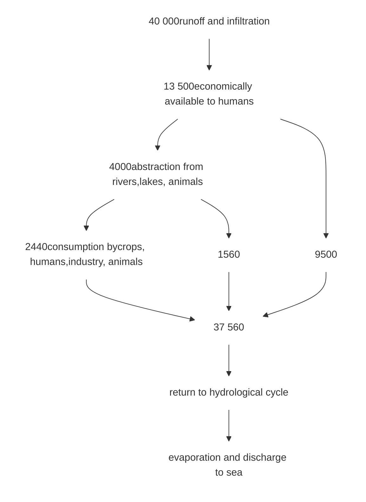
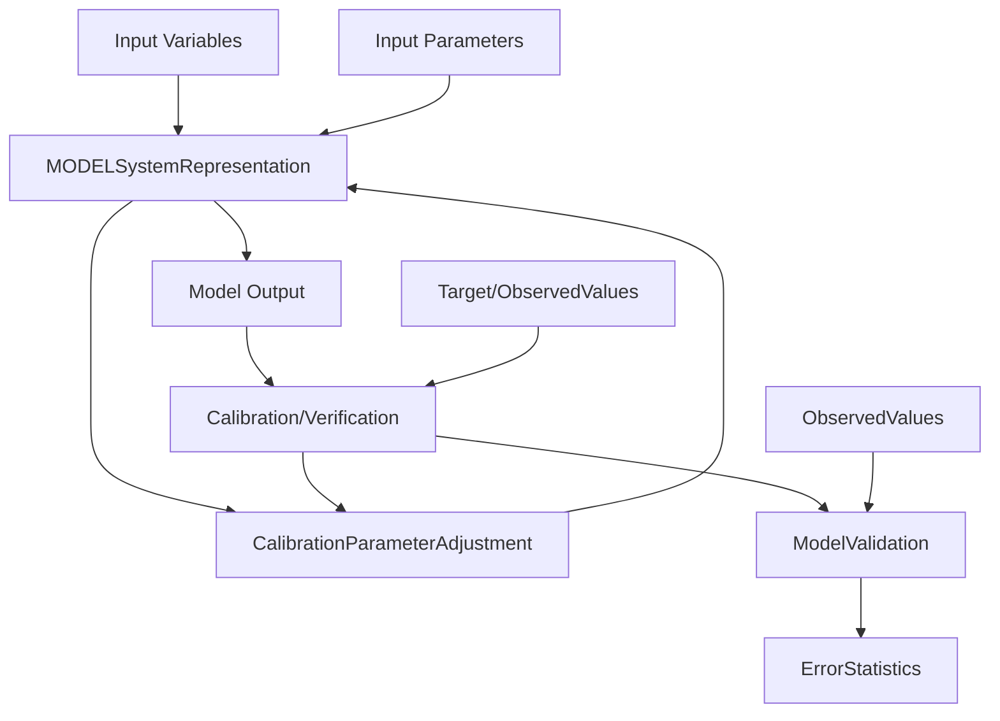
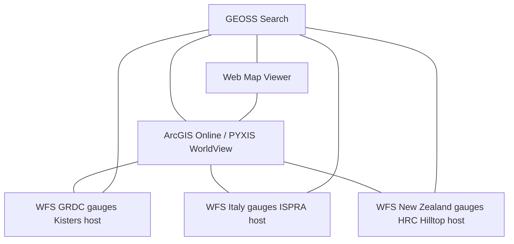
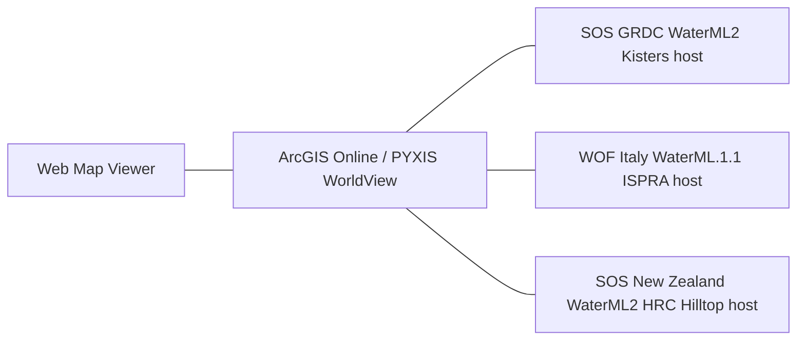
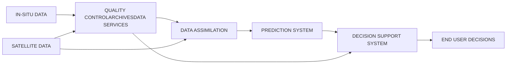
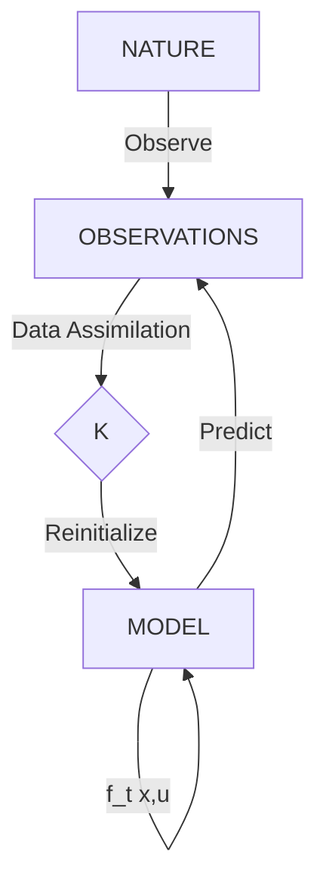
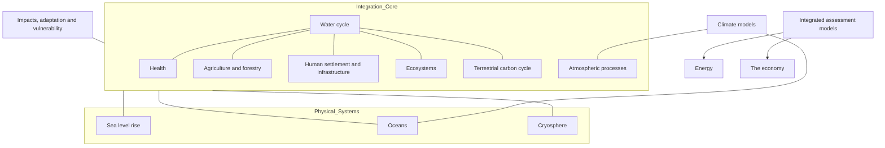
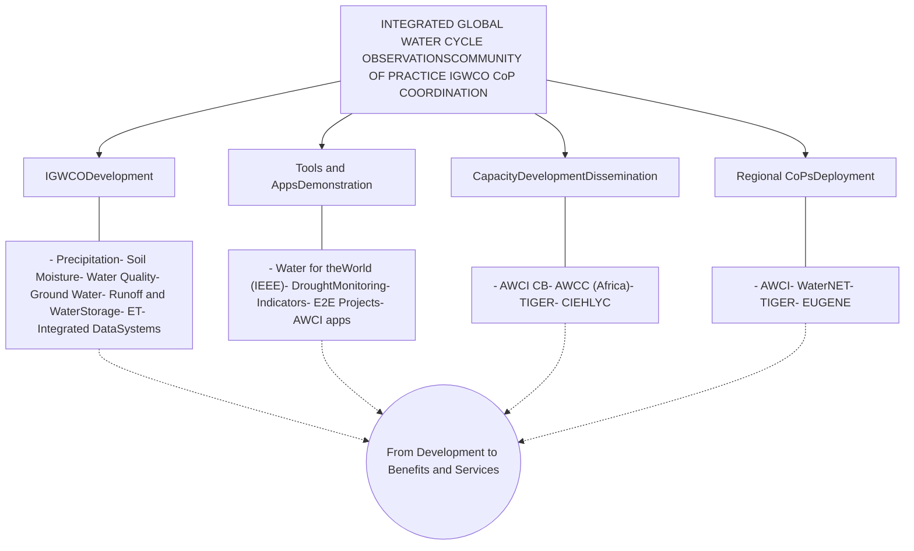
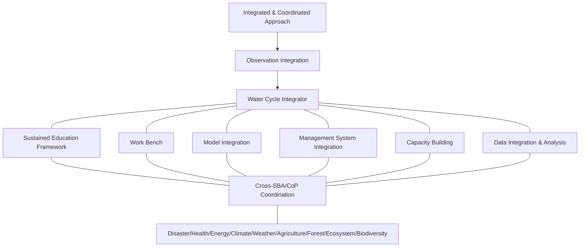

GEO GROUP ON EARTH OBSERVATIONS logo

World map background with water-drop shaped overlays containing images of crops, a person drinking water, a cloud icon, a globe icon, and a deer drinking water

# THE GEOSS WATER STRATEGY
# FROM OBSERVATIONS
# TO DECISIONS

---

# THE GEOSS WATER STRATEGY:
## From Observations to Decisions

---

NO_CONTENT_HERE

---

# The GEOSS Water Strategy: From Observations to Decisions

This GEOSS Water Strategy Report has been prepared for the 2014 GEO Summit in Geneva, Switzerland. It provides a review of the status of water-related activities within the GEO programme, perspectives on activities and developments needed over the next decade, and recommends a number of actions for GEO and its members. The report is a community effort that attempts to present a balanced view of the status of Earth observations and their applications in the water sector from all parts of the globe. GEO Members and Participating Organizations are encouraged to review the Report, discuss specific aspects with the authors and the GEO Water Task Points of Contact, and help the water community to address the recommendations, particularly as they apply to their countries and to the overall goals of GEOSS and water security.

Editor: Richard Lawford
Technical Editor: Andrée-Anne Boisvert

Publisher: Japan Aerospace Exploration Agency
© Copyright GEO 2014. All rights reserved.

Cover design: Tétro Design (Funded by NASA)
Printed in Japan by JAXA and I and A Corporation.

GEO logo

JAXA logo

Group on Earth Observations
GEO Secretariat
7 bis, avenue de la Paix
Case postale 2300
CH-1211 Geneva 2
Switzerland

The Japan Aerospace Exploration Agency
7-44-1 Jindaiji Higashi-machi
Chofu-shi
Tokyo 182-8522
Japan

The GEOSS Water Strategy | i


---


ii | The GEOSS Water Strategy


---

# Preface

The Group on Earth Observations (GEO) is a voluntary partnership of governments and international organizations that is coordinating efforts to build a Global Earth Observation System of Systems (GEOSS). Launched in response to calls for action by the 2002 World Summit on Sustainable Development and by the G8 (Group of Eight), as of January 2014 GEO includes 90 national governments, the European Commission, and more than 70 partner organizations. Through GEOSS, GEO provides a framework within which these partners can develop new projects and coordinate their strategies and investments.

GEOSS will provide decision-support tools to a wide variety of users. GEOSS addresses the needs of the water community through its Water Societal Benefit Area. The "system of systems" will proactively link together existing and planned water cycle observing systems around the world and support the development of new systems where gaps currently exist. It will promote common technical standards for information-gathering and exchange to facilitate the development of coherent datasets. The GEOPortal provides a single internet access point for users seeking water data, imagery, and analytical software packages relevant to all parts of the globe.

Led by the Integrated Global Water Cycle Observations Community of Practice and supported by the Committee for Earth Observation Satellites, the water community has developed a GEOSS Water Strategy Report that gives direction to GEOSS water systems and activities for the next decade. This report provides a number of recommendations that GEO will need to consider over the next months and years. I welcome this Report and look forward to working with all GEO Members to address these recommendations and to strengthen the water component of GEOSS.

Barbara Ryan
Executive Director
Group on Earth Observations

The full GEOSS Water Strategy Report will be available through www.earthobservations.org.

The GEOSS Water Strategy | iii


---


iv | The GEOSS Water Strategy


---

# Summary

## Introduction and Background

The availability of quality water continues to be a major issue for the Earth system and humans in particular. Water is essential for ensuring food and energy security, for facilitating poverty reduction and human health, and for the maintenance of ecosystems and biodiversity. There is a growing concern that the water available in many regions of the world will not be sufficient to meet emerging demands arising from population growth, industrial expansion, and climate change.

The Group on Earth Observations (GEO), which is coordinating the development of the Global Earth Observation System of Systems (GEOSS), addresses water as one of its nine Societal Benefit Areas. This report outlines a strategy for using Earth observations to support improved decision-making to ensure the long-term viability of water resources and to enable the integrated management of water resources at the national, basin, and global scales. In particular, this GEOSS Water Strategy provides a framework for guiding decisions regarding priorities and strategies for the maintenance and enhancement of water cycle observations; enables improved water management based on a better quantification of fluxes and stores in the global water cycle; promotes strategies that will facilitate the acquisition, processing, and distribution of appropriate water data products; provides information on expertise, information systems, and datasets to the global, regional, and national water communities; and increases the availability and use of data, information, and indicators of the quality of inland and near-coastal waters to support operational water quality decision-making.

Working within the GEOSS framework, this Water Strategy gives priority to the use of water-related Earth observations in six critical theme areas. These themes include the global security of domestic and useable water supplies, the adaptation of water resource systems to the impacts of climate change, the water-related health and welfare needs of the poor, protection from hydrometeorological extremes (including floods and droughts), the information needs of the security nexus of water, energy, and food, and access to water for ecosystems and biological systems.

The Report reviews user needs by providing overviews of the use of water, the information needs identified by those who make decisions related to the use of water, and the benefits of engaging users in the co-development of products on an ongoing basis. An important concept here is the Essential Water Variable (EWV), which designates a variable as essential for water management decisions and also as a potential contributor to indicators of environmental change. Strategies for addressing water data product needs must recognize two primary client groups: water cycle variables for climate and macroscale hydrological research, and water variables that are essential for water resources management applications and operations.

The report assists the management of observational assets, which rests with nations and organizations both within and outside the UN System. The Committee on Earth Observation Satellites (CEOS) plans multinational initiatives and coordinates the measurement programme services of the major space agencies, including operational agencies (e.g.,

The GEOSS Water Strategy | v


---

EUMETSAT, JMA, NOAA) and research agencies (e.g., ESA, JAXA, NASA). Through the Global Terrestrial Network for Hydrology, the World Meteorological Organization (WMO) coordinates observational networks and data centres that archive in-situ water cycle data. WMO also manages the Coordination Group for Meteorological Satellites, which coordinates information exchanges on geostationary and polar-orbiting meteorological satellites.

## Priority Water Variables

Water vapour and clouds are important for accurate precipitation forecasts, for estimating surface energy budgets, and for assessing the climate feedback effects that amplify or otherwise interact with the climate change signal. Data are needed on the horizontal and vertical distributions of clouds, their scaling properties, and cloud microphysical properties. Satellites have enabled the development of two-dimensional cloud distributions but the vertical distributions of clouds and in-cloud droplet distributions needed for process parameterizations in models are not yet available; that being said, the EarthCARE mission should address this need. Near-surface humidity measurements can be obtained from ground-based lidar and column water vapour values retrieved from Global Positioning Systems.

Precipitation is a primary input for the surface hydrological cycle. Precipitation measurements are crucial to understanding and predicting the Earth’s climate, weather, streamflow, soil moisture, and water availability. While gauges give accurate measurements at points, the spatial variability of precipitation leads to considerable uncertainty in precipitation maps for areas without dense gauge networks. Integrated measurements, derived from combinations of microwave, infrared, and gauge data, give more reliable areal estimates in data-sparse areas. The precipitation radar (PR) on the joint National Aeronautics and Space Administration (NASA)/Japan Aerospace Exploration Agency (JAXA) Tropical Rainfall Measuring Mission (TRMM) satellite provides precise but infrequent measurements. The upcoming NASA/JAXA Global Precipitation Measurement (GPM) Mission will help to remedy these limitations.

Evaporation and Evapotranspiration (ET) represent the moisture fluxes from the underlying ocean or land surface to the atmosphere. ET measurements can be used to estimate consumptive water loss, especially irrigation losses and non-productive evaporative losses. Accurate flux values at a particular location can be derived from in-situ Bowen ratio and eddy covariance measurements over land and sea surface temperature estimates (for ocean evaporation). Estimating ET and closing the water balance for the continental and global scales remains challenging. Within this Report, evaporation and ET are recognized as Essential Water Variables and are progressing toward recognition as Essential Climate Variables. Higher-resolution satellite thermal imagery is needed to provide better estimates for agricultural and other applications.

Soil moisture is important for climate and water resources management. While some national and regional in-situ soil moisture networks exist (e.g., Australia, China, France, Russia, U.S.A.) for agricultural and research purposes, a global network has yet to emerge. Both active and passive space-based microwave systems have been used to estimate soil moisture. Currently, the European Space Agency’s (ESA) Soil Moisture and Ocean Salinity mission (SMOS) provides operational soil moisture products at a 15-km resolution and repeat coverage of one to three days. Active remote sensing data will soon be

vi | The GEOSS Water Strategy


---

available from NASA’s Soil Moisture Active-Passive (SMAP) mission (to be launched in 2014) for use in estimating soil moisture. Techniques are needed to effectively use in-situ soil moisture to validate and develop new integrated soil moisture products.

River discharge measurements are essential for water management, the design and operation of engineering works (dams, reservoirs, river regulation), and various water-related services (navigation, flood protection, water supply for irrigation, municipal or industrial water use, ecosystem management). Flood-protection programmes rely on accurate river discharge measurements and forecasts. While in-situ methods are currently the most cost-effective and reliable option for streamflow measurements, the decline of in-situ networks and the lack of data sharing by some countries has eroded the capability to carry out global discharge monitoring and assessments. In view of the limited prospects for in-situ networks, efforts are directed at expanding the capability of satellite remote sensing to measure river discharge. Candidate remote sensing sensors for monitoring river discharge include imaging sensors that document water extent and lidar or radar altimeters that can measure river heights. The imaging radar altimeter envisioned for the Surface Water and Ocean Topography mission will be able to combine the measurement of surface water extent with water height, including measuring the surface slope along the river channel.

Continental surface water storage pools (lakes, reservoirs, floodplains, wetlands, river channels) are home to aquatic ecosystems. Although they are important ecosystems, standing water bodies are particularly poorly monitored. Although effective monitoring of wetlands and manmade reservoirs present different challenges, the demands for data on water storage on the terrain create special needs for a strategy combining surface data with new sources of satellite data (ENVISAT, GCOM-W1).

Groundwater, which is becoming a more important source of water in many areas, is removed by natural processes (discharge) and groundwater pumping and is replaced, in whole or in part, by recharge, which is at a maximum during wet periods. To manage groundwater it must be inventoried and its changes must be monitored and forecast. In-situ groundwater measurements are collected in many countries but few countries share these data. Although a regional assessment capability has been developed, the science community’s needs for data have not been met. At larger scales success has been realized in using data from the Gravity Recovery and Climate Experiment (GRACE) twin satellites and a land surface model to estimate changes in groundwater. These capabilities could be strengthened through strong commitments to the launch of GRACE II and to sharing groundwater data internationally.

Many cryospheric variables are needed to support climate studies and water resource management at mid and high latitudes. In particular, data on snow cover and snow water equivalent (SWE), river and lake ice, glaciers, and frozen ground are needed for water resources management and strategies for adapting to climate change. Currently, the cryosphere provides some of the most convincing evidence of climate change. Operational water managers at mid and high latitudes need accurate, frequent SWE measurements with high spatial resolution for estimating spring and summer water supplies and spring flood potential. In-situ snow measurements are affected by local snow processes such as drifting, blowing, sublimation, and aging. Satellite data on snow cover extent, primarily from Landsat, MODIS, GEOS, AVHRR, and AMSR satellites, provide geospatially-consistent

The GEOSS Water Strategy | vii


---

data for large areas. However, SWE, which is derived primarily from passive microwave measurements, is complicated by snow surface temperature and topographic factors.

Water quality represents the suitability of water for specific uses or processes. The lack of measurements in many countries prevents an assessment of the extent of water quality degradation and the subsequent decline of aquatic systems due to human activities such as the discharge of untreated waste and industrial activities. Water quality assessments rely on in-situ discrete water sample collection, field measurements, laboratory analysis, in-situ continuous measurements, and remote sensing methods ranging from sensors placed just above water to space-based satellite observations. Satellite remote sensing is emerging as a potential alternative for assessing some types of water quality issues. Currently, this monitoring detects changes in optical and/or thermal characteristics of the surface water properties and applies to variables such as surface temperature, chlorophyll, coloured dissolved organic material, turbidity, and related variables. Although remote sensing provides geospatial consistency and regular repeat visit times, the images are often affected by cloud contamination and the spatial scales are very coarse. Satellite data must be used in combination with ground-based water quality monitoring to be successful.

Rivers are responsible for the transport of the majority of suspended sediments and their associated contaminants. River sediment transport strongly influences the quality and biodiversity of surface waters, riparian environments, and the functioning of coastal zones. Sediment data, which represent the wide range of sediment processes, need to be collected, archived, and analyzed so that the linkages between river and lake processes and water quality can be fully understood.

## Interoperability and Integration

Interoperability between data and information systems is a core GEO principle that affects water data, from acquisition and quality control to data exchange and information systems (such as the GEOSS Water Portals) and data assimilation systems for prediction applications. Quality assurance is essential because data collected at a specific location must be reliable and produced at the same standard as they are elsewhere. The calibration and validation of satellite data products is usually performed against different kinds of target data (observation) products such as ground-based in-situ observations. Because calibration is so critical in-situ water cycle data must be collected in a consistent way and made freely available for calibration purposes.

The acquisition, archival, and distribution of data relies on interoperability and the comprehensive application of GEO data-sharing principles. Data access challenges include administrative data policies, the uneven distribution of observing stations, and delays in collecting, quality controlling, and processing the data. Data management challenges include the management of large volumes of diverse data types; lags in data dissemination; the provision of advisory services; acquisition of detailed metadata regarding the data and data products; widespread use of non-standardized data exchange formats and transmission protocols and incompatible data standards; lack of remote sensing reprocessing products; difficulty in accessing older hydrological records; uneven application of quality assurance; and declining in-situ network

viii | The GEOSS Water Strategy


---

densities in many countries. Data archival issues arise from inadequate coordination; lack of standardization; different languages of data exchange; and database protection legislation, policies, and practices. This Strategy looks to GEO members to help develop solutions that are appropriate to their economic, political, and social constraints and needs.

The issues of data integration, distribution, and access need to be addressed by a cross-cutting data management system that can integrate multiple variables, fragmented observing networks, and largely non-standardized archiving approaches. Objective-driven metadata databases and the application of innovations for interoperable data-sharing such as World Water Online and Water Markup Language 2 (ML2) hold promise. The GEOSS Common Infrastructure (GCI) and the GEOSS Data CORE (Collection of Open Resources for Everyone) can play important roles in facilitating better data management. Earth system models also have a role in providing estimates for variables that are difficult to measure.

This Strategy proposes the Water Cycle Integrator (WCI) as a way to achieve seamless integration for data management and observational and prediction systems. It will also support policy goals such as Integrated Water Resources Management (IWRM), climate change adaptation, and sustainable development. Integration supports management goals by maximizing the benefits derived from Earth observations while minimizing the duplication of efforts, and reducing the uncertainties in resource management decisions made in data-sparse areas. This GEOSS Water Strategy promotes integration for data products that bring together in-situ and satellite observations, for measurements and process understanding to provide a more complete system representation to improve modelling and prediction, and for the management of water resources by engaging experts and stakeholders from all components of the water resources system (surface water, groundwater, and water quality). The Water Cycle Integrator promotes integration among water and the other disciplines and will provide a set of tools that promote a harmonized approach to collecting, analyzing, and interpreting data for water management. Data assimilation plays a key role in integration because it combines observations within a dynamical model that provides time continuity and coupling between the estimated fields.

### Capacity Development: Individuals, Infrastructure, and Institutions

An expanded capacity development activity aimed at improving global and local water management and demonstrating the value of GEO infrastructure and principles, especially in developing countries, is envisioned in the Strategy. This approach addresses the need for human capacity development through education and training; institutional capacity development by creating a facilitating environment for the use of Earth observations; and infrastructure development by extending the knowledge and tools for accessing, using, and developing Earth observation data and products. Regional activities will contribute to the development of training materials and courses and the launch of demonstration projects and web portals. GEO Water Cycle activities will focus on three developing regions: Africa, Asia, and Latin and Caribbean America. Relevant work being carried out in other parts of the world will also be encouraged.

The GEOSS Water Strategy | ix


---

The activities of the GEOSS Asian Water Cycle Initiative (AWCI) will continue to address four theme areas: floods, droughts, water quality, and adaptation to climate change. This region could be a test bed for the WCI, which would assist experts from Southeast Asian countries in exchanging data, models, experiences, and knowledge, and in implementing capacity development projects.

Africa will continue to be a rich opportunity area for capacity development efforts thanks to Japanese (AfWCCI), European (TIGERNet), and American (SERVIR) efforts. This Water Strategy anticipates the expansion of the GEOSS Africa Water Cycle Coordination Initiative (AfWCCI) and the spread of the use of data in support of improving water security in Africa. A portion of this work will focus on transboundary basins and support for the implementation of IWRM and related policies.

Work in Latin America will continue to build on the Centre of Hydrologic and Spatial Information for Latin America and the Caribbean’s coordination activities. Among its projects, this group has facilitated GEONETCast implementation, the transfer of regional soil moisture data to a global soil moisture database, and collaboration with the Water Center for Arid and Semi-Arid Zones in Latin America and the Caribbean for drought monitoring. Space agencies in South America will be encouraged to play a stronger role in the overall Water Strategy implementation. Other capacity development activities will be encouraged in Eurasia and North America.

The Water Strategy will be implemented through the contributions of partners. Partners will be encouraged to engage in GEO Water activities based on their interests and expertise, their ability to deliver, and policy linkages. JAXA and NASA and other Space Agencies are long-time supporters of water activities by providing satellite data, funding workshops, and supporting GEO Water coordination functions. A more vigorous GEOSS Water programme, as foreseen in this Strategy, will provide more benefits but require more support from GEO member countries. The transition of observational systems from research to operations and the links between operational services and users need to be strengthened. In recent decades, in-situ observations have suffered from national budget cuts and the absence of a “champion” to speak on their behalf. The time has come for strong advocacy for in-situ networks and data needs. The Water community is prepared to assist GEO and WMO in moving their in-situ observing agenda forward.

## Implementation

The post-2015 GEO will provide the framework for implementing the GEOSS Water Strategy. Some approaches from the previous decade will be carried forward, while others will be reviewed, modified, and implemented, as appropriate. More emphasis will be placed on dialogue and coordination. Efforts will be directed at seeking a more substantive and well-funded Secretariat. In the near-term efforts will be focused on the definition of the GEO Water Target, Task (or Tasks), and activities, which will provide a foundation for initiatives foreseen in this Strategy. The GEOSS Water Strategy will build upon the successes of the last decade. Opportunities for moving GEO Water activities forward include the AfWCCI, and its potential to secure funding for substantial demonstrations; JAXA’s Global Change Observa-

x | The GEOSS Water Strategy


---

tion Missions (GCOM) and its collaboration with the Asian Development Bank; the ESA Sentinel missions; NASA missions such as SMAP and its collaborations with USAID through SERVIR; the joint NASA/JAXA TRMM and GPM missions; TIGERNet, and ESA interactions with the World Bank; and projects funded through the European Commission. Stronger links with the WMO and UN Water will also be encouraged to strengthen the Water Task’s links with operational programmes and water policy.

Another opportunity is the Water Cycle Integrator, which could allow GEO to advance its experience in observational system integration, science and model integration, data integration and analysis, cross-Societal Benefit Area collaboration, management system integration, and a sustained education and capacity development framework. A “work bench” concept, supported by a data integration and analysis system will require software tools and expertise to develop, maintain and utilize this system.

Given the urgency of water security in some parts of the world, the GEO water community submits this assessment and its recommendations to GEO as both an opportunity and a humanitarian imperative. GEO can play a unique role by bringing comprehensive water data into information systems that support water security on global and regional scales. This GEOSS Water Strategy provides a roadmap for realizing this goal. Progress in achieving these recommendations will be tracked and reported, successes will be reported, and the potential to contribute to global water security monitoring will be clarified.

The GEOSS Water Strategy | xi


---


xii | The GEOSS Water Strategy


---

# Contributors to the Report

This Report was written by experts from the water community, many of whom are members of the GEO Integrated Global Water Cycle Observations Community of Practice. They are listed according to their role: as authors of a chapter or a section, or as contributors of paragraphs or useful suggestions or review comments.

The GEO Writing Team:

**Editor**: Richard Lawford

**Technical Editor**: Andrée-Anne Boisvert

## Chapter and Section Authors:

* Douglas Cripe (GEO Secretariat, Geneva, Switzerland)

* Balazs Fekete (City University of New York, New York, U.S.A.)

* Ralph Ferraro (NOAA, Maryland, U.S.A.)

* Wolfgang Grabs (WMO, Geneva, Switzerland)

* Steve Greb (State of Wisconsin, U.S.A.)

* Lena Heinrich (Imperial College, London, U.K.; formerly IGRAC)

* George Huffman (NASA/GSFC, Maryland, U.S.A.)

* Toshio Koike (University of Tokyo, Tokyo, Japan)

* Richard Lawford (JAXA; NASA; Morgan State University, Maryland, U.S.A.)

* Massimo Menenti (Delft University of Technology, the Netherlands)

* Norman Miller (University of California, Berkeley, California, U.S.A.)

* Michael Nyenhuis (DLR, Bonn, Germany; formerly University of Bonn)

* Christa Peters-Liddard (NASA/GSFC, Maryland, U.S.A.)

* Will Pozzi (IGWCO, Washington, D.C., U.S.A.)

* Christoph Rüdiger (Monash University, Melbourne, Australia)

* Jiancheng Shi (Chinese Academy of Science, Beijing, China)

* David Toll (NASA/GSFC, Maryland, U.S.A.)

* Sushel Unninayar (NASA/GSFC, Maryland, U.S.A.)

* Stephen Ward (JAXA, Australia)

* Eric Wood (Princeton University, New Jersey, U.S.A; CEOS)

* Yijian Zeng (University of Twente, the Netherlands)

## Contributors:

* Martha Anderson (USDA, Maryland, U.S.A.)

* Nienke Ansem (IGRAC, the Netherlands)

* David Arctur (University of Texas, Texas, U.S.A.)

* Matthew Austin (NOAA, Maryland, U.S.A.)

* John Bolten (NASA/GSFC, Maryland, U.S.A.)

* Mike Brewer (NOAA; NCDC, North Carolina, U.S.A.)

* Bente Bye (Norway)

* Luigi Ceccaroni (Barcelona Digital Technology Centre, Spain)

* Laura del Val Alonso (IGRAC, the Netherlands)

* Bradley Doorn (NASA, Washington, D.C., U.S.A.)

* David Dudgeon (University of Hong Kong, Hong Kong, SAR)

* George Dyke (JAXA, Australia)

The GEOSS Water Strategy | xiii


---

* Jared Entin (NASA, Washington, D.C., U.S.A.)

* Diego Fernandez (ESA, ESRIN, Frascati, Italy)

* Kathleen Fontaine (NASA/GSFC, Maryland, U.S.A.)

* Stephanie Göbel (University of Bonn, Germany)

* Angelica Gutierrez-Magness (NOAA, Maryland, U.S.A.)

* Paul Houser (GMU, Virginia, U.S.A.)

* Chu Ishida (JAXA, Tsukuba, Japan)

* Misako Kachi (JAXA, Tsukuba, Japan)

* Benjamin Koetz (ESA, ESRIN, Frascati, Italy)

* Tiit Kuster (Estonia)

* Pierre Philippe Mathieu (ESA, ESRIN, Frascati, Italy)

* Laura Mereno (Starlab, Spain)

* Satoko Horiyama Miura (JAXA, Tsukuba, Japan)

* Kenji Nakamura (Dokkyo University, Japan)

* Stefano Nativi (CNR-IIA, Italy)

* Osamu Ochiai (JAXA; GEO Secretariat, Geneva, Switzerland)

* Natascha Oppelt (University of Kiel, Germany)

* Florian Pappenberger (ECMWF, U.K.)

* Yubao Qiu (GEO Secretariat, Geneva, Switzerland)

* Michael Rast, (ESA, ESRIN, Frascati, Italy)

* Matthew Rodell (NASA/GSFC, Maryland, U.S.A.)

* Philipp Saile (GTN-H Secretariat, Koblenz, Germany)

* Justin Sheffield (Princeton University, New Jersey, U.S.A.)

* Adrian Strauch (University of Bonn, Bonn, Germany)

* Bob Su (University of Twente, the Netherlands)

* Jacob Sutherlun (NOAA, Maryland, U.S.A.)

* Yukari N. Takayabu (University of Tokyo, Japan)

* Marouane Temini (City University of New York, New York, U.S.A.)

* Kazuo Umezawa (JAXA, Tsukuba, Japan)

* Nick van der Giesen (Delft University of Technology, the Netherlands)

* Rogier van der Velde (University of Twente, the Netherlands)

* Peter van Oevelen (GEWEX, Maryland, U.S.A.)

* Juergen Vogt (European Commission Joint Research Centre, Italy)

* Wolfgang Wagner (Vienna University of Technology, Austria)

* Kym Watson (IOSB, Fraunhofer, Germany)

* Brian Wee (NEON Project Office, Washington, D.C., U.S.A.)

* Rogier Westerhoff (University of Twente, the Netherlands)

* Shizu Yabe (JAXA, Tsukuba, Japan)

Thanks also go to any people not listed above who provided comments and inputs to the Report and were inadvertently left off this listing.

xiv | The GEOSS Water Strategy


---

# TABLE OF CONTENTS

1. Introduction ................................................................................................................................. 1
2. Background .................................................................................................................................. 7
3. User Needs for Water Data and User Engagement ................................................................... 19
    3.1 Overview of Water Uses ..................................................................................................... 19
    3.2 User Requirements Review ................................................................................................ 23
    3.3 Perspectives on the Values and Benefits of Water Information ....................................... 24
    3.4 Essential Water Variables ................................................................................................... 28
    3.5 User Engagement ............................................................................................................... 30
    3.6 Recommendations .............................................................................................................. 32
4. Coordination of Observational Systems .................................................................................... 35
    4.1 The Role of Satellites in Providing Water Data ................................................................. 35
    4.2 The Role of In-situ Data and the Status of In-situ Observational Networksand Data Systems ............................................................................................................... 43
    4.3 Recommendation ............................................................................................................... 49
5. Existing and Planned Observational Systems for Priority WaterCycle Variables ............................................................................................................................ 51
    5.1 Clouds and Water Vapour .................................................................................................. 52
    5.2 Precipitation ........................................................................................................................ 56
    5.3 Evapotranspiration ............................................................................................................. 66
    5.4 Soil Moisture ....................................................................................................................... 73
    5.5 Runoff and Discharge ......................................................................................................... 82
    5.6 Surface Water Storage ........................................................................................................ 87
    5.7 Sub-Surface Water Storage ................................................................................................ 90
    5.8 Cryospheric Variables ......................................................................................................... 95
    5.9 Overarching Recommendations ......................................................................................... 101
6. Existing and Planned Observational Systems for Priority WaterQuality Variables .......................................................................................................................... 105
    6.1 Introduction ........................................................................................................................ 105
    6.2 Water Quality Monitoring ................................................................................................. 106
    6.3 Sediment Monitoring ......................................................................................................... 112
    6.4 Shortcomings and Opportunities ....................................................................................... 113
    6.5 Recommendations .............................................................................................................. 115
7. The Data Cycle: Quality, Management, and Dissemination of Water Cycle Data ..... 117
    7.1 Measurement and Data Acquisition Issues ....................................................................... 117
    7.2 Quality Assurance ............................................................................................................... 119
    7.3 Calibration/Validation Issues ............................................................................................. 122
    7.4 Data Management and Distribution Issues ....................................................................... 125
    7.5 Data Archival Issues ........................................................................................................... 128
    7.6 Data Exchange .................................................................................................................... 130
    7.7 Interoperability: A Critical Element in GEOSS Data Democracy ..................................... 133
    7.8 From Information to Decisions .......................................................................................... 135
    7.9 Recommendations .............................................................................................................. 147

The GEOSS Water Strategy | xv


---

8. Integration across the Water Cycle and Beyond . . . . . . . . . . . . . . . . . . . . . . . . . . . . . . . . . 149
    8.1 Approaches for Addressing the Need for Integration . . . . . . . . . . . . . . . . . . . . . . . 149
    8.2 The Role of Research in Integration . . . . . . . . . . . . . . . . . . . . . . . . . . . . . . . . . . . . . 150
    8.3 Water Cycle Data Integration . . . . . . . . . . . . . . . . . . . . . . . . . . . . . . . . . . . . . . . . . . . 151
    8.4 Water Cycle Model Integration . . . . . . . . . . . . . . . . . . . . . . . . . . . . . . . . . . . . . . . . . . 153
    8.5 Water Cycle Data-Model Integration . . . . . . . . . . . . . . . . . . . . . . . . . . . . . . . . . . . . . 154
    8.6 Coping with Water Cycle Uncertainties in Integrated Products and Applications . . . . . . . . . . . . . . . . . . . . . . . . . . . . . . . . . . . . . . . . . . . . . . . . . . . . . . 159
    8.7 Water Cycle Solution Integration and the GEOSS Water Cycle Integrator . . . . . . 161
    8.8 Recommendations for Water Cycle Integration . . . . . . . . . . . . . . . . . . . . . . . . . . . . 163
9. Capacity Development and Regional Perspectives of Water Cycle Information Applications . . . . . . . . . . . . . . . . . . . . . . . . . . . . . . . . . . . . . . . . . . . . . . . . . . . 165
    9.1 Introduction to GEO Capacity Development . . . . . . . . . . . . . . . . . . . . . . . . . . . . . . 165
    9.2 Regional Capacity Development Activities . . . . . . . . . . . . . . . . . . . . . . . . . . . . . . . . 169
    9.3 Global Capabilities with Regional Applications . . . . . . . . . . . . . . . . . . . . . . . . . . . . 175
    9.4 Training and Institutional Capacity Development . . . . . . . . . . . . . . . . . . . . . . . . . . 176
    9.5 Recommendations . . . . . . . . . . . . . . . . . . . . . . . . . . . . . . . . . . . . . . . . . . . . . . . . . . . . 178
10. Linkages . . . . . . . . . . . . . . . . . . . . . . . . . . . . . . . . . . . . . . . . . . . . . . . . . . . . . . . . . . . . . . . . . . 179
    10.1 International and Global Programmes . . . . . . . . . . . . . . . . . . . . . . . . . . . . . . . . . . . 179
    10.2 National and Regional . . . . . . . . . . . . . . . . . . . . . . . . . . . . . . . . . . . . . . . . . . . . . . . . 184
    10.3 Recommendation . . . . . . . . . . . . . . . . . . . . . . . . . . . . . . . . . . . . . . . . . . . . . . . . . . . . 191
11. Institutional and Funding Issues . . . . . . . . . . . . . . . . . . . . . . . . . . . . . . . . . . . . . . . . . . . . . 193
12. Toward an Implementation Plan . . . . . . . . . . . . . . . . . . . . . . . . . . . . . . . . . . . . . . . . . . . . . 197
    12.1 Building on the Past: The Water Task in the First Phase of GEO . . . . . . . . . . . . . 197
    12.2 Implementation Design for the Water Cycle Integrator . . . . . . . . . . . . . . . . . . . . . 201
    12.3 Preparing for Water Activities in the Post-2015 Phase of GEO . . . . . . . . . . . . . . 203
    12.4 Next Steps in Developing an Implementation Plan . . . . . . . . . . . . . . . . . . . . . . . . 205
    12.5 Summary . . . . . . . . . . . . . . . . . . . . . . . . . . . . . . . . . . . . . . . . . . . . . . . . . . . . . . . . . . . 213
13. References . . . . . . . . . . . . . . . . . . . . . . . . . . . . . . . . . . . . . . . . . . . . . . . . . . . . . . . . . . . . . . . . 215
Appendices . . . . . . . . . . . . . . . . . . . . . . . . . . . . . . . . . . . . . . . . . . . . . . . . . . . . . . . . . . . . . . . . . . 225
    A. List of Acronyms . . . . . . . . . . . . . . . . . . . . . . . . . . . . . . . . . . . . . . . . . . . . . . . . . . . . . . . 225
    B. Classes of Users of Water Information . . . . . . . . . . . . . . . . . . . . . . . . . . . . . . . . . . . . . 233
    C. CEOS Tables . . . . . . . . . . . . . . . . . . . . . . . . . . . . . . . . . . . . . . . . . . . . . . . . . . . . . . . . . . 237
    D. Essential Water Variables . . . . . . . . . . . . . . . . . . . . . . . . . . . . . . . . . . . . . . . . . . . . . . . 241
    E. Calibration/Validation Example . . . . . . . . . . . . . . . . . . . . . . . . . . . . . . . . . . . . . . . . . . 243
    F. The Integrated Climate Extremes Index . . . . . . . . . . . . . . . . . . . . . . . . . . . . . . . . . . . 251

xvi | The GEOSS Water Strategy


---

# 1. Introduction

The availability of freshwater, its spatial and temporal variability in the hydrological cycle, and water quality continue to be major issues for the development of nations, the maintenance of human well-being globally, and the sustenance or rehabilitation of healthy environments. Water is essential for ensuring food and energy security, for facilitating poverty reduction and improving health conditions, particularly in the developing world, and for maintaining ecosystems and biodiversity. There is a growing realization that the available water in many regions of the world will not be sufficient to meet emerging demands (Vörösmarty et al., 2010). The extent of the problem will only be known and adequate plans to address these limitations will only be developed if high-quality observations with sufficient spatial and temporal coverage are available and accessible to scientists and decision-makers. In the case of water management applications, an improved water management framework that includes risk management to safeguard vulnerable populations from hydrometeorological extremes is needed to make full use of these data. The importance of Earth observations in monitoring water and the environment was recognized in the declaration of the 2012 United Nations (UN) Conference on Sustainable Development, otherwise known as Rio +20, which stated, "We recognize the importance of space-technology-based data, in-situ monitoring, and reliable geospatial information for sustainable development policymaking, programming and project operations. In this context, we note the relevance of global mapping and recognize the efforts in developing global environmental observing systems, such as the Eye on Earth network and through the Global Earth Observation System of Systems" (UN, 2012).

While there are a number of initiatives designed to develop research strategies or aid strategies related to water, the Global Earth Observation System of Systems (GEOSS) Water Strategy is unique in its focus on Earth observations and its compatibility with the broader GEOSS framework. This Report summarizes the status of water cycle activities being carried out under the Group on Earth Observations (GEO) and outlines the steps that will be needed to advance these activities over the next decade. It is intended for GEO members (nations and organizations) who need to understand how they can create a stronger water activity within GEO. The Report also addresses the needs of water resource managers seeking to develop modernized management systems that can take full advantage of the latest science and technologies that can make new information available to them. It provides information for stakeholders of all types, including researchers who need to be aware of priority needs for increased understanding and the potential of new technologies that will be emerging in the next decade; investors who need to plan strategies to effectively invest in future water infrastructure, including treatment facilities; and to end-users who need to plan their futures based on the assurance that they will have uninterrupted access to safe water.

Within the Earth system, water is stored in three principal reservoirs: oceans, atmosphere, and land—including surface and subsurface water storage—and is continuously cycling between these reservoirs. The water cycling through the Earth system satisfies human needs and uses, supports the Earth's ecosystems, and provides basic functions in the atmosphere's circulation by exchanging heat between the Equator and the polar regions. This cycling, which is modulated by the march of the seasons and by shorter-term variations in the weather, generally

The GEOSS Water Strategy | 1


---

Schematic of the water cycle showing processes like precipitation, evaporation, and groundwater flow

**Figure 1.** The water cycle dominates the Earth-climate system, as shown in this schematic of the water cycle (USGCRP, 2003).

provides continuity in the regional and local freshwater supply. Figure 1 shows the cycling of water through the environment.

Freshwater resources are distributed very unevenly around the globe. The stores of water are very different in size. Only about 3% of the Earth’s water resides as freshwater on the land. Furthermore, two-thirds of this freshwater exists in ice caps, glaciers, permafrost, swamps, and deep aquifers, where it is largely inaccessible. A very small fraction of the total is held in the atmosphere, but it plays a critical role in climate and in the transport and distillation of ocean water that precipitates over the land surface. The annual amount of precipitation falling over an area of land is often used to estimate the renewable part of water availability. In practice, the short-term supply may be greater because it can be supplemented with groundwater pumping and reservoir storage and, in some cases, by desalinization of water.

Within the Earth system, water exists in its vapour, liquid, and ice phases. As a vapour, it acts together with energy inputs and transfers to drive the atmospheric circulation and influence the climate system. In liquid form, water moves over and through the Earth’s crust, transporting the nutrients, contaminants, and biota that become dissolved or suspended in the medium. In water’s solid form, the area of snow and ice expands and contracts and its depth increases and decreases in the polar and mountain regions with the seasons. The melting of this snow and ice cover affects runoff and flood potential in the spring, while high albedo snowpacks and ice cover changes affect the regional energy balances of the Earth’s surface during cold seasons. Consequently, climate, weather, and hydrologic prediction systems must consider water variables both as key inputs and critical outputs.

2 | The GEOSS Water Strategy


---

GEO and the water science community have worked together to develop this Report to consolidate and communicate our successes and plans to programme managers, policy-makers, and fellow scientists who would benefit from a strategy and plan for water-related observational and information systems and services under the GEOSS framework. The Report also provides an update on information related to water cycle observations, articulated in the Integrated Global Observing Strategy Partnership (IGOS-P) water cycle theme report (IGOS-P, 2004). Based on the circumstances in 2004, that report set out the needs for measuring water cycle variables, provided information on new systems, and proposed actions whereby space agencies could meaningfully address the water issues of the world. Since the IGOS-P report was published, the links between observations, data providers, and user communities have been strengthened within the GEOSS framework. In addition, GEO facilitated dialogue across sectors, leading to a more comprehensive appreciation of the scope of user needs for water data. The present Report, which discusses the further development of the GEOSS water component in the post-2015 time frame, places a greater emphasis on applications than the previous report. It also examines the progress of the Earth observation community in addressing the gaps identified in the 2004 report. Some of the recommendations in this Report address gaps in the implementation of the IGWCO recommendations (IGOS-P, 2004) along with updates and other programme gaps that have been identified through the present review. The Report also features discussion on capacity-building, training, and user engagement, thus encouraging GEO to reach a broader water community. As discussed in Chapter 2, drivers of change such as growing populations, growing expectations in some emerging countries, and climate change are amplifying issues such as water security and the Water-Energy-Food (W-E-F) Security Nexus (World Economic Forum, 2011), which must be addressed.

This GEOSS Water Strategy is intended for GEO members who need to understand the issues related to water to enable them to deliver improved support to their national economies and stakeholders and stronger commitments to GEOSS water activities. Implementation of the strategies in this Report will enhance the value of water information because it will provide the creators of water data products and the managers of observational networks with the linkages to the user communities and stakeholders that are necessary to enable their contributions to become sustainable. Primary users of this Report will include decision-makers, ministries that set the agenda for water activities, funding agencies that need guidance on funding priorities, and scientists and innovators looking for the next frontier in water research and technology. It will also support a broader range of stakeholders in the developing world who need water information for decision-making (see Fig. 2); the water cycle scientific community, which needs direction on future research needs; the Committee on Earth Observation Satellites (CEOS) and the space agencies who seek new ideas for missions and sensors to measure new water variables (or currently observed variables with more efficient sensors); the World Meteorological Organization (WMO) and other international agencies and programmes that address global information needs and the global environmental conditions through research and applications; GEO members and national agencies responsible for in-situ data; and the United Nations and other international water programmes with policy responsibilities. In addition, the Report provides background information for users who are seeking an overview of the types of water data and services that will be available through GEOSS and how they can access these services, and for educators and trainers who need an inventory of data and services for education and capacity-building. In order to make

The GEOSS Water Strategy | 3


---

GEOSS Capacity Development training programme for water and geospatial information specialists in Africa.

**Figure 2.** GEOSS Capacity Development puts Earth observations and techniques in the hands of water experts in developing countries. This photo shows a training programme for water and geospatial information specialists in Africa. (Courtesy of the National Oceanic and Atmospheric Administration [NOAA].)

this Report more valuable to its audiences, a number of websites have been included throughout as sources for additional information.

This Water Strategy prioritizes issues of global concern based on their implications for humanity and nature. Pursuing these priorities will help ensure that the GEO science community works together to address water issues that are recognized as global priorities. The overall vision supported by this Strategy involves the development and delivery of information services that will enable the integrated management of water resources at the national, basin, and global scales. Such an approach will rely on research findings to develop new observational capabilities, data products, and information systems and services. Technologies that enable the integration of observational systems and data services across sectors or Societal Benefit Areas (SBA) may rely on existing information technologies but will also exploit the emerging fields of mobile technologies and artificial intelligence. This overall mission is directed at the following objectives:

1) Provide a framework for guiding decisions regarding priorities and strategies for the maintenance and enhancement of water cycle observations to support:

* Monitoring climate variability and change,

* Effective management and sustainable development of the world’s water resources,

* Societal applications for resource development and environmental management,

* Specification of initial conditions for weather, climate, and water forecasts, and

* Research directed at priority water cycle questions, such as defining the role of water in the Earth system and cloud and land feedback effects on the climate system.

4 | The GEOSS Water Strategy


---

2) Enable improved water management based on a better quantification of fluxes and stores in the global water cycle, eventually leading to an ability to close the water budget, to assess the quality of water, and to quantitatively describe the factors that control the water budget.

3) Promote strategies that will facilitate the acquisition, processing, and distribution of the data products needed for effective management of the world’s water resources. To achieve these goals, initial activities will rely on space-based systems and enhancements to in-situ networks that are currently in place, planned, or proposed.

4) Provide expertise, information systems, and datasets to the global, regional, and national water communities through support to United Nations Water and its programmes, the International Council for Science (ICSU) Future Earth Programme, non-governmental water programmes such as the Global Water Partnership (GWP), and regional and national water and Earth observation programmes.

5) Increase availability and use of data and information on the quality of inland and near-coastal waters to support an operational water quality decision-making system. This will include generating routine, reliable human and ecosystem health indicators from satellite and in-situ data and data assimilation capabilities.

6) Enable water management communities in developing countries to make more effective use of water information through improvements to their expertise (through training); improvements to their institutions (through implementation of new strategies and policies to broaden the use of Earth observations); and through improvements to their infrastructure (by providing better hardware and software).

The GEOSS Water Strategy | 5


---


6 | The GEOSS Water Strategy


---

# 2. Background

## Scope of Freshwater Issues

Water plays a critical role in human well-being and ecosystem health because it is an essential constituent of all living species. Land areas without access to safe freshwater are generally uninhabitable. Water is an irreplaceable factor for many resource-based industries and is required for health, recreation, and transportation. Industrial sectors that are very dependent on water security include agriculture, forestry, energy, ecology, human health, and biodiversity, among others. However, water’s central role is only beginning to be explicitly integrated into resource planning and management and it generally takes second place to economic considerations. Issues related to water security continue to multiply as the Earth’s population grows and expectations change.

To increase the effective use of Earth observations in water management, it is important to strengthen the collection and analysis of hydrological data and the production and distribution of relevant data products. The collection and dissemination of data can be facilitated by implementing good governance practices and by following GEO’s principles of open access and distribution of data at minimum cost. It can also be facilitated through GEO members’ commitment to strengthening networks, implementing water management plans, and vigorously supporting GEOSS water activities. However, it must be recognized that GEO’s influence in successfully ensuring the continuation of these programmes is limited by its volunteer nature. GEO support is only as strong as its members’ willingness to make the investments needed to strengthen observational networks and implement the recommendations included in this Report.

Specific water resources issues that will be addressed through this Strategy include:

1) Enhancing water security by providing water managers with more reliable information, assessments, and projections of water use and availability,

2) Adapting to climate and global change through the development of better scenarios for water and for tools to evaluate impact mitigation options,

3) Developing warning systems for hydrometeorological hazards, including droughts and floods,

4) Improving the health and welfare of the poor in developing countries through better access to water information,

5) Addressing W-E-F Security Nexus issues by developing integrated datasets, analyses, and management tools, and

6) Supporting human and environmental health and resilience through better water data and information.

Humanity needs to learn how to respond effectively to the global environmental changes that threaten it. The International Council for Science describes its new environmental programme as follows: “Future Earth must answer fundamental questions about how and why the global environment is changing, what are likely future changes, what are the implications

The GEOSS Water Strategy | 7


---

for humans and other species, and what opportunities reduce risks and vulnerabilities, enhance resilience, and create prosperous and equitable futures” (ICSU, 2012). This GEOSS Water Strategy directly supports two of ICSU’s challenges (ICSU, 2010), namely:

1) Developing the observation systems needed to manage global and regional environmental change: Future Earth research requires access to a sustained capability to observe changes across the Earth system, to discover unknown relationships, and to drive Earth system models.

2) Data Systems: Future Earth will need access to and will bring large volumes of diverse environmental or social data together.

In addition, this Strategy provides observational support for other challenges dealing with thresholds and responses that facilitate global sustainability. GEO will support these grand challenges through its contributions to the new Future Earth programme.

GEO promotes data-sharing and interoperability between observation systems. This will occur as GEO addresses the scientific challenges identified by ICSU, with a particular focus on linkages with water and the other eight Societal Benefit Areas (see Fig. 3). In particular, GEO is advancing collaborations across thematic domains by developing a technical and social infrastructure with agreed-upon data-sharing principles to facilitate access to and use of available resources and by building institutional capacity. GEOSS and its Water Task, together with the other GEOSS components, constitutes a unique global system that can contribute to human security, well-being, and the transition to a green economy. The international community can strengthen global Earth observations and support partners as they share their data with each other, thereby helping society achieve sustainable development.

One of the most fundamental challenges facing humanity in the twenty-first century lies in successfully addressing the global environmental changes that are threatening it. An increased world population combined with growing economic wealth, will put major pressures on strategic resources—energy, food, and water. The impacts of climate change will be amplified by these stresses. A consequence will be continued and, in some cases, increased disparities within countries and across continents (e.g., rapid increase in the number of people with limited access to fresh food and water) and growing potential for political tensions and open conflicts, particularly in developing countries.

GEO has provided a framework within which issues related to water could be integrated with other issues. For example, GEO has promoted more effective interactions between water and agriculture. A list of the potential linkages between water and other GEO Societal Benefit Areas is given Table 1. Many of these linkages are currently being developed within GEO and will continue to be strengthened during the post-2015 GEO period.

GEO has worldwide influence because it consists of 90 countries and more than 70 participating organizations that help develop GEOSS by carrying out activities as part of the ten-year GEOSS implementation plan (2005-15) (GEO, 2005). Among other actions, GEO has been developing comprehensive, coordinated, and sustained Earth observations and information to support sound decision-making by promoting its Data Sharing Principles (DSP) and by establishing the GEOSS Common Infrastructure (GCI). GEO is now creating globally- and regionally-coordinated frameworks for its Societal Benefit

8 | The GEOSS Water Strategy


---

The Global Earth Observation System of Systems diagram showing Societal Benefit Areas: Health, Energy, Climate, Agriculture, Ecosystems, Biodiversity, Water, Weather, and Disasters.

**Figure 3.** The Societal Benefit Areas in the 2005-15 GEO programme. (Courtesy: GEO Secretariat.)

Areas and themes, including topics such as forestry, agriculture, biodiversity, and water. These activities demonstrate the value of Earth observations and information and serve as a model for regional cooperation, enabling scientists, practitioners, decision-makers, citizens, and other stakeholders to work together.

During GEO’s 2005-15 phase, the target for water activities converged to the following description: “By 2015, produce comprehensive sets of data and information products to support decision-making for efficient management of the world’s water resources, based on coordinated, sustained observations of the water cycle on multiple scales” (GEO, 2009). This target has been successfully pursued in the first phase of GEO through a number of activities. However, the need to fully engage users and maximize the benefits of these efforts for society may not have been fully realized because the target did not include specific requirements for the demonstration of the use of the information to assess the nature of the benefits. As a result, some specific policy issues and user groups will be targeted in the post-2015 period of GEO. Six priority demonstration areas for GEO Water in 2015-25 are described below.

1. **Enhancing water security by providing water managers with more reliable information, assessments, projections of water use and availability, and support to IWRM**

Human activities affect the water cycle directly and indirectly. River control, irrigation infrastructure, and general water management practices lead to the reorganization of the patterns of water movement and use. Indirect changes occur when climate and other changes alter precipitation, river and land use, evapotranspiration, river discharge, soil moisture, and groundwater patterns. The complexity of these interactions and the range of their space and time scales add to the difficulty of defining observational requirements for water information. The wide range of observations needed to meet these diverse needs is described in Chapter 3.

Global averages tell only part of the story. If annual global runoff were equally accessible to everyone in 1997, there would be approximately 7,700 m³ of water per person per year

The GEOSS Water Strategy | 9


---

**Table 1.** Interactions between the GEO Water SBA and other SBAs. \*Special cross-cutting topics that are not yet SBAs in the GEO Implementation Plan.

<table>
  <thead>
    <tr>
        <th>Societal Benefit Area</th>
        <th>Links with Water Information</th>
    </tr>
  </thead>
  <tbody>
    <tr>
        <td rowspan="6">Agriculture</td>
<td>Drought monitoring</td>
    </tr>
<tr>
        <td>Irrigation planning</td>
    </tr>
<tr>
        <td>Water–Energy–Food Nexus</td>
    </tr>
<tr>
        <td>Soil moisture</td>
    </tr>
<tr>
        <td>Fertilizers</td>
    </tr>
<tr>
        <td>Water quality</td>
    </tr>
<tr>
        <td rowspan="4">Biodiversity</td>
<td>Water stress</td>
    </tr>
<tr>
        <td>Impacts on biota</td>
    </tr>
<tr>
        <td>Water infrastructure and biodiversity</td>
    </tr>
<tr>
        <td>Wetlands mapping</td>
    </tr>
<tr>
        <td rowspan="6">Climate</td>
<td>Evapotranspiration</td>
    </tr>
<tr>
        <td>Precipitation</td>
    </tr>
<tr>
        <td>Soil moisture</td>
    </tr>
<tr>
        <td>Drought</td>
    </tr>
<tr>
        <td>Climate change impact assessments</td>
    </tr>
<tr>
        <td>Adaptation to climate change</td>
    </tr>
<tr>
        <td rowspan="3">Ecosystems</td>
<td>Water and ecosystem services</td>
    </tr>
<tr>
        <td>Aquatic habitat in drought conditions</td>
    </tr>
<tr>
        <td>Wetlands mapping</td>
    </tr>
<tr>
        <td rowspan="5">Energy</td>
<td>Water–Energy–Food Nexus</td>
    </tr>
<tr>
        <td>Hydropower</td>
    </tr>
<tr>
        <td>Cooling water</td>
    </tr>
<tr>
        <td>Geothermal</td>
    </tr>
<tr>
        <td>Biofuels</td>
    </tr>
<tr>
        <td rowspan="4">Disasters</td>
<td>Floods</td>
    </tr>
<tr>
        <td>Droughts</td>
    </tr>
<tr>
        <td>Groundwater</td>
    </tr>
<tr>
        <td>Early warning systems</td>
    </tr>
<tr>
        <td rowspan="4">Health</td>
<td>Water quality</td>
    </tr>
<tr>
        <td>Precipitation</td>
    </tr>
<tr>
        <td>Surface water storage</td>
    </tr>
<tr>
        <td>Availability of potable water</td>
    </tr>
<tr>
        <td rowspan="5">Land Management *</td>
<td>Runoff</td>
    </tr>
<tr>
        <td>Erosion</td>
    </tr>
<tr>
        <td>Sediment production</td>
    </tr>
<tr>
        <td>Infiltration</td>
    </tr>
<tr>
        <td>Pollution/chemical transport</td>
    </tr>
<tr>
        <td>Oceans *</td>
<td>Coastal runoff</td>
    </tr>
<tr>
        <td rowspan="4">Socio-Economic *</td>
<td>Water use</td>
    </tr>
<tr>
        <td>Role of water in trade</td>
    </tr>
<tr>
        <td>Transportation</td>
    </tr>
<tr>
        <td>Urban water issues</td>
    </tr>
<tr>
        <td rowspan="7">Water Management<br/>(Water SBA)</td>
<td>Water availability</td>
    </tr>
<tr>
        <td>Precipitation</td>
    </tr>
<tr>
        <td>Snowpack</td>
    </tr>
<tr>
        <td>Streamflow</td>
    </tr>
<tr>
        <td>Surface water storage</td>
    </tr>
<tr>
        <td>Water withdrawals</td>
    </tr>
<tr>
        <td>Water infrastructure planning</td>
    </tr>
<tr>
        <td rowspan="3">Weather</td>
<td>Precipitation</td>
    </tr>
<tr>
        <td>Soil moisture</td>
    </tr>
<tr>
        <td>Floods</td>
    </tr>
  </tbody>
</table>

10 | The GEOSS Water Strategy


---

(WMO, 1997). However, with the doubling of the world’s population since 1997, this number has dropped to less than 3,850 m³. Due to the uneven distribution of water over the Earth’s surface, people in the world’s water-short areas have much less water. This average amount is further reduced by ecological flows needed to ensure ecosystems and fisheries have sufficient water to survive and the large volume of freshwater locked in glaciers and permafrost. However, this dramatic decrease mainly reflects the consequences of rapid population growth, which often occurs in areas where stress on water resources already exists (Postel et al., 1996). The availability of safe water is further reduced by activities that degrade water quality to levels where it is no longer fit to drink or to use for other purposes, and by inadequate water treatment.

Long-term planning to ensure water security requires accurate information to quantify the water available on the surface and in the sub-surface over long time scales. Quantifying the amount of water stored in different reservoirs is an important challenge for the GEOSS Water Strategy. Current GEO Water Task activities have helped to clarify which data are most critical for forecasting variations in the stores and fluxes of water on a wide range of space and time scales. One essential measurement involves the spatial distribution of precipitation that falls to the ground and is subsequently partitioned into runoff, evapotranspiration, and infiltration. Precipitation is also complex because of its large spatial variability, as shown in Figure 4. Beyond observations, models and data assimilation systems are needed to monitor changes in surface and sub-surface water stores arising from precipitation events. Users also rely on the availability of integrated precipitation data products that combine in-situ and satellite data as well as background information and model output.

Water security is a central component of sustainable development and good water management practices are central to realizing that contribution. The process of managing water must involve all stakeholders, must consider water legislation and policy, and must take into consideration the intergenerational issues related to possible water legacies. Although water issues and frameworks such as Integrated Water Resources Management (IWRM) have been advanced for several decades, progress in their implementation has been slow. Water was a central theme for the Rio conference in 1992, the Johannesburg Conference on Sustainable Development in 2002, and for Rio +20 in 2012, among others. Water issues will also play a critical role in the post-Hyogo framework, the implementation of the post-2015 Millennium Development Goals and, possibly, the Sustainable Development Goals (SDG). To maximize the benefits of observations, the water community must work with the policy community to relate observations to governance issues so that society can use observations to enhance the transparency of decision-making. Polycentric governance solutions require the distribution of power and, hence, data and knowledge to a range of stakeholders, from federal and state government officials to watershed conservation district managers and the public. While it is difficult to achieve full equality among partners involved in the decision-making process, it is possible to level the playing field by ensuring that everyone has access to all the information needed for decision-making. One contribution to this goal would be achieved by giving people access to the latest, best, and most comprehensive water data through a water portal.

The urgent need to assess hydrological information—the projected increased variability in the availability and distribution of freshwater resources—demands political commitment to support and advance technology for the collection and analysis of hydrological data. More up-to-

The GEOSS Water Strategy | 11


---

A rain shaft showing small-scale fluctuations in precipitation.

**Figure 4.** Accurate measurements of rainfall are needed to estimate water availability. Variations within this rain shaft illustrate the small-scale fluctuations in precipitation that make detailed characterization of water cycle processes very challenging. (Source: University Corporation for Atmospheric Research Digital Image Library, www.fin.ucar.edu/res/sites/imagelibrary.)

date information will enable policy-makers to make more informed decisions regarding water resources management. This information should be actionable, meaning that it should be related to real elements of a water management system with straightforward relationships between better information and effective interventions.

## 2. Adaption to climate and global change through the development of better scenarios for water

Climate change arising from increasing concentrations of greenhouse gases in the atmosphere is expected to have many implications for the water cycle across the globe. Precipitation is expected to increase at higher latitudes, with more of it falling as rain. In addition to changes in precipitation patterns, surveys of climate change and water resources (Lawford, 2011) indicate that runoff seasonality will change, the frequency of very intense precipitation events will increase, and drought events may become more commonplace. Monitoring programmes are needed to assess the scenarios generated by climate models regarding the rates of change in individual variables and the integrated effects of climate change and other global change impacts.

Our understanding of climate change is leading to revisions in the scientific basis for water planning and management. Frequently, basic plans for water resources are expressed in terms of "risk levels" and the "probability of extreme events." While stable long-term averages are still used as a working model to produce extended time series of hydrological data for planning long-term water resource allocations and infrastructure design, it is recognized

12 | The GEOSS Water Strategy


---

that the water cycle has very large intra-seasonal, seasonal, inter-annual, and longer-term variability over multiple spatial scales. Furthermore, global change is expected to result in changes in the seasonality of peak flows (Stewart et al., 2005), flow volumes, and in the frequency and intensity of extremes. This increased variability and uncertainty has led to the conclusion that the stationarity of time series is no longer a solid foundation for water infrastructure design statistics (Milly et al., 2008). Enhanced water cycle observations are needed to monitor and improve the understanding of the consequences of this variability for local water resources management.

The GEO-facilitated global drought, flood, and hydrologic extreme monitoring effort has rested on developing a higher spatial-scale monitoring effort at the continental scale (and sub-continental scales) that is more valuable to users, emergency managers, water managers, and government agencies. For example, GEO partnerships are now able to provide greater data coverage than was previously available. However, in some regions, the total ground-based observation station density is inadequate and satellite-based observations are needed to develop integrated data products to improve drought monitoring. GEO is facilitating efforts to incorporate these diverse regional effects into a global framework.

## 3. Developing warning systems for hydrometeorological hazards, including droughts and floods

This Water Strategy focuses on observational support for two types of hydrologic extremes: droughts and floods (with links to landslides). Some aspects of these events are coordinated with the Disasters SBA, which concerns itself with warnings, impact reduction, clean-up operations, and damage assessment. The development of warning systems requires an adequate observational system that supports monitoring and prediction capabilities. The function of these systems and the time scales on which they focus vary with the type of event. Floods can arise from extensive heavy rainfall events, including thunderstorm events in small catchments (leading to flash floods), pluvial periods over large areas, snowmelt events, and ice jams that block river flow. For flood warning systems, antecedent land surface conditions are critical because saturated soils, full reservoirs, and wetlands can lead to greater flood vulnerability. Accurate precipitation forecasts are particularly important since they give the timing, duration, and intensity of the rainfall. Strategies for monitoring precipitation are described in detail in Chapter 5. The prediction of precipitation events is dependent on initial soil moisture conditions (Koster et al., 2004) as well as the adequacy of prediction models. Flood intensity is determined by the volume of water that runs into discharge channels and rivers. Monitoring these water levels is critical for giving evacuation notices and minimizing loss of life and property. Flood monitoring is very important to undertake at the basin scale and should be a central theme for IWRM applications in transboundary basins. The GEOSS Water Strategy focuses on providing risk assessments of floods of different intensities based on observational and forecast data for the purposes of advising on rescue and recovery operations.

Droughts often begin with a stretch of days with little or no precipitation and, frequently, few clouds and warm temperatures. Drought monitoring is important for determining when droughts have occurred and the extent of those events and their impacts. Variables that are of value in monitoring drought include precipitation (or the lack of it), soil moisture, the vigour of vegetation, and the depletion of surface and groundwater storage. The impacts of

The GEOSS Water Strategy | 13


---

drought are critical for agriculture and forests (see Fig. 5 for an example). GEO contributes to new, expanded measurements of key drought variables and to the integration of these results into a global framework for drought monitoring.

Drought information services delivered through the U.S. National Integrated Drought Information System (NIDIS) and NOAA’s National Climate Data Center (NCDC) and its partners provide the infrastructure for seamlessly moving from the global scale to the continental scale and to smaller spatial scales. Regional and national drought monitors receive inputs from the analysis of in-situ and satellite data as well as outputs from models (e.g., the North American Land Data Assimilation System [NLDAS] drought monitor) that contribute to the global system currently under development as a component of the GEO Water Task. Regional drought monitors that contribute to this global effort include the North American Drought Monitor (NADM), the Joint Research Center (JRC) European Drought Observatory, the South American Drought Monitor, and pan-African drought coverage by the Princeton African Drought Monitor, and the European Framework Drought Early Warning for Africa (DEWFORA), which includes the African Drought Observatory. DEWFORA’s sister European Framework project, the Global Water Scarcity Information Service (GLOWASIS), includes global coverage, albeit at a relatively coarse scale for a first approximation, of not only drought but also water scarcity (“water stress”), situations in which water demand outstrips available water supply. Table 2 summarizes selected projects that provide information that is expected to be integrated into the GEO global drought monitor.

From a scientific perspective, droughts and floods are analyzed in the context of dry and wet anomalies in the regional water cycle. From the perspective of water managers who must plan for these events and ensure that infrastructure is adequate to prevent flood and drought damage, analyses must address the frequency of occurrence of these events. Flooding also presents unique monitoring and forecasting issues. Flood flow levels are often compared to “normal” reference water levels to determine the extent to which they exceeded expected values. The choice of this reference level presents a challenge since reference levels for a particular period are very dynamic and are often in a state of flux.

Monitoring hydrometeorological extremes (droughts and floods) requires trans-national reporting and analyses and calls for improved global monitoring and forecasting capabilities combined with strategies for reducing vulnerabilities. Extremes are identified by their exceedance of a threshold value. Often these thresholds are associated with a level of impact that requires governments to take action. Frequency distributions are fitted to the distribution of these exceedance events. These distributions, which are dependent on the climate regime in a particular location, may change due to climate change, thereby leading to increases in the number of exceedances and necessitating better guidance for society on how they could change infrastructure and services in the future.

## 4. Improving the health and welfare of the poor in developing countries through better access to water information

A substantial percentage of the world’s population lives in poverty, especially in the developing world (see Fig. 6). In particular, Hoff (2011) notes that there are an estimated 1 billion subsistence farmers, 1 billion undernourished people, 2 billion people surviving on inadequate diets, 1 billion slum dwellers, 1 billion people without access to safe drinking water, 2 billion people without adequate sanitation, and 2 billion people without access to modern

14 | The GEOSS Water Strategy


---

Firefighters battling the Taylor Creek blaze in a dry forest environment.

**Figure 5.** Drought conditions lead to dry forest environments and increase the potential for severe forest fires. In this photo, firefighters battle the Taylor Creek blaze, one of several fires that burned over 75,000 acres in south-eastern Montana in the summer of 2012. (Source: USFWS/Gerald Vickers via InciWeb.org; see Hansen et al., 2012.)

forms of energy (with some individuals falling into multiple categories). In summary, more than 28% of the world’s population does not have access to the minimum standard for sanitation, nutrition, and modern forms of energy.

Access to safe water is paramount to human health. Water-borne diseases such as diarrheal diseases (including cholera) and leptospirosis as well as vector-borne diseases such as malaria and dengue fever (both transferred via mosquitoes) present a severe burden. Climatic and environmental factors such as precipitation, temperature, soil moisture, evaporation, and runoff impact the prevalence of pathogens and vectors in water bodies. Furthermore, agricultural and mining operations lead to water contamination by pollutants such as pesticides, nitrates, phosphates, cyanides, and heavy metals. They contaminate the ground-

**Table 2.** List of selected projects that support the GEO global drought monitoring initiative.

<table>
  <thead>
    <tr>
        <th>Project</th>
        <th>Variable</th>
        <th>Global</th>
        <th>Regional</th>
        <th>National</th>
        <th>Lead Country</th>
    </tr>
  </thead>
  <tbody>
    <tr>
        <td>DEWFORA</td>
<td>Drought</td>
<td>Yes</td>
<td>Yes</td>
<td> </td>
<td>European Commission<br/>(European Centre for Medium to<br/>Long Range Forecasting)</td>
    </tr>
<tr>
        <td>GLOWASIS</td>
<td>Water Stress</td>
<td>Yes</td>
<td>Yes</td>
<td> </td>
<td>European Commission</td>
    </tr>
<tr>
        <td>Copernicus</td>
<td>Water information</td>
<td>Yes</td>
<td>Yes</td>
<td> </td>
<td>European Commission</td>
    </tr>
<tr>
        <td>NLDAS</td>
<td>Water cycle variable</td>
<td>Yes</td>
<td> </td>
<td>Yes</td>
<td>USA/NASA</td>
    </tr>
  </tbody>
</table>

The GEOSS Water Strategy | 15


---

water and also impact the availability of usable surface water. According to the UN, the world has met the Millennium Development Goals target on safe drinking water, although an estimated 780 million people still lack access to safe drinking water and the poorer populations in rural and urban areas of the world do not yet have sustainable access to safe water. Furthermore, extreme weather events and natural disasters can cause the release of contaminated water into drinking water supplies, which further decreases access to safe water. In many poor families, the responsibility for providing safe water shifts to mothers, thereby creating inequalities and tensions between genders.

Integrated Water Resources Management has an important role to play in the GEOSS Water Strategy. IWRM promotes sharing a water basin’s benefits with all of its inhabitants. For transboundary basins, this goal can only be realized when a basin authority, with the support of its member states, is free to lead a governance process that allows each member state and each stakeholder to contribute to planning and policy decisions. Not only does the availability and sharing of comprehensive datasets empower all stakeholders and make decision-making more transparent, it also helps to promote the implementation of principles, policies, and systems that will allow GEO to make a more substantial contribution to the effective management of the world’s water resources.

## 5. Addressing Water-Energy-Food Security Nexus issues by developing integrated datasets, analyses, and management tools

Over the past few years, the Water-Energy-Food Security Nexus has received considerable attention due to its potential implications for the world economy. Increasing food costs driven by extreme events and increasing demands for feedstock by the biofuel industry lead to increased demands for both water and energy. Food production relies on both water and energy inputs, especially in areas with widespread irrigation. Energy production has its own water requirements, as water is both a component of the production process and a means for removing heat and waste products from various energy production systems. Given the anticipated growth of water use in the food and energy sectors, new ways to increase the efficiency of water use are needed. The requirements for secure access have accelerated the demand for land, giving rise to “land grabs” by large nations and international corporations (Bizikova et al., 2013).

National policies and river basin management strategies strongly influence interactions between the water, energy, and food sectors in a particular region. Local, national, and regional governance is critical for ensuring people’s secure access to all three sectors in a given area. A focus on the W-E-F Security Nexus can help develop data, information services, and applications that will enable river basin managers to respond to the emerging global changes, risks, and opportunities that affect water availability, energy use and production, and food production. In many cases, W-E-F issues are aggravated by economic conditions, global climate anomalies, and local development policies. To achieve good governance, we must ensure that comprehensive data are obtained and made available to all stakeholders. Satellites can be particularly effective since they provide geospatially consistent data across transboundary river basins.

16 | The GEOSS Water Strategy


---

Photograph of people, including children, gathering around a well in an arid landscape with water containers.

**Figure 6.** In arid lands, the struggle to obtain access to safe water never ends. (Source: UN Archive.)

## 6. Support to human and environmental health is achieved by providing appropriate water information

In describing inland water ecosystems, King and Brown (2011) outline the roles of both running and standing water ecosystems in supporting abundant flora and fauna, harvestable goods, and carbon sequestration. They are also important for water storage, supply, purification, flood attenuation, and groundwater recharge. To address the decision-making needs of the ecosystem community, better information is needed about water.

Running water ecosystems (e.g., rivers), which transport water from the land to the sea, are home to special ecosystems. Standing water, or lentic ecosystems, provide environments for a wide variety of species, including insects that incubate in the water and then serve as disease vectors, such as mosquitoes. Standing water measurements are also needed to assess the effects of water on the landscape for better ecosystem management. Appropriate measurements include depth and area of open water on the surface, soil moisture, groundwater (where it interacts with surface water), and surface water storage.

These urgent societal needs will serve as focal points for motivating GEO Water studies and demonstration projects in the coming decade.

The GEOSS Water Strategy | 17


---


18 | The GEOSS Water Strategy


---

# 3. User Needs for Water Data and User Engagement

Earth observations make significant contributions to improved decision-making, although their role varies with the time scale of the decisions involved. Information is needed to support day-to-day operational decisions on how to manage water flows and for multi-decade plans for water infrastructure. Efforts are under way to map the decision process and to determine the contributions that Earth observations could provide. User engagement is important input for such studies and for increasing user confidence because they apply Earth observations to improve their decisions allowing them to realize the full benefits of observations.

## 3.1 Overview of water uses

Each year on average water management activities affect almost 45,000 km³ (Shiklomanov, 1999a) of the total fresh water resources. During the twentieth century, irrigated agriculture gained unprecedented importance for achieving global food security. At the same time, irrigation is one of the principal human actions disturbing the hydrological cycle (see Fig. 7) and associated ecosystems, as irrigated agriculture plays a significant role in modifying evapotranspiration and runoff processes (Rohwer et al., 2007).

After agriculture (70% of the consumptive use [MIT, 2013]), the two major users of water for development are industry and energy (20% of total water withdrawals) (UNEP, 2008), which are transforming the patterns of water use in emerging market economies. Demographic, economic, social, and technological processes and trends put pressure on both energy and water resources. The recent increase in the production of biofuels and the impacts of climate change bring new challenges and place increasing pressures on land and water resources.



Figure 7. Schematic overview of freshwater diversions within the terrestrial water cycle (Rohwer et al., 2007).

The GEOSS Water Strategy | 19


---

Evolution of water withdrawals by sector chart showing agriculture, domestic use, and industry from 1900 to 2025 forecast

Figure 8. Evolution of water withdrawals by sector (after Shiklomanov, 1999b).

By 2025, agriculture is expected to increase its water requirements by 1.3 times, industry by 1.5 times, and domestic consumption by 1.8 times (as shown in Fig. 8).

## Water use by sector

The use of freshwater by sector has been summarized in a United Nations Environment Programme (UNEP)-Global Resource Information Database assessment (see www.unep.org/dewa/vitalwater/article48.html). Its findings are summarized below.

The agricultural sector uses the largest amount of freshwater. Analysis indicates that:

* In the United States, agriculture accounts for approximately 49% of total freshwater use, with 80% of this volume being used for irrigation (Shiklomanov, 1999b),

* In Africa and Asia, an estimated 85% to 90% of all freshwater used is for agriculture (Shiklomanov, 1999b), and

* Southern European countries use the largest percentages of abstracted water (two-thirds of total water extractions) for agriculture. Irrigation is the most significant use of water in the agriculture sector in these countries

According to estimates for the year 2000, agriculture accounted for 67% of the world’s total freshwater withdrawal, and 86% of freshwater consumption (UNESCO, 2000). In 1995, approximately 253 million hectares of agricultural lands were irrigated. By 2009, 311 million hectares were equipped with irrigation equipment, although it is estimated that only 84% of this area (261 million hectares) was actually irrigated (WorldWatch, 2013). The irrigated area represents approximately 20% of the world’s cultivated lands and is responsible for 40% of the world’s food production.

Irrigation in arid areas satisfies two essential agricultural requirements: a moisture supply for plant growth that also transports essential nutrients, and a flow of water to leach or dilute salts in the soil. Irrigation also benefits croplands by cooling the soil and the atmosphere to create a more favourable environment for plant growth. The method, frequency, and duration of irrigation applications have significant effects on crop yield

20 | 

The GEOSS Water Strategy


---

and farm productivity. Although the most important objective of irrigation is to maintain soil moisture, this can be accomplished in different ways (such as using irrigation systems with high water efficiencies). With flood irrigation, annual crops may not germinate when the surface is inundated, causing a crust to form over the seed bed. After emergence, inadequate soil moisture can often reduce yields, particularly if the stress occurs during critical periods.

**Irrigation efficiency**

Agriculture is not only the largest water user, but also the least efficient. It is conservatively estimated that 40% or more of the water diverted for irrigation is wasted at the farm level through either deep percolation, surface runoff, or through evaporation during the irrigation process. These losses may not be totally lost if the regional context is considered, since return flows become part of the usable resource elsewhere. However, these losses often represent foregone opportunities because they delay the arrival of water at downstream diversions and they almost always produce poorer-quality water. In the future, as the urban and industrial sectors' water needs grow, a higher value will be placed on water resources and more attention will be given to wasteful practices. Irrigation science will undoubtedly be under pressure to find ways to increase water use efficiency. To address these needs, irrigation science will need to be extended beyond diversion and conveyance systems, individual irrigated fields, and drainage pathways to consider a greater range of technical and non-technical disciplines (see www.fao.org/docrep/t0231e/t0231e03.htm).

**Industrial sector**

Industrial uses account for about 20% of global freshwater withdrawals. The actual figure may be even higher, as many industries self-supply (meaning that these volumes are only partially metred and reported) or get their water directly from the urban distribution system (use that is difficult to separate from domestic use). Of this, 57% to 69% is used for hydropower and nuclear power generation, 30% to 40% for industrial processes, and 0.5% to 3% for thermal power generation (Shiklomanov, 1999b). Much of this water is stored in reservoirs until it is needed. The volume of water evaporated from reservoirs is estimated to exceed the combined freshwater needs of industry and domestic consumption. This greatly contributes to water losses around the world, especially in hot, tropical regions (UNESCO, 1999).

Industrial water productivity (ratio of value of water withdrawn to value of industrial output using the water) is a general indicator of performance in water use. The intensity of water use in industry, in overall terms, is believed to be increasing, as is the value added by industry per unit of water use.

**Domestic water use**

Domestic water use is generally related to the quantity of water used by populations in cities and towns. Analysis indicates that:

*   People in developed countries on average consume as much as ten times more water daily than those in developing countries. It is estimated that the average person in a developed country uses 500 litres to 800 litres per day (300 m³ per year), compared to 60 litres to 150 litres per day (20 m³ per year) in developing countries (UNESCO, 2000)

The GEOSS Water Strategy | 21


---

* In large cities with a centralized water supply and efficient canal systems, water withdrawal is estimated at 300 litres to 600 litres per person per day, while domestic consumption does not usually represent more than 5% to 10% of the total water withdrawal (intake) (UNESCO, 2000)

* In small cities, water withdrawals are estimated at 100 litres to 150 litres per day and consumption can reach 40% to 60% of the total water intake (UNESCO, 2000)

In developing countries in Asia, Africa, and Latin America, public water withdrawal represents just 50 to 100 litres per person per day. In regions with insufficient water resources, this figure may be as low as 20 to 60 litres per day (UNESCO, 2000).

**Information Requirements for Assessing Water Use**

Urban water use is generally determined by population, its geographic location, and the percentage of water used in a community by residences, industry, government, and commercial enterprises. However, gross urban water demands continue to grow because of significant population increases and the establishment of urban centres. Even with the implementation of aggressive water conservation programmes, urban water demand is expected to grow in conjunction with increases in population (see www.gdrc.org/uem/water/water-use.html). Water sources, supply, wastewater, and storm water should be contextualized within an urban water framework and a wider basin level catchment area (see www.gwp.org/Global/About%20GWP/Publications/Briefing%20notes/Briefing_Note_Urban_final.pdf). Leakages in the delivery of water in urban centres with aging infrastructure is a major challenge (Saegrov et al., 1999) and can lead to significant water losses if the water delivery infrastructure is not maintained.

**Information needed on water uses**

**Irrigated lands**

Usually the area actually irrigated is smaller than the total area equipped for irrigation (Rohwer et al., 2007). Both should be mapped and monitored as part of the plans for improved irrigation management. Information is also needed on agricultural water requirements, which requires monitoring vegetation cover and conditions, actual consumptive water use, water availability to plants, and plant responses to insufficient water supply.

Gross urban water use needs to be better monitored because urban water demands continue to grow as urban populations grow and this growth can only be partially offset by water conservation programmes. Furthermore, losses through leakages in delivery systems should be monitored so that they can be quantified, analyzed, and rectified.

**Industrial water use**

This use statistic is hard to acquire because many industries self-supply or get their water directly from an urban distribution system. Industrial water productivity (the ratio of value of withdrawn water to the value of industrial output using the water) can provide a general indicator of performance in water use.

22 | The GEOSS Water Strategy


---

**Groundwater reservoirs**

As demand has increased in areas with inadequate surface waters, populations have turned to groundwater for their supply. Using the WaterGAP model, Döll et al. (2012) provided the first global estimates of the fractions of total water withdrawals met by groundwater use for five water-use sectors. According to this assessment, 35% of the water withdrawals worldwide (4,300 km³ per year during 1998 to 2002) were taken from groundwater. Groundwater contributes 42%, 36%, and 27% of water used for irrigation, households, and manufacturing, respectively. This estimation was based on the assumption that only surface water is used for livestock and for cooling thermal power plants. For the period 1998 to 2002, consumptive water use averaged 1,400 km³ per year (taking into account evapotranspiration and return flows of withdrawn surface water and groundwater), including 250 km³ per year abstracted from groundwater and 1,150 km³ per year abstracted from surface water.

In summary, the role of water information in supporting the most urgent water needs should be addressed. In some cases, significant issues related to water use and supply are not receiving adequate attention (groundwater, surface water storage). An assessment of the additional data that is needed to meet these information needs should be carried out and the extent to which Earth observations are being developed to meet these information needs should be evaluated.

## 3.2 User Requirements Review

The principal components of the water cycle were shown in Figure 1 (Ch. 1). Each sub-component of the global water cycle and the interfaces between the sub-components represents user groups for water cycle observations and information. These user groups’ requirements and needs differ according to the application. Agencies and government departments are under pressure to develop convincing arguments to demonstrate that they are maintaining and expanding observational capabilities and programmes to meet user demands. As a result, the Group on Earth Observations has expended considerable effort in studying user needs for data. Although details of these assessments could be open to interpretation based on the methodologies used, the large number of reports and people consulted in this process provides substantial credibility for their results.

An extensive review of user requirements for critical water cycle observations was carried out under GEO Task US-09-01A by the IGWCO CoP for the GEO Water Societal Benefits Area (hereafter called the Water Needs SBA Report) (Unninayar and Friedl, 2010). The report is available at http://sbageotask.larc.nasa.gov/Water_US0901a-FINAL.pdf.

Basic user requirements are those variables or parameters needed to support specific sets of user tasks or to produce “products” that users are required to deliver. They range from global-scale research, diagnostic analyses, and monitoring and prediction systems to regional/local applications in operational decision-making or strategic planning. User requirements for each variable or parameter need to be defined in terms of space-time resolutions, accuracy, and/or precision for designing data-acquisition and information systems. In some cases, data providers (e.g., space agencies) provide datasets to intermediaries or border organizations (e.g., weather services, consultants), which then develop products and information for end users. The tools used by these border organizations

The GEOSS Water Strategy | 23


---

to generate products for end users range from linear statistical analysis to sophisticated non-linear numerical/mathematical models of the global Earth system. Other applications can be simple (rule-based) or complex, involving a large range of space and time scales. Although users generally need the data as soon as possible, many data suppliers only provide the data after it has been quality-checked. This delay between the time of the observation and the time when the user actually gets the information, known as data latency, can range from minutes to months (or even years for very specialized observations) depending on the variable and the supplier.

The Water Needs SBA Report considered user classes categorized by type and function. Major groups that use water information for decision-making were identified (see Table 3) and a broad range of applications were identified within each of these groups (outlined in Appendix B).

Based on these categories, Unninayar and Friedl (2010) generated a list of Earth observations for the Water SBA for three different spatial perspectives: global, regional, and local. A list of 45 observational types useful for water-related decisions was identified. Fifteen of these variables with the perceived priority at the global level were used in the Cross-SBA analysis to identify the most critical Earth observation priorities across all SBAs (the Cross-SBA final report to the GEO User Interface Committee (UIC) is available at http://sbageotask.larc.nasa.gov/Final_SBA_Report_US0901a.pdf). The Cross-SBA analysis (across all the GEO Societal Benefit Areas) identified the 30 top-ranked Cross-SBA variables; they are made up of 11 from the Water SBA, including agricultural water use data, which supports user advisory services (see Fig. 9). The water cycle variables that were included in the top 30 Cross-SBA variables are shown in Table 4. The list represents a broad picture of global Earth observation priorities for water applications. Although significant correlations exist between the use of observations in different geographical areas, the priorities of highest benefit to one area may not provide the same added value in all areas. In terms of the GEOSS Water Strategy, it is important to note that precipitation and soil moisture observations were ranked as the most and second-most important variables for all users by this assessment. Details on space and time characteristics of these variables are discussed in Chapter 4 and are elaborated on in Unninayar and Friedl (2010).

## 3.3 Perspectives on the Values and Benefits of Water Information

The uses and benefits of water cycle observations and data products are ubiquitous but are often largely transparent across a broad range of research and applications sectors. These benefits are realized by water managers, and by the user groups identified in Table 3.

Most global and national observing systems are sponsored by the public sector. Data-sharing arrangements for water data range from bilateral arrangements to regional and global multinational arrangements with data centres. Although there are many deficiencies in data systems due to budgetary and other limitations, observing and data-exchange policies continue to demonstrate the benefits of access to water cycle data and analysis products through their applications in decision-making. Without the availability and exchange of water cycle information, management and policy-defining actions or would be made on an ad-hoc basis without scientific or evidential justification. Information products that supply the needs of the multitude of management and decision-making processes rely on diverse networks of

24 | The GEOSS Water Strategy


---

**Table 3.** Major user groups for water data (see Appendix C for a complete breakdown of the functions within each of these user groups).

<table>
  <thead>
    <tr>
        <th>Water Data</th>
    </tr>
  </thead>
  <tbody>
    <tr>
        <td>Water Resources Management</td>
    </tr>
<tr>
        <td>Climate and Global Change</td>
    </tr>
<tr>
        <td>Weather and Extremes</td>
    </tr>
<tr>
        <td>Climate Prediction (Seasonal to Inter-annual)</td>
    </tr>
<tr>
        <td>Industry/Economic</td>
    </tr>
<tr>
        <td>Environmental</td>
    </tr>
<tr>
        <td>Emergency Management</td>
    </tr>
<tr>
        <td>Transportation</td>
    </tr>
<tr>
        <td>Health</td>
    </tr>
<tr>
        <td>Tourism and Recreation</td>
    </tr>
  </tbody>
</table>

operational in-situ and remote sensing (surface-based and space-based) technology. This data stream also supports the research community, although it is often supplemented with process-based observations. Combining these data streams can lead to better information products and systems.

Substantial investments in improving surface-based and space-based observing systems are needed to strengthen existing observational capabilities and to develop, test, and demonstrate new technologies and innovations for operational information systems. The benefits from such investments have been documented in many studies, including the World Water Assessment Programme (WWAP, 2009a; http://unesdoc.unesco.org/images/0018/001821/182176e.pdf), which showed that increased water information has the following potential benefits:

*   It allows uncertainty about the state of water resources to be converted into risk assessments, which in turn allows water management to be subjected to quantitative analysis,

A Moroccan farmer makes use of a U.S. Agency for International Development (USAID) SMS advisory service to plan irrigation for his crops.

**Figure 9.** A Moroccan farmer makes use of a U.S. Agency for International Development (USAID) SMS advisory service to plan irrigation for his crops. (Courtesy: USAID.)

The GEOSS Water Strategy | 25


---

Table 4. Summary of user needs for water data.

<table>
  <thead>
    <tr>
        <th>Water Variables of importance<br/>for water management</th>
        <th>In the<br/>45 water<br/>variables</th>
        <th>In the 15<br/>priority “global”<br/>variables</th>
        <th>In the 30 top-ranked<br/>Cross-SBA variables</th>
    </tr>
  </thead>
  <tbody>
    <tr>
        <td>Precipitation</td>
<td>X</td>
<td>X</td>
<td>Number 1</td>
    </tr>
<tr>
        <td>Soil moisture (surface, sub-surface)</td>
<td>X</td>
<td>X</td>
<td>Number 2</td>
    </tr>
<tr>
        <td>Soil temperature</td>
<td>X</td>
<td>X</td>
<td> </td>
    </tr>
<tr>
        <td>Evaporation (lakes/wetlands)</td>
<td>X</td>
<td>X</td>
<td> </td>
    </tr>
<tr>
        <td>Evapotranspiration</td>
<td>X</td>
<td>X</td>
<td> </td>
    </tr>
<tr>
        <td>Runoff/streamflow</td>
<td>X</td>
<td>X</td>
<td>Number 19</td>
    </tr>
<tr>
        <td>River discharge to the ocean</td>
<td>X</td>
<td>X</td>
<td> </td>
    </tr>
<tr>
        <td>Glaciers/ice sheets</td>
<td>X</td>
<td>X</td>
<td>Number 15</td>
    </tr>
<tr>
        <td>Aquifer volume and change</td>
<td>X</td>
<td>X</td>
<td> </td>
    </tr>
<tr>
        <td>Groundwater recharge/discharge</td>
<td>X</td>
<td>X</td>
<td> </td>
    </tr>
<tr>
        <td>Land cover/vegetation type</td>
<td>X</td>
<td>X</td>
<td>Number 5</td>
    </tr>
<tr>
        <td>Elevation/topography</td>
<td>X</td>
<td>X</td>
<td> </td>
    </tr>
<tr>
        <td>Water quality</td>
<td>X</td>
<td>X</td>
<td> </td>
    </tr>
<tr>
        <td>Lakes/reservoir levels</td>
<td>X</td>
<td>X</td>
<td>Number 26</td>
    </tr>
<tr>
        <td>Snow cover/depth/type/SWE</td>
<td>X</td>
<td>X</td>
<td>Number 25</td>
    </tr>
<tr>
        <td>Air temperature</td>
<td>X</td>
<td> </td>
<td>Number 3</td>
    </tr>
<tr>
        <td>Air moisture/air humidity</td>
<td>X</td>
<td> </td>
<td>Number 4</td>
    </tr>
<tr>
        <td>Surface winds</td>
<td>X</td>
<td> </td>
<td>Number 8</td>
    </tr>
<tr>
        <td>Ocean evaporation</td>
<td>X</td>
<td> </td>
<td> </td>
    </tr>
<tr>
        <td>Freeze/thaw/melt states and margins</td>
<td>X</td>
<td> </td>
<td> </td>
    </tr>
<tr>
        <td>Permafrost</td>
<td>X</td>
<td> </td>
<td> </td>
    </tr>
<tr>
        <td>Soil types/properties</td>
<td>X</td>
<td> </td>
<td> </td>
    </tr>
<tr>
        <td>Surface radiation budget</td>
<td>X</td>
<td> </td>
<td> </td>
    </tr>
<tr>
        <td>Top of atmosphere long-wave outgoing</td>
<td>X</td>
<td> </td>
<td> </td>
    </tr>
<tr>
        <td>Surface albedo</td>
<td>X</td>
<td> </td>
<td> </td>
    </tr>
<tr>
        <td>Cloud cover/properties</td>
<td>X</td>
<td> </td>
<td> </td>
    </tr>
<tr>
        <td>Agriculture water use (surface)</td>
<td>X</td>
<td> </td>
<td>Number 30</td>
    </tr>
<tr>
        <td>Agriculture water use (sub-surface)</td>
<td>X</td>
<td> </td>
<td> </td>
    </tr>
<tr>
        <td>Hydro-electric water demand</td>
<td>X</td>
<td> </td>
<td> </td>
    </tr>
<tr>
        <td>Energy: Non-hydro water demand</td>
<td>X</td>
<td> </td>
<td> </td>
    </tr>
<tr>
        <td>Urban water demand</td>
<td>X</td>
<td> </td>
<td> </td>
    </tr>
<tr>
        <td>Aerosols</td>
<td>X</td>
<td> </td>
<td> </td>
    </tr>
<tr>
        <td>Sea level pressure</td>
<td>X</td>
<td> </td>
<td> </td>
    </tr>
<tr>
        <td>Land use</td>
<td>X</td>
<td> </td>
<td> </td>
    </tr>
<tr>
        <td>Geological stratification</td>
<td>X</td>
<td> </td>
<td> </td>
    </tr>
<tr>
        <td>Water quality (Potable and groundwater)</td>
<td>X</td>
<td> </td>
<td> </td>
    </tr>
  </tbody>
</table>

26 | The GEOSS Water Strategy


---

*   It provides a basis for market assessments of new opportunities (new water technologies and water markets) and guidance on incentives, opportunities, and strategies to reduce environmental costs,

*   It enables better investments in infrastructure by providing better information on extremes for design and for daily hydrometeorological conditions during construction, and

*   It promotes the development of a water-data democracy within which citizens have access to comprehensive, user-friendly information, enabling them to participate in water debates as informed stakeholders.

The adage "We can manage only what we can measure" should help to promote direct investments in observations. However, priorities must be set because the demand for observations is large and gathering and analyzing data tends to be costly and time-consuming. Methodologies are needed to establish priorities based on the data's benefits and applications. In this context, national decisions must also take into account the need for national networks to meet needs arising from global priorities.

Although the number of comprehensive assessments of data's benefits are limited, some specific studies exist. Using Landsat imagery supplied by the U.S. Geological Survey (USGS) in combination with ground-based water data, researchers from the Idaho Department of Water Resources and the University of Idaho developed a novel method to create water-use maps that are accurate to the scale of individual fields. This process has since been adopted by at least ten states across the western U.S.A. leading to a combined estimated savings approaching $1 billion over ten years against traditional ground-based monitoring techniques such as expensive and problematic pump flow measurements, site visits, and reviews of power-consumption records.

Some companies with high dependence on the environment maintain their own measurement networks. Their experiences suggest that a small investment in data-gathering can often pay major dividends. Furthermore, anecdotal information about these data programmes highlights the costly consequences of failure to maintain these networks. In one case, a snow cover anomaly in one river basin went undetected for several months because a number of automatic weather stations were non-functioning and repairs were delayed as a cost-saving measure. The company, which had sold advance contracts for hydropower based on the assumption that there was an average snow pack, finally fixed the gauges and found that the winter snow pack was much below average. As a result, the delay in spending $10,000 on instrument maintenance resulted in an estimated loss of revenues of approximately $600 million (Smith, personal communication). Such anecdotes suggest that the case for observations would be extremely compelling if information regarding profits and losses were available from the accounts of resource companies and could be related to the use of observations in decision-making.

Williamson et al. (2002) reported that the National Aeronautics and Space Administration (NASA) and the National Oceanic and Atmospheric Administration (NOAA) had improved predictions by using global satellite data. These improved predictions led to a range of social and economic benefits, including more effective management of water and energy resources; enhanced natural disaster planning, mitigation, and response; and cost

The GEOSS Water Strategy | 27


---

savings in aviation, agriculture, and other industries. New instruments on future satellites will continue to expand domestic and global socio-economic benefits arising from more comprehensive satellite data. These data have even greater value when they are combined with information obtained from other sources or used in models. Studies suggest that every dollar invested in meteorological and hydrologic services on average produces an economic return of ten dollars or more.

Williamson et al. (2002) noted the difficulties in carrying out economic analyses, which are frequently commissioned for programme and budget justification or in support of proposed programme improvements or expansions. Obtaining comprehensive data for analysis is frequently difficult because the required economic data are "proprietary" and unavailable for research or analysis. Moreover, robust, science-based methodologies for cost-benefit studies in the context of observations and observing system data/information services are generally ill-defined or unavailable.

Observational issues are a major concern in developing countries. Capacity-building programmes bring the techniques for network design and the use of new tools in the developing world (see Fig. 10). Another aspect of developing countries' needs arises from the lack of waste water treatment due to complex political, economic, and cultural reasons (Laugesen et al., 2010; Hutton and Haller, 2004). It is well known that the benefits of sanitation and drinking water investments have high rates of return. The projected economic development return for every dollar invested in waste water treatment is between $3 and $34 (WWAP, 2009b). Many megacities are only in the early stages of developing their waste water management systems. National priorities must consider a range of options when assessing the best investments for water programmes in a specific country.

Global water information is an international public good because climate change and the emergence of water scarcity and stress across many regions have elevated water from a local and national concern to a global concern. Extensive research and data collection remains to be done on climate change and water security issues and how society can adapt to these potential changes.

## 3.4 Essential Water Variables

The concept of Essential Climate Variables (ECVs) has provided a very strong focus for reanalysis efforts within the Earth observation community. In the water community there are some variables which are essential for water management, which are identified as Essential Water Variables (EWVs) in this report. Essential Water Variables (EWV) are defined as water variables/parameters that address "user"-defined critical requirements for one or more of the following:

* Observational "monitoring" of key elements of the global and regional/local water cycle,

* Observations required by diagnostic and/or land surface/hydrological prediction models that are used to generate derived products for the end-user communities, and

* Observational and model-derived variables and parameters required by users of water data/information products as applied to various inter-disciplinary decision support systems and tools, including the linkages shown in Table 1 and Figure 3.

28 | The GEOSS Water Strategy


---

Photograph of students studying geographic information system (GIS) community-mapping during a USAID-funded project outside of Cap Haitien, Haiti.

**Figure 10.** Students studying geographic information system (GIS) community-mapping during a USAID-funded project outside of Cap Haitien, Haiti. (Courtesy: USAID.)

Following the above criteria for EWVs and condensing the analytical information contained in the Water Needs SBA Report, a number of EWVs have been identified. The content of this concept will be more specific as projects emerge to advance the analysis of EWVs. Table 5 lists the preliminary primary and supplemental EWVs.

An analysis that maps EWVs with functionally defined end-user requirements is shown in Table 6.

A number of EWVs are also ECVs and are included in the Global Climate Observing System (GCOS) and the United Nations Framework Convention on Climate Change (UNFCCC) lists of variables. Other EWVs are not part of any special climate dataset even though they play a key role in the management of water. As shown in Table 6, the majority of EWVs are also ECVs, although the water quality category, which includes a large number of individual variables, is not an ECV. EWVs that are not also ECVs are given special attention in this report because they are not being enhanced through the ECV reanalysis programme. Furthermore, even the EWVs that are also ECVs may not be treated in a way that fully meets the needs and expectations of the water management community. In order to facilitate the use of EWVs it would be helpful to have an element of the GEOSS Common Infrastructure (GCI) and the GEO Data-CORE dedicated to providing archival, curation, and advisory services for all EWVs, including those which are also ECVs. Furthermore, space agencies and other organizations should be encouraged to give EWVs the same level of attention as ECVs because of their importance to the water community.

The development of EWVs will build on the experience and products that have been acquired through the development of ECVs. Issues such as the usefulness of multiple data products with different values for same variable at the same space and time coordinates; the use of a single algorithm for the globe rather than multiple algorithms that recognize local variations; and the expanded use of model outputs in place of measurements to produce usable data products, among others will need to be addressed as the concept matures.

The GEOSS Water Strategy | 29


---

Table 5. List of Primary and Supplemental Essential Water Variables.

<table>
  <thead>
    <tr>
        <th>Primary EWVs</th>
        <th>Supplemental EWVs<br/>(Apply to Water and other SBAs)</th>
    </tr>
  </thead>
  <tbody>
    <tr>
        <td>Precipitation</td>
<td>Surface meteorology</td>
    </tr>
<tr>
        <td>Evaporation and evapotranspiration</td>
<td>Surface and atmospheric radiation budgets</td>
    </tr>
<tr>
        <td>Snow cover (including snow water<br/>equivalent, depth, freeze thaw margins)</td>
<td>Clouds and aerosols</td>
    </tr>
<tr>
        <td>Soil moisture/temperature</td>
<td>Permafrost</td>
    </tr>
<tr>
        <td>Groundwater</td>
<td>Land cover, vegetation and land use</td>
    </tr>
<tr>
        <td>Runoff/streamflow/river discharge</td>
<td>Elevation/topography and geological<br/>stratification</td>
    </tr>
<tr>
        <td>Lakes/reservoir levels and aquifer<br/>volumetric change</td>
<td>Surface and atmospheric radiation budgets</td>
    </tr>
<tr>
        <td>Glaciers/ice sheets</td>
<td>Clouds and aerosols</td>
    </tr>
<tr>
        <td>Water quality</td>
<td>Permafrost</td>
    </tr>
<tr>
        <td colspan="2">Water use/demand (agriculture,<br/>hydrology, energy, urbanization)</td>
    </tr>
  </tbody>
</table>

## 3.5 User Engagement

An alternative way to obtain users’ (or consumers’) views is to establish a process that engages them in the co-generation of new products and services through ongoing dialogue regarding needs, opportunities, and product evaluation. Greater engagement with users would focus the efforts involved in the development of new services on the needs of users rather than sophisticated product development. Services would be based on specific societal requirements and could be assessed against criteria such as providing the largest benefits for the largest number of users or on specialized requirements and goals of specific groups of users. Users would help assess the value of different proposed products and services. This approach could also be used to promote a strengthened interaction between operational service providers (in both the private and public sectors) that would deliver the service and the research and development groups that would design, develop, and test products and services.

Partnerships would be emphasized because they would play an important role in the delivery of actual products and services and would form an umbrella under which different groups who may be “competing” at one level could come together to collaborate and advance their common interests. This structure would also accommodate private-public partnerships. User engagement and product assessment could be a service that GEO Water could provide for its partners. Chapter 11 describes platforms that could be the basis for these types of development.

To facilitate the development of water information services, several principles would be followed, including the use of open business models within which value would be created by systematically collaborating with outside partners using one-source policies and procedures. Taxonomies for user types are provided in the Water Needs SBA Report and could also be built on the draft taxonomy of user types developed by the former GEO User Interface Committee (UIC) to identify user needs. This taxonomy, which emphasizes actual data use rather than the user’s particular job, could enable data providers to work backwards from intended use to an appropriate data product or source. Although the design of products and services would not initially generate revenue, these

30 | The GEOSS Water Strategy


---

Table 6. The analytical basis for identifying preliminary EWVs. Note that P means “partial.” (Source: Unninayar and Lawford, Personal Communication, 2013.)

<table>
  <thead>
    <tr>
        <th>Essential Water Cycle Variables (Structured following the Water SBA analysis as being of approximately high priority when averaged across all user sectors. Some variables/parameters have been combined for simplicity)</th>
        <th>Water Cycle Monitoring</th>
        <th>Water Cycle Modelling/Prediction</th>
        <th>Decision Support--Agriculture</th>
        <th>Decision Support--Biodiversity</th>
        <th>Decision Support--Climate</th>
        <th>Decision Support--Ecosystems</th>
        <th>Decision Support--Energy</th>
        <th>Decision Support--Geohazards</th>
        <th>Decision Support--Health</th>
        <th>Decision Support--Land Management</th>
        <th>Decision Support&amp;Oceans (Coastal)</th>
        <th>Decision Support--Socio-Economic</th>
        <th>Decision Support--Water Management</th>
        <th>Decision Support--Weather</th>
        <th>Cross-Ref.--ECVs as per UNFCCC, IPCC</th>
    </tr>
  </thead>
  <tbody>
    <tr>
        <td>Precipitation</td>
<td>X</td>
<td>X</td>
<td>X</td>
<td>X</td>
<td>X</td>
<td>X</td>
<td>X</td>
<td>X</td>
<td>X</td>
<td>X</td>
<td>X</td>
<td> </td>
<td>X</td>
<td>X</td>
<td>X</td>
    </tr>
<tr>
        <td>Evaporation and evapotranspiration</td>
<td>X</td>
<td>X</td>
<td>X</td>
<td>X</td>
<td>X</td>
<td>X</td>
<td> </td>
<td> </td>
<td> </td>
<td> </td>
<td> </td>
<td> </td>
<td>X</td>
<td> </td>
<td> </td>
    </tr>
<tr>
        <td>Snow cover (SWE, depth, freeze thaw margins)</td>
<td>X</td>
<td>X</td>
<td> </td>
<td> </td>
<td>X</td>
<td>X</td>
<td>X</td>
<td>X</td>
<td>X</td>
<td>X</td>
<td> </td>
<td> </td>
<td>X</td>
<td>X</td>
<td>X</td>
    </tr>
<tr>
        <td>Soil moisture/temperature</td>
<td>X</td>
<td>X</td>
<td>X</td>
<td>X</td>
<td>X</td>
<td>X</td>
<td> </td>
<td>X</td>
<td> </td>
<td>X</td>
<td> </td>
<td> </td>
<td>X</td>
<td> </td>
<td>X</td>
    </tr>
<tr>
        <td>Groundwater</td>
<td>X</td>
<td>X</td>
<td>X</td>
<td> </td>
<td> </td>
<td> </td>
<td> </td>
<td>X</td>
<td>X</td>
<td> </td>
<td> </td>
<td> </td>
<td>X</td>
<td> </td>
<td>X</td>
    </tr>
<tr>
        <td>Runoff/streamflow/river discharge</td>
<td>X</td>
<td>X</td>
<td>X</td>
<td>X</td>
<td>X</td>
<td>X</td>
<td>X</td>
<td>X</td>
<td>X</td>
<td> </td>
<td>X</td>
<td> </td>
<td>X</td>
<td> </td>
<td>X</td>
    </tr>
<tr>
        <td>Lakes/reservoir levels and aquifer volumetric change</td>
<td>X</td>
<td>X</td>
<td> </td>
<td> </td>
<td>X</td>
<td>X</td>
<td>X</td>
<td> </td>
<td>X</td>
<td> </td>
<td> </td>
<td> </td>
<td>X</td>
<td> </td>
<td>X</td>
    </tr>
<tr>
        <td>Water quality</td>
<td>X</td>
<td>X</td>
<td> </td>
<td>X</td>
<td> </td>
<td>X</td>
<td> </td>
<td> </td>
<td>X</td>
<td>X</td>
<td>X</td>
<td>X</td>
<td>X</td>
<td> </td>
<td> </td>
    </tr>
<tr>
        <td>Water use/demand</td>
<td>X</td>
<td>X</td>
<td>X</td>
<td> </td>
<td> </td>
<td> </td>
<td>X</td>
<td> </td>
<td>X</td>
<td>X</td>
<td>X</td>
<td>X</td>
<td>X</td>
<td> </td>
<td>P</td>
    </tr>
<tr>
        <td>Glaciers/ice sheets</td>
<td>X</td>
<td>X</td>
<td> </td>
<td> </td>
<td>X</td>
<td> </td>
<td>X</td>
<td> </td>
<td>X</td>
<td> </td>
<td> </td>
<td> </td>
<td>X</td>
<td> </td>
<td>X</td>
    </tr>
<tr>
        <td colspan="16">Supplementary Variables</td>
    </tr>
<tr>
        <td>Surface meteorology</td>
<td>X</td>
<td>X</td>
<td>X</td>
<td> </td>
<td>X</td>
<td> </td>
<td> </td>
<td>X</td>
<td> </td>
<td> </td>
<td> </td>
<td> </td>
<td> </td>
<td>X</td>
<td>X</td>
    </tr>
<tr>
        <td>Surface and atmospheric radiation budget</td>
<td>X</td>
<td>X</td>
<td>X</td>
<td> </td>
<td>X</td>
<td> </td>
<td> </td>
<td> </td>
<td> </td>
<td> </td>
<td> </td>
<td> </td>
<td> </td>
<td> </td>
<td>X</td>
    </tr>
<tr>
        <td>Cloud and aerosols</td>
<td>X</td>
<td> </td>
<td> </td>
<td> </td>
<td>X</td>
<td> </td>
<td> </td>
<td> </td>
<td> </td>
<td> </td>
<td> </td>
<td> </td>
<td> </td>
<td>X</td>
<td>X</td>
    </tr>
<tr>
        <td>Land Cover and vegetation/ land use</td>
<td>X</td>
<td>X</td>
<td>X</td>
<td>X</td>
<td>X</td>
<td>X</td>
<td> </td>
<td> </td>
<td> </td>
<td>X</td>
<td> </td>
<td>X</td>
<td>X</td>
<td> </td>
<td>X</td>
    </tr>
<tr>
        <td>Permafrost</td>
<td>X</td>
<td>X</td>
<td> </td>
<td> </td>
<td>X</td>
<td> </td>
<td> </td>
<td> </td>
<td> </td>
<td> </td>
<td> </td>
<td> </td>
<td> </td>
<td> </td>
<td>X</td>
    </tr>
<tr>
        <td>Elevation/topography and geological stratification</td>
<td> </td>
<td>X</td>
<td>X</td>
<td>X</td>
<td> </td>
<td> </td>
<td> </td>
<td>X</td>
<td> </td>
<td>X</td>
<td> </td>
<td> </td>
<td>X</td>
<td> </td>
<td> </td>
    </tr>
  </tbody>
</table>

options would need to be formulated to ensure a clear pathway to sustainability in mind. Within GEO Water, activities would aim to develop platforms for products and access key resources to populate the platforms. The platforms would provide a wide range of tools, including software, data and data-product access, brokers for data discovery and networks, as well as access to experts with knowledge about potential applications. The concept of platforms has already been proven through NASA’s Water Information System Platforms (WISP) and SERVIR and is being further developed through the Water Cycle Integrator (WCI) initiative. At some stage, the private sector could be encouraged to exploit these platforms to develop personalized services in accordance with principles for public-

The GEOSS Water Strategy | 31


---

private interactions, to be worked out by GEO. In these cases, the benefits of co-produced knowledge would be shared by the developer and the platform operator.

## 3.6 Recommendations

To achieve an end-to-end through-flow from "observations to decisions," it will be necessary to have a better understanding of end-user needs. The Water Needs SBA Report reflects the perspectives of data providers and boundary organization users but, in most cases, it does not fully represent the needs of end users. It was assumed that end-user needs were consolidated in the information summarized in over 200 reports that were considered in the water needs study. The list of requirements specified in Table 8 in Chapter 4 represents what the space agencies can provide, which may or may not cover all of the needs of those end users who rely on the products in highly processed forms from intermediaries and boundary organizations. Further studies and analyses are needed to determine whether end-user perspectives are fully captured by the specifications currently used for making decisions about water observations and data products.

Given the complexity of addressing the value of information, it is recognized that specialized studies involving economists are needed to develop methodologies for undertaking such analyses. GEO would benefit from launching an initiative to review existing methodologies and develop new, robust best practices or standardized protocols for assessing the economic value of information and new observing systems across all SBAs.

Based on the foregoing review, it is recommended that:

a) A study of the methods for assessing requirements and needs be undertaken by identifying precisely which observational water data types and derived water information products end-applications sectors currently use in their decision-making. Based on the results of this study, an analysis should be carried out to identify the best available integrated observing technology and data analysis systems that could be delivered in a form and format that satisfies the input requirements of end-user decision-making processes. This would entail some well-designed workshops, with strong representation of the user community.

b) GEO Water launch a process to identify, articulate, and further refine user needs in the various water communities, from the local to the global scale. The process should, at a minimum,

* Build upon existing work through the Water SBA Needs Report and the former GEO UIC documents to identify what specific users in the water community actually want, how those data are and will be used, and the ideal format for these uses,

* Interact with communities of users in professional organizations such as the International Water Resources Association and the International Association of Hydrological Sciences (IAHS), and with UN agencies such as the United Nations Educational, Scientific and Cultural Organization (UNESCO) and the United Nations Environment Programme (UNEP),

* Identify and gain information from other relevant GEO Societal Benefit Area

32 | The GEOSS Water Strategy


---

connections, GEO networks, GEO projects, and Work Plan activities to which water efforts can make a key contribution, and from which water efforts can use previous outputs,

*   Publish findings regularly, and

*   Prepare a sustainability strategy to enable user engagement to become an ongoing process of discovery and dissemination.

c) GEO Water and the IGWCO CoP should undertake a feasibility study to determine how Earth observations can be integrated with other data types to produce a system for monitoring water use.

The GEOSS Water Strategy | 33


---


34 | The GEOSS Water Strategy


---

# 4. Coordination of Observational Systems

Observations are a critical step in understanding and monitoring the environment and in managing our interactions with it. Observations of the Earth system are essential for understanding the rate of change in our water resources and providing a basis for predictions and decisions on resource use. For the past two centuries and more, this need was met by instruments and individuals observing the environment at their location and then transferring this information to a central repository. With the advent of flight and the ability to position space platforms to continuously observe the Earth, satellite observing systems became an important part of our Earth Observing (EO) strategy. This chapter provides an introduction to observational systems for water variables and the processes whereby nations coordinate their efforts in planning and implementing observational networks. The Group on Earth Observations plays an oversight role for these observing systems by coordinating activities among the Committee on Earth Observation Satellites (CEOS), the Coordination Group for Meteorological Satellites (CGMS), and the Global Terrestrial Network for Hydrology (GTN-H), the primary coordination bodies for satellite and in-situ observations related to water.

## 4.1 The Role of Satellites in Providing Water Data

**Introduction**

Earth observation satellites play a major role in the provision of information for the study and monitoring of the water cycle and represent an important element of the overall observation strategy. Satellite data provide many opportunities to increase the information available for water management. Their global coverage also helps to address the problems of data continuity in trans-boundary basins where complete, consolidated, and consistent information may be difficult to obtain.

Satellite observations have a long history of application to water cycle parameters, dating as far back as the 1970s with assessments of rainfall using geostationary meteorological infrared data, to the 1980s with the use of passive microwave satellite data from lower polar-orbiting Earth observing satellites, including active microwave data and, until recently, microwave missions for measuring soil moisture and the Earth’s gravity field. As suggested by Figure 11, coordinating this diverse set of assets, which involves a large number of countries, requires strong coordination at the international level.

To a large extent, the role of Earth observation data in monitoring the water cycle is reflected in Essential Climate Variables (see Table 7) as specified in the GCOS Implementation Plan (see www.wmo.int/pages/prog/gcos/Publications/gcos-92_GIP.pdf), in which long-term records are derived from EO data. Satellite observations have been used in deriving the majority of terrestrial and atmospheric ECVs.

**Institutional supply arrangements**

The development and operation of Earth observation satellites are highly technical endeavours that are generally delegated by national governments to two kinds of specialized agencies.

The GEOSS Water Strategy | 35


---

Illustration of numerous satellites orbiting Earth, representing the coordination challenge of functional and planned research and operational satellites.

**Figure 11.** The current number of functional and planned research and operational satellites presents a coordination challenge. (Courtesy: NASA/GSFC.)

**Table 7.** The Essential Climate Variables, which are tracked by GCOS in support of the UNFCCC. Measurements of variables in bold type have a significant contribution from satellite observations.

<table>
  <thead>
    <tr>
        <th colspan="2">The Essential Climate Variables</th>
    </tr>
<tr>
        <th>Domain</th>
        <th>Essential Climate Variables</th>
    </tr>
  </thead>
  <tbody>
    <tr>
        <td rowspan="3">Atmospheric (over land, sea, and ice)</td>
<td><strong>Surface:</strong> Air temperature, <strong>wind speed and direction</strong>, water vapour, pressure, <strong>precipitation</strong>, surface radiation budget</td>
    </tr>
<tr>
        <td><strong>Upper-air: Temperature, wind speed and direction, water vapour, cloud properties, Earth radiation budget (including solar irradiance)</strong></td>
    </tr>
<tr>
        <td><strong>Composition: Carbon dioxide, methane and other long-lived greenhouse gases, ozone and aerosol—supported by their precursors</strong></td>
    </tr>
<tr>
        <td rowspan="2">Oceanic</td>
<td><strong>Surface: Sea-surface temperature, sea-surface salinity, sea level, sea state, sea ice,</strong> surface current, <strong>ocean colour</strong>, carbon dioxide partial pressure, ocean acidity, phytoplankton</td>
    </tr>
<tr>
        <td><strong>Sub-surface:</strong> Temperature, salinity, current, nutrients, carbon dioxide partial pressure, ocean acidity, oxygen, tracers</td>
    </tr>
<tr>
        <td>Terrestrial</td>
<td>River discharge, water use, groundwater, <strong>lakes, snow cover, glaciers and ice caps, ice sheets</strong>, permafrost, <strong>albedo, land cover (including vegetation type), fraction of absorbed photosynthetically active radiation, leaf area index, above-ground biomass</strong>, soil carbon, <strong>fire disturbance, soil moisture</strong></td>
    </tr>
  </tbody>
</table>

36 | The GEOSS Water Strategy


---

Operational agencies are funded by governments to make continuous and time-critical observations, ensuring that there are no temporal or spatial gaps in coverage. A limited number of space agencies fall into this operational category (including the National Oceanic and Atmospheric Administration, the European Organization for the Exploitation of Meteorological Satellites [EUMETSAT], and the Chinese Meteorological Agency [CMA]); their observing satellite programmes are designed to ensure constant interaction with operational user communities and adaptation to their needs, as well as sustained, overlapping, and continuous coverage.

Space agencies are funded by governments to develop and promote all areas of space technology, science, and applications, such as the development of novel EO missions and working closely with the scientific and user community to advance science and develop new applications that may become operational in the future. Numerous space agencies exist worldwide (including the European Space Agency [ESA], the Indian Space Research Organisation, the Japanese Aerospace Exploration Agency [JAXA], and NASA). The value of these missions is evident when their capabilities become recognized as operational needs and agencies begin planning to make these systems operational.

The requirements for the operational agency satellite observing programmes are coordinated through the World Meteorological Organization and activities in relation to defining and documenting the Global Observing System (GOS). The space-based component of the GOS is considered to encompass the observation needs of all WMO programmes and WMO co-sponsored programmes, including the World Weather Watch, the World Climate Research Programme (WCRP), and the Hydrology and Water Resources Programme, among many others. Considerable effort is invested, through a Rolling Requirements Review Process (available online as the Observing Systems Capability Analysis and Review Tool at www.wmo-sat.info/oscar/), to establish a common vision for what observations are required to support the many different programmatic information needs, including core variables and parameters relevant to the water cycle. The operational agencies then take this common vision and engage in a sustained and managed process to encourage the continuity of these observing capabilities and plan and fund their national (or regional, in the case of entities like EUMETSAT) programmes accordingly.

Space agencies also focus on data and mission continuity (e.g., ESA’s ERS-1 and ERS-2; Envisat, which led to the Global Monitoring for Environment and Security [GMES], now known as the Copernicus Sentinel Series), temporal overlap, and cross-calibration as well as the continuous enhancement of algorithms and geophysical products. A mission involves considerable effort dedicated to systematic activities in order to ensure the efficient maturation of applications as they move from science to operations. In recent years, agencies have endeavoured to ensure the continuity of some key measurements (e.g., ocean surface altimetry) that have become established as near-operational within the user communities. This allows the transfer of these mature applications to operational agencies. This approach has been successful in the case of Sentinel-3 within Copernicus or the U.S. discussions around operationalization of the Landsat program). Copernicus seeks to provide continuity of key land, sea, and air measurements for a period of at least 20 years. This will be achieved through the exploitation of the Sentinel series of satellites.

The GEOSS Water Strategy | 37


---

The importance of these structural supply issues is apparent when considering the origins and outlook for the different water cycle parameters supported by satellite data. Satellites supported by operational agencies can be anticipated to have a stable supply outlook and a mature environment for their application and use. Space agency missions may cover both new observations from demonstration or scientific missions to more mature observations ensured by specific programmes. For example, some research payloads have had such a significant impact that a combination of space and operational agencies have undertaken coordination to establish the continuity of supply (examples include radio-occultation measurements using Global Navigation Satellite System [GNSS] receivers; the passive microwave measurements of multiple water-related parameters by the Advanced Microwave Scanning Radiometer [AMSR] series started by ADEOS-II, continued by Aqua, and, more recently, by the Global Change Observation Water Mission [GCOM-W1 and GCOM-W2]; and the precipitation virtual constellation pioneered in the Tropical Rainfall Mapping Mission [TRMM] and pursued seriously in the Global Precipitation Measurement [GPM]).

The most important coordination mechanism for the space agencies is CEOS. They work, through mechanisms like their Virtual Constellations, to coordinate member agency programmes in support of common goals, in particular the space segment of the Global Earth Observing System of Systems (see Fig. 12). Virtual Constellations with particular relevance to the GEO Water Task include precipitation, primarily, and also the Land Surface Imaging, Ocean Colour, and Sea Surface Temperature constellations. GEO Water also benefits from its collaborations with CEOS working groups, including the Working Groups on Information Systems, Capacity Building and Data Democracy, Calibration/Validation, and Climate.

The Coordination Group for Meteorological Satellites (CGMS) is an international forum for the exchange of technical information on meteorological satellite systems (see www.cgms-info.org/cgms). Founded in 1972, CGMS currently is responsible for:

*   Coordinating long-term and sustainable satellite systems relevant to weather and climate, to which both operational and space agencies contribute,

*   Giving a technical focus to the discussions handled by the group, and

*   Responding as much as possible to requirements from WMO and related programmes (e.g., the WMO Integrated Global Observing System [WIGOS], the Intergovernmental Oceanographic Commission, and GCOS) regarding meteorological satellites.

CGMS activities that are particularly relevant to water cycle community interests include:

*   Establishment of a global back-up framework (contingency planning) for satellite observations,

*   Optimization and coordinated enhancement of the WIGOS and standardization of data dissemination and exchange formats,

*   Development of a coordinated approach to calibration and inter-calibration (including the Global Space-based Inter-calibration System),

38 | The GEOSS Water Strategy


---

Satellite in orbit over Earth with ESA logo

Figure 12. CEOS coordinates satellites launched by space agencies around the world. It has been successfully coordinating efforts in launching soil moisture missions. (Source: ESA.)

* Promotion and development of a coordinated framework for generating climate data records from space observations (e.g., Sustained, Co-Ordinated Processing of Environmental Satellite Data for Climate Monitoring [SCOPE-CM]), and

* Promotion of a common approach to archiving data and products.

In addition, CGMS established the International Precipitation Working Group (IPWG) in 2001 with co-sponsorship by WMO. The IPWG focuses the scientific community on operational and research satellite-based quantitative precipitation measurement issues and challenges. It provides a forum for operational and research users of satellite precipitation measurements to exchange information on methods for estimating precipitation and the impact of space-borne precipitation estimates in numerical weather and hydrometeorological prediction and climate studies.

Bilateral and multilateral collaborations are very common in the Earth observation field. Due to the high cost of new missions, two or more countries may develop an agreement to work together. Many of these collaborations have benefited GEO Water activities. Examples include partnerships between France and India, Brazil and China (China-Brazil Earth Resources Satellite), Japan and the U.S. (GPM), and the U.S. and France (Surface Water and Ocean Topography [SWOT]).

## Current capabilities and outlook

The CEOS Earth Observation Handbook provides an official statement of the capabilities and plans of the world’s civil space agencies and includes tables and timeliness of rele-

The GEOSS Water Strategy | 39


---

vant missions and instruments, including by parameter of interest. This resource (see www.eohandbook.com) and its related database represent a comprehensive statement of world-wide capabilities.

Atmospheric temperature, water vapour, and cloud data have been provided operationally by polar-orbiting meteorological satellites for decades—for example, by the U.S. (NOAA series) and, more recently, Europe (EUMETSAT’s MetOp series), China, and Russia. The use of high-resolution infrared soundings, radio occultation techniques (which look at the interaction of radio signals with the atmosphere to derive characteristics of the atmosphere), and the Global Positioning Satellite (GPS) signal (via the Constellation Observing System for Meteorology Ionosphere and Climate [COSMIC] satellite constellations and GNSS Receiver for Atmospheric Sounding on MetOp) have further augmented the contributions of observations from space.

Sea Surface Temperature (SST) measurements are provided by the operational meteorological satellites and by environmental satellites, such as the Envisat (the Advanced Along-Track Scanning Radiometer [AATSR], whose operations are now complete) and the Terra and Aqua missions (Moderate Resolution Imaging Spectroradiometer [MODIS]). More recently, NOAA’s Visible Infrared Imager Radiometer Satellite instrument, launched on the Suomi National Polar-orbiting Partnership (NPP) satellite in 2011, has added to sea surface temperature measurement capabilities and is expected to continue through the Joint Polar Satellite series. It may eventually be supplemented by the Sea and Land Surface Temperature Radiometer Instrument on the Sentinel-3 series. JAXA’s GCOM-W1, launched in 2012, also provides SST data (see https://gcom-w1.jaxa.jp/auth.html).

As noted in Chapter 3, precipitation is a key parameter in the water cycle and, based on a GEO survey, is the most frequently requested Earth observation variable. The only practical way to obtain useful global-scale precipitation information (as well as regional-scale precipitation information for sparsely populated or underdeveloped regions) is from a space-based remote sensing instrument. Traditionally, visible and infrared images from geostationary meteorological satellites like the Geostationary Operational Environmental Satellite (GOES), the Geostationary Meteorological Satellite, and the Meteorological Satellite provided satellite information for applications such as forecasting and flood monitoring that used frequent, minimal-delay estimates of rainfall derived from measurements of cloud-top temperature. These data are used in the WCRP’s GEWEX Global Precipitation Climatology Project (GPCP) to provide monthly mean precipitation data from 1979 to the present. Beginning with the launch of the Special Sensor Microwave Imager (SSMI) on the U.S. Defense Meteorological Satellite Program series in 1987, information from microwave-wavelength sensors on board polar-orbiting satellites has led to more direct estimates of rainfall. Today this series continues with the Special Sensor Microwave Imager/Sounder (SSMIS). However, delays of several hours in receiving the SSMI/SSMIS data on the ground made these data more suited for uses that were not highly time-sensitive (such as water resource management). The advent of the TRMM, a joint NASA/JAXA project, in 1997 provided a breakthrough in the provision of three-dimensional information on rainfall structure and characteristics. TRMM was the first satellite dedicated to rainfall measurement and is the only satellite that has carried a precipitation radar. Continuity in simultaneous radar/microwave radiometer observations will be provided by the GPM Core satellite as part of the GPM constellation. JAXA has provided a series of AMSR instruments, including on the short-lived ADEOS-II, the NASA Aqua, and

40 | The GEOSS Water Strategy


---

the current GCOM-W series. In 2011, Megha-Tropiques was launched. Its low-inclination (20°) orbit provides frequent observations within the tropics using microwave radiometers, although some issues remain in the calibration of these observations. In parallel with these imagers (and radars), microwave sounders also provide precipitation information. These began with the Advanced Microwave Sounding Unit (AMSU) on U.S. NOAA-series satellites in 2000, and were succeeded by Microwave Humidity Sounders on both NOAA and EUMETSAT MetOp series.

Soil moisture and ocean salinity measurements have been provided by ESA’s Soil Moisture and Ocean Salinity (SMOS) mission (launched in November 2009) and the joint NASA/ Argentinian National Commission on Space Activities *Satelite de Aplicaciones Cientificas–D* (Satellite for Scientific Applications–D)/Aquarius (SAC–D) (launched in June 2011, focusing on ocean salinity measurements). Soil moisture and ocean salinity are important parameters that help explain the energy balance between the Earth’s surface and the atmosphere. Their global distribution is of interest for climate research and weather forecasting. JAXA’s GCOM-W1 mission, launched in 2012, provides soil moisture data (see https://gcom-w1.jaxa.jp/auth.html). NASA’s Soil Moisture Active/Passive (SMAP) mission, which will continue to monitor soil moisture, is to be launched in late 2014. Recent developments (ESA’s Water Cycle Multimission Observation Strategy [WACMOS] and Climate Change Initiative [CCI] projects) have generated a first 30-year dataset of satellite soil moisture based on passive and active microwave sensors (Dorigo et al., 2012). Advances in the use of scatterometer instruments such as the Advanced Scatterometer on the MetOp series are also yielding useful soil moisture information products.

Evapotranspiration is generally estimated from satellite data using a range of models, with model inputs from the visual and thermal bands from the GEO, MODIS, the Medium Resolution Imaging Spectrometer (MERIS), AATSR, Landsat, and other satellite sensors.

Groundwater changes are an emerging application area, thanks to the Gravity Recovery and Climate Experiment (GRACE) mission and its gravimetric measurements. Plans are currently being formulated for GRACE Follow On and GRACE-II missions, and this area of research and applications is expected to continue to expand. Tables 8 and 14 (see Appendix C) summarize the current roles and uses of satellite data in relation to the main variables in the water cycle as well as the outlook for future capabilities. Table 8 contains a list of the variables’ recommended measurement specifications for meeting the user needs in terms of the required accuracies, resolutions, and frequencies of observations.

## Future challenges

New technologies for measuring, modelling, and organizing data on the Earth’s water cycle offer the promise of deeper understanding of water cycle processes, how they can inform management decisions, and how, in turn, management decisions may affect them. Currently, Earth observation satellites provide high-resolution measurement coverage that is unprecedented in the geophysical sciences. In parallel with satellite systems, ground-based measurement networks and systems must be maintained and strengthened in order to obtain data that can be compared meaningfully with past records and integrated with other current observations to provide suitable anchor points and validation for satellite-based systems. It is recommended that the GEO Water Strategy take the following steps to address

The GEOSS Water Strategy | 41


---

Table 8. Recommended specifications of measurements of water cycle parameters.

<table>
  <thead>
    <tr>
        <th>Water Cycle Parameter</th>
        <th>UP Name</th>
        <th>Horizontal Resolution</th>
        <th>Vertical Resolution</th>
        <th>HR Min</th>
    </tr>
  </thead>
  <tbody>
    <tr>
        <td>Surface liquid precipitation</td>
<td>WCRP, WMO, GCOS</td>
<td>10-50 km</td>
<td>.1-.5 km</td>
<td>3 hours</td>
    </tr>
<tr>
        <td>Surface solid precipitation</td>
<td>WCRP, GCOS</td>
<td>10-50 km</td>
<td>.1-.5 km</td>
<td>3 hours</td>
    </tr>
<tr>
        <td>Atmospheric precipitation</td>
<td>WCRP, GCOS</td>
<td>10-50 km</td>
<td>.1-.5 km</td>
<td>3 hours</td>
    </tr>
<tr>
        <td>Soil moisture (surface)</td>
<td>WCRP, GTOS</td>
<td>10-100 km</td>
<td>10 cm deep</td>
<td>1 - 10 days</td>
    </tr>
<tr>
        <td>Soil moisture (vadose zone)</td>
<td>WCRP, GTOS</td>
<td>10-100 km</td>
<td>30-100 cm</td>
<td>1-10 days</td>
    </tr>
<tr>
        <td>Streamflow</td>
<td>WCRP, GTOS, UNEP, WMO</td>
<td>Basins: 1-10 km<br/>Global: 50-200 km</td>
<td>1-10 days</td>
<td> </td>
    </tr>
<tr>
        <td>Lake levels</td>
<td>WMO, GTOS</td>
<td>1-10 km</td>
<td>1 week - 1 month</td>
<td> </td>
    </tr>
<tr>
        <td>Reservoirs</td>
<td>WMO, GTOS</td>
<td>1-10 km</td>
<td>1 week - 1 month</td>
<td> </td>
    </tr>
<tr>
        <td>Snow cover</td>
<td>WCRP, GCOS</td>
<td>1-10 km</td>
<td>1-3 days</td>
<td> </td>
    </tr>
<tr>
        <td>Snow water equivalent</td>
<td>WCRP, GCOS, WMO</td>
<td>10 km</td>
<td>1-3 days</td>
<td> </td>
    </tr>
<tr>
        <td>Ground ice</td>
<td>WCRP</td>
<td>10 km</td>
<td>5-10 days</td>
<td> </td>
    </tr>
<tr>
        <td>Permafrost</td>
<td>WCRP</td>
<td>10 km</td>
<td>1 month</td>
<td> </td>
    </tr>
<tr>
        <td>Glaciers</td>
<td>WCRP</td>
<td>1-10 km</td>
<td>1 year</td>
<td> </td>
    </tr>
<tr>
        <td>Clouds</td>
<td>WCRP, GCOS, WMO</td>
<td>100 m- 10 km</td>
<td>.1-.5 km</td>
<td>3 hours</td>
    </tr>
<tr>
        <td>Water vapour (specific humidity)</td>
<td>WCRP, GCOS, WMO</td>
<td>10-100 km</td>
<td>.1-.5 km</td>
<td>3 hours</td>
    </tr>
<tr>
        <td>Evaporation (derived variable)</td>
<td>WCRP, WMO, GCOS</td>
<td>10-100 km</td>
<td>3 hours</td>
<td> </td>
    </tr>
<tr>
        <td>Groundwater</td>
<td>WMO, UNESCO, FAO</td>
<td>100 km</td>
<td>1-3 months</td>
<td> </td>
    </tr>
<tr>
        <td>Nutrient cycling</td>
<td>IGBP, GTOS</td>
<td>1-100 km</td>
<td>1-3 months</td>
<td> </td>
    </tr>
<tr>
        <td>Vegetation</td>
<td>WCRP, IGBP, GTOS</td>
<td>1-10 km</td>
<td>3-12 months</td>
<td> </td>
    </tr>
<tr>
        <td>Short-wave radiation</td>
<td>WCRP, WMO</td>
<td>10-50 km</td>
<td>3 hours - 1 week</td>
<td> </td>
    </tr>
<tr>
        <td>Long-wave radiation</td>
<td>WCRP, WMO</td>
<td>10-50 km</td>
<td>3 hours - 1 week</td>
<td> </td>
    </tr>
<tr>
        <td>Topography</td>
<td>WCRP</td>
<td>1-100 km</td>
<td>11cm - 1m</td>
<td>1 - 10 years</td>
    </tr>
  </tbody>
</table>

the challenges of developing and promoting utilization of new capabilities and maintaining in-situ capabilities:

* Provide a sustained supply of the most critical water cycle parameters and establish a framework for reaching consensus as to which research mission observations are a priority for operationalization,

* Create and collect consistent and accurate datasets over many years in order to detect the trends necessary for climate change studies, including long-term archiving and retrospective processing strategies,

* Develop new technologies aimed at accurately measuring key parameters from space, including precipitation, soil moisture, river discharge, and groundwater,

* Develop new analytical methodologies to exploit existing long-time series of satellite measurements,

42 | The GEOSS Water Strategy


---

*   Develop novel approaches to convert satellite measurements into useful parameters for scientific and societal benefits applications, and for inter-comparisons and inter-calibrations among satellite missions,

*   Use assimilation methodologies to integrate models and observations, and

*   Focus on capacity-building, particularly in developing countries, so that those in most dire need of water information have the access to data, analytical tools, and understanding required to derive maximum benefit from the data.

To complement satellite data, existing ground-based measurement networks and systems must continue operating to obtain current data that can be compared meaningfully with past records and suitably validated with in-situ monitoring.

### Observational needs for the future

Limitations in observations and understanding restrict our current ability to reduce uncertainties in the information used to make decisions. Besides the general need for better and longer-term data at higher temporal and spatial scales to constrain model projections, consistent observations and measurements are needed for:

*   Improved observations of precipitation to improve the ability of Numerical Weather Prediction (NWP) to quantify global and regional trends,

*   Increased and continuous precipitation observations over oceans,

*   Improved quantification of streamflow, soil moisture, and evapotranspiration from satellite data,

*   Enhanced groundwater monitoring from satellite gravity observations,

*   Enhanced water quality monitoring over inland water bodies and in coastal zones,

*   Improved inputs from higher-resolution space data for land, snow, and ice inventories as important water storages, and frozen soil/permafrost monitoring, and

*   Inventories of data for broad assessments of socio-economic trends of water use (e.g., agricultural water demands).

## 4.2 The Role of In-Situ Data and the Status of In-Situ Observational Networks and Data Systems

Prior to the advent of satellites, in-situ observations were the only sources of long-term hydrometeorological data records. Although in-situ observations at a specific location are often expected to be more accurate than remote sensing alternatives, the deficiencies in capturing spatial heterogeneity introduced by operating sparse monitoring networks are widely recognized.

The higher accuracy largely stems from the nature of in-situ sensors: they are normally better suited to directly measuring the phenomena of interest. For instance, a standard Class A evaporation pan measures evaporation losses, while satellite-derived evaporation estimates normally combine skin temperature (derived from thermal sensors) with some other

The GEOSS Water Strategy | 43


---

observations of the air temperature and vapour pressure (observed on the ground) to make evaporation estimates (Allen et al., 2011; Bastiaanssen, 2000; Bastiaanssen et al., 1998) by applying complicated algorithms that are comparable to complex water and energy balance model calculations.

The primary challenge of in-situ observations is to extend measurements from specific points to larger spatial domains. Most of these variables vary spatially and this variability is often better characterized by remote sensing sensors (Alsdorf et al., 2003). Some observations, like river discharge and corresponding water quality, are exceptions in the sense that their spatial variations are gradual and limited to the corridors of river channels that make them better suited for in-situ monitoring (Fekete et al., 2012).

High temporal monitoring frequency is critical for observing highly dynamic hydrometeorological processes, such as precipitation and river discharge, that could change dramatically within hours. As an example, the uncertainties in estimating mean annual discharge introduced by insufficient temporal sampling is demonstrated in Figure 13, suggesting that it would be difficult to obtain accurate measurements from a typical polar-orbiting satellite for a specific hydrometric station.

The advent of remote sensing has somewhat overshadowed in-situ observations for the last three to four decades by promising more comprehensive spatial coverage than what traditional in-situ monitoring could offer. However, a renaissance of in-situ monitoring is clearly on the horizon, with new communication capabilities that make transmitting sensor data easier and cheaper than ever before and new, low-cost automated sensors that make monitoring more affordable. Major criticisms regarding in-situ monitoring on a global basis are the difficulties in maintaining geographically distributed observational networks, communicating the data to a central archive location, and the obstacles in international data-sharing.

The rapid expansion of cellular communication networks opened unprecedented opportunities to operate new forms of in-situ monitoring networks. Over five billion people have access to mobile phones and an increasing portion of the population uses smartphones that have digital data communications capabilities (Ferster and Coops, 2012). Even among the poorest populations who lack access to clean water and are without connections to an electrical grid, people own and use cellular phones.

A growing number of research projects are investigating the potential of using these devices as a means of observation and data exchange. The U.S. Geological Survey is experimenting with new crowd-sourcing solutions (Figure 14) that would enable volunteers from the public to provide stage heights observations (see http://crowdhydrology.geology.buffalo.edu) that would complement the operational discharge-monitoring network (Fienen and Lowry, 2012).

Mobile devices are increasingly recognized as potential monitoring devices, offering a new wave of capabilities. In particular, smartphones, with their built-in GPS and cameras, offer a new genre of Earth observation (Ferster and Coops, 2012), which would represent a cross between remote sensing and in-situ monitoring.

These technological advances clearly set the stage for a revival of the in-situ monitoring that peaked in the 1980s (Rodda, 1998) in response to concerns about population growth and its

44 | The GEOSS Water Strategy


---

Graphs showing mean annual discharge error for 3, 5, 10, and 15 day sampling intervals across different discharge categories.

**Figure 13.** Mean annual discharge error introduced by temporal under-sampling of daily discharge records. The figure shows the 5<sup>th</sup>, 25<sup>th</sup>, 50<sup>th</sup>, 75<sup>th</sup>, and 95<sup>th</sup> percentiles (the thin horizontal lines represent the 5<sup>th</sup>, 50<sup>th</sup>, and 95<sup>th</sup> percentiles, while the black box is bounded by the 25<sup>th</sup> and 75<sup>th</sup> percentiles) of the discharge estimate errors by discharge categories. The size dependency reflects the "flashy" behaviour of small rivers unable to be articulated by sequentially less frequent sampling intervals. (Source: Fekete et al., 2012.)

corresponding environmental impacts (Hannah et al., 2010). A number of authors warned about the more recent, steady decline of networks for in-situ monitoring of various water cycle variables (Shiklomanov et al., 2002; Stokstad, 1999; Vörösmarty et al., 2001; Zhulidov et al., 200014:16/17%3C3075::AID-HYP136%3E3.0.CO;2-Z)) that was partly due to the collapse of the former Soviet Union, political turmoil in many parts of the world, and budget reductions in other parts of the world (Fekete et al., 2012). Developed countries such as the United States and Canada have reduced their spending on operating in-situ monitoring networks in spite of the call for more in-situ measurements recommended by the Intergovernmental Panel on Climate Change's First Assessment Report (IPCC, 1991). The closure of stations with long-time series leads to the loss of climate memory, especially since many have occurred just when long-term records are becoming critical for the assessment and prediction of climate variability and change.

In-situ monitoring supplements remote sensing observations (Fekete et al., 2012). In-situ monitoring offers high temporal observational frequencies, while remote sensing can provide better representation of spatial variability. In the case of discharge monitoring, small rivers can be reliably covered by in-situ measurements, while large rivers are more suitable targets for remote sensing. Similarly, low-flow regimes are better captured by in-situ measurements, while remote sensing is invaluable during flood events (Fekete et al., 2012). However, neither in-situ monitoring nor remote sensing on their own can provide a complete picture of the various components of the hydrological cycle (Alsdorf et al., 2007). As noted in subsequent chapters, comprehensive Earth observations need to integrate both types of measurements to produce the best product.

The second IPCC assessment report (IPCC, 1995) identified the incompleteness of Earth observations and advocated for the integration of monitoring records and Earth system models in data assimilation frameworks that can offer the most complete depiction of the state of the Earth system. Although Earth System Models have their own deficiencies (Maslin and Austin, 2012; NRC, 2012), they are capable of filling in the observation gaps when combined with in-situ and remote sensing observations. This is particularly important for high latitudes, where underlying physical, large-scale atmospheric processes are reasonably well monitored but in-situ precipitation and snowmelt/runoff data observations are very sparse.

The GTN-H represents the largest association of international hydrological and hydrometeorological data centres and users worldwide. It was established in 2001 as a joint project of GCOS, GTOS, and the WMO Climate and Water Department to support a range of climate and water resource objectives while building on existing networks and data centres and producing value-added products through enhanced communications and shared

The GEOSS Water Strategy | 45


---

Diagram showing the flow of data from Watershed Measurement Points and Stream Gauging Stations to Crowd Sourced Stream Stage via mobile devices, then to a Stream Stage Database, and finally to a Web Interface.

Figure 14. Crowd hydrology: relying on volunteers from the public to complement the operational monitoring capabilities that the U.S. Geological Survey operates.

development. The observational variables address a number of the Essential Climate Variables established by GCOS. Since its establishment, institutions and researchers associated with GTN-H have been working toward a global hydrometeorological network of networks through the shared development of projects that facilitate access to hydrometeorological networks and observational data, generate derived products, and thereby form an essential basis for integrated global and regional hydrological analyses. These centres also provide critical inputs to the provision of climate information, including variability, trends, and related services. GTN-H thus underpins research in the areas of global and regional climate change, hydrology and water resource management, and environmental monitoring.

GTN-H has engaged a growing number of partners (see Figure 15) that are dedicated to collecting and archiving information about various components of the hydrological cycle. GTN-H coordination, including the GTN-H website, is currently being hosted by the German Federal Institute of Hydrology.

The coordination aspects of this network remain a challenge. Most in-situ observational networks are funded on a national basis and when austerity measures are implemented these networks often are affected by reductions. A review and planning mechanism that can take a global perspective on in-situ measurements is needed. The mechanism would need to have leverage with individual countries to ensure that those stations which are considered internationally and globally critical would continue to provide data. The GTN-H programme has taken on an advocacy role for data-sharing. It met its obligations by collecting hydro-meteorological information from a variety of sources and integrating the collected data into a hydrological data assimilation system (Fekete et al., 2002; Wisser et al., 2010). However, plans to produce data assimilation products for disadvantaged countries that lack the capabilities to operate comprehensive data-processing infrastructures proved difficult to implement due to the lack of steady observational dataflows.

GTN-H is seeking dedicated inputs from GTN-H partners, including WMO programmes such as WIGOS and WCRP’s Global Energy and Water Cycle Exchanges (GEWEX) project. GTN-H is identifying new partners that will represent the different fields of research. In the near-term, GTN-H is focusing on data management and dissemination and data product development. GTN-H utilizes data from the Global Terrestrial Network for River discharge (GTN-R), the Global Terrestrial Network for Lakes (GTN-L), and various other data portals. GTN-H’s data are also disseminated by the WMO Information Service (WIS) and integrated into the GEOSS GCI. The GTN-H Portal consists of a web-services

46 | The GEOSS Water Strategy


---

framework of Open Geospatial Consortium (OGC) geo-processing standards, includ-
ing time series/point data via OGC’s Sensor Observation Service, as well as time series/
raster data via the Web Coverage Service. Groups that adopt the same standard services
will work together to improve standard data availability. Other future plans of GTN-H
include the development of new gridded and vector data products, which will incorpo-
rate data on freshwater fluxes into the ocean (in collaboration with GRDC, the United
Nations Global Environment Monitoring System [GEMS] for Water, and the University
of Frankfurt, Germany), using HydroSHEDS (hydrological data and maps based on Shut-
tle Elevation Derivatives at multiple scales, and a new hydrological model).

Recently, GTN-H enlisted two new partners that will represent the different fields of
research. They include the International Soil Moisture Network (ISMN), the international
coordination group for the GEO Water Task Soil Moisture activities by establishing and
maintaining a global in-situ soil moisture database (see Chapter 5, section 5.4), and the
Laboratoire d’Études en Géophysique et Océanographie Spatiales (www.legos.obs-mip.fr),
which aims to merge in-situ lake data (level, bathymetry, runoff, etc.) with satellite altimetry
for specific regions (Central Asia, Caucasus, South America, Africa).

Related networks include the Global Terrestrial Observing Network, a master network system
originating in the ecological community to generate complete and coherent datasets on global
terrestrial ecosystems through international research collaboration. GTOS and the Terrestrial
Observation Panel for Climate are critical elements in developing the capacity and support to
gather the required global data on the terrestrial Essential Climatic Variables. GTN-H assisted
in the implementation of ECVs as recommended by GTOS through the Global Hierarchical
Observing Strategy (GHOST) and through its data centres programme. The GTN-H config-
uration shown in Figure 15 indicates that a number of Essential Climate Variables (e.g., river
discharge, water use, groundwater, lake levels, snow cover, glaciers, and ice cover) are incor-
porated into the GTN-H.

The focus of the GTN-H network’s current efforts is to improve access to data and obser-
vations that have been developed based on data holdings at the different centres as well
as improving data centre coverage of the data holdings. Building on the geospatial stan-
dards and web services developed by the OGC, GTN-H is currently developing an internet
portal as a central gateway to its partners’ data and metadata. The portal will eventually
facilitate data dissemination when it is integrated into the WMO WIS and GEOSS GCI.
One future goal is the adoption of newly emerging standards to exchange hydrological data
and metadata such as WaterML2 and the hydrological feature model in the context of the
WMO/OGC Hydrology Domain Working Group. It also seeks to improve the effectiveness
of data centres. In many respects, GTN-H functions as GEO IGWCO CoP’s in-situ obser-
vational arm. Future goals include the adaptation of metadata standards, the development
of improved global repositories for evapotranspiration, and the implementation of the soil
moisture ECV in the overall GTN-H framework. It will also be important in the implemen-
tation of the hydrological data transfer standards being developed through the GEO AIP.

The UN system agencies and the International Council for Science underpin the UNFCCC
adaptation agenda through the co-sponsored global observing systems. GTOS commitments
are needed to ensure support to UN climate initiatives related to mitigation and adaptation
measures, and also to the ECVs. A recent GEO initiative reviewed the characteristics of water

The GEOSS Water Strategy | 47


---

# GTN Hydrology
## Global Terrestrial Network

<table>
    <tr>
        <th>Variable / GCOS Essential Climate Variable</th>
        <th>Network Status</th>
    </tr>
<tr>
        <td>GPCC</td>
<td>Global network/coverage defined and contact established</td>
    </tr>
<tr>
        <td>GRDC</td>
<td>Global network/coverage defined and contact established</td>
    </tr>
<tr>
        <td>GEMS/Water</td>
<td>Global network/coverage defined and contact established</td>
    </tr>
<tr>
        <td>IGRAC</td>
<td>Global network/coverage defined and contact established</td>
    </tr>
<tr>
        <td>HYDROLARE</td>
<td>Global network/coverage defined and contact established</td>
    </tr>
<tr>
        <td>CNES/Legos</td>
<td>Global network/coverage defined and contact established</td>
    </tr>
<tr>
        <td>GNIP</td>
<td>Global network/coverage defined and contact established</td>
    </tr>
<tr>
        <td>GNIR</td>
<td>Global network/coverage defined and contact established</td>
    </tr>
<tr>
        <td>ISMN</td>
<td>Global network/coverage defined and contact established</td>
    </tr>
<tr>
        <td>NSIDC</td>
<td>Global network/coverage defined and contact established</td>
    </tr>
<tr>
        <td>WGMS</td>
<td>Global network/coverage defined and contact established</td>
    </tr>
<tr>
        <td>IGRW</td>
<td>Global network/coverage partly existing/identified and/or contact to be improved</td>
    </tr>
<tr>
        <td>Water use</td>
<td>Global network/coverage partly existing/identified and/or contact to be improved</td>
    </tr>
<tr>
        <td>Evapotranspiration</td>
<td>Global network/coverage partly existing/identified and/or contact to be improved</td>
    </tr>
<tr>
        <td>Precipitation</td>
<td>Global network/coverage defined and contact established</td>
    </tr>
<tr>
        <td>River discharge</td>
<td>Global network/coverage defined and contact established</td>
    </tr>
<tr>
        <td>Water quality &amp; BGC Fluxes</td>
<td>Global network/coverage defined and contact established</td>
    </tr>
<tr>
        <td>Groundwater</td>
<td>Global network/coverage defined and contact established</td>
    </tr>
<tr>
        <td>Lake levels, areas &amp; temperatures</td>
<td>Global network/coverage defined and contact established</td>
    </tr>
<tr>
        <td>Isotope composition</td>
<td>Global network/coverage defined and contact established</td>
    </tr>
<tr>
        <td>Soil moisture</td>
<td>Global network/coverage defined and contact established</td>
    </tr>
<tr>
        <td>Snow Cover, Glaciers &amp; Ice caps</td>
<td>Global network/coverage defined and contact established</td>
    </tr>
<tr>
        <td>Atmosphere</td>
<td>No global network/coverage identified</td>
    </tr>
<tr>
        <td>Hydrosphere</td>
<td>No global network/coverage identified</td>
    </tr>
</table>

**Variable/ * GCOS Essential Climate Variable**
[blue box] Global network/coverage defined and contact established
[green box] Global network/coverage partly existing/identified and/or contact to be improved
[red box] No global network/coverage identified

Figure 15. GTN-H configuration in 2013. (Source: GTN-H Secretariat.)

data centres, including the GTN-H centres, and assessed the potential for launching alliances that would bring these data centres together. The analysis indicated that alliances seem to be easier to implement for new research-oriented data centres than for long-lasting centres. Organizations like the ICSU, which maintain a global data centre network, and WMO, which liaises with hydrometeorological data centres, could play a leadership role in encouraging convergence between data centres, including GTN-H centres.

From the GEO Water perspective, goals for in-situ observations include the identification and engagement of additional data centre partners, the development of improved global repositories for water use, evapotranspiration, and water vapour, and strengthening in-situ networks across the globe.

48 | The GEOSS Water Strategy


---

## 4.3 Recommendation

Based on the discussion in this chapter, it is recommended that:

a) A review of WMO regulations on hydrologic data exchange be undertaken to asses their effectiveness in enabling data exchange from individual nations with the GRDC and GPCC, and enabling the exchange of data between countries.

The GEOSS Water Strategy | 49


---


50 | The GEOSS Water Strategy


---

# 5. Existing and Planned Observational Systems for Priority Water Cycle Variables

This chapter and the following chapter on water quality review the status of observational systems’ capabilities to measure the principal water variables. This review is foundational for the other strategies discussed in this Report. The discussion and recommendations cover two major uses of water data, including water availability assessments, which directly support of water resources management, and water cycle understanding and water vulnerability. This latter use involves understanding and predicting the role of different water variables in closing water budgets and research related to global water security. It requires analysis and data processing in order to make water data more relevant for assessments of the role of water within global environmental problems such as climate change.

## Water Availability

As described in Chapter 3, the world’s water resources, irregularly distributed in space and time, are under pressure due to major population increases and associated increases in water demands (WWAP, 2006). Access to reliable data on the availability, quantity, and quality of water and its variability form the necessary foundation for the sound management of water resources. All components of the hydrological cycle—and the influence of human activities on them—need to be understood and quantified to efficiently secure our water resources and to develop them in a sustainable manner.

The global freshwater cycle is strongly impacted by human water use. As indicated in Chapter 3, a significant part of global renewable water resources are used for irrigation and other industrial and domestic applications. Although globally the annual totals of water withdrawals and consumptive water use are much lower than the annual amount considered to be renewable, such is not the case for many semi-arid and arid regions of the globe, especially where there is extensive irrigated agriculture. In these areas, river flows are decreasing due to human water use, leading to negative impacts on freshwater biota and downstream water uses. In addition, in regions where groundwater is used extensively, there is evidence that these resources are being depleted.

## Vulnerability

Climate change is expected to have a significant impact on weather patterns, precipitation, and the hydrological cycle, affecting surface water availability, soil moisture, and groundwater recharge. The growing variability of surface water availability, expanding water diversions and reservoirs, and increasing levels of water pollution threaten to disrupt social and economic development and affect the health of ecosystems in many areas. In many instances, groundwater resources can supplement surface water. However, in other areas, these aquifers are being tapped at an unsustainable rate or are being contaminated by pollution.

The climate system brings the water and energy cycles together and this linkage must be accounted for in the design of water cycle observational systems. Latitudinal gradients in energy between the Equator and the poles, coupled with the Earth’s rotation, determine the net movement of water in the atmosphere. The changing inclination of the Earth drives the seasonal cycle and the associated phase changes of water and vegetation growth and

The GEOSS Water Strategy | 51


---

senescence at higher latitudes. At local scales, the surface energy budget controls the processes of evaporation, evapotranspiration, melting, and sublimation. However, water cycle processes also release energy through condensation in the atmosphere when precipitation forms. Clouds also reflect short-wave radiation back to space and experience long-wave heating or cooling depending on heights, temperatures, and thicknesses.

# 5.1 Clouds and Water Vapour

*Role of Clouds and Water Vapour*

Clouds can contain water in all its phases: gas (vapour), liquid, and solid (ice). Atmospheric circulation is the main mechanism for transporting moisture from source regions, principally over the oceans, to sink regions over both the land and oceans. Knowledge of the three-dimensional distribution of water vapour is important for accurate forecasts of precipitation systems. Water vapour and cloud observations are also crucial inputs for radiation budget calculations and cloud-resolving models.

Water vapour is not only the most plentiful greenhouse gas (GHG) in the troposphere; it is also one of the most effective in terms of absorption and re-emission of terrestrial and lower tropospheric energy in infrared wavelengths. As atmospheric temperatures increase, the air’s water-holding capacity increases non-linearly. Thus, increased evaporation due to a small incremental rise in atmospheric temperature results in an exponential increase in the amount of water vapour in the atmosphere, which in turn leads to a further warming of the atmosphere and increases in temperature at the Earth’s surface. In summary, water vapour exerts a positive feedback effect, amplifying the effects of carbon dioxide, methane, and other GHGs on global temperatures.

Clouds play a critical role in the Earth’s water and energy cycles. Clouds are a precursor to the formation of precipitation. The impact of clouds on the Earth’s energy balance is second only to that of water vapour. On one hand, the formation of clouds containing high volumes of water droplets with smaller diameters (such as cumulus) increases the overall albedo and leads to greater reflection of incident radiation back to space. On the other hand, clouds containing ice crystals (cirrus) are efficient absorbers of outgoing long-wave radiation. Clouds contribute to roughly half the total planetary albedo, with cloud albedo reflecting about 50 Watts per square metre (W/m²) of incoming solar radiation back to space, while cloud absorption reduces by 20 W/m² the loss of terrestrial radiation to space (compared to 30 W/m² for all greenhouse gases other than water vapour). One of the greatest uncertainties in climate change projections by various climate models comes from the way in which they handle clouds, particularly sub-grid scale cloudiness (IPCC, 2007). In fact, under certain conditions, depending on their frequency, type, and altitude, clouds may produce a negative feedback effect that could significantly dampen the warming rate in the overall climate change equation. Even a modest error in predicted cloud cover could impair model estimations of global climate change. As shown in Figure 16, clouds are ephemeral, diverse, and extensively distributed, giving rise to many difficulties in obtaining adequate data on their horizontal and vertical distributions, their scaling properties, and their microphysical properties. Data related to these characteristics are needed to improve cloud parameterizations.

52 | The GEOSS Water Strategy


---

Global mosaic of cloud distribution based on observations from MODIS, a sensor aboard the Terra Satellite, on 11 July 2005.

**Figure 16.** Global mosaic of cloud distribution based on observations from MODIS, a sensor aboard the Terra Satellite, on 11 July 2005. (Courtesy: NASA.) The mosaic illustrates the diverse and extensive distribution of clouds over a particular day.

The interactions between clouds and aerosols also are critical for understanding climate trends and precipitation processes. These interactions produce large-scale, complex effects that can best be assessed with the aid of satellite observations. Although these complex effects have important consequences for the assessment of climate change projections, often they have only been included in climate models using simplified low-resolution statistical parameterizations. The difficulty in assessing the effects of aerosols on clouds and precipitation derives, in part, from the need to separate the complex mix of processes that affect cloud evolution beyond those associated with the activation of cloud particle growth on aerosols.

Research and observing systems will need to focus on the study of cloud processes through experimental satellite missions that aim to characterize the horizontal and vertical structure of cloud systems, in-situ field studies of clouds’ physical properties, and the development of realistic three-dimensional cloud ensemble models. Vastly improved area-averaged representations of clouds and their effect on precipitation, radiative transfer, atmospheric heating, and the planetary radiation balance are needed to improve the representation of cloud processes in climate models.

## Status of Observations

Water vapour observations represent a significant challenge for water cycle science. Radiosonde measurements are the most typical way to acquire water vapour profiles. However, recent budgetary constraints in a number of countries have limited radiosonde observations, especially in developing countries. The distribution of water vapour in the lower stratosphere and the upper troposphere also are determined by measuring the “water vapour channel” in the visible/infrared wavelengths and, more recently, in passive microwave measurements (in channels ranging from 8 GHz to over 180 GHz). Column water vapour, or precipitable water, is estimated by microwave radiometers from space using the water vapour absorption band (22 GHz) and adjacent bands. However, water vapour has a fine vertical structure, especially in the lower troposphere, and thus

The GEOSS Water Strategy | 53


---

measurements with high vertical resolution are crucial. Although ground-based Raman lidar or Differential Absorption Lidar can meet this requirement, space-borne lidar is unable to measure water vapour under warm clouds due to the high attenuation of the signal in these clouds. A wind profiler radar technique for measuring low-level water vapour is also under development. This technique relies on water vapour irregularities that enhance the backscattering of the wind profiler radio waves, thereby allowing the vertical gradient of water vapour to be estimated from the radar echo strength.

Column water vapour values retrieved from GPS have proven to be reliable; these can be obtained from both satellite and ground-based systems. The delay of radio waves from GPS in the radio path has been shown to be positively correlated with integrated water vapour along its path. Thus, path-integrated water vapour can be estimated by measuring the delay. GPS network and satellite capabilities have expanded greatly since the previous report (IGOS-P, 2004).

Apart from the last four decades, cloud observations have been limited to subjective estimates of cloud cover and cloud type at meteorological stations, special all-sky camera cloud measurements at selected sites, and special field experiments during which in-cloud measurements of cloud properties were taken. Since then, two-dimensional cloud distributions have been well-defined by space-borne visible and infrared radiometers. However, as with water vapour, the spatial distribution of clouds is crucial, particularly in the vertical. Furthermore, to initialize and provide proper boundary conditions for cloud resolving models, it is important to have cloud droplet and drop size distributions. Space-borne Mie lidar is now feasible, as demonstrated by shuttle space lidar experiments. A cloud radar (W-band radar) was developed and flown on the CloudSat satellite; a similar type of capability is being implemented on the EarthCARE mission, a joint venture between ESA and JAXA that is scheduled for launch in 2016. Further in the future, millimetre/sub-millimetre radiometers hold the promise of providing spatially-resolved cloud and hydrometeor ice profiles.

The Earth Radiation Budget Experiment (ERBE), launched in 1984, continues to provide broadband radiation fluxes at the top of the atmosphere (TOA). These data have provided a major advance toward quantifying the radiative effects of clouds on a planetary scale. Similar information has been derived from narrow-band visible and infrared radiometer data on polar-orbiting and geostationary operational meteorological satellites, as part of the World Climate Research Programme’s GEWEX International Satellite Cloud Climatology Project (ISCCP). ISCCP collects and analyzes satellite radiance measurements for cloud-system classification and estimates of cloud optical properties and determines diurnal, seasonal, and inter-annual variations.

## Shortcomings in the Current System

Currently, as mentioned earlier, ground-based radiosonde measurements are the only routine way to observe the vertical distribution of water vapour. Although several new techniques, such as lidar, operating in mostly research mode, continue to be enhanced, they are not yet operational. In fact, an operational network of water vapour lidar is still years away.

Although GPS ground networks can provide three-dimensional fields of water vapour, the networks exist primarily over land areas, with very limited GPS-derived water vapour data over the oceans. Another disadvantage is that the vertical distribution of water vapour is not

54 | The GEOSS Water Strategy


---

retrieved for mapping two- or three-dimensional water vapour distribution. A space-based GPS technique using source GPS satellites and other low-orbit satellites and limb scan-type measurements with GPS receivers produce experimental measurements over land and oceans, although the horizontal and vertical resolutions are coarse. The COSMIC mission has been highly successful in providing water vapour measurements since its launch in 2006; however, the system is aging and although a follow-on capability is planned, it may encounter funding issues.

All current measurements suffer from a common bias in the observation of cloud-top radiances. The parameters of most direct scientific interest, atmospheric heating, and surface radiation fluxes cannot be determined unambiguously from TOA radiance measurements because different cloud layering within an atmospheric column can yield the same TOA outgoing radiation flux but provide very different surface fluxes. Vertical profiles of latent heating have been made possible by the emergence of active sounding sensors that can probe the vertical structure of a cloudy atmosphere.

One problem that persisted for a number of years was the difficulty in the interpretation of ERBE data due to insufficient knowledge of the angular distribution of reflected solar radiation in order to estimate total radiant energy fluxes on the basis of radiance measurements (in one direction only). However, over the past five years, major advances were made from a series of advanced broadband radiometer instruments, including Clouds and the Earth’s Radiant Energy System (CERES) on TRMM and the Earth Observing Satellite (EOS) missions (Terra and Aqua), leading to much reduced uncertainty in terms of the planetary radiation balance (of the order of 1 W/m²). This effectively closes the loop in the planetary radiation balance at the top of the atmosphere and provides a definitive reference point for global climate model simulations.

The global satellite observations available to examine the cloud/precipitation/aerosol problem have been largely limited to simple correlations between derived column cloud optical depth, column mean particle size, and aerosol optical depth. Studies using these data are inconclusive about relationships between these variables. The limitations of the current observing systems have been greatly reduced with the advent of the “A-Train.” The A-Train is a U.S.A.-France-Japan constellation of research satellites on approximately the same orbit, initially formed by EOS Aqua in 2002 and Aura along with CLOUDSAT, Cloud-Aerosol Lidar and Infrared Pathfinder Satellite Observations (CALIPSO), and Polarization and Anisotropy of Reflectances for Atmospheric Sciences (PARASOL). The GCOM-W1 satellite was added to the A-Train in 2012. The aerosol context provided by the Aqua and PARASOL spacecraft (e.g., MODIS on Aqua and the polarimeter on PARASOL), together with the lidar of CALIPSO, when combined with the cloud water, ice, and precipitation information of CLOUDSAT, optical property information, and the CERES radiative fluxes, produce an unprecedented resource for advancing our understanding of cloud-aerosol interactions. However, current satellite observations can provide only a very coarse and thus ambiguous view of these effects and, in fact, many of the sensors in the A-Train have degraded significantly. In addition, aerosol information is provided in the form of optical properties, such as optical depth, extinction profiles, and profiles of bulk quantities of cloud water and ice. Methods for retrieving cloud droplet number concentrations are immature and those for retrieving aerosols are under development. The cloud particle activation process is parameterized in almost all models via simple empirical relations between these quantities.

The GEOSS Water Strategy | 55


---

To advance our understanding, profiles of cloud and precipitation microphysics, including number concentrations and sizes; aerosol microphysics, including number concentrations, size, and chemistry; and in-cloud vertical motions, are needed.

**Recommendations**

Based on this review of the current status of clouds and water vapour observations, it is recommended that:

a) A global observational network dedicated to clouds and water vapour be established, including high-calibre radiosonde stations (some collocated with Baseline Surface Radiation Network [BSRN] stations, others in critical areas lacking such data, particularly equatorial zones), GPS, and lidars. These observations should be freely accessible to the scientific community.

b) Satellite missions such as those in the A-Train, the planned EarthCARE and GCOM-W2 missions, and field experiments be closely coordinated to measure cloud properties, with the goal of providing data for the study of precipitation processes and energy budgets. Additionally, these satellite measurements should be sustained operationally.

c) Advanced satellite technologies be promoted, such as hyperspectral infrared (IR), and millimetre/sub-millimetre and microwave radiometers, to improve horizontal and vertical resolutions of key measurements to observe clouds, water vapour, and aerosols. As well, multi-frequency radars should be sustained and Doppler capabilities should be introduced to observe the cloud precipitation particle continuum and provide vertical velocities for critical cloud-process studies.

d) Advanced cloud and water vapour parameterizations be developed for weather and climate models in tandem with new observational capabilities, with the goal of significantly improving their integrity and building confidence in the resulting model predictions.

# 5.2 Precipitation

**The Role of Precipitation in the Water Cycle**

Precipitation has a very direct and significant influence on the quality of human lives in terms of meeting critical needs, such as water for drinking and agriculture. Timely, high-quality precipitation measurements, with global, long-term coverage and frequent sampling, are crucial for understanding and predicting the Earth’s climate, weather, global water, and energy cycle processes and their consequences for life on Earth. Improved observations of precipitation and their reporting and timely distribution are central to meeting the user needs outlined in Chapter 3.

Precipitation is liquid or solid water that falls to the surface from the atmosphere. It is associated with a wide variety of coherent atmospheric phenomena, from small convective showers to continental-scale monsoons. Organized precipitating systems have precipitation rates ranging from less than 1 mm/hour to more than 100 mm/hour, spatial scales from less

56 | The GEOSS Water Strategy


---

than 1 km to greater than 1,000 km, and temporal scales of minutes to seasons. Their modes of variability include diurnal, synoptic, intra-seasonal, seasonal, annual, and inter-annual.

One important goal for GEWEX, GEOSS, and many national agencies is to develop the measurement and modelling capabilities to close water and energy budgets, both globally and regionally, over large basins or regions of the globe. Figures 17 and 18 show the results from analyses undertaken by GPCP to generate data products that are used in water budget studies. Research has shown that a lack of adequate observational data limits the ability to quantify precipitation inputs and, consequently, limits the ability to close water budgets. The amount, rate, and type of precipitation largely determine our freshwater supply. The physical characteristics of liquid and solid water in the atmosphere, including droplet and ice size, shape, and temperature, are crucial to determining the nature of precipitation. Ideally, observations of precipitation should provide not only the actual amount reaching the ground, but also the associated vertical hydrometeor structure. Latent heating, resulting from the condensation of water vapour into clouds and precipitation, is an important forcing function for large-scale atmospheric circulation. Precipitation falling into the ocean affects ocean salinity and significantly impacts atmosphere-ocean interactions on inter-annual time scales. Over land, the frequency and intensity of precipitation strongly influence critical aspects of surface hydrology, including runoff, soil moisture, and streamflow. Extremes in precipitation occurrence and intensity, such as floods and droughts, have an enormous impact on human society, agriculture, and the natural environment.

## Status of Precipitation Observations

Precipitation is observed by a wide variety of instruments and systems, including precipitation gauges, surface- and satellite-based precipitation radars, observations of passive microwave radiance from Low Earth Orbit (LEO) satellites, and IR observations of clouds from both LEO and geostationary Earth orbit satellites. These observations are combined in different ways, depending on the required scales and accuracies, and on the type of observations available. Some technologies are experimental or only see specialized use, including surface disdrometers, satellite scatterometers, visible observations, and lightning observations.

Precipitation gauges take a variety of forms, including accumulators and "tipping bucket" devices. They provide the most quantitatively accurate observations of precipitation currently available but are subject to a number of limitations. Their small size, combined with the fine-scale variability of many precipitating systems, makes them representative of only relatively small regions. They tend to be located where people live and work and their observations therefore do not capture variability in many important areas, such as mountainous terrain and over water. Recently, some nations have deployed dense automated weather stations with high-quality gauges. Additionally, many "supplemental" gauge networks have emerged and are maintained by volunteers, educational facilities, and transportation organizations and can provide additional information to fill in these data voids, even if their data quality may not be as robust as gauges in national networks. The sampling errors that remain are accompanied, even in the best circumstances, by measurement errors due to changes in air flow over the gauge. This problem is significantly greater in the case of solid precipitation; consequently, precipitation gauges in regions that experience snow generally have shields to reduce the effect of wind on the gauge's catch efficiency. Most global/regional

The GEOSS Water Strategy | 57


---

GPCP V2.2 Precipitation 1979-2010 (mm/d) global map

**Figure 17.** Long-term (1979-2010) satellite gauge global precipitation climatology. The estimates are based on satellite data from the international constellation of IR, microwave, and other sensors selected for homogeneity (a Climate Data Records [CDR] approach), merged with analyses of surface precipitation gauge data contributed by numerous operational and research organizations around the world. This example is the result of WMO/WCRP/GEWEX activities, namely gauge analysis work carried out by the Global Precipitation Climatology Center (GPCC) and satellite and final analyses carried out by members of the GPCP. (Courtesy: GPCP.)

applications of gauge data depend on point-to-area analyses. The state-of-the-art method is to analyze station anomalies, then combine them with a high-resolution climatology.

A small number of long-term, global analyses of precipitation gauge data are freely available, as summarized in Table 9. At the regional scale, locally developed analyses can provide very useful data for applications in the regions covered. The widely varying characteristics of the global datasets reflect basic choices that different organizations have made to reconcile the conflicting goals of maximizing the density of coverage and length of record while coping with the heterogeneities introduced by changes in station locations, operation, and data availability, as well as the timeliness of data delivery. For example, GPCC creates analyses for WMO/WCRP/GEWEX that are based on observations obtained through the Global Telecommunications Service (GTS) and its bilateral contacts with partner WMO National Hydrometeorological Services and from scientific and institutional precipitation data collections. A multifaceted quality control process is used, which includes harmonization of the station metadata (station identification), evaluation of redundant station reports, and quality assessment for the station reports (including manual checks for some data products). The products are posted on a variety of grid resolutions (2.5°, 1°, or 0.5°), and all datasets have DOI reference numbers. GPCC takes a tiered approach to releasing datasets, with progressively more delay for higher-quality products. This approach provides better station coverage, quality control, and a climate-oriented analysis based on fewer but longer-term stations. All work is done in close cooperation and coordination with IPWG and the IGWCO CoP.

Surface-based radar observations offer much greater spatial coverage and finer temporal resolution than most gauge arrays. However, the complex physics governing the relationship between the measured radiance reflected by precipitation and precipitation intensity makes the computation of quantitatively consistent and accurate precipitation rates extremely challenging. Doppler, dual-polarization, and multi-frequency radar technologies are improving

58 | The GEOSS Water Strategy


---

**90N-90S; 75% Mask**

<table>
  <tbody>
    <tr>
        <td>Year</td>
<td>Ocean (mm/day)</td>
<td>Land (mm/day)</td>
<td>Total (mm/day)</td>
    </tr>
<tr>
        <td>1979</td>
<td>2.85</td>
<td>2.25</td>
<td>2.65</td>
    </tr>
<tr>
        <td>1980</td>
<td>2.82</td>
<td>2.22</td>
<td>2.63</td>
    </tr>
<tr>
        <td>1981</td>
<td>2.88</td>
<td>2.32</td>
<td>2.70</td>
    </tr>
<tr>
        <td>1982</td>
<td>2.95</td>
<td>2.25</td>
<td>2.75</td>
    </tr>
<tr>
        <td>1983</td>
<td>2.92</td>
<td>2.28</td>
<td>2.72</td>
    </tr>
<tr>
        <td>1984</td>
<td>2.90</td>
<td>2.25</td>
<td>2.70</td>
    </tr>
<tr>
        <td>1985</td>
<td>2.85</td>
<td>2.20</td>
<td>2.65</td>
    </tr>
<tr>
        <td>1986</td>
<td>2.92</td>
<td>2.25</td>
<td>2.72</td>
    </tr>
<tr>
        <td>1987</td>
<td>2.95</td>
<td>2.30</td>
<td>2.75</td>
    </tr>
<tr>
        <td>1988</td>
<td>2.85</td>
<td>2.20</td>
<td>2.65</td>
    </tr>
<tr>
        <td>1989</td>
<td>2.88</td>
<td>2.25</td>
<td>2.68</td>
    </tr>
<tr>
        <td>1990</td>
<td>2.92</td>
<td>2.25</td>
<td>2.72</td>
    </tr>
<tr>
        <td>1991</td>
<td>2.85</td>
<td>2.20</td>
<td>2.65</td>
    </tr>
<tr>
        <td>1992</td>
<td>2.82</td>
<td>2.15</td>
<td>2.62</td>
    </tr>
<tr>
        <td>1993</td>
<td>2.88</td>
<td>2.22</td>
<td>2.68</td>
    </tr>
<tr>
        <td>1994</td>
<td>2.92</td>
<td>2.25</td>
<td>2.72</td>
    </tr>
<tr>
        <td>1995</td>
<td>2.85</td>
<td>2.20</td>
<td>2.65</td>
    </tr>
<tr>
        <td>1996</td>
<td>2.88</td>
<td>2.25</td>
<td>2.68</td>
    </tr>
<tr>
        <td>1997</td>
<td>2.95</td>
<td>2.28</td>
<td>2.75</td>
    </tr>
<tr>
        <td>1998</td>
<td>2.85</td>
<td>2.25</td>
<td>2.65</td>
    </tr>
<tr>
        <td>1999</td>
<td>2.82</td>
<td>2.28</td>
<td>2.63</td>
    </tr>
<tr>
        <td>2000</td>
<td>2.88</td>
<td>2.32</td>
<td>2.70</td>
    </tr>
<tr>
        <td>2001</td>
<td>2.92</td>
<td>2.25</td>
<td>2.72</td>
    </tr>
<tr>
        <td>2002</td>
<td>2.95</td>
<td>2.20</td>
<td>2.75</td>
    </tr>
<tr>
        <td>2003</td>
<td>2.92</td>
<td>2.18</td>
<td>2.70</td>
    </tr>
<tr>
        <td>2004</td>
<td>2.95</td>
<td>2.22</td>
<td>2.72</td>
    </tr>
<tr>
        <td>2005</td>
<td>2.92</td>
<td>2.25</td>
<td>2.70</td>
    </tr>
<tr>
        <td>2006</td>
<td>2.88</td>
<td>2.28</td>
<td>2.68</td>
    </tr>
<tr>
        <td>2007</td>
<td>2.92</td>
<td>2.28</td>
<td>2.72</td>
    </tr>
<tr>
        <td>2008</td>
<td>2.85</td>
<td>2.25</td>
<td>2.65</td>
    </tr>
<tr>
        <td>2009</td>
<td>2.88</td>
<td>2.28</td>
<td>2.68</td>
    </tr>
<tr>
        <td>2010</td>
<td>2.92</td>
<td>2.35</td>
<td>2.75</td>
    </tr>
<tr>
        <td>2011</td>
<td>2.85</td>
<td>2.20</td>
<td>2.65</td>
    </tr>
<tr>
        <td>2012</td>
<td>2.82</td>
<td>2.18</td>
<td>2.62</td>
    </tr>
  </tbody>
</table>

Figure 18. Time series of global-average GPCP satellite gauge (SG) precipitation for land areas, ocean areas, and the entire globe over the years 1979-2012, smoothed with a running 13-month filter. (Courtesy: GPCP.)

the accuracy of these estimates as these technologies are adopted by operational networks. Analyses of these data usually employ some form of calibration by precipitation gauges to control biases and research continues to more fully account for the artifacts that are known to occur in radar data.

Observations of clouds from IR radiometers on Low Earth Orbit (LEO) and Geostationary Operational Environmental Satellites (GOES) have been used to estimate precipitation for more than 30 years. Since clouds are often associated with precipitation, such estimates are quite often useful for scales of several hours and tens of kilometres or more. However, the physical relationship between cloudiness and precipitation is dependent on cloud type, varies greatly from one location to another, and varies significantly with time, even at a given location, so these algorithms are most valuable when used in combination with more accurate but less extensive observations. More recently, use of near-IR channels have proven useful in detecting warm rain processes (Suzuki et al., 2011).

As noted in Chapter 4, observations of upwelling microwave radiance by LEO satellites provide the most theoretically sound and accurate estimates of precipitation, assuming that the most appropriate cloud model is used, to a large degree because they are not affected by the cloud particles that typically dominate IR measurements. Over a low-emissivity surface, such as the ocean, the vertically-summed mass of raindrops can be inferred directly from observations of liquid water and water vapour emissions. This approach does not work over land, snow, or ice, where surface emissivity is highly variable and difficult to estimate. In deep convection, the amount of scattering by solid hydrometeors is closely related to the surface rain rate, and reasonably accurate estimates of such rain can be obtained. The most

The GEOSS Water Strategy | 59


---

accurate estimates obtained from passive microwave observations are produced by utilizing observations at all frequencies, together with a radiative transfer model, to infer the vertical structure of hydrometeors (currently possible only over open ocean). The upcoming GPM mission builds on the heritage of the highly successful TRMM instruments, specifically

**Table 9.** Summary of publicly available, long-term, quasi-global precipitation estimates from precipitation gauge data. Where appropriate, the algorithms applied to the individual input datasets are mentioned (see www.isac.cnr.it/~ipwg/data/datasets4.html for updates).

<table>
  <thead>
    <tr>
        <th>Algorithm</th>
        <th>Input data</th>
        <th>Space/time scales</th>
        <th>Areal coverage/ start date</th>
        <th>Update frequency</th>
        <th>Latency</th>
        <th>Producer (Developer) URL</th>
    </tr>
  </thead>
  <tbody>
    <tr>
        <td>APHRO-DITE</td>
<td>~12,000 gauges</td>
<td>0.25°, 0.5°/ daily</td>
<td>Eurasia/ 1951-2007</td>
<td>—</td>
<td>—</td>
<td>APHRO-DITE Project (Yatagai) <sup>[1]</sup></td>
    </tr>
<tr>
        <td rowspan="2">CPC Unified Gauge-based Analysis of Global Daily Precipita-tion</td>
<td>&gt;30,000 gauges (optimal interpretation with orographic effects)</td>
<td>0.5°/daily</td>
<td>Global/ 1979-2005</td>
<td>—</td>
<td>—</td>
<td>NOAA/NWS CPC (Chen and Xie) <sup>[2]</sup></td>
    </tr>
<tr>
        <td>&gt;17,000 gauges real-time (optimal interpretation with orographic effects)</td>
<td>0.5°/daily</td>
<td>Global/2006</td>
<td>Daily</td>
<td>1 day</td>
<td>NOAA/NWS CPC (Chen and Xie) <sup>[3]</sup></td>
    </tr>
<tr>
        <td>CRU Gauge</td>
<td>~12,000 gauges (anomaly analysis)</td>
<td>0.5°/ monthly</td>
<td>Global/1900-98</td>
<td>—</td>
<td>—</td>
<td>University of East Anglia (New and Viner) <sup>[4]</sup></td>
    </tr>
<tr>
        <td>CRU TS 2.0 Gauge</td>
<td>~20,000 gauges (anomaly analysis)</td>
<td>2.5° x 3.75°, 5°/monthly</td>
<td>Global/ 1901-2000</td>
<td>—</td>
<td>—</td>
<td>University of East Anglia (Mitchell) <sup>[5]</sup></td>
    </tr>
<tr>
        <td>Dai Gauge Dataset 2</td>
<td>~4,000 gauges (anomalies relative to 1950-79)</td>
<td>2.5°/ monthly</td>
<td>Global regions with data/ 1850-1996</td>
<td>—</td>
<td>—</td>
<td>NCAR (Dai) <sup>[6]</sup></td>
    </tr>
<tr>
        <td>GHCN+-CAMS Gauge</td>
<td>~3,800 gauges (SPHEREMAP)</td>
<td>2.5°/ monthly</td>
<td>Global/1979</td>
<td>Monthly</td>
<td>1 week</td>
<td>NOAA/NWS CPC (Xie) <sup>[7]</sup></td>
    </tr>
<tr>
        <td>GPCC Monitoring</td>
<td>~8,000 gauges (climatology-anomaly)</td>
<td>1°, 2.5°/ monthly</td>
<td>Global/ 1986-2006 Version 1; 2007 Version 3</td>
<td>Monthly</td>
<td>2 months</td>
<td>DWD GPCC (Becker) <sup>[8]</sup></td>
    </tr>
<tr>
        <td>GPCC Full Analysis Version 5</td>
<td>~64,000 gauges (climatology-anomaly)</td>
<td>0.5°, 1°, 2.5°/ monthly</td>
<td>Global/ 1901-2009</td>
<td>Occasional; possible end of 2011</td>
<td>—</td>
<td>DWD GPCC (Becker) <sup>[9]</sup></td>
    </tr>
<tr>
        <td>GPCC VASClimO Version 1.1</td>
<td>~9,000 gauges (climatology-anomaly)</td>
<td>0.5°, 1°, 2.5°/ monthly</td>
<td>Global/ 1950-2000</td>
<td>Occasional</td>
<td>—</td>
<td>DWD GPCC (Becker) <sup>[10]</sup></td>
    </tr>
  </tbody>
</table>

<sup>[1]</sup> www.chikyu.ac.jp/precip/index.html

<sup>[2]</sup> ftp://ftp.cpc.ncep.noaa.gov/precip/CPC_UNI_PRCP/GAUGE_GLB/V1.0/

<sup>[3]</sup> ftp://ftp.cpc.ncep.noaa.gov/precip/CPC_UNI_PRCP/GAUGE_GLB/RT/

<sup>[4]</sup> www.cru.uea.ac.uk/cru/data/precip/

<sup>[5]</sup> www.cru.uea.ac.uk/~timm/grid/CRU_TS_2_0.html

<sup>[6]</sup> http://data.giss.nasa.gov/precip_dai/

<sup>[7]</sup> pingping.xie@noaa.gov; Dr. Pingping Xie

<sup>[8]</sup> ftp://ftp-anon.dwd.de/pub/data/gpcc/html/monitoring_download.html

<sup>[9]</sup> ftp://ftp-anon.dwd.de/pub/data/gpcc/html/fulldata_download.html

<sup>[10]</sup> ftp://ftp-anon.dwd.de/pub/data/gpcc/vasclimo_50y_precip_clim_v1_1.zip

60 | The GEOSS Water Strategy


---

the GPM Microwave Imager (GMI), which has improved resolution and additional “high” frequencies attuned to snow and light precipitation retrievals.

The single most accurate space-based observing system is the precipitation radar (PR) on the joint NASA/JAXA TRMM satellite, which was launched in 1997. Its observations provide consistent depictions of the vertical distribution of hydrometeors over its entire area of coverage. There is a limitation in the spatial and temporal coverage of the PR because its narrow swath width and TRMM’s low-inclination orbit limits its ability to provide comprehensive spatial information for any given event. Nevertheless, it is clear that three-dimensional precipitation measurements with the TRMM PR provide us with the most detailed precipitation information for its area of coverage (see Fig. 19). For the global water cycle and its impact on human lives, knowledge of precipitation characteristics, or how it precipitates, are indispensable. The upcoming joint NASA/JAXA GPM mission will host a Dual-frequency Precipitation Radar (DPR), which should remedy the relatively high threshold for precipitation detection (approximately 0.5 mm/hour) of the TRMM PR.

The use of the precipitation model obtained from statistics of the PR data in the microwave precipitation algorithm estimates is possibly the most efficient way to improve global precipitation estimates. Not surprisingly, data from each of the satellites and satellite series listed in Table 11, as well as previous precipitation-relevant satellites, has served as the basis for numerous precipitation datasets, many of which are publicly available and cover a significant portion of the globe for a number of years (see www.isac.cnr.it/~ipwg/data/datasets3.html). Successful use of these data depends on a good understanding of the features and limitations of the particular sensor/algorithm system that produces them. In particular, the time/space sampling available from any single satellite is a significant issue.

Over the last decade, several algorithms have been developed and put into routine production that combine various selections of microwave, IR, and gauge data. The results are high-resolution precipitation products, which are quasi-global, long-term, nearly-complete estimates on grids with a resolution of 0.05° to 0.25° of latitude/longitude every one to three hours. These join the climate-oriented CDR combined datasets, which emphasize homogeneity in the data record, usually at coarser scale (typically 2.5° monthly) for 1979 to the present, as the first choice for many users. The summary of publicly available combined datasets is divided into those using (Table 10) and not using (Table 11) precipitation gauge data as part of the input data. This separation is done because the use of gauge data usually has a significant, positive impact on the quality of the product in regions for which the gauge data are available, but this feature must be weighed against other features of particular satellite-only combination products, such as near-real time availability and performance in gauge-sparse areas. The combined-satellite algorithms are undergoing rapid development, so it is important for users to be aware of advances, for example by checking for updates of the tables at www.isac.cnr.it/~ipwg/data.

The Committee on Earth Observation Satellite’s Precipitation Virtual Constellation (CEOS-PC) is developing a web-based PC Portal to provide easy access to precipitation-related satellite products provided by CEOS Member Agencies. This website will contribute to expanding end-users’ access to satellite precipitation data.

Finally, recent studies have demonstrated that numerical models provide precipitation estimates that are more skilful than those derived from observations in cool-season,

The GEOSS Water Strategy | 61


---

mid-latitude, and polar regions (Serreze et al., 2005). It is a matter of research to develop joint observation-model products that take advantage of the strengths of each, while accommodating their evolving capabilities. Notwithstanding this development, observation-only datasets will continue to be mandatory to satisfy specific user requirements.

**Table 10.** Summary of publicly available, quasi-operational, quasi-global precipitation estimates that are produced by combining input data from several sensor types, including satellite sensors and precipitation gauges. Where appropriate, the algorithms applied to the individual input datasets are mentioned (see www.Isac.cnr.it/~ipwg/data/datasets1.html for updates).

<table>
  <thead>
    <tr>
        <th>Algorithm</th>
        <th>Input data</th>
        <th>Space/time scales</th>
        <th>Areal coverage/start date</th>
        <th>Update frequency</th>
        <th>Latency</th>
        <th>Producer (Developer) URL</th>
    </tr>
  </thead>
  <tbody>
    <tr>
        <td>CAMS/OPI</td>
<td>CMAP-OPI, gauge</td>
<td>2.5°/daily</td>
<td>Global/1979</td>
<td>Monthly</td>
<td>6 hours</td>
<td>NOAA/ NWS CPC (Xie) [1]</td>
    </tr>
<tr>
        <td rowspan="3">CMAP</td>
<td>OPI, SSMI, SSMIS, GPI, MSU, gauge, model</td>
<td>2.5°/monthly</td>
<td>Global/1979- Oct. 2010</td>
<td>Seasonal</td>
<td>3 months</td>
<td>NOAA/ NWS CPC (Xie) [2]</td>
    </tr>
<tr>
        <td>OPI, SSMI, GPI, MSU, gauge, model</td>
<td>2.5°/pentad</td>
<td>Global/1979- Sep. 2009</td>
<td>Seasonal</td>
<td>3 months</td>
<td>NOAA/ NWS CPC (Xie) [3]</td>
    </tr>
<tr>
        <td>OPI, SSMI, GPI, gauge</td>
<td>2.5°/ pentad-RT</td>
<td>Global/2000</td>
<td>Pentad</td>
<td>1 day</td>
<td>NOAA/ NWS CPC (Xie) [4]</td>
    </tr>
<tr>
        <td>GPCP One-Degree Daily (Version 1.1)</td>
<td>SSMI-TMPI (IR), GPCP monthly</td>
<td>1°/daily</td>
<td>Global— 50°N-50°S/ Oct. 1997-Sep. 2009</td>
<td>Monthly</td>
<td>3 months</td>
<td>NASA/ GSFC 613.1 (Huffman) [5]</td>
    </tr>
<tr>
        <td>GPCP pentad (Version 1.1)</td>
<td>OPI, SSMI, GPI, MSU, gauge, GPCP monthly</td>
<td>2.5°/5-day</td>
<td>Global/1979- 2008</td>
<td>Seasonal</td>
<td>3 months</td>
<td>NOAA/ NWS CPC (Xie) [6]</td>
    </tr>
<tr>
        <td>GPCP Version 2.1 Satellite-Gauge</td>
<td>GPCP-OPI, gauge 1/79-6/87, 12/87 SSMI-AGPI (IR), gauge, TOVS 7/87-4/05 except 12/87, AIRS 5/05-present</td>
<td>2.5°/monthly</td>
<td>Global/1979- 2010</td>
<td>Monthly</td>
<td>2 months</td>
<td>NASA/ GSFC 613.1 (Adler &amp; Huffman) [7]</td>
    </tr>
  </tbody>
</table>

[1] ftp://ftp.cpc.ncep.noaa.gov/precip/data-req/cams_opi_v0208/

[2] ftp://ftp.cpc.ncep.noaa.gov/precip/cmap/monthly/

[3] ftp://ftp.cpc.ncep.noaa.gov/precip/cmap/pentad/

[4] ftp://ftp.cpc.ncep.noaa.gov/precip/cmap/pentad_rt/

[5] ftp://rsd.gsfc.nasa.gov/pub/1dd-v1.1/

[6] ftp://ftp.cpc.ncep.noaa.gov/precip/GPCP_PEN/

[7] ftp://precip.gsfc.nasa.gov/pub/gpcp-v2.2/psg/

[8] http://mirador.gsfc.nasa.gov/cgi-bin/mirador/presentNavigation.pl?tree=project&project=TRMM&data-Group=Gridded

[9] ftp://ftp.cpc.ncep.noaa.gov/fews/newalgo_est/

[10] ftp://ftp.cpc.ncep.noaa.gov/fews/S.Asia/

62 | The GEOSS Water Strategy


---

**Table 11.** Summary of publicly available, quasi-operational, quasi-global precipitation estimates that are produced by combining input data from several satellite sensor types. Where appropriate, the algorithms applied to the individual input datasets are mentioned. The TRMM Combined Instrument (TCI) is available as a separate product from the Goddard DISC, in addition to the 3G68 compilation (see www.isac.cnr.it/~ipwg/data/datasets2.html for updates).

<table>
  <thead>
    <tr>
        <th>Algorithm</th>
        <th>Input data</th>
        <th>Space/time scales</th>
        <th>Areal coverage/ start date</th>
        <th>Update interval</th>
        <th>Latency</th>
        <th>Producer<br/>(Developer)<br/>[URL]</th>
    </tr>
  </thead>
  <tbody>
    <tr>
        <td>AIRS</td>
<td>AIRS sounding retrievals</td>
<td> </td>
<td>Global/May 2002</td>
<td>Daily</td>
<td>1 day</td>
<td>NASA/GSFC 610 (Susskind) [1]</td>
    </tr>
<tr>
        <td>CMORPH</td>
<td>TMI, AMSR-E, SSM/I, AMSU, IR vectors</td>
<td> </td>
<td>50°N-S/1998</td>
<td>Daily</td>
<td>18 hours</td>
<td>NOAA/CPC (Xie) [2]</td>
    </tr>
<tr>
        <td>GSMaP NRT</td>
<td>TMI, AMSR-E, SSM/I, SSMIS, AMSU, IR vectors</td>
<td> </td>
<td>60°N-S/Oct. 2007</td>
<td>1 hour</td>
<td>4 hours</td>
<td>JAXA (Kachi &amp; Kubota) [3]</td>
    </tr>
<tr>
        <td>GSMaP MWR</td>
<td>TMI, AMSR-E, AMSR, SSM/I, IR vectors</td>
<td> </td>
<td>60°N-S/1998-2006</td>
<td>–</td>
<td>–</td>
<td>JAXA (Aonashi &amp; Kubota) [4]</td>
    </tr>
<tr>
        <td>GSMaP MVK</td>
<td>TMI, AMSR-E, AMSR, SSM/I, SSMIS, AMSU, IR vectors</td>
<td> </td>
<td>60°N-S/2000 (currently 2003-08 data available)</td>
<td>Monthly</td>
<td>Reprocess now; will become operational</td>
<td>JAXA (Ushio) [3]</td>
    </tr>
<tr>
        <td>GSMaP MVK+</td>
<td>TMI, AMSR-E, AMSR, SSM/I, AMSU, IR vectors</td>
<td> </td>
<td>60°N-S/2003-06</td>
<td>–</td>
<td>–</td>
<td>JAXA (Ushio) [4]</td>
    </tr>
<tr>
        <td>NRL Real Time</td>
<td>SSM/I-cal PMM (IR)</td>
<td>0.25°/hourly</td>
<td>Global—40°N-S/July 2000</td>
<td>Hourly</td>
<td>3 hours</td>
<td>NRL Monterey (Turk) [5]</td>
    </tr>
<tr>
        <td>TCI (3G68)</td>
<td>PR, TMI</td>
<td> </td>
<td>Global—37°N-S/Dec. 1997</td>
<td>Daily</td>
<td>4 days</td>
<td>NASA/GSFC PPS (Haddad) [6]</td>
    </tr>
<tr>
        <td>TOVS</td>
<td>HIRS, MSU</td>
<td> </td>
<td>Global/1979-Apr. 2005</td>
<td>Daily</td>
<td>1 month</td>
<td>NASA/GSFC 610 (Susskind) [1]</td>
    </tr>
<tr>
        <td>TRMM Real-Time HQ (3B40RT)</td>
<td>TMI, TMI-SSM/I, TMI-AMSR-E, TMI-AMSU</td>
<td>0.25°/3-hourly</td>
<td>Global—70°N-S/Feb. 2005</td>
<td>3 hours</td>
<td>9 hours</td>
<td>NASA/GSFC PPS (Adler &amp; Huffman) [7]</td>
    </tr>
<tr>
        <td>TRMM Real-Time VAR (3B41RT)</td>
<td>MW-VAR</td>
<td>0.25°/hourly</td>
<td>Global—50°N-S/Feb. 2005</td>
<td>1 hour</td>
<td>9 hours</td>
<td>NASA/GSFC PPS (Adler &amp; Huffman) [8]</td>
    </tr>
<tr>
        <td>TRMM Real-Time HQVAR (3B42RT)</td>
<td>HQ, MW-VAR</td>
<td>0.25°/3-hourly</td>
<td>Global—50°N-S/Feb. 2005</td>
<td>3 hours</td>
<td>9 hours</td>
<td>NASA/GSFC PPS (Adler &amp; Huffman) [9]</td>
    </tr>
  </tbody>
</table>

[1] joel.susskind-1@nasa.gov; Dr. Joel Susskind

[2] www.cpc.ncep.noaa.gov/products/janowiak/cmorph_description.html

[3] http://sharaku.eorc.jaxa.jp/GSMaP/

[4] http://sharaku.eorc.jaxa.jp/GSMaP_crest/

[5] song.yang@nrlmry.navy.mil; Dr. Song Yang

[6] ftp://pps.gsfc.nasa.gov/pub/trmmdata/3G/3G68/

[7] ftp://trmmopen.nascom.nasa.gov/pub/merged/combinedMicro/

[8] ftp://trmmopen.nascom.nasa.gov/pub/merged/calibratedIR/

[9] ftp://trmmopen.nascom.nasa.gov/pub/merged/mergeIRMicro/

The GEOSS Water Strategy | 63


---

### Zonal Mean Rain Estimate by latest TRMM Products

<table>
  <thead>
    <tr>
        <th>Latitude</th>
        <th>PR Ver. 7</th>
        <th>PR Ver. 6</th>
        <th>TMI Ver. 7</th>
        <th>TMI Ver. 6</th>
    </tr>
  </thead>
  <tbody>
    <tr>
        <td>40N</td>
<td>55</td>
<td>55</td>
<td>60</td>
<td>60</td>
    </tr>
<tr>
        <td>20N</td>
<td>45</td>
<td>45</td>
<td>50</td>
<td>50</td>
    </tr>
<tr>
        <td>EQ</td>
<td>180</td>
<td>175</td>
<td>190</td>
<td>185</td>
    </tr>
<tr>
        <td>20S</td>
<td>50</td>
<td>50</td>
<td>55</td>
<td>55</td>
    </tr>
<tr>
        <td>40S</td>
<td>85</td>
<td>85</td>
<td>90</td>
<td>90</td>
    </tr>
  </tbody>
</table>

Figure 19. Zonal monthly mean rain estimate by pre-TRMM, early-TRMM, and latest TRMM products. (Courtesy: JAXA.)

## Shortcomings in the Current Systems

The current precipitation observing systems provide valuable information and have made possible a large number of significant advances in understanding and predicting the behaviour of the climate system. However, a number of significant shortcomings exist, including the following.

**Absolute magnitudes**

Determining actual precipitation values has proven extremely difficult. Precipitation gauges provide the most widely accepted values, but the computation of an areal average from gauge observations is challenging, particularly in regions characterized by convective precipitation, complex terrain, or snow. Radar, whether surface- or space-based, requires extensive and continuing calibration to accommodate varying drop size-distributions and range-related effects. Estimates from satellite observations require calibration and correction for a wide variety of issues that are difficult to resolve, such as freezing level height, amount of cloud liquid water, rainfall intensity beneath cold clouds, and the relationship between cloud ice and surface precipitation rate.

**Coverage by surface observations**

Radar provides the best combination of coverage with a direct physical relationship to the desired measurement. Unfortunately, the spatial coverage of radar observations is quite limited due to expense and various technical problems. These problems include increasing beam height with distance from the radar due to the Earth’s curvature, beam blockage by mountains, anomalous propagation due to atmospheric effects, and shifts in reflectivity-precipitation relationships. Space-based radars are not a realistic alternative for detailed local coverage provided by the narrow swath for each radar. Similarly, precipitation gauges are insufficiently dense over many parts of the world and suffer wind-loss effects, as noted earlier. For both radars and gauges, lack of data-sharing, archiving, and networking are barriers to effective use.

64 | The GEOSS Water Strategy


---

## Snowfall

Snowfall and other forms of solid precipitation present an immense challenge to current observing systems. The systematic errors to which gauges are susceptible are magnified in snow due to the low density and low fall speed of the particles relative to the wind speed. Remote sensing, whether active (radar) or passive, has difficulty detecting falling snow; passive remote sensing has even greater difficulty distinguishing falling from fallen snow. Situations in which mixed precipitation falls, or rain falls over snow-covered ground, are equally challenging. Continued development with the sounder channels on GPM, the NOAA/EUMETSAT, NOAA Advanced Technology Microwave Sounder (ATMS), and the U.S. Department of Defense’s SSMIS hold promise for addressing this issue.

## Complex terrain

All available precipitation measurement systems work best in areas where the terrain is relatively uniform. Complex terrains, such as mountainous regions or archipelagos where islands and water are mixed, tend to exhibit precipitation with relatively small spatial scales and with pronounced diurnal cycles. Correspondingly greater numbers of precipitation gauge observations are required to estimate areal averages. Surface radars in such terrain are faced with both obstructions to their beams and with precipitation possessing highly variable microphysics. Satellite observations, which have spatial resolutions ranging from a few kilometres to a few tens of kilometres, must cope with the large spatial precipitation variability in such regions. As well, orographically-driven flows create hydrometeor profiles that can have either much less or much more liquid compared to the ice content than is typical over flat surfaces.

## Vertical distribution

Some applications require information regarding the vertical distribution of precipitation and the associated latent heating of the atmospheric column. Gauges and IR observations cannot observe vertical distributions. Passive microwave observations can, in principle, derive the vertical structure of hydrometeors, including phase and density, and estimate condensation heating from the time rate of change. The TRMM project is working on this topic, seeking to overcome issues of spectral resolution, spatial resolution, and temporal sampling.

## Product latency

Assembling and deriving the various precipitation products requires both physical and computational time, especially for the merged precipitation analyses. In many cases the advances that improve quality, such as forward/backward morphing and use of gauge analyses, cannot be expedited to the point where they can drive real-time applications such as flash flood forecasting. The products that are best suited for real-time applications tend to be based on radar and gauge data with minimal quality control or IR data. It remains a challenge to reduce data delivery latencies and to find approximations that move research advances into the shorter-latency products. The CEOS precipitation constellation concept may facilitate solutions to this limitation.

The GEOSS Water Strategy | 65


---

**Reprocessing**

The advances in retrieval algorithms and dataset quality control described above are key to improving the global record of precipitation. Such enhancements can only have an impact to the extent that they are systematically implemented in existing data archives through episodic reprocessing. Such work is an emerging best practice, but not all archive sites have the administrative, budgetary, and/or technical processes needed to implement it.

## Recommendations

Based on this review, in addition to the general recommendations in Section 5.9, it is recommended that:

a) The coverage and quality of satellite observations be improved to a constellation providing three-hourly (or more frequent) revisit times over the entire globe by a combination of GMI/AMSR2-class multi-channel conically scanning microwave imagers (the tool of choice for supplying data to the improved precipitation products that users have come to expect) and ATMS-class multi-channel cross-track microwave sounders. Both kinds of instruments provide input data for a wide range of other geophysical retrievals, including clouds, water vapour, snow cover, oceanic wind speed, and surface fluxes.

b) Space-borne precipitation radar be made operational and next-generation precipitation radar with advanced technology be developed. The success of the TRMM precipitation radar has demonstrated that space-borne radar observations are among the most valuable multi-purpose observations of precipitation. Although the GPM Dual-frequency Precipitation Radar is expected to extend this result, a long-term plan is needed for using these radars operationally and a long-term commitment is needed by GEO members to ensure a continuity of supply for these instruments.

c) National precipitation gauge networks be strengthened to ensure that the data required by water managers, space agencies, and international climate and water programmes are collected, quality-controlled, and made available to the international community. As an operational research activity, approaches should be studied to take advantage of the supplemental gauge networks that are maintained by volunteers, educational systems, and local governments. In particular, gauge observations need to be reinforced to get more precise information regarding the accumulation rate of solid precipitation.

# 5.3 Evapotranspiration

## The Role of Evapotranspiration and Evaporation

Land surfaces are a source of atmospheric water due to the processes of evaporation from the soils and transpiration from the plant canopy. Evaporation also determines the flux of water from oceans to the atmosphere, one of the largest fluxes in the global water cycle. The rate of evaporation is dependent on the water vapour deficit between the ocean or land surface and the atmosphere, surface moisture conditions, wind speed, radiation, and other

66 | The GEOSS Water Strategy


---

variables. Evapotranspiration (ET) is the second-largest component (after precipitation) of the terrestrial water cycle at the global scale, since ET returns more than 60% of the precipitation falling on the land back to the atmosphere and thereby represents an important constraint on water availability at the land surface.

In addition, ET is an important energy flux over land since on average it uses up more than half of the total solar energy absorbed by the land surface. ET is of special importance in semi-arid to arid regions and can typically account for over 90% of water losses in these areas. Transpiration, which is also related to the water vapour deficit, is controlled by vegetation cover and is correlated with the rate at which plants convert atmospheric CO<sub>2</sub> into carbon. Under climate change there is a range of perspectives on the future of transpiration. Some scenarios call for increased fluxes due to warmer temperatures, while others assume that plants’ water demand (and hence transpiration) will be reduced because they are growing in a CO<sub>2</sub>-enriched atmosphere. As the global climate changes, it will be important to monitor changes in ET fluxes to assess the extent to which temperature effects are compensated for by increased plant water use efficiency.

Evapotranspiration is an important part of the surface energy budget because the incoming solar radiation is partitioned between the latent and sensible heat fluxes. Accurate latent heat flux measurements are required to close the surface energy balance. Fluxes from the 70% of the globe covered by the oceans are dependent on the air-sea interactions involving vapour deficits and winds. Ocean evaporation will be strongly affected by climate change since warmer Sea Surface Temperatures (SST) will increase evaporation and warmer atmospheric temperatures will allow the atmosphere to hold more water vapour.

ET is an important variable for water management. For agricultural areas, ET is the primary part of consumptive water loss and ET monitoring can be used by water managers to plan and assess water used in irrigation. In semi-arid regions or in dry periods, where rains are unreliable, irrigation is frequently essential to secure a good crop yield. Based on a water manager’s perspective, this irrigation leads to ET losses to the atmosphere that would not have occurred if irrigation had not taken place. Satellite ET maps are frequently used in some states to assess where irrigation has taken place, the extent of the irrigation, and whether the insurance claims based on a lack of access to irrigation water are valid. Overall, ET is spatially and temporally variable and can be difficult to quantify over large areas. In particular, ET modelling and remote sensing estimates at the continental and global scales need to be significantly improved to enable better water resource management, drought impact mitigation, and climate change adaptations. Figure 20 shows the difference in ability to resolve the spatial variability of ET with measurements at different resolutions.

# Status of Observations

## In-situ measurements

Conventional lysimetric and soil water balance methods can provide reasonable estimates of ET over small sampling areas under most vegetation and environmental conditions. Other observing systems that provide estimates of ET include the Bowen ratio, eddy covariance, scintillometer, and remote sensing methods. The Bowen Ratio Energy Balance provides useful and dependable estimates of ET using the energy balance, which works well when vegetation is not water-stressed. Scintillometry, which uses an optical device to measure

The GEOSS Water Strategy | 67


---

the sensible heat flux and estimates the latent heat flux (ET), can provide one-dimensional estimates of ET for evaluation, validation, and model development activities at spatial resolutions of several kilometres (in length) and may provide some assistance in calibration.

Eddy Covariance (EC) systems are being used more broadly because they provide reliable estimates of ET as well as fluxes of sensible heat and CO<sub>2</sub>. Errors in EC systems are often addressed through extensive post-processing. The FLUXNET network, which extends over most continents, employs EC measurements. FLUXNET provides information to experts and the public for validating remote sensing products for Net Primary Productivity, evaporation, and incoming short-wave radiation absorption. The FLUXNET programme includes the infrastructure for compiling, archiving, and distributing water, carbon, and energy flux measurements, as well as support to the scientists who generate synthesis, discussion, and communications of ideas by using the data. Currently the network has more than 150 sites in the grasslands and forests of Europe, Asia, Australia, and the Americas. The towers in this network range in height from 70 m in tropical forests to 4.5 m over grassland. Measurements are complex and some FLUXNET towers have experienced challenges related to closing the energy budget under certain meteorological conditions, measuring soil heat fluxes, properly incorporating measurement scales, and various other factors. Given the complexities associated with FLUXNET measurements there is a need for tools to help with gap-filling in the record. Figure 21 shows the benefits of gap-filling techniques that blend satellite data with tower data.

The National Ecological Observation Network (NEON) is a U.S. initiative that will provide more ET data and a wealth of ancillary information on vegetation, soil, and ecosystem services (see Chapter 11 for more detail). Regionally, NEON provides an opportunity for integrating EC observations with a range of environmental variables. The U.S. Department of Agriculture (USDA) is creating a network of long-term agricultural research sites at ten existing facilities around the country. Ultimately, this network is intended to inform strategies to improve agricultural resilience to factors such as soil erosion and climate change in various environments. The merging of different flux networks should provide a valuable tool, leading to a more uniform distribution of ET observations over the Earth's land surface. To effectively address water management issues, ET measurements should be coordinated with other surface ecological and hydrological measurements. Future networks of super sites for in-situ measurements to support analysis of the global water cycle need to include flux towers. Although very limited, networks like the FLUXNET and the former Coordinated Enhanced Observing Period (CEOP) global reference sites network provide coordinating mechanisms for achieving better integration at the national and international levels. FLUXNET, in particular, has records of ET extending back more than ten years and maintains a data archival and information system at Oak Ridge Laboratories in Tennessee. At the research level, ET forecasts are currently being produced on an experimental basis. These predictions could be improved by computing ET in land surface models with data assimilation using observations from in-situ and remote sensing systems.

Isotopes provide an alternative method for deriving evaporation rates. Evaporation induces a change in the ratio of stable isotopes of oxygen and hydrogen (<sup>18</sup>Oxygen/<sup>16</sup>Oxygen and <sup>2</sup>Hydrogen/<sup>1</sup>Hydrogen) between vapour and residual liquid. This change in isotope ratios varies with physical conditions, mainly temperature and humidity, during evaporation.

68 | The GEOSS Water Strategy


---

Comparison of ET data resolutions from GOES (ALEXI), MODIS (DisALEXI), and LANDSAT (DisALEXI) across CONUS, Florida, and Orlando, alongside Google Maps imagery.

**Figure 20.** This figure shows the different resolutions of ET data that are available to support water management. Clearly, high-resolution products are more relevant to water managers’ needs. (Source: Anderson et al., 2011.)

Evaporation over land surfaces can be estimated by using stable isotope ratios of precipitation, lakes, rivers, and soil moisture. The global distribution of stable isotopes in precipitation has been mapped since the early 1960s by the International Atomic Energy Agency through a global network of isotopes in precipitation operated jointly with the WMO. Evaporative fluxes from forests, such as the Amazon, and large surface water bodies, such as the North American Great Lakes, have been estimated from stable isotope data. Natural isotope measurements have been used to separate evaporation (from soils) from transpiration rates (from ET).

Accurate flux values at a particular location can be derived from in-situ measurements and areal estimates can be obtained from an array of instruments such as those deployed during major measurement campaigns (e.g., the Tropical Ocean Global Atmosphere Coupled Ocean Atmosphere Response Experiment). However, few existing surface- or space-based observing systems can directly provide estimates of ocean basin-wide heat and water fluxes with sufficient accuracy for quantitative climate diagnostic studies or prediction and validation purposes. To date, the most reliable global estimates of air-sea fluxes have been derived from operational, global meteorological data assimilation and prediction products, using state-of-the-art atmospheric general circulation models. Such model products have reached the level of accuracy where meaningful heat and water budget closure experiments can be attempted for ocean areas. The GEWEX SeaFlux project also has made significant progress in contributing techniques for the better estimation of ocean evaporation and has provided a long-term record of these fluxes.

## Satellite Measurements

In recent years, significant progress has been made in estimating ET from remote sens-

The GEOSS Water Strategy | 69


---


<table>
  <thead>
    <tr>
        <th>Date</th>
        <th>Measured ET</th>
        <th>Estimated ET (Method 1)</th>
        <th>Estimated ET (Method 2)</th>
    </tr>
  </thead>
  <tbody>
    <tr>
        <td>Jan 2008</td>
<td>[illegible]</td>
<td>[illegible]</td>
<td>[illegible]</td>
    </tr>
<tr>
        <td>Jul 2008</td>
<td>[illegible]</td>
<td>[illegible]</td>
<td>[illegible]</td>
    </tr>
<tr>
        <td>Jan 2009</td>
<td>[illegible]</td>
<td>[illegible]</td>
<td>[illegible]</td>
    </tr>
<tr>
        <td>Jul 2009</td>
<td>[illegible]</td>
<td>[illegible]</td>
<td>[illegible]</td>
    </tr>
<tr>
        <td>Jan 2010</td>
<td>[illegible]</td>
<td>[illegible]</td>
<td>[illegible]</td>
    </tr>
<tr>
        <td>Jul 2010</td>
<td>[illegible]</td>
<td>[illegible]</td>
<td>[illegible]</td>
    </tr>
  </tbody>
</table>

Figure 21. Time-series of measured and estimated daily actual evaporation with two methods to estimate the daily total ET using a single instantaneous satellite observation. Observed ET at Linzhi station (2008-10).

ing, especially for large and diverse areas over a range of water stress conditions. Thermal band remote sensing systems can provide ET data at coarse spatial to high temporal resolution from geostationary platforms (sub-hourly imagery at a 3-to-10-km resolution); moderate-resolution daily imaging from polar-orbiting systems such as MODIS (daily at 1 km); and relatively high spatial resolution (60 m to 120 m) having more infrequent observations (such as the 16-day revisit of LANDSAT). Approaches have been developed to fuse information from each of these thermal imaging systems to estimate daily ET at LANDSAT spatial scales.

Several approaches are applied in estimating ET from satellite data. The satellite-based crop coefficient approach uses the strong relationship between vegetation vigour and water loss through transpiration to estimate ET. An empirical relationship derived by regressing observed ET against a vegetation index allows Normalized Differential Vegetation Index (NDVI) or other vegetation indices to be translated into ET estimates. This approach is effective for grasslands and croplands but it has limitations over sparsely vegetated areas and where water limits vegetation growth due to excessive water stress. The vegetation index may also be used to help calibrate and update crop coefficients and, when combined with mapped land cover and weather station data, it can be used to provide more reliable ET estimates. This is a common approach for many agricultural applications throughout the world.

The surface energy balance approach, which uses satellite-derived land surface temperatures, is a spatially robust and potentially accurate ET mapping approach. In this approach, the latent heat flux, or ET, is determined by equating it to a residual in the surface energy balance. The Penman-Monteith model is another robust approach for estimating ET at continental and global scales. These remote-sensing approaches provide for actual estimates of ET over diverse terrain, the leaf cover area over the globe, and are more cost-effective than in-situ measurements. Figure 22 shows ET estimates based on this approach when inputs with different spatial resolutions are used. Data assimilation techniques that can integrate thermal and microwave remote sensing observations and/or model output are under development. These approaches have been shown to improve ET estimates obtained from water balance and numerical weather forecast models.

70 | The GEOSS Water Strategy


---

Many of the techniques that involve estimating ET from the energy balance depend on accurate measurements of radiation. Short-wave radiation measurements are commonly available from geostationary satellite data for areas covered by these satellites. The calibration of these data are facilitated by the BSRN, which serves as GCOS’s benchmark for radiation measurements.

The GEWEX LandFlux Project is developing a multi-decadal, global reference terrestrial surface heat flux dataset, primarily for evaporation, but it also provides coverage of the sensible heat flux at the land surface. The LandFlux Project is evaluating a range of global flux estimates from global climate models and datasets from atmospheric reanalysis and land-surface modelling. Recent global inter-comparisons by LandFlux have shown that important differences still exist between ET products (Jimenez et al., 2011).

Evaporation can be estimated by combining measurements from a number of satellites. Products commonly used for this computation include ocean-surface wind velocity data from NSCAT, QuickScat, and ERS/SCAT; sea winds, atmospheric temperature, and humidity profiles data from AIRS/AMSU/HSB; ATMS; improved ocean-surface temperature and total precipitable water measurements from MODIS; and TRMM microwave imager EOS Aqua/AMSR. These measurements are supplemented with buoy measurements from the Argus array and other specialized networks.

The repetitive and synoptic capabilities provided by satellite remote sensing can provide regional ET estimates that are useful for combining with other satellite-based hydrological and ecological measurements such as groundwater from GRACE, soil moisture and snowpack from AMSR-E and AMSR-2, and surface temperature, leaf area, and land cover data from MODIS and LANDSAT.

### Limitations and Usability of ET Observations

Systematic biases (e.g., sensor calibration and model representation) and random errors (e.g., sensor noise) can lead to errors in ET measurements unless careful quality control is undertaken. ET measurements require well-trained personnel and well-calibrated systems for most applications. Overall, for local to regional ET mapping, there have been significant advances in the development and application of both in-situ and remote sensing-based ET systems. In particular, ET estimates from remote sensing can be resolved more accurately over much higher spatial resolutions, which has led to its applications in monitoring water use in several U.S. states. On the other hand, estimating ET and closing the water balance for continental to global scales has remained challenging, although progress is being made by combining data and models in projects like the GEWEX LandFlux project. Estimating ET is particularly difficult in transition areas between wet and dry zones and in monsoon areas. Integrated ET products appear to be the best path for progress because in-situ ET measurements need to be combined with remote sensing data and models to generate the most accurate ET estimates. For measurement networks like FLUXNET, improved standards for data processing and archiving and sufficient financial support are necessary.

A related issue, which has disproportionate influence on the water balance in many parts of the globe during cold seasons, is sublimation. Sublimation is not regularly monitored, yet it can have a major impact on the snowpack remaining at the end of the winter season, which in turn governs the annual runoff cycle in many northern, mountainous, and continental interior areas (Pomeroy et al., 1998).

The GEOSS Water Strategy | 71


---

Comparison of Surface Temperature and Evapotranspiration maps at different scales (Global, Continental, Regional, Basin, Watershed, Field scale) using various satellite and aircraft inputs (ALEXI, DisALEXI).

**Figure 22.** Estimates of ET based on different resolution satellite inputs and displayed with different visualization techniques. (Source: Faivre et al., 2013.)

Evapotranspiration has not yet been recognized as an ECV. ECVs benefit from regular reporting to the UN Framework Convention on Climate Change and continuous monitoring by GCOS. In addition, space agencies reprocess the data used in preparing ECV products. Some of the issues that have prevented ET from being an essential variable in the past have now been resolved: NASA produces ET maps based on data-model integration activities and Oak Ridge provides an archival service for FLUXNET ET data. Furthermore, NOAA’s efforts to create a forecast ET product marks progress in the development of operational products. The time has come to re-open the discussion of the possibility of ET becoming an ECV.

## Recommendations

It is recommended that:

a) A set of standards or protocols be developed for ET measurements, databases, and metadata, including FLUXNET and other tower networks. Tower operators providing data for research and operations should ensure they meet these standards and also make available adequate descriptions of procedures, calibration, instrumentation, quality control, and site review, along with an objective evaluation of results. A set of key stations should receive ongoing support to maintain a reference network for flux tower measurements.

b) A commitment be made by CEOS, GEO, and their members to provide requisite thermal-band imaging sensors on satellites. Routine Land Surface Temperature (LST) observations at high spatial/low temporal (e.g., LANDSAT),

72 | 

The GEOSS Water Strategy


---

moderate spatial/temporal (e.g., MODIS), and low spatial/high temporal resolution (e.g., GOES, Meteosat, and other geostationary platforms) are essential to improve ET estimation from the field to the continental scale and, ultimately, to the global scale. Responsible agencies need to process and make available LST datasets from GEO satellites so that these products can be used to map ET in near-real time. This would involve a higher revisit time (four days) for LST observations, which are needed at high resolutions (finer than 100 m) to compensate for data loss from clouds and water management requirements. This requires multiple LANDSAT-type satellites orbiting to provide imaging at a four-day revisit interval.

c) Additional support be provided to expand the in-situ collection of ET flux measurements and work toward providing adequately archived and operational flux data that is networked and accessible through the Internet. This effort would be accelerated by recognizing ET as an ECV.

d) Expand the use of ET products in international end-user decision-support tools through workshops and pilot projects. This could be done through the careful design of training modules and demonstration projects related to ET with GEO Water’s capacity development activities and through various web servers currently under development.

# 5.4 Soil Moisture

## The Role of Soil Moisture in the Water Cycle

Soil moisture plays an important role in climate and water resource management. In particular, it modifies the partitioning of incoming radiative energy into sensible and latent heat fluxes and in partitioning precipitation between infiltration, runoff, and evaporation. Soil moisture must be accurately represented in hydrologic and land surface models because of its key role in environmental processes—for instance, in runoff generation during precipitation events and, consequently, in flood forecasting (Dirmeyer et al., 1999). At climate time scales, soil moisture, together with sea surface temperatures, is a critical boundary condition controlling fluxes to the atmosphere (Koster et al., 2004; Seneviratne et al., 2010).

Soil moisture has also been shown to be a predictor for summer precipitation over continents in model experiments (Koster et al., 2000) and strongly affects convective precipitation events over arid zones (Taylor et al., 2011a; Taylor et al., 2011b). In general, soil moisture becomes a critical forcing function for continental areas during the summer months, when potential evaporation rates are at a maximum but water availability is limited due to dry conditions. However, the ability to quantify the importance of soil moisture in initiating summer convection has been hampered by the lack of suitable long-term datasets with high-resolution observations in both time and space.

For water management applications, the agricultural and forest communities are interested in soil moisture because it is critical for plant growth. The vigour and productivity of vegetation is determined by the rate at which plants accumulate mass, which in turn depends on photosynthesis and transpiration rates; they are partly driven by the plants’ ability to rapidly access and uptake water. The condition of vegetation determines its radiative properties (i.e., energy flux to the atmosphere) and the rate of transpiration (i.e., evaporative flux to

The GEOSS Water Strategy | 73


---

the atmosphere). During growth times, the plant also fixes carbon, enabling it to sequester atmospheric carbon. Accordingly, soil moisture-vegetation-evaporation interactions are critical links between the water and carbon cycles. Agricultural communities therefore have a vested interest in accessing reliable soil moisture data because they provide insight into vegetation health and can also be used to effectively coordinate water and irrigation management. Due to its influence on vegetation health, soil moisture also plays a significant role in fuel moisture availability in woody vegetation and is therefore also a critical variable in fire-spread models, thereby supporting environmental hazard prediction.

Given these diverse applications of soil moisture information in various Societal Benefit Areas (weather, climate, agriculture, and disasters), it is not surprising that the term *soil moisture* has developed different meanings for different user communities. For example, the agricultural community uses the term to refer to the profile of moisture through the plant rooting zone and below and, therefore, general plant water availability. The climate community is concerned about the moisture in a relatively thin layer of soil (10 cm) that controls the latent and heat fluxes from the land to the atmosphere, while for the hazard community soil moisture represents an increase or decrease in the soil’s infiltration capacity and affects the quantity of surface runoff generated from a given precipitation event. The interchangeable use of the term *soil moisture* without some clarification of the context can lead to confusion.

## Status of Soil Moisture Observations

Soil moisture plays a critical role in the prediction of weather and environmental hazards and in water management. Monitoring hydrological soil and inundation conditions would therefore provide much-needed global or continental time-varying fluxes and improve forecasting systems required for such assessments. However, there is no operational monitoring system in place that spans sufficiently large land areas. Some national and regional soil moisture networks exist (e.g., Australia, China, France, Russia, U.S.A.) for agricultural and research purposes; however, their use is limited primarily to special local applications that often do not sufficiently capture the local variability. As a result, global in-situ soil moisture data remain incomplete and do not adequately provide the required spatial resolutions.

Apart from in-situ networks, satellite observations may be used to bridge the gap between local in-situ observations and the spatial (global) coverage needed for a system to provide adequate responses to hazards. For this purpose, both active and passive microwave systems have been launched and tested over the past three decades, with a significant increase in activity over the past ten years, which has shown considerable promise. The following sections provide a more detailed overview of current systems in terms of both in-situ observations and space-borne missions.

## In-situ Networks

In-situ soil moisture monitoring networks have been in operation since the late 1950s (Robock et al., 2000). However, they were sparsely distributed (mainly in Siberia and Mongolia) and for many stations their operation ceased or data became unavailable in the mid-1980s. Since then various networks have been established, most notably the Soil Climate Analysis Network (SCAN)/SNOwpack TELemetry (SNOTEL) and the NCDC climate networks in the U.S.A. (Bell et al., 2013), OzNet in Australia (Smith et al., 2012; also see www.oznet.org.au),

74 | The GEOSS Water Strategy


---

the French Soil Moisture Observing System–Meteorological Automatic Network Integrated Application in France (SMOSMANIA; Albergel et al., 2008), and various smaller networks throughout Europe, Asia (including China), and Australia. In the U.S.A., a number of states (Illinois, Oklahoma, Texas, Nebraska) also maintain soil moisture networks.

Generally, soil moisture at these sites is measured over various depths, from surface soil moisture to root zone soil moisture, and are sometimes augmented with additional measurements, such as those from piezometers, Neutron Moisture Meter access tubes, gravimetric measurements, and cosmic ray measurements. A large number of those stations are now combined and quality-controlled in the International Soil Moisture Network (Dorigo et al., 2011) database. This initiative has been established and funded by ESA through the SMOS project. The GEWEX project, along with GEO and CEOS, supports this activity programmatically. The Vienna University of Technology, which provides free access to over 1,000 monitoring stations throughout the world, hosts the database and the data dissemination portal.

Some of these networks are collocated with operational weather stations, therefore combining existing infrastructure and, more importantly, complementary datasets. However, a large number of those stations are supported by research funding rather than national operational weather services. Consequently, they can be subject to a loss of funding at very short notice and, therefore, loss of maintenance and data access for the larger community.

## Satellite observations

Satellite remote sensing has been shown to address the requirements of global, continuous soil moisture monitoring quite well. Over the past decade, the remote sensing research community has taken significant steps to deliver the products desired by weather centres and agricultural managers. During the initial stages of using satellite imagery to estimate soil moisture, a critical component was surface water storage because it controls the partitioning of rainfall between infiltration and runoff. Passive microwave-based approaches to determine soil moisture include radiative transfer models and more simplistic approaches of empirical wetness indices. Radiative transfer models are generally used in an inversion process that minimizes the differences between observed and simulated brightness temperatures (Njoku et al., 2003), while more empirical approaches have resulted in a number of wetness indices that serve as proxies for soil moisture (Basist et al., 1998).

Active and passive microwave measurements in the low microwave spectrum (1 GHz to 10 GHz) have been found to be sensitive to soil moisture and vegetation dynamics. Due to the different user requirements for data outputs and the different operating modes (active in contrast to passive), the products are provided at varying spatial resolutions and different temporal scales. However, quasi-operational products at medium resolution are now available from either type. The operational sensors’ spatial resolution ranges from 1 km² to 2,500 km², and temporal resolutions from one to 50 days. Very high-resolution radars also provide data but the temporal coverage is very low, data are not available for free, and the soil moisture retrieval algorithms for these sensors are still under development. The current accuracy of the sensors has been found to be in the order of 0.06 m³ of water per m³ of soil (m³m⁻³) throughout (Rüdiger et al., 2009), which is consistent across the different data products. The goal is to achieve an accuracy better than 0.04 m³m⁻³ in order to meet the meteorological community’s needs. The representation of the temporal dynamics has already reached such a sufficiently high level that anomalies can be tracked using remote sensing products.

The GEOSS Water Strategy | 75


---

Various soil moisture products have been validated through numerous airborne field campaigns throughout Australia, France, and the U.S.A. Further campaigns have been undertaken and products are being continuously improved through comparisons with permanent soil moisture monitoring networks. During those campaigns, soil moisture was measured across large areas in order to better understand the spatial variability within a satellite footprint and provide a basis for validating air- and space-borne measurements.

## Active microwave satellite observations

Active microwave remote sensing measures the backscatter of active microwave signals that are distinguished between two main streams: scatterometers and radars. Products of scatterometers, such as ERS-Scat and ASCAT, have been available continuously since 1992, with both operating in the C-band. They provide a data product with a resolution of 25 km and an observation depth of 1 cm to 2 cm. The data products are provided as soil wetness index values ranging from 0% to 100% (Bartalis et al., 2007; Wagner et al., 2007). These sensors also provide a root zone soil wetness product, derived through statistical analysis of a recursive filter (Albergel et al., 2008).

In the past, higher-resolution (approximately 1 km<sup>2</sup>) soil moisture products have been derived from Synthetic Aperture Radars (e.g., MetOp ASAR, PalSAR), but they have been shown to have a lower signal-to-noise ratio than lower-resolution products; therefore, these products have higher uncertainties (Bartsch et al., 2009). The Sentinel-1 mission, to be launched by ESA possibly in the first quarter of 2014, can technically provide a 20-m-by-5-m-resolution product. The advantage of Sentinel-1 over its predecessors is that it has a higher signal-to-noise ratio and will therefore provide a more accurate data product. However, processing those data will be computationally challenging, as the data flow requirements for global Sentinel-1 products are in the order of 1.5 TB/day, meaning that initially only select areas of the globe will be observed, potentially excluding some areas of significant interest or with large monitoring networks, such as Australia. The mission will benefit numerous services beyond those related to soil moisture, such as those involving the monitoring of sea ice; surveillance of the marine environment, including oil-spill monitoring and ship detection for maritime security; monitoring the land surface for motion risks; mapping for forest, water, and soil management; and mapping to support humanitarian aid and crisis situations.

## Passive microwave satellite observations

In November 2009, the first dedicated soil moisture satellite mission was launched by ESA. Since January 2010, it has provided an operational soil moisture product on a 15-km grid with an effective resolution of approximately 2,500 km<sup>2</sup> and repeat coverage of one to three days, depending on the latitude of the location (Kerr et al., 2010). SMOS operates in the L-band (approximately 1.4 GHz), which has a higher penetration depth than sensors operating at shorter wavelengths. The validation of the satellite is currently still ongoing but the retrieval accuracy is already close to the target accuracy of 0.04 m<sup>3</sup>m<sup>-3</sup>. Currently, further observations allowing developers to derive soil moisture products are obtained from the WindSat instrument (Li et al., 2010), launched on the U.S. Navy’s Coriolis satellite and the GCOM-W1 satellite, equipped with AMSR-2 and launched by JAXA in May 2012. Both instruments are similar to the original AMSR-E instrument, which was operational from

76 | The GEOSS Water Strategy


---

2002 to 2011. Active remote sensing data used in soil moisture estimates come from the Canadian Space Agency’s RADARSAT and the ASCAT observations onboard the EUMETSAT METOP satellite. Soil moisture products have also been derived using measurements from AQUARIUS.

## Active and passive microwave comparison

The value of remote sensing for soil moisture monitoring has been convincingly demonstrated in terrain covered by thin or moderately dense vegetation (e.g., typical crops) using passive microwave emission radiometry at low microwave frequencies (1 GHz to 10 GHz). From a space platform, however, meaningful ground resolution can only be achieved at these low frequencies with impractically large antennas. On the other hand, backscatter measurements, using an active microwave sensor (scatterometer or radar system), can provide finer spatial detail, but they may also deliver ambiguous information, as the return signal depends upon surface roughness first and soil moisture second.

Within ESA’s Water Cycle Multi-mission Observation Strategies (WACMOS) project, two extensively validated soil moisture products were selected to create a harmonized 30-year soil moisture dataset record (Dorigo et al., 2012): one from the Vienna University of Technology based on active microwave observations (Wagner et al., 2003; Bartalis et al., 2007), and one from the VU University Amsterdam in collaboration with NASA, based on passive microwave observations (Owe et al., 2008). The harmonization of these datasets takes advantage of the strengths of both microwave techniques and provides a long-term dataset for the entire period from 1988 onwards (see Fig. 23). However, several issues must be addressed in developing such a dataset, accounting for, namely, differences in instrument specifications resulting in different absolute soil moisture values, the global passive and active microwave retrieval methods producing conceptually different quantities, and reconciling products varying in their relative performances depending on vegetation cover (Liu et al., 2012) and their respective spatial resolution. Besides, the Special Sensor Microwave/Imager-based (SSM/I) estimates are less accurate than other sensors’ because of its limited soil moisture retrieval capabilities. A statistical methodology based on scaling, error characterization, ranking, and blending has been developed to address these issues and to create one consistent dataset (Liu et al., 2011; Liu et al., 2012). A soil moisture dataset provided by a land surface model (GLDAS-1-Noah) was used to scale the different satellite-based products to the same range. The blending of the active and passive datasets was based on their respective sensitivity to vegetation cover. While this approach imposes the absolute values of the land surface model dataset on the final product, it preserves the relative dynamics (e.g., seasonality, inter-annual variations) and trends of the original satellite-derived retrievals (see example in Fig. 24; Liu et al., 2012; Parinussa, et al., 2012). The ranking and blending strategies do not increase the accuracy of the final product with respect to the merged ones, but they do allow selective use of the most accurate measurements and increase the temporal density of observations available. Finally, this method allows the long-term product to be extended with data from other current (e.g., SMOS) and future operational satellites and will be further improved as part of ESA’s Climate Change Initiative programme.

ESA’s SMOS mission attempts to circumvent antenna limitations using interferometric radiometry, while NASA’s SMAP mission (see Fig. 25) has been developed with a mesh

The GEOSS Water Strategy | 77


---


<table>
  <thead>
    <tr>
        <th>Mission</th>
        <th>Sensor Type</th>
        <th>Start Year</th>
        <th>End Year</th>
    </tr>
  </thead>
  <tbody>
    <tr>
        <td>SMMR</td>
<td>Passive</td>
<td>1978</td>
<td>1987</td>
    </tr>
<tr>
        <td>SSM/I</td>
<td>Passive</td>
<td>1987</td>
<td>2015</td>
    </tr>
<tr>
        <td>TRMM TMI</td>
<td>Passive</td>
<td>1997</td>
<td>2015</td>
    </tr>
<tr>
        <td>AMSR-E</td>
<td>Passive</td>
<td>2002</td>
<td>2011</td>
    </tr>
<tr>
        <td>WindSat</td>
<td>Passive</td>
<td>2003</td>
<td>2020</td>
    </tr>
<tr>
        <td>SMOS</td>
<td>Passive</td>
<td>2009</td>
<td>2020</td>
    </tr>
<tr>
        <td>GCOM-W1 AMSR2</td>
<td>Passive</td>
<td>2012</td>
<td>2020</td>
    </tr>
<tr>
        <td>Aquarius</td>
<td>Passive</td>
<td>2011</td>
<td>2015</td>
    </tr>
<tr>
        <td>SMAP</td>
<td>Passive</td>
<td>2015</td>
<td>2020</td>
    </tr>
<tr>
        <td>ERS-1/2 SCAT</td>
<td>Active</td>
<td>1991</td>
<td>2011</td>
    </tr>
<tr>
        <td>Envisat ASAR</td>
<td>Active</td>
<td>2002</td>
<td>2012</td>
    </tr>
<tr>
        <td>ASCAT</td>
<td>Active</td>
<td>2006</td>
<td>2020</td>
    </tr>
<tr>
        <td>Sentinel-1</td>
<td>Active</td>
<td>2014</td>
<td>2020</td>
    </tr>
<tr>
        <td>SAOCOM</td>
<td>Active</td>
<td>2018</td>
<td>2020</td>
    </tr>
  </tbody>
</table>

**Figure 23.** History of satellite missions with the capability to observe soil moisture (orange denotes passive microwave sensors; green denotes active microwave sensors). This graph does not show satellites with very low temporal resolution. (Courtesy: Wouter Dorigo, Vienna University of Technology.)

antenna (Entekabi et al., 2010). The SMAP mission goal is a soil moisture product of 10-km spatial resolution that operates at the same observation frequency as SMOS. The higher spatial resolution will be achieved through the combination of a radiometer and radar on the same space-borne platform. The fusion of an accurate low-resolution product with a high-resolution yet noisier radar product is expected to yield an accurate high-resolution soil moisture dataset. The 10-km resolution is widely regarded as the “fingerprint” spatial scale of soil moisture heterogeneity for land/boundary layer interactions, bringing observational requirements and technical possibilities closer together.

To circumvent the low resolution of the passive sensors, a number of studies have used ancillary satellite data—for instance, the evaporative fraction from MODIS (Merlin et al., 2012)—or statistical methods using the thermal information across a region to downscale the soil moisture products (Piles et al., 2011). These products are currently under validation using in-situ networks in the U.S.A. and Australia.

The Food and Agriculture Organization (FAO) Digital Soil Map most often serves as the basis for soil texture information used for global soil moisture modelling and retrieval. For areas with little in-situ soil texture information, this map is highly unreliable and causes substantial uncertainties in modelled and retrieved soil moisture (both by using passive microwave and active microwave observations) (Su et al. 2011; Su et al. 2013). Possible avenues of additional work include the efforts of Bandara et al. (2013), who are attempting to retrieve improved soil parameter information from microwave observations.

78 | The GEOSS Water Strategy


---

Figure 24. a) World map showing changes in CCI ECV_SM (m³ m⁻³ y⁻¹) over the period 1988-2010. b) World map showing average CCI ECV_SM soil moisture content (m³ m⁻³) over the period 1988-2010.

Figure 24. a) Changes in CCI ECV_SM (m³ m⁻³ y⁻¹) over the period 1988-2010 based on the Mann-Kendall trend text. Only trends significant at p=0.05 are shown. b) Average CCI ECV_SM soil moisture content (m³ m⁻³) over the period 1988-2010.

# Shortcomings of the Current Systems

## Sustainability of in-situ networks and data archives

Currently, in-situ networks outside the U.S.A., France, and China rely on external funding for their operations, which puts significant strain on their operational capacity. This constraint also limits the type and number of observational systems and instruments in place. More critically, the maintenance and replacement of the in-situ systems cannot be secured unless permanent funding is allocated. This presents a substantial risk for soil moisture measurements on the ground, as many of the currently operational networks are financed through "soft" money. The definition of soil moisture as an ECV has already increased government awareness of soil moisture and has ensured that governments are now obligated to report on this variable. However, to date, limited effort has been made in most countries to improve, extend, or support maintenance through government funding (exceptions include the U.S.A. and China).

## Standardization of products

The majority of the networks assembled under the ISMN are currently operating different types of instruments at different depths, as well as different station densities. This makes

The GEOSS Water Strategy | 79


---

a direct comparison of the stations difficult. A concerted effort to develop a standardized framework for calibrating different sensors is required to improve the dataset’s quality. It is not feasible to dictate the manufacturer type or measurement technology, as no single manufacturer can provide sufficient instruments, nor are the main purposes for the network always the same (and therefore may require sampling at different depths, for example). However, a formal calibration procedure will ensure quality control and assurance as well as a basis for measurement transferability.

In terms of the satellite products, the data from the active sensors are provided as soil wetness indexes, whereas the passive data products are given in absolute soil moisture units. These data have to be converted for direct comparison reasons, often using soil maps that differ from those used in the radiative transfer models, making the products incompatible. Efforts have been made to produce a consistent soil moisture product using various satellite products from the late 1970s until the current data (Liu et al., 2011). Their approach employs a cumulative distribution function to transfer the data into the same observation space and, therefore, data range. This ensures that the soil moisture observations’ dynamic behaviour is preserved but that the data are simultaneously reproduced with identical amplitudes. One of the main goals of ESA CCI for Soil Moisture (SM) (see www.esa-soilmoisture-cci.org) is to advance this approach and to develop general standards and cohesive soil moisture datasets spanning the past three decades. While there are still some outstanding issues to be resolved, these observations represent a significant improvement to the model predictions available from land surface models.

## Validation of satellite products

The validation of satellite products requires a substantial amount of high-resolution in-situ data. Extensive work is already under way in Australia, France, and the U.S.A.; however, higher-density networks are required to better understand the spatial variability within a satellite footprint. Furthermore, these networks need to provide soil moisture information at the correct depth and at adequate resolutions. The representativeness of point observations against low- or medium-resolution satellite measurements is still not well understood, as soil moisture may vary significantly on the metre scale. The development of procedures for upscaling in-situ measurements to the satellite scale and downscaling satellite measurements to application scales requires more emphasis. The ESA CCI Soil Moisture consortium and similar collaborative mechanisms in the U.S.A. are already addressing some of those issues, but they cannot function without a concerted global effort, bringing together in-situ networks (including detailed knowledge of the local surface conditions, such as vegetation and surface roughness), data from airborne campaigns, and satellite observations.

## Recommendations

Based on this review of soil moisture observations and products, it is recommended that:

a) A stronger rationale be developed in order to encourage increased national financial commitments to the continuous operation and expansion of soil moisture networks. A document reviewing the optimum network size and trade-offs between the number of stations and equipment upgrades and demonstrating the benefits of soil moisture in key applications in meteorology, environmental hazard predictions, and agriculture is needed to encourage government commit-

80 | The GEOSS Water Strategy


---

Illustration of the SMAP satellite measurement approach showing the antenna beam footprint on Earth's surface.

**Figure 25.** The measurement approach being implemented on SMAP. (Courtesy: M. Brown, Goddard Space Flight Center, NASA.)

ments to increase or, in some cases, establish funding for their support. This plan should also consider the benefits of supersites. Measuring the full spectrum of environmental variables should be established (akin to the FLUXNet sites). Support is also needed for follow-on missions, such as GCOM-W2, that are necessary to secure long-term global soil moisture measurements.

b) Current efforts to validate satellite missions be increased using data from existing networks. Both upscaling and downscaling studies have to be intensified and validated against in-situ networks. A global-scale project bringing together in-situ networks, satellite observations, and appropriate ancillary data should be launched to achieve this goal.

c) High priority be given to generating improved global soil texture maps in order to improve soil moisture modelling and retrieval. Furthermore, a more concerted effort to develop an integrated soil moisture product is needed.

d) Work on the radiative transfer models be expanded. Soil samples should all be analyzed for their spectral properties and reported back to a central body (e.g., the ESA CCI SM). Moreover, vegetation information used in the retrieval algorithm needs to be verified regularly on-site. For this, vegetation observations are required at selected stations within the networks, allowing for continuous

The GEOSS Water Strategy | 81


---

observation of the vegetation dynamics, which directly influences soil moisture retrieval.

# 5.5 Runoff and Discharge

## The Role of Runoff and River Discharge

According to some assessments, river discharge is (arguably) the most accurately monitored element of the hydrological cycle (Gutowski Jr. et al., 1997; Hagemann and Dümenil, 1998) when monitored with traditional discharge gauges. River discharge offers an integrated signal of the horizontal water fluxes for larger regions; therefore, a modest number of in-situ monitoring stations can provide sufficient spatial coverage for most purposes (Fekete, 2012).

From a water management perspective, streamflow measurements are essential for many applications, including designing and operating engineering works (dams, reservoirs, river regulation), providing various water-related services (navigation, flood protection, water supply for irrigation, municipal or industrial water use, and ecosystem management), and promoting healthy aquatic ecosystems. Extreme flow conditions (high or low flows) are of particular interest since these events stretch the resiliency of water management infrastructures. Streamflow also serves as a medium for many biological and chemical processes. Hence, river discharge dynamics strongly affect aquatic habitats and the sustainability of ecosystem services in riverine environments (Vörösmarty et al., 2010; Wollheim et al., 2006).

Runoff and streamflow are important elements of the water cycle from a scientific perspective. They integrate all of the processes (e.g., precipitation, evapotranspiration, groundwater recharge) taking place over the area of the basin and produce a single hydrologic output variable that represents the net results of these processes for the area upstream of the gauge. As a result, discharge measurements are very important for calibrating and evaluating hydrological and coupled land-atmosphere models (Roads and Betts, 2000). Global circulation and weather forecast models are known to misrepresent precipitation (Stephens et al., 2010) and, given the difficulties in monitoring precipitation (Legates and DeLiberty, 1993; Tian et al., 2009), river discharge arguably remains the most robust calibration/validation target for many Earth system models.

## Status of Observations

In-situ methods are currently the most cost-effective, reliable option for streamflow measurement (Fekete et al., 2012). One of the major advantages of in-situ observations is their potential for continuous data recording. Networks of streamflow gauges are operated by states and nations in support of their water management responsibilities. Observational capabilities have evolved over the past 150 years from chart recorders and paper records, which were accumulated and then analyzed and published on an annual basis at the end of each water year. With the introduction of modern methods for recording data (digital instead of analogue) and for communicating and reporting the results, a number of nations moved to making their data freely available in near-real time. As a result, telemetered monitoring stations now provide monitoring information at relatively high frequencies. For instance, USGS provides real-time discharge information through their National Water Information System (NWIS; see http://waterdata.usgs.gov/nwis) at a temporal frequency of up to 15 minutes daily.

82 | The GEOSS Water Strategy


---

Gauges, while accurate, can have artifacts that need to be removed from the record. For example, measurements under ice cover at high latitudes during winter can introduce uncertainties into the data and flat, sandy valley bottoms located in semi-arid regions can have shifting braided streambeds that make it difficult to characterize flow channels. In-stream measurements during floods can be difficult and dangerous (see Fig. 26). The capability to provide real-time data has led USGS to adopt real-time quality-checking procedures. One of the challenges facing the hydrologic community involves bringing all the countries of the world to this same level of capability.

At a time when several stressors, including population growth, land-use change, and climate change, determine future water management strategies and increase the need for more timely and accurate hydrological observations, the coverage of gauging stations in many parts of the world is largely inadequate. This is due to a number of reasons, most of them economic, including the insufficient capability to operate such monitoring systems and inadequate advocacy to establish and maintain national-level hydrological observing systems. Several international initiatives undertaken by institutional donors, UN organizations (including WMO through its World Hydrological Cycle Observing System programme), and national organizations try to improve this situation, which is particularly critical in most developing countries.

## Satellite-Based Observations

Candidate remote sensing sensors for water level observations include various imaging sensors (operating in both a number of visible to near-infrared and microwave wavelengths) that actually monitor water extent and lidar or radar altimeters that can monitor river levels. For flow observations, aircraft with space-borne Doppler Lidar sensors have been evaluated by the level of accuracy needed to retrieve meaningful flow velocity measurements. Furthermore, they are limited to measuring the along-track component of the flow velocity, further reducing the accuracy of the velocity measurement over rivers that flow diagonally to the aircraft or satellite track and practically make no measurements over rivers that flow perpendicular to satellites’ ground track.

In general, remote sensing techniques for measuring discharge are not mature enough to replace in-situ observations but provide highly valuable complementary information to in-situ streamflow data. This is especially true in observation-sparse regions and in regions in which access to streamflow observations is limited. Current altimeter observations, in particular, offer the potential to generate virtual station data time series over larger rivers, lakes, and reservoirs. Remote sensing solutions that utilize already operational sensors (e.g., MODIS, which is used by the Dartmouth Flood Observatory [Brakenridge and Knox, 1998; Brakenridge et al., 2013]) are particularly attractive since they take advantage of remote sensing assets that are already in place. Increasingly, remote sensing techniques are being used to quickly map flooded areas by emergency response authorities as an effective means to manage flood disaster preparedness and relief. Recent flood responses in Pakistan (2010) and Thailand (2011) have demonstrated this capability.

Monitoring water levels using radar altimeters provides good accuracy (5 cm to 10 cm) in comparison to in-situ observations but are limited to large rivers that are several hundred metres wide. This also applies to larger lakes and reservoirs. Water level accuracy over smaller rivers (that are only a few tens of metres wide) is likely to remain the domain of in-situ measurements.

The GEOSS Water Strategy | 83


---

Photograph of a person in a cable car over a turbulent river performing in-stream flow measurements.

**Figure 26.** In-stream flow measurements can be a hazardous occupation under flood conditions. Each year accidents associated with this type of flow-velocity sampling occur. (Courtesy: USGS.)

Imaging sensors providing measurements of the water extent that can be related to discharge using a form of stage height discharge relationship (Smith et al., 1996) are likely the most viable means to monitor river flows. Water surface area measurements over longer river stretches can be interpreted as average width (assuming that the river length is known) and are more likely to have a robust relationship to discharge than river width or stage heights at a particular cross-section because they are more subject to local channel irregularities.

Numerous studies have documented the relationship between river stage and discharge. Brakenridge et al. (2007) have used AMSR-E’s 37-GHz brightness temperature to infer river discharge. Frazier et al. (2003) established a relationship between discharge values and the extent of flooded regions observed from space. Temimi et al. (2011) have estimated the time of concentration for a large watershed in the Upper Mississippi by determining the phase lag between the peak of discharge downstream and the timing of the maximum of water extent detected from space. Smith and Pavelsky (2008) estimated the flood wave propagation speed using remote sensing data. They demonstrated that it is possible to extrapolate in space the rating curves that express the existing relationship between discharge and inundation extent, which offers the possibility of determining discharge from space for ungauged river sections.

An additional challenge is the interpretation of the observable river flow properties (river height and width/surface area or, possibly, velocity at a very coarse accuracy) in the actual discharge flux. The high accuracy of in-situ discharge measurement primarily comes from labour-intensive calibration of the stage height recording instrument (which is the most expensive part of in-situ monitoring). While validation of the remote sensing solutions requires surveys of the river channel, which may not be easy to obtain, there is potential to pursue new approaches since remote sensing may provide cross-sections at a high number of locations along a river channel. The Surface Water and Ocean Topography (SWOT) mission could a guide the development of a new generation of large-scale hydrological models that can represent channel flow dynamics (flow velocity, stage height) (Wisser et al., 2010).

84 | The GEOSS Water Strategy


---

Future river observations will benefit from new missions and opportunities. Designing satellite sensors specifically optimized for discharge monitoring is challenging since sensor sensitivity limits the minimum target size and orbital configurations constrains the temporal frequency. Data assimilation solutions may compensate for the missing high-frequency observational signals (Andreadis et al., 2007) but this reduces the utility of discharge measurements as calibration and validation targets.

The wide swath altimetry SWOT mission, proposed by NASA and Centre National d’Études Spatiales (CNES), will provide two-dimensional maps of surface water elevation over two swaths (50-km width each). The onboard instrument will provide observations for rivers wider than 100 m, with a goal to observe widths as small as 50 m (Alsdorf et al., 2013). This mission will therefore provide simultaneous measurements of river network, width, elevation, and slope. The only unobserved SWOT parameters needed to compute discharge are riverbed elevation and friction co-efficient, although some preliminary studies (Durand et al., 2008; Durand et al., 2010; Yoon et al., 2012) using virtual SWOT data seem to show that these parameters could also be estimated from SWOT measurements using inverse methods. Assimilation of SWOT virtual observations have the potential to correct hydrodynamic model outputs, especially water elevation and, therefore, discharge (Andreadis et al., 2007; Biancamaria et al., 2010). However, in-situ measurements will still be more accurate; hence, the benefits of SWOT measurements come from the ability to provide complementary and spatially distributed information at ungauged locations or between two gauges. All these variables will provide an unprecedented set of data to survey world rivers, parameterize hydrologic and hydrodynamic models, and derive discharge estimates.

Another source of river discharge “data” are the hydrologic model outputs that can be generated for all parts of the world using distributed hydrological models. While these estimates may be limited by errors and uncertainties in the precipitation measurements, they can provide first-order estimates of river discharge for areas where neither in-situ nor satellite data are available.

## Shortcomings in the Current System

Figure 27 shows the uneven distribution of hydrometric stations contained in the Global Runoff Data Centre (GRDC) database. The steady decline of in-situ monitoring in general, discussed in Chapter 4 (Section 4.3), and discharge monitoring in particular (Lanfear and Hirsch, 1999; Shiklomanov et al., 2002; Vörösmarty et al., 2001), is alarming: many Central Asian states, for example, have lost over 50% of their network stations over the past 15 years. USGS has closed over 3,000 stations over the last few years, many of them with record lengths exceeding 30 years. The same holds for large parts of Africa and other, mostly developing, countries. Hydrological networks are often hampered by a lack of maintenance and operation capabilities, even when the stations physically exist.

The problem of access to hydrological data and international data-sharing needs to be addressed at the same level as any coordinated effort to combat climate change. The success of fostering more collaboration in sharing Earth system observations could provide an assessment of the degree to which international cooperation could help address other problems. Likewise, the state of institutionalized reporting of hydrological data from hydrological services around the world is inadequate, as is demonstrated by the reporting rate of data to the GRDC.

The GEOSS Water Strategy | 85


---

In-situ discharge gauges remain the most cost-effective and accurate means of monitoring discharge. The global hydrological cycle monitoring infrastructure in a large part of the world is already in place and the investment needed to fill the remaining (sometimes reopening) gaps is a fraction of the typical costs of satellite missions (Fekete et al., 2012). However, often the countries that most urgently need to improve their in-situ networks do not have the money to do so. Although satellite missions must be considered as research missions at present, satellites can be financed by richer countries and they do provide uniform coverage over the entire globe. Due to the integrating nature of discharge measurements, a small number of strategically placed discharge gauges could provide fairly comprehensive coverage. For instance, 5,000 discharge gauges distributed more evenly over the globe’s land areas (USGS alone operates and publishes discharge data in real time for over 9,300 gauges at $20,000 per year per station) would provide streamflow information roughly at the equivalent of 1.5° by 1.5° (longitude by latitude) spatial resolution, which is comparable to the current resolution of state-of-the-art global circulation models. It needs to be fully understood, however, that observation systems are largely maintained through national support and networks must serve national interests if they are to be sustainable over a longer time-span. For example, in spite of the low costs involved, proposals to obtain funding support to establish real-time reporting for about 400 river gauges to measure 70% of the riverine water fluxes to the world’s oceans could not gain funding support. Funding difficulties continue to be responsible for the ongoing global degradation of the in-situ observational system.

Geographical map showing discharge gauges in the data archive from the GRDC

Figure 27. Discharge gauges in the data archive from the GRDC. (Courtesy: GRDC.)

## Recommendations

The primary recommendation regarding river discharge monitoring is to promote the establishment of sustainable hydrological networks at national, regional, and global levels in response to growing data needs for improved water management and for better data support of science and research at all levels. This includes widening the perspective of observations by strengthening in-situ observations while providing a better balance of satellite-based observation capabilities to complement the in-situ observational networks.

Recognizing the important role of nations in planning and funding hydrometric networks, it is recommended that:

86 | The GEOSS Water Strategy


---

a) The water community design a more spatially balanced global discharge monitoring network assuming different levels in monitoring infrastructure investments (e.g., commitments to operate 5,000 versus 10,000 gauges) and demonstrate the value by replacing degraded monitoring capabilities as a function of station density.

b) The envisioned sufficient runoff monitoring infrastructure be compared with known operating gauges to identify observational gaps.

c) A remote sensing strategy be developed to complement ground surveying to map river channels and flows.

d) New hydrological data assimilation systems that can effectively utilize both in-situ streamflow and remote sensing water observations be developed.

e) Free and unrestricted data exchange, such as that advocated by WMO and GEO, be promoted for both in-situ and remotely-sensed streamflow observations.

# 5.6 Surface Water Storage

## Role of Surface Water Storage

Surface water storage plays an important role in the flux of water from the land surface to the atmosphere and also for infiltration of water from the surface to deep soil moisture and groundwater. Over 2% (approximately 2,700,000 km²) of the Earth's land area is covered by lakes and reservoirs (Lehner and Döll, 2004), which evaporate significant amounts of water to the atmosphere, especially in late summer and fall. Wetlands, which are responsible for contributing significant amounts of methane to the atmosphere, cover an additional 5,300,000 km² (Matthews and Fung, 1987) of the land surface. In agricultural landscapes, there is an ongoing tension between those who wish to drain surface water from the landscape so that development of agriculture and urban areas can proceed more effectively, and those who wish to enhance the landscape's capability to store water, thus providing valuable environmental goods and services. For example, the shorelines of wetlands are often rich habitats for waterfowl, while lakes and reservoirs provide ecological homes for a wide range of biodiversity (see Fig. 28).

Continental surface water storage (lakes, reservoirs, floodplains, wetlands, and river channels) are home to aquatic ecosystems and serve as primary freshwater resources for humans and the terrestrial environment. Changes in surface water levels are important indicators of underlying hydrological processes arising from natural or human-induced changes. Although observations of the surface water storage dynamics are largely incomplete, the surfaces of water bodies are very distinct features of continental landscapes, rendering them ideal monitoring targets (Alsdorf et al., 2013).

## Status of Observations

### In-situ

Standing water bodies (lakes, reservoirs, floodplains, and wetlands) are particularly poorly monitored due to their complex spatial patterns and innumerable occurrences. The large

The GEOSS Water Strategy | 87


---

Diagram showing how wetlands work, illustrating processes like contaminant filtering, groundwater flow, and wildlife habitat provision.

Figure 28. Benefits of wetlands for the environment. (Source: http://microbewiki.Kenyon.edu/images/5158.)

number of high-latitude lakes residual from the last glaciation are just as difficult to monitor on the ground as the vast floodplains and wetlands surrounding and interacting with large tropical rivers (e.g., the Amazon or the Congo) and the complex lake and river systems that occur on the Canadian Shield (see Fig. 29).

Man-made reservoirs are easier to monitor than natural wetlands since they are typically built after intensive field surveys, their geometries are accurately planned before construction, and their storage dynamics are controlled during their lifetimes. Reservoirs could be the most accurate "instruments" to monitor water bodies and fluxes where the relationships between water levels and the corresponding storage change are well established and water is released via controlled gates and locks. An extensive database on the location of dams and reservoirs has been developed by the Global Water System Project (GWSP; see http://atlas.gwsp.org). However, data on changes in the amount of water in these basins are rarely collected and archived. In some cases, the amounts are not recorded; in other cases, the data are not provided to a central data archive. Several reasons have been advanced to explain this gap: data would be shared if there was a protocol for collecting them and if an archive for surface water storage data existed. This appears to hold even for countries with otherwise open data-access policies (such as the U.S.A. or Canada). Efforts have been launched by WMO to work with a national government to develop a lakes and reservoir data archive but the development of this capability has been advancing slowly.

A lake database has been developed based on satellite altimetry data; it comprises approximately 230 closed lakes and reservoirs in the world, improving the coverage of level data globally and especially in data-scarce areas. The Laboratoire d'Études en Géophysique et Océanographie Spatiales complements the International Data Centre on Hydrology of Lakes and Reservoirs (HYDROLARE), which represents the in-situ arm of the lake variable in GTN-H, to form the Global Terrestrial Network for Lakes.

## Satellite

The distinct spectral properties of water molecules in multiple wavelengths, which are particularly pronounced in near-infrared and various microwave spectrums, make surface

88 | The GEOSS Water Strategy


---

Typical wetland in the Lake of the Woods area of western Ontario, Canada.

Figure 29. Typical wetland in the Lake of the Woods area of western Ontario, Canada. (Source: R. Lawford.)

water bodies ideal targets for remote sensing sensors (Optical Society of America, 1994). As a consequence, water surfaces generally have strong remote sensing signals.

Different surface water body types represent distinct monitoring challenges in defining the applicable monitoring strategies. High-resolution imaging sensors (particularly the visible and near-infrared spectrums) provide capabilities to survey water bodies on a regular basis and provide detailed mappings of the water extent. Visible and infrared sensors, such as MODIS, the Visible Infrared Imager Radiometer Satellite (VIIRS), and AVHRR, which provide images on a daily basis at moderate spatial resolution ranging from 250 m to 1,000 m, have been used to map open water bodies. High-resolution sensors like Landsat and ASTER also fit under this category of sensors. The major disadvantage of this category of sensors is their sensitivity to clouds, which limits their use to cloud-free conditions and hampers their application in monitoring peak flooding conditions that often occur under cloudy skies. As a result, cloud-penetrating active microwave sensors are more suitable for regular monitoring of the surface water storage dynamics.

The Shuttle Radar Topography Mission (SRTM) Water Bodies Database (SWBD) provides contour lines of water bodies (lakes, reservoirs, major rivers) derived from MODIS and Landsat Thematic Mapper images covering the SRTM domain (approximately +/- 60° latitudes). A more complete water mask (MOD44W MODIS Water Mask; Carroll et al., 2009) from the University of Maryland addresses SWBD shortcomings, offering complete global coverage at a 250-m spatial resolution based on MODIS imagery. This dataset not only expands the SWBD beyond the SRTM domain, but uses a series of gap-filling procedures to improve the depiction of linear features such as river channels and branches.

The SRTM digital elevation model (DEM), combined with water mask data, offers opportunities to estimate lake volumes (Pan et al., 2013). Although SRTM DEM does not provide information on bathymetry, the topography surrounding water bodies can be used to assess water depth (Magome et al., 2002). The bathymetry of surface water bodies would be

The GEOSS Water Strategy | 89


---

essential information for interpreting remote sensing observations depicting water extent or levels as changes in water storage.

Monitoring surface water storage dynamics requires continuous monitoring of the water extent and/or water heights. Passive microwave sensors (e.g., SSMI, carried on the Defense Mapping Satellite Platform, and the AMSR-E, onboard the Aqua and Terra satellite) have demonstrated capabilities to measure water extents (Papa et al., 2010; Temimi et al., 2005; Temimi et al., 2011; Vörösmarty et al., 1997), while active radar and lidar sensors allow the monitoring of water levels (Birkett, 1998; Birkett, 2000). Combining altimeter data with imaging sensor data enables the monitoring of surface water storage changes directly (Gao et al., 2012).

## Recommendations

Based on this overview, it is recommended that:

a) An inventory of all surface water data archives, including both natural and man-made lakes, reservoirs, and wetlands, be developed. Based on the details of this inventory, a plan should be developed for establishing protocols for data and metadata collection of surface water stores.

b) A dataset including all bathymetry of all surface water bodies around the globe be developed.

c) The feasibility of using a man-made reservoir monitoring system for determining their contribution to surface water storage be explored. The end result of this review could be the use of current and planned data systems to provide a real-time monitoring system to estimate water storage.

# 5.7 Sub-Surface Water Storage

## The Role of Groundwater in the Water Cycle

Groundwater storage has been approximated at 15.3 x 10<sup>6</sup>-km<sup>3</sup> (Trenberth, et al., 2007). This terrestrial water storage (TWS) has increasingly become an important resource for regions lacking sufficient safe surface water, especially during droughts and as the effects of global warming become more significant. Societal pressures and land use practices have resulted in an increased reliance on groundwater.

Groundwater recharge is directly related to the spatial and temporal distribution of precipitation intensity and evapotranspiration and the underlying geology that characterizes aquifer characteristics (such as porosity, aquifer yields, and borehole productivity). It provides a boundary to surface water and energy fluxes and can alter the soil moisture content, near-surface air temperatures, and the atmospheric boundary layer’s stability and height.

Given that groundwater is an important resource and that it is coming under increasing pressure, methods for inventorying it and assessing changes in its availability are needed. Groundwater monitoring is necessary for sound assessments of the current state of groundwater resources and for reliable predictions of changes in its future availability. Without an appropriate assessment and reliable predictions, there can be no informed decision-making nor effective groundwater management.

90 | The GEOSS Water Strategy


---

To meet strategic needs for coordinated groundwater observations, the International Groundwater Assessment Centre (IGRAC; see www.un-igrac.org), a collaborative UNESCO/WMO Centre, is working toward a global groundwater monitoring data system (Kukuric, et al., 2008) and contributing to meeting the GEO Water Task target. Figure 30 shows a page from the IGRAC web portal.

## Status of Groundwater Observations

Monitoring groundwater variations is critical to many climatological and hydrological applications, such as food production, flood and drought forecasting, and quantifying projected climate change impacts on water resource availability (Wood et al., 2011). To better assess and manage groundwater supplies, monitoring of these resources, especially at the regional scale, is a recognized need (Pusic and Dimkic, 2008). Globally, groundwater data availability is still low compared to most other water cycle variables.

## Well and Other In-Situ Observations

Observation data, along with local well and GPS data, are necessary for groundwater evaluation and simulation, leading to improved understanding and prediction of groundwater variations and, ultimately, sustainable development and informed decision-making. Availability of such data, however, remains low and is generally restricted to a few developed countries.

Recognizing the lack of groundwater data, IGRAC began a new initiative in 2007 to improve groundwater knowledge around the world. This initiative has developed into the UNESCO and WMO Global Groundwater Monitoring Network (GGMN) programme. The GGMN facilitates periodic assessments of changes in groundwater quantity and quality by aggregating data and information from existing groundwater monitoring networks and regional hydrogeological knowledge. The GGMN is a participatory process that relies on contributions from regional and national groundwater experts and data analysis. The assessments build on the currently available groundwater inventory (see Fig. 31). Web-based GGMN tools enable users to periodically produce online maps showing groundwater change over time on a regional scale. The simplicity of the application and clear information ownership (data remains with the supplier) help to ensure the essential support and commitment of nations to the GGMN programme. From a research perspective, the need for a global archive of groundwater data for the calibration and validation of satellite data and models still remains.

In addition to monitoring, sub-surface characterization of the geology of aquifers is a critical need that is viewed as a large gap with uncertainties that are mainly constrained by statistical optimization. Ground-based gravity surveys based on GPS measurements, in combination with GNSS and Interferometric Synthetic Aperture Radar (InSAR) observations, provide absolute changes in land height and elastic deformation, which in many cases reflect groundwater depletion and changes in soil texture (e.g., drying clay layers), leading to the inverse calculation of soil water content and a constraint on groundwater movement within terrestrial water models. There are over 8,000 GPS stations in place that are networked as part of the EarthScope-UNAVACO-CUAHSI collaboration, which provides soil and hydrogeologic mapping primarily for the U.S.A. Several global GPS networks are also in place and provide daily updates. The NASA Global Differential GPS System is a highly accurate and robust real-time GPS monitoring and augmentation system.

The GEOSS Water Strategy | 91


---

# Satellites and other Remote Sensing Systems

Groundwater cannot be directly measured from satellite observations or other remote sensing systems. However, the GRACE twin satellites measure variations in the geoid, which in turn can be linked to changes in the Terrestrial Water Store (TWS). One of the GRACE mission objectives is to provide high temporal-resolution gravity fields for tracking large-scale water movement. The joint NASA/German Aerospace Center (DLR, or *Deutsches Zentrum für Luft und Raumfahrt*) GRACE twin satellite mission was launched into a low Earth orbit in 2002 to map the planet’s gravity changes as an indication of mass change of large regions such as the Greenland ice mass. The proof of concept application study of GRACE’s groundwater monitoring capability was performed for the U.S. High Plains Aquifer (Rodell and Famiglietti, 2002) and has since been applied to large-scale regions throughout the world. This research has shown that GRACE is capable of indirectly estimating secular trends in groundwater variations by quantifying monthly TWS variations for minimum areas of approximately 150,000 km² and subtracting land surface water mass (lakes, snow, ice, soil moisture) by applying a land surface model to simulate the surface mass variation. Atmospheric water storage can be neglected at this temporal resolution. The measurements provide month-to-month changes in groundwater that can be used to identify areas in which irrigation and other uses have been depleting regional aquifers (see Fig. 32).

Satellite altimetry and Interferometric Synthetic Aperture Radar (InSAR) C-band (5.6 cm) observations have been collected since 1992 and measure ground deformations and the sub-surface structure of aquifer systems at a high spatial resolution (10 m). InSAR is useful for mapping sub-surface properties in data-poor regions. It can identify land deformations, such as faults, that restrict water flow, locations of recharge, and the spatial distribution of aquifer stratigraphy as well as areas of surface slumping associated with excessive groundwater pumping.

The IGRAC portal for groundwater information showing a world map with data layers.

**Figure 30.** The IGRAC portal for groundwater information.

92 | The GEOSS Water Strategy


---

## Shortcomings of the Current Systems

Due to the highly heterogeneous nature of sub-surface lithostratigraphy and groundwater storage and flow, groundwater monitoring needs to be carried out at spatially fine scales. The characterization of aquifers remains a challenge, especially in complex hydrogeological settings. Understanding and monitoring the relative change in groundwater levels remains a major challenge. For many nations, drilling boreholes solely for the purpose of monitoring remains costly, particularly in remote locations. The total amount of groundwater is an unknown variable and can only be quantified through direct well measurements at this time. Furthermore, few nations openly share their groundwater data, so it is difficult to develop a perspective on the global availability of this resource.

There remain a number of obstacles to the development of a coordinated monitoring system for groundwater change, from data-sharing of well observations to agreement on the mathematical formulation of the algorithms to process GRACE data (Swenson et al. 2006). Due to spatial-temporal under-sampling (aliasing) of the time variable gravity field by a twin satellite mission in a polar orbit, multiple pairs or a constellation of satellites would have a higher probability of significant improvements in resolution/accuracy and could then be adopted as a priority requirement for GEOSS. During the past year there has been notable progress in developing consistency among remote sensing products. However, further evaluation of these products is still required to reduce uncertainty and disagreement among research groups. This can be achieved by combining GRACE, GPS, and well data ground-truthing for longer time periods. There are significant differences between GRACE and GPS observations and it is not clear at this time which methodologies are most accurate. GRACE uncertainties range from one to several decimetres in TWS change. GPS requires an in-situ network and inverse techniques to obtain estimates of groundwater changes. Continuity in satellite missions continues to be an issue. Users do not want to commit fully to satellite-based groundwater measurements as their main source of information if there aren't assurances that the data flows will continue into the distant future. In this context, support for the planned NASA/German GRACE-II mission is critical. The configuration will be nearly identical to the current GRACE mission and will be in approximately the

Groundwater Resources of the World map

Figure 31. Location of groundwater aquifers around the word.

The GEOSS Water Strategy | 93


---

Map of California highlighting the Sacramento River Basin, San Joaquin River Basin, and Tulare Lake Basin

Groundwater Storage

<table>
  <tbody>
    <tr>
        <td>Year</td>
<td>Groundwater Storage (mm)</td>
    </tr>
<tr>
        <td>2004</td>
<td>0</td>
    </tr>
<tr>
        <td>2005</td>
<td>50</td>
    </tr>
<tr>
        <td>2006</td>
<td>25</td>
    </tr>
<tr>
        <td>2007</td>
<td>0</td>
    </tr>
<tr>
        <td>2008</td>
<td>-25</td>
    </tr>
<tr>
        <td>2009</td>
<td>-50</td>
    </tr>
<tr>
        <td>2010</td>
<td>-100</td>
    </tr>
  </tbody>
</table>

Figure 32. Time series of GRACE-estimated groundwater (with linear trend) as an equivalent height of water averaged over California’s Sacramento, San Joaquin, and Tulare Lake basins. (Source: Famiglietti et al., 2011.)

same orbit. GRACE-II is expected to have some slight improvement in accuracy and resolution due to technological advances during the past decade and will include an experimental laser interferometer. As noted in the National Research Council’s Decadal Survey (NRC, 2007), there is a need to research other sensors and platform configuration to improve space-based groundwater measurements.

One of the main challenges is the current lack of incentives to share in-situ groundwater data regionally and globally; this is related to such data’s political sensitivity. Additionally, land use changes and water diversions that reduce groundwater levels are not adequately monitored or data are not shared. This lack of data-sharing has limited IGRAC’s ability to fulfil the expectation that it will make global groundwater data available to the water research community.

94 | The GEOSS Water Strategy


---

# Recommendations

Based on the foregoing assessment, it is recommended that:

a) Future GEO groundwater activities include projects that will strengthen advanced monitoring networks, data-sharing, and quality control.

b) GEO Water supports IGRAC’s efforts to establish the GGMN based on the principles of participatory monitoring, in order to assess the state of groundwater and its change over time. Information from GGMN will aid in validating and improving remote sensing results. Special attention and support should be directed at developing a global hydrogeodetic data repository that links directly to the GGMN, and providing additional groundwater data and information. IGRAC’s capabilities to develop a global groundwater database should also be enhanced.

c) GEO support and promote the planned NASA/German GRACE-II mission. GEO should also support the National Research Council’s Decadal Survey Study’s call for a continuation of GRACE follow-on missions with lower-orbit, drag-free satellites with laser interferometry that yield higher spatial-resolution data.

d) An initiative be launched to combine in-situ measurements and GRACE satellite data to produce an integrated groundwater product on a regional basis.

## 5.8 Cryospheric Water Variables

The term *cryosphere* describes those geographical areas in which there is a solid phase to the terrestrial water cycle for at least a portion of the year. However, the cryosphere also extends to other components of the environment affected by freezing temperatures, including biota, ocean ice sheets, and so on. The cryosphere components that are part of the water cycle include snow, glaciers, frozen ground, river and lake ice, sea ice, ice caps, ice shelves, and ice sheets (see Fig. 33). According to some estimates, the ice and snow cover on land stores about 75% of the world’s freshwater. Different parts of the cryosphere operate at different time scales, with the most significant changes occurring on the annual time scale. A significant portion of the cryosphere mass accumulates during the winter and melts in the spring, releasing water for human use and for ecosystems. The albedo effects of snow and ice have a significant impact on the energy budget during the cold season. Latent heat release (freeze-up) and absorption (melt) also cause the cryosphere to have a significant impact on the climate system and the water cycle.

On a regional scale, many glaciers and ice caps play a crucial role in freshwater availability. Presently, ice permanently covers 10% of the land surface, with the vast majority covering Antarctica and Greenland. Current warming trends are associated with glacier retreat, which has significant implications for water resources and the environment. According to some estimates, the melted volume of the Greenland and Antarctic Ice Sheets are equivalent to approximately 7 m and 57 m of sea-level rise, respectively. Changes in the ice mass on land, including mountain glaciers, have contributed to recent changes in sea level. In addition, the retreat of tropical mountain glaciers places substantial pressure on local water resources in Peru and other South American countries.

The GEOSS Water Strategy | 95


---

Snow covers approximately 49% of the land surface in the Northern Hemisphere at its maximum extent in the northern hemisphere winter. Frozen ground can have an even greater spatial extent than snow cover in the winter months. While the retreat of glaciers influences water resources management around the world, permafrost, ice shelves, and ice sheets also contribute to longer-term changes, including the ice age cycles. Observations show that global-scale changes have been occurring in snow and ice distributions, especially since 1980. While these distributions have diminished in a number of locations, they remain static or have even increased in others. Most mountain glaciers are getting smaller, snow cover is retreating earlier in the spring, and sea ice in the Arctic is shrinking in all seasons, but most dramatically in summer. Reductions in snow cover and in mountain glaciers have occured despite increased precipitation in many cases, suggesting that a greater proportion of the precipitation may be rain because of increased air temperatures.

Reductions are reported in the extent of permafrost, seasonally frozen ground, and river and lake ice. Important coastal regions of the ice sheets in Greenland and West Antarctica are thinning and contributing to sea-level rise. The total contribution of glacier, ice cap, and ice sheet melt to sea level rise is estimated as 1.2 +/- 0.4 mm for each year during the period 1993 to 2003.

## Role of Snow and Ice

Seasonal snow cover and glaciers store large amounts of freshwater and are, therefore, critical components of the water cycle. In some years, the snow melts rapidly due to either an extremely warm spring or a rain or snow event that results in flood conditions. The snow and ice accumulation in the high mountain ranges of the world (such as the Alps, Himalaya, Andes, and Rocky Mountains) leads to large spring runoff volumes that can extend into the late summer. These peak flows in the spring and early summer are critical for meeting downstream water users’ demands. Figure 34 shows the contributions of different cryospheric and other processes to the rivers flowing out of the Tibetan Plateau region. Snowmelt is the dominant contributor, followed by baseflow, rainfall-surface runoff, and glacier melt. Mountains are referred to as water towers in recognition of the important role they play in meeting water demands. Consequently, measurements of the water stored in the snow pack (snow water equivalent) are extremely useful for predicting spring and summer water supplies and flood potential in these areas.

Seasonal and permanent frost in soils, known as ground ice, reduces both infiltration of water into and through soils, and severely reduces the amount of water that can be stored in soils. By reducing infiltration, frozen soil moisture can dramatically increase the runoff generated from melting snow.

Snow also plays a significant role in the climate system due to its high albedo and low thermal conductivity. Because snow reflects much of the incident radiation from the sun, it reduces the rate at which surface heating occurs. During the winter the low thermal conductivity of snow reduces the rate at which the surface cools, enabling snow cover to control the depth to which frost penetrates the soil during cold periods. Hence, for weather and climate models, the area covered by snow is arguably a very critical variable.

Seasonally and permanently frozen lands are very sensitive to climate change. As temperatures warm and permafrost melts, it is expected that wetland patterns will change and nat-

96 | The GEOSS Water Strategy


---

Diagram illustrating complex interactions in the Arctic climate system, including ocean and atmosphere, cloud radiative feedback, sea ice, permafrost, and vegetation.

**Figure 33.** There are many complex interactions in the Arctic climate system: (1) Melting snow increases radiation absorption. (2) Ice sheets contribute to sea level rise. (3) Retreating sea ice increases radiative absorption, heat, and moisture fluxes. (4-6) Degrading permafrost increases methane; wetland drying increases CO<sub>2</sub> emission. (6-8) Increasing precipitation plus melting snow change the freshwater flux. Shrinking lake ice cover and runoff have ecological impacts. (9) Retreating glaciers increase runoff. (10) Cloud cover impacts the energy budget. (Courtesy: T. Prowse.)

ural methane gas emissions in these areas may increase, in turn increasing the atmospheric concentration of greenhouse gases. The influence of seasonally and permanently frozen land extends to engineering in cold regions, transport and access, and a variety of hazards and costs associated with living in cold climates. The freeze/thaw state of the surface is critical for predicting land surface evapotranspiration and net primary production in cold regions. The importance of observing seasonally and permanently frozen land surfaces extends beyond water cycle science. Misrepresentation of latent and sensible heat flux partitioning in cold regions, for example, has been shown by Betts (1998) to lead to lower-tropospheric temperature forecast errors of up to 5ºC.

Glaciers are also important factors in the regional water balances of northern latitudes. Snow accumulated during the winter months melts from spring through early autumn, augmenting runoff during this period. With the warmer temperatures of the last three decades, the summer melt of many mountain glaciers has exceeded winter snow accumulation, the net effect of which has been the retreat of glaciers. Monitoring this trend is important for assessing the impacts of climate change and predicting its potential long-term impact on the availability of freshwater in the summer months. It has been predicted that, in a warmer climate, a 25% increase of precipitation in some regions would be needed to compensate for the loss of water from glacier melt in countries that depend upon this source of freshwater (IPCC, 2001).

The GEOSS Water Strategy | 97


---

# Status of Observations

## In-situ

For climate modellers, the area and location of snow cover are arguably the most important variables, while water resource managers are more interested in the distribution of the snowpack’s Snow Water Equivalent (SWE), which determines the amount of water that will be released when the snowpack melts. Snow accumulation on the ground is measured in different ways for the purpose of initialising forecast models for weather and hydrologic prediction.

Snow pillows, which weigh the snow as pack, and snow boards, which provide data on the depth of the snow pack, are used extensively in some countries. The measurement of snow depth using snow pits and rulers as well as the practice of snow course-staking are other longstanding techniques. However, the heterogeneity of snow depth can make in-situ measurements in some areas non-representative due to local snow processes such as drifting, blowing, sublimation, and snow pack aging. Furthermore, these measurements are usually available for a limited number of critical locations but they are not dense enough to provide reliable snow mapping. For more than 25 years, NOAA, through its National Operational Hydrologic Remote Sensing Center, has been using airborne gamma radiation surveys to map SWE over the western U.S.A. (and parts of Canada) during the late winter to estimate flood potential. More recently, airborne lidar is emerging as an advanced technique for regional snow depth surveys.

## Satellites

Optical satellite data, primarily from polar-orbiting and geostationary satellites (e.g., Landsat/Enhanced Thematic Mapper Plus (ETM+), Terra and Aqua/MODIS, Envisat AATSR, ERS-2 ATSR-2, GOES, and AVHRR), are the primary source of snow-covered area or snow-extent data. The ESA GlobSnow product provides historical and real-time areal snow extent using Envisat AATSR and ERS-2 ATSR-2 from 2008 to the present. Similarly, the NOAA Interactive Multisensor Snow and Ice Mapping System (IMS) provides daily hemispheric snow cover at a 4-km resolution using a combination of sources, including satellite imagery and surface observations. The NASA MODIS fractional snow cover products are also provided daily at a 500-m resolution. Currently, mountain glaciers can be identified and mapped for their spatial extent by high-resolution optical space-borne sensors, such as ASTER, the Système pour l’observation de la terre (System for Earth Observation [SPOT]), and ETM+. InSAR measurements may be used to estimate the glacier’s relative volume change and horizontal movement.

Snow of moderate depth can be measured using passive microwave satellite measurements, including SSMI, Aqua/AMSR-E, and GCOM-W1 AMSR-2. From 2002 until its demise in October 2011, Aqua/AMSR-E provided daily snow depth and SWE products at 25-km resolution. The ESA GlobSnow programme also provides SWE products from 1979 to 2012, using the Scanning Multichannel Microwave Radiometer (SMMR) and SSMI sensors.

However, a research-operations partnership is needed to ensure the continuity of these systems, as there is no planned operational capability equivalent to AMSR. Improved seasonally- and regionally-specific algorithms should be developed for extracting SWE

98 | The GEOSS Water Strategy


---

from microwave-brightness temperatures. The GPM mission will look at areas in which a significant proportion of annual precipitation occurs as snow. Proposals exist (e.g., the European Global Precipitation Measurement mission) to develop algorithms for snow measurements with GPM. In addition, snow estimation by passive microwave has been providing snow-pack estimates in areas with dry snow and short vegetation cover.

Both remote sensing and in-situ measurements are used to define the distribution of permafrost. Permafrost information is important for infrastructure and transportation planning in cold regions (see Fig. 35.) In North America, the main historic source of information about permafrost areas came from temperature measurements made in boreholes drilled in the permafrost soils throughout northern latitudes. In addition, some networks provide soil temperature measurements for information on the occurrence of frost. The types of information produced are dependent on the frequencies measured. Lower-frequency radar provides a much more accurate and useful freeze/thaw product because of its improved ability to penetrate vegetation (McDonald, personal communication, 2012). Microwave backscatter also contains information about ground freezing and thawing. Changes in the dielectric properties associated with water freezing enable the detection of frozen ground. SMOS currently detects this difference, albeit at a low spatial resolution. SMAP, a planned NASA soil moisture mission, will monitor freeze/thaw processes globally with both microwave passive and active sensors at moderate resolution (1 to 3 km).

## Shortcomings in the Current System

Snow, both in the atmosphere and on the ground, presents a special challenge for measurement. The low density of snow leads to horizontal transport under wind conditions and large under-catches arising from turbulence created around gauge openings. Various procedures have been proposed and implemented, such as mounting shields of various shapes and dimensions, and data-correction algorithms to deal with this under-catch problem. However, no procedure has been accepted by all countries. Snow redistribution and metamorphosis may also affect the estimation of SWE for high-resolution measurements.

Diagram showing the sources of river outflow from the Tibetan Plateau region, including precipitation (830), evapotranspiration (ET 245), glacier melt (21), rainfall surface runoff (80), snowmelt (510), base flow (145), and storage change (ΔS +39).

**Figure 34.** The sources of river outflow from the Tibetan Plateau region. The majority of the river discharge comes from snowmelt. (Source: Liu et al., 2013.)

The GEOSS Water Strategy | 99


---

The development of satellite sensors, at appropriate wavelengths, has not matured to the point where freeze thaw patterns can be produced operationally. There is a need to systematically determine sensors’ sensitivities to vegetation and snow covers, factors that influence measurements during the winter season. Techniques for measuring snow-pack characteristics also have some limitations. On the one hand, low frequencies are less sensitive for mapping wet snow in forested areas; on the other, higher-frequency sensors, active or passive, are required to measure SWE and other snow properties. These sensing systems’ characteristics must be investigated through scientific studies to identify the most suitable cold-season measurement specifications. The measurement of snow conditions can be influenced by basic assumptions. For example, measurements of snow depth are frequently converted to SWE by assuming a certain density for snow (but accounting for the fact that wet snow is denser than dry snow). Similar limitations exist for snow-cover measurements. For example, snow-cover mapping must deal with the problem of distinguishing between snow cover and cloud cover.

There is no reliable technique to measure the total volume of land glaciers, especially in mountain regions. The airborne sensors in NASA’s IceBridge programme, such as the Multichannel Coherent Radar Depth Sounder and the Pathfinder Advanced Radar Ice Sounder, provide new opportunities for mapping the volume of mountain glaciers. However, the sensor’s vertical resolution and the techniques to remove topographic effects need to be improved.

It is beyond question that measurement of solid precipitation is critical for better understanding the cryospheric component of the water cycle because solid precipitation is the source of snow on the ground. The measurement, however, is much more difficult than rain rate not only for in-situ measurement but also for space measurement. As noted, the

Photograph of a severe snowstorm in Denver, Colorado, showing cars and a truck struggling on a snow-covered highway with high snow drifts.

**Figure 35.** Better data are needed to improve the representation of snow processes in forecast models and their snowfall predictions. Improved snowfall predictions are needed to reduce the impacts of severe snowstorms such as this storm in Denver, Colorado, on 24 December 1982 that brought a 24-hour record of 23.6 inches (60 cm) of snow, with drifts as high as 8 feet (2.4 m). (Copyright © University Corporation for Atmospheric Research.)

100 | The GEOSS Water Strategy


---

wind effect on the snow rate measurement on the ground is significant with very fine spatial variations arising due to orography. Space measurement is also challenging and algorithms are under development, particularly in the GPM project. One of the primary purposes of the DPR (Ku/Ka dual-wavelength precipitation radar) on-board the GPM core satellite is the snow rate measurement over large cold regions. The variety of the parameters needed to describe snow particles (for example, shape, size, and melting rate) is the major obstacle for the snow retrievals from satellite data.

**Recommendations**

Based on considerations of the needs for and limitations of snow measurements, it is recommended that:

a) Priority be given to research on the development of algorithms and new sensors to measure the water equivalent of snow on the ground under a wide range of vegetation conditions. Furthermore, efforts should be directed toward designing improved algorithms to more effectively utilize existing data sources.

b) Plans for a mission optimized to measure cold season processes and variables from space, drawing on experience with algorithms for cold season microwave measurements and cold season field projects, be developed.

c) Attention be given to the further development of multi-channel sensors that will be able to provide freeze/thaw patterns under different vegetation conditions.

d) Efforts be made to supplement the current network of snow-depth observations from selected manual climate-observing stations and global, daily snow-depth analyses with weekly satellite measurements of SWE.

e) An initiative be launched to develop a research-quality dataset of the climatology of snow properties, initially regionally and, eventually, globally, integrating in-situ, microwave, and visible snow measurements. Effective means should be developed for sharing these data among all interested researchers.

f) A plan for research into better retrieval algorithms to measure snowfall rates from space using GPM data should be developed.

## 5.9 Overarching Recommendations

Several of the issues arising from the discussion of specific water cycle variables give rise to recommendations that have application across most or all of the water cycle variables. General water cycle recommendations are as follows:

a) In-situ observational networks should be strengthened to ensure that the required data are collected and made freely available to the international community. GEO and WMO members should engage in identifying gaps in their national networks and develop a plan to address them. Approaches to water cycle variables should be studied to take advantage of the supplemental observational networks (for selected variables) that are maintained by volunteers, education systems, and local governments.

The GEOSS Water Strategy | 101


---

b) Research on individual-sensor and multi-sensor algorithms should be supported. Operationally useful estimates from individual sensors over complex terrain, icy/ snowy surfaces, coast, and land (in general) require substantial development work. Improved algorithms for the objective, optimal combination of precipitation and other water cycle observations from widely disparate sources must see continued research and development, potentially including assimilation approaches. Conversely, as an additional initiative, combinations incorporating both observations and numerical model/reanalysis estimates should be supported. This action should particularly benefit polar- and cool-season mid-latitude regions, where the numerical results tend to validate better.

c) Institutions maintaining archives of water cycle variables should apply modern standards of open data stewardship. High-quality products require consistently processed, long-term datasets that are readily available, preferably including one version in the original coordinates (for example, swath-footprint for satellite data). As new quality-control and algorithm versions are developed, these archives should be reprocessed to ensure that the community has ready access to consistently processed estimates for the entire period of record.

d) The feasibility of developing a Water-Train, or a satellite constellation modelled after the A-Train, should be assessed. The space segment of an observation system to capture all fluxes and stores of the water cycle is characterized by the high degree of complementarity of a very diverse suite of platforms and instruments (see Table 12). This diversity is inherent to the nature of the required water cycle observables, which can only be determined by combining different radiances. Precipitation, for example, requires microwave and infrared radiometry concurrent with radar backscatter measurements optimized to capture water droplets. Multiple data products have been generated using various combinations of current sensors onboard different satellites (Hsu et al., 2012), taking advantage of the synergies rather than taking advantage of integration possibilities that could arise from better system design. Likewise, ET data products have been generated by combining geostationary observations of LST with polar-orbiting satellite observations of less dynamic land surface properties such as vegetation cover. The variables listed in Table 12 could be best observed by designing and implementing procedures for the effective and reliable integration of data streams collected by satellites carrying broadly similar sensor systems but operated by multiple space agencies, including China, India, Brazil, and Argentina. This system would operate as a Virtual Water Cycle Constellation.

102 | The GEOSS Water Strategy


---

Table 12. Water Cycle Variables and required sensor system

<table>
  <thead>
    <tr>
        <th>Variable</th>
        <th>Specific improvement</th>
    </tr>
  </thead>
  <tbody>
    <tr>
        <td>Precipitation</td>
<td>Extensive use of optical and microwave radiometers on polar-orbiting satellites that ensures a frequent coverage at high latitudes. Non-linear combinations of imager and sounder data are planned to address the peculiar characteristics of high-latitude precipitation. The GPM Core Observatory is scheduled to be functional in 2014 (Mishra and Krishnamurti, 2012).</td>
    </tr>
<tr>
        <td>Evapotranspiration</td>
<td>Geostationary LST measurements in combination with polar-orbiter measurements of vegetation cover and soil moisture.</td>
    </tr>
<tr>
        <td>Snow-covered area</td>
<td>Combining MODIS and AMSR series data. A combination of SSMI, MetOP-MWI, AMSU-A or FY3B-MWRI is proposed.</td>
    </tr>
<tr>
        <td>Snow water equivalent</td>
<td>AMSR series.</td>
    </tr>
<tr>
        <td>Soil water content</td>
<td>SMOS and SMAP combine active and passive microwave measurements</td>
    </tr>
<tr>
        <td>Change in ground-water storage</td>
<td>GRACE in combination with other remote sensing data and/or hydrological modelling for estimating the surface water contribution.</td>
    </tr>
<tr>
        <td>Lake and wetland water area and level</td>
<td>Altimetry-based water levels with radar or visible satellite imagery for monitoring surface water volume change, in particular during flooding periods.</td>
    </tr>
<tr>
        <td>River water level</td>
<td>Potentially, radar altimetry data from the Cryosat-2 mission has a finer spatial resolution (in SARIn mode).</td>
    </tr>
<tr>
        <td>Glacier volume change</td>
<td>To resolve glacier mass change and timing of glacier melt, exploit SAR, Optical, and Altimeter and the complementarities and new possibilities of the overlapping Cryo-SAT-2 and Sentinel-1 missions.</td>
    </tr>
  </tbody>
</table>

The GEOSS Water Strategy | 103


---


104 | The GEOSS Water Strategy


---

# 6. Existing and Planned Observational Systems for Priority Water Quality Variables

## 6.1 Introduction

Clean water is critical for the health of the planet. As the world’s population and industrial activities increase, society must be aware of both water availability and quality in order to manage this critical resource. Water quality has been degraded by industrial pollution, toxics, microbes, natural toxic minerals (e.g., arsenic), and thermal pollution. Most recently, surface water has been further degraded by pharmaceuticals. Water quality is generally used to define water’s suitability for various uses or processes (e.g., fitness for purpose). It can be parameterized by a wide range of variables, with the degree of importance of specific variables defined by the end use. Because any particular use will have its own requirements for the physical, chemical, or biological standards, water quality conditions are generally presented in the context of their particular use.

Water quality constituents generally have terrigenic origins, which means that they depend on underlying bedrock, soils, land use, and cover. In addition, anthropogenic influences (e.g., municipal discharges and agricultural runoff), materials produced within the aquatic environment (e.g., algae), and the deposition of atmospheric pollutants to water bodies add to the complexity of water quality measurements. External climatic drivers such as temperature and precipitation all contribute to the variability that is observed in constituent concentrations (Kundzewicz et al., 2007).

By far, the most important cause of water quality degradation and the subsequent decline of aquatic systems has been human activity, which threatens both human and ecosystem health. In developing countries, 80% of all waste is discharged untreated, often because of a lack of regulations and resources. More than 80% of the global health burden is water-related and, at any given time, people suffering from water illnesses occupy more than half of the world’s hospital beds. Lack of access to clean water and sanitation remains the world’s most significant health problem, resulting in the death of 1.8 million children under the age of five every year (WHO, 2004; WHO, 2008).

From an ecosystem perspective, half of the world’s 500 major rivers and half of the world’s lakes are classified as seriously degraded or over-depleted (WWAP, 2006). The decline in the quality of water resources is causing the extinction of freshwater species and severe losses in biodiversity. Coastal zones are the most productive ecosystems on Earth. They are particularly vulnerable and their loss poses a threat to human and animal life and entire ecosystems. In recent decades, increasing inland pollution, along with the loss of inland water and coastal habitats that filter pollution, has led to extensive eutrophication areas (or “dead zones”) in which fish are unable to survive, such as in the Gulf of Mexico (see Fig. 36 for an example of eutrophication).

The scope of the problem is truly global and interconnected. There are over 260 river basins that bisect at least one international boundary, resulting in a need for greater transboundary cooperation. Other pollutants of concern may be initially transported by the atmosphere (e.g., acid rain, mercury) and require large-scale, international management approaches.

The GEOSS Water Strategy | 105


---

Eutrophication at a waste water outlet in the Potomac River, Washington, D.C.

**Figure 36.** Eutrophication at a waste water outlet in the Potomac River, Washington, D.C. (Source: Sasha Trubetskoy, Wikimedia Commons.).

Contamination of aquifers is particularly problematic because contaminated water can continue to negatively affect the environment for years and, in some cases, for decades and generations.

Additionally, there are strong economic reasons for preserving and protecting water quality. For example, the Water and Sanitation Programme, overseen by the World Bank, recently reported that inadequate investments in sanitation facilities costs India $53.8 billion dollars per year, with resulting health care expenditures, opportunity costs, and stunted growth in the tourism sector (World Bank, 2010). Another study estimated that 200 million hours are spent globally each day by people globally collecting water to meet their needs (WHO/ UNICEF, 2010).

# 6.2 Water Quality Monitoring

## Water quality monitoring approaches

This brief introduction to water quality monitoring emphasizes the significant factors that provide background and context for monitoring approaches. Readers who want more detail are referred to reviews such as Strobl and Robillard (2008) for an overview of current approaches. The following descriptions have been adapted from Dekker and Hestir (2012).

The approach to monitoring water quality variables can vary considerably, depending on the monitoring programmes’ objectives. A properly designed monitoring strategy will lead to a better understanding of how water quality processes evolve both in time and space under natural and man-made conditions. Each objective has both spatial and temporal considerations, which help determine the appropriate methodology and technology. The goal of any monitoring design is to properly capture the inherent variability of the observed

106 | The GEOSS Water Strategy


---

system. Spatial considerations are important in capturing water quality variations in all three dimensions. In lakes and coastal areas, the focus is generally on the surface, although water quality changes at depth can also be critical (i.e., monitoring hypoxia conditions). Spatial variations are also observed in the longitudinal, one-dimensional waters of flowing rivers and streams, with significant changes occurring from upstream to downstream. The time scales involved range from short, episodic events; to natural diurnal, seasonal, and annual cycles; to long-term trends requiring a consistent time series over many years (e.g., climate change).

Given the issues highlighted above, continual assessment and planning for water resource management is critical. Water quality monitoring programmes are needed to provide up-to-date information on changing water quality conditions. Unfortunately, many countries lack the technical, institutional, and financial resources to conduct proper assessments using traditional methods such as flow-gauging stations and periodic in-situ water quality monitoring. Other obstacles may include the continuity of historic records because of political instability and ineffective, slow data dissemination. While any monitoring strategy is implemented in the context of budgetary and logistical constraints, it also needs to remain flexible enough to account for new challenges such as increased gas and oil exploration over land and the expanded use of water for fracking.

Monitoring can be conducted for many purposes. For example, five major purposes outlined by the U.S. Environmental Protection Agency are to:

* Characterize waters and identify changes or trends in water quality over time,

* Identify specific existing or emerging water quality problems,

* Gather information to design specific pollution prevention or remediation programmes,

* Determine whether programme goals such as compliance with pollution regulations or implementation of effective pollution control actions are being met, and

* Respond to emergencies, such as spills and floods

## Measurement approaches

Dekker and Hestir (2012) describe three types of water quality measurement methods suitable for water quality monitoring:

1. In-situ discrete water sampling with field measurements and laboratory analysis,

2. In-situ continuous measurements using deployed, automated physicochemical and bio-optical instruments and samplers, and

3. Remote sensing-based methods ranging from sensors placed just above water to space-based satellite observations.

## In-situ Discrete Sampling

Historically, in-situ discrete sampling has been the only way for water quality management authorities to assess the condition of inland waters. The frequency at which point-based sampling programmes are carried out may vary from daily for drinking water reservoirs

The GEOSS Water Strategy | 107


---

to weekly, monthly, or seasonal for assessing trends in water quality. Sampling schedules may often be dependent on perceived threats and/or intended uses. Currently, most water quality monitoring programmes rely on discrete in-situ point samples.

The advantages of discrete sampling include flexibility to measure a wide range of chemical, biological, and physical parameters, including trace metals, organic and inorganic micro-pollutants, nutrients, cyanobacteria, and optical properties. The measurements are usually highly replicable within a sample. Variations between samples may be investigator-dependent because they can vary due to such considerations as depth profiles and time of day. Other disadvantages include costly logistics, potentially missing important events due to foul weather or long distances, difficulty in collecting representative samples for large areas, lack of consistency in methodologies, and restricted access to data.

UNEP’s GEMS Water Programme is the most complete data archive worldwide for fresh-water quality. It is maintained in partnership with government agencies and other non-government organizations. The associated information system (GemStat) shares surface and groundwater quality data recorded at more than 3,800 monitoring sites around the world provided by 137 countries since the late 1970s. Although this is the largest water quality data warehouse, data from local and regional monitoring networks are frequently unavailable in this system.

## In-Situ Autonomous Sampling

There have been significant technological developments in autonomous sampling in recent years, providing new insights into water quality variability, particularly at short time intervals. In-situ systems can run continuously and capture daily and diurnal cycles and extreme events. Examples of in-situ measurements from permanently installed instrumentation include algal pigments, Chromorpheric Dissolved Organic Matter, nitrates, and turbidity as well as physicochemical measurements including conductivity, salinity, dissolved oxygen, and temperature. Obvious advantages are the ability to measure several physicochemical and bio-optical variables simultaneously and continually at one location with high-sensitivity temporal resolutions. In-situ sensors can store or transmit data in (near-) real time using radio telemetry and mobile phone or wireless networks. The limitations of autonomous systems include the limited number of parameters one can potentially measure (surrogate measurements do not reflect true quantity), equipment maintenance, vulnerability to field conditions, power needs, fouling of samples, and high capital expenses. Much like discrete in-situ sampling, a single autonomous instrument does not provide spatial representation.

New technologies are being included in early warning systems such as those used in the River Paraíba do Sul. Since 2005, Brazil has been using a stretch of the river to test the collection of parameters like pH, turbidity, and electric conductivity to demonstrate the efficiency and speed of automatic monitoring and satellite transmission systems for analysing water quality.

## Satellite Remote Sensing Measurements

As is the case with the water cycle variables surveyed in Chapter 5, spectral signatures of satellite sensor data can be used to provide estimates of surface water quality properties (Navalgund et al., 2007). During the post-2015 period, satellite remote sensing is expected

108 | The GEOSS Water Strategy


---

to take on greater importance, particularly in monitoring water quality in developing countries in which in-situ measurements are sparse or non-existent. The remote sensing of water quality variables can only be successful when it is carried out in concert with some degree of ground-based monitoring, which is critical for calibration and verification.

Remote sensing applications to determine water quality are limited to measuring those substances or conditions that influence and change optical and/or thermal characteristics of surface water properties. Directly measureable water quality variables include surface temperature, chlorophyll and cyanobacterial pigments, Total Suspended Matter, Colour Dissolved Organic Matter, Light Extinction Coefficient, Secchi disk transparency, turbidity, and aquatic vegetation. In addition, derived products such as primary productivity and sediment fluxes can be generated using these data. The appealing attributes of remote sensing have been its large spatial and systematic temporal coverage. Satellites provide a large range of measurement scales and repeat visit times. Pixel sizes vary from 2 m to 1 km. Time scales vary from days to near-monthly, while some systems provide data on demand. Current and future satellite features and capabilities are listed in Figure 37.

The strength of remote sensing techniques lies in their ability to provide both spatial and temporal views of surface water quality parameters that typically are not possible using in-situ measurements. They also provide spatially synoptic objective measurements at a point in time, resulting in increasing data availability. Some satellite programmes such as Landsat have a legacy of historical imagery, which may be processed for retrospective analysis (e.g., analysis of long-term trends). Many satellite images are now available at no cost and are readily assessable. A strong science programme is needed to support the development of robust algorithms (see Odermatt et al., 2012 for recent reviews) and information and operational products for societal use. New techniques have been developed for using Landsat imagery in combination with hyperspectral data (see Fig. 38) such as the aircraft hyperspectral data being tested by DLR in preparation for using new products after the launch of their planned hyperspectral satellite.

The current applications of remote sensing to water quality monitoring are limited by weather (cloud cover) and atmospheric conditions (smoke, haze, and dust), which interfere with the optical signal. During heavy precipitation events, when it may be most critical to monitor changes in water quality, it is not possible to detect surface changes through the clouds. Furthermore, since only optically-active parameters can be detected, other variables need to be inferred. Spatially, satellite remote sensing can generally only measure surface water quality conditions (no profiles) and, due to the coarse resolution of some satellites, measurements of smaller lakes, rivers, and streams may be excluded because they are represented by only a few pixels. Some satellites have long revisit periods, thereby decreasing the potential to monitor episodic events. The recent launch of the South Korean Geostationary Ocean Color Imager is the first ocean colour sensor to send data from a geostationary orbit. Geostationary satellite orbits for ocean-colour studies provide better temporal resolution with revisit times of around one hour.

Hyperspectral missions allow profound examination of the water constituents described above. Using this type of instrument, quantification of chlorophylls can be used as an indicator for algal content and, hence, for trophic status. This method has evolved as an important approach for analysing ocean water. Hyperspectral analysis, however, allows not only for

The GEOSS Water Strategy | 109


---


<table>
  <thead>
    <tr>
        <th></th>
        <th> </th>
        <th> </th>
        <th>SPECTRAL</th>
        <th> </th>
        <th>DATA</th>
        <th colspan="7">WATER QUALITY VARIABLES<sup>b,c</sup></th>
    </tr>
<tr>
        <th></th>
        <th> </th>
        <th>PIXEL</th>
        <th>BANDS</th>
        <th> </th>
        <th>COST PER</th>
        <th> </th>
        <th> </th>
        <th> </th>
        <th> </th>
        <th> </th>
        <th> </th>
        <th> </th>
    </tr>
<tr>
        <th></th>
        <th> </th>
        <th>SIZE</th>
        <th>(400-</th>
        <th>REVISIT</th>
        <th>km²</th>
        <th> </th>
        <th> </th>
        <th> </th>
        <th> </th>
        <th> </th>
        <th>TURB</th>
        <th>SD</th>
    </tr>
<tr>
        <th></th>
        <th>SATELLITE SENSOR SYSTEMS</th>
        <th>(M)</th>
        <th>1000NM)</th>
        <th>CYCLE</th>
        <th>(AUD)<sup>a</sup></th>
        <th>CHL</th>
        <th>CYP</th>
        <th>TSM</th>
        <th>CDOM</th>
        <th>K<sub>d</sub></th>
        <th> </th>
        <th> </th>
    </tr>
  </thead>
  <tbody>
    <tr>
        <td rowspan="5">Current ocean-coastal low spatial resolution</td>
<td>MODIS</td>
<td>1000</td>
<td>9</td>
<td>Daily</td>
<td>Free</td>
<td>[yes]</td>
<td>[yes]</td>
<td>[yes]</td>
<td>[yes]</td>
<td>[yes]</td>
<td>[yes]</td>
<td>[yes]</td>
    </tr>
<tr>
        <td>MODIS</td>
<td>500</td>
<td>2</td>
<td>Daily</td>
<td>Free</td>
<td>[yes]</td>
<td>[yes]</td>
<td>[yes]</td>
<td>[yes]</td>
<td>[yes]</td>
<td>[yes]</td>
<td>[yes]</td>
    </tr>
<tr>
        <td>MODIS</td>
<td>250</td>
<td>2</td>
<td>Daily</td>
<td>Free</td>
<td>[yes]</td>
<td>[yes]</td>
<td>[yes]</td>
<td>[yes]</td>
<td>[yes]</td>
<td>[yes]</td>
<td>[yes]</td>
    </tr>
<tr>
        <td>OCM-2</td>
<td>300</td>
<td>13</td>
<td>2-3 days</td>
<td>Free</td>
<td>[yes]</td>
<td>[yes]</td>
<td>[yes]</td>
<td>[yes]</td>
<td>[yes]</td>
<td>[yes]</td>
<td>[yes]</td>
    </tr>
<tr>
        <td>VIIRS &amp; IPSS</td>
<td>750</td>
<td>7</td>
<td>2x/day</td>
<td>Free</td>
<td>[yes]</td>
<td>[yes]</td>
<td>[yes]</td>
<td>[yes]</td>
<td>[yes]</td>
<td>[yes]</td>
<td>[yes]</td>
    </tr>
<tr>
        <td>Current multi-spectral mid-spatial resolution</td>
<td>Landsat</td>
<td>30</td>
<td>4</td>
<td>16 days</td>
<td>Free</td>
<td>[yes]</td>
<td>[yes]</td>
<td>[yes]</td>
<td>[yes]</td>
<td>[yes]</td>
<td>[yes]</td>
<td>[yes]</td>
    </tr>
<tr>
        <td rowspan="3">Current high spatial resolution<sup>d</sup></td>
<td>IKONOS, Quickbird, SPOT-5, GeoEye</td>
<td>2-4</td>
<td>3-4</td>
<td>On-demand 2-50 days</td>
<td>5-15</td>
<td>[yes]</td>
<td>[yes]</td>
<td>[yes]</td>
<td>[yes]</td>
<td>[yes]</td>
<td>[yes]</td>
<td>[yes]</td>
    </tr>
<tr>
        <td>RapidEye</td>
<td>6.5</td>
<td>5</td>
<td>Daily</td>
<td>1.5</td>
<td>[yes]</td>
<td>[yes]</td>
<td>[yes]</td>
<td>[yes]</td>
<td>[yes]</td>
<td>[yes]</td>
<td>[yes]</td>
    </tr>
<tr>
        <td>Worldview-2</td>
<td>2</td>
<td>8</td>
<td>On-demand</td>
<td>10</td>
<td>[yes]</td>
<td>[yes]</td>
<td>[yes]</td>
<td>[yes]</td>
<td>[yes]</td>
<td>[yes]</td>
<td>[yes]</td>
    </tr>
<tr>
        <td>Future ocean-coastal low spatial resolution<sup>e</sup></td>
<td>OLCI (Sentinel-3)</td>
<td>300</td>
<td>21</td>
<td>Daily</td>
<td>Free</td>
<td>[yes]</td>
<td>[yes]</td>
<td>[yes]</td>
<td>[yes]</td>
<td>[yes]</td>
<td>[yes]</td>
<td>[yes]</td>
    </tr>
<tr>
        <td rowspan="2">Future multi-spectral mid-spatial resolution</td>
<td>MSI (Sentinel-2)</td>
<td>10</td>
<td>5</td>
<td>5 days</td>
<td>Free</td>
<td>[yes]</td>
<td>[yes]</td>
<td>[yes]</td>
<td>[yes]</td>
<td>[yes]</td>
<td>[yes]</td>
<td>[yes]</td>
    </tr>
<tr>
        <td>MSI</td>
<td>60</td>
<td>4</td>
<td>5 days</td>
<td>Free</td>
<td>[yes]</td>
<td>[yes]</td>
<td>[yes]</td>
<td>[yes]</td>
<td>[yes]</td>
<td>[yes]</td>
<td>[yes]</td>
    </tr>
<tr>
        <td rowspan="3">Future hyper-spectral</td>
<td>EnMap</td>
<td>30</td>
<td>90</td>
<td>On-demand</td>
<td>Free (?)</td>
<td>[yes]</td>
<td>[yes]</td>
<td>[yes]</td>
<td>[yes]</td>
<td>[yes]</td>
<td>[yes]</td>
<td>[yes]</td>
    </tr>
<tr>
        <td>PRISMA</td>
<td>20</td>
<td>60</td>
<td>25 days</td>
<td>Free (?)</td>
<td>[yes]</td>
<td>[yes]</td>
<td>[yes]</td>
<td>[yes]</td>
<td>[yes]</td>
<td>[yes]</td>
<td>[yes]</td>
    </tr>
<tr>
        <td>HyspIRI</td>
<td>60</td>
<td>60</td>
<td>19 days</td>
<td>Free</td>
<td>[yes]</td>
<td>[yes]</td>
<td>[yes]</td>
<td>[yes]</td>
<td>[yes]</td>
<td>[yes]</td>
<td>[yes]</td>
    </tr>
  </tbody>
</table>

● Highly Suited ● Suited ● Potential ● Not Suitable

CHL=Chlorophyll; CYP=cyanobacterial pigments such as cyano-phycocyanin and cyano-phycoerythrin; TSM=total suspended matter; CDOM =coloured dissolved organic matter; K<sub>d</sub>=vertical attenuation of light coefficient; TURB=turbidity; SD=Secchi Disk transparency

<sup>a</sup> Raw data costs are per image. Bulk acquisitions may attract a discount.

<sup>b</sup> Products in development are: coarse particle size distributions and phytoplankton functional types.

<sup>c</sup> Model-management integrated products under research are: eutrophication index, water quality index, algal bloom index.

Figure 37. Current and future satellite features and capabilities (from Dekker and Hestir, 2012). It should be noted that MERIS is no longer functioning.

the monitoring of ocean water, but also enables in-depth analysis of the complex hydro-logical situation of shallow inland and coastal water bodies. For example, Schmidt and Skidmore (2003) identified key regions of the electromagnetic spectrum, which provide detailed information for discriminating between different wetland species. Oppelt et al. (2012) and Uhl et al. (2013) performed similar studies in the spatially complex intertidal of turbid coastal waters to identify macroalgae communities. Moreover, coastal and inland water bodies often are heavily affected by anthropogenic influences, resulting in temporally and spatially highly variable environments. Here, the use of bio-optical models (see Gege, 2013) allows for more than simply assessing optical water quality parameters; moreover, in shallow water, different types of bottom substrate (either vegetation or hard or soft sediments) can be assessed. The accuracy of modelled optical properties and bottom substrates strongly depends on the data quality and the availability of narrow, contiguous bands, especially in the Vegetation-Impervious Surface Soil model and Near Infrared (Lee and Carder, 2002); these facts emphasise the importance of hyperspectral imagery for identifying different bottom substrates, where benthic vegetation acts as bio-indicator for

110 | The GEOSS Water Strategy


---

Satellite scene (Landsat TM) with low spectral resolution from the northern German Wadden Sea with an hyperspectral overlay from an airborne instrument.

**Figure 38.** Satellite scene (Landsat TM) with low spectral resolution from the northern German Wadden Sea with an hyperspectral overlay from an airborne instrument. Currently no data are available for such a highly structured region of water and intertidal areas with full spectral information on rapidly changing water contents and bottom coverage. This will be available with the German hyperspectral satellite Environmental Mapping and Analysis Program (EnMAP) as it delivers the spatial resolution of Landsat/TM or Sentinel-2 with the full spectral information from 420 nm to 2,450 nm like airborne systems. (© Copyright Helmholtz Zentrum Geesthacht 2013.)

(changing) environmental conditions.

Frequently recording hyperspectral data related to water quality and bottom properties also provides crucial data for model approaches such as hydrologic and water quality models; water-related models rely on these types of data as initial and reference conditions. Therefore, there are many opportunities for comprehensive and satellite-based water quality sampling programmes to provide benefits for water quality monitoring. Conventional measurements, however, require time and cost-intensive in-situ sampling; moreover, these measurements are difficult to perform for entire bodies of water, which hampers effective water quality monitoring and forecasting. Hyperspectral missions such as the forthcoming EnMAP allow frequent measurements of entire water bodies and, in shallow waters, bottom conditions, and thus are able to overcome these constraints by providing an alternative means of water monitoring over a great range of temporal and spatial scales.

Algorithm development of water quality parameters has been the focus of considerable effort by the scientific community in recent years. Algorithms for estimating water quality concentrations from the measured spectral reflectances that range in complexity from fairly simple empirical approaches to the more complex (semi)analytical spectral inversion methods have been developed. Empirical approaches relating in-situ-measurements of water quality variables in a physical sample to radiances or reflectance values are based on a statistical relationship between the reflectance measured by a remote sensor and the in-situ measured constituent.

The GEOSS Water Strategy | 111


---

Although these empirical methods are successful, they are seldom implemented operationally because they depend on in-situ measurements for calibrating the relationships for specific water bodies and can be only narrowly applied for present conditions, specific locations, and limited ranges of concentrations.

Semi-empirical algorithms—choosing the most appropriate spectral band or combination of spectral bands to estimate a relationship based on absorption and scattering properties of the water column constituents—often give better results than empirically-based algorithms. However, they yield inaccurate results when they are used to extrapolate beyond the range of constituents observed and this leads to a requirement to establish revised algorithms when switching sensors or water bodies. Semi-analytical/analytical algorithms based on radiative transfer theory are able to delineate the relationship between water’s spectral and physical characteristics. Modelling approaches that require some parameter estimation are referred to as semi-analytical. The major advantage of analytical models is their ability to simultaneously retrieve multiple water quality parameters and their application across multi-temporal images and sensors.

## 6.3 Sediment Monitoring

Rivers are responsible for the transport of the majority of suspended sediment to the ocean. Significant amounts of contaminants, like metals and nutrients, are associated with these sediments. Thus, rivers are a key component of hydrological and biogeochemical cycles that strongly influence the quality and biodiversity of surface waters, riparian environments, and the functioning of coastal zones. The steady growth of the human population, combined with increasing agricultural and industrial production, result in increased pressures on rivers. For instance, channel engineering and human occupation of floodplains have led to reduced biodiversity and modified flow regimes (EEA, 2006; Malmqvist and Rundle, 2002; Taylor and Owens, 2009). Increased soil erosion and sediment yield to river channels can cause strong increases of floodplain sedimentation, often with highly contaminated sediments (Hoffmann et al, 2010). Globally, the chemical and biological state of rivers has been significantly altered, often with negative impacts on the fluvial environment (Meybeck, 2003). To address this very dynamic problem, all processes affecting sediment budgets must be measured in the context of a holistic monitoring framework (see Fig. 39). River networks are characterized by their linear and unidirectional nature comprising a longitudinal linkage in which ecosystem-level processes in downstream regions are linked to changes in upstream areas. These relatively unique system characteristics provide three fundamental challenges for fluvial system researchers: the question of scale, considering problems of up-scaling of small-scale processes in emergent, non-linear fluvial systems; the problem of the plurality of research disciplines, which provides a great deal of isolated specific knowledge but rarely promotes integration; and the lack of an appropriate holistic approach, which is required for decision-making by river managers. Figure 39 shows a framework for dealing with process interactions that should be used to guide monitoring decisions and to assess sediment loads in river systems.

The European Water Framework Directive (WFD) is an example of a policy initiative that addresses the pressures on fluvial systems as it strives for the “good ecological status” of all European water bodies by 2015. To achieve the WFD’s aims, there is an urgent need to understand the delivery, transport, and storage mechanisms of contaminated sediments

112 | The GEOSS Water Strategy


---

through river catchments and to evaluate appropriate management options. Therefore, sediment fluxes need to be more effectively addressed in the framework of water quality observation programmes such as the GEMS/Water programme, an inter-agency programme under the auspices of the World Health Organization (WHO), WMO, UNESCO, and UNEP. A GEMS/Water synthesis of global water quality issues based on worldwide data collected since 1978 pointed out the increasing degradation of surface water quality due to salinization, acidification, contamination by heavy metals, and eutrophication by enhanced nutrient loads (Helmer, 1994). Building on existing efforts (e.g., GEMS/Water; the UNESCO International Hydrological Programme’s [IHP] International Sediment Initiative, and others), GEO Water will work toward improving the discoverability and availability of data related to the transport and storage of sediments in river systems. As implied in Figure 40, remote sensing also holds the promise of providing a regional framework for assessing sediment fluxes.

## 6.4 Shortcomings and Opportunities

Water quality monitoring and early alert systems are tools that can provide great benefit to decision-makers regulating effluents and providing drinking water to communities. The emerging science and technology associated with remote sensing will continue to improve our ability to capture water quality conditions with increasing temporal and spatial resolution and increased accuracy. Near-real time information products and forecasting tools will evolve to help anticipate water quality conditions from these newly generated data. Currently a number of funded studies—including GloboLakes, Diversity II, GLEON, GLTC, ChloroGin, and GLaSS—focus on water quality and thermal measurements on a global scale and on integrating satellite and in-situ datasets. The GEO water quality working group continues to have an important coordination and facilitation role in the interactions of these groups, and in the dissemination of their project findings to GEO.

Unfortunately, many countries lack the technical, institutional, and financial resources to conduct proper assessments using traditional methods such as flow-gauging stations and periodic in-situ water quality monitoring. Other obstacles may include the continuity of historic records because of political instability and ineffective, slow data dissemination.

A variety of water quality monitoring tools are available for assessing aquatic resources. Historic monitoring with point sampling has proven costly and lacking in its ability to provide spatial and temporal characterization. Recent developments in new in-situ sonde

Diagram of the sediment budget showing biochemical and mechanical erosion, redistribution through redeposition and storage within a system, and export as solute and nutrient yield and sediment yield.

Figure 39. The Sediment budget. (Source: Slaymaker, 2003).

The GEOSS Water Strategy | 113


---

sensor and satellite technology have provided new insights into water quality variability and trends. These technologies are continually evolving and GEO will continue to facilitate and help further advance these technologies in order to ultimately improve our monitoring capabilities and develop our data systems.

To advance water quality activities, new directions and strategies are needed for water quality monitoring based on material presented in a recent NASA Water Quality workshop report. A GEO water quality working group is developing a strategy known as "Earth Observations in Support of Global Water Quality Monitoring." This strategic plan seeks to integrate current and future Earth observation information into national and international near-coastal and inland water quality monitoring efforts, promote partnerships, and propose specific new linkages between providers and data end-users. This plan will include specific recommendations for achieving this monitoring system based on current, planned, and future optimal satellite sensors and costs. Other recommendations currently under review deal with the establishment of a unified data repository; standard measurements for any in-situ campaign supporting remote sensing; updated NASA protocols to include consideration of the large dynamic range of properties encountered in these systems; extending them to include biogeochemical properties; and the development of a professional community to address freshwater and coastal water quality needs.

Water quality is strongly interrelated with the sediment budgets of river catchments. The erosion, transport, deposition, and storage of sediments has a major impact on the flux of nutrients and contaminants, which are often associated with sediment particles. Therefore, improved discoverability, availability, and exchange of sediment data are crucial for integrated water resource management and research on the catchment scale.

Coincident with technological advances, education programmes and capacity development through new demonstration projects need to be promoted. As noted in Chapter 3, strong linkages need to be developed between entities that produce data and all end-users. This relationship will ultimately determine the success of these tools for future water resource management.

The importance of in-situ measurements, as outlined above, together with a lack of international standardization, makes water quality concerns a priority for GEO. There are a number of sensor issues that are not systematically and uniformly addressed across the world's nations, including the need for innovative, autonomous parameter measurement, design for harsh environmental conditions, and suitable energy supplies (both for sensor and data communications). For instance, data communication and management strategies need to focus on standardization by using OGC Sensor Web Enablement standards, communication optimization, and robustness, given energy constraints and/or intermittent connectivity, need to be implemented. Aspects of data management on the server side in a (possibly large) sensor network also need to be addressed in terms of best practices for providing metadata, ensuring data quality-checking, treating data anomalies, and handling large volumes of data. Options for operational management of a sensor network, the description of sensors using OGC SensorML, and measurement procedures to conduct all types of quality measurements need to be reviewed and best practices need to be developed.

114 | The GEOSS Water Strategy


---

Satellite map of the River Elbe showing suspended matter concentrations on 2011-06-02 at 11:39 UTC, processed by EOMAP.

**Figure 40.** Earth Observation and Mapping (EOMAP) water quality monitoring: suspended matter in mg/l of river Elbe in Germany at a 5-m spatial resolution. The image shows high concentrations of suspended matter in the river Elbe due to heavy rainfall and floods in the Elbe catchment and lower concentrations in a small tributary (foreground) in the lower reaches of the Elbe. (Source: Satellite data RapidEye AG. Data processed with Modular Inversion and Processing System by EOMAP. The background is by Google Earth.)

Within the realm of water quality, several emerging areas need to be explored. Fracking has gained a great deal of attention in the U.S.A. and other oil-producing countries. GEO’s efforts in groundwater quality need to be strengthened to address such issues. There are a number of unanswered questions about the changes in water quality that could be answered through the applications of appropriate Earth observations. Other opportunity areas involve the use of bio-monitoring to assess water quality. Some organisms may tolerate wide-ranging conditions, whereas other organisms require narrow, specific water quality conditions. Given this fact, certain macroinvertebrates serve as excellent bio-indicators of good water quality because of the narrow niche they fill with respect to water quality conditions (Metcalfe, 1989).

## 6.5 Recommendations

Based on a review of the activities and needs for water quality information, it is recommended that:

a) A global-scale coordinated effort be launched to advance the future use of satellite remote sensing for water quality applications. To meet these needs, the community requires continuity of existing satellite capabilities, development of new and improved sensor/platform technology, algorithm development, calibration/validation activities, and improvements in open and free data accessibility.

b) An international cooperation and coordination mechanism be developed, including existing initiatives to advance the technical implementation of global sediment databases and data portals. The utilization of the GEOSS Common Infrastructure as a framework for bringing together all relevant Earth observation data should be considered.

c) A workshop be organized to address the application of in-situ measurement techniques and data in water quality assessments. The workshop would discover ways to develop harmonized approaches and best practices for water quality measurements and ways to profit from technological advances. Workshop contributors should comprise experts in the fields of sensors, data communication and management, and practitioners operating sensor networks.

The GEOSS Water Strategy | 115


---

d) Given the many threats to groundwater quality that arise from salt water intrusion, sub-surface seepage of contamination, nuclear waste, fracking, geological sources of arsenic and fluoride in groundwater, GEO Water should clarify the needs for groundwater quality data and develop a plan for acquiring the required observations and information.

116 | The GEOSS Water Strategy


---

# 7. The Data Cycle: Quality, Management, and Dissemination of Water Cycle Data

In order to make observational data useable for research, applications, and decision-making, strict standards and procedures for quality control and management of observational data are a pre-requisite. In-situ and remotely-sensed data must be acquired, archived, distributed, and analyzed before their full value for society can be realized. In order for satellite data to be useful, the raw radiance data collected by satellites must be transformed into meaningful data based on calibration/validation studies and must be made readily accessible. In the case of in-situ data standards, requirements are needed that are highly specific to the observed variable and need to be reflected in standing operating procedures for observations of water variables. An important issue that differentiates in-situ and satellite-based observation systems is that in-situ observations have site-specific error bandwidths and uncertainty, whereas error bandwidth in remote sensing applies to sensors that monitor large swaths of the Earth’s surface. The following chapter deals with important concepts for making data usable: quality assurance, calibration, validation, interoperability, and data stewardship, among others. It also considers the role of interoperability in achieving GEO and GEOSS Water goals related to water-information sharing, and network development, and, the future development of integrated observational and information systems.

## 7.1 Measurement and Data Acquisition Issues

Data acquisition systems and sensors are essential components of observational programmes. For satellite data, it is important that satellite sensors are properly characterized and calibrated. Furthermore, as orbital paths may change during the lifetime of a satellite mission, calibrations must be maintained over the course of the mission. When systematic changes occur in the readings of a sensor, new calibrations usually are needed. It is often very important to carry out a reanalysis of the earlier satellite data to ensure that the time series in advance of the sensor change is compatible with the time series after the change. Likewise, for in-situ sensors, routine maintenance and calibration are required to ensure accurate quantitative performance.

**Observational Network Issues**

As Maurer (2004) has shown, there are many challenges involved in obtaining and using datasets from different nations. Global archives present special challenges because of the differences in the levels of prosperity and financial capability in the various countries that affect their ability to maintain networks. National differences in priorities, technological capability, and financial means add to the difficulties in planning global data systems. Furthermore, nations are sometimes reluctant to share data because of national policies, which limits opportunities for spatially consistent calibrations and reduces the effectiveness of global assessments.

Most users require high-quality observational data in near-real time and with dense spatial coverage. On a global scale, river discharge measurements are particularly important for the parameterizations used in general circulation models (GCM), as these models are currently unable to represent the spatial variability of hydrological processes. One major

The GEOSS Water Strategy | 117


---

issue with the global application of currently available data is the great disparity between regions in terms of the absolute number of observing stations. For example, in 1994 there were a total of 5,700 river discharge measurement stations in 47 African countries, compared to 20,000 stations in 43 European countries, reflecting the relative levels of development in the two areas. The second major issue is that, since the mid-1980s, there has been a decline in the number of reporting hydrological stations in many countries. Political and institutional instability in certain countries, and associated economic problems, are major reasons for this trend. For example, over the last 15 years, the number of hydrological stations serving the pan-Arctic reverted to the levels of the early 1960s. The network cutbacks were especially severe in the eastern regions of Siberia and the northern part of the Canadian province of Ontario, where 73% and 67%, respectively, of river gauges were closed between 1986 and 1999 (Shiklomanov et al., 2002). These network declines mean that there are fewer hydrological time series exceeding a minimum of 20 years available for use in statistical analysis to support decision-making and climate studies than there were in previous decades. This leads to an increasing tendency to extrapolate data to cover areas that are, or are becoming, data-sparse. In fact, the International Association of Hydrologic Sciences (IAHS) has recently carried out a Project for Ungauged Basins to assess the ability of models to simulate streamflow for basins without data or with inadequate data.

Only a few dedicated organizations have maintained high-quality data-collection efforts for more than 50 years. In particular, research organizations, which often innovate new system designs, are not organized to maintain broad-scale monitoring on a regular basis with sustained funding. This highlights the need to have plans in place whereby the systems developed in research projects are transferred in a seamless way into operations once their long-term benefits are accepted. Operational networks also need to be open to new technologies and methodologies.

The WMO’s World Hydrological Cycle Observing System (WHYCOS) is attempting to reverse some of these declines by promoting the establishment of hydrological networks in regional projects. The WMO-led GTN-H (described in Chapter 4) seeks to improve access to existing data and networks (WMO, 2010) and to provide coordination of near-real time data collection.

Satellite sensors report digital “counts” for the various bands of the electromagnetic spectrum that they are built to observe. These data, which can include calibration cycles, together with “housekeeping data” concerning the performance of the sensor and satellite, are recorded onboard and then down-linked to receiving stations, either directly or via relays through special satellites, such as NASA’s Tracking and Data Relay Satellite System. Once received at a ground station where close attention is paid to data completeness and integrity, the data are split into housekeeping, calibration, and data packets and are then passed on to mission control and data-processing centres. The calibration and sensor data, sometimes referred to as Level 0, are combined through instrument- and band-specific algorithms to Level 1 physical units, such as brightness temperatures, reflectances, or reflectivities, and various quality indicators based on calibration data and other information. Retrieval algorithms convert the physical data to the science variables, sometimes using additional “ancillary” data, and usually provide algorithm-specific error and quality fields. These Level 2 datasets give information on “footprints” that are closely related to the original physical locations observed by the sensor. Some users can make use

118 | The GEOSS Water Strategy


---

of the data at Level 2, but many more require a spatial transformation to Level 3, a regular geographical grid, such as an equal-interval latitude/longitude grid. Additional processing, such as merging multiple satellites and/or incorporating additional observational data, are still considered Level 3, while model or model-observation datasets are sometimes referred to as Level 4. As with Levels 0 to 2, Level 3 and 4 algorithms typically provide quality indicators and various intermediate data fields that help end-users apply the data.

The physical setting for this logical processing flow is quite variable, depending on various organizations’ resources and goals. The Level 0-to-1 transformation is almost always carried out by the satellite operator, usually followed by 1 to 2 and 2 to 3, all within the same computing facility for efficiency. However, processing centres usually post all levels above 0, so users can access the data at any point and run alternative retrieval, gridding, or combination algorithms to achieve their own goals. It is important to note that such processing scenarios presume that administrative permissions do not create barriers to accessing data when and where needed.

The volume of data that satellites produce, including these successive levels, is a major challenge for both archiving and transmitting the information. A number of the Societal Benefit Areas require that the data be processed and delivered in near-real time, which imposes an even greater demand on information technology resources. Data-system specialists are still developing the necessary capacity, protocols, and standards to adequately manage the flood of datasets and burgeoning demand by the user community. At the same time, growth in the user community creates a tremendous demand for better data-discovery tools, improved documentation, more training, diverse output formats, and interactive online analysis tools. It is a significant challenge to provide these resources, particularly new on-line tools, within the constrained budgets under which satellite agencies work. One important issue is that dataset developers need to continue to develop error estimates, and users need to emphasize appropriate use of this information. In some cases, uncertainties identified at one level can be accounted for at another level, but in other cases, it is possible that a particular dataset might not give satisfactory answers for the application at hand. As noted in Chapter 5, maturing datasets, recalibrations of sensors, and new generations of algorithms require episodic reprocessing of entire datasets as the algorithms are advanced, a concept that, although very critical for users, places an additional burden on the responsible processing centres.

## 7.2 Quality Assurance

**Current Quality Assurance Initiatives**

The GEOSS strategic target for data management aims to provide a shared, easily accessible, timely, sustained stream of comprehensive data of documented quality, as well as metadata and information products, for informed decision-making. To achieve this goal, an information technology infrastructure that provides access to EO data from a large number of observing systems has been developed (e.g., GEOSS Common Infrastructure). The GEOSS GCI contains more than 95,000 datasets (Yang et al., 2013), which demonstrates the need to provide end-users with information in order to assess a dataset’s fitness for their purpose and to use it correctly (see www.earthobservations.org/geoss_ta_da_tar.shtml). In other words, the harmonization of data products (e.g., from various sources) needs to be implemented to assure product consistency and interoperability (e.g., comparison/com-

The GEOSS Water Strategy | 119


---

bination). This will subsequently help address the challenging issue related to calibration and validation activity mentioned in Section 7.3 of this chapter, which is the choice of a robust reference dataset.

To achieve the GEOSS vision of delivering comprehensive knowledge and information products worldwide in a timely manner, it is necessary to establish an operational framework to facilitate the interoperability and harmonization of data. This need led to an international community initiative (e.g., CEOS Working Group on Calibration and Validation) begun in 2008, the Quality Assurance Framework for Earth Observation (QA4EO), which aims to enable interoperability and quality assessment of EO data. QA4EO tries to provide guidance to enable individual organizations, using consistent means, to document the necessary evidence of compliance, thereby allowing those commissioning the work to assess its adequacy and "fitness for purpose" (see http://QA4EO.org). The essential principle of QA4EO is that data and their derived products will be associated with a fully traceable quality indicator, which emphasizes data consistency and interoperability over quality. This allows end-users to trace all activities that contribute to the delivery of an end-product derived from an input measurand (e.g., sensor data, calibration coefficients, data from other instruments, etc.).

Thanks to the wide implementation of QA4EO principles and guidelines, the European Metrology for Earth Observation and Climate (MetEOC) built coordinated international capacity and demonstrated its potential capabilities to provide a one-stop-shop for builders, calibrators, and users of satellites and other in-situ EO instruments (e.g., a future European Metrology Centre for Earth Observation and Climate). MetEOC aims to improve uncertainty and traceability throughout all stages of data production: pre-flight and post-launch calibration and validation and all the intermediate processing steps (see www.emceoc.org). This initiative supports WMO's space programme activities and objectives, which seek to leverage an end-to-end system and promote availability and utilization of satellite data and products for weather, climate, water, and related applications for WMO members. This ranges from capturing data, calibration (GSICS), quality control (SCOPE-CM), dissemination, and user-training (see www.wmo.int/pages/prog/sat/activitiesandobjectives_en.php).

The QA4EO guidelines and the project, QUAlity aware VIsualization for the GEOSS (GeoViQua), also builds on considerations of the full life cycle of data quality information, from elicitation and derivation to encoding in metadata documents that are linked to data and the use of quality information in search and visualization tasks (Yang et al., 2013). GeoViQua tries to use graphical representations of metadata parameters (e.g., quality indicators, provenance parameters, etc.) to help users understand the data-collection structure and its patterns so that they can easily screen the data. In doing so, GeoViQua contributes to GEO's vision by adding data quality representations to existing search and visualization functionalities in GEO portals, prioritizing interoperability at all times, and contributing to an enhanced, user-driven, and practical GEOLabel, and thus allowing increased user trustworthiness for GEOSS data and services (see www.geoviqua.org).

## Quality Assurance Issues

The need to minimize uncertainty in climate monitoring, together with the need to combine data from a variety of sources (space and in-situ) and emerging products with data assimilation, has placed "traceability" and its quantification at the top of the agenda for

120 | The GEOSS Water Strategy


---

climate monitoring (Dowell et al., 2013). Traceability is the property of a measurement result whereby the result can be related to a reference through a documented, unbroken chain of calibrations and validations, each contributing to the measurement uncertainty. It implies that a reference standard needs to be established. In addition, a quality indicator (QI) must be determined to provide data or derived-product users with sufficient information to assess their suitability for a particular application (i.e., fitness for purpose). This information should be based on a quantitative assessment of its traceability to an agreed reference or measurement standard, but can be presented as numeric or a text descriptor, providing the quantitative linkage is defined.

In summary, the implementation of QA4EO requires a QI associated with the result of any process that was derived from a quantitative assessment of uncertainty. It can be specified with a wide range of actual descriptors and terms used (e.g., text, numeric, multimedia, etc.), depending on the specific user needs. This value should be the result of an assessment of its traceability to an agreed "reference standard" as propagated through the data processing chain.

Figure 41 sketches the processing chain of Fundamental Climate Data Records (FCDR; well-characterized, long-term data records of calibrated and quality-controlled sensor data designed to allow the generation of homogeneous products) and Thematic Climate Data Records (TCDR; long-term data records of validated and quality-controlled geophysical variables derived from FCDRs—e.g., for soil moisture, precipitation, or other water cycle related ECVs). Observations (e.g., raw sensor data; Raw Data Records, which are antenna signal outputs from satellite sensors directly) from single or multi-sensors are made available and then are calibrated, geo-located, inter-calibrated, and atmospherically corrected to generate Level-1 data (e.g., radar backscatter or brightness temperature), or FCDR, which are then used with the TCDR to produce geophysical and bio-geophysical parameters. This point-to-point processing chain continues until it reaches the end-user for particular specified applications. The processes depicted in Figure 41 are recursive because the observations are reprocessed to generate improved FCDRs/TCDRs when upgraded information or algorithms become available.

In order to develop different QIs for different processes, GeoViQua devotes considerable effort to identifying useful QIs and their related descriptors or terms, which include but are not limited to the granularity and scope aspect of data quality, "soft" knowledge about data quality (comments on the overall quality of a dataset), peer recommendations, reviews of a dataset, dataset provenance information, and citation and licensing information (Yang et al., 2013). GeoViQua is proposing a data model for representing EO data quality. It includes an enhanced producer metadata sub-model and a user feedback input sub-model. With QIs and provenance information, the data model will be used to enable data providers and users to derive, attach, and mine quality indicators and user opinions.

Calibration and validation are part of the process outlined in Figure 41. The concept of calibration and validation level (quality indicators for Cal/Val procedures) is important because the raw sensor data can be produced as Temperature Data Records (TDR) or Sensor Data Records (SDR) based on different calibration and validation levels. SDRs are sensor data records that remove the sensor signature and are time-tagged, geo-located, and calibrated antenna signals. To facilitate generating a quantitative score for assessing Cal/Val levels, a

The GEOSS Water Strategy | 121


---

```mermaid
graph TD
    subgraph " "
        A[External satellite CDRsIn situ data] --> B[Calibrate andinter-calibrateClimate datarecords]
        B -- A31 --> C[FCDR]
        C --> D[Correct, geolocateandapply calibrationparameters]
        D -- A31 --> E[FCDR]
        E --> F[Convert togeophysicalparameters]
        F -- A32 --> G[TCDR]
        G --> H[Archive]
        
        B -.-> I[Algorithm Updated]
        I -.-> B
        
        J[GCOS requirements] --> K[IndependentAssessment]
        K --> L[External Ref.Data (in-situ)]
        L --> M[Validationcheck if TCDRsmeet GCOSrequirements]
        M -- A34 --> G
        
        J -.-> N[Algorithm Updated]
        N -.-> J
        
        J -.-> O[Comparison withGCOS requirements]
        O -.-> M
    end
    
    Observations --> D
    Calibration_parameters[Calibrationparameters] --> D
    
    Recursive_process[Recursive process - Re-processing synchronised with reanalysis (where appropriate)]
```

Figure 41. Processing chain of FCDRs and TCDRs. (Adapted from Figure 6.3 in Dowell et al., 2013.)

new EU Framework Programme for Research and Innovation (FP7) project, Coordination of earth observation data validation for re-analysis (CORE-CLIMAX), proposes that the maturity index be used in evaluating Cal/Val procedures. A maturity index concept (Bates and Barkstrom, 2006) facilitates the dialogue between data producers and users by classifying datasets on a transitioning scale from research to operational. The proposed maturity matrix combines best practices from the scientific community, preservation description information from the archive community, and software best practices from the engineering community into six levels of completeness. This maturity model includes software readiness, metadata, documentation, product validation, public access, and utility. CORE-CLIMAX aims to propose a calibration thematic area to assess whether the Cal/Val techniques achieved their aims and to replenish the existing quality assurance (QA) principles and guidelines developed by the existing QA initiatives.

## 7.3 Calibration/Validation Issues

Calibration is a process of adjusting or tuning the parameters of a model by quantitatively comparing the model results to a known set of observations. The objective of calibration is to obtain a set of model parameters (assuming that the inputs to the model are consistent and accurate) so that the model’s estimates fall within a tolerance limit of the observations (Thomann and Muller, 1982).

Validation is a process of assessing the performance of a (calibrated) model against a set of observations. The observations used for model calibration should be completely independent from the observations used for validation (e.g., observation data collected from two different time periods or two different environmental conditions).

The validation process can be seen as an extension of the calibration process. Validation tests the ability of a model with a single set of calibrated parameters to accurately estimate a wide range of observations. The most commonly used approach for calibration and validation is a split-sample procedure (Donigian, 2002). Here, a certain percentage of the available observation data (generally approximately 20%) is used for calibration and the remaining observation data (generally approximately 80%) is used for validation.

Calibration and validation for satellite data can be performed sensor- or product-specifi-

122 | 

The GEOSS Water Strategy


---

cally. Validation is much more complex than calibrating for a specific sensor because of the need for a long time period for validation. Here, we address the calibration and validation of satellite-derived geophysical data products only. Calibrating and validating satellite data products can be performed against different kinds of target (observation) data products such as ground-based in-situ observations, aircraft-observed data products from satellite under-flights, geophysical model-simulated data products, and inter-comparison with other satellite-based data products.

Validation methods can range from simple comparison techniques (e.g., using scatter plots or time series statistics) to more complex analyses. Such analyses may include verifying the geophysical characteristics of data products (such as ensuring that their values are bound by theoretical lower and upper limits), comparing derived trends, assessing the reasonableness of the retrieved diurnal, seasonal, and annual cycles, and evaluating the consistency of retrieved data with the validation datasets or from other related variables (e.g., various water cycle variables during wet or dry periods). Calibration and validation also focus on removing systematic bias, if it is present and identifiable.

The main component of the calibration and validation procedure is the underlying retrieval model, which includes parameters that require estimation (calibration). This model is used to retrieve the geophysical products that are used to validate the model. This underlying model can be a simple statistical linear regression model or a more complex physical retrieval model.

Figure 42 shows a schematic diagram of the calibration and validation process. Here, input parameters do not vary over time or seasonally, and the input variables are dynamic over space and time. The model represents an identical observation system and simulates the variables of interest as observed by a satellite sensor (e.g., the model representing satellite soil moisture observations includes all the relevant radiative transfer theory and equations). This model can be a forward (emission) model or an inversion (retrieval) model. In the first case, the model outputs are TOA brightness temperature (Tb) and/or surface emissivity data as measured by a satellite radiometer sensor (or backscatter for active microwave sensors.) In the emissivity example, the forward model is inverted and a real geophysical variable (e.g., soil moisture) is predicted, which is a derived product from the satellite-measured brightness temperature data. The model output values are then calibrated against available target data products from various sources and the final calibrated model parameters are determined through an iteration and optimization procedure. The model outputs with the final calibrated parameters are then validated against available observations (separate set of observations from those used for calibration) from different time periods or different geographic and climatic regions. It is always challenging to choose a robust dataset that can be used for calibration so that a set of calibrated parameters can be derived and further used to validate the model or system with greater accuracy.

The major issue for any calibration process is identifying appropriate target datasets. For dynamic systems (say, precipitation or soil moisture), it is necessary to find a target dataset that is observed simultaneously in time and at spatial scales consistent with the satellite sensor’s spatial scale. More often, point-scale in-situ observations are used to calibrate and validate the satellite observations. Essentially, all in-situ observations are point measurements and the satellite-derived data products provide estimates averaged over a

The GEOSS Water Strategy | 123


---



Figure 42. A schematic diagram of the calibration and validation process.

coarse geographic area (usually on the order of 10 km<sup>2</sup> to 1000 km<sup>2</sup>.) Thus, one needs to address the issue of error representativeness over space. Moreover, it is usually the case that the in-situ observations are not well distributed over the entire globe. For this reason, it is very difficult to calibrate and validate satellite datasets over many regions (e.g., Africa, where few Earth observation networks exist, even for variables like precipitation, with sampling and reporting characteristics needed for calibrating and validating satellite retrieval). Similar data issues are evident over the oceans as well (there are only few buoy measurements available over the oceans).

In order to circumvent the non-availability of in-situ observations, geophysical model-simulated data products can be used as target datasets. However, the model itself has uncertainties in its observation estimates due to input forcings, model parameters, and model physics, among other factors. Many state-of-the-art, simple-to-complex geophysical models make their predictions available, but uncertainties among the model predictions are very large. It remains a challenge to identify a model-predicted dataset that is appropriate for use as a target dataset for calibration and validation.

During focused calibration and validation field campaigns, in-situ field data are collected manually on the ground and through instruments on aircraft. These observations could be ideal target datasets (after addressing the measurement errors related to taking in-situ ground and aircraft measurements) for the calibration and validation of satellite observations and retrievals. However, these field campaigns are conducted over very small geographic areas and for very short time periods. Besides these focused field campaigns, special networks for specific variables that sample more accurately than operational networks, either by increasing the density of the in-situ sensors (e.g., USDA soil moisture validation sites for AMSR-E, SMOS, and AMSR2 retrievals) or through better in-situ sensors (e.g., BSRN for surface radiation) have been established.

Recently, measurements taken simultaneously from the same satellite are being compared as part of the validation process (e.g., sensors on NASA’s Earth Observing System Terra and Aqua so that analysis of their consistency can be used for validation). Similarly, the inter-comparison of sensor measurements (or their retrievals) over the same geograph-

124 | The GEOSS Water Strategy


---

ical target from the same (or very similar) sensors on different satellites is being carried out. Of course, all the sensors must observe geophysical data in the same channel frequency and polarization. Such inter-comparisons can help calibrate new sensors so that long-term, consistent satellite sensor datasets are available for climate studies. For the calibration of the retrieval models from the different sensors, one needs access to target datasets that coexist over space and time.

Appendix E provides an example of the calibration and validation of the Land Surface Microwave Emission Model (LSMEM) using data from dense soil moisture networks in Oklahoma, U.S.A. The example shows the steps that were necessary to calibrate and then validate the model. Some uncertainties remain in the results because of the difficulty of validating wind data, especially when the regional reanalysis systems’ outputs are compared to observations at specific sites. For data such as temperature, which has much less spatial variability than precipitation, the results are very good.

### Validation Data Needs

Somewhat independent of the long-term regional and global data requirements, there is an ongoing need for detailed data to validate land-surface, hydrologic, and atmospheric models, satellite measurements, and algorithms. Small instrumented basins and supersites are needed in a variety of climate zones and biomes to serve as validation sites, providing that representative continuous observations of surface moisture and energy fluxes are collected, along with data on sub-surface moisture, in both saturated and unsaturated zones. The data should be collected over closed catchments large enough to allow closure of the surface water budget. These continuous observations need to be supplemented by periodic rotating field campaigns, which integrate surface, aircraft, and satellite observations. Such sites can also be expanded to provide data to characterize and improve the understanding of linked water, carbon, and nitrogen transport and transformation processes. Such augmentation would also address the emerging focus on biogeochemical variables.

## 7.4 Data Management and Distribution Issues

Once water-cycle data are observed, there are major obstacles to accessing and sharing in-situ data, in real or near-real time on a global scale. In contrast to meteorological observations, real-time data-sharing is far from being achieved for water data on a global scale. Rapid development of internet-based applications provide potential improvements, particularly where administrative policies support such data exchange. Satellite data are less affected by such issues, but they are still subject to management issues. These include administrative restrictions and the extensive data-processing required to obtain meaningful estimates of variables in some regions. As part of its commitment to improving data services, GEOSS Water will generally follow the CEOS Data Support Service principles when implementing its projects.

The following issues are major challenges facing new and existing global water cycle activities:

a) The management of the large volumes and diverse data types that will be available to describe the Earth’s climate. These data are the result of various observing and monitoring systems and models producing new datasets from observed environmental parameters. The size of the data archives is growing faster than the capability to derive information from them. Greater telecommunications bandwidth capacity is needed

The GEOSS Water Strategy | 125


---

to accommodate the movement of these large volumes of data.

b) Problems created by large data volumes for data archival activities need to be addressed. Consequently, setting priorities for data-archiving will be important to reduce the volumes of data for archiving and for users to identify the most important variables and products for high-priority development. However, it also is important to maintain the original radiance values measured by satellites because these data are a critical resource for developing new product algorithms and reanalysis.

c) Lags in data dissemination are an issue for some types of in-situ hydrologic data. For example, there is a lag time of several years for processing primary observed hydrological data, which typically has value until a national hydrological yearbook is produced. Even after years of effort by the GRDC, the transmission of selected hydrological data is not institutionalized for many nations. The effect is that GRDC’s data holdings for monthly discharge data reached a peak of 5,000 stations in 1977, compared to roughly 1,000 stations with time series that extended to 1999 (GRDC, 2003). The number of observations for more recent years is expected to increase, but it takes as much as 15 years to get some data into the GRDC database. With other types of terrestrial data, the time lags are shorter, but frequently the data are not available in near-real time.

d) Lags in data dissemination for some research satellite missions. After launch, during the commissioning phase, data from these satellites are embargoed for months or even years for verification and algorithm development. When the systems are fully operational these delays are usually reduced, but many of the potential users of these data are still not able to access the data in real time. Efforts should be directed at reducing the commissioning time required for data systems on new missions and upgrading the processing capabilities for high-volume data flows from satellites.

e) Users need better access to detailed metadata regarding products. They also need better advisory services so that they can understand the algorithms that were applied in deriving the data they use. The user engagement activity identified in Chapter 3 will seek ways to involve the user community more directly in the development of data products.

f) The effects of non-standardized data-exchange formats and transmission protocols and the general incompatibility of database standards and modes of access. There is a need for data standards and sharing quality-control procedures to facilitate the exchange of hydrological data. Ideally, standards should be available on a global basis for networks that provide global datasets.

g) The continuity of remote sensing products sometimes conflicts with the development of new technology. Space agencies recognize this problem and are promoting different strategies to address it. Nonetheless, the “absolute calibration” issue still needs attention. Calibration also affects continuity issues because better calibration and cross-calibration of products for different satellites will help to alleviate the problems that arise when data streams are provided by a new satellite with a different orbit.

h) Historical data containing older hydrological records are frequently provided only

126 | The GEOSS Water Strategy


---

in the peer-reviewed and "grey" published literature, making them very difficult to access. Furthermore, data in developing countries are frequently kept in paper files in regional offices and their existence is only known locally. The rescue of such data is important to strengthen and broaden the historical records available for assessing trends related to climate and other changes, and also for understanding the local relationships between climate, water availability and quality, and human uses over time in a given area.

i) The efficiency of quality assurance for the data needs to be improved. Today, most quality control generally is carried out manually, with some automated assistance. This is time-consuming and adds to the long delay before hydrological data become available for dissemination. Automated systems have been developed for primary quality checks and "plausibility analysis," especially for real-time data. Hydrological services need to have improved quality assurance procedures integrated into their routine data-processing as a basic best practice.

A central part of GEO's thrust for interoperability relies on the preparation and maintenance of metadata. In common with datasets the world over, water cycle datasets require contextual information to be intelligible. Until recently, every dataset provider had to develop the contents, style, and completeness of metadata with little advice. However, the connectivity provided by the Internet, increasingly powerful archival systems, the burgeoning collection of datasets, and rising expectations from users has powered a movement to establish standards for metadata. The goal is to enable data-sharing across platforms, organizations, and disciplines. The development and propagation of these standards is still in progress.

Ideally, metadata will assist a user in each stage when they are using a new dataset. This starts with discovering possible datasets, selecting a particular dataset or dataset series, retrieving the datasets, and then accessing the data in a file. In the discovery step, one of the barriers is the language in which the data description is written. The WMO Core Metadata Profile requires an English abstract, with parallel abstracts in any of the other official WMO languages permitted. Early standards for metadata related to the retrieval and access steps tended to be written in text, providing information for programmers building custom scripts and programmes to download and open the datasets. However, there is a significant move to make metadata machine-oriented, allowing custom or off-the-shelf applications to carry out these functions without explicit human intervention.

The current focal point of metadata development is the ISO 19115 metadata standard (ISO/TC 211, 2009). There are significant challenges to defining such a standard, not the least being the wide diversity of data representations, from single values to a time series at a point, a time series from a moving platform, or arrays of data. Water cycle studies require the entire range of representations; most in-situ data are held as time series at points, while the native arrangement for most satellite data is orbital swath arrays. Other issues include the naming of variables (uniqueness across disciplines; whether the units should be intrinsic to the variable name), the location of the metadata (embedded in the dataset or held in separate files), support for legacy versions of metadata (How many previous versions should be supported?), and the sheer volume of metadata that a complete implementation requires. Related issues include how to express version numbers for living datasets and the relation of the metadata to formal dataset publication. Major efforts to develop standards wrestle with

The GEOSS Water Strategy | 127


---

these issues: WMO Core Metadata Profile (WMO CFBF, 2013), the NASA Earth Science Data Systems Standards (NASA, 2012), the Climate Forecast (CF) convention (Eaton et al., 2011), and the North American Profile (INCITS, 2009). It is expected that future versions of all these standards, including ISO 19115, will converge as continued research and practical experience lead to best practices.

In the short term, perhaps the greatest challenge is how to upgrade the metadata associated with legacy and current datasets. There are few resources available for this work, unless the dataset qualifies for a stewardship effort under a programme such as the NOAA Climate Data Record programme and the NASA “Making Earth System Data Records for Use in Research Environments” programme. As well, dataset producers, archive centres, application tool developers, and end-users must all be brought up to speed on the new paradigm. This outreach must include documentation of metadata standards and processes. The challenge is to build consensus and experience, even as the standards continue to be defined and modified.

## 7.5 Data Archival Issues

Satellite data archives are typically global and very large compared to in-situ data archives. The NOAA National Climate Data Center’s environment satellite database contains data from operational meteorological satellites. Satellite data are frequently handled in a distributed manner due to database size. Although distributed centres facilitate data dissemination to a large number of users, archival activity could be more effective with better coordination and alliances between such centres on a global basis for water cycle variables.

For in-situ data, the highly heterogeneous observational systems pose a special challenge to the management of global and regional data centres that rely on regular national data input. Inadequate archiving strategies and fragmented data holdings are a pervasive problem, especially for hydrologic data. There are a number of approaches to data-archiving used for both regional and global databases. It is generally agreed that central data archives provide more control. Within the UN system, GPCC, and GRDC, as well as a number of other centres, have been established to produce, archive, and disseminate data. As noted in Chapter 4, GTN-H plays an important role in coordinating these data centres. However, the effectiveness of these data centres is heavily dependent on the willingness of member states to make data available. Apart from these centres, most hydrologic data are managed in a decentralized manner (e.g., river basins, federal states) in different sectors (e.g., water supply, energy generation) and stored in different computer systems. Even at the national level, the existence of comprehensive meta-databases on hydrological data is more the exception than the rule.

The future for data exchange also appears uncertain. Database protection legislation, enacted in Europe and proposed in the U.S.A., has raised concerns that the flow of scientific information may become much more constrained. Many of these policies are in conflict with WMO data policies and the challenge will be to understand these conflicts and chart a course that benefits all. As the role of privatization in data collection and archival increases, the issue of intellectual property ownership for data will need to be given oversight. This activity will need to look at the close interaction and negotiation between database rights holders and users to strike a balance between protection and fair use. The impact of data

128 | The GEOSS Water Strategy


---

policies and decisions on intellectual property rights on the ability to compile global data-sets is potentially very significant.

When research data are held by individual scientists and laboratories with no connection to a central archive, they can be lost to the science community and the public. Many hydrologic data collected through publically funded research programmes currently are not accessible and are in danger of being lost as the individuals responsible for them retire or move to new assignments. To some extent, advances in hydrologic science will depend on how well investigators can integrate their local contributions into reliable, large-scale, long-term datasets. Creating effective data systems for assembling and distributing scientific datasets is not trivial and, with the exception of a few organizations like the National Center for Atmospheric Research (NCAR), tends to depend largely on the personal efforts of individual scientists. Future systems and observational studies should be designed to address the issues of continuity and data rescue.

Many important heritage datasets face a growing risk of loss due to the deterioration of paper records, the obsolescence of electronic media and associated hardware and software, and the gradual loss of experienced personnel to deal with those mixed media. These historical records are needed to assist in providing the missing pieces of the climate puzzle from which we can derive long-term trends. A review is needed to identify datasets at risk and to recommend actions needed to rescue these data and make them available to the world community.

## Data Integration, Distribution, and Access

A review by WCRP of its data requirements determined that the value of space missions to its programmes comes from their capability to produce integrated, high-quality, reliable data products. As has been indicated in this chapter, a cross-cutting, integrated data-management system is central to any global observing strategy. This is true especially for the water sector, with its multiple variables, fragmented observing networks, and largely non-standardized archiving approaches and methods of data access and dissemination.

From all available evidence, it can be stated that, at present, there is an insufficient integration capacity of observing systems at the global level. This is aggravated by incompatible data-management plans among observing systems, including the dichotomy between research- and operations-oriented observational systems. Consequently, a special challenge is the development of data-management methodologies to integrate satellite and in-situ observations and high-performance distributed data-management and archiving systems with harmonized access nodes to use data from different sources for studies of the global water cycle.

Data management needs to be objective-driven; therefore, a metadata database that will serve as the central knowledge base on observational data needs to be built around priority applications such as: water security, climate monitoring, the Water-Energy-Food Security Nexus, and warning systems for floods, droughts, and prediction. To facilitate the development of suitable data-management strategies for GEOSS, a metadata catalogue of existing information should be established, relying on standards such as the ISO 19115 standard for metadata in geomatics. Furthermore, an in-depth analysis of the adequacy of existing and

The GEOSS Water Strategy | 129


---

planned observational networks should be undertaken for selected variables. GTN-Hydrol-
ogy would appear to be an appropriate leader for such an exercise.

As a result of these needs, several important initiatives have been launched by the research
community. In recent years, the Consortium of Universities for the Advancement of Hydro-
logic Sciences (CUAHSI), in collaboration with ESRI and Kisters, both commercial soft-
ware companies, has developed an approach for publishing metadata and time series for
stream discharge, water level, precipitation, and other hydrologic variables over the web
using OGC standards-based web services and data encodings. The portal for this capability
is called World Water Online (see www.worldwateronline.org). To date, publicly-available
historical time series data and metadata has been compiled and catalogued for the U.S.A.
(USGS NWIS), Mexico, New Zealand, and the Dominican Republic, as well as for many
other countries through GRDC. Some of these sources, such as USGS NWIS, also publish
near-real time hydrologic data for public access.

Due to the very large number of monitoring stations and distinct datasets (in this context, a
dataset represents a single consistent interval and principle of measurement for one hydro-
logic variable at one monitoring station), a two-tiered catalogue structure has been applied
(see Figs. 44 and 45). The first level of catalogue search is with a standard OGC Catalog Ser-
vice for the Web (CSW), which publishes the time series metadata as Web Feature Service
(WFS) end points. From a search of these services, a user can determine which specific data
records to fetch and gain access to them through the metadata search result. Through the use
of standard OGC encodings (WaterML) and web services (CSW, WFS, Sensor Observation
Service [SOS]), a wide variety of users and application types can be managed. Note that with
this approach, all GRDC time series metadata can be accessed, even though contractual
issues complicate access to the actual data. The purple dots in Figure 43 represent monitor-
ing stations for which GRDC has license to make the data public; the yellow dots represent
the remainder of GRDC data holdings, which cannot be made public. This distinction is easy
to handle with the multi-tiered catalogue approach, just by using different map layers for
presentation purposes. In the future, it is expected that each major data producer will host
its own metadata and data; for now, these are hosted centrally, as shown in Figures 44 and 45.

### Transforming Data to Information

The majority of users needing satellite data lack the time, computer facilities, and expertise
to generate products from the raw data. Consequently, there is a need for "data processing
intermediaries" who convert data into information products. The same is true for converting
in-situ data observed at points to analyses over areas. Even more important is the need to
assemble all of the data for each water cycle variable into consistent, relatively homogeneous
combined datasets. Some datasets, such as those used in climate assessments, emphasize long-
term homogeneity, following climate data-record standards, while others for operational-
ly-oriented work emphasize shorter-term accuracy for high-resolution precipitation products.

## 7.6 Data Exchange

In the hydrologic domain, a very heterogeneous landscape of data sources exists. Water-related
(sensor) data are served through a large variety of interfaces and data formats. To integrate new
hydrological data sources into application systems, it is often necessary to create adapters for spe-

130 | The GEOSS Water Strategy


---

World Water Online Map Viewer showing global streamflow monitoring stations

**Figure 43.** World Water Online (now Water Services) Map Viewer showing global streamflow monitoring stations (GRDC, USGS, and other national sources).

cific data-access interfaces and to write interpreters for new data formats in a loose, dispersed, and somewhat uncoordinated effort. To address the heterogeneity of hydrologic data and to facilitate the exchange of hydrological data across organizational borders, GEO contributes to international standardisation processes and research activities to increase the interoperability of observational data and systems, especially in the following frameworks:

*   Hydrology Domain Working Group, a joint special working group of OGC and WMO,

*   GEO Architecture Implementation Pilots (AIP; see www.ogcnetwork.net/AIpilot), which develop and deploy new process and infrastructure components for the GEOSS Common Infrastructure and the broader GEOSS architecture,

*   Projects under FP7 such as EuroGEOSS (A European Approach to GEO to build multi-disciplinary interoperability; see www.eurogeoss.eu) and GEOWOW (GEOSS Interoperability for Weather, Ocean, and Water; see www.geowow.eu), and

*   The National Science Foundation (NSF) EarthCube, which is expected to be fully available and functional in 2015. It will provide a cyber-infrastructure for geoscience interoperability for a new generation of discovery and access. EarthCube is a community-driven activity established to transform the conduct of geosciences research and education through a well-connected and facile environment to share data and knowledge in an open, transparent, and inclusive manner. The EarthCube portfolio will consist of interconnected projects and activities that engage the geoscience, cyber infrastructure, computer science, and associated communities.

Besides technological issues, restrictive and complex data policies still pose a major obstacle for the exchange of hydrological data. With the GEOSS Data Sharing Principles, GEO intends to facilitate the exchange of Earth observation data on a global scale. The implementation of the GEOSS DSP within member states and by participating organizations provides an excellent opportunity to increase the international exchange of hydrological data. Where possible,

The GEOSS Water Strategy | 131


---



Figure 44. Searching for time-series metadata

new initiatives related to the open exchange of hydrological data and information will build on current efforts and principles guiding internationally agreed-upon rules of exchange. This would include the data-exchange activities of WMO and other UN organizations.

A number of efforts have already been undertaken to develop tools that can be used to foster data exchange. A brokering capability, developed through the EU FP7 EuroGEOSS project, has been incorporated into the GEOSS Common Infrastructure, where it serves as the "discovery and access broker" and provides the core of the search-and-access infrastructure for GEOSS. The broker has been interfaced with the European Environment Agency's Eye on Earth and UNEP-live for improved user support. There have been collaborations for Arctic data, weather and water with the National Snow and Ice Data Center, Unidata, and CUAHSI, respectively. Expansion of the broker to include quality indicators is being carried out through the GeoViQua project. Building on developments of the EuroGEOSS project, GEOWOW focuses on further developing the GEOSS Common Infrastructure and promoting data-sharing. In particular, GEOWOW has validated an architectural model federating Earth observation and other Earth Science data holdings at global, regional, and local scales; allowed easy and harmonized access to heterogeneous data; contributed to the GCI's interoperability, standardization, and operability; developed services for data dissemination, access, and use in water and other selected SBAs; established and promoted data-sharing and usage procedures consistent with the GEOSS Data Sharing Implementation Guidelines; and contributed to the development of the GEOSS Data-CORE. The project supports users of the Water SBA by deploying an e-infrastructure and giving access to in-situ and satellite data for hydrological applications and run-off process studies. GEOWOW is coordinated by the European Space Agency and the water work package is led by the the University of Bonn.

Increasingly, European FP-7 funded research projects and the Horizon2020 programme are requested by the European Commission to deliver "open data." The EC-funded GLOWASIS project (see http://glowasis.eu) has provided African river basin agencies the opportunity to access European data and forecasts for use in their flood, drought, and climate research.

132 | The GEOSS Water Strategy


---



Figure 45. Accessing data servers.

GEO’s advocacy for open data policies has helped to bring about this policy change. However, the need to introduce more continuity into these services by institutionalizing them once the research project ends has yet to be addressed. For example, water supply and demand data and other model outputs are no longer available through GLOWASIS since the project has ended. Many research projects only last two to four years; consequently, long-term collaboration and product continuity cannot be guaranteed. Support for capacity development and heritage data systems should be requirements for these projects.

## 7.7 Interoperability: A Critical Element in GEOSS Data Democracy

**Interoperability Concepts**

Interoperability is becoming an important focus for data systems because globalization affects commerce and the information needed to address local issues related to resources, human well-being, and the environment. The potential need for conversions of legacy datasets and archiving systems represents an enormous and generally unfunded challenge. For both legacy and new datasets and archives, the appropriate balance between additional effort by the dataset producers and users will be dependant on the application of individual users. In the context of data- and information-sharing, interoperability has several distinct dimensions.

**Interoperability Issues**

Data democratization implies all stakeholders and users will have access to the data they need to support their inputs to the decision process, that the necessary observations to support decisions are taken by governments and are made available freely to all who wish to access them, and that everyone will have the opportunity to participate in the decision-making process. Data democratization assumes users have a common understanding of the datasets.

The GEOSS Water Strategy | 133


---

There are differences among user needs for different water cycle variables that may affect naming conventions for parameters. Differences can arise over gridded versus point values, accumulated versus instantaneous values, the order of sorting by time and spatial dimensions, and use of intensive versus extensive units of measure. The International Satellite Land Surface Climatology Project (ISLSCP) datasets developed more than a decade ago provided an early example of the benefits of comprehensive datasets that can arise from the consistent application datasets. For example, these data sets enjoyed very wide distribution in the science community.

At the level of the data files, conventions for naming files could enable the user to determine at least some data characteristics from the file name (“smart names”). Metadata that provides information about the scientific data characteristics, file formats (e.g., Hierarchical Data Format or Network Common Data Format [NetCDF]) could promote interoperability. Strategies are needed to promote convergence among the proliferation of diagnostic data variables and the multiplication of small independent data sources. Other barriers to interoperability include incomplete implementations of standard file formats by off-the-shelf applications and the non-backward-compatibility of the file formats themselves.

Server level integration also promotes interoperability. In some cases, where integration occurs at the server level, it introduces other issues related to distributed or centralized data repositories kept at the server level. To ensure standardization, version control is needed, including the definition of “version” when datasets are being added to repositories on a regular basis. Requirements and standards are needed for documentation that tracks this information. Server integration may also control user access, user registration and institutional versus individual data access rules.

**Visualization Standards:**

Increasingly, hydroclimatic information is being presented in NetCDF files. Much of the infrastructure and impact information is presented in Geographical Information System (GIS) format, giving rise to the need to import NetCDF data into a GIS. Having a web-based geographical information system server enables open web services, (e.g., OGC web services), to be utilized in real time to update and deliver the information. Systems that make the layers available as Keyhole Markup Language files enable this information to be displayed in Google Earth (see Fig. 46).

**Interoperability in GEOSS**

GEOSS adds value to functioning Earth observation systems by supporting their interoperability. Interoperability facilitates the creation of datasets from disparate observation systems that can be used in combination to obtain vital information for the benefit of society. Interoperability in GEOSS is achieved primarily by specifying how GEOSS components exchange data and information at their interfaces. The GEOSS strategy is to realize a system of systems by adopting selected international standards that enable interoperability. The mechanism that facilitates the interoperability is the GEOSS architecture, which is realized by the components implemented as part of the GEOSS Common Infrastructure. Components central to the GCI and the goal of interoperability are the Components and Services Registry and the Standards and Interoperability Registry, which are both hosted on the GEO website. These registries maintain the GEOSS resources used for data-sharing and the standards, protocols, and other specifications enabling interoperability between them.

134 | The GEOSS Water Strategy


---

The Standards and Interoperability Forum (SIF) oversees advocacy and problem-resolution related to interoperability. This group facilitates the interchange of information and the development of recommendations for standards and interoperability in GEOSS. SIF provides advice, expertise, and impartial guidance on issues relating to standards and interoperability as it promotes the GEOSS interoperability principles, assists communities and providers with interoperability challenges between GEOSS resources, encourages the broader use of existing standards, and supports education and outreach to increase awareness of standards used in GEOSS (see http://wiki.ieee-earth.org/Documents). Interoperability challenges build upon the Infrastructure for Spatial Information in the European Community experience and the European project UncertWeb (2010-13; see www.uncertweb.org).

Much of the progress in advancing interoperability has come through the GEO AIP, which develops and pilots new process and infrastructure components for the GCI and the broader GEOSS architecture. The main aims of the AIP are to reach consensus on interoperability arrangements and to register operational components and services that carry forward into persistent operations of GEOSS. With respect to water, the third GEOSS AIP tested the design of the Global Drought Early Warning System (GDEWS) and the fifth GEOSS AIP (known as AIP 5) has been used to study and resolve interoperability issues with respect to the development of a World Water Catalogue, which documents water web services from a technical perspective using existing OGC standards and the World Water Online service. AIP6 further advances this work by engaging a number of centres around the world in the network and providing a number of tools for readily analysing and visualizing water data.

Finally, GCI maintains interoperability agreements with the information services of many agencies, such as WMO’s WIS. This arrangement allows mutual search and discovery for data, information, and products through either system, thus avoiding duplicative metadata registration. In the case of the Water Task, its linkages with these efforts have advanced on a case-by-case basis. In the future, GEOSS Water efforts will consolidate their needs into GEOSS more formally and will seek to use the GEOSS IT framework more effectively.

## 7.8 From Information to Decisions

Documenting the processes involved in making decisions using water cycle data can be complex because the decision-making process often is a mix of objective and subjective processes using explicit information and rules along with experience and an understanding of a dynamic policy context, which can be difficult to formulate in specific terms. This section provides a range of example uses from the thrust areas identified in Chapter 2 and describes the possible ways in which Water Task information can support decisions in these areas. In particular, it puts an emphasis on water management, prediction support for decision-making, climate change adaptation, drought monitoring, and flood early-warning systems.

The GEOSS Water Strategy | 135


---

Google Earth visualization of drought in the U.S. Drought Monitor

**Figure 46.** An example of Google Earth being used for drought visualization within the U.S. Drought Monitor. The expanded capabilities and use of Google tools increase the pressure to ensure there is compatibility between GEO standards and Google standards.

## Building Blocks for Providing Information for Decision-Making

Observations are the fundamental input for the information flow supporting decision-making. Observations are needed to characterize the present, past, and even future physical system. As has been shown throughout this Report, observations are made for specific variables at different times using different sensors and platforms. These observations may come in the form of time series at a particular location or be spatially mapped to portray the instantaneous distribution of the variable at a specific time. In some cases these observations can result in different values for the same location and time, introducing uncertainty or error into the interpretation of the data. Some GEO Water activities aim to reconcile various data sources into seamless and mutually interdependent data streams for use in data processing, distribution, and decision-making, even though data providers may function as autonomous entities. GEO provides a framework for these groups to act cohesively. Without observations, the socio-economic benefits advertised for GEO and similar programmes cannot be realized. However, without support from GEO or a similar intermediary, these observations could require a great deal of time and effort to process and analyze. Often only researchers have the incentive to pursue these detailed analyses and most users need data to be synthesized in ways that are relevant for their work. Figure 47 shows some of the pathways that data follow as they move toward the end-user and decision-maker.

Monitoring systems build upon regular, systematic observing programmes and can require a combination of observed variables synthesized by an algorithm or model to yield an index that monitors a factor of concern to a large user base. Monitoring provides time-referenced information on the state of a system that is of particular interest to those needing information on directions and rates of change to make decisions. Politicians, for example, wish to know if the state of water is getting better or worse and want a small set of indices to summarize the many variables and factors that must be considered in such an assessment. Combined/integrated (in-situ and satellite) observations are often required

136 | The GEOSS Water Strategy


---



Figure 47. Pathways for data as they move from original measurements to their use in the decision-making process.

for regional to global data coverage for monitoring purposes. In some cases, monitoring programmes place weight upon antecedent conditions as well as current measurements. In the case of drought monitoring, indices such as the Palmer Drought Index combine temperature, precipitation, and soil moisture information to provide an ongoing measure of soil and crop dryness. As this index passes certain drought intensity thresholds, insurance companies and government farm aid programmes provide farmers with certain drought relief benefits.

As outlined in Chapter 3, end-user decision-makers and their data needs are extremely diverse. They are distributed across numerous applications sectors and range from those engaged in operational decision-making on the local scale to regional (state/province), inter-state, and national governance issues to international and intergovernmental strategic policy-making. Operational decision-making is frequently formulated as a rule-based system or a catalogue of actions that are triggered when certain conditions arise. This approach is needed in the public sector: citizens should expect an equitable response from authorities. Some flexibility must be included so that individual judgments can be used when conditions warrant. In the private sector, decisions are often based on economic considerations but set within the framework of laws which provide for public safety. Often, private-sector decisions involve choices; hence, a service such as the provision of information for decisions related to irrigation scheduling may be provided. However, it is often the case that farmers, many of whom are older, will tend to use the information inputs and data sources on which they have relied over past decades.

Precipitation forecasting also supports activities such as drought monitoring, where the anticipated rain over one or many months can be used to provide notification of the continuation or termination of drought conditions. Comprehensive observations of the coupled global atmosphere-ocean-land surface/hydrology system are required to support the development and functioning of the models used for these predictions.

Global climate models are required to produce climate change projections that support climate adaptation activities and decisions. These models provide projections of the changes in specific variables and the statistical characteristics of a future climate system state resulting from an anticipated change in primary forcings. Observational data, including paleoclimate data, are used in simulation experiments of the historical past to validate the results of climate models. Simulation results are used to assess the credibility and reliability of individual models, to identify regional or sub-regional/local deficien-

The GEOSS Water Strategy | 137


---

cies, and to develop error and bias corrections, especially for models whose results will be used for input to hydrological or ecological models. Several approaches to downscaling outputs from global models are used to extract useable outputs. Regional models, which are often used for downscaling, also need observational validation and error and bias correction before being used for the off-line or even in-line integration with land surface/hydrological models.

GEO facilitates the provision of appropriate, accurate, integrated observations to support all precursor steps in the decision-making process. The need for more flexibility in decision-making systems to enable adaptive management and to accommodate forecast uncertainties is being addressed by formulating the decision-making processes in risk management frameworks (UNEP, 2012; IPCC, 2012).

## Drought Monitoring to Support Decision-Making

Drought events are generally slow to evolve and arise from prolonged periods without precipitation. Drought is a complex phenomenon that relies on the monitoring of a broad range of variables that provide diagnostics on the effects of precipitation deficits on the natural system as well as forecasts that provide information on the expected future state of the system. Droughts are categorized by their impacts and are often classified as meteorological, hydrologic, agricultural, and socio-economic, or all of the foregoing, depending on the time of year, the location, and the aspects of the environment most severely impacted by the event.

The GEO Water Task, together with WCRP and other groups, has been facilitating global drought monitoring by bringing together national and regional capabilities and monitoring services into a global framework. GDEWS has been established under the GEO Water Task. The effort is based on the North American Drought Monitor (see Fig. 48), within which the assessment of drought in three countries are merged together into a single product. An inventory allowing for comparisons between current and past droughts is being developed. In the future, this data-management system is expected to encourage the convergence of data-management techniques so that the production of global data products can be carried out more efficiently. It will also provide stronger linkages between the global products that are supplied from outside the country and local and regional climate change projections.

Monitoring programmes must ensure that appropriate data from all these domains are captured and made available to drought response committees and programmes. For example, responses to precipitation deficits in the agricultural industry will be determined by the timing within the growing season and crop phenology, and by the current state of soil moisture and groundwater. Some "managed" water systems are legally required to supply water to their customer base under all conditions, in which case drought can lead to the very expensive importation of water and foregone revenues. Water rights laws vary according to state and nation and can also affect responses to drought. Transboundary basins introduce a number of complications in this regard, especially when neighbouring countries who share the same river basin have different legal frameworks for water management. The impacts of moderate droughts can vary substantially in magnitude depending on the infrastructure that has already been put into place to buffer systems against variability in the natural and managed systems. Timing, duration, and exceedance thresholds all have an effect. Social, ecosystem, and economic impacts cascade with multiplier effects when a first-order impact on one industry causes a second-order impact on another.

138 | The GEOSS Water Strategy


---


North American Drought Monitor map for April 30, 2013, showing drought intensity across North America from D0 (Abnormally Dry) to D4 (Exceptional Drought).

**Figure 48.** Map produced by the North American Drought Monitor to show the extent of drought in April 2013. (Source: www1.ncdc.noaa.gov/pub/data/cmb/drought/nadm/nadm-201304.jpg) The colours represent drought intensity and the boundaries represent thresholds where various government responses occur.

In order to prepare for drought, many nations and states produce drought preparedness plans that outline agreed-upon steps that will be taken when drought intensity thresholds are exceeded. For example, NADM, shown in Figure 48, portrays drought in five increasingly intense categories (D0 to D4). In the U.S.A., actions are taken federally and in certain states when droughts reach the D2 and D3 stages. These actions can include water conservation and rationing, redistribution of water among users to ensure humans’ basic water needs are met, and support to farmers, whose livelihoods are severely threatened by drought.

Regional, local, and global information is needed in drought monitoring. The GEO Water Strategy will continue to seek to bring together regional information in a framework so that it can be merged with global information. Figure 49 shows a display from NIDIS, one of the systems through which regional and global information are brought together and disseminated. It is important to facilitate a global perspective on drought by inter-comparing different data types because man-made water resources droughts caused by water infrastructure construction (such as reservoirs and diversion projects) may affect recorded river discharges.

The next step is to facilitate the overlap of the continental drought-monitoring associations or networks with existing regional centres, building on WMO regional associations. For example, the South American Drought Monitor is being developed with the *Centro de Previsão de Tempo e Estudos Climáticos* (CPTEC) in Brazil and the *Centro Internacional para la Investigación del Fenómeno de El Niño* in Ecuador. CPTEC uses the South American Land Data Assimilation System (SALDAS) to monitor drought, combined with monthly CPTEC forecasts. The national hydrometeorological agencies of Argentina (SMN), Chile, Uruguay, Venezuela, and other countries are also participating

The GEOSS Water Strategy

| 139


---

members. Soil moisture percentile maps have been assembled for South America (see Fig. 50). Additional fields include total precipitation, departures of precipitation from the average, vegetation vitality as measured by vegetation index anomalies, runoff anomaly maps, and groundwater anomalies. The Africa continental drought coverage is being developed through FP7, DEWFORA, the European Commission Joint Research Center, the African Drought Observatory, and the Princeton University African Drought Monitor, combined with regional drought-monitoring centres in Africa.

The GEO-facilitated global drought network includes the South American Drought Monitor and the African-centric drought network. Efforts are being integrated into a single data product (see Fig. 69 in Chapter 9) and displayed by NIDIS (see http://nidis1.ncdc.noaa.gov/imageserver/GDM/map/ and http://nidis1.ncdc.noaa.gov/portal/server.pt/community/global_drought).

Various excellent systems already monitor some or many aspects of departures from normal water cycle-related variables. They provide operationally valuable information that pertains to drought and precipitation excesses. These are being integrated into a global drought monitoring system. The Global Drought Information System is now accessible through NIDIS (see www.drought.gov/drought/content/what-nidis).

## Early Warning Flood Systems

Early warning systems rely on real-time measurements and predictions. For the water cycle, these systems identify circumstances when hazard warnings, usually associated with floods, should be issued to support the evacuation of populations under threat. The nature of the threat needs to be understood before a warning system, complete with thresholds for specific actions, can be put in place. Early warning systems for floods usually combine monitoring information on current rain accumulations and antecedent information on factors such as high soil moisture levels or full reservoirs with forecast precipitation amounts to determine the probability that certain thresholds related to property and public safety will be exceeded so that hazard-avoidance actions can be initiated. Precipitation forecasts are critical for these services. Short-term forecasts of precipitation focus on systems that already produce precipitation or convective systems that may develop in the short-term. On the longer term (twenty-four hours and beyond), a global prediction model is needed to determine how a particular area may be affected by the development of storms. As the lead time for precipitation predictions extends from a day to a week or even two weeks, the soil moisture states that are used to initialize the model become increasingly important.

Flood hazard warnings to save lives and mitigate economic impact would require high-frequency observations over an area and now-casting (very short-term forecasting) to inform the public and institutional structures involved in disaster prevention and mitigation. Monitoring is also important to support clean-up operations after a flood. High-resolution data from active satellite-based sensors can be very helpful for mapping areas of flood inundation and potential flood damage (see Fig. 51). Most nations that are part of CEOS make these resources available to flood-affected areas through the International Charter on Space and Major Disasters.

Precipitation forecasts are essential for good flood forecasts. Floods can arise from a number of factors, including widespread pluvial periods, especially when the ground and stor-

140 | The GEOSS Water Strategy


---

Global map showing current drought conditions with color-coded severity levels.

**Figure 49.** Current drought conditions from the Global Drought Monitor Portal (http://nidis1.ncdc.noaa.gov/imageserver/GDM/map), housed on the NIDIS portal, based on single precipitation deficiency criteria (Standardized Precipitation Index). (Courtesy: Mike Brewer and Richard Heim, 2012.)

age systems are preconditioned by high soil moisture and full reservoirs, sudden heavy thunderstorm events in small catchments, rain or snow events, and ice jamming, especially on north-flowing rivers (Lawford et al., 1995). In all of these cases, precipitation is an important input that must be monitored (for accumulations) and predicted.

GEOSS flood activities will build on work that is ongoing in other areas. The JRC Global Flood Awareness System (GloFAS) system uses European Center for Medium range Weather Forecasting (ECMWF) meteorological inputs and a hydrological model (LISFLOOD) to produce flood predictions (Thielen, et al., 2012). The ECMWF Extreme Weather Forecast Index exhibits skill at forecasting five days in advance; however, due to a relatively high amount of false alarms, a four-day composite product has been developed that produces more stable forecasts of flood events. WMO is developing integrated forecasting and demonstration projects. Ongoing activities include the flood forecasting model inter-comparison project, the development of a framework for the assessment of the efficiency of flood forecasting services, and the establishment of regional flash flood guidance systems using integrated observations and model outputs. As a demonstration project, the major expected outcome of the Coastal Flood Inundation Demonstration Project will be the ability to improve coastal flood forecasting by coupling meteorological (tropical cyclone), hydrological (river), and ocean (storm surge) forecasting models. These systems intend to provide early awareness of impending local flash flood threats and to enhance collaboration among meteorologists, hydrologists, and disaster management agencies.

As a collaborative effort of WMO, NOAA, USAID, and the Hydrologic Research Centre, integrated satellite, in-situ observations, and models are used operationally to implement Flash Flood Guidance Systems in streams in many regions and transboundary basins. Similar systems were useful in Europe in 2013, when thousands of residents in Germany, Austria, and the Czech Republic were evacuated as Europe’s most well-known rivers reached record-high levels (see Figs. 52 and 53). Several satellite-based flood prediction and monitoring systems are nearly operational, such as the Integrated Flood Analysis

The GEOSS Water Strategy | 141


---

Soil Moisture Percentile (2005) maps for South America showing monthly data from January to December.

Figure 50. Example of raw data products derivable from the Noah Land Surface Model, prior to import into a web-based GIS server. These maps show monthly soil moisture percentile in 2005 over South America. (Courtesy: Gustavo Goncalves and Joao Gerd, CPTEC.)

Flood extent map for the river Elbe, Germany (dated 15 June 2013).

Figure 51. Flood extent map for the river Elbe, Germany (dated 15 June 2013), derived from Germany’s radar satellite TerraSAR-X (background: RapidEye optical satellite image). Data were provided by the International Charter “Space and Major Disasters” and was processed by DLR’s Center for Satellite Based Crisis Information. (© Copyright DLR 2013.)

142

| The GEOSS Water Strategy


---

System (IFAS) provided by the UNESCO-International Center for Water Hazard (ICH-ARM), Global Flood Alert System (GFAS) by International Flood Network), and the Global Flood and Land Slide Monitoring provided by NASA/GSFC.

## Observations to Support Climate Change Impact Assessments and Adaptation

The water cycle is an integral part of the climate system. Both clouds and water vapour play critical roles in the rate at which the atmosphere warms. Some of the most significant uncertainties in climate projections are related to challenges in measuring and modelling clouds and other water cycle parameters. Frequently, global temperature is used as a macro-scale index of change. Many of the regional and local effects arising from a changing climate are too complex to relate to a change in this global variable and considerable research would be needed to determine the nature and cause of the connection.

Assessing the impacts of climate change requires a broad set of variables to measure its effects on water resources. These data would be required to separate the effects of climate change from other types of change, such as increasing water use or the development of new water infrastructure. Adaptation interventions would need to be planned and their implementation monitored based on a broad knowledge of the processes at work and the expected benefits of the interventions.

Assessments of climate and water cycle change involve observational monitoring of the water cycle and related variables to document historical climate system variability and change. They also include model development to predict and project changes in the water cycle and climate on decadal, century, and longer time scales. Research quality observations that can provide homogenous data over the length of record are needed to document

Two residents of Dresden, Germany, pedal through floodwaters from the Elbe River as water levels continue to rise.

**Figure 52.** Floods in Europe in 2013: Two residents of Dresden, Germany, pedal through floodwaters from the Elbe River as water levels continue to rise. Cities in Germany and throughout Europe had been battling severe flooding after several days of heavy rainfall. (Source: http://news.nationalgeographic.com/news/2013/06/pictures/130606-flood-rain-europe-germany-czech-austria-flooding-pics-pictures/.)

The GEOSS Water Strategy | 143


---

Photograph of a flooded residential area in Germany with houses partially submerged in water.

**Figure 53.** Floods in Germany. Such events are expected to become more frequent as a result of changes in the climate. (Source: www.euronews.com, 10 June 2013.)

historical changes in the water cycle; verify the outputs from global and regional models when run in simulation, prediction, and projection modes; and to improve the physical understanding and parameterizations of the processes and interactions needed in the models. Climate Data Records (CDR) are being developed as one way of obtaining in-situ data for use in model evaluation. Models used for climate predictions and projections are very coarse. To facilitate model validation, there is a need to upscale observations to obtain a dataset that can be used in model validation. In turn, global data centres need to put more effort into developing homogeneous datasets for model validation. Often models are unable to provide reliable estimates of the critical variables for assessing impacts such as rain intensity.

The consequences of climate change for precipitation intensity is important because it influences the occurrence of floods, erosion rates, the risk of landslides, and the occurrence of pollution events arising from the rapid erosion of piles of waste. As reported by Groisman et al. (2013a) and shown in Figure 54, these precipitation rate trends are continuing but are also becoming harder to quantify because of the negative impacts that the automation of precipitation gauges has on the precipitation record.

For adaptation strategies the assessment of climate change must lead to options for reducing or adapting to the effects of the observed and predicted changes in water cycle variables. The first element of an adaptation initiative involves identifying the impacts associated with the change. This can be done by:

1) Effectively and consistently monitoring changes in the hydrological system and identifying which ones can be attributed to climate change,

2) Assessing the impacts of these changes on key hydrological variables, and

3) Carrying out research to understand how the changes will affect the regional hydrology.

144 | The GEOSS Water Strategy


---

Map of the United States showing percentage change in very heavy precipitation by region. The map includes data labels such as 5%, 12%, 20%, 31%, 46%, 74%, and 37%. A legend below the map titled "Percentage Change in Very Heavy Precipitation" shows color-coded ranges: 0-10%, 10%-20%, 20%-30%, 30%-40%, 40%-50%, and >60%.

Figure 54. Percent increases in the amount of precipitation falling in very heavy rain events, defined as the heaviest 1% of all daily events from 1958 to 2010 for each region (updated from analysis shown in USGCRP, 2009). (Source: Groisman et al., 2013b.)

In the case of the Australian Millennial Drought (2000-09), the intensity of incoming precipitation changed, reducing the ability to saturate Murray-Darling Basin soils and to end the drought. Climate variations (El Niño-Southern Oscillation and the North Atlantic Oscillation [ENSO], among several others) affect the frequency and intensity of extremes on seasonal and inter-annual time scales. Observing systems need to have the capacity to monitor such processes on a global scale as well as to identify their hydrological impacts on much finer scales. Space-based observables can supplement the available instrumental record of Climate Data Records. Depending on the location, satellite data can provide improved spatial resolution, geospatial consistency, and insights regarding the distribution of extremes.

The impacts of water cycle variability and change must be observed and understood as a basis for implementing adaptations to climate change. Requirements must be developed for climate change studies that span water cycle change assessments, climate change impact assessments, and the adaptation strategies that rely on observations to determine implementation options and a monitoring capability to assess the benefits of the implementation and interventions.

Although changes in annual average values of some water cycle variables may not be detectable for many years, a wide variety of geographical shifts and changes in the distribution of some water cycle variables such as rainfall intensity (Groisman et al., 2013a) and peak spring flows (Stewart et al., 2005) are observed. While annual changes in water cycle values are less striking than changes in the temperature extremes, as documented by Hansen et al. (2012), these changes are significant and must be accounted for in water resources planning. The methodology of assessing change by looking at changes by decade, as Hansen et al have done for temperature (see Fig. 55), could be applied to water cycle variables to identify these shifts. A comparable analysis to the temperature analysis shown in Figure 55 does not exist for hydrological variables and parameters, although it is recognized that shifts in global temperature, as shown here, may have implications for the probability distribution

The GEOSS Water Strategy | 145


---

functions of hydroclimatic variables and water resources management. Assessments of the regional implications of climate change and water cycle variability are often very complex because of uncertainties in downscaling to the sub-grid-scale representations of water cycle variables. Scaling and timing issues also complicate the estimated amounts. For example, the time difference between the observations or the model results can be significant when evaluating the circumstances surrounding the occurrence, magnitude, and frequency of extremes and their associated impacts.

As shown in Section 5.2, long-term datasets for precipitation and other water cycle variables over the past 30 to 40 years are now available based on global satellite datasets for most variables. Although some preliminary analysis of trends and variability have been carried out using these data, such as precipitation trends over ocean and land (Adler et al., 2003), a great deal remains to be done.

Many end-users apply models that are based on correlations between different water cycle variables and that are calibrated to relate water cycle variable or variables to an end-user objective or a threshold for taking action. In some cases, these correlations implicitly account for errors in the estimated water cycle variability so that error estimates may not be of relevance to some users who rely on these application models. However, small changes and measures of uncertainty are significant in models that process data using the primary physical equations. It should be noted that extremes are expected to occur more frequently in the future due to climate change. By improving monitoring and early-warning capabilities for droughts and floods, GEO is taking a major step forward in terms of adaptation strategies. The value of the investments in these systems is expected to become very evident in the coming decades.

Recent work evaluating state-of-the-art GCM simulations and projections in a large-scale hydrological modelling context indicated that uncertainties in GCM simulations make them unsuitable for water-management planning. It can be argued that planners are bet-

Temperature Anomaly Distribution

<table>
  <thead>
    <tr>
        <th colspan="8">NH Land, Jun-Jul-Aug</th>
    </tr>
<tr>
        <th>Standard Deviation</th>
        <th>Normal Distribution</th>
        <th>1951-1961</th>
        <th>1961-1971</th>
        <th>1971-1981</th>
        <th>1981-1991</th>
        <th>1991-2001</th>
        <th>2001-2011</th>
    </tr>
  </thead>
  <tbody>
    <tr>
        <td>-5</td>
<td>0</td>
<td>0</td>
<td>0</td>
<td>0</td>
<td>0</td>
<td>0</td>
<td>0</td>
    </tr>
<tr>
        <td>-4</td>
<td>0</td>
<td>0</td>
<td>0</td>
<td>0</td>
<td>0</td>
<td>0</td>
<td>0</td>
    </tr>
<tr>
        <td>-3</td>
<td>0.01</td>
<td>0.01</td>
<td>0.01</td>
<td>0.01</td>
<td>0.01</td>
<td>0.01</td>
<td>0.01</td>
    </tr>
<tr>
        <td>-2</td>
<td>0.05</td>
<td>0.05</td>
<td>0.05</td>
<td>0.05</td>
<td>0.04</td>
<td>0.03</td>
<td>0.02</td>
    </tr>
<tr>
        <td>-1</td>
<td>0.24</td>
<td>0.24</td>
<td>0.24</td>
<td>0.22</td>
<td>0.18</td>
<td>0.14</td>
<td>0.10</td>
    </tr>
<tr>
        <td>0</td>
<td>0.40</td>
<td>0.40</td>
<td>0.39</td>
<td>0.38</td>
<td>0.34</td>
<td>0.28</td>
<td>0.22</td>
    </tr>
<tr>
        <td>1</td>
<td>0.24</td>
<td>0.24</td>
<td>0.25</td>
<td>0.26</td>
<td>0.30</td>
<td>0.34</td>
<td>0.36</td>
    </tr>
<tr>
        <td>2</td>
<td>0.05</td>
<td>0.05</td>
<td>0.05</td>
<td>0.07</td>
<td>0.11</td>
<td>0.16</td>
<td>0.22</td>
    </tr>
<tr>
        <td>3</td>
<td>0.01</td>
<td>0.01</td>
<td>0.01</td>
<td>0.01</td>
<td>0.02</td>
<td>0.05</td>
<td>0.07</td>
    </tr>
<tr>
        <td>4</td>
<td>0</td>
<td>0</td>
<td>0</td>
<td>0</td>
<td>0</td>
<td>0.01</td>
<td>0.01</td>
    </tr>
<tr>
        <td>5</td>
<td>0</td>
<td>0</td>
<td>0</td>
<td>0</td>
<td>0</td>
<td>0</td>
<td>0</td>
    </tr>
  </tbody>
</table>

**Figure 55.** Temperature anomaly distribution: The frequency of occurrence (vertical axis) of local temperature anomalies (relative to the 1951-80 mean) in units of local standard deviation (horizontal axis). The area under each curve is unity. (Source: NASA/GISS. See www.giss.nasa.gov/research/briefs/hansen_17/)

146 | The GEOSS Water Strategy


---

Contiguous U.S. Without Tropical Cyclone Indicator
Annual (January-December) 1910-2012

<table>
  <tbody>
    <tr>
        <td>Year</td>
<td>Actual Percent (%)</td>
<td>Mean (%)</td>
<td>Binomial Filter (%)</td>
    </tr>
<tr>
        <td>1910</td>
<td>25</td>
<td>20</td>
<td>24</td>
    </tr>
<tr>
        <td>1920</td>
<td>20</td>
<td>20</td>
<td>21</td>
    </tr>
<tr>
        <td>1930</td>
<td>32</td>
<td>20</td>
<td>24</td>
    </tr>
<tr>
        <td>1940</td>
<td>20</td>
<td>20</td>
<td>21</td>
    </tr>
<tr>
        <td>1950</td>
<td>30</td>
<td>20</td>
<td>22</td>
    </tr>
<tr>
        <td>1960</td>
<td>15</td>
<td>20</td>
<td>18</td>
    </tr>
<tr>
        <td>1970</td>
<td>18</td>
<td>20</td>
<td>19</td>
    </tr>
<tr>
        <td>1980</td>
<td>29</td>
<td>20</td>
<td>23</td>
    </tr>
<tr>
        <td>1990</td>
<td>21</td>
<td>20</td>
<td>25</td>
    </tr>
<tr>
        <td>2000</td>
<td>40</td>
<td>20</td>
<td>32</td>
    </tr>
<tr>
        <td>2010</td>
<td>47</td>
<td>20</td>
<td>38</td>
    </tr>
  </tbody>
</table>

Figure 56. Integrated Climate Extremes Index operationally produced and distributed by NOAA for the U.S.A.

ter served by regularly updated observations that can reflect the effects of a changing climate and offer plausible trajectories for the usual 30- to 40-year planning time span. Earth observations will continue to be a critical input for climate change adaptation plans. In fact, some argue that our generation should leave comprehensive, organized, accessible records about the progression of climate change for use in future model development (Fekete and Stakhiv, 2013; Fekete et al., 2012).

Monitoring change is undertaken in different ways. To simplify communications to policy-makers, indices that rely either on a single variable or on combinations of variables have been developed. In the case of extremes over the United States, a Climate Extremes Index (CEI) has been developed to document the trends in the occurrence of extremes. Figure 56 provides an example of the CEI. The approach, developed by NOAA, implemented in 1995 and described in Gleason et al. (2008), holds some possibilities for monitoring water cycle variables. In fact, a few water cycle variables are included in the CEI, such as heavy one-day precipitation events, drought severity, the number of days with or without precipitation along with extremes in monthly mean maximum and minimum temperatures, and the wind intensity of land-falling tropical cyclones (see www.ncdc.noaa.gov/climate-monitoring/dyk/cei; "Definitions for the CEI," www.ncdc.noaa.gov/extremes/cei/definition).

## 7.9 Recommendations

Based on the discussions in this Chapter, it is recommended that:

a) An inventory of current data services supporting GEO Water be developed.

b) A workshop be held with a broad cross-section of water cycle data product users. The results of this workshop should be used to better define water cycle data products as well as the objectives and services for data archiving and distribution centres.

The GEOSS Water Strategy | 147


---

c) Plans be developed to rescue historical and local water-related records and to make them available for historical water cycle studies and the assessment of local water issues.

d) The IGWCO CoP, through the influence of its international programmes and its role in GEO, continue to promote the free and open exchange of water data.

e) GEO Water and the IGWCO Water CoP work with WCRP and other appropriate programmes to launch an activity to assess changes in the frequency and probability distributions in the extremes associated with water-related variables and parameters, especially those that impact freshwater resources.

f) GCOS, and possibly WCRP, be requested to undertake a study, together with GEO, as part of its support to the UNFCCC to assess the current prioritization of observational and modelling efforts to identify and correct deficiencies in both the observations and model predictions and projections of water cycle variables.

g) An evaluation be undertaken of global data centres’ holdings to determine which centres have data that can be effectively used to assess the ability of global and regional models to simulate water cycle processes.

h) A review of the water resource managers’ needs be undertaken to gather water cycle information related to extreme values. The review should determine how data collection and information systems can be assessed to ensure these data are available for researchers.

i) GEO members continue current efforts to advance interoperability, since they both carry out practical, applied research on best practices and provide early examples of the benefits of interoperability. At the same time, users and dataset developers need flexible, low-burden standards at all levels to enable easy adoption of the interoperability concepts being developed.

j) User support be developed and maintained at the science and parameter level by individual dataset producers. Work should also continue toward a more distributed and standards-based system that will free producers from having to support format and server issues.

148 | The GEOSS Water Strategy


---

# 8. Integration across the Water Cycle and Beyond

## 8.1 Approaches for Addressing the Need for Integration

It is generally accepted that, in the future, integrating observational networks and systems as well as water research, planning, and water management is likely to offer maximum benefits to local environments, communities, and economies. Integration enables data and service providers to maximize the benefits derived from Earth observations, develop more robust decision-support systems, reduce the uncertainties in resource management decisions made in data-sparse areas, and facilitate the sharing of data, information, and data-processing tools across all systems and sectors.

Within the context of GEO, integration addresses many functions, including observational, modelling, information, and decision-support systems, all of which have been discussed in earlier chapters of this Report. In particular, GEO water integration addresses the following aspects:

*   Observational System Integration: Frequently, observational systems are designed in isolation with the sole objective of meeting national priorities without considering the needs of the global observational system. On the satellite-system side, CEOS now plays an effective role in ensuring that each platform launched by different space agencies is utilized optimally. Some coordination of in-situ systems is carried out in WMO, GTN-H, and GCOS, although more could be done in terms of developing a vision for an integrated global in-situ observing system.

*   Data Integration: Spatial and temporal rectification enable inter-comparison and quality evaluation of disparate model and observation data, allowing for a more complete system description. This integration involves developing comprehensive datasets for a single variable by merging and/or assimilating all of the relevant in-situ and satellite data, often with the help of an assimilation model. It is then expanded to bring together different types of water cycle and water system variables to address the characterization of the water cycle and its processes.

*   Model Integration: A unified, seamless Earth system model can be built on component models of processes. At present, coupled atmosphere-land-ocean modelling systems are used, although effective two-way coupling is still an issue. A fully integrated Earth system model will also include biological, geological, and, eventually, human processes. Both data and models have inherent uncertainties

*   Data-Model Integration: Physical rectification or constraint of model errors can be integrated with the observational and prediction data inputs to ensure that the contributions of observations and models are maximized.

*   Solution Integration: The end-user decision-making process is integrated with the observational and prediction data inputs. This is an important step for optimizing the utility of observations.

*   Interpersonal Integration: Interconnections among disparate water cycle research and applications teams, including water quality and operational hydrometeorolo-

The GEOSS Water Strategy | 149


---

gists, are fostered and result in a more comprehensive understanding and communication of water science.

*   Science Policy Integration: Use of water and energy cycle information to test and build theoretical and scientific understanding is integrated into policy development. This is most readily achieved for issues like IWRM, where the policy framework promotes data integration and the data analysis promotes management harmonization.

Water has the potential to provide a basis for the integrated management of resources across government departments. Integration across disciplines is important for effective delivery of national programmes. In many countries, the policies in different sectors are not coherent, leading to operational inefficiencies and conflicts between sectors. Better integration would not only improve water management in different sectors, but would also help governments develop consistent approaches to cross-cutting issues such as climate change and other related environmental issues.

After dealing with research as a fundamental method for developing and implementing integration on a demonstration scale, this chapter presents examples of water cycle data integration, model integration, data-model integration, and solution integration.

## 8.2 The Role of Research in Integration

Research programmes play an important role in integrating water cycle observations into meaningful products. Many of the innovations that have advanced data integration in the water area have originated in WCRP’s GEWEX, which is dedicated to the development and evaluation of new products, including precipitation, cloud, water vapour, radiation, and evapotranspiration products. It has provided many critical inputs and validation targets for the development and evaluation of new data products. The Regional Hydroclimate Project Panel, which oversees studies to close water budgets in selected basins, has been effective in identifying weaknesses in water cycle measurements and in assessing the value of satellite coverage in areas of sparse in-situ observations. These studies have demonstrated that models can make major contributions to interpolating between locations and by bringing diverse data types together. Models have limitations, however, when their representations of physical phenomena are too distant from the definitions used in measurement programmes, or when their parameterization schemes are too simple or unrealistic.

GEWEX’s goal is to reproduce and predict, by means of suitable models, global hydrological regime variations, their impact on atmospheric and surface dynamics, variations in regional hydrological processes and water resources, and their response to changes in the environment, such as the increase in greenhouse gases. GEWEX provides significant improvements in the ability to model global precipitation and evaporation, as well as accurate assessments of the sensitivity of atmospheric radiation and clouds to climate change.

GEWEX has adopted seven imperatives that provide direction to its programme. These include:

**Datasets:** Foster development of climate-data records of atmosphere, water, land, and energy-related quantities, including metadata and uncertainty estimates.

150 | The GEOSS Water Strategy


---


<table>
  <tbody>
    <tr>
        <td>Analysis:</td>
<td>Describe and analyze observed variations, trends, and extremes (such as heat waves, floods, and droughts) in water- and energy-related quantities.</td>
    </tr>
<tr>
        <td>Processes:</td>
<td>Develop approaches to improve process-level understanding of energy and water cycles in support of improved land and atmosphere models.</td>
    </tr>
<tr>
        <td>Modelling:</td>
<td>Improve global and regional simulations and predictions of precipitation, clouds, and land hydrology, and thus the entire climate system, through accelerated development of land and atmosphere models.</td>
    </tr>
<tr>
        <td>Applications:</td>
<td>Attribute causes of variability, trends, and extremes, and determine the predictability of energy and water cycles on global and regional bases in collaboration with the wider WCRP community.</td>
    </tr>
<tr>
        <td>Technology transfer:</td>
<td>Develop diagnostic tools and methods, new observations, models, data management, and other research products for multiple uses and transition to operational applications in partnership with climate and hydro-meteorological service providers.</td>
    </tr>
<tr>
        <td>Capacity-building:</td>
<td>Promote and foster capacity-building through scientist training and outreach to the user community.</td>
    </tr>
  </tbody>
</table>

Research programmes have promoted integration in other areas, such as interpersonal integration. Through collaborative research with user-oriented groups such as the WMO climate programme, UNESCO IHP, and the IAHS, GEWEX has contributed to improving the interface between data users and providers through the development of decision-support systems.

Some GEO Water initiatives, such as those dealing with precipitation and soil moisture, are rooted in the GEWEX programme. Future GEO Water activities will continue to be enriched by these GEWEX links at both the global and regional scales.

## 8.3 Water Cycle Data Integration

Considerable effort in the current GEO Water Task is directed at the development of integrated data products by bringing together in-situ and satellite data. This approach provides value-added products that take the best aspects of long-term, high time-resolution, in-situ data in a specific location and merge them with coarser-resolution, gridded satellite data that provide uniform density and data quality over the globe. Integration across variables provides for a more complete system understanding that leads to better modelling and prediction of the water cycle. Within the global water cycle, nature is fully integrated and it is a challenge for integrated data-model systems to reproduce these coherent interactions. Integration is also important for information that is being provided for water management, which has become fragmented due to different authorities, accountabilities, and vested interests. The concept of better dataset integration provided the motivation for ISLSCP to develop a wide range of variables in a common format on a common spatial

The GEOSS Water Strategy | 151


---

Grid of global maps showing differences of monthly mean latent heat fluxes from various products for August 1994.

**Figure 57.** Differences of monthly mean latent heat fluxes from LandFlux-EVAL product average for August 1994. (Source: Jimenez et al., 2011.)

grid and common time step to facilitate analysis of the integrated system (see www.gewex.org/islscpdata.htm). Since ISLSCP, there have been a series of water cycle data-integration activities, including the Global Soil Wetness Projects Phase 1 and 2 (see www.iges.org/gswp), the Coordinated Energy and Water Cycle Observations Project (CEOP; see www.ceop.net), and, more recently, a concerted effort led by the GEWEX Data and Assessment Panel (GDAP) to evaluate and inter-compare various evapotranspiration products, known as LandFlux-EVAL (see www.iac.ethz.ch/groups/seneviratne/research/LandFlux-EVAL). As illustrated in Figure 57, there are significant differences in monthly latent heat fluxes among the satellite-based, reanalysis, and model-based products that are being studied in LandFlux-EVAL.

NASA is leading a comprehensive water cycle data integration effort, known as NASA’s Energy and Water cycle Study (NEWS; see http://nasa-news.org), which has led to the first coordinated attempt to describe the complete global energy and water cycle using existing satellite and ground-based observations. This comprehensive programme is exploiting existing satellite datasets (some data are still being reprocessed) and new satellite measurements. These data products have been evaluated for accuracy and consistency, in part by using them in the first diagnosis of weather-scale (space and time) variations of the global energy and water cycle over the past one to two decades. The results of this analysis will provide a recognized basis for comparison with corresponding climate statistics produced by existing climate models, to quantify systematic deficiencies, and to identify needed improvements. The data records to be produced through these efforts are mandatory for developing and validating models that meet NEWS scientific requirements. An example of an integrated water budget result from NEWS (Rodell, personal communication, 2013) is shown in Figure 58.

152 | The GEOSS Water Strategy


---

# 8.4 Water Cycle Model Integration

Other examples of water cycle model integration, aside from the operational forecast systems at ECMWF, NOAA, the Japan Meteorological Agency, the Australian Bureau of Meteorology (BoM), to name a few, include the community Earth system models developed by the U.S. Department of Energy, NASA/GSFC, and the Water Cycle Integrator, under development at the University of Tokyo (discussed in Section 8.7). Operational models represent and integrate water cycle processes, although not all of them close the water budget.

According to Li (2013), representing the integrated water cycle in community Earth system models at the catchment, regional, and continental scales is controlled by the spatiotemporal variability of and interactions between climate and landscape properties. Part of the Community Earth System Model (CESM) and the regional Earth system model in the Platform for Regional Integrated Modeling and Analysis (PRIMA) is the Community Land Model (CLM), which includes sophisticated representations of biophysics, soil hydrology, and biogeochemistry. However, the CLM oversimplifies the hydrological processes (e.g., runoff generation and routing) and does not include human interferences. Systematic efforts at the Pacific Northwest National Laboratory are being undertaken to better represent the water cycle in CESM and PRIMA with an integrated framework. For example, the runoff scheme in CLM has been replaced from the Variable Infiltration Capacity (VIC) model to allow for more universal applications and river routing from hill slope to the tributaries and main channels and through the channel network. In addition, a water management model has been developed using generic operating rules for multi-purpose reservoirs. This integrated water cycle modelling framework has been tested over large river basins in the U.S.A., with ongoing progress toward global implementation.

NEWS Global, Mean Annual Water Cycle diagram showing water budget analysis with constrained and unconstrained estimates.

Figure 58. NEWS water budget analysis, showing Trenberth et al.’s (2007) values in yellow for reference, water-budget constrained estimates in dark blue, and unconstrained estimates in white. Notice that the uncertainty values decrease for the water budget constrained estimates. (Source: Rodell, 2013, personal communication.)

The GEOSS Water Strategy | 153


---

# Representing water and energy budgets in the Modern Era Retrospective-Analysis for Research and Applications

The Modern Era Retrospective-Analysis for Research and Applications (MERRA) is a NASA reanalysis system for the satellite era using a new version of the Goddard Earth Observing System Data Assimilation System Version 5 (GEOS-5) (Bosilovich et al., 2011). MERRA could technically be considered a model-data integration activity, although there is no assimilation of land surface water cycle data or precipitation data. MERRA is based on the GEOS-5 Earth system model, which is a coupled land, ocean, and atmosphere model. MERRA’s global water and energy cycles have been evaluated to demonstrate the strengths and weaknesses of the MERRA integration approach. MERRA was configured to provide complete budgets in its output diagnostics, including the incremental analysis update, the term that represents the observations’ influence on the analyzed states, alongside the physical flux terms. As discussed in Bosilovich et al. (2011), the global mean precipitation bias and spatial variability in MERRA are more comparable to merged satellite observations (GPCP and the Climate Prediction Center Merged Analysis of Precipitation [CMAP]) than previous generations of reanalyses. The use of the system shows the importance of understanding the consequences of changes in the observational system. For example, Advanced Microwave Scanning Unit (AMSU) radiance assimilations necessitate changes in reanalysis systems. Previous and current reanalysis all exhibit some sensitivity to perturbations in the observational record, leading to a need for upgrades to the system and a requirement for reanalysis to ensure that long-term datasets are as homogeneous as possible.

## 8.5 Water Cycle Data-Model Integration

Data-model integration is the physical rectification or constraint of data and its error using four-dimensional data assimilation and modelling techniques. Hence, data assimilation systems are key components of water cycle data-model integration activities. A primary goal of hydrologic data assimilation is to combine the strengths of hydrologic models and observations to provide an improved hydrologic estimate. As noted in Chapter 5, some ground-based observational networks are improving while others are degrading, meaning that the only practical way to consistently observe the hydrologic cycle on regional to global scales is via satellites. Remote sensing can make spatially comprehensive measurements of various components of the hydrologic system with varying degrees of accuracy, but they can’t provide information on all variables. Moreover, the observations typically only represent a specific instant in time with relatively long gaps between observations. Hydrologic process models may be used to predict temporal and spatial hydrologic variations, but these predictions are typically poor due to problems of model initialization, parameter specification, forcing data, and physics approximations.

Table 1 in Chapter 2 identifies some of the links between water and the other GEO SBAs. As indicated in Chapter 3, many decision-makers in all the GEO SBAs require a substantial input of water cycle information derived from different sources along with some information on its reliability. Models are an important source for those variables that are not observed adequately by current technologies and networks. Variables that cannot be measured directly need to be estimated or computed using mathematical formulations, algorithms, and models that assimilate available water cycle observations. Various hydro-meteorological indices monitoring extreme events may be constructed from multi-vari-

154 | The GEOSS Water Strategy


---

able data obtained from observations or derived from data-processing algorithms or complex models.

Data assimilation (see Fig. 59) combines observations into a dynamical model using the model’s equations to provide time continuity and coupling between the estimated fields. Data assimilation implementation always requires trade-offs between resolution, complexity, computational effort, and data availability. Hydrologic data assimilation aims to use both hydrologic process knowledge, as embodied in a hydrologic model, and information that can be gained from observations. Both model predictions and observations are imperfect and data assimilation uses both synergistically to obtain a more accurate result. Moreover, both contain different kinds of information which, when used together, provide an accuracy level that cannot be obtained individually. In recent years, there has been significant progress in defining hydrologically-relevant remote sensing observations through focused ground and airborne field studies.

Satellite-based hydrological data are becoming increasingly available, with slow but gradual increases in an understanding of their observational errors. The error characteristics of the various experimental products developed through NEWS are being documented as part of the research associated with their implementation, development, and testing.

These assimilation systems can also utilize error estimates in the production of their outputs. In fact, the data assimilation challenge is to find the best estimates from a “noisy” model of the system dynamics with frequently “noisy” observations. Common approaches to this problem are derived from either the direct observer (i.e., sequential filter) or the dynamic observer (i.e., variational through time) assimilation. Direct-observer techniques sequentially update the model forecast using the difference between observations and model-predicted observations, whenever observations are available. The commonly-used



**Figure 59.** Schematic showing the linkage between observations, models, and data assimilation systems. The K in the figure refers to the Kalman filter, which is the mathematical core for the assimilation system. (Source: Houser et al., 2010.)

The GEOSS Water Strategy | 155


---

direct observer methods are direct insertion, statistical correction, successive correction, analysis correction, nudging, optimal interpolation and statistical interpolation, three-dimensional variational (3D-Var), and Kalman filter and variants. The direct insertion, nudging, and optimal interpolation approaches are computationally efficient but the updates do not account for observation uncertainty, nor do they utilize system dynamics in estimating model background-state uncertainty. Information on estimation uncertainty is limited. While more computationally demanding, the Kalman filter can be adapted for near-real time application and provides information on estimation uncertainty. It has a limited ability to deal with model errors and it requires linearization approximations, however, which can lead to unstable solutions. The Ensemble Kalman filter (EnKF), which can be computationally demanding (depending on the size of the ensemble), is robust, very flexible, easy to use, and is well-suited to near-real time applications without a need for linearization. It is also able to accommodate a wide range of model error descriptions.

Dynamic observer methods can be considered as an optimization or calibration problem, where model "state" variables (e.g., soil moisture) at the beginning of each assimilation window are "calibrated" to the observations over that time period. The dynamic observer techniques are well-suited to smoothing out fluctuations. The four-dimensional (three-dimensional in space, one-dimensional in time) "variational in time" (otherwise known as Gauss-Markov) dynamic observer assimilation method uses observations before the assimilation, providing continuity in the corrections, although the sequential methods have a discontinuity in the corrections.

Application of hydrologic data assimilation systems will be improved with more extensive satellite observations of soil moisture content, terrestrial water storage, lake/river height and flow, snow extent, snow surface temperature, leaf area index, and albedo. These observations are critical for closing the water balance across a range of temporal and spatial scales. At present, hydrologic data assimilation is used to improve water management by flood early warning, monitoring, and damage assessment using satellite precipitation data from TRMM; drought and groundwater monitoring using changes in assimilated GRACE data; soil moisture for food production assimilating AMSR data; and water availability assessments from assimilations of MODIS-derived snow extent. The breadth of these initiatives will expand over the next decade as more tools are developed for critical water research and application issues.

## Land Data Assimilation Systems

The Land Data Assimilation System (LDAS) concept was pioneered in the 1980s at the U.S. Air Force Weather Agency, whose operational Agricultural Meteorology system is using Land Information System (LIS) software (see http://lis.gsfc.nasa.gov). LDAS consists of land-surface models (uncoupled from an atmospheric model) forced with observations and thus unaffected by input forcing biases. Today, there are several routine LDAS systems, including, among others, the North American LDAS (see http://ldas.gsfc.nasa.gov/nldas); the Global LDAS (GLDAS; see http://ldas.gsfc.nasa.gov/gldas); the South American LDAS (SALDAS; see http://lba.cptec.inpe.br/beija-flor); and the MATSIRO (Takata et al., 2003) land surface model in Japan, among others. NLDAS and GLDAS systems both utilize LIS software in the uncoupled or analysis mode, as shown in Figure 60.

156 | The GEOSS Water Strategy


---

```mermaid
graph TD
    subgraph Uncoupled_Analysis_Mode [Uncoupled or Analysis Mode]
        OPT_UE[LIS - OPT/UEOptimization and Uncertainty Estimation(LM, GA, RWM, MCMC, DEMC)]
        DA[LIS - DAData Assimilation (EnKF, EKF)]
        LSM[LIS - LSMLand Surface Models (Noah,CLM, Catchment, JULES,TERRA, HYSSIB, SiB2, VIC,SNOW17)]
        
        States[States (Soil Moisture,Snow, SkinTemperature)] --> DA
        Params[Parameters(Topography, Soilproperties, vegetationproperties)] --> LSM
        Forcing[MeteorologicalBoundary Conditions(Forcing)] --> LSM
        
        OPT_UE <--> DA
        DA <--> LSM
        
        LSM --> States
        
        Obs[Observations (SoilMoisture, Snow, SkinTemperature)] --> DA
        
        LSM <--> Fluxes[Water and EnergyFluxes, Soil Moisture andTemperature profiles,Land surface states]
    end

    subgraph Coupled_Forecast_Mode [Coupled or Forecast Mode]
        WRF_Interface[LIS - WRFInterface]
        WRF_Model[WRF]
        Hydro_Forecasts[HydrologicForecasts]
    end

    LSM <--> WRF_Interface
    WRF_Interface <--> WRF_Model
    LSM --> Hydro_Forecasts
```

Figure 60. Outline of the LIS software that is incorporated into uncoupled or analysis modes of data assimilation systems (Source: Kumar et al., 2006).

The Land Information System currently includes a comprehensive suite of subsystems to support uncoupled and coupled land data assimilation. The core of LIS, known as the LIS-LSM subsystem, encapsulates the land surface component of an Earth system model and supports high performance, interoperable, and portable land-surface modelling with a suite of community land surface models and input data. This subsystem supports coupled land-atmosphere modelling through one-way and two-way coupling to the Weather Research and Forecasting (WRF) atmospheric model and can be used to evaluate the impact of land surface processes on hydrologic prediction. The LIS Data Assimilation (LIS-DA) subsystem supports multiple data assimilation algorithms that focus on generating improved estimates of hydrologic model states. Finally, the Optimization and Uncertainty Estimation (LIS-OPT/UE) subsystem, currently under development, will support a suite of advanced optimization and uncertainty modelling tools in LIS.

NLDAS executes land surface models from NOAA (Noah-SAC), NCAR (CLM), NASA/GSFC (Mosaic), Princeton University, and the University of Washington (VIC) at 1/8°-resolution (see Fig. 61) across central North America NLDAS has been run retrospectively starting in January 1979 and continues in near-real time, forced with precipitation-gauge observations, satellite data, radar precipitation measurements, and output from numerical prediction models. Model parameters are derived from existing high-resolution vegetation and soil coverage.

NLDAS results support water resources applications, numerical weather prediction studies, and numerous water and energy cycle investigations, and also serve as a foundation for interpreting satellite and ground-based observations. One of the most powerful results from the NLDAS project is the NLDAS Drought Monitor (see www.emc.ncep.noaa.gov/mmb/nldas/drought), which is used to support the U.S. and North American drought monitors. Figure 62 shows an example of the NLDAS and U.S. drought monitors during the severe 2011 Texas drought.

The GEOSS Water Strategy | 

 157


---

Schematic of four Land Surface Models: (a) Community Noah land-surface model, (b) VIC Macroscale Hydrologic Model showing Grid Cell Vegetation Coverage and Variable Infiltration Curve, (c) NASA Mosaic Model, and (d) NOAA/OHD Sacramento Model showing Precipitation and soil layers.

**Figure 61.** Schematic of four Land Surface Models used in NLDAS: (a) NOAA Community Noah Land-Surface Model; (b) VIC Macroscale Hydrologic Model; (c) NASA Mosaic model; and (d) NOAA/OHD Sacramento Model. (Source: NASA.)

Recently, the benefits of assimilating remotely-sensed soil moisture data for NLDAS evapo-transpiration estimates were demonstrated using an EnKF approach developed within the LIS software at NASA/GSFC. The use of remotely-sensed snow-covered area, snow water equivalent, and terrestrial water storage all improve the accuracy of water cycle variable estimates. This capability now supports assimilation of observations (in-situ or remotely-sensed) of LDAS storages (such as soil moisture, temperature, and snow) to further constrain LDAS calculations.

According to a 2013 NASA-sponsored workshop on water cycle missions for the next decade, the key gap in today’s capabilities is the infrastructure to carry out a comprehensive water cycle Observing System Simulation Experiment (OSSE). An OSSE that can simulate the impact of water cycle missions on key water cycle variables by integrating models and in-situ and remotely-sensed data with assumed temporal and spatial sampling rates and accuracies is needed to inform system design. This capability could support the optimization of the entire water cycle observing system, which in turn could support international collaboration among various space agencies to maximize the benefits of future investments. Possible approaches include the value of state-updating with practical Bayesian filters, as reported by Nearing (2013). This system allows users to track different types of data that vary by sensor, averaging time (annual versus seasonal versus daily), and spatial averaging. The efficiency of the data assimilation is measured by the loss of information in the observations arising from the assimilation process. This approach allows one to assess the information added to the final product by each of the observations. For example, one experiment showed that a small subset of leaf area index (LAI) observations at a critical period can contain almost as much information about seasonal yield as daily observations during the growing season.

158 | The GEOSS Water Strategy


---

Experimental NLDAS drought monitor results for 1 August 2011, showing ensemble mean soil moisture percentiles and various model outputs.

Figure 62. Experimental NLDAS drought monitor results for 1 August 2011, indicating (a) the ensemble mean total column soil moisture percentile; (b) the U.S. Drought Monitor drought categories; (c) the VIC model percentiles; (d) the Mosaic model percentiles; (e) the Noah model percentiles; and (f) the SAC model percentiles.

## 8.6 Coping with Water Cycle Uncertainties in Integrated Products and Applications

The impact of observational errors on water cycle science and applications is complex and abstract, and is often unknown to the end-user. Section 7.2 describes how individual data providers quality-assure their data and develop error and uncertainty estimates. In general, end-users receive a data stream from one or more sources that may have gone through different data-processing steps, each of which introduce uncertainties and errors. Error definitions become even more difficult when variables are combined in a complex index or in spatial and temporal representations of the variable that is used in applications (e.g., decision-support matrix or tool). It generates some "product" or output for the end-user that can assist in their decision-making. In this hypothetical schema of data flow, there are many opportunities for error, error compounding, and error amplification.

Users who develop statistical relationships between the values of water cycle variables and their decision thresholds and products often implicitly incorporate the errors because they are unable to separate the errors and uncertainties from the value of the observable. While these simple correlations and algorithms have worked to some extent in the past, when the data reaching the user was severely constrained, they will not be adequate for the future, when high-resolution data and models will use and produce much more precise information to support decisions. Decision tools should be able to take advantage of all the sources and types of error or uncertainty and explicitly treat this error as they develop data for decision-makers.

The GEOSS Water Strategy | 159


---

In order to illustrate the importance of errors and uncertainties and their potential impact on complex end-user information product-generation, some specific examples are given in the following paragraphs.

## Uncertainty of Monitoring and Modelling Surface Fluxes

In-situ energy balance observations are required in some agricultural applications (Alfieri, 2013) to assess the skill of models to represent the complex biogeophysical processes regulating evapotranspiration and to predict the magnitude of the moisture flux. Uncertainties and errors associated with observational data can propagate into a model and offset its accuracy and utility. As reported by Alfieri (2013), the different types of field measurements of ET (eddy covariance, lysimetry, and scintillometry) each have their own error characteristics. Uncertainties arise from environmental conditions, the quality of in-situ observations collected by the differing methods, and other factors, which can all vary significantly both over time and from site to site. Field campaigns, such as IHOP_2002 and BEAREX08, help to define the sources of uncertainty in field observations. Data assimilation procedures allow measurements from instruments with different error characteristics to be integrated into trial products.

## Use of remotely sensed evapotranspiration in a global drought severity index

A MODIS global terrestrial evapotranspiration algorithm developed at the University of Montana (Mu, 2013), uses MODIS land cover, albedo, FPAR/LAI, and global meteorological reanalysis to estimate ET. The regular 1 km², eight-day, monthly and annual global MODIS ET products derived from this algorithm (including evapotranspiration, latent heat flux, potential ET, and potential LE datasets) have been developed and validated over flux tower sites and watersheds over the globe to ensure the robustness of this algorithm. A remotely-sensed global terrestrial drought severity index (DSI) was produced by combining MODIS ET and NDVI products. The MODIS DSI and ET, together with the global terrestrial primary production (GPP/NPP) data product, are valuable for monitoring drought and assessing drought impacts.

## Correction of systematic errors in the precipitation diurnal cycle over land in the NASA GEOS-5 GCM

The onset of cumulus convection in a grid column is a subcritical instability and its timing and duration are difficult to specify (Chao, 2013). In most cumulus parameterization schemes the onset of cumulus convection occurs when a parameter crosses a critical value and the termination requires that the same or a different parameter to cross a different critical value. Cumulus convection begins when the initiation criterion is met and stops when the termination criterion is reached. Furthermore, the intensity of cumulus precipitation is related to how far the state is from the termination criterion. This new scheme, which relies on data to determine the criteria, was able to correct the NASA GEOS-5 GCM model bias that had caused convection to begin four to six hours early and produced systematic errors in the amounts.

Recognizing that applications are affected by many types of errors, many users now rely on ensembles and risk assessment techniques. It will soon be possible to track the sources of error through the QA4EO system described in Section 7.2 and to enable users to address errors in very specific ways.

160 | The GEOSS Water Strategy


---

# 8.7 Water Cycle Solution Integration and the GEOSS Water Cycle Integrator

Solution integration involves integrating components, such as the Earth system models and data assimilation systems described above, to develop end-user solutions. End-user needs and requirements are serviced through a range of products that represent the results of data integration and modelling of water cycle processes occurring on a broad range of spatial domains from local to regional to global, and time scales ranging from seconds to days, months, years, decades, and longer. Forecasting and predicting hydrological and hydro-climatic water cycle states and processes requires data integration and assimilation for the initialization of complex models that provide the output in varying forms for the broad user sector community. Generally, users require subsets of integrated data analysis and/or model output that are fed into their specific decision-support tools and protocols. In a sense, this step may be considered to represent a second- or third-order water cycle data integration, analysis, and modelling activity that is continually changing as observational technologies and modelling improve with time. Another aspect of water cycle data integration involves retrospective re-analysis of water cycle data with current- or next-generation re-analysis models to obtain more accurate diagnostic and statistical information of historical time series of hydrological events and the characterization of their variability and recurrence frequency, and for the extraction of information on their future predictability.

The Water Cycle Integrator is designed as a solutions integrator at several levels. It provides a conceptual framework for organizing and integrating activities related to water and a set of tools that promotes an integrated approach to collecting and analysing data and interpreting them for water management. This approach can be extended beyond water resources management to resource and environment management. As shown in Figure 63, water is a bridge between the climate processes in atmosphere, oceans and cryosphere, and among the terrestrial carbon cycle, ecosystems, and sea level rise as well as human issues such as agriculture, forestry, health, energy, human settlement and infrastructure, and the economy. Integrated solutions must build on the integrated nature of the water cycle and address the needs of water systems that involve the use of water in the context of economics, built infrastructure, and human health and safety.

As noted in Chapter 1, the global water cycle, which includes the transport and distribution of large amounts of water constantly undergoing phase changes among solid, liquid, and gaseous states, is a critical component of the Earth’s climate system. Due to the effects of atmospheric and ocean circulations and the variations of water stored as snow and soil moisture, local and regional water cycle variations are correlated across areas and seasons.

Many water management systems consider water cycle variability to be a stationary process. However, as recent studies have shown (Milly et al., 2008), stationarity should not be assumed and new approaches are needed to facilitate the use of model projections of climate and hydrological change in conducting frequency analysis of future hydrological hazards. Hydrological regime shifts and changes in the frequency of extreme events, including floods and droughts, as discussed in Section 7.8, are now occurring in many parts of the world.

Increased water cycle variability has implications for land use and societal development, primarily because of its impacts on water, biological processes, and human activities. Water

The GEOSS Water Strategy | 161


---

is linked to land use, including deforestation; carbon cycle and ecosystem services; and food, energy, and health security in ways that need to be researched. By sharing coordinated, comprehensive, and sustained water cycle and related Earth observations and information for sound decision-making, the GEOSS Water Strategy will seek to develop effective interdisciplinary collaborations for working together based on coordinated and integrated efforts, leading to both impact mitigation and adaptation benefits. Building resilience to climate change and variability is essential for establishing the sustainable development of Earth’s societies and ecosystems. These ideas are summarized in Figure 64, which shows the central role of the water cycle in achieving sustainable development.

Elements of this integration paradigm already exist or are currently under development. Research plays a key role in generating new knowledge and tools that are responsible for advancing integration (see Section 8.2). Models and other data assimilation tools are used to bring together in-situ and satellite data along with the physical process understanding encapsulated in models to interpolate both in space and time for data points and to extrapolate from measured variables to those that can only be estimated.

A functional version of the Water Cycle Integrator that meets many of these expectations for integration is under development at the University of Tokyo. The Water Cycle Integrator represents a macro-scale or global integrator linking models and observational data (satellite and in-situ) to produce and disseminate a set of products that are needed by the water cycle applications and water management communities. The WCI crosses time and space scales because it involves models used in weather prediction, seasonal prediction, and climate prediction. Satellite-derived information includes data from the visual, infrared, microwave, and gravity wavelengths. In-situ data to be incorporated into this system include rainfall, river flow, soil moisture, groundwater, and water quality. Outputs of the weather, seasonal, and climate prediction model outputs are evaluated and bias corrections are applied. The end-user products combining bias-corrected prediction model output with satellite and in-situ data lead to substantially improved estimates of river flow, snow accumulation,



Figure 63. Model integration for assessment. (Source: Moss et al., 2010; modified by T. Koike.)

162 | The GEOSS Water Strategy


---

```mermaid
graph TD
    SD[Sustainable Development] --> CC_MDG_B[Climate Change | MDGs | Biodiversity]
    CC_MDG_B --> CIE[Coordinated and Integrated Efforts for Working Together]
    CIE --> MIT[mitigation]
    CIE --> ADAPT[adaptation]
    
    subgraph Integrator [Water Cycle Integrator]
        direction TB
        CS[Climate System]
        WC[Water Cycle]
        WRMS[Water Resources Management System]
        
        CS --- WC
        WC --- WRMS
        
        subgraph Overlap [Climate Change]
            direction TB
            BE[Biodiversity/Ecosystem]
            AF[Agriculture/Food]
            H[Health]
            E[Energy]
        end
    end
    
    MIT --> Integrator
    ADAPT --> Integrator
```

Figure 64. Concept design outlining the role of the Water Cycle Integrator within the framework of international environmental objectives. (Source: Koike, 2012.)

evapotranspiration, and groundwater on space and time scales that can be applied to the needs of the end-user community for a variety of purposes.

## 8.8 Recommendations for Water Cycle Integration

As noted above, substantial advances in data integration, model integration, data-model integration, and solutions integration are capable of supporting multi-sensor and multi-variate water cycle assimilation and applications. Based on these considerations, it is recommended that:

a) GEO members continue to support and expand water cycle data integration activities such as GEO Water integrated data products and services, and the GEWEX Land-Flux-EVAL to assure that satellite-based estimates of critical water and energy cycle variables are of the highest quality.

b) GEO promote water cycle model integration activities that include critical water cycle processes corresponding to current and future water cycle observations, such as terrestrial water storage (i.e., snow pack, soil moisture, dynamic water tables), surface water elevations and discharge, and isotopes/fluorescence.

c) GEO support and enhance water cycle data model integration activities to support future water cycle OSSEs that can be undertaken in collaboration with the international GEOSS community to quantify the impact of each element in an integrated water cycle observing system using new frameworks for assessing the value of state-updating.

d) GEO members support the development of water cycle solutions integration in order to meet the needs of water resource managers and other end-users by translating water cycle observations into products with high usability.

The GEOSS Water Strategy | 163


---

e) GEO develop a strategy to ensure that future water cycle solution integration activities utilize techniques to quantify uncertainty in various products delivered to end-users and engage with these end-users to enhance the use and understanding of these supplemental error and uncertainty products.

f) GEO develop plans to ensure that vitally-needed telecommunications infrastructure will be in place for the transmission of high-volume satellite datasets during the coming decades.

164 | The GEOSS Water Strategy


---

# 9. Capacity Development and Regional Perspectives on Water Cycle Information Applications

## 9.1 Introduction to GEO Capacity Development

GEO water-related capacity-development activities are directed at increasing the ability of scientists, decision-makers, and the public to access and effectively use Earth observations in order to make informed decisions about the use of the world’s water resources. The term *capacity development* is used somewhat interchangeably with *capacity building*, although it is preferred because it reflects the dynamic nature of this activity and indicates a broader scope for those who benefit from it. These activities are undertaken within the framework of the GEOSS Capacity Building Strategy, which coordinates existing efforts and best practices to strengthen individual, institutional, and infrastructure capacities, particularly in developing countries, and to produce and use Earth observations and derived information products.

The GEOSS Water Cycle Strategy supports GEO capacity building by:

*   Working with and building on existing capacity-building efforts of GEO members and participating organizations,

*   Encouraging the engagement and committed involvement of resource providers in the GEO capacity-building process, and

*   Enhancing capacity-building efforts to ensure the integration of mature Earth observation-based information systems into day-to-day end-user practices, including decision-making, management processes, and planning.

The GEOSS Water Strategy will also assist GEO in demonstrating progress by networking activities that specifically build individual, institutional, and infrastructure capacity; leveraging resources for Earth observations capacity-building efforts; increasing the use of Earth observation in policy- and decision-making; and increasing the level of participation by developing countries in GEO and GEOSS.

## Definitions

Within the GEOSS Water Strategy, capacity-building will build on the full scope of GEO activities, including considerations of human, scientific, technological, organizational, and institutional resources and capabilities. The Strategy includes human capacity-building, which refers to the education and training of individuals to be aware of and able to access, use, and develop Earth observation data and products; institutional capacity-building, which focuses on developing and fostering an environment for the use of Earth observations to enhance decision-making; and infrastructure capacity-building, which provides the hardware, software, and other technology required to access, use, and develop Earth observation data and products for decision-making.

## Current Status of Earth Observation Capacity Development Initiatives

A number of the gaps that motivated water-related capacity-building activities a decade ago (GEO, 2005) still exist and will require attention beyond 2015. They include:

The GEOSS Water Strategy | 165


---

* Limited access to information on capacity-building resources,
* Lack of coordinated use of e-science infrastructure for Earth observation education and training,
* Need for standards and best practices for Earth observation capacity building,
* Gaps between Earth observation research and operational applications,
* Inefficient connections between data providers and users of Earth observation products,
* Need for more cooperation and technology-sharing within and between developed and developing countries and regions,
* Lack of awareness about the value of Earth observations among decision-makers, and
* Lack of access to Earth observation datasets due to the absence of basic infrastructure.

## The GEO Water Approach to Capacity Development

In many ways, GEO Water capacity-development activities follow the GEO guiding principles by building on existing efforts and best practices. They foster collaboration and partnership, especially within and among developing countries, at the local, national, regional, and global level, and are developing connections across multiple SBAs. GEO Water demonstration projects concentrate on end-to-end Earth observation applications addressing user requirements; data access, collection, archiving, and analysis; and product development and exchange. GEO Water seeks to enhance the sustainability of existing and future Earth observation capacity-building efforts by building awareness of benefits of these observations, particularly in developing countries. GEO Water also facilitates the development of comprehensive, sustainable capacity-building efforts that address infrastructure capacity needs, education, and training, and building local institutional capacity.

## Priority Actions

GEO promotes a number of capacity development goals, some of which are well matched with broader GEO capacity building efforts. These include:

### Enabling capacity building through use of the GEO Web Portal

The GEO Web Portal is an internet-based system that enables access to the GEOSS Common Infrastructure, its registry of components and services, and the GEOSS Data-CORE. It facilitates access to items such as registries of experts and practitioners; best-practice examples and identified capacity-building user needs across all SBAs; downloadable capacity-building data (including near-real time datasets), products, and tools; open courseware and e-learning material; open-source Earth observation software; and capacity-building outreach. Many GEO water datasets and information are registered and can be downloaded through the GEO Web Portal. Upgrading and curating the information housed in this Portal is a continuing challenge.

### Enabling Sustainable Infrastructure Capacity Building Efforts (through GEONETCast)

GEO water capacity-building activities continue to support GEONETCast implementation (see the CIELHYC description.) GEONETCast is a near-real time data and product

166 | The GEOSS Water Strategy


---

dissemination system. The capacities and opportunities of this system are communicated at GEO Water capacity-building workshops and have led to an installation in Belize. Another important infrastructure for developing countries that is promoted through GEO Water capacity-building activities is SERVIR, a system developed between USAID and NASA and now deployed in three centres around the world.

Other important GEO Water elements that contribute to the GEO capacity-building strategy include:

**Sustainable Technology Transfer and Training**

GEO Water has promoted training programmes in Asia (UN University, University of Tokyo, UNESCO, the Asian Institute of Technology), Latin America and the Caribbean (NOAA, NASA, the Instituto Nacional de Pesquisas Espaciais, and CIEHLYC seminars), and GEOSS in the Americas (NASA). These training programmes have introduced operational managers to new products and, where feasible, to new ways of thinking about water management.

**Access to datasets that fulfil specific user requirements**

The data and products available through SERVIR, GEONETCast, and other similar systems are designed to meet the needs of specific users, particularly for near-real time data across GEO Water and related SBAs. While GEO users can get access to many meteorological and hydrological datasets, there is still a need to develop applications in the area of hydrology, where data are often subject to access restrictions due to diverse data policies, even among GEO members. In the case of SERVIR, extensive user surveys and needs assessments are carried out before the system implementation occurs to ensure that all the requested data will be available.

**Filling Data Gaps**

Many programmes need validation data to develop and deliver more relevant products. In some cases, data users may also be data providers, particularly in developing countries when local data are used to validate and evaluate new data products.

Training and resource mobilization in target countries for infrastructure capacity-development efforts should give more attention to data and product utilization. WMO and the hydrological community are directing their efforts at expanding data-sharing capacity in the developing world.

**Strengthening Earth Observation Capacity Building Networks**

The GEO Water activities seek to coordinate, strengthen, and sustain existing capacity-building networks within Earth observation communities and, as opportunities arise, to facilitate the construction of new networks in order to enhance capacity development. The initiation and support of regional Communities of Practice are part of this strategy. Networking is promoted for coordinating existing capacity-development efforts, particularly related to facilitating the exchange of ideas and best practices; promoting new collaborative opportunities; maintaining rosters of experts in the water sector; and promoting data-sharing, including the standardization of methods, information, reports, and articles.

The GEOSS Water Strategy | 167


---

**Promoting the development and use of open-source software**

The GEOSS Water Strategy supports the GEO approach of promoting the development and use of open-source software across the complete life cycle of development, use, and archiving of Earth observation data and products.

**Facilitating the development of national and regional capacity**

Governments and international institutions are aware, to varying degrees, of the socio-economic benefits of operational Earth observations for sustainable development. Some capacity-building efforts must be directed at increasing awareness of the benefits of Earth observations for improved water management so that investments in Earth observations will be encouraged. GEO Water activities also promote the implementation of IWRM through the provision of information systems that will enable all countries in a basin to have the same level of access to data by raising the capabilities of countries in transboundary basins to the level of the most advanced country.

**Engaging funders through a coordinated approach to water-related capacity-building priorities**

The GEO Water community seeks to attract resources for capacity-development activities through coordination and planned capacity-building efforts in priority areas. It also engages funders by developing systems such as SERVIR and the Water Cycle Integrator, which are major capacity contributors for planning and resource assessment. The development of regional water Communities of Practice is an objective of these activities. In addition, funder engagement and coordination for the Water sector can be facilitated by:

*   Matching identified development needs and gaps with funder priorities,

*   Connecting end-to-end activities from infrastructure and tool development to education and training and institutional enhancements, and

*   Initiating new capacity-building activities that address identified needs and derived socioeconomic benefits more comprehensively.

The current GEO policy on capacity building provides a helpful context and framework for GEOSS water capacity development efforts. However, many water activities also have strategic regional leadership that must be recognized. In particular, the GEOSS Water Strategy will seek to provide an opportunity for the close coordination of water-related capacity-building activities occurring within GEO with those occurring within WMO, UNESCO, the Global Environment Facility (GEF), UNEP, the Global Water Partnership (GWP), and through regional initiatives. Some of these potential linkages are elaborated on Chapter 10.

User outreach should be emphasized. On the one hand, the increasing volume of water-cycle data has not yet become well-known across the range of possible user communities. On the other hand, even knowledgeable users often lack information on the appropriate use of the various datasets. Capacity-building in developing countries is a priority activity, as is targeting national hydrometeorological services and other governmental, non-governmental, and educational user groups worldwide.

Given the many opportunities for water-related capacity development, the GEO Water Task has initiated a number of regional activities in response to national needs. These needs and the GEO Water plans for addressing them form the basis for the remainder of this chapter.

168 | The GEOSS Water Strategy


---

# 9.2 Regional Capacity Development Activities

*Asia*

In 2005, under Japan’s leadership, annual symposia dealing with water-related capacity building were launched under the name of the GEOSS Asian Water Cycle Initiative (AWCI) to address the needs for Earth observations in different Southeast Asian countries. In addition, users need information on changes in water resources from climate change in the Asia-Pacific region arising from melting glaciers, increased floods, more severe droughts, and sea level rise, changes that could impact national social and economic development and environmental conditions in unprecedented ways.

Although climate change adaptation requires socially and economically efficient and sustainable management of the region’s limited supplies of freshwater, this precious resource cannot be managed regionally unless we know where the water is, what its quantity and quality are, and how its availability will change in the future. This knowledge depends on our ability to measure and monitor precipitation and water quantity and quality, on our continued efforts to improve our physical, chemical, biological, and ecological understanding of the water cycle, and on our capability to predict changes and undertake risk assessments.

Based on the reports and discussions resulting from yearly symposia, GEOSS AWCI leaders recognized the commonality and regionality of water-related issues and socio-economic impacts. In response, they are developing well-coordinated scientific research initiatives, along with a combination of global Earth observations and integrated data and products provided through GEOSS to address these issues.

The Asian Water Cycle Initiative (AWCI) has initiated four working groups: floods, droughts, water quality, and climate change. Under the leadership of the University of Tokyo, these groups have been building a regionally cooperative framework by involving experts from 20 countries in sharing data, models, experiences, and knowledge and implementing capacity-development projects. GEOSS/AWCI completed the first phase of its implementation in October 2011. This phase involved the identification of suitable basins in 18 countries and the acquisition of the necessary data to characterize these basins and assess local water balances. All of the metadata and observed data from the 18 demonstration river basins have been archived after careful quality-checking by the data providers. Distributed water cycle models have been developed for 13 of these river basins. GEOSS/AWCI is now developing an implementation plan for the second phase, which focuses on water security. This second phase forms the basis of AWCI’s post-2015 activities. In particular, it will promote the further convergence and harmonization of observational activities, encourage the development of analytical and down-scaling techniques, facilitate the formulation of interoperability arrangements, and support effective and comprehensive data management in order to ensure that GEOSS/AWCI continues to provide societal benefits.

Another programme supported by ESA and China addresses capacity-building in China. The programme, known as DRAGON, supports collaboration between European and Chinese scientists to address a range of applications of water cycle data to water management and environmental problems.

The GEOSS Water Strategy | 169


---

Map of the Northern Eurasia Earth Science Partnership Initiative (NEESPI) study area on a globe with a satellite orbit

**Figure 65.** Figure showing the extent of the NEESPI study area.

## Europe

In Europe, water-related capacity-building has been led by the European Commission (EC) and ESA. ESA supports capacity-building by developing new data applications and by providing data freely to approved application projects. The EC has funded many initiatives designed to increase the capacity to utilize Earth observations in Europe and Africa and, more recently, in other parts of the world. These projects tend to be supported on a project-by-project basis and coherence is achieved by the overriding priorities for each framework call issued by the EC. Areas in which these projects have had a benefit for GEO Water activities include techniques for analysing and monitoring extremes and developing information systems that can then be applied in different parts of the world.

The Northern Eurasia Earth Science Partnership Initiative (NEESPI) is an interdisciplinary programme of internationally-supported Earth systems research that addresses large-scale (see Fig. 65) and long-term manifestations of climate and environmental change. The NEESPI study area includes the former Soviet Union, northern China, Mongolia, Fennoscandia, and Eastern Europe. In August 2007, NEESPI adopted a research focus on scenarios and assessing the potential consequences of climate change by blending modern Regional Climate Models with vegetation, carbon flux, permafrost, hydrological, and dust production models within a Northern Eurasia modelling framework. In the past five years, training has been an important component of NEESPI capacity-building: NEESPI has organized 30 dedicated workshops, eight open science sessions at the international science meetings, and more than 75 students have received Ph.D.s for their NEESPI research. Two international summer schools combined with workshops and scientific meetings have been held to address drought monitoring using Earth observations, modelling, and information systems in Eurasia.

The following NEESPI Science and Data Support Centres for Remote Sensing Information maintain connections with GEO activities: the Goddard Space Flight Center in Greenbelt,

170 | The GEOSS Water Strategy


---

Maryland (see http://gdata1.sci.gsfc.nasa.gov/daac-bin/G3/gui.cgi?instance_id=neespi); the SCANEX Corporation in Moscow (see www.scanex.ru/); the Center for Land Cover Studies (see www.gofcgold.wur.nl/sites/neespi.php); and the Center for Water System Studies (see www.wsag.unh.edu/neespi.html). These data centres all operate under the NEESPI Data Policy (see http://neespi.org/web-content/meetings/IIASA/NEESPI_Data-Publications-policies_final.pdf), which conforms to the research community’s best practices for data.

## Africa

Although the Millennium Development Goal (MDG) for access to water has been met (UN, 2012), reliable access to safe drinking water still cannot be guaranteed in many African countries. In addition, large fluctuations of the water cycle at regional and local scales threaten water security and endanger the security of food, energy, health, and ecosystem services. To adequately address these issues, Africans need access to data, information, and assessment capabilities related to the continent’s water resources. The availability of such products is being advanced by well-coordinated demonstration and capacity-development projects within selected transboundary basins, as a first step toward improved cooperation, data-sharing, and contribution to societal benefits, as well as contributing to the increased use and application of Earth observations for effective management.

The GEOSS Africa Water Cycle Coordination Initiative (AfWCCI) considers how GEOSS can provide fundamental services to support water management in Africa, including convergence and harmonization of observational activities, new techniques, interoperability arrangements, and effective and comprehensive data management to strengthen various ongoing and planned water-related activities. It is anticipated that the AfWCCI will continue to progress with symposia, workshops, and training courses interspersed with research, development, and training activities supported by increased funding from Overseas Development Agencies (ODA).

Over the past three years, workshops and symposia have been held to address the role of Earth observations in water management in Africa. The initial activity involved the documentation for the needs of water resources information based on the responses of a number of countries to a survey questionnaire. Analysis of these needs formed the basis for subsequent discussions and the development of a white paper titled “GEO Capacity Building and Water Resources in Africa.” At the Second GEOSS African Water Cycle Symposium in Addis-Ababa, Ethiopia, it was decided, given the large number of transboundary basins in Africa (see Fig. 66), that AfWCCI should focus its initial efforts on a few transboundary river basins and work with river basin authorities and initiatives. Subsequently, preliminary demonstrations were implemented in the Volta, Niger, and Majerda River Basins.

A joint GEO/UNESCO workshop on Earth observations and capacity development for Integrated Water Resources Management for river basins in Africa, held in Kenya, linked these basin studies to IWRM implementation. Participants shared ideas on water resource management needs and capacities among a number of river basin authorities and initiatives, space agencies, and ODAs.

A subsequent GEOSS African Water Cycle Coordination Initiative Symposium, held in Libreville, Gabon, identified river basins and activities that would constitute the

The GEOSS Water Strategy | 171


---

Map of Africa showing International Basins

Figure 66. Transboundary basins in Africa and elsewhere present challenges for effective and harmonious water management.

initial phase of AfWCCI. Outcomes of the symposium included an eight-step strategy for launching AfWCCI demonstration projects. These projects were prioritized on the basis of their ability to demonstrate the value of Earth observations and information; the benefits of sharing data throughout a basin; and the degree to which they serve as a model for regional cooperation, enabling scientists, practitioners, decision-makers, citizens, and other stakeholders to work together toward achieving sustainable development. A subsequent workshop held in Morocco reviewed progress and recommended four basins for inclusion in a research proposal to ODAs. After further discussion with potential funders, two early adopters were selected, namely the Volta and the Medjerda Basins.

In November 2013, a joint Asian African Water Cycle Symposium was held at the University of Tokyo. This symposium confirmed the approaches being implemented in Asia and Africa, provided a preliminary review of the basin proposals that have been developed in Asia and African, and identified areas of synergy for Asian and African collaborations. It also helped to clarify the role of NASA and SERVIR in these activities.

For more than ten years, the ESA TIGER initiative has been collaborating with African experts and scientists to develop their capacity in water-resource monitoring and water management in Africa based on Earth observations. The TIGER Initiative was launched in 2002 as a CEOS task by ESA, the Canadian Space Agency (CSA), the Council of Scientific and Industrial Research, and UNESCO but currently involves many more international partners such as the African Water Facility, the African Ministerial Council on Water, UN-ECA, and, most recently, the World Bank and UNDP. TIGER has involved up to 150 African research institutions and water authorities in 42 countries. TIGER projects generally deal with national or local problems and encourage close collaboration between African and European scientists.

172 | The GEOSS Water Strategy


---

The main elements of the current TIGER phase are the TIGER Capacity Building Facility (TCBF) and the pre-operational TIGER-NET activity. The TCBF aims to enhance the human, institutional, and technical capacity for the use of EO technology for IWRM in Africa. Activities include conducting EO training courses and supporting research projects (currently 20 projects, as shown in Fig. 67) with African scientists. The TCBF works closely with Offices at the Regional Centre for Mapping of Resources for Development (Kenya), AGRHYMET (Niger), the Water Research Council (South Africa), and the Observatoire du Sahara et du Sahel (Tunisia) to reinforce their training capacity in Earth observations. For this purpose, a training kit has been developed and "training of the trainers" sessions have been held at the African regional offices. The TCBF also developed and started a three-year EO training programme with the World Bank for the Zambian government. In addition, TIGER is fostering a large community of African water authorities, universities, and technical centres by bringing them together in regular workshops and international symposia.

TIGER-NET is developing and demonstrating Water Observation Information Systems (WOIS) for IWRM in direct partnership with the Nile Basin Initiative, the Lake Chad Basin

Geographical map showing TIGER partners in Africa, including Morocco, Egypt, Nile Basin, Mali, Senegal, Volta Basin, Burkina Faso, Lake Chad, Lake Victoria, R. Congo, D.R. Congo, Kenya, Zambia, Madagascar, Namibia, and South Africa.

**Figure 67.** Overview of the TIGER partners in Africa. In total, 20 research projects led by African scientists and eight river basin and national water authorities (Lake Chad Basin Commission, Nile Basin Initiative, Volta Basin Authority, ZAMCOM, Democrocratic Republic of Congo, Namibia, South Africa, and Zambia) are currently supported.

The GEOSS Water Strategy | 173


---

Commission, the Volta Basin Authority, the South African Department of Water Affairs, and the Namibian Ministry of Water. WOIS, which is based on open-source software, enables African water authorities to produce and exploit a range of satellite Earth observation-based information products for monitoring and managing their own water resources. WOISs are installed locally and their capability is being demonstrated to water authorities and their relevant staff are being trained on its use.

## North America

Water-related capacity development in North America occurs across several interfaces from research to operations, from development agencies to implementation groups and consultants, and from professors to students. All countries in North America are members of GEO and actively support international GEO Water capacity development activities. Mexico participates in a number of Latin American capacity-building activities. Canada has focused on the utilization and distribution of RADARSAT data, which are useful in deriving soil moisture, ice cover and permafrost mapping, vegetation characterization, and other related applications. The technical and data-related activities are led by CSA, while much of the applications work is led by the Canada Centre for Remote Sensing. Canada also has developed techniques that are used worldwide in assessing stratigraphies to identify groundwater sources and to help monitor groundwater use.

In the U.S.A., capacity-building has been driven by a combination of basic and applied research projects in academic, governmental, and private sector research and consulting institutions and organizations, coupled with sustained funding by operational agencies for observations and analyses. NASA has developed a strong water applications programme that supports both national and international projects on ET measurements, drought monitoring, water-food connections, and the production and application of improved data assimilation products. Some projects that are leading to new technologies and capacities to be disseminated broadly in the future include the delivery of real-time ET information for support to irrigators. NASA is also pursuing projects that will demonstrate the benefits of data from its GPM and SMAP missions. NOAA, USGS, and the Bureau of Reclamation all produce data, tools, and technologies that have strategic and humanitarian benefits and meet technological goals. An example of the local benefits of Earth observations has been documented in the Catskill Mountains, where a number of U.S. and state agencies are supporting the application of Earth observations and forecasts for managing a large recharge area to secure reliable water supplies for the City of New York. This approach could be applied in many other areas and is a good example of the use of Earth observations to achieve sustainable development.

## Latin America and the Caribbean

Based on feedback from surveys and consultations at workshops, Latin American and Caribbean water capacity-development priorities include floods, soil degradation, melting tropical mountain glaciers, and water quality. Capacity-development needs vary from country to country in South America. Both Brazil and Argentina are recognized internationally for their advanced space programmes. Chile has become a contributor through the launch of a satellite that provides data to monitor vegetation and surface water conditions. To address the linkages between these issues and Earth observations, the Communidad para

174 | The GEOSS Water Strategy


---

*la Informacion Espacial e Hidrologica en Latin oamerica y el Caribe* (Center of Hydrologic and Spatial Information for Latin America and the Caribbean; CIEHLYC) was formed. CIEHLYC is a GEOSS working group in the GEOSS of the Americas program as well as a contributor to the GEO Water Task. CIEHLYC’s efforts build on facilitating the implementation of global systems such as a GEONETCast system in Belize. The group has also developed a working relation with the U.S. UNESCO committee as well as national hydrometeorological programmes in Columbia and elsewhere in South America. IGWCO capacity-building and CIEHLYC and CIEHLYC-related workshops have been held in Argentina, Peru (see Fig. 68), and Columbia. In addition, recent CIEHLYC activities have included assistance in the transfer of South American soil moisture and flux tower data to GEWEX and GEO data systems; and supporting participation of the Water Center for Arid and Semi-Arid Zones in Latin America and the Caribbean (CAZALAC) in developing the Americas component of the Global Drought Information System.

CIEHLYC capacity-development activities are expected to progress through workshops aimed at addressing technical needs in the use of EO in developing countries, the initiation of projects to enable broader applications of EO information in decision-making for improved management of water resources, and through broader integration with other GEO activities.

## 9.3 Global Capabilities with Regional Applications

In many areas, capacity-building involves taking the technologies, understanding, and best practices from one area and bringing them to the attention of practitioners in other areas. In some cases, it involves bringing technologies with links to global systems to the national or regional level for implementation. Drought monitoring is a broad activity that encourages tools, data, and information systems to be shared between regions. The current GEO drought monitoring activity aims to integrate national and regional systems into a global monitoring framework. While individual contributions of different organizations are described in Chapter 7 (Section 7.8), the capacity-development contributions of the Global Drought Information System (GDIS) are noted here. GDIS provides a framework for capacity development because it encourages nations to achieve a global standard so that their products may be shared and integrated into a global product. The GDIS framework is shown in Figure 69. By contributing national and regional products to the global system, nations are required to meet the GDIS standard. Global projects that integrate regional contributions are important for GEOSS capacity building because they motivate experts in all parts of the world to adopt certain best practices and interoperability standards in order to facilitate regional contributions to global products and project outputs.

Another system with regional and global outreach is GEONETCast. This system facilitates the distribution of meteorological and water cycle data in near-real time over a global network of satellite-based data dissemination systems. GEONETCast is led by three regional infrastructure providers: EUMETSAT in Europe (EUMETCAST), the Chinese Meteorological Administration in the Asia-Pacific region (CMACast), and NOAA in the Western Hemisphere (GEONETCast Americas). In some cases, these systems rely on private-sector providers. For example, the GEONETCast Americas service uses the commercial Intelsat-9 (IS-9) satellite and commercial Digital Video Broadcast for Satellites (DVB-S) to broadcast file-based products. Information located on GEONETCast broadcast services can be discovered at

The GEOSS Water Strategy | 175


---

Photo from the founding workshop for the CIEHLYC programme held at the Agencia Espatial del Peru in Lima, Peru.

Figure 68. Photo from the founding workshop for the CIEHLYC programme held at the Agencia Espatial del Peru in Lima, Peru. (Courtesy: CONIDA.)

www.eumetsat.int/Home/Main/DataProducts/ProductNavigator/index.htm. This user-driven, user-friendly, and low-cost information dissemination service provides global information as a basis for sound water-related decision-making. Within the existing framework, GEONETCast is already providing environmental data exchange and data delivery in Europe, Africa, and the Americas. An additional data exchange is now being established to cover the Asia Pacific region.

Another system that links global capabilities with regional needs is the USAID/NASA SERVIR system. This system allows some of the world’s most needy regions to access state-of-the-art technologies through the application of technologies and GEO data-sharing and implementation principles. Three nodes are currently in place: in Panama for Central America, Nepal for Asia, and Kenya for East Africa. Other nodes are currently under development. This system taps into global datasets to extract those elements that have regional implications. Using best practices and recent technologies, the system provides maps of a region showing flood potential, snow accumulation, drought intensity, and a large range of water variables averaged over weather and climate time scales. The SERVIR nodes tend to develop Communities of Practice, as those who frequently use the system form a support group and the regional SERVIR management teams provide periodic training.

## 9.4 Training and Institutional Capacity Development

GEO water capacity-building activities provide a basis for federating institutional and educational partners that offer relevant courses to water resource managers. One example of this growth is the different societal areas that form the institutional infrastructure for capacity-building in GEOSS. The Faculty of Geo-Information Science and Earth Observation of the University of Twente provides international postgraduate education, research, and project services in the field of geo-information science and Earth observation using remote-sensing and GIS. The University of Twente seeks to promote the international

176 | The GEOSS Water Strategy


---

The Global Drought Information System (GDIS) framework showing various regional drought monitors (North American Drought Monitor, etc.) and a global web portal.

**Figure 69.** The Global Drought Information System (GDIS) framework.

exchange of knowledge, focusing on capacity-building and institutional development in developing countries and emerging economies. The University of Tokyo has worked closely with the UN University and the Asian Institute of Technology to deliver training programmes in countries that are AWCI members. In addition to addressing observational and data-processing issues, this training has focused on the use of Climate Change Assessment and Adaptation techniques.

Other water-related programmes, including degree-granting institutions, are being established in Africa, including a German university in West Africa for post-graduate training. As information technologies penetrate the developing world, distance-learning programmes will become more commonplace. A flexible approach is needed to accommodate the many languages spoken by participants from different parts of the world.

Shorter training activities developed for workshop and other capacity-building environments also have value. These ad hoc training activities do build capacity for GEOSS and provide refresher training for some experts and supplementary training for others. However, institutional partners should also be engaged in capacity development by conducting research projects with clear societal relevance as well as teaching courses. Many training programmes sponsored by space agencies currently focus on the use of satellite data, whereas in-situ measurements are also indispensable. Including more information on ground measurement components in training programmes would enhance individuals’ ability to undertake the calibration and validation of satellite products. This would have two main advantages: first, local users would be better able to appreciate the satellite products and convince decision-makers of the benefits of using Earth observations. Second, a capacity would be created for acquiring high-quality in-situ measurements, which would greatly benefit global satellite missions’ calibration and validation activities. Capacity-building for in-situ measurements should also address the operation and maintenance of the sensor network itself.

The GEOSS Water Strategy | 177


---

Open-access publication by scientists will be promoted in the GEO Water activity to enable knowledgeable users in developing countries to remain informed of state-of-art developments in the use of new data types. This will also enable decision-makers in developing countries to become aware of new Earth observation technologies sooner. Easy access to data will encourage decision-makers to use these data in their day-to-day water resources management practices and could even provide useful feedback in the early stages of product development. Additionally, it is expected that a more comprehensive survey of training materials would reveal gaps that organizations might choose to fill by developing and listing new materials or revising current materials.

One issue for developing countries arises from exchange programmes where the country supports and encourages young scientists to go abroad to study or host training programmes in their own countries only to find that the newly-trained scientists are able to secure better-paying jobs elsewhere and they migrate to other countries in which they could earn more money or otherwise have a better lifestyle. Capacity development must also consider ways to retain the experts who were trained in their country of origin because this is where the benefits can be most fully realized. Capacity-development activities should also engage researchers who are able to take advantage of the scientific relevance of the contributions of experts and professionals who are able to gain scientific insights through dialogue with experts in other countries.

## 9.5 Recommendations

Based on this review of past and planned capacity-development efforts related to GEO Water activities, it is recommended that:

a) GEO establish a web-based clearinghouse for water cycle training materials, primarily intended for professionals and pre-professional students. A wide variety of water cycle training materials appropriate to a variety of audiences have been independently developed across many organizations. It would facilitate improved training and capacity-building to have a central site through which presenters could find such materials for use under creative commons rules. Source organizations could continue to curate their own materials, while the clearinghouse would seek the widest possible range of sources and users, organize the listings to facilitate discovery of audience- and topic-appropriate material, ensure the currency of its listings, and promote best practices, such as providing backend notes to give context to the material.

b) GEO Water Strategy workshops be convened without specific geographical focus to develop a broad capacity development strategy. IGWCO capacity-building efforts have been marked by considerable diversity. The focus should involve developing synergies between the work done in different geographical areas, a means for more effectively transferring the results from one region to another, and common training materials that can be used in different geographical areas.

c) Webinars be used and promoted as training events for new datasets. The GEO Secretariat should maintain an up-to-date listing of webinars on its website. The topic and language of each webinar would be indicated along with a contact point where interested people could register.

178 | The GEOSS Water Strategy


---

# 10. Linkages

There are a large number of national activities and international programmes with which post-2015 GEOSS Water activities need to interact. In a number of cases, linkages are in place and are fully functional. In others, linkages need to be more fully developed. The value added by GEO Water rarely rests with the activities that GEO uniquely carries out by itself, but with the coordination of relevant activities to promote and realise new initiatives, new teams, mergers, incentives, and visibility for delivering programmes and innovations. For this reason, GEO Water activities need to have strong contributions and joint planning efforts with CEOS and its members, including NASA, JAXA, and ESA, and national data and water programmes on all scales from UN Water to local initiatives. National and regional GEO water programmes and communities of practice, such as those emerging in Japan, Europe, and the U.S.A., will also have strong input to this programme. Furthermore, expanded linkages with China, India, and the geographical regions identified in Chapter 9 are needed. In nearly every case, these initiatives will depend on the availability of observing systems and measurements to support the new water-relevant activities or new programmes that utilize water-related data products.

## 10.1 International and Global Programmes

The GEOSS Water Strategy will continue to build on its links with international organizations and individuals. Key linkages include those organizations with policy responsibilities and expertise in water; those with relevant programme objectives and activities; and those funding agencies that could help with implementation. In particular, the agencies listed below are prime partners for the GEOSS Water Strategy implementation.

**UN Water**

UN Water was established in 2003 as a coordination mechanism for all freshwater-related issues within the United Nations. It coordinates the vast array of UN water-related activities, including support for the provision of universal access to safe drinking water and adequate sanitation; support for countries to adopt and implement measures for improving water resources management, including adaptation measures to cope with climate change; and the global assessment and monitoring of progress against key development targets utilizing its monitoring mechanisms and reporting tools.

UN Water also facilitates synergies and joint efforts among UN entities. It seeks to promote coherent actions of the UN System, especially at the country level; contribute to the global policy debate on water issues; contribute to the knowledge base on water; serve as an entry point for water-related indicators, data, and information; and identify emerging issues and provide a platform for strategic discussion on how to prepare for and cope with these issues more effectively. In 2012, UN Water took on a stronger role in coordinating water activities, undertaking a study of national responses to water and leading a number of discussions on water at Rio +20. Currently, UN Water is chaired by the WMO. Stronger linkages with UN Water will be critical to ensure that GEO Water activities are brought to the attention of policy levels within the UN system.

The GEOSS Water Strategy | 179


---

# World Meteorological Organization

WMO (see www.wmo.int), which is headquartered in Geneva (see Fig. 70), deals with weather, climate, and hydrology. WMO organizes projects and sets standards and best practices for many water cycle variables; coordinates interactions with the National Meteorological and Hydrological Services (NMHS); and contributes to IGWCO through the WIGOS, WIS, the Global Framework for Climate Services, and the WMO Technical Commission for Hydrology (CHy). During GEOSS’s initial decade, CHy looked to the IGWCO CoP as a platform for its water-related contributions to GEO.

WMO promotes cooperation in the establishment of networks for making meteorological, climatological, hydrological, and geophysical observations available, as well as the exchange, processing, and standardization of related data, and assists technology transfer, training, and research. Under WMO leadership and within the framework of WMO programmes, NMHSs contribute substantially to the protection of life and property against natural disasters, safeguarding the environment, and enhancing the economic and social well-being of all sectors of society in areas such as food security, water resources, and transport.

WMO also facilitates the free and unrestricted exchange of water data and information, products, and services in real- or near-real time, and plays a leading role in international efforts to monitor and protect the environment. In collaboration with other UN agencies and NMHSs, WMO supports the implementation of a number of environmental conventions and provides advice and assessments on related matters.

The Global Terrestrial Network-Hydrology (see http://gtn-h.unh.edu) provides a strong basis for WMO-GEO Water interactions: managers from GTN-N data centres and networks provide the in-situ services upon which the GEO Water Task relies. Most GTN-H networks actively support the goals of the GEO Water Task. Both the Climate and Hydrology Programme of WMO and the GTN-H Secretariat in Germany facilitate the coordination of these activities.

Other water-related WMO programmes with potential GEOSS Water links include the WHYCOS programme, whose regional components focus on establishing hydrological information systems in transboundary basins; the WMO Flood Forecasting Initiative, which fosters cooperation between meteorological and hydrological services to facilitate improved flood forecasting services; and the Associated Programmes on Flood Management, Water Resources Assessment, hydrological observations, and capacity-building.

# World Bank

The World Bank is an international financial institution that provides loans to developing countries for capital programmes. Created in 1944 to reduce world poverty, its decisions are guided by a commitment to promote foreign investment, international trade, and facilitate capital investment.

# Global Environmental Facility

The Global Environment Facility (GEF), an affiliated organization of the World Bank, addresses global environmental issues. It provides grants to developing countries and countries with transitioning economies for projects related to biodiversity, climate change,

180 | The GEOSS Water Strategy


---

The World Meteorological Organization building in Geneva, Switzerland

**Figure 70.** The World Meteorological Organization building in Geneva, Switzerland, which also houses the GEO Secretariat (Source: WMO).

international waters, land degradation, persistent organic pollutants, and other environmental issues. These projects benefit the global environment by linking local, national, and global environmental challenges and promoting sustainable livelihoods. GEF also serves as a financial mechanism for the Convention on Biological Diversity, the United Nations Framework Convention on Climate Change, the UN Convention to Combat Desertification, and the Stockholm Convention on Persistent Organic Pollutants. GEF partners that have participated in GEO Water meetings include the UN Environment Programme, the World Bank, the African Development Bank, and the Asian Development Bank. GEO Water seeks opportunities to work closely with GEF on demonstration projects in developing countries.

## Global Water System Project

The Global Water System Project (GWSP) is the cross-cutting project of the former Earth System Science Partnership. It is transitioning from meeting the needs of the four Global Environmental Programmes (Diversitas, the International Geosphere-Biosphere Programme, the International Human Dimension Programme on Global Environmental Change, and WCRP) to contributing to Future Earth. GWSP research supports global assessments of water and the development of adaptation strategies with the appropriate scientific basis. GWSP coordinates and supports a research agenda to understand this complex system and its interactions between natural and human components and their feedbacks to the complete water cycle.

GWSP activities are organized along three themes:

1) A Global Scale Initiative that includes global datasets to advise the management of water on a global basis. Earth observations can make an important contribution to this activity.

The GEOSS Water Strategy | 181


---

2) A Global Catchment Initiative that studies the effects of management in basins on the global water cycle and, more generally, on global sustainability. Again, Earth observations can contribute to improve information for water management and to assess the consequences of management interventions.

3) A Global Water Needs Initiative that addresses issues such as governance and environmental services and their implications for water availability.

GWSP provides strategies for policy-informing research on human dimensions underpinned by political discourse, global observing systems, model simulations, and by delivering tailored products for water managers on all continents. Recent thrusts have dealt with water in the Anthropocene, governance, and the Water-Energy-Food Security Nexus. As GWSP transitions to Future Earth, it will likely assume a new name and focus on knowledge synthesis and application, which will call for stronger links between observations, process understanding and modelling, and human- and holistic-system synthesis. GEO Water is exploring the possibilities of partnership with this potential new activity.

## Intergovernmental Panel on Climate Change

IPCC coordinates periodic reviews of the state of scientific knowledge about climate change. Given the number and stature of the scientists involved in this process, the results of their assessments are taken very seriously. IPCC reports indicate that human activities are changing the climate, that climate change is already being observed in a number of variables and phenomena, and that action needs to be taken to slow, stop, and reverse the increase of radiatively active gases in the atmosphere. Although these reports present strong arguments on the thermal impacts of climate change, the effects on water cycle variables need much more substantive analysis. Robust information on regional water cycle scenarios and water impacts are needed for the development of adaptation strategies for freshwater resources and those sectors (natural and managed) that depend on water.

GEO Water could assist IPCC by promoting and designing, on a priority basis, the development of next-generation monitoring, early warning, and modelling systems for water resources impact assessments. This initiative would allow GEO Water and associated programmes such as GCOS to improve the accuracy and resolution of water cycle information provided in support of the IPCC’s global- and, especially, regional-scale assessments that are used in developing adaptation strategies.

## International Association of Hydrologic Sciences

The International Association of Hydrological Sciences is a non-profit, non-governmental scientific organization that promotes the study of all aspects of hydrology through discussion, comparison, and publication of research results and through the initiation of research that requires international cooperation. With more 5,000 members from over 130 countries, IAHS provides a network of scientists around the world and maintains close ties with UNESCO’s International Hydrology Programme, Hydrology, and WMO’s Climate and Water Resources Programme. IAHS’s technical work is advanced by ten international commissions that initiate and conduct conferences, symposia, workshops, courses, and research programmes. Commissions with the greatest potential to support GEO Water activities include the International Committees on Coupled Land-Atmosphere

182 | The GEOSS Water Strategy


---

System (ICCLAS), Groundwater (ICGW), Remote Sensing (ICRS), Snow and Ice Hydrology (ICSIH), Statistical Hydrology (ICSH), Surface Water (ICSW), Water Quality (ICWQ), and Water Resources Systems (ICWRS). IAHS liaises with member countries through a national representative in each country who acts as a focal point and channel for communication. GEO Water benefits from research undertaken by the IAHS community and values the potential to use its communication tools to reach the broad hydrological community. Collaboration with IAHS is expected to become more important in the post-2015 phase of GEO Water activities.

## International Council for Science

The International Council for Science launched its Future Earth program at Rio +20 in June 2012. Future Earth is a new, ten-year international research initiative that will develop the knowledge needed to effectively respond to the risks and opportunities of global environmental change and for supporting transformation toward global sustainability in the coming decades. Future Earth will mobilize thousands of scientists while strengthening partnerships with policy-makers and other stakeholders to provide sustainability options and solutions, as discussed at Rio +20. The programme represents a redesign of the Global Environmental Change programmes to address issues associated with the new era of the Anthropocene. Freshwater issues are likely to be a priority for Future Earth.

Future Earth needs a strong observing programme to enable it to become a global platform (ICSU, 2012) that delivers on its objectives. GEO could play a role in implementing Future Earth’s observational component. In particular, GEO could work with ICSU to assess the needs for observations to support the Future Earth research agenda and its aspirations of aiding sustainability, interdisciplinary collaboration, regional and global integrated assessments, co-production of research and knowledge, and capacity-building.

## United Nations Education Science and Culture Organization

UNESCO works to create the conditions for peace-building dialogues, the eradication of poverty, sustainable development, and intercultural dialogue among civilizations, cultures, and peoples, based on respect for commonly shared values. UNESCO maintains strong competencies in education, science, including water science, and other streams of relevant knowledge.

UNESCO’s Science Directorate has links to GEO Water through IHP and the International Geoscience Programme (IGCP). IGCP supports water cycle activities related to groundwater, hydrogeological hazards, and the use of geodesic information in monitoring the water cycle. IHP facilitates GEO Water linkages with many user groups in Africa, South and Central America, and Southeast Asia. Within the IHP, the Flow Regimes from International Experimental and Network Data programme facilitates international research through joint initiatives and data exchange. Regional UNESCO programmes have supported IGWCO CoP capacity-building efforts and strengthened the links between Earth observations and the implementation of integrated water research management. UNESCO centres (the Water Centre for the Humid Tropics of Latin America and the Caribbean, CAZALAC, the International Centre for Water Hazard, and the International Center for Integrated Water Resources Management) have assisted the GEO Water Task by coordinating and supporting GEO Water-related work. UNESCO and the UN University

The GEOSS Water Strategy | 183


---

System have played central roles in GEO Water capacity-building efforts in Asia and, to some extent, in Africa.

The UN system-wide World Water Assessment Programme, for which UNESCO continues to provide Secretariat services, is another potential user of GEOSS services. WWAP oversees the periodic production of the World Water Development Report, which serves as a report card on the status of different river basins in the world. Earth observations and GEO Water activities could play an expanded role in the provision of information and case studies in support of these initiatives.

### United Nations Environmental Programme

UNEP coordinates UN environmental activities by assisting developing countries in adopting environmentally sound policies and practices. In addition to a headquarters in Nairobi, Kenya, UNEP has six regional offices and a number of country offices. UNEP activities of relevance to GEO Water include atmospheric, marine, and terrestrial ecosystems, environmental governance, and the green economy. UNEP plays a significant role in developing international environmental conventions, promoting environmental science and information, illustrating how science can be used to inform policy, and how policy can be coordinated with regional governments’ institutions in conjunction with environmental Non-Governmental Organizations (NGO). UNEP is a founding member of IPCC and one of several implementing agencies for the Global Environment Facility. UNEP continues to manage the Global Environmental Monitoring Programme database, which is an important component of GEO Water quality activities.

UNEP shares an interest with GEO in data portals and information systems involving Earth observations. The UNEP Environmental Data Explorer is the authoritative source for datasets used by UNEP and its partners. Other important UNEP publications include the Global Environment Outlook (GEO) report and other integrated environment assessments. GEO Water will continue to explore collaborative activities with UNEP regarding water quality issues.

### World Climate Research Programme

The World Climate Research Programme is a leading research body and essential component of WMO dealing with climate model development, climate prediction, model validation, and applications research. GEWEX, described in detail in Section 8.2, is the WCRP core project that deals with observations, modelling, field campaigns, and applied research in the water cycle sciences (see www.gewex.org). Other WCRP core projects relevant to GEO Water include CliC and CLIVAR.

## 10.2 National and Regional

### National Aeronautics and Space Administration

NASA is responsible for the U.S. civilian space programme and for aeronautics and aerospace research. Established in 1958 to encourage peaceful applications of space science, NASA’s current mission statement is to “pioneer the future in space exploration, scientific discovery and aeronautics research” (see www.nasa.gov). Understanding natural and

184 | The GEOSS Water Strategy


---

human-induced changes in the global environment is the main objective of NASA’s Earth Science Program. NASA currently has more than a dozen Earth science spacecraft and instruments in orbit studying all aspects of the Earth system (oceans, land, atmosphere, biosphere, cryosphere), with several more planned for launch in the next decade. In particular, NASA maintains a suite of missions that helps close the water budget, the energy budget, or both from space-based platforms (see Fig. 71). Plans call for future missions in the area of groundwater (GRACE-II), precipitation (GPM), soil moisture (SMAP), and possibly surface water and storage.

NASA has provided long-term support to water cycle activities in the U.S.A. and internationally. NASA systems and research activities support the development of data products, models, and information systems used in the GEO Water Task. A number of the volunteers in GEO Water are NASA employees, grantees, and contractors. NASA employees lead a number of water activities under U.S. GEO. Both the NASA Energy and Water Study and the NASA Applied Sciences Program–Water Resources provide scientific and product development activities that contribute to IGWCO and GEO Water goals. NASA has supported capacity-building work in the Americas and Africa through its Water Resources Program and supports work in precipitation, evapotranspiration, soil moisture, and data assimilation. Highly accessible data platforms such as US AID/NASA SERVIR and WISP programmes facilitate the distribution of satellite data in the developing world.

## Japan Aerospace Exploration Agency

In 2003, Japan merged its space-related programs into JAXA, which carries out a range of functions from basic research and development to data product utilization. JAXA uses satellites for weather forecasting, communications, observing Earth, and improved water management. JAXA’s goal of building a secure and prosperous society through the utilization of aerospace technology involves developing a system for natural disaster management and for global environmental issues. JAXA contributes to national economic growth through the creation of business opportunities involving its space-related activities and systems for technology transfer to businesses.

JAXA (see www.jaxa.jp) provides critical missions (e.g., TRMM, GCOM-W1, GPM) for global precipitation datasets (Global Satellite Mapping of Precipitation) and global water cycle products. JAXA will launch ALOS-2 next year, and its all-weather radar sensor will be used to monitor floods. In addition, the Digital Surface Model of ALOS is used in map-based disaster prevention.

JAXA develops observational and data-exchange systems. It has played a central role in the development and population of the CEOS Water Portal and DIAS and plays an important role by coordinating water activities in CEOS. JAXA supports the GEO Water SBA’s research and investigations into the global water cycle. JAXA also contributes to AWCI and AfWCCI through Space Application for Environment (SAFE) projects, an Asian Development Bank-funded water resource management project, and Asia-Pacific Network-funded water cycle integrator projects. JAXA also provides direct support for the coordination of IGWCO CoP activities.

The GEOSS Water Strategy | 185


---

NASA missions addressing water and energy cycles diagram showing various satellites like ICESat, GRACE, TRMM and GPM, HYDROS, EOS-Aura, EOS-Terra, CALIPSO, CLOUDSAT, EOS-Aqua, TOMS, SORCE, SAGE, and UARS monitoring different atmospheric and terrestrial layers.

Figure 71. NASA maintains a suite of missions that addresses the water and energy cycles.

## Chinese Meteorological Agency

The Chinese Meteorological Agency provides weather forecasts and observational services for China and manages its suite of operational satellites, including polar-orbiting and geostationary satellites. CMA is a founding member of WMO. It fully participates in its activities and supports other relevant international organizations. CMA provides comprehensive data coverage for China and actively carries out technological cooperation in meteorological science and technology with other countries.

The National Satellite Meteorological Center develops and operates the Chinese meteorological satellite system by planning China’s meteorological satellite development; defining user requirements for the meteorological satellite system; operating the meteorological satellite system by receiving, processing, archiving, and disseminating satellite data to end-users; providing information services based on meteorological satellite data for weather forecasting, climate prediction, Earth environment monitoring, and space weather monitoring and warning; promoting nation-wide utilization of meteorological satellite data based on algorithms research; developing products; and providing users with technical guidance on meteorological satellite remote-sensing. China’s suite of operational satellites continues to expand in terms of the number of satellites and the number of variables measured, with the launch of new polar-orbiting and geostationary satellites.

## European Space Agency

The European Space Agency is an intergovernmental organization dedicated to the exploration of space. Its large projects include the Science and Robotic Exploration programme and its Earth observation programme. ESA’s scientific and technical development centre is based at the European Space Research and Technology Centre in Noordwijk, the Netherlands; the centre for Earth Observation missions is at the European Space Research Institute in Frascati, Italy; and ESA Mission Control is in Darmstadt, Germany.

186 | The GEOSS Water Strategy


---

ESA’s purpose is to provide and promote, for exclusively peaceful purposes, cooperation among European states in space research and technology and their space applications, with a view to their use for scientific purposes and for operational space applications systems. ESA accomplishes this goal by elaborating and implementing a long-term European space policy, by recommending space objectives to member states, and by coordinating member states’ policies with respect to other national and international organizations and institutions. It also elaborates and implements activities and programmes in the space sector and coordinates the European space programme with national programmes, integrating the latter progressively into the European space programme, in particular as regards the development of satellite applications.

ESA (see www.esa.int) is a leader in developing new observational systems that support water cycle measurements, including soil moisture and cold region variables. ESA has developed the TIGER Initiative in Africa and the DRAGON initiative in China, two capacity-building and outreach activities that have increased the use of Earth observations for water-related applications. They have also provided significant in-kind support for IGWCO CoP activities and initiatives. In the past, ESA has required investigators to submit proposals to access their data archives. However, with the advent of the Sentinel series of satellites, ESA plans to keep the Sentinel data open and freely available. ESA also supports the development of research activities, including WACMOS, an initiative that focuses on closing the water budget using satellite measurements.

The following national space organizations of member states contribute to ESA and maintain their own Earth observation programmes.

The *Centre National d’Études Spatiales* (CNES; National Centre for Space Study) is the French government’s space agency. It is dedicated to activities supporting industry and commerce. It has launched a number of water-related missions, and supported substantial research activities that have benefitted GEO Water.

The German Aerospace Center (*Deutsches Zentrum für Luft und Raumfahrt*) is the national research centre for aviation and space flight of the Federal Republic of Germany and of other member states in the Helmholtz Association. Its extensive research and development projects are included in national and international cooperative programmes, while its missions, such as GRACE, make a major contribution to the Water SBA.

The U.K. Space Agency is a partnership of the British government departments that are active in space. Its efforts contribute to disaster reduction.

The Italian Space Agency (*Agenzia Spaziale Italiana*) promotes, coordinates, and conducts space activities in Italy. Operating under the Ministry of the Universities and of Scientific and Technological Research, the agency cooperates with numerous entities active in space technology.

The *Instituto Nacional de Técnica Aeroespacial* (National Institute for Aerospace Technique) is a public research organization specializing in aerospace research and technology development in Spain. Among other functions, it serves as a platform for space research and acts as a significant testing facility for the national aeronautic and space sectors.

The GEOSS Water Strategy | 187


---

# European Organisation for the Exploitation of Meteorological Satellites

The European Organisation for the Exploitation of Meteorological Satellites (EUMETSAT) is an intergovernmental organization that establishes, maintains, and exploits European systems of operational meteorological satellites. Satellite observations are an essential input to numerical weather prediction systems and also assist forecasters in the diagnosis of potentially hazardous weather developments. Weather satellites’ capacity to gather long-term measurements from space to support climate change studies is growing in importance. EUMETSAT is responsible for the launch and operation of both geostationary and polar-orbiting satellites, for delivering satellite data to end-users, and for contributing to the operational monitoring of weather (regionally and globally), climate, and the detection of global climate changes. EUMETSAT contributes to a global meteorological satellite observing system, which is coordinated with other space-faring nations through CGMS.

EUMETSAT partners with NOAA to operate the International Joint Polar System (IJPS), which includes a continuous series of low Earth-orbiting meteorological satellites. Many of the instruments on MetOp are also operated on NOAA/Polar Operational Environmental Satellites (POES), providing similar data types across the IJPS.

## European Commission

The European Commission (EC) has supported large research and observational projects in the areas of the hydrological cycle, GEO, and the development of information systems and services. Copernicus, a system for global monitoring for environment and security, is also being developed by EC and ESA, in cooperation with European member states. Copernicus is an intelligence system that provides timely and adequate information delivery in support of public policies such as environmental governance (global and local), civil security, resources management, and food and health security. Elements of Copernicus include a space-based permanent global monitoring system, additional in-situ observations, operational modelling and forecasting centres, and a network of users/customers. Copernicus will contribute to the transition of long-term, global monitoring services to operations. It will also provide mechanisms for integrating Earth observation datasets into high-level, spatial information services; distributed service centres for specific thematic information products and services; and a platform for preparing and integrating data from new EO missions as they become available.

Through the seventh framework call, EC supported a number of new GEO Water-related projects. Recent initiatives have included the GEOWOW Water Element (a development project aimed at providing better access to streamflow data), CEOP-AEGIS (a Europe-Asia collaboration addressing issues on the Tibetan Plateau), INTOGENER (water-flow monitoring and prediction for the hydropower industry in Chile), and soil moisture validation on the Tibetan Plateau, among others.

## National Oceanic and Atmospheric Administration

The National Oceanic and Atmospheric Administration (see www.noaa.gov) has a mandate to improve forecast capabilities and information services for weather, water, and climate. It is also responsible for the national stewardship of marine resources. NOAA maintains weather and hydrologic forecasting services, which rely heavily on observations.

188 | The GEOSS Water Strategy


---

For more than 50 years, NOAA has operated Earth-observing satellites and collected, processed, and distributed the data from these satellites to provide weather forecasts, map ocean temperatures, and monitor hazards worldwide. NOAA maintains two series of operational satellites, GOES and POES. NOAA operates two GOES satellites simultaneously, GOES-East and GOES-West, which provide images covering the U.S.A. and surrounding territories every 15 minutes. A GOES-R mission with improved spacecraft and instrument technologies will be launched in 2015.

NOAA partners with EUMETSAT to maintain two polar-orbiting satellites, POES and MetOp, to support its meteorological and monitoring mandates. POES instruments provide sustained observations for determining the long-term changes in climate conditions. Recently, NOAA and NASA began operating the Suomi NPP satellite, a transition mission between POES and the Joint Polar Satellite System (JPSS), which is scheduled to launch in 2016. NOAA also operates the Department of Defense-initiated Defense Meteorological Satellite Program (DMSP), which helps determine cloud type and height, land and surface water temperatures, flows, ocean surface features, ice, and snow.

NOAA facilitated early IGWCO CoP development activities and, more recently, its capacity-building activities in Latin America, by supporting workshops and the implementation of GEONETCast in Belize.

NOAA maintains two centres that continue to play significant roles in GEO Water activities. The National Climate Data Center is a clearinghouse for many datasets related to climate and water cycle variables as well as data from all of NOAA’s satellite and in-situ networks. The Office of Hydrology has developed many hydrological models and data-sharing formats that are being used in some of the GEO Water Task activities. It also supports the National Centers for Environmental Prediction (NCEP), which provide testbeds for Land Data Assimilation Systems and experimental prediction products.

## United States Geological Survey

USGS studies the landscape of the United States, its natural resources, and the natural hazards that threaten it. All of its science disciplines (biology, geography, geology, hydrology) contribute to some aspect of GEO Water activities. The USGS science focus is currently directed at six mission areas, namely: climate and land use change; core science systems; ecosystems; energy, minerals, and environmental health; natural hazards; and water.

Many specific USGS programmes and capabilities contribute GEO Water activities. The USGS investigates the occurrence, quantity, quality, distribution, and movement of surface and underground waters and disseminates its data freely and widely. It also operates the stream-gauging network for the United States, with over 7,400 stream gauges, and provides real-time streamflow data online through the National Water Information System database. USGS collaborates with Canadian and Mexican government scientists, along with the Commission for Environmental Cooperation, to produce the North American Environmental Atlas, which depicts and tracks environmental issues from a continental perspective. USGS operates a number of water-related programmes, including the National Streamflow Information Program and the National Water-Quality Assessment Program.

The GEOSS Water Strategy | 189


---

One USGS asset that has benefitted water and water-related user communities has been the Landsat satellite series. Instruments on Landsat satellites capture images in the visible spectrum and thermal infrared sensors monitor land-surface temperatures. As noted in Chapter 5, imagery is used to produce high-resolution ET maps that allow water managers to assess agricultural water use. The optical and thermal characteristics of the sensors on Landsat 8 provide new opportunities for water resource applications, including the addition of a second thermal infrared channel to improve water temperature measurements and an ultra-blue band to better enable detection of additional water column constituents.

The U.S. policy of releasing the full Landsat archive at no cost enables land managers to work more efficiently and to develop seasonal and multi-year applications. Numerous states have found that Landsat imagery can save them time and money in water management. For example, Kansas relies on Landsat data to inventory and monitor its unpermitted dams. Minnesota relies on Landsat data for rapid, inexpensive assessments of water clarity in thousands of lakes across the state. Investigators at the University of North Dakota used Landsat data to monitor the growth of lakes and wetlands in the Devils Lake Basin during a wet spell of unprecedented magnitude and duration, dating to 1993.

## U.S. Water Partnership

The U.S. Water Partnership (see www.uswaterpartnership.org) unites and mobilizes U.S. expertise, resources, and ingenuity to address water challenges around the globe, particularly in the developing world. A joint effort of both public and private sectors, this U.S. partnership is supported by government agencies, academic organizations, water coalitions, NGOs, and the private sector.

USWP is an alliance of 18 U.S. government agencies and 29 U.S. private sector and civil society organizations that work together for a secure water world. Its mission is to unite and mobilize the best U.S. expertise, resources, and ingenuity to address global water challenges, with a special focus on areas where needs are greatest. It seeks to ensure sustainable water management that benefits people and the environment by improving the quantity, quality, and accessibility of water, sanitation, and hygiene to promote better health; advancing integrated water resources management to conserve and restore watersheds, to curb pollution, and to adapt to climate change; increasing efficiency and productivity of water use to boost agricultural, energy, and industrial output and conserve water; and improving governance of water for economic, environmental, and social sustainability through stronger public and private institutions, policies, and processes.

The Partnership maintains the Global Environment and Technology Foundation (GETF), which serves as the primary project incubator and lead implementing partner. Some of these funds will be spent on space-based and in-situ observations. Space observations are focused in a relatively small number of countries, while the programme for in-situ observations will engage many more countries through a weak governance structure.

## National Science Foundation: National Ecological Observatory Network

NEON is a distributed network of ecological observatories dedicated to enabling understanding and forecasting of the impacts of climate change, land use change, and invasive species on continental-scale ecology by providing physical and information infrastructure

190 | The GEOSS Water Strategy


---

to support research, education, and environmental management in these areas. Once it is fully operational, NEON will provide GEO Water with some unique integrated datasets. These datasets will allow the water SBA to link more effectively with the biodiversity and ecosystems SBAs. NEON is sponsored by NSF and managed under cooperative agreement by NEON, Inc.

NEON is currently under construction; full commissioning of the Observatory is slated for late 2017. Once fully operational, NEON will collect consistent, calibrated data from 106 terrestrial and aquatic sites in the continental U.S.A., Alaska, Hawaii, and Puerto Rico over a planned 30-year lifespan. International activities are also being encouraged, including an interoperability project is COOPEUS, a European FP7-funded project. COOPEUS brings together Europe’s major environmental-related research infrastructure projects to enable broad-based interoperability among major environmental research infrastructure. One application would focus on the water cycle, enabling the harmonization of protocols and standards to address science questions related to the co-variability of large-scale sea surface temperature patterns and the vegetative index over land.

## Other National Contributions

GEO Water has also benefitted from the support of other national GEO programmes. For example, the Canadian GEO programme has provided support for workshops in Latin America and has supported a Canada-U.S. GEO testbed activity that continues to contribute to the GEO Water Task. The Indian Space Research Organization (ISRO) has also supported GEO Water meetings. Other collaborating GEO members and participating organizations include Peru, Columbia, Argentina, Chile, and IEEE, among others.

## 10.3 Recommendation

Based on this review of potential linkages for GEO Water, it is recommended that:

a) Priorities for the Water Strategy, as outlined in the recommendations in this Report (see Section 12.4), be mapped against the interests and capabilities of these collaborators as a basis for implementing this Water Strategy.

The GEOSS Water Strategy | 191


---


192 | The GEOSS Water Strategy


---

# 11. Institutional and Funding Issues

The total amount spent on climate-related Earth observations is estimated to be $7.5 to $9.5 billion per year (Trenberth et al., 2012). Of this amount, a significant proportion is spent on the water-related observations described in this Report. While it may be simplistic to ask if this amount is being spent in the most efficient way, given that nations with different priorities and objectives develop and maintain these networks, it is appropriate for the water cycle community as a whole to reflect on the adequacy of the resultant observational system and to comment on ways in which new benefits can be gained from this investment.

The policy and institutional environment in which these observational systems are managed is the result of a mosaic of decisions that have been made nationally and internationally over the decades. Underpinning these decisions are national resource governance policies, legal statutes that determine the right of access to water by different users, and intellectual property rights. Different governance approaches and legal frameworks lead to different needs for and uses of information. Surface water observational networks and data, which have been operating in an organized fashion since the early 1900s, are managed in conjunction with weather observations in many countries. Through the WMO, standards and protocols, which have been set for making these measurements, and policies on data-sharing have been articulated. Groundwater measurements, which began at nearly the same time, have not progressed as rapidly with respect to global data archives and data-sharing. Moreover, the networks appear to be more fragmented and heterogeneous. However, with the expanding use of groundwater, it has become more urgent to have reliable observational networks for groundwater that make their data available internationally.

The space programmes that have emerged in different countries have many similarities but also some significant differences. Within larger countries, operational satellites are often managed by operational agencies (e.g., NOAA, EUMETSAT, JMA), while the research and developmental aspects of satellites are advanced by specific space agencies that have clear mandates for development (e.g., NASA, ESA, JAXA). However, even within this framework, important nuances occur. For example, ESA and JAXA see their role as the production and delivery of data to users, while NASA makes a significant investment in research to add value and increase the usability of its data.

Water resources are critical for economic development and societal well-being. Some nations believe that information about water resources is strategic and are reluctant to share their data with neighbouring countries. Given this vested interest, it is understandable that these nations may have been reluctant to be fully transparent in all matters affecting water planning and management. However, this reluctance runs counter to GEO principles and is counter-productive to the effective planning and management of water in transboundary basins and the assessment of water management in regional and global contexts. GEO expects its members and participating organizations to institutionalize data-sharing principles in the next decade.

Limits to data exchanges arise from national perceptions of the value of water. Through its Water Task, GEO seeks to bring the benefits of better water management to all societies through the use of Earth observations. However, to realize these benefits, societies must have access to information, expertise, and management systems with the authority

The GEOSS Water Strategy | 193


---

and flexibility to make full use of this information. The current approaches to both Earth observations and water management practices are deeply rooted in many nations and are not easily changed. However, as new satellite missions such as the proposed SWOT mission are launched, the rationale for withholding river discharge data will be weakened because multiple sources will exist for the data.

The current approach to planning observational programmes may need to be reviewed. Water is considered primarily as a public good and governments are therefore the primary funders for water data collection, with end-users supporting observational networks through their taxes. However, some entrepreneurial end-users capitalize on public data provisions to develop value-added products, which they then market to an end-user clientele. In a sense, this data infrastructure serves as a subsidy from the public sector in the belief that it will enable everyone to have access to reliable, safe water. In some countries, the private sector has launched its own observational programmes and networks on the basis that they will develop a client base and include these data in a total information service for which they will earn revenue from their clients. Although intellectual property rights are often introduced into discussions of data ownership, partly arising from these private-sector initiatives, the GEOSS water community strongly endorses keeping datasets (especially those collected using public funds) in the public domain, where they are freely available to all.

National approaches to water management affect the way in which those member nations contribute to water research plans in general and the GEOSS Water Strategy in particular. Australia provides an excellent example of how a nation can strengthen its ability to support this strategy. In 2007, through its Commonwealth Water Act, the Australian government gave the Bureau of Meteorology the responsibility of compiling and delivering comprehensive water information. The Bureau combined its efforts with those of the Commonwealth Scientific and Industrial Research Organization to establish the Water Information Research and Development Alliance in 2008. This new organization has focused on the development of a robust and adaptable architecture, such as a new Digital Elevation Model-tailored to hydrological needs that can cope with changes in data sources, applications, and technologies (see www.csiro.au/partnerships/WIRADA.html). Other countries that provide leadership in supporting the application of Earth observations to water management include Japan, Germany, the Netherlands, the U.S.A., South Africa, and Korea, among others.

Obtaining funding for coordination activities and joint efforts is a major challenge for advancing water initiatives under the GEO programme. GEO Water is prepared for participation in both national and international funding processes in terms of having prepared proof of value, gap analysis, and a well-defined Work Plan for implementing GEOSS.

To facilitate a continuous analytical process within GEO’s member countries and participating organizations, a methodology, or tool, was developed through Egida, an EC-funded project (Coordinating Earth and Environmental Cross-Disciplinary Projects to Promote GEOSS). Its methodology focuses on the national and regional level and promotes the coordination of a national, multi-disciplinary “System of Systems.” National funding is being addressed as part of the method. Egida also recommended a suitable funding mechanism for GEO in Europe and concluded that we need a better understanding of the barriers (e.g.,

194 | The GEOSS Water Strategy


---

legal, political, budgetary timelines) that have to be overcome to implement this funding mechanism for GEOSS initiatives. Another issue that complicates the mobilization of funding is the highly multidisciplinary character of GEOSS.

In the past year, the GEO IN Task, which studies resource mobilization, decided to use a practical approach by choosing a focus for study. It selected the global water cycle as a focus area in which it could assess the SBA’s effectiveness in raising funds for its activities and identify the barriers that prevent GEO Water activities from being funded. A small, open task force has been established and a subset of activities from the Tasks needing funding was identified. Discussions were held with an international network of funding agencies to assess the types of information that would be useful when pursing funding.

The task force has two main goals: to find international funding for one or more of the selected activities, and to closely monitor the process of obtaining funding by taking note of the various problems encountered along the way. In order to benefit the most from this heuristic approach, it is considered equally important to assess the consequences of mistakes and to document methods for overcoming obstacles to success. A comparative study of this nature is in the planning phase.

There is an underlying concern that, thanks to social media and miniaturization, the world is changing more rapidly than we are. Furthermore, governments are beginning to withdraw from observational programmes as their budgets shrink and as more people demand other services. For the water sector, the time may have come to promote private-public partnerships. The rules and terms of engagement for the private sector requires thought and discussion. There appears to be considerable value in platforms that could provide visibility and allow contributions from the public and private sectors in the post-2015 period. The platform is the basic, underlying concept that drives a number of recent information technology successes such as Google, IT, and Big Data. The development of the platform would be best done as a public/private endeavour.

Figure 72 outlines the Water Task in a Business Model framework (Osterwalder and Pigneur, 2012) and shows the flow of “energy and service” from the supporters of the activity through the key activities to the value proposition, which specifies what the Water Task provides to its clients. Clients are encouraged to use the products through actions such as customer relations or through the development of channels such as portals and platforms that make it very easy for users to acquire the data. However, there is a missing link in the implementation of this business model in GEO because no revenues can flow back to the supporters of the activity because no revenues can be generated. As Facebook and Twitter have demonstrated, there are many ways to generate revenue, including advertisements. The GEO Water Task would encourage further dialogue on the role of public-private engagements within GEO in order to assess the feasibility of using this model as a path to sustainability.

The transformative power of observations is expected to make contributions to governance in the water sector. At some point, the GEO Water Task will need to be more actively engaged in discussions on governance and the contributions of new technologies in facilitating new modes of governance. As a starting point, the GEO Water team should become more engaged in water security discussions. In paticular, GEO Water’s potential contributions to SDGs and IWRM are important early steps in this process. In summary, GEO

The GEOSS Water Strategy | 195


---

Water has considerable potential but its contributions are only as effective as the experts who engage in its activities. A stronger commitment of resources for a GEO Water Project Office could be an important step toward strengthening the GEO Water programme.

<table>
  <thead>
    <tr>
        <th>Key Partners</th>
        <th>Key Activities</th>
        <th>Value Proposition</th>
        <th>Customer Relations</th>
        <th>Client Sectors</th>
    </tr>
  </thead>
  <tbody>
    <tr>
        <td>- GEO Members<br/>- CEOS Members<br/>- UN Agencies<br/>- Future Earth<br/>- GWSP<br/>- European Commission<br/>- ODAS<br/>- National science agencies</td>
<td>- Coordinating<br/>- Planning &amp; Reporting<br/>- Platforms<br/>- Research<br/><strong>Key Resources</strong><br/>- Experts who volunteer time<br/>- Funded projects<br/>- Agency support for workshops/travel</td>
<td>- Integrated data sets<br/>- Global scale Systems<br/>- Demonstration Projects<br/>- monitoring Systems<br/>- Advisory Services<br/>- Capacity development</td>
<td>- Workshops<br/>- Training<br/>- Brochures<br/>- Consultation<br/><strong>Channels</strong><br/>- GEOSS Infrastructure<br/>- Web Portals<br/>- Data Centres<br/>- Platforms<br/>- Reports</td>
<td>Water Managers<br/>- IWRM<br/>- WEF<br/>- Resource Managers<br/>Environment Managers<br/>Policy Makers<br/>- GEO SBAs</td>
    </tr>
<tr>
        <td colspan="2"><strong>Costs:</strong><br/>Direct coordination funding: JAXA<br/>Project funding: NASA, Eu Comm., etc<br/>Support in kind: Many</td>
        <td colspan="3"><strong>Revenues (The Missing Link)</strong></td>
    </tr>
  </tbody>
</table>

Figure 72. Possible framework for a public-private sector approach to the GEO Water Task. (Source: R. Lawford.)

196 | The GEOSS Water Strategy


---

# 12. Toward an Implementation Plan

The successful implementation of this GEOSS Water Strategy will depend on several contextual developments. The Water Strategy will build on what has already been developed in the 2005-15 phase of GEO but will expand its activities in anticipation of greater demands for integration and increased opportunities as the influence of GEO Water increases. Significant changes are taking place in the structure of Global Environmental Change programmes and they may affect the linkages between the GEOSS Water Strategy and global research programmes. In particular, the role of GEOSS in the new ICSU Future Earth programme needs to be defined and developed. Equally important is the opportunity to strengthen the links between GEO Water and UN Water.

Implementation of this Water Strategy could be strengthened if GEO members made commitments to deliver certain components of the programme directly. To achieve the ambitious plan outlined in this Strategy, GEO Water will need access to financial resources and the best experts in the field. The needs discussed and addressed by GEO’s best efforts often scope out a comprehensive programme but they are funded through national sources and are frequently driven by national priorities. Some would argue that GEO’s legitimate contributions are consensus-building, coordination, timely advice, and awareness-raising rather than effective delivery of the products it has defined. In some areas, this Strategy expands this programme’s boundaries.

Implementation of this Strategy anticipates that the post-2015 programme will build on GEO’s first ten years. It also anticipates that the Water Task will focus on the six areas outlined in Chapter 2 and the innovative processes outlined in regards to integration, interoperability, capacity development, and the Water Cycle Integrator.

## 12.1 Building on the Past: The Water Task in the First Phase of GEO

The overall target of the Water Task is as follows: “By 2015, produce comprehensive sets of data and information products to support decision-making for efficient management of the world’s water resources, based on coordinated, sustained observations of the water cycle on multiple scales” (GEO, 2009).

In general, this goal was achieved in areas such as precipitation, soil moisture, and ET. Success could also be claimed by some aspects of developments related to groundwater, water quality, capacity building, and interoperability. Activities in support of the GEO Water Task have been divided into the following five components in the 2012-15 GEO Work Plan. Table 13 provides a listing of the current experts who are leading components of the GEO Water Task. GEO members are invited to contact these leads if they have questions about the GEO Water programme.

### Integrated Water-Cycle Products and Services

The Integrated Water-Cycle Products and Services component promotes the integration of in-situ and satellite observations to develop new products that will be more reliable because they build on the strengths of in-situ observations to provide accurate, frequent measurements and satellites to provide spatially consistent measurements. GPCP products have

The GEOSS Water Strategy | 197


---

Table 13. Current Points of Contact for the GEO Water Task.

<table>
  <tbody>
    <tr>
        <td>WA-01 Water Task Point of Contact</td>
<td>Richard Lawford (Morgan State University),<br/>Richard.Lawford@morgan.edu</td>
    </tr>
<tr>
        <td>GEO Secretariat Scientific Officer for the Water SBA</td>
<td>Douglas Cripe (GEO Secretariat), DCripe@geosec.org</td>
    </tr>
<tr>
        <td>C1 Integrated Water Cycle Products and Services</td>
<td>(Integrated Data Products) George Huffman (Goddard Space Flight Center, NASA), george.j.huffman@nasa.gov<br/><br/>(Overall Coordination) Richard Lawford,<br/>Richard.Lawford@morgan.edu</td>
    </tr>
<tr>
        <td>C2 Hydrometeorological Hazards (Droughts and Floods)</td>
<td>(Overall Coordination) William Pozzi (Integrated Global Water Cycle Observations CoP), will.pozzi@gmail.com</td>
    </tr>
<tr>
        <td>C3 Cold Regions</td>
<td>(Overall Coordination) Yubao Qiu (GEO Secretariat), yqiu@geosec.org<br/><br/>(Project Coordination) Nicholas Dawes (Swiss Federal Institute for Forest, Snow and Landscape Research), daws@slf.ch</td>
    </tr>
<tr>
        <td>C4 Water Quality</td>
<td>(Overall Coordination) Steven Greb (State of Wisconsin, U.S.A.)<br/>Steven.Greb@wisconsin.gov</td>
    </tr>
<tr>
        <td>C5 Capacity Development</td>
<td>(Overall Coordination) Angelica Gutierrez-Magness (NOAA)<br/>Angelica.Gutierrez@noaa.gov<br/><br/>(for AWCI and AfWCCI) Toshio Koike (University of Tokyo, Japan), tkoike@hydra.t.u-tokyo.ac.jp</td>
    </tr>
  </tbody>
</table>

shown that there is substantial added value in integrating satellite data that has uniform coverage globally and in-situ data to provide data for areas where there are few in-situ measurements. The five water cycle variables that are the focus of these integration efforts include precipitation and soil moisture (which ranked as the two most important variables in a recent GEO user needs survey), as well as surface runoff, groundwater, and ET measurements.

Integration of products and services also occurs across variables and, in water’s case, across SBAs. Integrated datasets are being developed to support the management of the Great Lakes Basin and for the assessment of water resources on a nation-by-nation basis. The latest work plan also includes data-model integration for use in assessments of water resources at the national level. Preliminary work has also begun on the GEO WCI, which promotes integration across functions (data collection, assimilation, modelling, visualization, decision support), across SBAs, across scales from continents to basins, and across IT platforms. As indicated in Chapter 5, the post-2015 GEOSS Water Strategy recommends new efforts related to each of the variables in the 2012-15 Water Task as well as new variables, including clouds, water vapour, and surface water storage.

## Hydrometeorological Extremes

The Hydrometeorological Extremes component is developing integrated and sustained information systems to provide the water products and services needed for disaster management. It focuses on developing local, regional, and global hydrological (e.g., floods, droughts) risk assessment, prediction, and management systems for integrated water-resource management. The cornerstone of a risk management approach is early warning, which requires skillful, robust drought and flood forecasting. A number of organizations

198 | The GEOSS Water Strategy


---

assist in the implementation of this component (e.g., WMO, WCRP) and the value added by GEO is mainly through coordination. In the post-2015 period, the GEO coordination role will continue but an activity with more direct GEO involvement will also be sought out.

## Cold Regions

Within the current Water Task, the cold regions activity has received considerable attention. It builds on some of the International Polar Year activities and the commitment of some programmes and agencies to Arctic Research. In addition, the Cryosphere Watch, led by WMO, has considerable potential to support this initiative. During the past few years there has been a shift in the leadership of this component and it is expected that additional changes will occur in the strategy for this component with its new leadership.

## Water Quality

Water quality observations are a newer and less mature type of data. In the Western hemisphere, demand for these data grew out of the environmental degradation in the 1950s and the environmental movement and programmes that emerged in the 1960s. At the time, measurements were complex, involving the collection of samples in the field and transporting them to water quality laboratories for subsequent analysis. Many uncertainties were introduced by the logistics of these procedures. In the past decades, the capability to do more analysis on-site has increased due to the miniaturization of analysis techniques, although the cost of this sophisticated instrumentation is still limiting and water chemistry laboratories remain the primary sources for much of the analyzes.

This component strives to develop integrated and sustained information systems to produce the water quality products and services needed for water, health, ecosystem, agriculture, and energy management. The systems would rely on sustained operational networks of in-situ measurements, field surveys, and satellite observations to provide global coverage of priority water quality variables. It will include the development of information products on the quality of surface and coastal waters for support to decision-making related to water quality on all scales.

As part of this vision, the current Water Task is using satellite measurements in optical wavelengths to derive indices and data that provide a broad assessment of water quality conditions. Reliable quantitative (temporal and spatial) measures of the following variables can be derived from satellite data: phytoplankton contents (and blooms) and composition, suspended sediments composition and concentration, dissolved organic matter concentrations, and derived water quality variables such as Secchi disk transparency and turbidity. Within an operational system, these broad assessments would provide guidance for national in-situ measurement programmes around the world.

## Capacity Building

The IGWCO CoP and GEO Water have established three focus areas for capacity-building activities: AWCI in Asia, AfWCCI in Africa, and CIEHLYC in Latin America. The Capacity Building component supports the development and demonstration of integrated and sustained information systems to develop products and services needed for water, disaster, agriculture, energy, and health management at local and regional scales. This includes

The GEOSS Water Strategy | 199


---

testing the systems in a range of environments, including developing countries, and giving water managers in these countries the tools and skills they need to take full advantage of these information systems. In many regions, these information systems are being designed to provide information support for IWRM at the basin or national scale. In general, capacity building is directed at improving individual expertise, infrastructure support, and, through links with IWRM, institutional development. As described in Chapter 9, other major capacity-building efforts have also emerged in Asia and Africa (DRAGON, TIGER, and SERVIR).

## The GEO IGWCO Community of Practice

The GEO IGWCO CoP has been a critical element in the successful implementation of the GEO Water Task. It brings together data providers, stakeholders, scientists, and other users to plan and review GEO Water Task activities, to incubate new initiatives, and to create innovative new applications. As indicated in Figure 73, the CoP promotes the development of water cycle understanding, data products, and information systems; demonstrates and assesses their usefulness; disseminates the results through capacity-building and technology transfer; and operationally deploys these systems and products through regional networks.

The GEO IGWCO Community of Practice has its origins in the former Integrated Global Observation Strategy Partnership and the community that implemented the IGOS-P water cycle theme. In 2008, this group officially became a GEO Community of Practice. The IGWCO CoP provides leadership for many of the GEO Water Task activities and provides a forum to discuss their progress and plans. It also carries forward activities that have not yet been "vested" in the GEO work plan, although some of them take advantage of GEO capabilities and help to maximize the CoP's contributions to GEOSS.

The objectives of the GEO IGWCO CoP include:

1) Providing a framework for guiding decisions regarding priorities and strategies for the maintenance and enhancement of water cycle observations.



Figure 73. The links between the components of the IGWCO CoP.

200 | The GEOSS Water Strategy


---

2) Promoting strategies that facilitate the acquisition, processing, and distribution of data products needed for effective management of the world’s water resources.

3) Coordinating and facilitating the inputs of the global water community into GEOSS plans and reports.

4) Fostering the development of tools, applications, and systems that facilitate the inclusion of water cycle information in decision-making.

At present, the GEO IGWCO CoP is essentially a “best efforts” activity, although JAXA contributes direct support for its coordination. The IGWCO CoP is open for anyone to join and to track progress of the GEO Water Task and related activities. Its substantive successes are primarily the result of efforts of individuals who often draw upon the support of their home organizations and their personal networks of experts. For GEO Water to be fully successful, CoP members will continue to need to have a high level of personal commitment to GEO Water activities and sufficient credibility within their home organizations and agencies to enable the CoP to effectively innovate, to provide useful services, and to contribute to the sustainability of GEO Water activities.

## 12.2 Implementation Design for the Water Cycle Integrator

To accelerate coordinated and integrated efforts, the GEOSS Water Strategy emphasizes the need to develop the GEOSS Water Cycle Integrator. The WCI provides a holistic coordination capability of the following functions in cooperation with various partners: observation integration; science and model integration; data integration and analysis; cross-Societal Benefit Areas and Communities of Practice collaborations; management system integration; and sustained education framework. Figure 74 outlines the key elements of the WCI structure.

The Water Cycle Integrator envisions a system whereby data and analysis tools will be accessible anywhere in the world through the web and the cloud. Data and/or analysis would be requested and both real-time and historic results would be made available with little time delay. However, many steps are required to realize this vision, including system development, adoption of exchange principles, development of analysis and visualization tools, and broadcast capabilities, among others.

GEOSS/WCI will establish “work benches” where partners can share data, information, and applications in an interoperable way, exchange knowledge and experiences, deepen mutual understanding, and work together effectively. (In this context, a work bench is a virtual geographical or phenomenological space in which experts and managers work together to use information to address a problem within that space). GEOSS/WCI will enhance the coordination of efforts to strengthen individual, institutional, and infrastructure capacities, especially for effective interdisciplinary coordination and integration.

Whenever users within one SBA have a dependency on observations and data products originating from another SBA, it is essential that a comprehensive set of requirements is communicated. The “work bench” will be the means whereby experts and managers will work together to use information to address interdisciplinary problems,

The GEOSS Water Strategy | 201


---



**Figure 74.** Implementation Design for the WCI. (Courtesy: Prof. T. Koike)

An example of the benefits of this type of system is evident from a consideration of the information needs of climate change adaptation. To quantify the impacts and vulnerabilities of climate change and develop and assess adaptation options, it is important to combine climate projections with integrated assessment models by utilizing comprehensive climate and water cycle data, and satellite data provided by the Water SBA. This service would provide a bridge between the current CEOS constellation of projects and promote the development of new observational and analysis integration capabilities.

This WCI will build on the mutual cooperation between CEOS/WGISS and WCRP/GEWEX programmes, which worked together to successfully implement the Coordinated Enhanced Observing Period (CEOP) more than a decade ago. CEOP developed an integration capability for in-situ and satellite observational data and numerical model outputs. The CEOS Water Portal (http://waterportal.ceos.org) has expanded the CEOP integration capability. The portal is a distributed data system of the Data Integrated Analysis System Programme (DIAS; see www.editoria.u-tokyo.ac.jp/projects/dias/?locale=en) and is being developed by JAXA, in cooperation with CEOS. This portal aims to provide easy access to a wide variety of water data (including in-situ data, satellite data, and model output data) scattered over the world and to connect existing components like data centres, scientists, and general users by facilitating communication within the community. The interconnection between the CEOS Water Portal and GCI is currently being evaluated. A GEOSS/WCI data integration function will be developed by accelerating the effort and incorporating developments and expertise of other systems, including the satellite systems of NASA, ESA, JAXA, and other CEOS members (see Fig. 75). Other efforts will be needed to build the networks and to engage the experts and managers who will test and utilize this system. Through regional, inter-disciplinary, and inter-agency coordination and integrated efforts, including those of AWCI and AfWCCI, GEOSS/WCI will lead to effective actions and public awareness, ultimately supporting the goals of water security and sustainable development.

202 | The GEOSS Water Strategy


---

Schematic showing the water-related missions by space agencies, including OSTM/Jason 2, Jason, SMOS, CryoSat-2, ALOS-2, ALOS, Aqua, GCOM-W, ADM-Aeolus, TRMM, GCOM-C, SMAP, GRACE, CALIPSO, EarthCARE, CloudSat, GPM, and AltiKa.

Figure 75. Schematic showing the water-related missions by space agencies.

## 12.3 Preparing for Water Activities in the Post-2015 Phase of GEO

Since the establishment of GEO, the following crises have taken place:

* Huge natural disasters (e.g., earthquakes and tsunamis) that have caused catastrophic damages and loss of life,

* Floods, droughts, and heat waves have occurred frequently in many parts of the world,

* Pandemics of infectious disease have occurred, and

* Instabilities in the supply and price of food, water, and energy have become increasingly common and severe.

These crises endanger the security of water, food, energy, health, and ecosystem services and frequently cause loss of human life and property. Moreover, many of these impacts have extended beyond national boundaries to the global scale due to the highly interconnected economic and social activities in all parts of the world. To address these issues, nations first need to share comprehensive and accurate data and information, then develop various measures to prepare for threats and disasters in advance of their occurrence, implement monitoring and prediction systems to accurately forecast and monitor the occurrence and impacts of these events, provide society with timely information support for sound decision-making, and establish trans-boundary safety networks to help build a resilient society. Sharing coordinated, comprehensive, and sustained observations and information for sound decision-making is the first step in developing usable information to help guide society to solutions. The capability to produce data and information must be supported by data and information integration infrastructures that will enable scientists, practitioners, decision-makers, citizens, and other stakeholders to work together cooperatively to achieve goals related to human security and well-being. The six focus areas outlined in Chapter 2 will provide priorities for these efforts.

The GEOSS Water Strategy | 203


---

At the United Nations Conference on Sustainable Development (Rio +20) held in June 2012, UNEP proposed that society should transition from the current economic structure to a green economy (described as "an economic system which promotes sustainable growth while improving human well-being, by pursuing economic growth and the environment in tandem, properly utilizing and conserving natural assets and benefits from ecosystem services"). The transition to a green economy provides a new perspective on technological innovation and industrial development for all nations. Principal elements of the green economy include a low-carbon society, harmonizing society with nature, promoting energy security, and strengthening our resilience to natural disasters and global climate change. This transition will lead to requirements for comprehensive and multidisciplinary Earth observations and societal data and information to bridge the divide between environmental capital and economic activity as society transitions to a green economy.

Water is a key connector between various SBAs, including agriculture and forestry, health, energy, and human settlement; and the geophysical and bio-geochemical processes in the atmosphere, oceans, and on the land. Those who lack water security (including security from water-related disasters) are overwhelmingly likely to be poor, to live in geographically isolated, disaster-prone, or ecologically degraded locations, and to lack the benefits of effective local government and infrastructure. Climate change adds another formidable challenge, especially in terms of water, which is essential for human society and in the natural climate system.

It is critically important to recognize the fundamental linkages between water and land use, including deforestation, ecosystem services, and food-, energy- and health- security issues. By sharing coordinated, comprehensive, and sustained observations and information on land use changes and plans to support improved decision-making, we can foster effective collaborations, among a number of these sectors. Common access to co-developed datasets can promote collaborations that help to build a common understanding and holistic view of key environmental problems and promote end-to-end cooperation among the community of experts who develop, propose, fund, and implement solutions.

To accelerate coordinated and integrated efforts, we need to develop a holistic coordination capability, including observation integration, science and model integration, data integration and analysis, communities of practice, cross-societal benefit area cooperation, management system integration, and a sustained education framework. There will be a significant increase in the volume and diversity of observations from heterogeneous data sources during the next decade, especially in the fields of Earth observations and climate predictions and their applications to societal benefits. We need to develop systems for data integration and analysis that include the supporting functions of life cycle data management, data search and discovery, information exploration, big data-processing tools, scientific analysis, and partial data downloading in combination with online analysis and visualization tools. To improve data interoperability, we also need to develop a system for identifying the relationship between data types by using ontologies based on technical terms, concepts, and geography.

The GEOSS Water Strategy adopts the premise that by providing multiple ways to connect various Water Task components to serve specific needs, share opportunities for

204 | The GEOSS Water Strategy


---

interconnection between various societal benefit areas, and ways to share implementation experiences, we will be able to realize a future wherein decisions and actions benefit humankind because they are well informed by coordinated, comprehensive, and sustained observations and information.

To realize this vision, the GEO water community will need to build stronger connections between the knowledge generated by the scientific community and the specific needs of stakeholders. There is a need to bridge this gap, to re-examine the basic planning methodology, and to reduce the time required for moving developments and innovations from the research domain to practical implementation. It is very important to encourage scientists to translate their findings into a language understandable by decision-makers, planners, and other non-scientists and to encourage decision-makers and other non-specialists to increase their scientific literacy. This dialogue is required between scientists and stakeholders in order to improve the dissemination of scientific information and to learn from the experiences and knowledge of user communities. One approach that will be implemented as part of the GEOSS Water Strategy involves developing and sharing knowledge based on local data, information, and best practices for specific problem types.

From the IGWCO CoP perspective, the vision and recommendations articulated in this report for GEO water activities will need to be addressed systematically and progress will need to be monitored. As described below, the IGWCO CoP will develop an implementation plan (or road map) to show the critical path for moving toward implementation of the recommendations in this Strategy, including the WCI concept and an overall fully integrated water system approach.

## 12.4 Next Steps in Developing an Implementation Plan

Given the issues surrounding water development, use, and vulnerability, the authors believe there is urgency to develop an improved monitoring capability by addressing the recommendations that are presented in this Report. Over the next 12 months, an implementation plan will be developed. It will consolidate the commitments of GEO, its committees, members, and participating organizations to begin to build a global water monitoring system. In addition, the Water Implementation Plan will influence the water targets in the new GEO 2015-25 Implementation Plan and the associated work plans. In order to develop this Implementation Plan, the following steps are anticipated:

1) The information and recommendations in the GEOSS Water Strategy Report will be publicized and disseminated,

2) CEOS, WMO, GEO, Future Earth, and others will be invited to identify those recommendations they would be interested in helping to address,

3) GEO members and participating organizations would be invited to comment on the recommendations and to identify the actions they are taking or they plan to take to address these recommendations,

4) By mid-2014, these actions would be compiled and by late summer a draft Implementation Plan would be prepared and circulated, and

The GEOSS Water Strategy | 205


---

5) By the end of 2014, the Implementation Plan would be completed, actions, deliverables, and timelines would be defined, and a tracking system for measuring progress would be put in place.

The following recommendations were synthesized based on a review of this Report and published in the Executive Summary. Recommendations are summarized by function in the following pages.

## Enhancing User Engagement

A.1. A study of the methods for assessing the requirements and needs of users should be undertaken by identifying precisely how different observational data types and derived information products end-applications sectors are used in decision-making tasks. Based on the results of this study, an analysis should be carried out to design the best available integrated observing technology and data analysis systems that deliver data products in a form that satisfies the input requirements of the end-user decision-making process. This would entail some well-designed workshops, with strong representation of the user community.

A.2. GEO Water should develop and launch a continuous process to identify, articulate, and further refine user needs in the various water communities from the local scale to the global scale. The process should build upon existing work by GEO such as the Water SBA Needs report; utilize existing draft taxonomies of user types such as the one developed by the GEO User Interface Committee; interact with communities of users in professional organizations such as the International Water Resources Association and with UN agencies such as UNESCO and UNEP; identify and gain water-related information from other relevant GEO Societal Benefit Area connections, GEO networks, GEO projects, and Work Plan activities; publish findings regularly; and prepare a sustainability strategy because user engagement is an ongoing consultative process.

A.3. A global-scale coordinated initiative should be developed and implemented to advance the future use of satellite remote sensing for water quality applications. Factors such as the community requirements for continuity of existing satellites, development of new and improved sensor/platform technology, algorithm development, calibration/validation activities, and improvements in open and free data accessibility should be part of this initiative.

A.4. An inventory of current data services supporting GEO Water should be developed. This inventory should include information on the characteristics of available services and their data needs.

A.5. An evaluation should be undertaken of the data holdings of global data centres to determine which centres have and make available data that can be effectively used to assess the magnitude and frequency of extreme events and the ability of global and regional models to simulate water cycle processes.

A.6. A review of the water resource managers’ needs should be undertaken to gather water cycle information related to extreme values. Data collection and information systems should be assessed to ensure these data are available for research activities.

206 | The GEOSS Water Strategy


---

A.7. GEO members should support the development of water cycle solutions integration in order to meet the needs of water resource managers and other end-users by translating water cycle observations into actionable products.

A.8. GEO should develop a strategy to ensure that future water cycle solution integration activities utilize techniques to quantify uncertainty in various products delivered to end-users and engage with these end-users to enhance the use and understanding of these supplemental error and uncertainty products through a risk-based approach to water management.

**Expanding data acquisition (General)**

B.1. An integrated monitoring system should be developed to track consumptive and non-consumptive water use and its changes using satellite and in-situ observations along with models that relate water use to land cover and demographic information.

B.2. Based on the principles of participatory monitoring, in order to assess the state of groundwater and its changes, IGRAC’s efforts to establish the Global Groundwater Monitoring Network should be accelerated and linked to the validation of remote sensing data. Special attention and support should be directed at developing a global hydrogeodetic repository that links directly to the GGMN, providing additional groundwater data and information.

B.3. The Global Climate Observing System’s participants should be invited to undertake a joint study with GEO to assess the current prioritization of observational and modelling efforts for water cycle variables as part of its support to the UNFCCC.

**Advancing satellite data acquisition**

C.1. The feasibility of developing a Water-Train satellite constellation should be assessed. This suite of satellites would be modelled after the A-Train, providing a space segment of an observation system that would capture all fluxes and stores of the water cycle using a diverse suite of platforms and instruments. This system would operate as a Virtual Water Cycle Constellation.

C.2. Satellite missions such as those in the A-Train and the planned EarthCare and GCOM-W2 missions and field experiments should be closely coordinated to measure cloud properties, with the goal of providing data for the study of precipitation processes and energy budgets. Furthermore, these satellite measurements should be transitioned into operations and sustained in the long term.

C.3. Advanced satellite technologies, such as hyperspectral infrared and millimetre/sub-millimetre and microwave radiometres, should be promoted to improve horizontal and vertical resolutions of key measurements to observe clouds, water vapour, and aerosols. As well, multi-frequency radars should be sustained and Doppler capabilities should be introduced to observe the cloud precipitation particle continuum and provide vertical velocities for critical cloud-process studies.

The GEOSS Water Strategy | 207


---

C.4. The coverage and quality of satellite observations should be improved to a constellation providing three-hourly (or more frequent) revisit times over the entire globe by a combination of GMI/AMSR2-class multi-channel conically scanning microwave imagers and ATMS-class multi-channel cross-track microwave sounders. These instruments are identified because they provide input data for a wide range of applications.

C.5. Space-borne precipitation radar should be made operational and next-generation precipitation radar with advanced technology should be developed. The success of the TRMM precipitation radar has demonstrated that space-borne radar observations are among the most valuable multi-purpose observations of precipitation. Although the GPM Dual-frequency Precipitation Radar is expected to extend this result, a long-term plan is needed for using these radars operationally and a long-term commitment is needed by GEO members to ensure a continuity of supply for these instruments.

C.6. A commitment by CEOS, GEO, and their members to provide requisite thermal band imaging sensors on satellites is needed. Routine Land Surface Temperature (LST) observations at high spatial/low temporal (e.g., LANDSAT), moderate spatial/temporal (e.g., MODIS), and low spatial/high temporal (e.g., GOES, Meteosat, and other geostationary platforms) are essential in order to improve ET estimation from the field to the continental and, ultimately, to the global scale. Responsible agencies need to process and make available LST datasets from GEO satellites so that these products can be used to map ET in near-real time. More frequent revisit times (four-day) along with higher resolutions (finer than 100 metres) through multiple LANDSAT-type satellites are needed to compensate for data loss from clouds and water management requirements.

C.7. GEO and CEOS should facilitate the planned NASA/German Aerospace Centre (DLR) joint GRACE II mission that will follow the current GRACE Twin (expected launch date of August 2017). GRACE II is expected to provide improved accuracy and resolution due to technological advances made during the past decade. It is essential for ensuring continuity of the many GRACE applications that have emerged. The U.S. National Research Council’s Decadal Survey Study’s call for a continuation of GRACE follow-on missions with lower-orbit, drag-free satellites with laser interferometry that yield higher spatial resolution data is also a priority for GEO.

C.8. Plans for a mission optimized to measure cold season processes and variables from space drawing on experience with algorithms for cold season microwave measurements and cold season field projects should be developed.

C.9. Attention should be given to the further development of multichannel satellite sensors that will be able to provide freeze/thaw patterns under different vegetation conditions.

C.10. A feasibility assessment should be undertaken to determine the benefits and technological difficulties of designing a hyperspectral satellite mission focused on water quality measurements.

208 | The GEOSS Water Strategy


---

# Strengthening in-situ data acquisition

D.1. In-situ observational networks should be strengthened to ensure that the required data are collected and made freely available to the international community. GEO and WMO members should both engage in assessing gaps in their national networks and develop a plan for addressing those gaps. As an operational research activity, approaches should be studied to take advantage of the supplemental observational networks (for selected variables) that are maintained by volunteers, education systems, and local governments.

D.2. A global observational network dedicated to clouds and water vapour should be established. This network should include high-calibre radiosonde stations (some collocated with Baseline Surface Radiation Network stations, others in critical areas lacking such data, particularly equatorial zones), GPS, and lidars. These observations should be freely available to the scientific community.

D.3. National precipitation gauge networks should be strengthened and all measurements should be collected, archived, and made available to the international community. Special attention should be given to strengthening the gauge networks at high latitudes where more accurate snowfall information is needed for evaluating changes arising from climate change. A study should be undertaken of approaches to take advantage of the supplemental gauge networks that are maintained by volunteers, education systems, and local governments.

D.4. Additional support should be given to expanding the in-situ collection of ET flux measurements and providing adequately archived and operational flux data that is networked and accessible through the Internet. This effort would be accelerated by recognition of ET as an Essential Climate Variable or, possibly, as an Essential Water Variable.

D.5. A strong rationale should be developed in order to encourage increased financial commitments by GEO members and other nations to continuous operation and expansion of soil moisture networks. A strategy reviewing the optimum network size and trade-offs between the number of stations and equipment upgrades and demonstrating the benefits of soil moisture in key applications would be part of this rationale. The strategy should also review the benefits of supersites; the full spectrum of environmental variables would be measured. Support is also needed for follow-on missions such as GCOM-W2, which are necessary to provide long-term global soil moisture measurements.

D.6. GEO Water activities should include projects that will strengthen advanced monitoring networks, data-sharing, and quality control for groundwater measurements and data.

D.7. Efforts should be made to supplement the current network of snow-depth observations from selected manual climate-observing stations and global, daily snow-depth analyzes with weekly satellite measurements of SWE.

D.8. Given the many threats to groundwater quality that arise from salt water intrusion, seepage of contamination, nuclear waste, and fracking, among others, GEO Water should clarify the needs for groundwater quality data and develop a plan for collecting the required observations.

The GEOSS Water Strategy | 209


---

D.9. A workshop should be organized to address the application of in-situ measurement techniques and data in water quality assessments. The workshop would explore ways to develop harmonized approaches and best practices for water quality measurements and ways to benefit from technological advances. Workshop contributors should include experts in the fields of sensors, data communication, and management, and practitioners operating sensor networks.

D.10. Plans should be developed to rescue historical and local records and to make them available for historical water cycle studies and the assessment of local water issues.

**Encouraging and conducting research and product development**

E.1. Research on individual-sensor and multi-sensor algorithms should be supported. Operationally useful estimates from individual sensors over complex terrain, icy/snowy surfaces, coast, and land (in general) are priorities that require substantial development work. Improved algorithms for the objective, optimal combination of precipitation observations from widely disparate sources must see continued research and development, potentially including assimilation approaches. Conversely, as an additional initiative, combinations incorporating both observations and numerical model/reanalysis estimates should be supported. This action should particularly benefit polar and cool-season mid-latitude regions, since the numerical results tend to validate better in those conditions.

E.2. Advanced cloud and water vapour parameterizations should be developed for weather and climate models in tandem with new observational capabilities, with the goal of significantly improving their integrity and building confidence in the resulting model predictions.

E.3 (modified). Methodologies and best practices should be developed for using existing soil moisture in-situ data to validate satellite measurements. In particular, efforts to validate existing (e.g., SMOS) and future (e.g., NASA/SMAP) satellite missions should be increased using data from existing networks. More upscaling and downscaling studies are needed to validate results against in-situ network measurements. A global-scale project bringing together in-situ networks, satellite observations, and appropriate ancillary data should be launched to achieve this goal. Furthermore, a more concerted effort to develop an integrated soil moisture product is needed.

E.4. Work on radiative transfer models should be expanded. The spectral properties of soil samples should all be analyzed for and reported back to a central body (e.g., the ESA Soil Moisture Climate Change Initiative). Moreover, vegetation information used in retrieval algorithms needs to be verified regularly on site. For this, vegetation observations are required at selected soil moisture stations to provide continuous assessments of the vegetation dynamics, which directly influence the soil moisture retrievals.

E.5. High priority should be given to generating improved global soil texture maps in order to improve modelling and retrieval of soil moisture. Furthermore, a more concerted effort is needed to develop an integrated soil moisture product.

E.6. An inventory of all surface water data archives, including both natural and man-made lakes, reservoirs, and wetlands, should be developed. Based on the details of this inventory,

210 | The GEOSS Water Strategy


---

a plan for implementing a process to establish protocols for collecting data and metadata on surface water stores should be developed.

E.7. A dataset including all bathymetry of all surface water bodies around the globe should be developed, possibly under the leadership of UN Water.

E.8. The feasibility of establishing a monitoring system of man-made reservoirs should be developed. The end result of this review could be the use of current and planned data systems to provide a real-time monitoring system of the surface water in storage.

E.9. An initiative should be launched to assess the feasibility of combining in-situ measurements and GRACE satellite data to produce an integrated groundwater product on a regional basis.

E.10. Priority should be given to research on the development of algorithms and new sensors to measure the water equivalent of snow on the ground under a wide range of vegetation conditions. Furthermore, it may be possible to design improved algorithms to more effectively utilize existing data sources.

E.11. An initiative should be launched to develop a research-quality dataset of the climatology of snow properties, initially regionally, and eventually globally, integrating in-situ, microwave, and visible snow measurements. Efficient ways should be found for distributing the data among all interested researchers.

E.12. GEO Water and the IGWCO CoP should explore the needs for data to assess changes in the frequency and probability distributions in the extremes in water-related variables and parameters, especially those that impact the availability of freshwater resources.

E.13. User support should be developed and maintained at the science and parameter level. Work should also continue toward a more distributed and standards-based information system that will free data producers from having to support format and server issues.

E.14. GEO members should strengthen support for water cycle data integration activities such as LandFlux-EVAL to assure that satellite-based estimates of critical water and energy cycle variables are of the highest quality.

E.15. GEO should work with WCRP and other relevant organizations to promote water-cycle data and model integration activities that include critical water cycle processes corresponding to current and future water cycle observations, such as terrestrial water storage (i.e., snow pack, soil moisture, dynamic water tables), surface water elevations and discharge, and isotopes/fluorescence.

E.16. GEO should promote water cycle data model integration activities to support future water cycle observing system simulation experiments that can be undertaken in collaboration with the international GEOSS community to quantify the impact of each element in an integrated water cycle observing system.

The GEOSS Water Strategy | 211


---

**Facilitating data sharing and common standards**

F.1. Institutions maintaining archives of water cycle variables should apply modern standards of open data stewardship. High-quality products require consistently processed, long-term datasets that are readily available, preferably including one version in the original coordinates (for example, swath-footprint for satellite data). As new quality-control procedures and algorithms are developed, these archives should be reprocessed to ensure that the community has ready access to consistently processed estimates for the entire period of record.

F.2. A set of standards or protocols should be developed for ET measurements, databases, and metadata, including FLUXNET and other tower networks. Tower operators providing data for research and operations should ensure they meet these standards and also make available sufficient metadata along with objective evaluations of their datasets. GEO members should provide long-term support to key stations in their countries to maintain a reference network for flux tower measurements.

F.3. An international cooperation and coordination mechanism should be developed to advance the technical implementation of global sediment databases and data portals. This mechanism should include existing data initiatives and build on the GEOSS Common Infrastructure as a framework for bringing together all relevant Earth observation data.

F.4. A review of the WMO regulations on hydrometeorological data exchange should be undertaken to assess their effectiveness in enabling the exchange of data with the Global Runoff Data Centre and the Global Precipitation Climatology Centre and enabling the exchange of data between countries.

F.5. Efforts by GEO members to support initiatives leading to interoperability should be accelerated. At the same time, users and dataset developers need flexible, low-burden standards at all levels to enable easy adoption of the interoperability concepts being developed.

F.6. GEO should develop plans to ensure that vitally needed telecommunications infrastructure be established in order to ensure data availability in the developing world and to support the transmission of high-volume satellite datasets during the coming decades.

F.7. GEO Water should work with the Climate SBA to promote the development and use of Geographic Information Systems-compatible water and climate data records on extremes (droughts and floods) to provide real-time and early warning information to decision-makers, and data for research by the hydrological climate and ecological communities.

**Expanding capacity development**

G.1. The use of ET products in international end-user decision-support tools through workshops and pilot projects should be expanded. This could be done through the careful design of training modules and demonstration projects related to ET within the GEO Water capacity development activities.

212 | The GEOSS Water Strategy


---

G.2. A web-based clearinghouse should be established for water cycle training materials, primarily intended for professionals and pre-professional students. This inventory would facilitate improved training and allow capacity building activities to have a central site and provide access to training materials appropriate to a variety of audiences that have been independently developed across many organizations.

G.3. Periodic GEO Water Strategy capacity-building workshops should be convened, without specific geographical focus, to develop a broad strategy for GEO Water capacity-building. These workshops should focus on developing synergies between the work done in different geographical areas, a means for more effectively transferring the results from one region to another, and common training materials that can be used in different geographical areas.

G.4. GEO Water and the IGWCO CoP should undertake a feasibility study to determine how Earth observations can be integrated with other data types to produce a system for monitoring water use.

## 12.5 Summary

This Report has been developed to assess the current status of water-related activities under GEO and to scope out the future directions for water activities within GEO during the next decade. The inclusion of water within GEO as an SBA has provided opportunities for the water sector to progress. GEO has provided many opportunities in terms of increased interactions with groups and projects in other SBAs; increased visibility for the work of those who contribute to the GEO reporting process; and benefits provided through the development of the GEO infrastructure in the case of those who contributed to the development and use of those services. GEO also facilitated project funding, particularly in Europe, where the European Commission has specific calls in support of the development of GEO. That being said, there were times during the early stages of GEO when the expectations for GEO support and action far exceeded GEO’s capacity and mandate. As time passed, the community has developed more realistic expectations of GEO and its actions.

Looking toward the future, this Strategy has accepted that the volunteer and “best practices” nature of GEO will continue into the post-2015 era. As a result, many of this Report’s recommendations look primarily for coordination, promotion, and leadership from GEO, and for funding, projects, and developments from the GEO members and other organizations, which can serve as implementing agents. During the next decade there will be opportunities for GEO to provide greater visibility for itself and for the water community at the policy level regarding water issues. In particular, this Strategy introduces the path that GEOSS Water activities plan to pursue and, as such, can serve as an initial basis for negotiations on the role of GEO Water in programmes such as UN Water and Future Earth.

The Strategy will need a strong implementation and coordination mechanism. Serious consideration should be given to establishing a project office in one of the member countries. This office could provide sustainability for the coordination function. GEO Water and the IGWCO CoP are also looking for a few major initiatives that will move this Strategy forward. WCI provides many opportunities for integration across the Water SBA activities and

The GEOSS Water Strategy | 213


---

will seek to develop monitoring capabilities to support water security (Lawford et al., 2013). Ideally, this could be developed in the framework of Sustainable Development. Prospects for the future are very encouraging for those who wish to engage in meaningful water-related activities through the GEOSS Water Strategy and the GEO framework.

214 | The GEOSS Water Strategy


---

# 13. References

Adler, R.F., G.J. Huffman, A. Chang, R. Ferraro, P. Xie, J. Janowiak, B. Rudolf, U. Schneider, S. Curtis, D. Bolvin, A. Gruber, J. Susskind, P. Arkin, and E. Nelkin, 2003: "The version-2 global precipitation climatology project (GPCP) monthly precipitation analysis (1979-present)." *J. Hydrometeor.* 4: 1147-67.

Albergel, C., C. Rüdiger, T. Pellarin, and J.-C. Calvet, 2008: "From Near-surface to Root-zone Soil Moisture Using an Exponential Filter: An Assessment of the Method Based on In-situ Observations and Model Simulations." *Hydrology and Earth System Sciences* 12: 1323-37, doi:10.5194/hess-12-1323-2008.

Alfieri, J.G., 2013: "The Uncertainty of In-Situ Observations and its Implications for Monitoring and Modeling Surface Fluxes via Remote Sensing." NASA/GSFC seminar abstract. 27 Feb. 2013.

Allen, R., A. Irmak, R. Trezza, J.M.H. Hendricks, W.G.M. Bastiaanssen, and J. Kjaersgaard, 2011: "Satellite-based ET estimation in agriculture using SEBAL and METRIC." *Hydrological Processes* 25-26. doi: 10.1002/hyp.8408.

Alsdorf, D.E., D.P. Lettenmaier, and C.J. Vörösmarty, 2003: "The need for global, satellite-based observations of terrestrial surface waters." *AGU EOS Transactions* 84: 269; 275-76.

Alsdorf, D.E., E. Rodriguez, and D.P. Lettenmaier, 2007: "Measuring surface water from space." *Reviews of Geophysics* 45: 1-24.

Alsdorf, D.E., E. Rodriguez, J.F. Crétaux, S. Calmant, and M. Durand, 2013: "River discharge: from radar altimetry to SWOT." CNES presentation. www.bafg.de/GRDC/EN/01_GRDC/11_rtnle/.../sc11_CNES.pdf?

Anderson, M.C., W.P. Kustas, C. Hain, and X. Zhan, 2011. "A Satellite-based Drought Product using Thermal Remote Sensing of Evapotranspiration." NASA Global Drought Monitoring Workshop 11-12 Apr. 2011, Silver Spring, MD.

Andreadis, K.M., E.A. Clark, D.P. Lettenmaier, and D.E. Alsdorf, 2007: "Prospects for river discharge and depth estimation through assimilation of swath-altimetry into a raster-based hydrodynamics model." *Geophysical Research Letters* 34: L10403.

Bandara, R., J.P. Walker, and C. Rüdiger, 2013: "Towards soil property retrieval from space: A one-dimensional twin-experiment." *Journal of Hydrology* 497: 198-207. doi:10.1016/j.hydrol.2013.06.004.

Bartalis, Z., W. Wagner, V. Naeimi, S. Hasenauer, K. Scipal, H. Bonekamp, J. Figa, and C. Anderson, 2007: "Initial soil moisture retrievals from the METOP-A Advanced Scatterometer (ASCAT)." *Geophysical Research Letters* 34: L20401. doi:10.1029/2007GL031088.

Bartsch, A., W. Wagner, K. Scipal, C. Pathe, D. Sabel, and P. Wolski, 2009: "Global monitoring of wetlands-the value of ENVISAT ASAR Global mode." *Journal of Environmental Management* 90.7: 2226-33.

Basist, A., N.C. Grody, T.C. Peterson, and C.N. Williams, 1998: "Using the special sensor microwave/imager to monitor land surface temperatures, wetness, and snow cover." *Journal of Applied Meteorology* 37.9: 888-911.

Bastiaanssen, W.G.M., M. Menenti, R.A. Feddes, and A.A.M. Holtslag, 1998: "A remote sensing surface energy balance algorithm for land (SEBAL), part 1: Formulation." *Journal of Hydrology* doi: 10.1016/S0022-1694(98)00253-400253-4).

Bastiaanssen, W.G.M., 2000: "SEBAL-based sensible and latent heat fluxes in the irrigated Gediz Basin, Turkey." *Journal of Hydrology* 229: 1-2. doi: 10.1016/S0022-1694(99)00202-400202-4).

Bates, J.J., and B.R. Barkstrom, 2006: "A maturity model for satellite-derived climate data records. 14<sup>th</sup> Conference on Satellite Meteorology and Oceanography." Poster P2.11, Jan. 2006.

Bell, J.E., M.A. Palecki, C.B. Baker, W.G. Collins, J.H. Lawrimore, R.D. Leeper, M.E. Hall, J. Kochendorfer, T.P. Meyers, T. Wilson, and H.J. Diamond, 2013: "U.S. Climate Reference Network soil moisture and temperature observations." *J. Hydrometeorol.* 14: 977-88.

Betts, A.K., 1998: "Climate-Convection feedbacks: some further issues." *Climatic Change* 39: 35-38. doi 10.1023/A:1005323805826.

Biancamaria, S., K.M. Andreadis, M. Durand, E.A. Clark, E. Rodriguez, N.M. Mognard, D.E. Alsdorf, D.P. Lettenmaier, and Y. Oudin, 2010: "Preliminary characterization of SWOT hydrology error budget and global capabilities." *IEEE Journal of Selected Topics in Applied Earth Observation and Remote Sensing* 3.1: 6-19.

Birkett, C.M., 1998: "Contribution of the TOPEX NASA radar altimeter to the global monitoring of large rivers and wetlands." *Water Resources Research* 34: 1223-39.

Birkett, C.M., 2000: "Synergistic remote sensing of Lake Chad: Variability of basin inundation." *Remote Sensing of Environment* 72.2. doi: 10.1016/S0034-4257(99)00105-400105-4).

Bizikova, L., D. Roy, D. Swanson, H.D. Venema, and M. McCandless, 2013: "The Water-Energy-Food Security Nexus: Towards a practical planning and decision-support framework for landscape investment and risk

The GEOSS Water Strategy | 215


---


management.” International Institute for Sustainable Development. 24 pp.

Bosilovich, M.G., F.R. Robertson, and J. Chen, 2011: “Global Energy and Water Budgets in MERRA.” *J. Climate* 24: 5721-39. doi: http://dx.doi.org/10.1175/2011JCLI4175.1

Brakenridge, G.R., and J.C. Knox, 1998: “Orbital SAR remote sensing of a river flood wave.” *Journal of Remote Sensing* 19.7: 1439-45.

Brakenridge, G.R., S.V. Nghiem, E. Anderson, and R. Mic, 2007: “Orbital microwave measurement of river discharge and ice status.” *Water Resources Research* 43.4 doi: 10.1029/2006wr005238.

Brakenridge, G.R., S. Cohen, A.J. Kettner, T. De Groeve, S.V. Nghiem, J.P.M. Syvitski, and B.M. Fekete, 2013: “Calibration of satellite measurements of river discharge using a global hydrology model.” *Journal of Hydrology* In press.

Brewer, M., and R. Heim, Jr., 2012: “The Global Drought Monitor Portal: The Foundation for a Global Drought Information System.” *Earth Interactions* 16: 1-28.doi: http://dx.doi.org/10.1175/2012EI000446.1

Carroll, M.L., J.R.G. Townshend, C.M. DiMiceli, P. Noojipady, G.A. Sohlbert, and R.A. Sohlberg, 2009: “A new global raster water mask at 250 m resolution.” *Int. J. Digital Earth* 2.4 doi: 10.1080/17538940902951401.

Chao, Winston, 2013: “Correction of systematic errors in the precipitation diurnal cycle over land in the NASA GEOS-5 GCM.” NASA/GSFC seminar abstract. NASA/GSFC 19 Feb. 2013.

Chirlin, G.R., and E.F. Wood, 1982: “On the relationship between kriging and state estimation.” *Water Resour. Res.* 18.2 doi: 10.1029/WR018i002p00432.

Choudhury, B.J., T.J. Schmugge, A. Chang, and R.W. Newton, 1979: “Effect of surface roughness on the microwave emission from soils.” *Journal of Geophysical Research* 84: 5699-706.

Dekker, A.G., and E.L. Hestir, 2012: “Evaluating the feasibility of systematic inland water quality monitoring with satellite remote sensing.” CSIRO 117441. 116 pp.

Dirmeyer, P.A., A.J. Dolman, and N. Sabo, 1999: “The pilot phase of the global soil wetness project.” *Bull. Am. Meteorol. Soc.* 80: 851-78.

Dobson, M.C., F.T. Ulaby, M.T. Hallikainen, and M.A El-Rayes, 1985: “Microwave dielectric behavior of wet soil—Part II: Dielectric mixing models.” *IEEE Transactions on Geosciences and Remote Sensing.* GE-23. 35-46.

Döll, P., H. Hoffmann-Dobrev, F.T. Portmann, S. Siebert, A. Eicker, M. Rodell, G. Strassberg, and B.R. Scanlon, 2012: “Impact of water withdrawals from groundwater and surface water on continental water storage variations.” *Journal of Geodynamics* 59-60: 143-56. doi: 10.1016/j.jog.2011.05.001

Donigian, A.S., 2002: “Watershed model calibration and validation: The HSPF experience.” *Proc. of the Water Environment Federation Specialty Conf. on National TMDL Science and Policy.* Phoenix, AZ. 44-73.

Dorigo, W.A., W. Wagner, R. Hohensinn, S. Hahn, C. Paulik, A. Xaver, A. Gruber, M. Drusch, S. Mecklenburg, P. van Oevelen, A. Robock, and T. Jackson, 2011: “The International Soil Moisture Network: a data hosting facility for global in situ soil moisture measurements.” *Hydrology and Earth System Sciences* 15.6: 1675-98.

Dorigo, W.A., R.A.M. de Jeu, D. Chung, R.M. Parinussa, Y.Y. Liu, W. Wagner, and D. Fernandez-Prieto, 2012: “Evaluating global trends (1988-2010) in harmonized multi-satellite surface soil moisture.” *Geophys. Res. Lett.* 39.18. doi:10.1029/2012GL052988.

Dowell, M., D.P. Lecomte, R. Husband, J. Schulz, T. Mohr, Y. Tahara, R. Eckman, E. Lindstrom, C. Wooldridge, S. Hilding, J.Bates, B. Ryan, J. LaFeuille, and W. Zhang, 2013: “Strategy Towards an Architecture for Climate Monitoring from Space.” 39 pp.

Durand, M.T., K.M. Andreadis, D.E. Alsdorf, D.P. Lettenmaier, D.K. Moller, and M.F. Wilson, 2008: “Estimation of bathymetric depth and slope from data assimilation of swath altimetry into a hydrodynamic model.” *Geophys. Res. Lett.* 35.20: 1-5. doi:10.1029/2008GL034150.

Durand, M., E. Rodriguez, D.E. Alsdorf, and M. Trigg, 2010: “Estimating River Depth From Remote Sensing Swath Interferometry Measurements of River Height, Slope, and Width.” *IEEE JSTARS* 3.1.

Eaton, B., J. Gregory, B. Drach, K. Taylor, S. Hankin, J. Caron, R. Signell, P. Bentley, G. Rappa, H. Höck, A. Pamment, and M. Juckes, 2011: “NetCDF Climate and Forecast (CF) Metadata Conventions Version 1.6.” CF Conventions Comm. and Standard Names Comm. 124 pp. http://cf-pcmdi.llnl.gov/documents/cf-conventions/1.6/cf-conventions.pdf

Entekhabi, D., E.G. Njoku, P.E. O’Neill, K.H. Kellogg, W.T. Crow, W.N. Edelstein, J.K. Entin, S.D. Goodman, T.J. Jackson, J. Johnson, J. Kimball, J.R. Piepmeier, R.D. Koster, N. Martin, K.C. McDonald, M. Moghaddam, S. Moran, R. Reichle, J.C. Shi, M.W. Spencer, S.W. Thurman, L. Tsang, and J. Van Zyl, 2010: “The Soil Moisture Active Passive (SMAP) mission.” *Proc. IEEE* 98.5: 704-16. doi:10.1109/JPROC.2010.2043918.

European Environmental Agency (EEA), 2006: “Integration of environment into EU agriculture policy—the

216 | The GEOSS Water Strategy


---

IRENA indicator-based assessment report.” 66 pp.

Faivre, R., J. Colin, L. Roupioz, H. Ghafarian, Z. Li, L. Jia, F. Nerry, and M. Menenti, 2013: Validated time-series maps of fluxes over 3 years, with a frequency of one day. 22 pp.

Famiglietti, J.S., M. Lo, S.L. Ho, J. Bethune, K.J. Anderson, T.H. Syed, S.C. Swenson, C.R. de Linage, and M. Rodell, 2011: “Satellites measure recent rates of groundwater depletion in California’s Central Valley.” *Geophys. Res. Lett.* 38.3: 2-5. doi:10.1029/2010GL046442.

Fekete, B.M., C.J. Vörösmarty, and W. Grabs, 2002: “High-resolution fields of global runoff combining observed river discharge and simulated water balances.” *Global Biogeochemical Cycles* 16.3 doi: 10.1029/1999GB001254.

Fekete, B.M., 2012: “Monitoring needs for securing food and energy under water and land constraints.”

Fekete, B. M., U. Looser, and R. D. Robarts, 2012: “Rational for monitoring discharge on the ground.” *Journal of Hydrometeorology* In press.

Fekete, B.M., and E.Z. Stakhiv, 2013: “Water management preparation strategies for adaptation to changing climate.” *Climatic Change and Global Warming of Inland Waters: Impacts and Mitigation for Ecosystems and Societies*. Ed. C.R. Goldman, M. Kumagai, and R.D. Robarts. 413-27.

Ferster, C., and N. Coops, 2012: “A review of Earth Observation using mobile personal communication device.” *Computers and Geosciences* In press.

Fienen, M.N., and C.S. Lowry, 2012: “Social Water: A crowdsourcing tool for environmental data acquisition.” *Computers and Geosciences* In press.

Frazier, P., K. Page, J. Louis, S. Briggs, and A.I. Robertson, 2003: “Relating wetland inundation to river flow using Landsat TM data.” *International Journal of Remote Sensing* 24.19 doi: 3755-3770.

Gao, H., E.F. Wood, M. Drusch, W.T. Crow, and T.J. Jackson, 2004: “Using a microwave emission model to estimate soil moisture from ESTAR observations during SGP99.” *Journal of Hydrometeorology* 5: 49-63.

Gao, H., C.M. Birkett, and D.P. Lettenmaier, 2012: “Global monitoring of large reservoir storage from satellite remote sensing.” *Water Resources Research* 48.9 doi: 10.1029/2012WR012063.

Gege, P., 2013: “WASI-2D: A software tool for regionally optimized analysis of imaging spectrometer data from deep and shallow waters.” *Computers & Geosciences* doi:10.1016/j.cageo.2013.07.022.

Gleason, K.L., J.H. Lawrimore, D.H. Levinson, T.R. Karl, and D.J. Karoly, 2008: “A Revised U.S. Climate Extremes Index.” *J. Climate* 21: 2124-37.

Global Runoff Data Centre, 2003: “GRDC Status Report 2002.” Report No. 29. 60 pp.

Groisman, P.Y., R.W. Knight, and O.G. Zolina, 2013a: “Recent trends in regional and global extreme precipitation patterns.” *Water Encyclopedia* (Elsevier Sciences) *Climate Vulnerability: Understanding and Addressing Threats to Essential Resources*. Ed. R. Pielke, Sr., F. Hossain, et al. Elsevier.

Groisman, P.Y., R.W. Knight, and O.G. Zolina, 2013b: “Impact of Data Paucity and Handling Techniques on Intense Precipitation Analyses.” 2013 US CLIVAR Extremes Workshop. 20-22 Aug. 2013. Berkeley, CA.

Group on Earth Observations (GEO), 2005: “Global Earth Observation System of Systems (GEOSS): Ten-Year Implementation Plan Reference Document.” GEO 1000R. The Netherlands: ESA Publications Division. 209 pp.

Group on Earth Observations (GEO), 2009: “GEOSS Strategic Targets as accepted by GEO VI.” Document 12 (Rev 1). Geneva, Switzerland. 19 pp. http://earthobservations.org/documents/geo_vi/12_GEOSS%20Strategic%20Targets%20Rev1.pdf

Gutowski, Jr., W.J., Y. Chen, and Z. Otles, 1997: “Atmospheric water vapor transport in NCEP-NCAR reanalyses: Comparison with river discharge in the central United States.” *Bulletin of the American Meteorological Society* 78: 1957-69.

Hagemann, S., and L. Dümenil, 1998: “A parameterization of the lateral waterflow for the global scale.” *Climate Dynamics* 14: 17-31.

Hannah, D.M., S. Demuth, H.A.J. van Lanen, U. Looser, C. Prudhomme, G. Rees, K. Stahl, and L.M. Tallaksen, 2010: “Large-scale river flow archives: Importance, current status and future needs.” *Hydrological Processes* doi: 10.1002/hyp.7794.

Hansen, J., M. Sato, and R. Ruedy, 2012: “Increasing Climate Extremes and the New Climate Dice: New Quantitative Results and Discussion of ‘The New Climate Dice.’” www.columbia.edu/~jeh1/mailings/2012/20120811_DiceDataDiscussion.pdf

Helmer, R., 1994: “Water quality monitoring: national and international approaches.” *Hydrological, Chemical and Biological Processes of Transformation and Transport of Contaminants in Aquatic Environments*. IAHS Publication No. 219. 16 pp.

The GEOSS Water Strategy | 217


---

Hoff, H., 2011: "Background paper for the Bonn 2011 Nexus Conference: The Water-Energy-Food Nexus." SEI, Stockholm, Sweden.

Hoffmann, T., V.R. Thorndycraft, A.G. Brown, T.J. Coulthard, B. Damnati, V.S. Kale, H. Middelkoop, B. Notebaert, and D.E. Walling, 2010: "Human impact on fluvial regimes and sediment flux during the Holocene: Review and future research agenda." *Global and Planetary Change* 72.3: 87-98.

Houser P.R., G. De Lannoy, and J.P. Walker, 2010: "Land surface data assimilation." *Data Assimilation: Making Sense of Observations*. Ed. K.B. Lahoz and R. Menard. The Netherlands: Springer. 732 pp.

Hsu, K.S., S. Sorooshian, X. Gao, D. Braithwaite, and A. AghaKouchak, 2012: "Monitoring global precipitation using satellites: A multisatellite image processing system can improve near-real-time precipitation measurements in remote ungauged areas." *SPIE Newsroom*. 19 Oct. 2012. doi: 10.1117/2.1201210.004475.

Hutton, G., and L. Haller, 2004: "Evaluation of the costs and benefits of water and sanitation improvements at the global level." *Water, Sanitation and Health Protection of the Human Environment* 87 pp.

ICSU, 2010: "Earth System Science for Global Sustainability: The Grand Challenges." 21 pp.

ICSU, 2012: "Future Earth – Research for Sustainability: Research framework for Future Earth." 5 pp. www.icsu.org/future-earth/media-centre/relevant_publications/future-earth-research-framework

IGOS-P, 2004: "The Integrated Global Water Cycle Observations theme for monitoring our environment from space and from Earth." By R.G. Lawford, K. Nakamura, P. Arkin, M. Bonell, W. Grabs, E.A. Herland, H. Hoff, T. Koike, P. Aggarwal, S. Benedict, P. Dirmeyer, S. Eden, S. Greb, D. Hinsman, J. Huang, P. Houser, T. Mauer, W. Rossow, G. Stephens, S. Unninayar, and C. Vorosmarty. The Netherlands: European Space Agency. 100 pp.

Intergovernmental Panel on Climate Change, 1991: *IPCC First Assessment Report*. Intergovernmental Panel on Climate Change. 410 pp.

Intergovernmental Panel on Climate Change, 1995: *IPCC Second Assessment Report: Workgroup I*. Intergovernmental Panel on Climate Change. 73 pp.

Intergovernmental Panel on Climate Change, 2001: *Climate Change 2001: The Scientific Basis, Contribution of Working Group I to the Third Assessment Report of the Intergovernmental Panel on Climate Change*. By J.T. Houghton, Y. Ding, D.J. Griggs, M. Noguer, P.J. van der Linden, X. Dai, K. Maskell, and C.A. Johnson. Cambridge: Cambridge UP.

Intergovernmental Panel on Climate Change, 2007: "Climate Change 2007: The Physical Science Basis." Ed. S. Solomon, D. Qin, M. Manning, M. Marquis, K. Averyt, M.M.B. Tignor, H. LeRoy Miller, Jr., and Z. Chen. Intergovernmental Panel on Climate Change. 989 pp.

Intergovernmental Panel on Climate Change, 2012: *Managing the Risks of Extreme Events and Disasters to Advance Climate Change Adaptation*. Cambridge: Cambridge UP. 594 pp.

INCITS Subgroup on GIS, 2009: "North American Profile (NAP) of ISO 19115:2003, Geographic Information – Metadata." ANSI Standards Store. ANSI NUMBER INCITS 453-2009. http://webstore.ansi.org/RecordDetail.aspx?sku=INCITS+453-2009.

ISO/TC 211 Geogr. Inform./Geomatics, 2009: "ISO 19115:2003. Geographic information -- Metadata." ISO Store. ICS: 35.240.70. 140 pp. www.iso.org/iso/catalogue_detail.htm?csnumber=26020

Jimenez, C.P., B. Mueller, S.I. Seneviratne, M.F. McCabe, E.F. Wood, W.B. Rossow, G. Balsamo, A.K. Betts, P.A. Dirmeyer, J.B. Fisher, M. Jung, M. Kanamitsu, R.H. Reichle, M. Reichstein, M. Rodell, J. Sheffield, K. Tu, and K. Wang, 2011: "Global intercomparison of 12 land surface heat flux estimates." *JGR* 116: D02102. doi:10.1029/2010JD014545,

Karl, T.R. , R.W. Knight, D.R. Easterling, and R.G. Quayle, 1996: "Indices of Climate Change for the United States." *Bull. Amer. Meteor. Soc.* 77: 279-92.

Kerr, Y.H., P. Waldteufel, J.-P. Wigneron, S. Delwart, F. Cabot, J. Boutin, M.-J. Escorihuela, J. Font, N. Reul, C. Gruhier, S.E. Juglea, M.R. Drinkwater, A. Hahne, M. Martín-Neira, and S. Mecklenburg, 2010: "The SMOS Mission: New tool for monitoring key elements of the global water cycle." *Proc. IEEE* 98.5: 666-87. doi:10.1109/JPROC.2010.2043032.

King, J., and C. Brown, 2011: "Inland Water Ecosystems." *Water Resources Planning and Management*. Ed. Q. Grafton and K. Hussey. Cambridge: Cambridge UP. 90-116.

Koike, T., 2012: "Contributions by Science and Technology to Integrated Human Security and Green Economy." *Kasen*. 3-7.

Koster, R.D., M.J. Suarez, and M. Heiser, 2000: "Variance and predictability of precipitation at seasonal-to-interannual timescales." *J. Hydromet.* 1: 26-46.

Koster, R.D., P.A. Dirmeyer, Z.-C. Guo, G. Bonan, E. Chan, P. Cox, C.T. Gordon, S. Kanae, E. Kowalczyk, D.

218 | The GEOSS Water Strategy


---

Lawrence, P. Liu, C.-H. Lu, S. Malyshev, B. McAvaney, K. Mitchell, D. Mocko, T. Oki, K. Oleson, A. Pitman, Y.C. Sud, C.M. Taylor, D. Verseghy, R. Vasic, Y. Xue, and T. Yamada, 2004: “Regions of strong coupling between soil moisture and precipitation.” *Science* 305: 1138-40.

Kukuric N., J. van der Gun, and S. Vasak, 2008: “Towards a methodology for the assessment of internationally shared groundwaters.” Fourth International Symposium on Transboundary Waters Management. Thessaloniki, Greece. 89-101.

Kumar, S.V., C.D. Peters-Lidard, Y. Tian, P.R. Houser, J. Geiger, S. Olden, L. Lighty, J.L. Eastman, B.. Doty, P. Dirmeyer, J. Adams, K. Mitchell, E.F. Wood, and J. Sheffield, 2006: “Land Information System-An Interoperable Framework for High Resolution Land Surface Modeling. *Environmental Modeling & Software*” 21: 1402-15. doi: 10.1016/j.envsoft.2005.07.004

Kundzewicz, Z.W., L.J. Mata, N.W. Arnell, P. Döll, P. Kabat, B. Jiménez, K.A. Miller, T. Oki, Z. Sen, and I.A. Shiklomanov, 2007: “Freshwater resources and their management.” *Climate Change 2007: Impacts, Adaptation and Vulnerability*. Fourth Assessment Report of the Intergovernmental Panel on Climate Change.

Lanfear, K.J., and R.M. Hirsch, 1999: “USGS study reveals a decline in long-record streamgauges.” *AGU EOS Transactions* 80: 605-07.

Laugesen, C.H., O. Fryd, T. Koottatep, and H. Brix, 2010: “Sustainable Wastewater Management in Developing Countries: New Paradigms and Case Studies from the Field.” Reston: American Society of Chemical Engineers.

Lawford, R.G., T.D. Prowse, W.D. Hogg, A.A. Warkentin, and P.J. Pilon, 1995: “Hydrometeorological aspects of the flood hazard.” *Atmosphere-Ocean* 33.2:

Lawford, R.G., 2011: “Climate Change and the Global Water Cycle.” *Water Resources Planning and Management*. Ed. Q. Grafton and K. Hussey. Cambridge: Cambridge University Press. 3-22.

Lawford, R., A. Strauch, D. Toll, B. Fekete, and D. Cripe, 2013: “Earth observations for global water security.” *Current Opinion in Environmental Sustainability* 5: 633-43.

Legates, D.R., and T.L. DeLiberty, 1993: “Precipitation measurement biases in the United States.” *Water Resources Bulletin* 29: 855-61.

Lee, Z., and K.L. Carder, 2002: “Effect of spectral band numbers on the retrieval of water column and bottom properties from ocean colour data.” *Applied Optics* 42.12: 2191-201.

Lehner, B. and P. Döll, 2004: “Development and validation of a global database of lakes, reservoirs and wetlands.” *Journal of Hydrology* 296.1-4: 1-22.

Li, H.-Y., 2013: “Representing the integrated Water Cycle in Community Earth System Models.” NASA/GSFC seminar abstract. 4 Mar. 2013.

Li, L., P.W. Gaiser, B.C. Gao, R.M. Bevilacqua, T.J. Jackson, E.G. Njoku, C. Rüdiger, J.-C. Calvet, and R. Bindlish, 2010: “WindSat Global Soil Moisture Retrieval and Validation.” *IEEE Trans. Geoscience and Remote Sensing* 48.5: 2224-41. doi:10.1109/TGRS.2009.2037749.

Liu, Y.Y., et al., 2011: “Developing an improved soil moisture dataset by blending passive and active microwave satellite-based retrievals.” *Hydrology and Earth System Sciences* 15: 425-36.

Liu, Y.Y., W.A. Dorigo, R.M. Parinussa, R.A.M. de Jeu, W. Wagner, M.F. McCabe, J.P. Evans, and A.I.J.M. van Dijk, 2012: “Trend-preserving blending of passive and active microwave soil moisture retrievals.” *Remote Sens. Environ.* 123: 280-97.

Liu, X., H. Zheng, and W. Immerzeel, 2013: Time series analysis of water balance data. CEOP-AEGIS Technical Report Deliverable 8.3. University of Strasbourg, France. 15 pp.

Magome, J., K. Takeuchi, and H. Ishidaira, 2002: “Estimating water storage in reservoirs by satellite observations and digital elevation model: A case study of the Yagisawa reservoir.” *J. Hydrosci. Hydraul. Eng* 20.1: 49-57.

Malmqvist, B., and Rundle, S., 2002: “Threats to the running water ecosystems of the world.” *Environmental Conservation* 29.2: 134-53.

Maslin, M., and P. Austin, 2012: “Climate models at their limit.” *Nature* 486: 183-84.

Massachusetts Institute of Technology, 2013: *Mission 2014: Feeding the World*. http://12.000.scripts.mit.edu/mission2014/solutions/modernized-irrigation.

Matthews, E., and I. Fung, 1987: “Methane emission from natural wetlands: Global distribution, area, and environmental characteristics of sources.” *Global Biogeochem. Cycles* 1.1: 61-86. doi:10.1029/GB001i001p00061.

Maurer, T, 2004: “Detection of change in World-wide Hydrological time series of maximum annual flow and trends in flood and low flow series based on Peak-over-Threshold (POT) Methods.” IGWCO/GEWEX/UNESCO Workshop on Global Water Cycle Trends, Paris, France.

McDonald, personal communication: 2012.

The GEOSS Water Strategy | 219


---

Merlin, O., C. Rüdiger, A. al-Bitar, P. Richaume, J.P. Walker, and Y. Kerr, 2012: “Disaggregation of SMOS Soil Moisture over the AACES Area with DisPATCh.” *IEEE Trans. Geoscience and Remote Sensing* 50.5: 1556-71. doi:10.1109/TGRS.2011.2175000.

Metcalfe, J., 1989: “Biological water quality assessment of running waters based on macroinvertebrate communities: History and present status in Europe.” *Environmental Pollution* 60.1-2: 101-39.

Meybeck, M., 2003: “Global analysis of river systems: from earth system controls to Anthropocene controls.” *Phil. Trans. Royal Acad. London* B358.1440: 1935-55.

Milly, P.C.D., J. Betancourt, M. Falkenmark, R.M. Hirsch, Z.W. Kundzewicz, D.P. Lettenmaier, and R.J. Stouffer, 2008: “Stationarity is dead: Whither water management?” *Science* 319: 573-74.

Mishra, A.K., and T.N. Krishnamurti, 2012: “Observing System Simulation Experiment for Global Precipitation Mission.” *Pure and Applied Geophysics* 169.3: 353-65.

Moss, R., J.A. Edmonds, K.A. Hibbard, M.R. Manning, S.K. Rose, D. P. van Vuuren, T.R. Carte, S. Emon, M. Kainuma, T. Kram, G.A. Meehl, J.F.B. Mthell, N. Nakicenoic, K. Riiahi, S.J. Smith, R.J. Stouffe, A.M. Thomson, J.P. Weyant, and T.J. Wilbanks, 2010: “The next generation scenarios for climate change research and assessment.” *Nature* 463: 747-56. doi: 10.1038/nature08823

Mu, Q., 2013: “Evapotranspiration and remotely sensed global terrestrial drought severity index.” NASA/GSFC Seminar abstract. 13 Feb. 2013.

NASA ESDS RAWG, 2012: “ESDS Reference Architecture for the Decadal Survey Era.” Version 1.1. NASA ESDS Ref. Architecture Working Group. 38 pp. http://earthdata.nasa.gov/sites/default/files/field/document/ESDS%20Reference%20Architecture%20v1.1.pdf

National Research Council, Committee on Earth Science and Applications from Space: A Community Assessment and Strategy for the Future, 2007: *Earth Science and Applications from Space: National Imperatives for the next Decade and Beyond*. Washington, D.C.: NRC. 428 pp.

Navalgund, R.R., V. Jayaraman, and P.S. Roy, 2007: “Remote sensing applications: An overview.” *Current Science* 93.12: 1747-66.

Nearing, G., 2013: “Methods to Assess the Value of State-Updating.” NASA/GFGC seminar abstract. 16 Jan. 2013.

Njoku, E.G., T.J. Jackson, V. Lakshmi, T.K. Chan, and S.V. Nghiem, 2003: “Soil moisture retrieval from AMSR-E.” *IEEE Transactions on Geoscience and Remote Sensing* 41.2: 215-29.

National Research Council, 2012: *A National Strategy for Advancing Climate Modeling*. National Academies Press. 280 pp.

Odermatt, D., A. Gitelson, V. Brando, and M. Schaepman, 2012: “Review of constituent retrieval in optically deep and complex waters from satellite imagery.” *Remote Sensing of Environment* 118: 116-26.

Optical Society of America, 1994: *Handbook of Optics, Volume 2: Devices, Measurements, and Properties*. Ed. M. Bass. McGraw-Hill. pp.

Oppelt, N., F. Schulze, I. Bartsch, K. Doernhoefer, and I. Eisenhardt, 2012: “Hyperspectral Classification Approaches for Intertidal Macroalgae Habitat Mapping - a Case Study in Heligoland.” *Optical Engineering* 51. doi.org/10.1117/1.OE.51.11.111703.

Osterwalder, A., and Y. Pigneur, 2012: *Business Model Generation*. Wiley. 288 pp.

Owe, M., R.A.M. de Jeu, and T.R.H. Holmes, 2008: “Multisensor historical climatology of satellite-derived global land surface moisture.” *Journal of Geophysical Research-Earth Surface* 113.

Pan, F., J. Liao, X. Li, and G. Hu, 2013: “Application of the inundation area: Lake level rating curves constructed from the SRTM DEM to retrieving lake levels from satellite measured inundation areas.” *Computers and Geosciences* In press.

Papa, F., C. Prigent, F. Aires, C. Jimenez, W.B. Rossow, and E. Matthews, 2010: “Interannual variability of surface water extent at the global scale, 1993-2004.” *Journal of Geophysical Research* 115. doi: 10.1029/2009JD012674.

Parinussa, R.M., Y.Y. Liu, W. Wagner, and D. Fernandez-Prieto, 2012: “Evaluating global trends (1988-2010) in harmonized multi-satellite surface soil moisture.” *Geophysical Research Letters* 39. doi: 10.1029/2012GLO52998

Piles, M., A. Camps, M. Vall-llossera, I. Corbella, R. Panciera, C. Rüdiger, Y. Kerr, and J. Walker, 2011: “Downscaling SMOS-derived Soil Moisture Using MODIS Visible/Infrared Data.” *IEEE Trans. Geoscience and Remote Sensing* 49.9: 3156-66. doi:10.1109/TGRS.2011.2120615.

Pomeroy, J.W., J. Parviainen, N. Hedstrom, and D.M. Gray, 1998: “Coupled modelling of forest snow interception and sublimation.” *Hydrological Processes* 12: 2317-37.

Postel, S.L., G.C. Daily, and P.R. Ehrlich, 1996: “Human appropriation of renewable freshwater.” *Science* 271:

220 | The GEOSS Water Strategy


---


785-88.

Pusic, M., and M. Dimkic, 2008: "Mathematical Modeling, a tool for groundwater regime management." *Groundwater Management in large River Basins* Ed. M. Dimkic, H.-J. Brauch, and M. Kavanaugh. London: IWA. 609 pp.

Roads, J.O., and A. Betts, 2000: "NCEP-NCAR and ECMWF Reanalysis Surface Water and Energy Budgets for the Mississippi River Basin." *Journal of Hydrometeorology* 1.1 doi: 10.1175/1525-7541(2000)001<0088:NNAER-S>2.0.CO;2001%3C0088:NNAER-S%3E2.0.CO;2).

Robock, A., K.Y. Vinnikov, G. Srinivasan, J.K. Entin, S.E. Hollinger, N.A. Speranskaya, S. Liu, and A. Namkhai, 2000: "The global soil moisture data bank." *Bull. Am. Meteorol. Soc.* 81: 1281-99.

Rodda, J.C., 1998: "Hydrological networks need improving!" *Proceedings of the International Conference on World Water Resources at the Beginning of the 21st Century.* Paris, UNESCO, pp.

Rodell, M., and J.S. Famiglietti, 2002: "The Potential for Satellite-Based Monitoring of Groundwater Storage Changes Using GRACE: The High Plains Aquifer, Central U.S." *J. Hydrol.* 263: 245-56.

Rodell, 2013: personal communication

Rohwer, J., D. Gerten, and W. Lucht, 2007: "Development of functional irrigation types for improved Global Crop Modelling." Potsdam Institute for Climate Impact Research. Potsdam, Germany.

Rüdiger, C., J.-C. Calvet, C. Gruhier, T. Holmes, R. de Jeu, and W. Wagner, 2009: "An Intercomparison of ERS-Scat and AMSR-E Observations, and Soil Moisture Simulations over France." *Journal of Hydrometeorology* 10.2: 431-47. doi:10.1175/2008JHM997.1.

Saegrov, S., J.F.M. Baptista, P. Conroy, R.K. Herz, P. LeGauffre, G. Moss, J.E.Oddeveld, B. Rajani, and M. Schiatti, 1999: "Rehabilitation of water networks. Survey of research needs and on-going efforts." *Urban Water.* 1.1: 15-22.

Schmidt, K.S., and A.K. Skidmore, 2003: "Spectral discrimination of vegetation types in a coastal wetland." *Remote Sensing of Environment* 85: 92-108.

Seneviratne, S.I., T. Corti, E.L. Davin, M. Hirschi, E.B. Jaeger, I. Lehner, B. Orlowsky, and A.J. Teuling, 2010: "Investigating soil moisture –climate interactions in a changing climate: A review." *Earth-Science Reviews* 99: 125-61. doi:10.1016/j.erscirev.2010.02.004.

Serreze, M.C., A.P. Barrett, and F. Lo, 2005: "Northern high-latitude precipitation as depicted in atmospheric reanalyses and satellite retrievals." *Mon. Wea. Rev.* 133: 3407-30.

Shiklomanov, A.I., R.B. Lammers, and C.J. Vörösmarty, 2002: "Widespread decline in hydrological monitoring threatens pan-Arctic research." *AGU EOS Transactions* 83: 16-17.

Shiklomanov, I.A., 1999a: "World Water Resources at the beginning of the 21<sup>st</sup> Century." International Hydrological Programme, UNESCO.

Shiklomanov, I.A, 1999b: "World Water Resources and Their Use." A Joint SHI/UNESCO product. International Hydrological Programme, Intergovernmental Programme in Water Resources, UNESCO, Paris, France.

Slaymaker, O., 2003: "The sediment budget as conceptual framework and management tool." *Hydrobiologia* 494.1-3: 71-82. doi: 10.1023/A:1025437509525.

Smith, L.C., B.L. Isacks, A.L. Bloom, and A.B. Murray, 1996: "Estimation of discharge from three braided rivers using synthetic aperture radar satellite imagery." *Water Resources Research* 32.7 doi: 10.1029/96WR00752.

Smith, L.C., and T.M. Pavelsky, 2008: "Estimation of river discharge, propagation speed, and hydraulic geometry from space: Lena River, Siberia." *Water Resources Research* 44.3 doi: 10.1029/2007wr006133.

Smith, personal communication, 2010.

Smith, A.B., J.P Walker, A.W. Western, R.I. Young, K.M. Ellett, R.C. Pipunic, R.B. Grayson, L. Siriwardena, F.H.S. Chiew, and H. Richter, 2012: "The Murrumbidgee soil moisture monitoring network data set." *Water Resources Research* 48 W07701.

Stephens, G. L.T. L'Ecuyer, R. Forbes, A. Gettlemen, J.-C. Golaz, A. Bodas-Salcedo, K. Suzuki, P. Gabriel, and J. Haynes, 2010: "Dreary state of precipitation in global models." *Journal of Geophysical Research* 115 doi: 10.1029/2010JD014532.

Stewart, I.T., D.R. Cayan, and M.D. Dettinger, 2005: "Changes toward earlier streamflow timing across western North America." *J. Climate* 18: 1136-55.

Stokstad, E., 1999: "Scarcity of rain, stream gages threatens forecasts." *Science* 285: 1199.

Strobl, R. O., and P. D. Robillard, 2008: "Network design for water quality monitoring of surface freshwaters: A review." *J Environ Manage.* 87.4: 639-48.

Su, Z., J. Wen, L. Dente, R. van der Velde, L. Wang, Y. Ma, K. Yang, and Z. Hu, 2011: "The Tibetan Plateau

The GEOSS Water Strategy | 221


---

observatory of plateau scale soil moisture and soil temperature (Tibet-Obs) for quantifying uncertainties in coarse resolution satellite and model products.” *Hydrol. Earth Syst. Sci.* 15: 2303-16. doi:10.5194/hess-15-2303-2011.

Su, Z., P. de Rosnay, J. Wen, L. Wang, and Y. Zeng, 2013: “Evaluation of ECMWF’s soil moisture analyses using observations on the Tibetan Plateau.” *J. Geophys. Res. Atmos* 118: 1-15. doi:10.1002/jgrd.50468.

Suzuki, K., G.L. Stephens, S.C. van den Heever, and T.Y. Nakajima, 2011: “Diagnosis of the Warm Rain Process in Cloud-Resolving Models Using Joint CloudSat and MODIS Observations.” *J. Atmos. Sci.* 68: 2655-70. doi: http://dx.doi.org/10.1175/JAS-D-10-05026.1

Swenson, S.C., P.J.-F. Yeh, J. Wahr, and J.S. Famiglietti, 2006: “A comparison of terrestrial water storage variations from GRACE with in situ measurements from Illinois.” *Geophys. Res. Lett.* 33 doi: 10.1029/2006GL026962.

Takata, K., S. Emori, and T. Watanabe, 2003: “Development of minimal advanced treatments of surface interaction and runoff.” *Global Planetary Change* 38: 209-22.

Taylor, C.M., R.A.M. de Jeu, F. Guichard, P.P. Harris, and W.A. Dorigo, 2011a: “Afternoon rain more likely over drier soils.” *Nature* 489: 423-26.

Taylor, C.M., A. Gounou, F. Guichard, P.P. Harris, R.J. Ellis, F. Couvreux, and M. De Kauwe, 2011b: “Frequency of Sahelian storm initiation enhanced over mesoscale soil-moisture patterns.” *Nature Geosci.* 4.7: 430-33.

Taylor, K.G., and P.N. Owens, 2009: “Sediments in urban river basins: a review of sediment–contaminant dynamics in an environmental system conditioned by human activities.” *Journal of Soils and Sediments* 9.4: 281-303.

Temimi, M., R. Leconte, F. Brissette, and N. Chaouch, 2005: “Flood monitoring over the Mackenzie River Basin using passive microwave data.” *Remote Sensing of Environment* 98.2-3: 344-55. doi: 10.1016/j.rse.2005.06.010.

Temimi, M., T. Lacava, T. Lakhankar, V. Tramutoli, H. Ghedira, R. Atia, and R. Khanbilvardi, 2011: “A multi-temporal analysis of AMSR-E data for flood and discharge monitoring during the 2008 flood in Iowa.” *Hydrological Processes* 25.16. doi: 10.1002/hyp.8020.

Thomann, R.V., and J.A. Muller, 1982: “Verification of water quality models.” *Journal of Environmental Engineering* 108.5: 923-40.

Thielen, Alfieri, et al., 2012: “The Global Flood Awareness System (GloFAS).” In review.

Tian, Y., C.D. Peters-Lidard, J.B. Eylander, R.J. Joyce, G.J. Huffman, R.F. Adler, K. Hsu, F.J. Turk, M. Garcia, and J. Zeng, 2009: “Component analysis of errors in satellite-based precipitation estimates.” *Journal of Geophysical Research* 114. doi: 10.1029/2009JD011949.

Trenberth, K.E., L. Smith, T. Qian, A. Dai, and J. Fasullo, 2007: “Estimates of the global water budget and its annual cycle using observational and model data.” *J. Hydrol.* 8: 758-69.

Trenberth, K.E., R.A. Anthes, A. Belward, O. Brown, T. Habermann, T.R. Karl, S. Running, B. Ryan, M. Tanner, and B. Wielicki, 2012: “Challenges of a Sustained Climate Observing System.” Updated Plenary paper for the WCRP Open Science Conference, Denver, CO. Oct. 2011. www.cgd.ucar.edu/staff/trenbert/trenberth.papers/Trenberth%20paper%20OSC%20October%202011_v17.pdf

Uhl, F., N. Oppelt, and I. Bartsch, 2013: “Spectral mixture analysis of macroalgae – a case study in northern Germany (Helgoland).” *Aquatic Botany* http://dx.doi.org/10.1016/j.aquabot.2013.06.001.

United Nations Environmental Programme (UNEP), 2008: *Vital Water Graphics: An Overview of the state of the world’s marine and fresh waters.* 2<sup>nd</sup> ed. www.unep.org/dewa/vitalwater/article42.html

United Nations Environmental Programme, 2012: *Early Warning Systems: A State of the Art Analysis and Future Directions.*

United Nations, 2012: *The Millennium Development Goals Report 2012.* United Nations, New York, 68 pp.

UNESCO, 1999: Summary of the Monograph “World Water Resources at the beginning of the 21st Century.” IHP UNESCO, 1999. www.espejo.unesco.org.uy/summary/html

UNESCO, 2000: *Water Use in the World: Present Situation/Future Needs.* www.unesco.org/science/waterday2000/water_use_in_the_world.htm

Unninayar, S., and L. Friedl, 2010: GEO Task US-09-01a: Critical Earth Observations Priorities for Water Societal Benefit Area (SBA). NASA Langley Research Center, GEO User Interface Committee. pp 77. http://sbageotask.larc.nasa.gov/Water_US0901a-FINAL.pdf

Unninayar, S., and R. Lawford, 2013: personal communication.

USGCRP, 2003: *Our Changing Planet, The Fiscal Year 2003 (Annual Report).* U.S. Global Change Research Program, Washington, D.C.

222 | The GEOSS Water Strategy


---

USGCRP, 2009: *Our Changing Planet, The Fiscal Year 2009 (Annual Report)*. U.S. Global Change Research Program, Washington, D.C.

Vörösmarty, C.J., K.P. Sharma, B.M. Fekete, A.H. Copeland, J. Holden, J. Marble, and J.A. Lough, 1997: “The storage and aging of continental runoff in large reservoir systems of the world.” *Ambio* 26.6: 210-19.

Vörösmarty, C.J., A. Askew, R. Barry, C. Birkett, P. Döll, W. Grabs, A. Hall, R. Jenne, L. Kitaev, J. Landwehr, M. Keeler, G. Leavesley, J. Schaake, K. Strzepek, S.S. Sundarvel, K. Takeuchi, and F. Webster, 2001: “Global water data: A newly endangered species.” *AGU EOS Transactions* 82.5: 54, 56, 58.

Vörösmarty, C.J., P.B. McIntyre, M.O. Gessner, D. Dudgeon, A. Prusevich, P. Green, S. Glidden, S.E. Bunn, C.A. Sullivan, C.R. Liermann, and P. M. Davies, 2010: “Global threats to human water security and river biodiversity.” *Nature* 467: 555-61.

Wagner, W., K. Scipal, C. Pathe, D. Gerten, W. Lucht, and B. Rudolf, 2003: “Evaluation of the agreement between the first global remotely sensed soil moisture data with model and precipitation data.” *Journal of Geophysical Research-Atmospheres* 108.

Wagner, W., G. Blöschl, P. Pampaloni, J.-C. Calvet, B. Bizzarri, J.-P. Wigneron, Y. Kerr, 2007: “Operational readiness of microwave remote sensing of soil moisture for hydrologic applications.” *Nordic Hydrology* 38.1: 1-20. doi: 10.2166/nh.2007.029.

Wang, J.R., and B.J. Choudhury, 1981: “Remote sensing of soil moisture content over bare field at 1.4 GHz frequency.” *Journal of Geophysical Research* 86: 5277-82.

Williamson, R., H. Hertzfeld, and J. Cordes, 2002: “Space Policy Institute.” George Washington University. www.gwu.edu/~spi/assets/docs/Socio-EconomicBenefitsFinalREPORT2.pdf

Wisser, D., B.M. Fekete, C.J. Vörösmarty, and A.H. Schumann, 2010: “Reconstructing 20th century global hydrography: A contribution to the Global Terrestrial Network-Hydrology (GTN-H).” *Hydrology and Earth System Sciences* 14.1 doi: 10.5194/hess-14-1-2010.

Wollheim, W.M., C.J. Vörösmarty, B.J. Peterson, S.P. Seitzinger, and C.S. Hopkinson, 2006: “Relationship between river size and nutrient removal.” *Geophysical Research Letters* 33. 6 doi: 10.1029/2006GL025845.

Wood, E.F., J.K. Roundy, T.J. Troy, L.P.H. van Beek, M.F.P. Bierkens, E. Blyth, A. de Roo, P. Döll, M. Ek, J. Famiglietti, D. Gochis, N. van de Giesen, P. Houser, P.R. Jaffé, S. Kollet, B. Lehner, D.P. Lettenmaier, C. Peters-Lidard, M. Sivapalan, J. Sheffield, A. Wade, and P. Whitehead, 2011: “Hyperresolution global land surface modeling: Meeting a grand challenge for monitoring Earth’s terrestrial water.” *Water Resour. Res.* 47.5 doi: 10.1029/2010WR010090.

World Bank, 2010: *The economic impacts of inadequate sanitation in India*. Water and Sanitation Program. 8 pp.

World Economic Forum, 2011: *Global Risks 2011*. 6<sup>th</sup> ed. Cologne: World Economic Forum.

WHO/UNICEF Joint Monitoring Programme for Water Supply and Sanitation, 2010: *Progress on Sanitation and Drinking-Water, 2010 Update*.

World Health Organization, 2004. *Evaluation of the Costs and Benefits of Water and Sanitation Improvements at the Global Level*.

World Health Organization, 2008: *Safer Water, Better Health: Costs, benefits, and sustainability of interventions to protect and promote health*.

World Meteorological Organization, 1997: *Comprehensive Assessment of the Freshwater Resources of the World*. Stockholm Environment Institute.

World Meteorological Organization, 2010: *WMO Statement on the scientific basis for, ad limitations of, river discharge and stage forecasting*. www.wmo.int/pages/prog/hwrp/chy/statements.php

WMO CFBF OPAGISS, 2013: *WMO Core Metadata Profile version 1.3. Specification. Part 1 – Conformance Requirements*. C.1.3-Part 1 to the Manual on the WMO Information System (WMO-No. 1060). WMO Comm. For Basic Sys., OPAG on Info. Sys. and Services. 20 pp. http://wis.wmo.int/2012/metadata/WMO_Core_Metadata_Profile_v1.3_Specification_Part_1_v1.0FINALcorrected.pdf

World Water Assessment Programme, 2006: *Water: A shared responsibility*. United Nations World Water Development Report No. 2. 601 pp.

World Water Assessment Programme, 2009a: *Investing in information, knowledge and monitoring*. United Nations World Water Assessment Programme. 20 pp.

World Water Assessment Programme, 2009b: *The world water development report 3: Water in a changing world*. 318 pp.

WorldWatch Institute, 2013: www.worldwatch.org/global-irrigated-area-record-levels-expansion-slowing-0.

Xia, Y., K.E. Mitchell, M.B. Ek, J. Sheffield, B. Cosgrove, E.F. Wood, L. Luo, C.J. Alonge, H. Wei, J. Meng, B. Livneh, D.P.P. Lettenmaier, V.I. Koren, Q. Duan, K.C. Mo, Y. Fan, and D.M. Mocko, 2011: “Continen-

The GEOSS Water Strategy | 223


---

tal-scale water and energy flux analysis and validation for the North-American land data assimilation system project phase 2 (NLDAS-2), part 1: Intercomparison and application of model products.” *J. Geophysical Res.* 117. doi: 10.1029/2011/JD016048.

Yang, X., J.D. Blower, L. Bastin, V. Lush, A. Zabala, J. Maso, D. Cornford, P. Diaz, and J. Lumsden, 2013: “An integrated view of data quality in Earth observation.” *Phil. Trans. R. Soc. A.* 371: 20120072. http://dx.doi.org/10.1098/rsta.2012.0072

Yoon, Y., M. Durand, C. Merry, and E. Rodríguez, 2012: “Spatiotemporal resolution enhancement of SWOT based on the optimal interpolation.” Fall AGU Meeting, San Francisco. Poster.

Zhulidov, A.V., V.V. Khlobystov, R.D. Robarts, and D.F. Pavlov, 2000: “Critical analysis of water quality monitoring in the Russian Federation and former Soviet Union.” *Canadian Journal of Fisheries and Aquatic Sciences* 57.9 doi: 10.1139/cjfas-57-9-1932.

224 | The GEOSS Water Strategy


---

# Appendix A: List of Acronyms

*Includes acronyms used only in the tables.*

<table>
  <tbody>
    <tr>
        <td>AATSR</td>
<td>Advanced Along-Track Scanning Radiometer</td>
<td>AVHRR</td>
<td>Advanced Very High Resolution Radiometer</td>
<td> </td>
<td>tion Constellation</td>
    </tr>
<tr>
        <td>ADEOS</td>
<td>Advanced Earth Observing Satellite</td>
<td>AWCI</td>
<td>Asian Water Cycle Initiative</td>
<td>CERES</td>
<td>Clouds and the Earth’s Radiant Energy System</td>
    </tr>
<tr>
        <td>AEOLUS</td>
<td>ESA satellite for measuring winds</td>
<td>BEAREX08</td>
<td>Bushland Evapotranspiration and Agricultural Remote Sensing Experiment</td>
<td>CESM</td>
<td>Community Earth System Model</td>
    </tr>
<tr>
        <td>AfWCCI</td>
<td>African Water Cycle Coordination Initiative</td>
<td>BSRN</td>
<td>Baseline Surface Radiation Network</td>
<td>CF</td>
<td>Climate Forecast</td>
    </tr>
<tr>
        <td>AGRHYMET</td>
<td>Regional Centre Specialized institute of the Permanent Interstate Committee for Drought Control in the Sahel</td>
<td>CALIPSO</td>
<td>Cloud-Aerosol Lidar and Infrared Pathfinder Satellite Observations</td>
<td>CGMS</td>
<td>Coordination Group for Meteorological Satellites</td>
    </tr>
<tr>
        <td>AIP</td>
<td>GEO Architecture Implementation Pilots</td>
<td>CAZALAC</td>
<td>Water Center for Arid and Semi-Arid Zones in Latin America and the Caribbean</td>
<td>CHy</td>
<td>WMO Technical Commission for Hydrology</td>
    </tr>
<tr>
        <td>AIRS</td>
<td>Atmospheric Infrared Sounder</td>
<td>CCI</td>
<td>Climate Change Initiative</td>
<td>CIEHLYC</td>
<td>Communidad papa la Informacion Espacial e Hidrologica en latin America y el Caribe (Center of Hydrologic and Spatial Information for Latin America and the Caribbean)</td>
    </tr>
<tr>
        <td>ALEXI</td>
<td>Atmosphere Land Exchange Inverse</td>
<td>CDR</td>
<td>Climate Data Records</td>
<td>CLM</td>
<td>Community Land Model</td>
    </tr>
<tr>
        <td>ALOS</td>
<td>Advanced Land Observing Satellite</td>
<td>CEI</td>
<td>Climate Extremes Model</td>
<td>CMA</td>
<td>Chinese Meteorological Agency</td>
    </tr>
<tr>
        <td>AMSR</td>
<td>Advanced Microwave Scanning Radiometer</td>
<td>CEOP</td>
<td>Coordinated Enhanced Observing Period</td>
<td>CMAP</td>
<td>Climate Prediction Center (CPC) Merged Analysis of Precipitation</td>
    </tr>
<tr>
        <td>AMSU</td>
<td>Advanced Microwave Scanning Unit</td>
<td>CEOP-AEGIS</td>
<td>Coordinated Asia-European long-term Observing system of Qinghai–Tibet Plateau hydro-meteorological processes and the Asian-monsoon systEm with Ground satellite Image data and numerical Simulations</td>
<td>CMIP</td>
<td>Coupled Model Intercomparison Project</td>
    </tr>
<tr>
        <td>ASAR</td>
<td>Advanced Synthetic Aperture Radar</td>
<td>CEOS</td>
<td>Committee on Earth Observation Satellites</td>
<td>CMORPH</td>
<td>CPC MORPHing technique</td>
    </tr>
<tr>
        <td>ASCAT</td>
<td>Advanced Scatterometer</td>
<td>CEOS-PC</td>
<td>Committee on Earth Observation Satellites Precipitation Constellation</td>
<td>CNES</td>
<td>Centre National d’Etudes Spatiales</td>
    </tr>
<tr>
        <td>ASTER</td>
<td>Advancd Spaceborne Thermal Emission and Reflection Radiometer</td>
<td> </td>
<td> </td>
<td>COOPEUS</td>
<td>project to foster cooperation between the European Union (EU) and the United States (USA) on the development of world-class research infrastructure</td>
    </tr>
<tr>
        <td>ATMS</td>
<td>Advanced Technology Microwave Sounder</td>
<td> </td>
<td> </td>
<td>CoP</td>
<td>Community of Practice</td>
    </tr>
<tr>
        <td>ATSR</td>
<td>Along Track Scanning Radiometer</td>
<td> </td>
<td> </td>
<td>CORE</td>
<td>GEOSS Data Col-</td>
    </tr>
<tr>
        <td>ATSR-2</td>
<td>Along Track Scanning Radiometer - 2</td>
<td> </td>
<td> </td>
<td> </td>
<td> </td>
    </tr>
  </tbody>
</table>

The GEOSS Water Strategy | 225


---


<table>
  <tbody>
    <tr>
        <td>CORE-CLIMAX</td>
<td>Coordinating Earth observation data validation for RE-analysis for CLIMate ServiceS</td>
    </tr>
<tr>
        <td>COSMIC</td>
<td>Constellation Observing System for Meteorology Ionosphere and Climate</td>
    </tr>
<tr>
        <td>CPC</td>
<td>U.S.A. Climate Prediction Center</td>
    </tr>
<tr>
        <td>CPTEC</td>
<td>Centro de Previsão de Tempo e Estudos Climáticos</td>
    </tr>
<tr>
        <td>CRU</td>
<td>Climate Research Unit</td>
    </tr>
<tr>
        <td>CSA</td>
<td>Canadian Space Agency</td>
    </tr>
<tr>
        <td>CSW</td>
<td>OGC Catalog Service for the Web</td>
    </tr>
<tr>
        <td>CUAHSI</td>
<td>Consortium of Universities for the Advancement of Hydrologic Sciences</td>
    </tr>
<tr>
        <td>DEM</td>
<td>Digital Elevation Model</td>
    </tr>
<tr>
        <td>DEWFORA</td>
<td>Drought Early Warning for Africa</td>
    </tr>
<tr>
        <td>DIAS</td>
<td>Data and Integrated Analysis System</td>
    </tr>
<tr>
        <td>DISC</td>
<td>Goddard Earth Sciences Data and Information Services Center</td>
    </tr>
<tr>
        <td>DLR</td>
<td>Deutsches Zentrum für Luft und Raumfahrt (German Aerospace Center)</td>
    </tr>
<tr>
        <td>DMSP</td>
<td>U.S. Defense Meteorological Satellite Program</td>
    </tr>
<tr>
        <td>DOI</td>
<td>Digital Object Identifier</td>
    </tr>
<tr>
        <td>DPR</td>
<td>Dual-frequency Precipitation Radar</td>
    </tr>
<tr>
        <td>DSI</td>
<td>Drought Severity Index</td>
    </tr>
  </tbody>
</table>

<table>
  <tbody>
    <tr>
        <td>DSP</td>
<td>(GEOSS) Data Sharing Principles</td>
    </tr>
<tr>
        <td>DVB-S</td>
<td>Digital Video Broadcast for Satellites</td>
    </tr>
<tr>
        <td>DWD</td>
<td>Deutscher Wetterdienst [German Weather Service]</td>
    </tr>
<tr>
        <td>EarthCARE</td>
<td>Cloud-Aerosol-Radiation Explorer</td>
    </tr>
<tr>
        <td>EC</td>
<td>Eddy Covariance</td>
    </tr>
<tr>
        <td>EC</td>
<td>European Commission</td>
    </tr>
<tr>
        <td>ECMWF</td>
<td>European Center for Medium to Long Range Forecasting</td>
    </tr>
<tr>
        <td>ECV</td>
<td>Essential Climate Variable</td>
    </tr>
<tr>
        <td>EMCEOC</td>
<td>European Metrology for Earth Observation and Climate</td>
    </tr>
<tr>
        <td>EnKF</td>
<td>Ensemble Kalman Filter</td>
    </tr>
<tr>
        <td>EnMAP</td>
<td>Environmental Mapping and Analysis Program</td>
    </tr>
<tr>
        <td>ENSO</td>
<td>El-Niño/Southern Oscillation</td>
    </tr>
<tr>
        <td>ENVISAT</td>
<td>Environmental Satellite</td>
    </tr>
<tr>
        <td>EO</td>
<td>Earth Observations</td>
    </tr>
<tr>
        <td>EOMAP</td>
<td>Earth Observation &amp; Mapping</td>
    </tr>
<tr>
        <td>EOS</td>
<td>Earth Observing Satellites</td>
    </tr>
<tr>
        <td>EPA</td>
<td>U.S. Environmental Protection Agency</td>
    </tr>
<tr>
        <td>EPS</td>
<td>EUMETSAT Polar System</td>
    </tr>
<tr>
        <td>ERBE</td>
<td>Earth Radiation Budget Experiment</td>
    </tr>
<tr>
        <td>ERS</td>
<td>European Remote Sensing satellite series</td>
    </tr>
<tr>
        <td>ESA</td>
<td>European Space Agency</td>
    </tr>
  </tbody>
</table>

<table>
  <tbody>
    <tr>
        <td>ESRIN</td>
<td>European Space Research Institute</td>
    </tr>
<tr>
        <td>ESTEC</td>
<td>European Space Research and technology Centre</td>
    </tr>
<tr>
        <td>ET</td>
<td>Evapotranspiration</td>
    </tr>
<tr>
        <td>ETM+</td>
<td>Enhanced Thematic Mapper Plus</td>
    </tr>
<tr>
        <td>EUMETSAT</td>
<td>European Organization for the Exploitation of Meteorological Satellites</td>
    </tr>
<tr>
        <td>EuroGEOSS</td>
<td>European GEOSS</td>
    </tr>
<tr>
        <td>EWV</td>
<td>Essential Water Variable</td>
    </tr>
<tr>
        <td>FAO</td>
<td>Food and Agriculture Organization</td>
    </tr>
<tr>
        <td>FCDR</td>
<td>Fundamental Climate Data Record</td>
    </tr>
<tr>
        <td>FLUXNET</td>
<td>Refers to a “network of networks” of micrometeorological tower data</td>
    </tr>
<tr>
        <td>FP7</td>
<td>EC Seventh Framework Programme</td>
    </tr>
<tr>
        <td>FPAR</td>
<td>Fraction of Absorbed Photosynthetically Active radiation</td>
    </tr>
<tr>
        <td>GCI</td>
<td>GEOSS Common Infrastructure</td>
    </tr>
<tr>
        <td>GCM</td>
<td>General Circulation Model and Global Climate Model</td>
    </tr>
<tr>
        <td>GCOM-C</td>
<td>Global Change Observation Climate Mission</td>
    </tr>
<tr>
        <td>GCOM-W</td>
<td>Global Change Observation Water Mission (W1, W2)</td>
    </tr>
<tr>
        <td>GCOS</td>
<td>Global Climate Observing System</td>
    </tr>
<tr>
        <td>GDAP</td>
<td>GEWEX Data and Assessment Panel</td>
    </tr>
<tr>
        <td>GDEWS</td>
<td>Global Drought Early Warning</td>
    </tr>
  </tbody>
</table>

226 | The GEOSS Water Strategy


---


<table>
  <tbody>
    <tr>
        <td>GDIS</td>
<td>Global Drought Information System</td>
<td>GLDAS</td>
<td>Global Land Data Assimilation System</td>
<td>GSFC</td>
<td>Goddard Space Flight Center</td>
    </tr>
<tr>
        <td>GEF</td>
<td>Global Environmental Facility</td>
<td>GLEON</td>
<td>Global Lake Ecological Observatory Network</td>
<td>GSICS</td>
<td>Global Space-based Inter-calibration System</td>
    </tr>
<tr>
        <td>GEMS</td>
<td>UNEP Global Environment Monitoring System</td>
<td>GloFAS</td>
<td>Global Flood Awareness System</td>
<td>GSMaP</td>
<td>Global Satellite Mapping of Prediction</td>
    </tr>
<tr>
        <td>GEO</td>
<td>Group on Earth Observations</td>
<td>GLOWASIS</td>
<td>Global Water Security Information System</td>
<td>GSWP</td>
<td>The Global Soil Wetness Project</td>
    </tr>
<tr>
        <td>GEOS</td>
<td>Global Earth Observing System</td>
<td>GLTC</td>
<td>Global Lake Temperature Collaboration</td>
<td>GTN-H</td>
<td>Global Terrestrial Network for Hydrology</td>
    </tr>
<tr>
        <td>GEOS-5</td>
<td>Goddard Earth Observing System Model, Version 5</td>
<td>GMES</td>
<td>Global Monitoring for Environment and Security</td>
<td>GTN-L</td>
<td>Global Terrestrial Network Lakes</td>
    </tr>
<tr>
        <td>GEOSS</td>
<td>Global Earth Observation System of Systems</td>
<td>GMI</td>
<td>GPM Microwave Imager</td>
<td>GTN-R</td>
<td>Global Terrestrial Network for River Discharge</td>
    </tr>
<tr>
        <td>GEO-UIC</td>
<td>GEO User Interface Committee</td>
<td>GMU</td>
<td>George Mason University</td>
<td>GTS</td>
<td>Global Telecommunications System</td>
    </tr>
<tr>
        <td>GEO (UNEP)</td>
<td>UNEP Global Environmental Outlook</td>
<td>GNSS</td>
<td>Global Navigation Satellite System</td>
<td>GTOS</td>
<td>Global Terrestrial Observing System</td>
    </tr>
<tr>
        <td>GeoViQua</td>
<td>QUAlity aware Visualization for the Global Earth Observation System of systems</td>
<td>GOCE</td>
<td>Gravity field and steady-state Ocean Circulation Explorer</td>
<td>GWP</td>
<td>Global Water Partnership</td>
    </tr>
<tr>
        <td>GEOWOW</td>
<td>GEOSS Interoperability for Weather, Ocean, and Water</td>
<td>GOES</td>
<td>Geostationary Operational Environmental Satellite</td>
<td>GWSP</td>
<td>Global Water System Project</td>
    </tr>
<tr>
        <td>GETF</td>
<td>Global Environment and Technology Foundation</td>
<td>GOES-R</td>
<td>Geostationary Operational Environmental Satellite – R Series</td>
<td>HSB</td>
<td>Humidity Sounder for Brazil</td>
    </tr>
<tr>
        <td>GEWEX</td>
<td>Global Energy and Water Cycle Exchanges</td>
<td>GOS</td>
<td>Global Observing System</td>
<td>HYDROLARE</td>
<td>International Data Centre on Hydrology of Lakes and Reservoirs</td>
    </tr>
<tr>
        <td>GFAS</td>
<td>Global Flood Alert System</td>
<td>GPCC</td>
<td>Global Precipitation Climatology Center</td>
<td>HYDROS</td>
<td>Hydrosphere State Mission</td>
    </tr>
<tr>
        <td>GGMN</td>
<td>Global Groundwater Monitoring Network</td>
<td>GPCP</td>
<td>Global Precipitation Climatology Project</td>
<td>HydroSHEDS</td>
<td>Hydrological data and maps based on Shuttle Elevation Derivatives at multiple Scales</td>
    </tr>
<tr>
        <td>GHCN</td>
<td>Global Historical Climatology Network</td>
<td>GPI</td>
<td>Global Precipitation Index</td>
<td>IAHS</td>
<td>International Association of Hydrological Sciences</td>
    </tr>
<tr>
        <td>GHG</td>
<td>Greenhouse gas</td>
<td>GPM</td>
<td>Global Precipitation Measurement</td>
<td>ICCLAS</td>
<td>International Commission for Coupled Land-Atmosphere System</td>
    </tr>
<tr>
        <td>GHOST</td>
<td>Global Hierarchical Observing Strategy</td>
<td>GPP</td>
<td>Global Terrestrial Primary Production</td>
<td>ICGW</td>
<td>International Commission for Groundwater</td>
    </tr>
<tr>
        <td>GIS</td>
<td>Global Information System</td>
<td>GPS</td>
<td>Global Positioning Satellite</td>
<td> </td>
<td> </td>
    </tr>
<tr>
        <td> </td>
<td> </td>
<td>GRACE</td>
<td>Gravity Recovery and Climate Experiment</td>
<td> </td>
<td> </td>
    </tr>
<tr>
        <td> </td>
<td> </td>
<td>GRDC</td>
<td>Global Runoff Data Center</td>
<td> </td>
<td> </td>
    </tr>
  </tbody>
</table>

The GEOSS Water Strategy | 227


---


228 | The GEOSS Water Strategy

<table>
  <tbody>
    <tr>
        <td>ICHARM</td>
<td>International Center for Water Hazard</td>
<td>INPE</td>
<td>Instituto Nacional de Pesquisas Espaciais [Brazil National Institute for Space Research]</td>
<td>LEGOS</td>
<td>ilation Systems<br/>Laboratoire d’Etudes Cryospheriques et Oceaonographie Spatiale</td>
    </tr>
<tr>
        <td>ICRS</td>
<td>International Commission for Remote Sensing</td>
<td>InSAR</td>
<td>Interferometric Synthetic Aperture Radar</td>
<td>LEO</td>
<td>Low Earth Orbit</td>
    </tr>
<tr>
        <td>ICSH</td>
<td>International Commission for Statistical Hydrology</td>
<td>IPCC</td>
<td>Intergovernmental Panel on Climate Change</td>
<td>LIS</td>
<td>Land Information System</td>
    </tr>
<tr>
        <td>ICSIH</td>
<td>International Commission for Snow and Ice Hydrology</td>
<td>IPWG</td>
<td>International Precipitation Working Group</td>
<td>LISFLOOD</td>
<td>a GIS-based hydrological rainfall-runoff-routing model</td>
    </tr>
<tr>
        <td>ICSU</td>
<td>International Council for Science</td>
<td>IR</td>
<td>Infrared</td>
<td>LSM</td>
<td>Land Surface Model</td>
    </tr>
<tr>
        <td>ICSW</td>
<td>International Commission for Surface Water</td>
<td>ISCCP</td>
<td>International Satellite Cloud Climatology Project</td>
<td>LSMEM</td>
<td>Land Surface Microwave Emission Model</td>
    </tr>
<tr>
        <td>ICWQ</td>
<td>International Commission for Water Quality</td>
<td>ISLSCP</td>
<td>International Satellite Land Surface Climatology Project</td>
<td>LST</td>
<td>Land Surface Temperature</td>
    </tr>
<tr>
        <td>ICWRS</td>
<td>International Commission for Water Resources Systems (ICWRS)</td>
<td>ISMN</td>
<td>International Soil Moisture Networks</td>
<td>MATSIRO</td>
<td>the land surface scheme of an Atmospheric Ocean General Circulation Model, the Model for Interdisciplinary Research On Climate</td>
    </tr>
<tr>
        <td>IFAS</td>
<td>Integrated Flood Analysis System</td>
<td>ISO</td>
<td>International Organization for Standardization</td>
<td>MDG</td>
<td>Millennium Development Goals</td>
    </tr>
<tr>
        <td>IGCP</td>
<td>International Geoscience Program</td>
<td>ISRO</td>
<td>Indian Space Research Organisation</td>
<td>MERIS</td>
<td>Medium Resolution Imaging Spectrometer</td>
    </tr>
<tr>
        <td>IGBP</td>
<td>International Geosphere Biosphere Programme</td>
<td>IT</td>
<td>Information Technology</td>
<td>MERRA</td>
<td>Modern-Era Retrospective Analysis for Research and Applications</td>
    </tr>
<tr>
        <td>IGOS-P</td>
<td>Integrated Global Observing Strategy Partnership</td>
<td>IWRM</td>
<td>Integrated Water Resources Management</td>
<td>MetEOC</td>
<td>Meteorology Center for Earth Observation and Climate</td>
    </tr>
<tr>
        <td>IGRAC</td>
<td>International Groundwater Assessment Center</td>
<td>JAXA</td>
<td>Japanese Aerospace Exploration Agency</td>
<td>MHS</td>
<td>Microwave Humidity Sounder</td>
    </tr>
<tr>
        <td>IGWCO</td>
<td>Integrated Global Water Cycle Observations</td>
<td>JMA</td>
<td>Japan Meteorological Agency</td>
<td>MIRAS</td>
<td>Microwave Imaging Radiometer using Aperture Synthesis</td>
    </tr>
<tr>
        <td>IHOP_2002</td>
<td>International H2O Project</td>
<td>JPSS</td>
<td>Joint Polar Satellite System</td>
<td>MISR</td>
<td>Multi-angle Imaging SpectroRadiometer</td>
    </tr>
<tr>
        <td>IHP</td>
<td>UNESCO International Hydrological Programme</td>
<td>JRC</td>
<td>Joint Research Center</td>
<td>MIT</td>
<td>Massachusetts Institute of Tech-</td>
    </tr>
<tr>
        <td>IJPS</td>
<td>Initial Joint Polar-orbiting Operational Satellite</td>
<td>KML</td>
<td>Keyhole Markup Language</td>
<td> </td>
<td> </td>
    </tr>
<tr>
        <td>IMS</td>
<td>Ice Mapping Sys-</td>
<td>LAI</td>
<td>Leaf Area Index</td>
<td> </td>
<td> </td>
    </tr>
<tr>
        <td> </td>
<td> </td>
<td>LDAS</td>
<td>Land Data Assim-</td>
<td> </td>
<td> </td>
    </tr>
  </tbody>
</table>

228 | The GEOSS Water Strategy


---


<table>
  <tbody>
    <tr>
        <td> </td>
<td>nology</td>
<td> </td>
<td>Services</td>
<td> </td>
<td>Environmental</td>
    </tr>
<tr>
        <td>MODIS</td>
<td>Moderate Reso-<br/>lution Imaging<br/>Spectroradiome-<br/>ter</td>
<td>NOAA</td>
<td>National Oceanic<br/>and Atmospheric<br/>Administration</td>
<td>PR</td>
<td>Satellite<br/>Precipitation Radar</td>
    </tr>
<tr>
        <td>MTG-I</td>
<td>Meteorological<br/>Satellite (Meteo-<br/>Sat) Third Gener-<br/>ation Imager</td>
<td>NPOESS</td>
<td>National<br/>Polar-Orbiting<br/>Operational<br/>Environmental<br/>Satellite System</td>
<td>PRIMA</td>
<td>Platform for<br/>Regional Integrated<br/>modelling and<br/>Analysis</td>
    </tr>
<tr>
        <td> </td>
<td> </td>
<td>NPP</td>
<td>Suomi National<br/>Polar-Orbiting<br/>Partnership</td>
<td>PUB</td>
<td>Project for<br/>Ungauged Basins</td>
    </tr>
<tr>
        <td>NADM</td>
<td>North American<br/>Drought Monitor</td>
<td>NRC</td>
<td>National Research<br/>Council</td>
<td>QA</td>
<td>Quality Assurance</td>
    </tr>
<tr>
        <td>NASA</td>
<td>National Aero-<br/>nautics and Space<br/>Administration</td>
<td>NSCAT</td>
<td>NASA Scatterom-<br/>eter</td>
<td>QA4EO</td>
<td>A Quality Assur-<br/>ance Framework<br/>for Earth Observa-<br/>tion</td>
    </tr>
<tr>
        <td>NCAR</td>
<td>National Center<br/>for Atmospheric<br/>Research</td>
<td>NSF</td>
<td>National Science<br/>Foundation</td>
<td>QC</td>
<td>Quality Control</td>
    </tr>
<tr>
        <td>NCDC</td>
<td>National Climate<br/>Data Center</td>
<td>NWIS</td>
<td>National Water<br/>Information<br/>System</td>
<td>QI</td>
<td>Quality Indicator</td>
    </tr>
<tr>
        <td>NCEP</td>
<td>National Centers<br/>for Environmental<br/>Prediction</td>
<td>NWP</td>
<td>Numerical<br/>Weather Predic-<br/>tions</td>
<td>Rio +20</td>
<td>UN meeting held<br/>in Rio de Janerio<br/>on the 20<sup>th</sup> anni-<br/>versary of the first<br/>major Sustainable<br/>Development<br/>Conference (in<br/>Rio)</td>
    </tr>
<tr>
        <td>NCCWSC</td>
<td>National Cli-<br/>mate Change and<br/>Wildlife Science<br/>Center</td>
<td>NWS</td>
<td>National Weather<br/>Service</td>
<td> </td>
<td> </td>
    </tr>
<tr>
        <td>NDVI</td>
<td>Normalized Dif-<br/>ferential Vegeta-<br/>tion Index</td>
<td>ODA</td>
<td>Overseas Devel-<br/>opment Agencies</td>
<td>SAC</td>
<td>NOAA/OHD<br/>Sacramento<br/>Model</td>
    </tr>
<tr>
        <td>NEESPI</td>
<td>Northern Eurasia<br/>Earth Science<br/>Partnership Ini-<br/>tiative</td>
<td>OGC</td>
<td>Open Geospatial<br/>Consortium</td>
<td>SAC-D</td>
<td>Satelite de Apli-<br/>caciones Científi-<br/>cas–D [Satellite<br/>for Scientific<br/>Applications–D]</td>
    </tr>
<tr>
        <td>NEON</td>
<td>National Ecolog-<br/>ical Observation<br/>Network</td>
<td>OK MESONET</td>
<td>Oklahoma<br/>MESONET</td>
<td> </td>
<td> </td>
    </tr>
<tr>
        <td>NetCDF</td>
<td>Network Com-<br/>mon Data Format</td>
<td>OPI</td>
<td>Operational Pre-<br/>cipitation Index</td>
<td>SAFE</td>
<td>Space Application<br/>for Environment</td>
    </tr>
<tr>
        <td>NEWS</td>
<td>NASA Energy and<br/>Water Study</td>
<td>OSSE</td>
<td>Observing System<br/>Simulation Exper-<br/>iment</td>
<td>SALADAS</td>
<td>South American<br/>Land Data Assim-<br/>ilation System</td>
    </tr>
<tr>
        <td>NGO</td>
<td>Non-Governmen-<br/>tal Organizations</td>
<td>OzNet</td>
<td>Murrumbidgee<br/>and Goulburn<br/>River Soil Mois-<br/>ture Monitoring<br/>Network</td>
<td>SAPHIR</td>
<td>Sondeur Atmo-<br/>sphérique du<br/>Profil d’Humidité<br/>Intertropicale par<br/>Radiométrie</td>
    </tr>
<tr>
        <td>NHS</td>
<td>National Hydro-<br/>logic Service</td>
<td> </td>
<td> </td>
<td> </td>
<td> </td>
    </tr>
<tr>
        <td>NIDIS</td>
<td>National Inte-<br/>grated Drought<br/>Information<br/>System</td>
<td>PalSAR</td>
<td>Phased-Array<br/>Synthetic-Aperture<br/>Radar</td>
<td>SAR</td>
<td>Synthetic Aper-<br/>ture Radar</td>
    </tr>
<tr>
        <td>NIR</td>
<td>Near Infrared</td>
<td>PARASOL</td>
<td>Polarization<br/>and Anisotropy<br/>of Reflectances<br/>for Atmospheric<br/>Sciences</td>
<td>SBA</td>
<td>Societal Benefit<br/>Area</td>
    </tr>
<tr>
        <td>NLDAS</td>
<td>North American<br/>Land Data Assim-<br/>ilation Systems</td>
<td> </td>
<td> </td>
<td>SCAN</td>
<td>Soil Climate Anal-<br/>ysis Network</td>
    </tr>
<tr>
        <td>NMHS</td>
<td>National and<br/>Meteorological<br/>Hydrological</td>
<td>PDSI</td>
<td>Palmer Drought<br/>Severity Index</td>
<td>SCAT</td>
<td>Scatterometer</td>
    </tr>
<tr>
        <td> </td>
<td> </td>
<td>POES</td>
<td>Polar Orbiting</td>
<td>SCOPE-CM</td>
<td>Sustained,<br/>Co-Ordinated<br/>Processing of Envi-</td>
    </tr>
  </tbody>
</table>

The GEOSS Water Strategy | 229


---


<table>
  <tbody>
    <tr>
        <td> </td>
<td>ronmental Satellite Data for Climate Monitoring</td>
    </tr>
<tr>
        <td>SDG</td>
<td>Sustainable Development Goal</td>
    </tr>
<tr>
        <td>SDR</td>
<td>Sensor Data Record</td>
    </tr>
<tr>
        <td>SeaWIFS</td>
<td>Sea-viewing Wide Field-of-view Sensor</td>
    </tr>
<tr>
        <td>SERVIR</td>
<td>“to serve” in Spanish</td>
    </tr>
<tr>
        <td>SG</td>
<td>Satellite Gauge</td>
    </tr>
<tr>
        <td>SIF</td>
<td>Standards and Interoperability Forum</td>
    </tr>
<tr>
        <td>SM</td>
<td>Soil Moisture</td>
    </tr>
<tr>
        <td>SMAP</td>
<td>Soil Moisture Active Passive</td>
    </tr>
<tr>
        <td>SMEX</td>
<td>Soil Moisture Experiment</td>
    </tr>
<tr>
        <td>SMMR</td>
<td>Scanning Multi-channel Microwave Radiometer</td>
    </tr>
<tr>
        <td>SMN</td>
<td><em>Servicio Meteorológico Nacional</em> [Argentina]</td>
    </tr>
<tr>
        <td>SMOS</td>
<td>Soil Moisture and Ocean Salinity</td>
    </tr>
<tr>
        <td>SNOTEL</td>
<td>SNOwpack TELemetry</td>
    </tr>
<tr>
        <td>SOS</td>
<td>Sensor Observation Service</td>
    </tr>
<tr>
        <td>SPOT</td>
<td><em>Système pour l’observation de la terre</em> [System for Earth Observation]</td>
    </tr>
<tr>
        <td>SRTM</td>
<td>Shuttle Radar Topography Database</td>
    </tr>
<tr>
        <td>SSMI</td>
<td>Special Sensor Microwave Imager</td>
    </tr>
<tr>
        <td>SSMIS</td>
<td>Special Sensor Microwave Imager/Sounder</td>
    </tr>
<tr>
        <td>SMOS</td>
<td>Soil Moisture and Ocean Salinity</td>
    </tr>
<tr>
        <td>SST</td>
<td>Sea Surface Temperature</td>
    </tr>
<tr>
        <td>SWBD</td>
<td>SRTM Water Bodies Database</td>
    </tr>
<tr>
        <td>SWE</td>
<td>Snow water equivalent</td>
    </tr>
<tr>
        <td>SWOT</td>
<td>Surface Water and Ocean Topography</td>
    </tr>
  </tbody>
</table>

<table>
  <tbody>
    <tr>
        <td>Tb</td>
<td>Brightness temperature</td>
    </tr>
<tr>
        <td>TCBF</td>
<td>TIGER Capacity Building Facility</td>
    </tr>
<tr>
        <td>TCDR</td>
<td>Thematic Climate Data Records</td>
    </tr>
<tr>
        <td>TCI</td>
<td>TRMM Combined Instrument</td>
    </tr>
<tr>
        <td>TDR</td>
<td>Temperature Data Record</td>
    </tr>
<tr>
        <td>TOA</td>
<td>Top of the Atmosphere</td>
    </tr>
<tr>
        <td>TOVS</td>
<td>Television Infrared Observation Satellite (TIROS-N) Operational Vertical Sounder</td>
    </tr>
<tr>
        <td>TRMM</td>
<td>Tropical Rainfall Measuring Mission</td>
    </tr>
<tr>
        <td>TWS</td>
<td>Terrestrial Water Storage</td>
    </tr>
<tr>
        <td>UIC</td>
<td>GEO User Interface Committee</td>
    </tr>
<tr>
        <td>UN</td>
<td>United Nations</td>
    </tr>
<tr>
        <td>UNEP</td>
<td>United Nations Environment Programme</td>
    </tr>
<tr>
        <td>UNESCO</td>
<td>United Nations Educational, Scientific and Cultural Organization</td>
    </tr>
<tr>
        <td>UNFCCC</td>
<td>United Nations Framework Convention on Climate Change</td>
    </tr>
<tr>
        <td>UNICEF</td>
<td>United Nations Children’s Fund</td>
    </tr>
<tr>
        <td>UNITAR</td>
<td>United Nations Institute for Training and Research</td>
    </tr>
<tr>
        <td>USAID</td>
<td>United States Agency for International Development</td>
    </tr>
<tr>
        <td>USCRN</td>
<td>U.S. Climate Reference Network</td>
    </tr>
<tr>
        <td>USDA</td>
<td>U.S. Department of Agriculture</td>
    </tr>
<tr>
        <td>USGCRP</td>
<td>United States Global Change Research Program</td>
    </tr>
<tr>
        <td>USGS</td>
<td>U.S. Geological Survey</td>
    </tr>
  </tbody>
</table>

<table>
  <tbody>
    <tr>
        <td>USWP</td>
<td>U.S. Water Partnership</td>
    </tr>
<tr>
        <td>VASClimO</td>
<td>Variability Analyses of Surface Climate Observations</td>
    </tr>
<tr>
        <td>VCL</td>
<td>Vegetation Canopy Lidar</td>
    </tr>
<tr>
        <td>VIC</td>
<td>Variable Infiltration Capacity model</td>
    </tr>
<tr>
        <td>VIIRS</td>
<td>Visible Infrared Imager Radiometer Satellite</td>
    </tr>
<tr>
        <td>VIS</td>
<td>Vegetation-Impervious Surface Soil model</td>
    </tr>
<tr>
        <td>WACMOS</td>
<td>Water Cycle Multimission Observation Strategy</td>
    </tr>
<tr>
        <td>WALES</td>
<td>Water Vapour Lidar Experiment in Space</td>
    </tr>
<tr>
        <td>WaterGAP</td>
<td>Water–a Global Assessment and Prognosis</td>
    </tr>
<tr>
        <td>WCI</td>
<td>Water Cycle Integrator</td>
    </tr>
<tr>
        <td>WCRP</td>
<td>World Climate Research Programme</td>
    </tr>
<tr>
        <td>W-E-F</td>
<td>Water-Energy-Food Security Nexus</td>
    </tr>
<tr>
        <td>WFD</td>
<td>European Water Framework Directive</td>
    </tr>
<tr>
        <td>WFS</td>
<td>Web Feature Service</td>
    </tr>
<tr>
        <td>WGCV</td>
<td>CEOS Working Group on Calibration and Validation</td>
    </tr>
<tr>
        <td>WGISS</td>
<td>Working Group on Information Systems and Services</td>
    </tr>
<tr>
        <td>WHO</td>
<td>World Health Organization</td>
    </tr>
<tr>
        <td>WHYCOS</td>
<td>World Hydrological Cycle Observing System</td>
    </tr>
<tr>
        <td>WIGOS</td>
<td>WMO Integrated Global Observing System</td>
    </tr>
  </tbody>
</table>

230 | The GEOSS Water Strategy


---


<table>
  <tbody>
    <tr>
        <td>WIRADA</td>
<td>Water Information Research and Development Alliance</td>
    </tr>
<tr>
        <td>WIS</td>
<td>WMO Information Service</td>
    </tr>
<tr>
        <td>WISP</td>
<td>Water Information Service Platform</td>
    </tr>
<tr>
        <td>WMO</td>
<td>World Meteorological Organization</td>
    </tr>
<tr>
        <td>WOIS</td>
<td>Water Observation Information System</td>
    </tr>
<tr>
        <td>WRF</td>
<td>Weather and Research Forecasting (model)</td>
    </tr>
<tr>
        <td>WWAP</td>
<td>World Water Assessment Programme</td>
    </tr>
  </tbody>
</table>

The GEOSS Water Strategy | 231


---


232 | The GEOSS Water Strategy


---

# Appendix B: Classes of Users of Water Information

## Water Resources Management

* Research Hydrology

* Land Surface and Hydrological Models

* Modelling

* Stream/River Flow Forecasting

* Flood Forecasting

* Reservoir Management

* Water Resources Allocation

* Water Resources Planning

* Urban Water Supply

* Water Quality Management

* Drought Monitoring

* Drought Forecasting

* Drought Mitigation Management

* Flood Control Management

* Flood Control Planning

* Catchment Management

## Climate and Global Change

* UN/IPCC

* UN/FCCC

* Climate Science

* Climate Adaptation/Mitigation

* Climate Change Modelling

* Downscaling Global-to-Regional/Local

* Climate Simulation Modelling

## Weather and Extremes

* Weather Research

* Weather Forecasting

* Hurricanes

* Storm surges

The GEOSS Water Strategy | 233


---

* Snow/Blizzard/Avalanche

* Tornadoes

### Climate Prediction (Seasonal to Inter-annual)

* Medium-Term Weather Prediction

* Monthly to Seasonal Prediction

* Inter-Annual Climate Prediction

* Climate Applications Analyses

* Climate Impacts Analyses

### Industry/Economic

* Agronomy/Farming

* Irrigation Scheduling

* Hydropower Engineering

* Energy (other) Engineering

* Heating/Cooling Systems Engineering

* Land Use Planning

* Insurance (and Re-Insurance) Industry

* Urban Planning

* City Development and Zoning

* Inland Waters and Fisheries

* Coastal Zones and Fisheries

### Environmental

* Forest Management

* Forest Conservation

* Ecosystems

* Environmental Engineering

* Environmental Impact Assessments

* Estuary Management

* Wetland Conservation

* Sea Level Rise (Coastal)

* Salinity and Salt Water Intrusion

234 | The GEOSS Water Strategy


---

## Emergency Management

* Fire Prevention Planning

* Fire Fighting

* Environmental Protection/Management

* Natural Disaster Management

* Natural Hazards and Risk Management

## Transportation

* Civilian Use/Demand

* Road/Traffic Management

* Aviation Control

* Shipping Control

* Airlines

* Coastal Navigation

* River/Canal Transport

## Health

* Epidemiology

* Disease Outbreak Prediction

* Water Quality Assessment

* Water Pollution Forecasting

## Tourism and Recreation

* Hotel Management

* Beach Resort Management

* Ski Resort Management

* Travel Planning

* Lake Resort Management

The GEOSS Water Strategy | 235


---


236 | The GEOSS Water Strategy


---

# Appendix C: CEOS Tables

Table 14. Current EO satellite capabilities and outlook.

<table>
  <thead>
    <tr>
        <th>Parameters</th>
        <th>Current status of EO satellite contribution</th>
        <th>Outlook</th>
    </tr>
  </thead>
  <tbody>
    <tr>
        <td>Precipitation</td>
<td>Visible/IR imagers on operational geostationary and some polar weather satellites observe quantities such as cloud height and cloud-top temperature from which precipitation estimates are derived. This includes the American, European, Japanese, Russian, Indian, and Chinese geostationary series.<br/><br/>Microwave imagers and sounders offer information on precipitation of marginal horizontal and temporal resolution, acceptable to marginal accuracy (though validation is difficult). Key series include the SSMI/SSMIS (on the U.S.A. DMSP series), AMSU/MHS (on U.S.A. NOAA and EUMETSAT MetOp), and AMSR series (on U.S.A. and Japanese research missions).<br/><br/>Satellite-borne rain radars (such as those on TRMM), together with plans for constellations of microwave imagers, offer most potential for improved observations and form the core of the upcoming GPM Mission.</td>
<td>Operational imagers and sounders on meteorological missions can be assumed to have guaranteed continuity and to continue to improve in capability (GOES-R, Himawari-8, MTG-1, etc).<br/><br/>U.S.A. civil and defence polar-orbiting mission-planning has been in a state of continuous flux in recent years, with the definition of the JPSS series and the interim launch of the Suomi-NPP mission, but also with the suspension of DWSS. Important capabilities, such as those of GPM, are not guaranteed to continue. JAXA’s GCOM-W series offers some prospect.<br/><br/>GPM (2014) will maintain the TRMM cloud rain radar dataset from space, although a gap in coverage might occur. There is no continuity for the CloudSat mission. The ESA/JAXA EarthCARE mission from 2015 features a cloud-profiling radar.</td>
    </tr>
<tr>
        <td>Soil Moisture</td>
<td>Direct measurement of soil moisture from space is difficult. Most active and passive microwave instruments provide some soil moisture information for regions of limited vegetation cover. Recent developments (ESA WACMOS and CCI projects) have demonstrated the potential to derive a 30-year soil moisture dataset merging passive and active microwave data. However, under many conditions, remote sensing data are inadequate and information regarding moisture profiles with depth remains elusive. Studies have successfully demonstrated the use of infrared, passive microwave, and non-SAR sensors to obtain soil moisture information.<br/><br/>Passive microwave sensors can be used to infer soil moisture, based on detection of surface microwave emissions, although the signal is very weak and frequently polluted by radio-frequency interference from illegal sources. Reliable data (high signal-to-noise ratio) need to be taken over a large area, which introduces the problem of satellite signal interpretation, since it consists of radiation from many different soil types.<br/><br/>SAR and scatterometer data currently provide the main source of information on near-surface (10-15 cm) soil moisture. DMSP and AMSR series payloads have provided a variety of information on water content by measuring weak radiation from Earth’s surface. ASCAT data are also useful.<br/><br/>The first mission to satisfy requirements for observing soil moisture from space for the primary applications of hydrologic and meteorological modelling is ESA’s SMOS mission, carrying the Microwave Imaging Radiometer using Aperture Synthesis passive L-band two-dimensional interferometer. The new capabilities provided by SMOS will help to reduce uncertainties in process representation and improve climate models.</td>
<td>Continuity of active and passive microwave instruments should be possible through a combination of operational and research programmes. Of particular interest are the new generation of advanced missions dedicated to studies of soil moisture, starting with SMOS in 2009, continued with Aquarius/SAC-D in 2011, and ending with NASA’s SMAP mission, planned for launch in late 2014.<br/><br/>SMOS, Aquarius, and SMAP are research missions. Operational observation capabilities are secured until 2022 with the GCOM-W satellite series and the ESA Sentinel-1 mission. However, no further missions are currently in planning beyond this date.</td>
    </tr>
  </tbody>
</table>

The GEOSS Water Strategy | 237


---

Table 14. Current EO satellite capabilities and outlook (continued).

<table>
  <tbody>
    <tr>
        <td>Streamflow and surface water storage</td>
<td>Laser/Radar altimeter estimates</td>
<td>If SWOT mission technologies prove themselves, a mission could be launched in this decade.</td>
    </tr>
<tr>
        <td>Snow Cover, Depth, Water</td>
<td>VIS/IR on Geostationary Environmental Satellites and Polar-Orbiting Meteorological Satellites, ATSR-2/ATSR, MERIS, MODIS, SSMI, SSMIS, AMSR series, ATMS, NPOESS</td>
<td> </td>
    </tr>
<tr>
        <td>Freeze/Thaw</td>
<td> </td>
<td>NASA's SMAP mission will provide relevant data</td>
    </tr>
<tr>
        <td>Clouds and Water Vapour</td>
<td>Meteorological satellites, WALES, Aeolus, scatterometers</td>
<td> </td>
    </tr>
<tr>
        <td>Evapotranspiration</td>
<td>AASTR, MERIS, and Landsat 8 thermal images provide high-resolution Land Surface Temperature that are used to derive ET values</td>
<td>Values inferred through models or water balance estimates (e.g., GSWP, LDAS)</td>
    </tr>
<tr>
        <td>Ground-water</td>
<td>GRACE, GOCE, interferometric SAR</td>
<td>The GRACE follow-on mission is needed to provide continuity in Total Water Store measurements</td>
    </tr>
<tr>
        <td>Energy/ Radiation</td>
<td>MODIS, SSMI, SSMIS, VIS/IR on Geostationary Environmental Satellites and Polar Orbiting Meteorological Satellites, JPSS, NPOESS</td>
<td> </td>
    </tr>
<tr>
        <td>Vegetation</td>
<td>VIS/IR on Geostationary Environmental Satellites, and Polar Orbiting Meteorological Satellites, TM, VCL, MODIS, MERIS</td>
<td> </td>
    </tr>
<tr>
        <td>Water Quality</td>
<td>MERIS, MODIS, Landsat-7</td>
<td> </td>
    </tr>
  </tbody>
</table>

238 | The GEOSS Water Strategy


---


<table>
  <thead>
    <tr>
        <th colspan="4">Table 15. EO satellite sensors and hydrological parameters.</th>
    </tr>
<tr>
        <th> </th>
        <th>In-Situ</th>
        <th>Remote-Sensing</th>
        <th>Model Products</th>
    </tr>
  </thead>
  <tbody>
    <tr>
        <td>Precipitation</td>
<td>Surface Gages (manual and automatic), digital radar</td>
<td>SSMI, SSMIS, TMI, TRMM PR, AMSR, AMSR-E, AMSR2, MASR-E, MADRAS, SAPHIR, VIS/IR on Geostationary Environmental Satellites and Polar Orbiting Meteorological Satellites, GMI, GPM DPR, ATMS, AMSU/MHS</td>
<td>Corrected NWP-derived fields for structure and distribution</td>
    </tr>
<tr>
        <td>Soil Moisture</td>
<td>Mesonets, Climate Reference Networks, Regional Soil Moisture Networks</td>
<td>SMMR, AMSR, HYDROS, SMOS, Scatterometers</td>
<td>GSWP and LDAS Products</td>
    </tr>
<tr>
        <td>Streamflow and Surface Water Storage</td>
<td>Streamflow Gages, Field Observation, WHYCOS, HYDROLARE, NHS, GRDC</td>
<td>Laser/Radar Altimeter</td>
<td> </td>
    </tr>
<tr>
        <td>Water levels</td>
<td>Coastal gauge stations, Tidal gauges, stream gauges</td>
<td>Radar Altimeters</td>
<td> </td>
    </tr>
<tr>
        <td>Snow Cover, Depth, Water</td>
<td>Snow Pillow Networks, Snow Surveys</td>
<td>VIS-IR on Geostationary Environmental Satellites and Polar Orbiting Meteorological Satellites, ATSR-2/ATSR, MERIS, MODIS, SSM-I, SSMIS, AMSR series, ATMS</td>
<td> </td>
    </tr>
<tr>
        <td>Freeze/ Thaw</td>
<td>Soil temperature Measurements from Boreholes</td>
<td>SMAP</td>
<td> </td>
    </tr>
<tr>
        <td>Clouds and Water Vapour</td>
<td>Radiosondes, Meteorological Surface Networks</td>
<td>Meteorological Satellites, EarthCARE, Aeolus, Scatterometers</td>
<td> </td>
    </tr>
<tr>
        <td>Evapotranspiration</td>
<td>Flux Towers, Flux measurement Aircraft, Gradient observations, Pan Evaporation Networks</td>
<td>Derived from vegetation indices from environmental satellites (MODIS, MERIS) and polar meteorological satellites (SUOMI NPP, EPS)</td>
<td>ALEXI, NLDAS, GLDAS</td>
    </tr>
<tr>
        <td>Groundwater</td>
<td>Observation wells, IGRAC</td>
<td>GRACE, GRACE+GOCE</td>
<td>GLDAS, NLDAS</td>
    </tr>
<tr>
        <td>Energy/Radiation</td>
<td>Mesonets, MODIS, SSM/I Geostationary Environmental Satellites, Polar Orbiting Meteorological Satellites, NPOESS</td>
<td>MODIS, SSM/I Geostationary Environmental Satellites, Polar Orbiting Meteorological Satellites, NPOESS</td>
<td> </td>
    </tr>
<tr>
        <td>Vegetation</td>
<td>Field surveys, Aircraft surveys</td>
<td>Landsat, MODIS, MERIS</td>
<td>NDVI, LAI</td>
    </tr>
<tr>
        <td>Water quality</td>
<td>In-stream sampling, UNEP/GEMS</td>
<td>MERIS, MODIS, SeaWIFS, Landsat</td>
<td> </td>
    </tr>
<tr>
        <td>Water use</td>
<td>Inventories</td>
<td> </td>
<td> </td>
    </tr>
  </tbody>
</table>

The GEOSS Water Strategy | 239

---


240 | The GEOSS Water Strategy


---

# Appendix D: Essential Water Variables

**Table 16.** Essential Water Variables mapped against key elements of the Water SBA and all other GEO SBAs "– Essential" is defined as water variables/parameters that address a "user"-defined critical requirement for one or more of: (a) Observational "monitoring" of key elements of the global and regional/local water cycle; (b) Observations required by diagnostic and/or land surface/hydrological prediction models that are used to generate derived products for the end-user communities; and (c) Observational and model-derived variables and parameters required by users of water data/information products as applied to various decision-support systems and tools across multiple SBAs. The last column cross-references EWVs with ECVs as adopted by the UNFCCC and the IPCC.

<table>
  <thead>
    <tr>
<th>Essential Water Cycle Variables<br/>Structured following the Water-SBA<br/>analysis. Some variables/parameters<br/>have been combined for simplicity.</th>
<th>Water Cycle Monitoring</th>
<th>Water Cycle Modelling/Prediction</th>
<th>Decision Support—Agriculture</th>
<th>Decision Support—Biodiversity</th>
<th>Decision Support—Climate</th>
<th>Decision Support—Ecosystems</th>
<th>Decision Support—Energy</th>
<th>Decision Support—Geohazards</th>
<th>Decision Support—Health</th>
<th>Decision Support—Land Management</th>
<th>Decision Support—Oceans (Coastal)</th>
<th>Decision Support—Socio-Economic</th>
<th>Decision Support—Water Management</th>
<th>Decision Support—Weather</th>
<th>Cross-Ref. —ECVs (Essential Climate Variables<br/>as per UNFCCC, IPCC)</th>
    </tr>
<tr>
<th>Precipitation</th>
<th>X</th>
<th>X</th>
<th>X</th>
<th>X</th>
<th>X</th>
<th>X</th>
<th>X</th>
<th>X</th>
<th>X</th>
<th>X</th>
<th>X</th>
<th> </th>
<th>X</th>
<th>X</th>
<th>X</th>
    </tr>
  </thead>
  <tbody>
    <tr>
<td>Snow Cover (Depth, Freeze Thaw Margins)</td>
<td>X</td>
<td>X</td>
<td>X</td>
<td> </td>
<td>X</td>
<td>X</td>
<td>X</td>
<td>X</td>
<td>X</td>
<td>X</td>
<td> </td>
<td> </td>
<td>X</td>
<td>X</td>
<td>X</td>
    </tr>
<tr>
<td>Soil Moisture/Temp</td>
<td>X</td>
<td>X</td>
<td>X</td>
<td>X</td>
<td>X</td>
<td>X</td>
<td> </td>
<td>X</td>
<td> </td>
<td>X</td>
<td> </td>
<td> </td>
<td>X</td>
<td> </td>
<td>X</td>
    </tr>
<tr>
<td>Groundwater</td>
<td>X</td>
<td>X</td>
<td>X</td>
<td> </td>
<td> </td>
<td> </td>
<td> </td>
<td>X</td>
<td>X</td>
<td> </td>
<td> </td>
<td> </td>
<td>X</td>
<td> </td>
<td>X</td>
    </tr>
<tr>
<td>Evaporation and Evapotranspiration</td>
<td>X</td>
<td>X</td>
<td>X</td>
<td>X</td>
<td>X</td>
<td>X</td>
<td> </td>
<td> </td>
<td> </td>
<td> </td>
<td> </td>
<td> </td>
<td>X</td>
<td> </td>
<td> </td>
    </tr>
<tr>
<td>Runoff/Streamflow/River Discharge</td>
<td>X</td>
<td>X</td>
<td>X</td>
<td>X</td>
<td>X</td>
<td>X</td>
<td>X</td>
<td>X</td>
<td>X</td>
<td> </td>
<td>X</td>
<td> </td>
<td>X</td>
<td> </td>
<td>X</td>
    </tr>
<tr>
<td>Lakes/Reservoir Levels and Aquifer Volumetric Change</td>
<td>X</td>
<td>X</td>
<td> </td>
<td> </td>
<td>X</td>
<td>X</td>
<td>X</td>
<td> </td>
<td>X</td>
<td> </td>
<td> </td>
<td> </td>
<td>X</td>
<td> </td>
<td>X</td>
    </tr>
<tr>
<td>Glaciers/ice sheets</td>
<td>X</td>
<td>X</td>
<td> </td>
<td> </td>
<td>X</td>
<td> </td>
<td>X</td>
<td> </td>
<td>X</td>
<td> </td>
<td> </td>
<td> </td>
<td>X</td>
<td> </td>
<td>X</td>
    </tr>
<tr>
<td>Permafrost</td>
<td>X</td>
<td>X</td>
<td> </td>
<td> </td>
<td>X</td>
<td> </td>
<td> </td>
<td> </td>
<td> </td>
<td> </td>
<td> </td>
<td> </td>
<td> </td>
<td> </td>
<td> </td>
    </tr>
<tr>
<td>Surface Meteorology</td>
<td>X</td>
<td>X</td>
<td>X</td>
<td> </td>
<td>X</td>
<td> </td>
<td> </td>
<td>X</td>
<td> </td>
<td> </td>
<td> </td>
<td> </td>
<td> </td>
<td>X</td>
<td>X</td>
    </tr>
<tr>
<td>Surface and Atmospheric Radiation Budget</td>
<td>X</td>
<td>X</td>
<td>X</td>
<td> </td>
<td>X</td>
<td> </td>
<td> </td>
<td> </td>
<td> </td>
<td> </td>
<td> </td>
<td> </td>
<td> </td>
<td> </td>
<td>X</td>
    </tr>
<tr>
<td>Cloud and Aerosols</td>
<td>X</td>
<td> </td>
<td> </td>
<td> </td>
<td>X</td>
<td> </td>
<td> </td>
<td> </td>
<td> </td>
<td> </td>
<td> </td>
<td> </td>
<td> </td>
<td>X</td>
<td>X</td>
    </tr>
<tr>
<td>Land Cover and Vegetation, Land Use</td>
<td>X</td>
<td>X</td>
<td>X</td>
<td>X</td>
<td>X</td>
<td>X</td>
<td> </td>
<td> </td>
<td> </td>
<td>X</td>
<td> </td>
<td>X</td>
<td>X</td>
<td> </td>
<td>X</td>
    </tr>
<tr>
<td>Water Use/Demand (Agro, Hydro, Energy, Urban)</td>
<td>X</td>
<td>X</td>
<td>X</td>
<td> </td>
<td> </td>
<td> </td>
<td>X</td>
<td> </td>
<td>X</td>
<td>X</td>
<td>X</td>
<td>X</td>
<td>X</td>
<td> </td>
<td>X</td>
    </tr>
<tr>
<td>Elevation/Topography and Geological Stratification</td>
<td> </td>
<td>X</td>
<td>X</td>
<td>X</td>
<td> </td>
<td> </td>
<td> </td>
<td>X</td>
<td> </td>
<td>X</td>
<td> </td>
<td> </td>
<td>X</td>
<td> </td>
<td> </td>
    </tr>
<tr>
<td>Water Quality</td>
<td>X</td>
<td>X</td>
<td> </td>
<td>X</td>
<td> </td>
<td>X</td>
<td> </td>
<td> </td>
<td>X</td>
<td>X</td>
<td>X</td>
<td>X</td>
<td>X</td>
<td> </td>
<td> </td>
    </tr>
  </tbody>
</table>

The GEOSS Water Strategy | 241


---

Table 17. Listing of Essential Water Variables (EVW) indicating how they meet the eWV criteria.

<table>
  <thead>
    <tr>
        <th>Essential Water Variables of ranked high priority across all SBAs</th>
        <th>Essential “physical” water variable for monitoring</th>
        <th>Essential water variables required for modelling/prediction</th>
        <th>Essential water variables for water management</th>
    </tr>
  </thead>
  <tbody>
    <tr>
        <td>Precipitation</td>
<td>X</td>
<td>X</td>
<td>X</td>
    </tr>
<tr>
        <td>Soil Moisture (Surface, sub-surface)</td>
<td>X</td>
<td>X</td>
<td>X</td>
    </tr>
<tr>
        <td>Soil Temperature</td>
<td>X</td>
<td>X</td>
<td> </td>
    </tr>
<tr>
        <td>Evaporation (Lakes/wetlands)</td>
<td>X</td>
<td>X</td>
<td>X</td>
    </tr>
<tr>
        <td>Evapotranspiration</td>
<td>X</td>
<td>X</td>
<td>X</td>
    </tr>
<tr>
        <td>Runoff/Streamflow</td>
<td>X</td>
<td>X</td>
<td>X</td>
    </tr>
<tr>
        <td>River discharge to the ocean</td>
<td>X</td>
<td>X</td>
<td>X</td>
    </tr>
<tr>
        <td>Glaciers/ice sheets</td>
<td>X</td>
<td>X</td>
<td>X</td>
    </tr>
<tr>
        <td>Aquifer Volume and change</td>
<td>X</td>
<td>X</td>
<td>X</td>
    </tr>
<tr>
        <td>Ground Water Recharge/Discharge</td>
<td>X</td>
<td>X</td>
<td>X</td>
    </tr>
<tr>
        <td>Land Cover/Vegetation Type</td>
<td> </td>
<td>X</td>
<td> </td>
    </tr>
<tr>
        <td>Elevation/Topography</td>
<td> </td>
<td>X</td>
<td>X</td>
    </tr>
<tr>
        <td>Water Quality</td>
<td>X</td>
<td>X</td>
<td> </td>
    </tr>
<tr>
        <td>Lakes/Reservoir Levels</td>
<td>X</td>
<td>X</td>
<td>X</td>
    </tr>
<tr>
        <td>Snow Cover/Depth/Type/SWE</td>
<td>X</td>
<td>X</td>
<td>X</td>
    </tr>
<tr>
        <td>Air Temperature</td>
<td> </td>
<td>X</td>
<td> </td>
    </tr>
<tr>
        <td>Air Moisture/Air Humidity</td>
<td>X</td>
<td>X</td>
<td> </td>
    </tr>
<tr>
        <td>Surface Winds</td>
<td> </td>
<td>X</td>
<td> </td>
    </tr>
<tr>
        <td>Ocean Evaporation</td>
<td> </td>
<td>X</td>
<td> </td>
    </tr>
<tr>
        <td>Freeze/Thaw/Melt States and Margins</td>
<td>X</td>
<td>X</td>
<td>X</td>
    </tr>
<tr>
        <td>Permafrost</td>
<td>X</td>
<td>X</td>
<td> </td>
    </tr>
<tr>
        <td>Soil types/properties</td>
<td> </td>
<td>X</td>
<td> </td>
    </tr>
<tr>
        <td>Surface Radiation Budget</td>
<td> </td>
<td>X</td>
<td> </td>
    </tr>
<tr>
        <td>Top of Atmosphere Long-Wave Outgoing</td>
<td> </td>
<td>X</td>
<td> </td>
    </tr>
<tr>
        <td>Surface Albedo</td>
<td> </td>
<td>X</td>
<td> </td>
    </tr>
<tr>
        <td>Cloud cover/properties</td>
<td>X</td>
<td>X</td>
<td> </td>
    </tr>
<tr>
        <td>Agriculture water use (Surface)</td>
<td> </td>
<td> </td>
<td>X</td>
    </tr>
<tr>
        <td>Agriculture water use (Sub-surface)</td>
<td> </td>
<td> </td>
<td>X</td>
    </tr>
<tr>
        <td>Hydro-electric water demand</td>
<td> </td>
<td> </td>
<td>X</td>
    </tr>
<tr>
        <td>Energy: Non-hydro water demand</td>
<td> </td>
<td> </td>
<td>X</td>
    </tr>
<tr>
        <td>Urban water demand</td>
<td> </td>
<td> </td>
<td>X</td>
    </tr>
<tr>
        <td>Aerosols</td>
<td> </td>
<td>X</td>
<td> </td>
    </tr>
<tr>
        <td>Sea Level Pressure</td>
<td> </td>
<td>X</td>
<td> </td>
    </tr>
<tr>
        <td>Land Use</td>
<td> </td>
<td> </td>
<td>X</td>
    </tr>
<tr>
        <td>Geological Stratification</td>
<td> </td>
<td> </td>
<td>X</td>
    </tr>
<tr>
        <td>Water quality (Potable and groundwater)</td>
<td>X</td>
<td>X</td>
<td>X</td>
    </tr>
  </tbody>
</table>

242 | The GEOSS Water Strategy


---

# Appendix E: Calibration/Validation Example

## Calibration/validation process for satellite soil moisture retrievals—An illustration using the Land Surface Microwave Emission Model

This detailed example of a calibration/validation application is included here because it provides a clear description of the process and an illustration of the complex range of factors that must be considered when the process is applied.

The Land Surface Microwave Emission Model is used to retrieve soil moisture from microwave sensors. LSMEM is essentially a collection of algorithms (theoretical, semi-empirical, or empirical) that calculate the emission properties of different land surfaces and the media above them (e.g., emissivity, reflectivity, albedo, optical depth). For the purpose of retrieving soil moisture, the soil emissivity calculation is the most important component. For the microwave band (i.e., 10.65 GHz channel), LSMEM uses the semi-empirical soil dielectric model developed in Dobson et al. (1985), and the polarization-mixing model developed in Choudhury et al. (1979) and Wang and Choudhury (1981). The soil dielectric model requires soil properties like composition (sand and clay fractions), texture, density, and water salinity, and the polarization-mixing model requires the root mean squared roughness height. The main vegetation parameter is the optical depth. LSMEM itself is a forward radiative transfer model that calculates Tb from surface/atmospheric conditions:

$$ Tb = LSMEM (SM, T_s, \theta_1, \theta_2, \dots $$

$\theta_1$ and $\theta_2$ are input parameters that include soil and vegetation characteristics, water fractions within a sensor footprint, atmospheric characteristics, and so forth. SM refers to soil moisture, and T<sub>s</sub> refers to surface temperature. LSMEM computes Tb in both the horizontal and vertical polarizations (noted as Tb<sup>H</sup> and Tb<sup>V</sup>). In order to retrieve surface soil moisture from brightness temperature measurements, the model is inverted:

$$ SM = LSMEM^{-1} (Tb^H, T_s, \theta_1, \theta_2, \dots $$

In using LSMEM for soil moisture retrievals, only Tb<sup>H</sup> is used because Tb<sup>V</sup> is much less sensitive to soil moisture (Gao et al., 2004). The inversion is done with the bisection root-finding algorithm, which iterates over possible SM values to find one that best matches the TOA satellite sensor measured Tb<sup>H</sup>.

## LSMEM Calibration Process

Based on experience and several sensitivity analyses, LSMEM SM retrievals are known to be highly sensitive to three model parameters: the single scattering surface albedo $\omega_v$, vegetation coverage C<sub>veg</sub>, and roughness height h<sub>rms</sub>. Hence, we only calibrate these three model parameters. The term $\omega_v$ is included because it best preserves the Tb dynamic range, but $\omega_v$ itself is insufficient to correct large biases. The vegetation optical depth $\omega_v$ tends to duplicate the role of C<sub>veg</sub> and our studies have shown it to be less effective in calibration so that it is not tuned to avoid non-uniqueness in the solution. C<sub>veg</sub> and h<sub>rms</sub> have overlapping impacts also, but both are calibrated because the impacts of $\omega_v$ and C<sub>veg</sub>

The GEOSS Water Strategy | 243


---

diminish as the vegetation optical depth $\omega_v$ approaches zero over desert areas. Thus, h<sub>rms</sub> is the controlling parameter and has the influence to further reduce Tb biases that are usually observed over these surfaces. In order to avoid non-uniqueness and minimize squeezing (reduction in dynamic range of values), C<sub>veg</sub> and h<sub>rms</sub> should be tuned sequentially (first C<sub>veg</sub>, then h<sub>rms</sub>). There are two objectives of the calibration: remove or minimize biases and minimize squeezing. As it is impossible to achieve both perfectly, we give a higher priority to the first objective because it helps to ensure more in-range retrievals. Also, instead of setting the Tb<sup>H</sup> bias as the objective function to minimize, we use the bias in the overall effective horizontal emissivity $\epsilon^H = \text{Tb}^H/T_s$ as the objective function. The two are equivalent except that the bias in $\epsilon^H$ will include any bias in $T_s$, and the calibration will take care of both problems. Consequently, the parameter optimization procedure minimizes $\epsilon^H$ bias, and in each iteration cycle the three parameters are optimized sequentially ($\omega_v$, then C<sub>veg</sub>, then h<sub>rms</sub>). The iteration continues until parameter values converge. This is a very subtle calibration procedure specially tailored for the specific needs of this application. Moreover, in order to tune the forward model, a reference surface soil moisture dataset is needed, and the surface soil moisture (top 10 cm) predictions from the VIC LSM are used. Other calibration/validation targets could also be used, including other LSM soil moisture predictions or measurements from dense, in-situ validation networks.

Spatial distribution of surface roughness (cm) values: (a) Default Roughness = 0.3 and (b) Calibrated Roughness

**Figure 76.** Spatial distribution of surface roughness (cm) values: (a) before and (b) after calibration.

**Table 18.** Summary of Pearson Correlation values between AMSR-E/LSMEM-calibrated soil moisture versus in-situ measurements.

<table>
  <thead>
    <tr>
        <th>Source</th>
        <th>AMSR-E/LSMEM</th>
    </tr>
  </thead>
  <tbody>
    <tr>
        <td>SMEX03, Little River, GA</td>
<td>0.71<br/>May 2003-Aug. 2003</td>
    </tr>
<tr>
        <td>SMEX03, Little Washita, OK</td>
<td>0.89<br/>June 2003-Aug. 2003</td>
    </tr>
<tr>
        <td>SCAN</td>
<td>0.55 (mean)<br/>June 2002-Sep. 2011</td>
    </tr>
<tr>
        <td>USCRN</td>
<td>0.54 (mean)<br/>June 2009-Sep. 2011</td>
    </tr>
  </tbody>
</table>

244 | The GEOSS Water Strategy


---

## LSMEM Calibration Results

The calibration is carried out using AMSR-E level-3 daily gridded brightness temperature product for one year (9 June 2002 to 18 June 2003). Figure 76 compares the uncalibrated (default) and calibrated results for surface roughness parameter. The default LSMEM is simulated with a spatially constant surface roughness value of 0.3. However, we notice spatial patterns in surface roughness after the calibration. Higher roughness values are found over the mountainous and heavily vegetated regions (in the tropics), whereas lower values are found over the desert regions. These calibrated parameter values are within the range of reported literature values, are physically consistent, and are coherent with landscape characteristics.

Figure 77 shows the Tb<sup>H</sup> bias maps prior to and after the calibration process. The bias is calculated between the LSMEM predicted Tb<sup>H</sup> and the AMSR-E observed Tb<sup>H</sup>. It is clearly seen that there is a large amount of positive and negative bias present in Tb<sup>H</sup> over the entire globe before the calibration. However, all the biases have been removed after the calibration process, ensuring that it performs well.

## Validation Results of Calibrated LSMEM

The calibrated LSMEM is simulated for the entire period of AMSR-E observation data record, excluding the calibration period (19 June 2003 to 30 September 2011), and soil moisture is retrieved from the AMSR-E-observed brightness temperature at a 10.65-GHz frequency. The retrieved results are validated over the U.S.A. using three different sets of in-situ observations (see Fig. 78). The Soil Moisture Experiment 2003 (SMEX03) was an intensive field campaign conducted over three different watersheds in Georgia, Alabama, and Oklahoma in May-August 2003. SCAN and U.S. Climate Reference Network (USCRN) are the in-situ networks of soil moisture observation stations distributed over the U.S.A.

Figure 79 compares the time series of AMSR-E/LSMEM SM against the station-averaged SM from SMEX03 over two different watersheds. The results show reasonably good agreements over both the watersheds. Figure 80 shows the Pearson correlation values for AMSR-E/LSMEM SM with SCAN and USCRN site-measured SM values. Results indicate that the correlation values for SCAN sites are much higher for the stations in the southeast region, whereas values are smaller for the stations in the western region, especially Utah (see Fig. 80a). However, we do not notice any systematic geographic pattern of correlation values for the USCRN sites (see Fig. 80b). Table 18 summarizes the validation results of the calibrated AMSR-E/LSMEM SM results over all the three SM observation datasets. The average correlation is higher with the SMEX03 observations as compared to the SM network stations. Nonetheless, the correlation is higher than 0.5, which is quite acceptable.

## Merging in-situ observations and satellite observations

Uncertainties in satellite observations can be reduced by incorporating measurements collected from other sources (e.g., in-situ observations) into satellite observations. Merging various datasets has been widely used to achieve better accuracy in the merged product by incorporating the best features from different datasets (e.g., data accuracy in the in-situ observations, but better spatial domain coverage in the satellite data).

The GEOSS Water Strategy | 245


---

# Merging approach for satellite and in-situ data

Chirlin and Wood (1982) proposed a method for merging or assimilating in-situ station data into a gridded product. This method is described briefly here with an illustration and can form the basis for satellite in-situ data assimilation. The errors in satellite gridded data are corrected using station values by computing a set of weights based on the spatial relationship between the stations that optimally combines the correction factors from these stations. These weights are then applied to give a corrected grid value.

In data assimilation terminology, the original gridded data is denoted as the background field. The corrected grid point data value y<sup>\*</sup> is computed as follows,

$$y^* = y + G (y^d - Hy)$$

Spatial distribution of bias (K) between AMSR-E-observed and LSMEM-predicted brightness temperature in horizontal polarization at 10.65-GHz frequency (a) before and (b) after calibration.

Figure 77. Spatial distribution of bias (K) between AMSR-E-observed and LSMEM-predicted brightness temperature in horizontal polarization at 10.65-GHz frequency (a) before and (b) after calibration.

Location of in-situ soil moisture measurement sites that are used to validate the AMSR-E/LSMEM-calibrated soil moisture estimates.

Figure 78. Location of in-situ soil moisture measurement sites that are used to validate the AMSR-E/LSMEM-calibrated soil moisture estimates.

246 | The GEOSS Water Strategy


---

where y = background data value; G = gain matrix (weights); y<sup>d</sup> = station data value; H = measurement (or observation) matrix; and (y<sup>d</sup> - Hy) = correction factors. The solution of the gain matrix G is obtained by minimizing the mean squared error of the estimated value y\*. This in turn reduces the problem to the solution of a system of N linear equations, where N is the number of stations. This results in

$$ G = (P H^T) (H P H^T)^{-1} $$

where P is the covariance matrix that defines the spatial relationship among the data points of interest: the stations and the grid point to be corrected. It should be noted that, given this definition of G, station errors are negligible and thus all error is attributed to the gridded

<table>
  <thead>
    <tr>
        <th>Site</th>
        <th>Date</th>
        <th>SMEX03</th>
        <th>AMSR-E/LSMEM</th>
    </tr>
  </thead>
  <tbody>
    <tr>
        <td rowspan="4">Little River Micronet, GA (ρ = 0.71)</td>
<td>05-20</td>
<td>0.35</td>
<td>0.15</td>
    </tr>
<tr>
        <td>06-20</td>
<td>0.28</td>
<td>0.18</td>
    </tr>
<tr>
        <td>07-20</td>
<td>0.22</td>
<td>0.15</td>
    </tr>
<tr>
        <td>08-20</td>
<td>0.21</td>
<td>0.12</td>
    </tr>
<tr>
        <td rowspan="3">Little Washita Micronet, OK (ρ = 0.89)</td>
<td>06-20</td>
<td>0.38</td>
<td>0.25</td>
    </tr>
<tr>
        <td>07-20</td>
<td>0.15</td>
<td>0.12</td>
    </tr>
<tr>
        <td>08-20</td>
<td>0.22</td>
<td>0.21</td>
    </tr>
  </tbody>
</table>

Figure 79. Comparison of AMSR-E/LSMEM-calibrated SM time series against the station-averaged data from SMEX03 over (a) Little River Micronet and (b) Little Washita Micronet sites.

Pearson correlation maps for AMSR-E/LSMEM soil moisture over the US for (a) SCAN sites and (b) USCRN sites.

Figure 80. Pearson correlation values for AMSR-E/LSMEM soil moisture for a) SCAN sites and b) USCRN sites.

The GEOSS Water Strategy | 247


---

**Variogram over MESONET (2002/1/1)**

<table>
  <tbody>
    <tr>
        <td>h (km)</td>
<td>Experimental γ (h)</td>
<td>Fitted Model γ (h)</td>
    </tr>
<tr>
        <td>0</td>
<td>0</td>
<td>0</td>
    </tr>
<tr>
        <td>50</td>
<td>0.04</td>
<td>0.08</td>
    </tr>
<tr>
        <td>100</td>
<td>0.13</td>
<td>0.15</td>
    </tr>
<tr>
        <td>150</td>
<td>0.12</td>
<td>0.15</td>
    </tr>
<tr>
        <td>200</td>
<td>0.12</td>
<td>0.15</td>
    </tr>
<tr>
        <td>250</td>
<td>0.12</td>
<td>0.15</td>
    </tr>
<tr>
        <td>300</td>
<td>0.11</td>
<td>0.15</td>
    </tr>
<tr>
        <td>350</td>
<td>0.14</td>
<td>0.15</td>
    </tr>
<tr>
        <td>400</td>
<td>0.14</td>
<td>0.15</td>
    </tr>
<tr>
        <td>450</td>
<td>0.14</td>
<td>0.15</td>
    </tr>
<tr>
        <td>500</td>
<td>0.15</td>
<td>0.15</td>
    </tr>
<tr>
        <td>550</td>
<td>0.16</td>
<td>0.15</td>
    </tr>
<tr>
        <td>600</td>
<td>0.17</td>
<td>0.15</td>
    </tr>
<tr>
        <td>650</td>
<td>0.17</td>
<td>0.15</td>
    </tr>
<tr>
        <td>700</td>
<td>0.20</td>
<td>0.15</td>
    </tr>
  </tbody>
</table>

**Figure 81.** Experimental variogram obtained from the NLDAS daily maximum temperature data on 1 January 2002. A spherical variogram model is then fitted to the experimental variogram to define the spatial relationship.

dataset even though this assumption can be easily relaxed.

In this implementation, P is found from the experimental variogram (or spatial covariance function) derived from the gridded dataset using stationarity and isotropic assumptions. The experimental variogram defines the relationship between two points as a function of the distance between the points, as follows,

$$ \gamma(h) = \frac{1}{N(h)} \sum_{(i,j) \in N(h)} |y_i - y_j|^2 $$

where h = distance between two points and N(h) = number of points that are binned together into one distance. In essence, this is the average squared difference between all pairs of points for which the distance between the two points is under a given threshold. A variogram model is fit to the experimental variogram to ensure a solution to the system of equations defined by G (see the example in Fig. 81).

Using the spatial stationarity assumption, the covariance function C(h) can be computed from the variogram by the following equation:

$$ C(h) = \max(\gamma) - \gamma(h) $$

The covariance matrix P is then populated by realizations of C(h) from the distance between the points of interest (stations and the grid point to be corrected) in the domain. The problem is then reduced to solving for G and applying these weights to the correction factors to arrive at the optimal solution for each grid cell (y*).

### <mark>Testing the merged results over Oklahoma Mesonet Sites</mark>

The method is tested over the Oklahoma Mesonet, which has a dense distribution of stations and represents one of the most densely monitored regions of the world. The daily temperature extremes and wind speed from the NLDAS-2 gridded meteorological dataset

248 | The GEOSS Water Strategy


---

(Xia et al., 2011) are used here, which merges reanalysis with gridded observational data for the continental U.S.A. at 1/8° spatial resolution. Figure 82 shows the influence of increasing station density on the corrected gridded field. It also shows the impact of the derived variogram in restricting the impact of isolated stations (e.g., nstations = 8) to the local area.

Figure 83 shows time series of the areal averages and the spatial variability over the OK Mesonet of maximum and minimum daily temperature and wind speed. Original NLDAS-2 data (blue) are corrected using data from all OK Mesonet stations. The areal mean values for temperature are not very different between the original and corrected datasets, as expected, because the NLDAS-2 dataset will generally be reasonable for temperature over large scales. Spatial variability, however, increases in the corrected dataset because higher or lower values at individual stations are not replicated in the original dataset. The differences are much larger for wind speed, especially for the spatial variability. This is expected because the NLDAS-2 wind speed is based on the North American Regional Reanalysis, which fails to represent high spatial variability in wind speed.

The error is estimated in the merged dataset (averaged over all stations) when data from an increasing number of randomly selected stations are assimilated. The correction is minimal with one station. However, as the number of stations increases, the corrections are more spatially extensive and the errors are reduced. Increasing the number of stations from 1 to 20 has a significant impact on accuracy, after which additional stations have little impact (see Fig. 82). This kind of study is required in order to assess the degree of influence of in-situ measurements on corresponding satellite data products and is related to validating satellite products. This is necessary for future planning of in-situ networks and to address issues such as ideal locations for locating in-situ validation networks as well as the number of in-situ stations needed per grid to correctly update the

NLDAS maximum temperature on 2002/1/1 and comparison of MESONET station density impacts on corrected fields

**Figure 82.** Test of merging gridded and in-situ data over the OK MESONET network for 1 January 2002. This figure illustrates the impact of the derived variogram on defining the impact of an individual station on the field. It also shows how increasing the network density increases product accuracy.

The GEOSS Water Strategy | 249


---

satellite observations.

<table>
  <thead>
    <tr>
        <th>Panel</th>
        <th>Metric</th>
        <th>Unit</th>
    </tr>
  </thead>
  <tbody>
    <tr>
        <td>Areal mean of daily minimum temperature</td>
<td>Mean</td>
<td>Temperature (C)</td>
    </tr>
<tr>
        <td>Areal mean of daily mean wind speed</td>
<td>Mean</td>
<td>Wind Speed (m/s)</td>
    </tr>
<tr>
        <td>Areal standard deviation of daily minimum temperature</td>
<td>Standard Deviation</td>
<td>Temperature (C)</td>
    </tr>
<tr>
        <td>Areal standard deviation of daily mean wind speed</td>
<td>Standard Deviation</td>
<td>Wind Speed (m/s)</td>
    </tr>
<tr>
        <td>Areal mean of daily maximum temperature</td>
<td>Mean</td>
<td>Temperature (C)</td>
    </tr>
<tr>
        <td>Areal standard deviation of daily maximum temperature</td>
<td>Standard Deviation</td>
<td>Temperature (C)</td>
    </tr>
  </tbody>
</table>

**Figure 83.** Comparison of the daily areal means and areal standard deviations over Oklahoma before (original in blue) and after (green) the correction using the entire MESONET network with data during 2002: (a) daily minimum temperature, (b) daily maximum temperature, and (c) daily mean wind speed.

250 | 

 The GEOSS Water Strategy


---

# Appendix F: The Integrated Climate Extremes Index

This summary, prepared by S. Unninayar, is included in this Report because it provides an example of a methodology that can be used to develop and apply indices.

The U.S. Climate Extremes Index (CEI) was proposed (by NOAA) in 1995 as a framework for quantifying observed changes in climate within the contiguous United States. The CEI is based on a set of climate indicators: extremes in monthly mean maximum and minimum temperatures, heavy one-day precipitation events, drought severity, the number of days with or without precipitation, and wind intensity of land-falling tropical cyclones (Gleason, et al., 2008; Karl, et al., 1996; see www.ncdc.noaa.gov/climate-monitoring/dyk/cei).

Specifically, the CEI is defined as the arithmetic average of the following five or six indicators of the percentage of the conterminous U.S. area (see www.ncdc.noaa.gov/extremes/cei/definition):

1) The sum of (a) percentage of the United States with maximum temperatures much below normal and (b) percentage of the United States with maximum temperatures much above normal.

2) The sum of (a) percentage of the United States with minimum temperatures much below normal and (b) percentage of the United States with minimum temperatures much above normal.

3) The sum of (a) percentage of the United States in severe drought (equivalent to the lowest tenth percentile) based on the PDSI and (b) percentage of the United States with severe moisture surplus (equivalent to the highest tenth percentile) based on the PDSI.

4) Twice the value of the percentage of the United States with a much-greater-than-normal proportion of precipitation derived from extreme (equivalent to the highest tenth percentile) one-day precipitation events.<sup>5</sup>

5) The sum of (a) percentage of the United States with a much-greater-than-normal number of days with precipitation and (b) percentage of the United States with a much-greater-than-normal number of days without precipitation.

6) The sum of squares of U.S.A. land-falling tropical storm and hurricane wind velocities scaled to the mean of the first five indicators. (Note: This sixth indictor is experimental and is included in the experimental version of the CEI.)

In each case, we define much-above (below) normal or extreme conditions as those falling in the upper (lower) tenth percentile of the local period of record. In any given year, each of the five indicators has an expected value of 20%, in that 10% of all observed values should fall, in the long-term average, in each tenth percentile, and there are two such sets in each indicator. The fourth indicator, related to extreme precipitation events, has an opposite phase that cannot be considered extreme: the fraction of the country with a much below-normal percentage of annual precipitation derived from extreme (i.e., zero) one-day precipitation amounts. Hence, the fourth indicator is multiplied by twice its value to give it an expected value of 20%, comparable to the first four indicators. In the case of tropical

The GEOSS Water Strategy | 251


---

Contiguous U.S. Without Tropical Cyclone Indicator
Annual (January-December) 1910-2012

<table>
  <tbody>
    <tr>
        <td>Year</td>
<td>Annual Percent (%)</td>
<td>Mean (%)</td>
<td>Filter (%)</td>
    </tr>
<tr>
        <td>1910</td>
<td>25</td>
<td>20</td>
<td>24</td>
    </tr>
<tr>
        <td>1920</td>
<td>24</td>
<td>20</td>
<td>22</td>
    </tr>
<tr>
        <td>1930</td>
<td>39</td>
<td>20</td>
<td>26</td>
    </tr>
<tr>
        <td>1940</td>
<td>18</td>
<td>20</td>
<td>21</td>
    </tr>
<tr>
        <td>1950</td>
<td>26</td>
<td>20</td>
<td>22</td>
    </tr>
<tr>
        <td>1960</td>
<td>16</td>
<td>20</td>
<td>18</td>
    </tr>
<tr>
        <td>1970</td>
<td>15</td>
<td>20</td>
<td>18</td>
    </tr>
<tr>
        <td>1980</td>
<td>29</td>
<td>20</td>
<td>23</td>
    </tr>
<tr>
        <td>1990</td>
<td>42</td>
<td>20</td>
<td>28</td>
    </tr>
<tr>
        <td>2000</td>
<td>26</td>
<td>20</td>
<td>30</td>
    </tr>
<tr>
        <td>2010</td>
<td>50</td>
<td>20</td>
<td>35</td>
    </tr>
  </tbody>
</table>

Figure 84. Example of the CEI for the contiguous U.S.A. (without tropical cyclone indicators) for 1910-2012.

systems, any land-falling system is considered extreme. Since precipitation from such a system is already accounted for in the precipitation steps and can also affect the PDSI, wind velocity at the time of landfall is the focus for this indicator. The square of the wind velocity of each tropical storm and hurricane at the time of landfall is used since a linear increase in wind velocity corresponds more closely to an exponential increase in wind impact and damage. Because this step only accounts for the strength and frequency of tropical systems at landfall (and could not theoretically affect 100% of the nation), it was necessary to scale the sixth-step time series to make it comparable to the other five steps. This is done by setting the mean of the time series to that of the other five steps. A CEI both with and without the tropical cyclone indicator is made available in the plots below.

A value of 0% for the CEI, the lower limit, indicates that no portion of the period of record was subject to any of the extremes of temperature or precipitation considered in the index. In contrast, a value of 100% would mean that the entire country had extreme conditions throughout the year for each of the five or six indicators, a virtually impossible scenario. Since the upper and lower tenth percentile are being considered as a definition of the extremes, and we are considering the cold and warm (wet and dry) ends of the extremes, the long-term average expected percent area experiencing extremes is 20%. Therefore, observed CEI values of more than 20% indicate "more extreme" conditions than average, and CEI values less than 20% indicate "less extreme" conditions than average. The long-term variation or change of this index represents the tendency for climate extremes to either decrease, increase, or remain the same.

The CEI is evaluated for eight seasons: spring, summer, autumn, winter, annual, cold season, warm season, and hurricane season. Data and graphics for each season and indicator are updated at the beginning of the month. CEI results indicate that for the annual, summer, warm, and hurricane seasons, the percent of the contiguous United States experiencing extreme conditions has been generally increasing since the early 1970s (see Fig. 84). Recent percentages are similar to those found during the early 1900s for these same periods.

252 | The GEOSS Water Strategy


---


<table>
  <thead>
    <tr>
        <th>Year</th>
        <th>Actual (%)</th>
        <th>Mean (%)</th>
    </tr>
  </thead>
  <tbody>
    <tr>
        <td>1910</td>
<td>34</td>
<td>20</td>
    </tr>
<tr>
        <td>1920</td>
<td>33</td>
<td>20</td>
    </tr>
<tr>
        <td>1930</td>
<td>37</td>
<td>20</td>
    </tr>
<tr>
        <td>1940</td>
<td>39</td>
<td>20</td>
    </tr>
<tr>
        <td>1950</td>
<td>28</td>
<td>20</td>
    </tr>
<tr>
        <td>1960</td>
<td>50</td>
<td>20</td>
    </tr>
<tr>
        <td>1970</td>
<td>18</td>
<td>20</td>
    </tr>
<tr>
        <td>1980</td>
<td>54</td>
<td>20</td>
    </tr>
<tr>
        <td>1990</td>
<td>30</td>
<td>20</td>
    </tr>
<tr>
        <td>2000</td>
<td>52</td>
<td>20</td>
    </tr>
<tr>
        <td>2010</td>
<td>35</td>
<td>20</td>
    </tr>
  </tbody>
</table>

Figure 85. Example of the CEI for a sub-region (West) of the U.S.A. for the years 1910-2012.

Data and graphics for the most current CEI and the individual indicators within it are available online (see www.ncdc.noaa.gov/extremes/cei).

## Application of the CEI for a Regional Overview

The data and graphics shown in Figures 85 and 86 and in Table 19 are annual data (Jan.-Dec. 2012). Similar distributions are available for spring (Mar.-May), summer (June-Aug.), fall (Sep.-Nov.), and winter (Dec.-Feb.), and for the warm season (Apr.-Sep.), cold season (Oct.-Mar.), hurricane season (June-Nov.), and year-to-date. (See www.ncdc.noaa.gov/extremes/cei/regional_overview.)

The climate community should undertake a study to examine how end-users deal with (or do not consider) errors in the production of data/information products as accessible or delivered to them by various organizations and entities involved in global, regional, and local observing systems, data interpretation and analysis systems, modelling and prediction systems, and decision-making/support models.

## Observations to Support Climate Change Impact Assessments and Adaptation

Climate change is typically thought of in terms of global climate change and primarily referenced by the IPCC in the context of global temperature as a macro index of change. There are, of course, direct impacts for changes in temperature, such as sea level rise, but most of the impacts of global climate change are intrinsically related to the global and regional/local water cycle.

Assessments of climate change involve two fundamental activities. The first is observational monitoring of the environmental Earth system variables that document historical climate system variability and change. Water cycle variables form a major part of the variables that need to be observed and monitored in this activity. The second consists of models for predicting decadal-scale climate change and for climate projections for the century and longer

The GEOSS Water Strategy | 253


---

Regional Climate Extremes Index Annual 2012 map of the U.S.A. showing percent area coverage by sub-region.

Figure 86. Example of CEI (as in Fig. 84) per sub-region (west) of the U.S.A.

time scales. Observational requirements for the latter are needed to verify the veracity of the climate models when run in simulation mode. At this stage, assessing climate change would involve physical/geophysical water cycle variables as observed by in-situ and satellite-based space observing systems. Space-based systems are vital for providing the global coverage that surface-based in-situ observations cannot provide.

According to Hansen et al. (2012), the greatest barrier to public recognition of human-made climate change is the natural variability of local climates. It is difficult for the public to discern long-term climate change given the variability of local weather and climate from day to day and year to year (see www.columbia.edu/~jeh1/mailings/2012/20120803_Dice-PopSci.pdf)?

There is a distinction to be made between assessing climate change and assessing its impacts. Impact assessments require a substantially broader set of variables and parameters that measure changes in various sectors that are affected by changes in the basic geophysical variables that collectively represent climate. Adaptation, which is related to impacts, involves an in-depth understanding of the phenology and physiology of biological (ecosystems and agriculture, for example), industrial, social, and economic systems. Commensurate is the need for a much broader range of observational data and information to support such assessments.

Observational requirements for the latter two activities are needed to verify the veracity of the global and regional models when run in climate prediction mode and when run in climate change (projections) simulation mode. They also improve the parameterization of processes and interactions in the construct of the models used. For example, do the observing system components monitor the distribution, amount, intensity, duration, and type of precipitation (or other weather and hydrological variables)? Secondly, are the models too coarse-scale in space and time to include this fine-scale structure?

254 | 

The GEOSS Water Strategy


---

Table 19. Percent area coverage of indicator by region. Annual 2012

<table>
  <thead>
    <tr>
        <th> </th>
        <th>Contiguous U.S.</th>
        <th>North East</th>
        <th>Upper Mid-west</th>
        <th>Ohio Valley</th>
        <th>South East</th>
        <th>South</th>
        <th>Northern Rockies and Plains</th>
        <th>South West</th>
        <th>West</th>
        <th>North West</th>
    </tr>
  </thead>
  <tbody>
    <tr>
        <td>CEI</td>
<td>50%</td>
<td>50%</td>
<td>54%</td>
<td>56%</td>
<td>40%</td>
<td>57%</td>
<td>49%</td>
<td>56%</td>
<td>44%</td>
<td>32%</td>
    </tr>
<tr>
        <td>Max Temp (Warm)</td>
<td>85%</td>
<td>100%</td>
<td>100%</td>
<td>100%</td>
<td>68%</td>
<td>94%</td>
<td>94%</td>
<td>97%</td>
<td>67%</td>
<td>36%</td>
    </tr>
<tr>
        <td>Max Temp (Cold)</td>
<td>0%</td>
<td>0%</td>
<td>0%</td>
<td>0%</td>
<td>0%</td>
<td>0%</td>
<td>0%</td>
<td>0%</td>
<td>0%</td>
<td>0%</td>
    </tr>
<tr>
        <td>Min Temp (Warm)</td>
<td>80%</td>
<td>100%</td>
<td>100%</td>
<td>97%</td>
<td>85%</td>
<td>94%</td>
<td>82%</td>
<td>77%</td>
<td>34%</td>
<td>27%</td>
    </tr>
<tr>
        <td>Min Temp (Cold)</td>
<td>0%</td>
<td>0%</td>
<td>0%</td>
<td>1%</td>
<td>0%</td>
<td>0%</td>
<td>0%</td>
<td>0%</td>
<td>0%</td>
<td>0%</td>
    </tr>
<tr>
        <td>PDSI (Wet)</td>
<td>4%</td>
<td>0%</td>
<td>0%</td>
<td>2%</td>
<td>0%</td>
<td>0%</td>
<td>5%</td>
<td>0%</td>
<td>0%</td>
<td>26%</td>
    </tr>
<tr>
        <td>PDSI (Dry)</td>
<td>35%</td>
<td>20%</td>
<td>37%</td>
<td>35%</td>
<td>32%</td>
<td>40%</td>
<td>27%</td>
<td>68%</td>
<td>24%</td>
<td>4%</td>
    </tr>
<tr>
        <td>1-Day Precip</td>
<td>12%</td>
<td>6%</td>
<td>14%</td>
<td>14%</td>
<td>3%</td>
<td>13%</td>
<td>0%</td>
<td>8%</td>
<td>42%</td>
<td>20%</td>
    </tr>
<tr>
        <td>Days w/ Precip</td>
<td>7%</td>
<td>6%</td>
<td>2%</td>
<td>2%</td>
<td>8%</td>
<td>1%</td>
<td>7%</td>
<td>0%</td>
<td>14%</td>
<td>27%</td>
    </tr>
<tr>
        <td>Days w/out Precip</td>
<td>17%</td>
<td>11%</td>
<td>5%</td>
<td>14%</td>
<td>0%</td>
<td>32%</td>
<td>30%</td>
<td>24%</td>
<td>0%</td>
<td>0%</td>
    </tr>
  </tbody>
</table>

<table>
  <thead>
    <tr>
        <th colspan="7">Occurrence within the Historical Distribution:</th>
    </tr>
  </thead>
  <tbody>
    <tr>
        <td>Coldest</td>
<td>Bottom Tenth</td>
<td>Bottom Third</td>
        <td rowspan="2">Mid-Range</td>
<td>Top Third</td>
<td>Top Tenth</td>
<td>Warmest</td>
    </tr>
<tr>
        <td>Driest</td>
<td>Bottom Tenth</td>
<td>Bottom Third</td>
<td>Top Third</td>
<td>Top Tenth</td>
<td>Wettest</td>
    </tr>
  </tbody>
</table>

Conceivably, the most persuasive argument in support of climate change is that provided by the observational record. Climate model simulations are generally consistent with this record when viewed on the global scale and for globally-averaged temperature change. The same set of models (e.g., IPCC-AR4/CMIP3 or IPCC-AR5/CMIP5) have less confidence in the changes in water cycle variables such as regional soil moisture and water storages. Nevertheless, importantly, there has been a shift in the Probability Distribution Functions associated with temperature extremes (as summarized Hansen et al., 2012).

255

The GEOSS Water Strategy |


---

NO_CONTENT_HERE

---

GEO GROUP ON EARTH OBSERVATIONS logo

TO LEARN MORE ABOUT GEOSS WATER SOCIETAL BENEFIT ACTIVITIES
AND THE INTEGRATED GLOBAL WATER CYCLE OBSERVATIONS (IGWCO)
COMMUNITY OF PRACTICE (COP) VISIT

www.earthobservations.org/wa_igwco.shtml

Collage of water-related imagery including agriculture, mountains, a snowflake icon, a fountain icon, a satellite, and a waterfall

PRINTED BY THE
**JAPAN AEROSPACE EXPLORATION AGENCY**

USGEO logo

JAXA logo

NASA logo

esa logo

WMO logo

CEOS logo

EUROPEAN COMMISSION logo

NOAA logo

DIAS logo

Argo logo

UNEP logo

GEWEX logo

UNESCO logo

WCRP logo

IEEE logo

ICSU logo

Recyclable logo