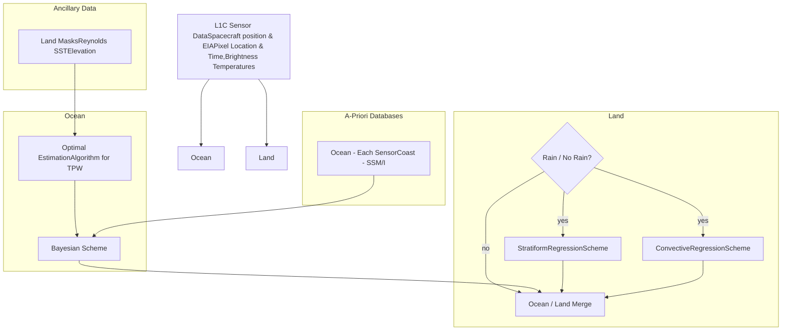

DECEMBER 2015 KUMMEROW ET AL. 2265

# The Evolution of the Goddard Profiling Algorithm to a Fully Parametric Scheme

CHRISTIAN D. KUMMEROW,\* DAVID L. RANDEL,\* MARK KULIE,<sup>+</sup> NAI-YU WANG,<sup>#</sup> RALPH FERRARO,<sup>@</sup> S. JOSEPH MUNCHAK,<sup>&</sup> AND VELJKO PETKOVIC\*

\* *Department of Atmospheric Science, Colorado State University, Fort Collins, Colorado*

<sup>+</sup> *University of Wisconsin–Madison, Madison, Wisconsin*

<sup>#</sup> *I.M. Systems Group, and NOAA/NESDIS, College Park, Maryland*

<sup>@</sup> *NOAA/NESDIS, College Park, Maryland*

<sup>&</sup> *Earth System Science Interdisciplinary Center, University of Maryland, College Park, College Park, Maryland*

(Manuscript received 10 February 2015, in final form 22 June 2015)

### ABSTRACT

The Goddard profiling algorithm has evolved from a pseudoparametric algorithm used in the current TRMM operational product (GPROF 2010) to a fully parametric approach used operationally in the GPM era (GPROF 2014). The fully parametric approach uses a Bayesian inversion for all surface types. The algorithm thus abandons rainfall screening procedures and instead uses the full brightness temperature vector to obtain the most likely precipitation state. This paper offers a complete description of the GPROF 2010 and GPROF 2014 algorithms and assesses the sensitivity of the algorithm to assumptions related to channel uncertainty as well as ancillary data. Uncertainties in precipitation are generally less than 1%–2% for realistic assumptions in channel uncertainties. Consistency among different radiometers is extremely good over oceans. Consistency over land is also good if the diurnal cycle is accounted for by sampling GMI product only at the time of day that different sensors operate. While accounting for only a modest amount of the total precipitation, snow-covered surfaces exhibit differences of up to 25% between sensors traceable to the availability of high-frequency (166 and 183 GHz) channels. In general, comparisons against early versions of GPM’s Ku-band radar precipitation estimates are fairly consistent but absolute differences will be more carefully evaluated once GPROF 2014 is upgraded to use the full GPM-combined radar–radiometer product for its a priori database. The combined algorithm represents a physically constructed database that is consistent with both the GPM radars and the GMI observations, and thus it is the ideal basis for a Bayesian approach that can be extended to an arbitrary passive microwave sensor.

## 1. Introduction

The Goddard profiling (GPROF) algorithm was first developed in the early 1990s to retrieve surface rainfall and its vertical structure from spaceborne passive microwave observations (Kummerow and Giglio 1994033%3C0003:AGPAFR%3E2.0.CO;2)). The impetus for that work came from the Tropical Rainfall Measuring Mission (TRMM) (Simpson et al. 1988069%3C0278:ATRMMS%3E2.0.CO;2)) that was seeking to quantify not only the surface rainfall but also the three-dimensional structure of latent heat release in the tropics. While the primary

structure information from TRMM was to come from its first-ever spaceborne rain radar, there was a great desire to expand the profiling work to the TRMM Microwave Imager (TMI) in order to gain both from its much wider swath and pave the way to utilizing available sensors such as the Special Sensor Microwave Imager (SSM/I) (Hollinger et al. 1990), which had been available since 1987. The algorithm was thus designed from its very inception to be *parametric* in the sense that the algorithm would work with any passive microwave sensor as long as the sensor characteristics and channel errors were properly specified. While it has taken a number of iterations, this paper describes GPROF 2014, the fully parametric algorithm, as well as the recent versions of the algorithm leading to it. The current impetus is provided by the Global Precipitation Measurement (GPM) (Hou et al. 2014), which explicitly seeks to provide

*Corresponding author address:* Christian D. Kummerow, Department of Atmospheric Science, Colorado State University, 200 West Lake Street, 1371 Campus Delivery, Fort Collins, CO 80523-1371.

E-mail: kummerow@atmos.colostate.edu

DOI: 10.1175/JTECH-D-15-0039.1

© 2015 American Meteorological Society

Unauthenticated | Downloaded 07/11/26 03:52 PM UTC


---


2266

JOURNAL OF ATMOSPHERIC AND OCEANIC TECHNOLOGY

VOLUME 32

consistent 3-hourly rainfall products from a constellation of operational and dedicated passive microwave radiometers.

The origins of the GPROF algorithm lie in the Bayesian formulation as outlined by Rodgers (2000) and first applied to clouds and precipitation by Evans et al. (1995). The approach is ideally suited for underconstrained inversions and was adapted to precipitation profiles as first described by Kummerow et al. (1996). Other schemes employing the Bayesian methodology, such as Olson et al. (1996), Marzano et al. (1999), Bauer et al. (2001), and Viltard et al. (2006), soon followed as the scheme allowed for the incorporation of additional information becoming available from radars and cloud-resolving models. The Bayesian formulation in these early schemes generally assumed that cloud-resolving model output could be used to accurately describe the global population of raining clouds that serve to constrain the final solution. Using Bayes’s formulation (e.g., Rodgers 2000), this can be formalized as

$$ P(\mathbf{x} \mid \mathbf{y}) = \frac{P(\mathbf{y} \mid \mathbf{x})P(\mathbf{x})}{P(\mathbf{y})}, \tag{1} $$

where $P(\mathbf{x} \mid \mathbf{y})$ is the *posteriori* probability of observing a particular rainfall structure **x**, when a set of brightness temperatures Tb, denoted by the vector **y** is observed. Term $P(\mathbf{y} \mid \mathbf{x})$ is the probability of making observation **y** when **x** is present, while $P(\mathbf{x})$ and $P(\mathbf{y})$ are the a priori probabilities of **x** and **y**, respectively. The latter may come from global statistics of precipitating cloud states and observations, respectively. The determination of $P(\mathbf{y} \mid \mathbf{x})$ requires a radiative transfer model that translates between state and observation space. This model may also be used to compute $P(\mathbf{y})$ if $P(\mathbf{x})$ is assumed to fully describe the a priori distribution of **x**. The a priori distribution of clouds, as mentioned before, was generally taken from cloud-resolving models as described by Tripoli (1992) and Tao and Simpson (1993).

One particular problem associated with these rainfall retrievals is that the model that connects states and observations—that is $\mathbf{y} = \mathbf{F}(\mathbf{x}) + \varepsilon$ (where $\varepsilon$ is the modeling error)—is generally nonlinear and generally exhibits non-Gaussian error statistics. This more or less precludes variational solutions. It is instead more common to seek the expected value of **x**. From practical considerations, the expected value is often expressed as (Olson et al. 1996)

$$ E(\mathbf{x}) = \frac{\sum_{i} \mathbf{x}_i \exp\{-0.5[\mathbf{y} - \mathbf{F}(\mathbf{x}_i)]^T \mathbf{R}^{-1} [\mathbf{y} - \mathbf{F}(\mathbf{x}_i)]\}}{\sum_{i} \exp\{-0.5[\mathbf{y} - \mathbf{F}(\mathbf{x}_i)]^T \mathbf{R}^{-1} [\mathbf{y} - \mathbf{F}(\mathbf{x}_i)]\}} \tag{2} $$

even though the formulation in Eq. (2) makes the assumption that $P(\mathbf{x})$ and $P(\mathbf{y})$ are well known. The Tb error covariance **R** must still be estimated from

measurement and forward model errors in this formulation.

The above-mentioned solution allows a single set of cloud profiles, which might come from a global cloud-resolving model simulation, along with the appropriate radiative transfer simulations to be used for constructing a priori databases for a number of different radiometers. The fully parametric implementation of this scheme, however, was difficult because of uncertainties and computational constraints on cloud-resolving models at the time that these schemes were being developed. Kummerow et al. (2006) explored the uncertainties in the Bayesian retrievals and concluded that the majority of the errors could be associated with incompleteness and incorrectness of the profiles making up the a priori cloud database. The incompleteness problem was primarily due to the inability to run global cloud-resolving models over any significant period of time. Simulations consisting of primarily individual case studies did not reflect the actual distribution of observed storms. More importantly, they did not reflect the correct ratios of raining and nonraining scenes that would bias retrievals toward raining conditions if other steps were not taken.

The solution to the rain versus nonrain problem employed by nearly all the early Bayesian schemes, including Kummerow et al. (2011), was to add a "screening" routine that first separated rain from nonraining scenes based upon simple brightness temperature thresholds or sometimes cloud liquid water thresholds. This limited the retrievals to raining scenes, and a priori databases were generated in such a way as to match the criteria used to define rain in the screening algorithm. These screening algorithms, however, were often empirical and thus not parametric. The empiricism was necessary because different sensors had different spatial resolutions, view angles, and channel combinations. Algorithms that used cloud water thresholds would fare better, but only if the cloud water retrieval was physically based.

Similar shortcomings were also considered in relation to convective versus stratiform clouds. If simulations consisted of too many convective clouds without enough stratiform rain, then the a priori statistics and thus the Bayesian retrieval would skew retrievals toward convection. This problem too was addressed by partitioning convective and stratiform scenes in both the observations and a priori databases. While details differed between methods, the basic need for these steps was the result of the same problem—namely, that it was difficult to get globally representative cloud profiles from a limited set of cloud-resolving model simulations.

The second error inherent in the approaches that used the cloud-resolving model simulations was the errors in

Unauthenticated | Downloaded 07/11/26 03:52 PM UTC


---


DECEMBER 2015 KUMMEROW ET AL. 2267

the models themselves. A number of studies (e.g., Wang et al. 2007; Caine et al. 2013; Roh and Satoh 2014) address the shortcoming in cloud microphysics that had a tendency toward too much ice in convective clouds. Such errors could not be easily corrected and simply became part of the algorithm and its overall uncertainty (Kummerow et al. 2006).

# 2. The semiparametric algorithm

The first attempt at making the algorithm more parametric was implemented with GPROF 2010 or TRMM 2A12, version 7, in the TRMM processing system. Over oceans this version abandoned the cloud-resolving model (CRM) database in favor of an observationally generated database that faithfully reproduced raining, nonraining, as well as convective and stratiform rain types over the oceans. The details are discussed in Kummerow et al. (2011)). They are reviewed here only for completeness. First-guess profiles are taken directly from the TRMM precipitation radar (PR) retrievals Iguchi et al. (2000)). If no precipitation is present, then an "optimal estimation" procedure is used with TMI brightness temperatures to retrieve the background water vapor, cloud water, and surface wind speed as described in Elsaesser and Kummerow (2008)). In addition, sea surface temperatures (SST) are from Reynolds et al. (2007, 2008)). Where precipitation is present in the PR footprint, the individual precipitation profile is matched to a library of available cloud-resolving model profiles. The primary role of the cloud models in this scheme is to associate parameters such as cloud water and ice to the precipitation profile as they impact the TMI brightness temperatures but are not directly observed by the radar. Forward radiative transfer computations are then performed and the resulting brightness temperatures are convolved to the appropriate TMI channels. Observed and simulated Tbs are compared. Differences are addressed by adjusting the PR precipitation profile—either by adding light precipitation below the radar's detection threshold or by adjusting the drop size distribution assumed by the radar. The resulting hydrometeor profile is thus based upon a cloud-resolving model but selected only if it fits both the observed reflectivity profile from the radar and brightness temperatures from the TMI radiometer. The database is thus fully representative of actual rainfall structures although errors in the retrieval or cloud-resolving model microphysics could still affect the overall correctness of the a priori database. One year of coincident radar/radiometer swaths, yielding approximately 65 million database entries, are used in GPROF 2010 to construct the a priori databases. This replaces the

limited cloud-resolving model simulations used in earlier versions of the algorithm and eliminates the need to predetermine if pixels are raining or assigning convective/stratiform properties. The retrieval is thus fully Bayesian.

The robust ocean database also allows the Bayesian retrieval to limit its search to profiles consistent with the observed background conditions. SST and total precipitable water (TPW) are used to subset the database. This is convenient because 1) both can be readily obtained from either ancillary sources or the radiometers themselves and 2) there was strong evidence that different large-scale environments, as defined by SST and TPW, led to significantly different cloud structures (Berg et al. 2006).

The operational a priori database is built by first aggregating all the entries in a given SST/TPW bin. Bin sizes of 1 K in SST and 1 mm in TPW are used. Certain combinations of SST and TPW (e.g., SST = 298 K and TPW = 45 mm) are very common in the tropics and sometimes exceeded 300 000 entries in a single bin. While such bins are conceptually manageable, they are computationally very expensive. Profiles with self-similar Tb were therefore clustered into a maximum of 1200 unique clusters. Commonly available K-means (Forgy 1965; Hartigan and Wong 1979) clustering routines were not used because they do not preserve rainfall variance within individual Tb intervals and can thus bias the sensitivity of retrieved rainfall rates to assumed uncertainties. Instead, a bottom-up hierarchical clustering approach was implemented (Elsaesser and Kummerow 2015). A comprehensive test was performed to show that retrievals using all profiles gave the same result as retrievals using 1200 unique clusters to within 0.2% in rainfall. When the inverse occurs—namely, that not enough entries are available near the edge of the table (e.g., SST = 298 K and TPW = 10 mm)—the algorithm automatically expands the search radius over SST and TPW beyond 1 K and 1 mm until it has a minimum of 1200 profiles available. The algorithm sensitivity to errors in the prescribed SST and TPW are explored (in Tables 3 and 4) in connection with the fully parametric algorithm.

The same Bayesian approach was not adopted for land backgrounds in GPROF 2010. The main difficulty over land was the lack of a physical retrieval from the TRMM PR and TMI. This was due to unknown surface emissivities and the lack of any discernable emission signal. Forced to work with only the scattering signal and having historical difficulties in separating land-related scattering signals from cold surfaces, the GPROF 2010 land code made substantial improvements over the previous version by improving the convective and stratiform rainfall delineation and the empirical

Unauthenticated | Downloaded 07/11/26 03:52 PM UTC


---


2268 JOURNAL OF ATMOSPHERIC AND OCEANIC TECHNOLOGY VOLUME 32



FIG. 1. Algorithm flow for GPROF 2010.

relationships between the surface rainfall rates and 85-GHz brightness temperatures for convective and stratiform rain. These changes significantly lower the overestimation by TMI globally and over large sections of central Africa and South America from GPROF 2004 (Liu and Zipser 2009; Wang et al. 2009). Details of the GPROF 2010 land algorithm are documented in Gopalan et al. (2010); only a brief review is given here for completeness. A scattering index (Grody 1991; Ferraro et al. 1994033<0355:AOSIFA>2.0.CO;2), 1998079<0813:AOSIFA>2.0.CO;2)) is used to determine whether the pixel is raining. Once the pixel is determined to be raining, a modification from McCollum and Ferraro’s (2003)042<0965:NCOAAS>2.0.CO;2) convective and stratiform percentages (CSP) within an 85-GHz pixel is developed to reduce the global TMI wet bias caused by the overly aggressive convective rain distribution. The next step is to develop the relationships between the surface rainfall rates (RR) for convective and stratiform rain and 85-GHz vertically polarized brightness temperatures (TB85V). Using the entire record of TRMM TMI and PR collocations, a more robust set of RR-TB85V is developed and is shown in Eqs. (3) and (4):

$$ \text{RR}_{\text{conv}} = -0.000\,011\,769\text{TB85V}^3 + 0.008\,026\,7\text{TB85V}^2 $$
$$ + -1.9461\text{TB85V} + 182.677 $$

(3)

$$ \text{RR}_{\text{strat}} = -0.0708\text{TB85V} + 19.7034, $$ (4)

where $\text{RR}_{\text{conv}}$ is the rainfall for convective pixels, $\text{RR}_{\text{strat}}$ is the rainfall from stratiform pixels, and TB85V is the 85-GHz vertically polarized channel brightness

temperature. Finally, the rainfall rate is expressed as the combined convective and stratiform rain, $\text{RR} = \text{RR}_{\text{conv}}(\text{CSP}) + \text{RR}_{\text{strat}}(1 - \text{CSP})$.

The algorithm was thus a hybrid scheme with a Bayesian formulation over oceans coupled with a regression-based approach over land and coastal regions. The general algorithm flow is depicted in Fig. 1.

The only aspect of GPROF 2010 not covered above is the extension of the a priori databases over oceans to colder backgrounds than those observed directly by TRMM. While the code was designed to work in the tropics, the algorithm could be extended to higher latitudes by removing the bottom layers of existing profiles to represent colder and drier environments. This of course assumes that cloud structures in the extratropics resemble tropical clouds from the appropriate temperature level upward. While this is certainly not true, the method provided a solution at higher latitudes until the GPM’s combined algorithm profiles could fill in the rest of the globe. Zonal means for 2005 are shown in Fig. 2 separately for ocean and land for TMI, the Advanced Microwave Scanning Radiometer for EOS (AMSR-E), and three Special Sensor Microwave Imager (SSM/I) instruments aboard the *F13*, *F14*, and *F15* satellites. The oceanic precipitation, which is more or less parametric, is seen to be quite consistent between sensors. The precipitation differences in the land algorithm are due to two main issues. The first is due to differences in the precipitation screening schemes, whereby temperature thresholds originally derived for SSM/I were adapted to the remaining sensors. These thresholds are different for each of the sensors and very difficult to make completely

Unauthenticated | Downloaded 07/11/26 03:52 PM UTC


---


DECEMBER 2015

KUMMEROW ET AL.

2269

## Surface Precipitation - Ocean
### F13, F14, F15, TMI, AMSR-E
### GPROF2010 V2 2005

<table>
  <thead>
    <tr>
        <th>Latitude</th>
        <th>F13</th>
        <th>F14</th>
        <th>F15</th>
        <th>AMSR-E</th>
        <th>TMI</th>
    </tr>
  </thead>
  <tbody>
    <tr>
        <td>80</td>
<td>0.0</td>
<td>0.0</td>
<td>0.0</td>
<td>0.0</td>
<td> </td>
    </tr>
<tr>
        <td>70</td>
<td>0.5</td>
<td>0.5</td>
<td>0.5</td>
<td>0.5</td>
<td> </td>
    </tr>
<tr>
        <td>60</td>
<td>1.8</td>
<td>1.8</td>
<td>1.8</td>
<td>1.8</td>
<td> </td>
    </tr>
<tr>
        <td>50</td>
<td>2.5</td>
<td>2.5</td>
<td>2.5</td>
<td>2.5</td>
<td> </td>
    </tr>
<tr>
        <td>40</td>
<td>2.2</td>
<td>2.2</td>
<td>2.2</td>
<td>2.2</td>
<td>2.2</td>
    </tr>
<tr>
        <td>30</td>
<td>1.8</td>
<td>1.8</td>
<td>1.8</td>
<td>1.8</td>
<td>1.8</td>
    </tr>
<tr>
        <td>20</td>
<td>2.2</td>
<td>2.2</td>
<td>2.2</td>
<td>2.2</td>
<td>2.2</td>
    </tr>
<tr>
        <td>10</td>
<td>3.5</td>
<td>3.5</td>
<td>3.5</td>
<td>3.5</td>
<td>3.5</td>
    </tr>
<tr>
        <td>0</td>
<td>2.5</td>
<td>2.5</td>
<td>2.5</td>
<td>2.5</td>
<td>2.5</td>
    </tr>
<tr>
        <td>-10</td>
<td>3.5</td>
<td>3.5</td>
<td>3.5</td>
<td>3.5</td>
<td>3.5</td>
    </tr>
<tr>
        <td>-20</td>
<td>2.0</td>
<td>2.0</td>
<td>2.0</td>
<td>2.0</td>
<td>2.0</td>
    </tr>
<tr>
        <td>-30</td>
<td>2.2</td>
<td>2.2</td>
<td>2.2</td>
<td>2.2</td>
<td>2.2</td>
    </tr>
<tr>
        <td>-40</td>
<td>2.8</td>
<td>2.8</td>
<td>2.8</td>
<td>2.8</td>
<td>2.8</td>
    </tr>
<tr>
        <td>-50</td>
<td>3.2</td>
<td>3.2</td>
<td>3.2</td>
<td>3.2</td>
<td> </td>
    </tr>
<tr>
        <td>-60</td>
<td>1.8</td>
<td>1.8</td>
<td>1.8</td>
<td>1.8</td>
<td> </td>
    </tr>
<tr>
        <td>-70</td>
<td>0.0</td>
<td>0.0</td>
<td>0.0</td>
<td>0.0</td>
<td> </td>
    </tr>
<tr>
        <td>-80</td>
<td>0.0</td>
<td>0.0</td>
<td>0.0</td>
<td>0.0</td>
<td> </td>
    </tr>
  </tbody>
</table>

## Surface Precipitation - Land
### F13, F14, F15, TMI, AMSR-E
### GPROF2010 V2 2005

<table>
  <thead>
    <tr>
        <th>Latitude</th>
        <th>F13</th>
        <th>F14</th>
        <th>F15</th>
        <th>AMSR-E</th>
        <th>TMI</th>
    </tr>
  </thead>
  <tbody>
    <tr>
        <td>80</td>
<td>0.0</td>
<td>0.0</td>
<td>0.0</td>
<td>0.0</td>
<td> </td>
    </tr>
<tr>
        <td>70</td>
<td>0.5</td>
<td>0.5</td>
<td>0.5</td>
<td>0.5</td>
<td> </td>
    </tr>
<tr>
        <td>60</td>
<td>1.5</td>
<td>1.5</td>
<td>1.5</td>
<td>1.5</td>
<td> </td>
    </tr>
<tr>
        <td>50</td>
<td>2.2</td>
<td>2.2</td>
<td>2.2</td>
<td>2.2</td>
<td> </td>
    </tr>
<tr>
        <td>40</td>
<td>2.5</td>
<td>2.5</td>
<td>2.5</td>
<td>2.5</td>
<td>2.5</td>
    </tr>
<tr>
        <td>30</td>
<td>2.0</td>
<td>2.0</td>
<td>2.0</td>
<td>2.0</td>
<td>2.0</td>
    </tr>
<tr>
        <td>20</td>
<td>2.2</td>
<td>2.2</td>
<td>2.2</td>
<td>2.2</td>
<td>2.2</td>
    </tr>
<tr>
        <td>10</td>
<td>4.5</td>
<td>4.5</td>
<td>4.5</td>
<td>4.5</td>
<td>4.5</td>
    </tr>
<tr>
        <td>0</td>
<td>6.5</td>
<td>6.5</td>
<td>6.5</td>
<td>6.5</td>
<td>6.5</td>
    </tr>
<tr>
        <td>-10</td>
<td>4.0</td>
<td>4.0</td>
<td>4.0</td>
<td>4.0</td>
<td>4.0</td>
    </tr>
<tr>
        <td>-20</td>
<td>2.5</td>
<td>2.5</td>
<td>2.5</td>
<td>2.5</td>
<td>2.5</td>
    </tr>
<tr>
        <td>-30</td>
<td>1.8</td>
<td>1.8</td>
<td>1.8</td>
<td>1.8</td>
<td>1.8</td>
    </tr>
<tr>
        <td>-40</td>
<td>1.5</td>
<td>1.5</td>
<td>1.5</td>
<td>1.5</td>
<td>1.5</td>
    </tr>
<tr>
        <td>-50</td>
<td>0.5</td>
<td>0.5</td>
<td>0.5</td>
<td>0.5</td>
<td> </td>
    </tr>
<tr>
        <td>-60</td>
<td>0.0</td>
<td>0.0</td>
<td>0.0</td>
<td>0.0</td>
<td> </td>
    </tr>
<tr>
        <td>-70</td>
<td>0.0</td>
<td>0.0</td>
<td>0.0</td>
<td>0.0</td>
<td> </td>
    </tr>
<tr>
        <td>-80</td>
<td>0.0</td>
<td>0.0</td>
<td>0.0</td>
<td>0.0</td>
<td> </td>
    </tr>
  </tbody>
</table>

FIG. 2. Zonal mean precipitation corresponding to GPROF 2010 for 2005 for (left) ocean and (right) land.

consistent. Second, different sensor sampling times that observe the diurnal cycle of precipitation only twice per day do not result in the identical precipitation no matter the time scale one averages. This is shown in the next section on the fully parametric algorithm, when the similar sensor land differences are discussed further.

Given the consistency between the satellites' estimates over ocean shown in Fig. 2, trends can also be examined by applying the algorithm to all SSM/I radiometers going back to SSM/I *F8* launched in July of 1987. Figure 3 shows oceanic mean precipitation between 70°S and 70°N from successive SSM/I and Special Sensor Microwave Imager/Sounder (SSMIS) sensors. While these sensors are different, GPROF 2010 does not make use of the sounding channels over ocean. The products from these two sensors are therefore quite similar. Only ocean trends are shown to avoid sensor differences that can be seen in Fig. 2 over land. As can be seen, different sensors are very consistent across the overlap periods, giving confidence that any trends are physical or physically based rather than sensor artifacts. A larger difference can be seen with the initial record of SSMIS *F16*, which is slightly more than 3% lower than the SSM/I *F13* and *F14* records for 2006–09. We believe this to be related to calibration uncertainties in the early *F16* record, which was difficult to make fully consistent with the other sensors.

Profile information is reported by GPROF 2010 only over ocean, where profile information from the profile

database is carried along with surface precipitation. Because the land algorithm is empirical, no profile information is available. Rather than reporting rain, cloud water, snow, graupel, and cloud ice separately, the profile information is reported as a scale factor for 1 of 100 characteristic profile shapes for each hydrometeor species. This reduces the output volume significantly and emphasizes the fact that although the a priori database may contain the same number of independent layers as the PR used to construct it, the passive microwave retrieval does not have the same level of information in its vertical profiles.

## 3. The fully parametric algorithm

The oceanic portion of the GPROF 2010 algorithm was largely parametric. In practice, the only sensor-specific portions of the algorithm were the water vapor determination and the forward model uncertainties assigned to individual sensors in the retrieval. While the water vapor was retrieved from an optimal estimation procedure (Elsaesser and Kummerow 2008) and is thus fully parametric as implemented, the retrieval does not converge in areas of moderate to heavy precipitation. For these pixels, the TPW value was interpolated from the final threshold, where the optimal estimation algorithm was deemed to have converged. Different sensors, because of channel combinations and spatial resolution, converged differently, leaving different areas to be

Unauthenticated | Downloaded 07/11/26 03:52 PM UTC


---


2270 JOURNAL OF ATMOSPHERIC AND OCEANIC TECHNOLOGY VOLUME 32

<table>
  <thead>
    <tr>
        <th>Year</th>
        <th>SSM/I F08 (RR=2.73)</th>
        <th>SSM/I F10 (RR=2.75)</th>
        <th>SSM/I F11 (RR=2.78)</th>
        <th>SSM/I F13 (RR=2.80)</th>
        <th>SSM/I F14 (RR=2.80)</th>
        <th>SSM/I F15 (RR=2.76)</th>
        <th>SSMIS F16 (RR=2.75)</th>
        <th>SSMIS F17 (RR=2.76)</th>
        <th colspan="2">SSMIS F18 (RR=2.79)</th>
    </tr>
  </thead>
  <tbody>
    <tr>
        <td>1988</td>
<td>2.73</td>
<td> </td>
<td> </td>
<td> </td>
<td> </td>
<td> </td>
<td> </td>
<td> </td>
<td> </td>
<td> </td>
    </tr>
<tr>
        <td>1990</td>
<td> </td>
<td>2.75</td>
<td> </td>
<td> </td>
<td> </td>
<td> </td>
<td> </td>
<td> </td>
<td> </td>
<td> </td>
    </tr>
<tr>
        <td>1992</td>
<td> </td>
<td> </td>
<td>2.78</td>
<td> </td>
<td> </td>
<td> </td>
<td> </td>
<td> </td>
<td> </td>
<td> </td>
    </tr>
<tr>
        <td>1994</td>
<td> </td>
<td> </td>
<td> </td>
<td>2.80</td>
<td> </td>
<td> </td>
<td> </td>
<td> </td>
<td> </td>
<td> </td>
    </tr>
<tr>
        <td>1996</td>
<td> </td>
<td> </td>
<td> </td>
<td> </td>
<td>2.80</td>
<td> </td>
<td> </td>
<td> </td>
<td> </td>
<td> </td>
    </tr>
<tr>
        <td>1998</td>
<td> </td>
<td> </td>
<td> </td>
<td> </td>
<td> </td>
<td>2.76</td>
<td> </td>
<td> </td>
<td> </td>
<td> </td>
    </tr>
<tr>
        <td>2000</td>
<td> </td>
<td> </td>
<td> </td>
<td> </td>
<td> </td>
<td> </td>
<td>2.75</td>
<td> </td>
<td> </td>
<td> </td>
    </tr>
<tr>
        <td>2002</td>
<td> </td>
<td> </td>
<td> </td>
<td> </td>
<td> </td>
<td> </td>
<td> </td>
<td>2.76</td>
<td> </td>
<td> </td>
    </tr>
<tr>
        <td>2004</td>
<td> </td>
<td> </td>
<td> </td>
<td> </td>
<td> </td>
<td> </td>
<td> </td>
<td> </td>
<td>2.79</td>
<td> </td>
    </tr>
<tr>
        <td>2006</td>
<td> </td>
<td> </td>
<td> </td>
<td> </td>
<td> </td>
<td> </td>
<td> </td>
<td> </td>
<td> </td>
<td> </td>
    </tr>
<tr>
        <td>2008</td>
<td> </td>
<td> </td>
<td> </td>
<td> </td>
<td> </td>
<td> </td>
<td> </td>
<td> </td>
<td> </td>
<td> </td>
    </tr>
<tr>
        <td>2010</td>
<td> </td>
<td> </td>
<td> </td>
<td> </td>
<td> </td>
<td> </td>
<td> </td>
<td> </td>
<td> </td>
<td> </td>
    </tr>
<tr>
        <td>2012</td>
<td> </td>
<td> </td>
<td> </td>
<td> </td>
<td> </td>
<td> </td>
<td> </td>
<td> </td>
<td> </td>
<td> </td>
    </tr>
<tr>
        <td>2014</td>
<td> </td>
<td> </td>
<td> </td>
<td> </td>
<td> </td>
<td> </td>
<td> </td>
<td> </td>
<td> </td>
<td> </td>
    </tr>
  </tbody>
</table>

FIG. 3. Trends in oceanic precipitation from SSM/I and SSMIS sensors.

interpolated. This coupled with the tendency for higher TPW values in precipitating regions caused biases in TPW and the subsequent rainfall retrieval. This problem is circumvented in GPROF 2014 by using TPW from reanalyses the Japanese Global Analysis (GANAL) ([JMA 2000) for near-real-time operations, and GPM standard products and the European Centre for Medium-Range Weather Forecasts (ECMWF) interim reanalysis (ERA-Interim) (Dee et al. 2011) for all other products]. The second aspect of the algorithm that was not fully parametric was the channel uncertainties assigned to sensors. For TMI, these uncertainties were determined by examining the residual differences between computed and observed Tb in the construction of the database itself. This, however, is not appropriate for other sensors. A set of coincident overpass datasets was used to adjust forward model uncertainties for radiometers other than TMI.

Over oceans, GPROF 2014 uses the same GPROF 2010 database and subsetting into unique SST and TPW bins. Because the GPROF 2010 database is physically constructed to be consistent with both TRMM PR and TMI, it is straightforward to compute Tb for additional GPM Microwave Imager (GMI) channels, incidence angles, and horizontal resolutions. The algorithm does not make use of the higher-frequency channels of GMI (165 and 183 GHz) over ocean, as there is little confidence that these are properly constrained by the TRMM database. Given that the algorithm over ocean is primarily emission based, this is not viewed as a major shortcoming. Once enough radar data are available from the GPM dual-frequency precipitation radar

(DPR), a new oceanic database will be constructed that does include the higher-frequency channels.

Over land, the GPROF 2014 database uses the National Mosaic and Multi-Sensor Quantitative Precipitation Estimation (NMQ) project (Zhang et al. 2011) radar data with coincident overpasses from each GPM constellation member to create observational databases of surface rainfall and associated Tb. The GMI brightness temperatures, which were not available before the launch of GPM, were simulated with the SSMIS sensor for this version of the algorithm. The databases are constructed for bins of equal land surface temperature (LST), TPW, and surface type. The bin sizes for LST and TPW follow the GPROF 2010 approach of using 1 K in LST and 1 mm in TPW. Surface types are defined for the GPROF 2014 algorithm as having self-similar emissivities originally classified by Aires et al. (2011). Using self-similar surface emissivity classes is defined as "S1" retrieval within the GPROF framework to distinguish from "S0," which assumes no knowledge of the surface emissivity and "S2"-type retrievals, which assume that the surface is well characterized by ancillary data. At the time of GPM's launch, only the S1-type retrieval was operational. Figure 4 shows a map of the 14 surface emissivity classes used in GPROF 2014 for 15 February 2014. Daily snow maps from NOAA's AutoSnow product (Romanov et al. 2000) are used to update the climatological surface classes defined by Aires et al. LST and TPW, as with the ocean case, are taken from the GANAL product for the standard products, and from ERA-Interim for the final quality-controlled climatology products.

Unauthenticated | Downloaded 07/11/26 03:52 PM UTC


---


DECEMBER 2015

K U M M E R O W E T A L .

2271

Surface classes defined by GPROF 2014 for a single day map

FIG. 4. Surface classes defined by GPROF 2014 for a single day.

High latitudes occasionally experience colder temperatures than are seen by the NMQ network. Databases for large sections of Siberia as well as sea ice and sea ice edges cannot be populated using NMQ data. These regions were populated using a combination of satellite and model data. *CloudSat* data was collocated with AMSR-E and Microwave Humidity Sounder (MHS) data for precipitation and coincident brightness temperatures. To make the parametric algorithm, this set of precipitation and Tb variables was matched to a global cloud-resolving model similar to the procedure employed over oceans. Given the same LST, TPW, and

surface type, the model space was searched for the closest match in surface precipitation and all available brightness temperatures. The individual model profile from a 1-yr simulation using the multiscale modeling framework (MMF) (Tao et al. 2009) that best matched each observation was used as a base for the a priori database. Brightness temperatures were computed from this base profile for each of the constellation satellites to ensure consistency among sensors. This solution, of course, is only temporary. Once GPM’s combined algorithm profiles are available for one or more years, the entire profile database will be replaced with a physical

```mermaid
graph TD
    subgraph Model_Preparation [Model Preparation]
        MP[JMA forecast - NRTGANAL - StandardECMWF - Climatology]
    end

    subgraph L1C_Sensor_Data [L1C Sensor Data]
        L1C[Spacecraft positionPixel Location, TbsPixel Time, EIAChan Freqs & Errors]
    end

    subgraph Ancillary_Info [Ancillary Info / Datasets]
        AI[Surface & Emissivity ClassesECMWF / GANAL Model FieldsAutosnow Snow CoverReynolds Sea-Ice]
    end

    L1C --> PP[PreProcessor(sensor specific)]
    AI --> PP
    MP --> AI
    PP --> SIF[Standard input file]

    subgraph Sensor_Profile_Database [Sensor Profile Database]
        SPD[A-Priori Matched Profiles- TMI/ PR- AMSR-E / Cloudsat/ MHS- TMI/SSMIS/AMSRE & NMQ]
    end

    SIF --> GPA[GPM PrecipitationAlgorithm]
    SPD --> GPA

    GPA --> S0[S0 output]
    GPA --> S1[S1 output]

    S0 --> GM[GPM_MERGES0, S1]
    S1 --> GM

    GM --> PostP[Post-processor(Binary to HDF5)]
    PostP --> COF[Complete HDF5Output file]
```

FIG. 5. The complete GMI fully parametric algorithm flow (GPROF 2014).

Unauthenticated | Downloaded 07/11/26 03:52 PM UTC


---


2272 JOURNAL OF ATMOSPHERIC AND OCEANIC TECHNOLOGY VOLUME 32

TABLE 1. Channel noise and forward model errors utilized in GPROF 2014 for ocean, vegetated surfaces, and snow-covered surfaces.

<table>
  <thead><tr><th>Frequency</th><th>10.7V 10.7H</th><th>All values are in kelvins. 19V</th><th>19H</th><th>21.3V</th><th>37V</th><th>37H</th><th>85V</th><th>85H</th><th></th></tr></thead>
  <tbody>
    <tr>
      <td></td>
<td>0.63</td>
<td>0.54</td>
<td>0.50</td>
<td>0.47</td>
<td>0.71</td>
<td>0.36</td>
<td>0.31</td>
<td>0.52</td>
<td>0.93</td>
    </tr>
<tr>
      <td></td>
<td>1.2</td>
<td>1.5</td>
<td>1.7</td>
<td>3.0</td>
<td>1.7</td>
<td>2.7</td>
<td>5.1</td>
<td>3.6</td>
<td>5.5</td>
    </tr>
<tr>
      <td>Vegetated</td>
<td>12.0</td>
<td>7.6</td>
<td>12.0</td>
<td>7.6</td>
<td>20.0</td>
<td>2.3</td>
<td>11.4</td>
<td>1.9</td>
<td>5.5</td>
    </tr>
<tr>
      <td>Snow</td>
<td>30.1</td>
<td>42.3</td>
<td>20.1</td>
<td>42.3</td>
<td>14.2</td>
<td>18.8</td>
<td>25.9</td>
<td>5.9</td>
<td>15.9</td>
    </tr>
<tr>
      <td>Ocean</td>
<td>1.36</td>
<td>1.59</td>
<td>1.77</td>
<td>3.04</td>
<td>1.84</td>
<td>2.72</td>
<td>5.11</td>
<td>3.63</td>
<td>5.58</td>
    </tr>
<tr>
      <td>Vegetated</td>
<td>12.0</td>
<td>7.6</td>
<td>12.0</td>
<td>7.6</td>
<td>20.0</td>
<td>2.32</td>
<td>11.4</td>
<td>1.97</td>
<td>5.58</td>
    </tr>
<tr>
      <td>Snow</td>
<td>30.1</td>
<td>42.3</td>
<td>20.1</td>
<td>42.3</td>
<td>14.2</td>
<td>18.8</td>
<td>25.9</td>
<td>5.92</td>
<td>15.9</td>
    </tr>
  </tbody>
</table>

retrieval coming from that product. This will be known as GPROF 2016 version 1. Because the product is physically based, Tbs for the remaining constellation sensors can simply be computed from the available cloud hydrometeor profiles and background conditions. Version 1 of the algorithm does not compute profile information due to the mixture of a priori information used and the inconsistency among those. GPROF 2016 will provide vertical profile information over all surfaces in the same way as GPROF 2010 provides profile information over oceans. The operational algorithm flow for processing the GMI observations, which is the fully parametric GPROF 2014 algorithm, is shown in Fig. 5.

## a. Sensitivity tests

While the GPROF 2014 algorithm is considered fully parametric in the sense that the scheme is consistent among all radiometers, there are settings in the algorithm that do influence the outcome. Specifically, the sensor and forward model uncertainties and the uncertainties in the ancillary SST and TPW used to search the databases are not fully known. Because of this uncertainty, the impact of each of these assumptions is examined separately.

### CHANNEL UNCERTAINTIES

The sensor noise, or noise-equivalent change in temperature (NE$\Delta$T), is generally measured for individual radiometers during fabrication. These uncertainties are on the order of 0.5–1.0 K per channel and are documented for all microwave sensors in orbit today. The forward model uncertainty is generally much larger and

generally not as well known. Over oceans, GPROF 2010 and 2014 use the residual errors seen in TMI during the database construction (Kummerow et al. 2011) as an estimate for the forward model error. These uncertainties are on the order of 2–3 K at 10 GHz to 15 K at 85 GHz. Over land, the theory is even less well established and not applicable to the current version of GPROF since the database entries are constructed from observed rather than simulated Tb. To establish a best estimate for the uncertainty, GPROF 2014 used 10 days of retrievals over the continental United States (CONUS) and iteratively adjusted the channel uncertainty to maximize the fraction of retrievals that were within 50% of the NMQ value. For consistency, this is also referred to as the "forward model" uncertainty below. While this does not correspond strictly to the definition of forward model error, its values are equivalent. Table 1 summarizes the NE$\Delta$T and the forward model errors used in the operational algorithm for the TMI instrument as an example. Other sensors have similar values.

There are additional uncertainties introduced as a result of the finite number of entries in the a priori database. These uncertainties have been estimated to be in the 1.5–2.5-K range. This uncertainty becomes the dominant term if databases are constructed with observed rather than computed Tb, in which case the forward model error disappears. It is not included in the GPROF 2014 database because the method of implementing the forward model error was thought to already contain this uncertainty.

Sensitivity tests were then run to test the impact of the total channel uncertainty on estimated precipitation.

TABLE 2. Biases (%) relative to the reference in retrieved precipitation accumulations for January 2007 as a result of uncertainties in the forward model error. Values are percent change in the rain rate from the reference channel errors.

<table>
  <thead>
    <tr>
        <th colspan="6">Change in total uncertainty</th>
    </tr>
<tr>
        <th> </th>
        <th>-40%</th>
        <th>-20%</th>
        <th>Reference</th>
        <th>+20%</th>
        <th>+40%</th>
    </tr>
  </thead>
  <tbody>
    <tr>
        <td>Ocean</td>
<td>3.37</td>
<td>1.42</td>
<td>0.00</td>
<td>-1.43</td>
<td>-2.12</td>
    </tr>
<tr>
        <td>Vegetated land</td>
<td>1.72</td>
<td>0.98</td>
<td>0.00</td>
<td>-1.16</td>
<td>-2.47</td>
    </tr>
<tr>
        <td>Snow covered</td>
<td>8.75</td>
<td>3.18</td>
<td>0.00</td>
<td>-2.53</td>
<td>-4.20</td>
    </tr>
  </tbody>
</table>

Unauthenticated | Downloaded 07/11/26 03:52 PM UTC


---


DECEMBER 2015 KUMMEROW ET AL. 2273

TABLE 3. Random error in retrieved rain accumulations for January 2007. Values are percent change in the rain rate.

<table>
  <thead>
    <tr>
        <th> </th>
        <th>±1 K surface temp</th>
        <th>±1 mm TPW</th>
    </tr>
  </thead>
  <tbody>
    <tr>
        <td>Ocean only</td>
<td>-0.92</td>
<td>+0.06</td>
    </tr>
<tr>
        <td>All surfaces</td>
<td>-0.16</td>
<td>+0.44</td>
    </tr>
  </tbody>
</table>

The total uncertainty was both increased and decreasing by 20% and 40% for these tests. Table 2 presents biases from a 1-month comparison relative to the reference value from uncertainties presented in Table 1. The retrievals over snow appear to be most sensitive to incorrect estimates of the forward model error. This may be related to the already very large uncertainties estimated for snow-covered surfaces.

The second source of uncertainty is due to unknown errors in the a priori determination of TPW and the surface temperature used to select the appropriate subset of the a priori database. To explore the algorithm's sensitivity to this potential source of error, the sensitivity of GPROF 2014 was tested for both random and systematic errors in the a priori information. Results are presented for all surfaces and for an ocean surface only. Table 3 corresponds to random errors in surface temperature and TPW. In these experiments, each pixel is randomly assigned an offset of 1 mm of TPW or 1 K of surface temperature offset from the reference value for a 10-day period corresponding to approximately 100 million pixels. The results indicate very little sensitivity to changes in TPW. Changes in SST are also modest but somewhat larger. This may be attributed to a nonlinear rain distribution as a function of SST. Lower SST bins rain significantly less than warmer SST bins, so that a random error in SST does not translate into a random distribution of rain. A bias in either surface temperature or TPW has a much more dramatic impact on the retrieved precipitation as represented in Table 4.

For the case of biases, particularly in the TPW, the impact can be seen to be rather substantial. Two different phenomena are responsible for these biases. The first is the emission signature of the water vapor itself. When water vapor is assumed less than the actual vapor (-1-mm TPW), more rainwater is needed to produce the same amount of atmospheric emission. This effect tends to be relatively small as most of the emission is concentrated in the 22-GHz channel. The larger effect

becomes changes in the precipitation profiles as water vapor is increased. Whereas drier environments tend to show precipitation rates decreasing below cloud base as a result of evaporation, the moister environments show greater constant rainwater content with height and thus a greater surface rain rate for the same column liquid water to which the passive microwave signal is sensitive. This is equally evident in the SST biases. If SST is artificially increased without a commensurate water vapor increase, then the retrieval is forced into a drier atmospheric regime (i.e., lower relative humidity) and rain rates are seen to decrease. In practice, these biases would probably represent a worst-case scenario since SST and TPW from reanalyses would increase or decrease together. The effect would therefore be less pronounced if the database and retrieval use the same ancillary data.

## b. Algorithm performance

The algorithm is tested using GMI's intercalibrated (level 1C) data for all currently available microwave imagers. Figure 6 shows oceanic zonal mean rainfall accumulations averaged over a 3-month period (April, May, and June 2014) for GMI, TMI, SSMIS *F16*, *F17*, *F18*, and Advanced Microwave Scanning Radiometer 2 (AMSR2). Superimposed is the early version of the radar retrieval from GPM's Ku-band radar. While there are small variations among the different sensors, the results are consistent with a well-functioning parametric algorithm in that all the sensors show extremely similar behavior. There are differences in the diurnal sampling of the different satellites but the oceanic precipitation is fairly sinusoidal across a 24-h period so that differences are drastically reduced when ascending and descending orbits are averaged as is the case in Fig. 6. The comparison to Ku-band radar is included only to demonstrate the algorithm's consistency with GPM's early Ku-band radar product. This is not unexpected since the TRMM Ku-band radar product was used to create the a priori cloud structures for the GPROF 2014 database over oceans. There is a small but noticeable difference at very high latitudes where the Ku-band radar may not have enough sensitivity to pick up the very light precipitation (primarily snow) that can be found here. The database, it should be recalled, for these regions is based upon CloudSat precipitation rates constrained by

TABLE 4. Systematic errors in retrieved rain accumulations for January 2007. Values are percent change in the rain rate.

<table>
  <thead>
    <tr>
        <th> </th>
        <th>-1 K surface temp</th>
        <th>+1° surface temp</th>
        <th>-1 mm TPW</th>
        <th>+1 mm TPW</th>
    </tr>
  </thead>
  <tbody>
    <tr>
        <td>Ocean</td>
<td>-1.73</td>
<td>+0.16</td>
<td>+5.24</td>
<td>-5.36</td>
    </tr>
<tr>
        <td>All surfaces</td>
<td>-2.23</td>
<td>1.81</td>
<td>2.28</td>
<td>-1.43</td>
    </tr>
  </tbody>
</table>

Unauthenticated | Downloaded 07/11/26 03:52 PM UTC


---


2274 JOURNAL OF ATMOSPHERIC AND OCEANIC TECHNOLOGY VOLUME 32

Surface Accumulated Precipitation Ocean
April, May, June 2014 65S : 65N

<table>
  <thead>
    <tr>
        <th>Latitude</th>
        <th>GMI</th>
        <th>F16</th>
        <th>F17</th>
        <th>F18</th>
        <th>AMSR2</th>
        <th>DPR Ku</th>
    </tr>
  </thead>
  <tbody>
    <tr>
        <td>70</td>
<td>10</td>
<td>15</td>
<td>10</td>
<td>10</td>
<td>10</td>
<td>10</td>
    </tr>
<tr>
        <td>65</td>
<td>20</td>
<td>25</td>
<td>20</td>
<td>20</td>
<td>20</td>
<td>20</td>
    </tr>
<tr>
        <td>60</td>
<td>35</td>
<td>40</td>
<td>35</td>
<td>35</td>
<td>35</td>
<td>35</td>
    </tr>
<tr>
        <td>55</td>
<td>50</td>
<td>55</td>
<td>50</td>
<td>50</td>
<td>50</td>
<td>50</td>
    </tr>
<tr>
        <td>50</td>
<td>70</td>
<td>75</td>
<td>70</td>
<td>70</td>
<td>70</td>
<td>70</td>
    </tr>
<tr>
        <td>45</td>
<td>85</td>
<td>90</td>
<td>85</td>
<td>85</td>
<td>85</td>
<td>85</td>
    </tr>
<tr>
        <td>40</td>
<td>100</td>
<td>105</td>
<td>100</td>
<td>100</td>
<td>100</td>
<td>100</td>
    </tr>
<tr>
        <td>35</td>
<td>95</td>
<td>100</td>
<td>95</td>
<td>95</td>
<td>95</td>
<td>95</td>
    </tr>
<tr>
        <td>30</td>
<td>85</td>
<td>90</td>
<td>85</td>
<td>85</td>
<td>85</td>
<td>85</td>
    </tr>
<tr>
        <td>25</td>
<td>75</td>
<td>80</td>
<td>75</td>
<td>75</td>
<td>75</td>
<td>75</td>
    </tr>
<tr>
        <td>20</td>
<td>70</td>
<td>75</td>
<td>70</td>
<td>70</td>
<td>70</td>
<td>70</td>
    </tr>
<tr>
        <td>15</td>
<td>75</td>
<td>80</td>
<td>75</td>
<td>75</td>
<td>75</td>
<td>75</td>
    </tr>
<tr>
        <td>10</td>
<td>100</td>
<td>105</td>
<td>100</td>
<td>100</td>
<td>100</td>
<td>100</td>
    </tr>
<tr>
        <td>5</td>
<td>280</td>
<td>290</td>
<td>280</td>
<td>280</td>
<td>280</td>
<td>280</td>
    </tr>
<tr>
        <td>0</td>
<td>150</td>
<td>160</td>
<td>150</td>
<td>150</td>
<td>150</td>
<td>150</td>
    </tr>
<tr>
        <td>-5</td>
<td>110</td>
<td>120</td>
<td>110</td>
<td>110</td>
<td>110</td>
<td>110</td>
    </tr>
<tr>
        <td>-10</td>
<td>90</td>
<td>100</td>
<td>90</td>
<td>90</td>
<td>90</td>
<td>90</td>
    </tr>
<tr>
        <td>-15</td>
<td>80</td>
<td>90</td>
<td>80</td>
<td>80</td>
<td>80</td>
<td>80</td>
    </tr>
<tr>
        <td>-20</td>
<td>75</td>
<td>85</td>
<td>75</td>
<td>75</td>
<td>75</td>
<td>75</td>
    </tr>
<tr>
        <td>-25</td>
<td>80</td>
<td>90</td>
<td>80</td>
<td>80</td>
<td>80</td>
<td>80</td>
    </tr>
<tr>
        <td>-30</td>
<td>90</td>
<td>100</td>
<td>90</td>
<td>90</td>
<td>90</td>
<td>90</td>
    </tr>
<tr>
        <td>-35</td>
<td>110</td>
<td>120</td>
<td>110</td>
<td>110</td>
<td>110</td>
<td>110</td>
    </tr>
<tr>
        <td>-40</td>
<td>120</td>
<td>130</td>
<td>120</td>
<td>120</td>
<td>120</td>
<td>120</td>
    </tr>
<tr>
        <td>-45</td>
<td>110</td>
<td>120</td>
<td>110</td>
<td>110</td>
<td>110</td>
<td>110</td>
    </tr>
<tr>
        <td>-50</td>
<td>90</td>
<td>100</td>
<td>90</td>
<td>90</td>
<td>90</td>
<td>90</td>
    </tr>
<tr>
        <td>-55</td>
<td>70</td>
<td>80</td>
<td>70</td>
<td>70</td>
<td>70</td>
<td>70</td>
    </tr>
<tr>
        <td>-60</td>
<td>50</td>
<td>60</td>
<td>50</td>
<td>50</td>
<td>50</td>
<td>50</td>
    </tr>
<tr>
        <td>-65</td>
<td>30</td>
<td>40</td>
<td>30</td>
<td>30</td>
<td>30</td>
<td>30</td>
    </tr>
<tr>
        <td>-70</td>
<td>15</td>
<td>25</td>
<td>15</td>
<td>15</td>
<td>15</td>
<td>15</td>
    </tr>
  </tbody>
</table>

Surface Accumulated Precipitation Ocean
April, May, June 2014 35S : 35N

<table>
  <thead>
    <tr>
        <th>Latitude</th>
        <th>GMI</th>
        <th>F16</th>
        <th>F17</th>
        <th>F18</th>
        <th>AMSR2</th>
        <th>TMI 2014</th>
        <th>DPR Ku</th>
    </tr>
  </thead>
  <tbody>
    <tr>
        <td>35</td>
<td>95</td>
<td>100</td>
<td>95</td>
<td>95</td>
<td>95</td>
<td>95</td>
<td>100</td>
    </tr>
<tr>
        <td>30</td>
<td>85</td>
<td>90</td>
<td>85</td>
<td>85</td>
<td>85</td>
<td>85</td>
<td>90</td>
    </tr>
<tr>
        <td>25</td>
<td>75</td>
<td>80</td>
<td>75</td>
<td>75</td>
<td>75</td>
<td>75</td>
<td>80</td>
    </tr>
<tr>
        <td>20</td>
<td>70</td>
<td>75</td>
<td>70</td>
<td>70</td>
<td>70</td>
<td>70</td>
<td>75</td>
    </tr>
<tr>
        <td>15</td>
<td>75</td>
<td>80</td>
<td>75</td>
<td>75</td>
<td>75</td>
<td>75</td>
<td>80</td>
    </tr>
<tr>
        <td>10</td>
<td>100</td>
<td>105</td>
<td>100</td>
<td>100</td>
<td>100</td>
<td>100</td>
<td>105</td>
    </tr>
<tr>
        <td>5</td>
<td>280</td>
<td>290</td>
<td>280</td>
<td>280</td>
<td>280</td>
<td>280</td>
<td>290</td>
    </tr>
<tr>
        <td>0</td>
<td>150</td>
<td>160</td>
<td>150</td>
<td>150</td>
<td>150</td>
<td>150</td>
<td>160</td>
    </tr>
<tr>
        <td>-5</td>
<td>110</td>
<td>120</td>
<td>110</td>
<td>110</td>
<td>110</td>
<td>110</td>
<td>120</td>
    </tr>
<tr>
        <td>-10</td>
<td>90</td>
<td>100</td>
<td>90</td>
<td>90</td>
<td>90</td>
<td>90</td>
<td>100</td>
    </tr>
<tr>
        <td>-15</td>
<td>80</td>
<td>90</td>
<td>80</td>
<td>80</td>
<td>80</td>
<td>80</td>
<td>90</td>
    </tr>
<tr>
        <td>-20</td>
<td>75</td>
<td>85</td>
<td>75</td>
<td>75</td>
<td>75</td>
<td>75</td>
<td>85</td>
    </tr>
<tr>
        <td>-25</td>
<td>80</td>
<td>90</td>
<td>80</td>
<td>80</td>
<td>80</td>
<td>80</td>
<td>90</td>
    </tr>
<tr>
        <td>-30</td>
<td>90</td>
<td>100</td>
<td>90</td>
<td>90</td>
<td>90</td>
<td>90</td>
<td>100</td>
    </tr>
<tr>
        <td>-35</td>
<td>110</td>
<td>120</td>
<td>110</td>
<td>110</td>
<td>110</td>
<td>110</td>
<td>120</td>
    </tr>
  </tbody>
</table>

FIG. 6. Oceanic zonal mean accumulated precipitation for GPM constellation sensors GMI, TMI, SSMIS *F16–F18*, and AMSR-2. Inset values correspond to average accumulated rain (mm month<sup>−1</sup>). Early results from Ku-band radar also are added.

AMSR-E and MHS brightness temperatures. Later versions of the a priori database that will be based upon actual DPR/GMI data will be needed before one can show definitively that the constellation radiometers are

not only similar to one another but consistent with GPM’s radar–radiometer retrieval as well. This will be achieved in GPM’s GPROF 2016 version 1 radiometer algorithm after approximately one year of GPM-combined

Surface Accumulated Precipitation Land
April, May, June 2014 65S: 65N

<table>
  <thead>
    <tr>
        <th>Latitude</th>
        <th>GMI</th>
        <th>F16</th>
        <th>F17</th>
        <th>F18</th>
        <th>AMSR2</th>
        <th>DPR Ku</th>
    </tr>
  </thead>
  <tbody>
    <tr>
        <td>70</td>
<td>10</td>
<td>10</td>
<td>10</td>
<td>10</td>
<td>10</td>
<td>15</td>
    </tr>
<tr>
        <td>65</td>
<td>15</td>
<td>15</td>
<td>15</td>
<td>15</td>
<td>15</td>
<td>20</td>
    </tr>
<tr>
        <td>60</td>
<td>25</td>
<td>25</td>
<td>25</td>
<td>25</td>
<td>25</td>
<td>30</td>
    </tr>
<tr>
        <td>55</td>
<td>35</td>
<td>35</td>
<td>35</td>
<td>35</td>
<td>35</td>
<td>40</td>
    </tr>
<tr>
        <td>50</td>
<td>45</td>
<td>45</td>
<td>45</td>
<td>45</td>
<td>45</td>
<td>50</td>
    </tr>
<tr>
        <td>45</td>
<td>55</td>
<td>55</td>
<td>55</td>
<td>55</td>
<td>55</td>
<td>60</td>
    </tr>
<tr>
        <td>40</td>
<td>65</td>
<td>65</td>
<td>65</td>
<td>65</td>
<td>65</td>
<td>70</td>
    </tr>
<tr>
        <td>35</td>
<td>75</td>
<td>75</td>
<td>75</td>
<td>75</td>
<td>75</td>
<td>80</td>
    </tr>
<tr>
        <td>30</td>
<td>85</td>
<td>85</td>
<td>85</td>
<td>85</td>
<td>85</td>
<td>90</td>
    </tr>
<tr>
        <td>25</td>
<td>95</td>
<td>95</td>
<td>95</td>
<td>95</td>
<td>95</td>
<td>100</td>
    </tr>
<tr>
        <td>20</td>
<td>105</td>
<td>105</td>
<td>105</td>
<td>105</td>
<td>105</td>
<td>110</td>
    </tr>
<tr>
        <td>15</td>
<td>120</td>
<td>120</td>
<td>120</td>
<td>120</td>
<td>120</td>
<td>130</td>
    </tr>
<tr>
        <td>10</td>
<td>150</td>
<td>150</td>
<td>150</td>
<td>150</td>
<td>150</td>
<td>160</td>
    </tr>
<tr>
        <td>5</td>
<td>210</td>
<td>210</td>
<td>210</td>
<td>210</td>
<td>210</td>
<td>220</td>
    </tr>
<tr>
        <td>0</td>
<td>180</td>
<td>180</td>
<td>180</td>
<td>180</td>
<td>180</td>
<td>190</td>
    </tr>
<tr>
        <td>-5</td>
<td>140</td>
<td>140</td>
<td>140</td>
<td>140</td>
<td>140</td>
<td>150</td>
    </tr>
<tr>
        <td>-10</td>
<td>110</td>
<td>110</td>
<td>110</td>
<td>110</td>
<td>110</td>
<td>120</td>
    </tr>
<tr>
        <td>-15</td>
<td>90</td>
<td>90</td>
<td>90</td>
<td>90</td>
<td>90</td>
<td>100</td>
    </tr>
<tr>
        <td>-20</td>
<td>75</td>
<td>75</td>
<td>75</td>
<td>75</td>
<td>75</td>
<td>85</td>
    </tr>
<tr>
        <td>-25</td>
<td>65</td>
<td>65</td>
<td>65</td>
<td>65</td>
<td>65</td>
<td>75</td>
    </tr>
<tr>
        <td>-30</td>
<td>55</td>
<td>55</td>
<td>55</td>
<td>55</td>
<td>55</td>
<td>65</td>
    </tr>
<tr>
        <td>-35</td>
<td>45</td>
<td>45</td>
<td>45</td>
<td>45</td>
<td>45</td>
<td>55</td>
    </tr>
<tr>
        <td>-40</td>
<td>40</td>
<td>40</td>
<td>40</td>
<td>40</td>
<td>40</td>
<td>50</td>
    </tr>
<tr>
        <td>-45</td>
<td>35</td>
<td>35</td>
<td>35</td>
<td>35</td>
<td>35</td>
<td>45</td>
    </tr>
<tr>
        <td>-50</td>
<td>30</td>
<td>30</td>
<td>30</td>
<td>30</td>
<td>30</td>
<td>40</td>
    </tr>
<tr>
        <td>-55</td>
<td>25</td>
<td>25</td>
<td>25</td>
<td>25</td>
<td>25</td>
<td>35</td>
    </tr>
<tr>
        <td>-60</td>
<td>20</td>
<td>20</td>
<td>20</td>
<td>20</td>
<td>20</td>
<td>30</td>
    </tr>
<tr>
        <td>-65</td>
<td>15</td>
<td>15</td>
<td>15</td>
<td>15</td>
<td>15</td>
<td>25</td>
    </tr>
<tr>
        <td>-70</td>
<td>10</td>
<td>10</td>
<td>10</td>
<td>10</td>
<td>10</td>
<td>20</td>
    </tr>
  </tbody>
</table>

Surface Accumulated Precipitation Land
April, May, June 2014 35S : 35N

<table>
  <thead>
    <tr>
        <th>Latitude</th>
        <th>GMI</th>
        <th>F16</th>
        <th>F17</th>
        <th>F18</th>
        <th>AMSR2</th>
        <th>TMI 2014</th>
        <th>DPR Ku</th>
    </tr>
  </thead>
  <tbody>
    <tr>
        <td>35</td>
<td>75</td>
<td>75</td>
<td>75</td>
<td>75</td>
<td>75</td>
<td>75</td>
<td>80</td>
    </tr>
<tr>
        <td>30</td>
<td>85</td>
<td>85</td>
<td>85</td>
<td>85</td>
<td>85</td>
<td>85</td>
<td>90</td>
    </tr>
<tr>
        <td>25</td>
<td>95</td>
<td>95</td>
<td>95</td>
<td>95</td>
<td>95</td>
<td>95</td>
<td>100</td>
    </tr>
<tr>
        <td>20</td>
<td>105</td>
<td>105</td>
<td>105</td>
<td>105</td>
<td>105</td>
<td>105</td>
<td>110</td>
    </tr>
<tr>
        <td>15</td>
<td>120</td>
<td>120</td>
<td>120</td>
<td>120</td>
<td>120</td>
<td>120</td>
<td>130</td>
    </tr>
<tr>
        <td>10</td>
<td>150</td>
<td>150</td>
<td>150</td>
<td>150</td>
<td>150</td>
<td>150</td>
<td>160</td>
    </tr>
<tr>
        <td>5</td>
<td>210</td>
<td>210</td>
<td>210</td>
<td>210</td>
<td>210</td>
<td>210</td>
<td>220</td>
    </tr>
<tr>
        <td>0</td>
<td>180</td>
<td>180</td>
<td>180</td>
<td>180</td>
<td>180</td>
<td>180</td>
<td>190</td>
    </tr>
<tr>
        <td>-5</td>
<td>140</td>
<td>140</td>
<td>140</td>
<td>140</td>
<td>140</td>
<td>140</td>
<td>150</td>
    </tr>
<tr>
        <td>-10</td>
<td>110</td>
<td>110</td>
<td>110</td>
<td>110</td>
<td>110</td>
<td>110</td>
<td>120</td>
    </tr>
<tr>
        <td>-15</td>
<td>90</td>
<td>90</td>
<td>90</td>
<td>90</td>
<td>90</td>
<td>90</td>
<td>100</td>
    </tr>
<tr>
        <td>-20</td>
<td>75</td>
<td>75</td>
<td>75</td>
<td>75</td>
<td>75</td>
<td>75</td>
<td>85</td>
    </tr>
<tr>
        <td>-25</td>
<td>65</td>
<td>65</td>
<td>65</td>
<td>65</td>
<td>65</td>
<td>65</td>
<td>75</td>
    </tr>
<tr>
        <td>-30</td>
<td>55</td>
<td>55</td>
<td>55</td>
<td>55</td>
<td>55</td>
<td>55</td>
<td>65</td>
    </tr>
<tr>
        <td>-35</td>
<td>45</td>
<td>45</td>
<td>45</td>
<td>45</td>
<td>45</td>
<td>45</td>
<td>55</td>
    </tr>
  </tbody>
</table>

FIG. 7. Land zonal mean accumulated precipitation for GPM constellation sensors GMI, TMI, SSMIS *F16–F18*, and AMSR-2. Inset values correspond to average accumulated rain (mm month<sup>−1</sup>). Early results from Ku-band radar also are added. Right panel includes TMI.

Unauthenticated | Downloaded 07/11/26 03:52 PM UTC


---


DECEMBER 2015 KUMMEROW ET AL. 2275

retrieval profiles are collected and made available for the a priori database.

The same zonal means for land are shown in Fig. 7, showing very similar consistency although the Ku-band radar result shows somewhat more rain than the constellation radiometers. This may be due to the land database having been constructed with NMQ instead of the TRMM radar data for the creation of the database. It is not known at this time whether NMQ is consistently smaller than the Ku-band radar or whether rainfall over the continental United States is statistically different from the global rainfall captured in these zonal plots. As with the ocean case, the absolute discrepancy will be addressed when the databases are made consistent in version 1 of the GPROF 2016 algorithm. The important result is the continued consistency between microwave constellation products.

Unlike oceans, land can have a significant diurnal cycle that is responsible for differences between sensors. This is illustrated by subsetting the 3-month accumulations (April–June) from GMI into their hourly components and comparing these to the polar-orbiting satellites only for the corresponding local times. Results are shown in Fig. 8. As can be seen, the sensor retrieval variability over land in Fig. 7 can be explained by simply accounting for the diurnal variability of precipitation over land. Additional noise is introduced here because of the reduced sampling. This is particularly noticeable at higher latitudes in the Southern Hemisphere, which has significantly less land than its Northern Hemisphere counterpart.

A final assessment compares rainfall accumulations from GPROF 2014 constellation satellites for a 3-month period for individual surface classes as shown in Fig. 9. Ocean retrievals, as seen in Fig. 6, lead to very consistent solutions among sensors. Vegetated surfaces represent much less surface area than the oceans and the results are thus expected to get somewhat noisier but also lead to rather consistent results, being generally within 5% of each other. Over snow-covered surfaces, however, there are larger differences between AMSR2 and the other sensors. This is particularly evident if one looks at the maximum snow class, where AMSR2 is nearly 25% higher than the other sensors. The maximum snow class also represents much of the very cold surfaces where snow is likely to be quite light and fine-grained. The absence of channels above 89 GHz likely makes it difficult for AMSR2 to distinguish light snow from snow on the ground. While the results from GPM’s Ku-band radar are not intended to represent truth, it is evident in the difference between the radar-derived snow increases for the low and minimum snow categories when compared to sensors with channels at 165 and 183 GHz.

<table>
  <thead>
    <tr>
        <th>Latitude</th>
        <th>GMI</th>
        <th>GMI / F16</th>
        <th>GMI / F17</th>
        <th>GMI / F18</th>
        <th>GMI / AMSR2</th>
    </tr>
  </thead>
  <tbody>
    <tr>
        <td>70</td>
<td>20</td>
<td>25</td>
<td>20</td>
<td>20</td>
<td>20</td>
    </tr>
<tr>
        <td>60</td>
<td>35</td>
<td>40</td>
<td>35</td>
<td>35</td>
<td>35</td>
    </tr>
<tr>
        <td>50</td>
<td>55</td>
<td>60</td>
<td>55</td>
<td>55</td>
<td>55</td>
    </tr>
<tr>
        <td>40</td>
<td>45</td>
<td>50</td>
<td>45</td>
<td>45</td>
<td>45</td>
    </tr>
<tr>
        <td>30</td>
<td>65</td>
<td>75</td>
<td>65</td>
<td>65</td>
<td>65</td>
    </tr>
<tr>
        <td>20</td>
<td>55</td>
<td>65</td>
<td>55</td>
<td>55</td>
<td>55</td>
    </tr>
<tr>
        <td>10</td>
<td>120</td>
<td>140</td>
<td>120</td>
<td>120</td>
<td>120</td>
    </tr>
<tr>
        <td>0</td>
<td>220</td>
<td>250</td>
<td>220</td>
<td>220</td>
<td>220</td>
    </tr>
<tr>
        <td>-10</td>
<td>110</td>
<td>130</td>
<td>110</td>
<td>110</td>
<td>110</td>
    </tr>
<tr>
        <td>-20</td>
<td>60</td>
<td>75</td>
<td>60</td>
<td>60</td>
<td>60</td>
    </tr>
<tr>
        <td>-30</td>
<td>55</td>
<td>65</td>
<td>55</td>
<td>55</td>
<td>55</td>
    </tr>
<tr>
        <td>-40</td>
<td>60</td>
<td>70</td>
<td>60</td>
<td>60</td>
<td>60</td>
    </tr>
<tr>
        <td>-50</td>
<td>55</td>
<td>65</td>
<td>55</td>
<td>55</td>
<td>55</td>
    </tr>
<tr>
        <td>-60</td>
<td>40</td>
<td>50</td>
<td>40</td>
<td>40</td>
<td>40</td>
    </tr>
<tr>
        <td>-70</td>
<td>35</td>
<td>40</td>
<td>35</td>
<td>35</td>
<td>35</td>
    </tr>
  </tbody>
</table>

FIG. 8. Land diurnal accumulation of precipitation using only GMI retrievals, but sampled at the overpass times of the other GPM constellation conical sensors: SSMIS *F16–F18* and AMSR-2.

While still under investigation, this is likely related to the confusion between the surface and atmospheric signals as well.

These similarities between sensors can also be seen in the April–June 2014 mean surface precipitation maps shown in Fig. 10. While consistent with the accumulations shown in Fig. 9, Fig. 10 was included to demonstrate that the spatial patterns of precipitation are also equally consistent. Small differences, of course, can be due to sampling of individual rain systems when shown on the global plot.

Figure 11 shows global mean precipitation for various surface types but only for the region between 35°N and 35°S in order to include TRMM’s TMI sensor in the comparison. Snow-covered surfaces are shown but represent only very minimal area coverage in this latitude band. Additionally, the “coastline” surface class is included in this figure. While accumulations in the coastline class appear consistent among constellation sensors, GPROF 2014 tends to retrieve substantially less precipitation than GPM’s Ku-band radar algorithm. This is likely due to a very poor representation of coastlines in

Unauthenticated | Downloaded 07/11/26 03:52 PM UTC


---


2276 JOURNAL OF ATMOSPHERIC AND OCEANIC TECHNOLOGY VOLUME 32

### Accumulated Precipitation from GPM (65°S:65°N)
April, May, June, 2014

<table>
  <thead>
    <tr>
        <th>Vegetated Class</th>
        <th>GMI</th>
        <th>F16</th>
        <th>F17</th>
        <th>F18</th>
        <th>AMSR2</th>
        <th>Ku</th>
    </tr>
  </thead>
  <tbody>
    <tr>
        <td>All Vegetated</td>
<td>51</td>
<td>48</td>
<td>45</td>
<td>46</td>
<td>50</td>
<td>59</td>
    </tr>
<tr>
        <td>Maximum</td>
<td>82</td>
<td>78</td>
<td>75</td>
<td>74</td>
<td>71</td>
<td>98</td>
    </tr>
<tr>
        <td>Moderate</td>
<td>44</td>
<td>44</td>
<td>43</td>
<td>34</td>
<td>41</td>
<td>58</td>
    </tr>
<tr>
        <td>Medium</td>
<td>28</td>
<td>28</td>
<td>27</td>
<td>26</td>
<td>26</td>
<td>35</td>
    </tr>
<tr>
        <td>Low</td>
<td>20</td>
<td>20</td>
<td>21</td>
<td>18</td>
<td>21</td>
<td>19</td>
    </tr>
<tr>
        <td>Min Vegetated</td>
<td>9</td>
<td>8</td>
<td>7</td>
<td>10</td>
<td>9</td>
<td>8</td>
    </tr>
  </tbody>
</table>

### Accumulated Precipitation from GPM (65°S:65°N)
April, May, June, 2014

<table>
  <thead>
    <tr>
        <th>Snow Class</th>
        <th>GMI</th>
        <th>F16</th>
        <th>F17</th>
        <th>F18</th>
        <th>AMSR2</th>
        <th>Ku</th>
    </tr>
  </thead>
  <tbody>
    <tr>
        <td>All Snow Covered</td>
<td>17.5</td>
<td>14.5</td>
<td>15</td>
<td>13</td>
<td>23</td>
<td>23.5</td>
    </tr>
<tr>
        <td>Maximum</td>
<td>13</td>
<td>12</td>
<td>12</td>
<td>11</td>
<td>20.5</td>
<td>14.5</td>
    </tr>
<tr>
        <td>Moderate</td>
<td>8</td>
<td>7.5</td>
<td>7.5</td>
<td>5</td>
<td>18.5</td>
<td>11.5</td>
    </tr>
<tr>
        <td>Low</td>
<td>11.5</td>
<td>9.5</td>
<td>8.5</td>
<td>7.5</td>
<td>10.5</td>
<td>10</td>
    </tr>
<tr>
        <td>Minimum Snow</td>
<td>20.5</td>
<td>13</td>
<td>16</td>
<td>18</td>
<td>24.5</td>
<td>25.5</td>
    </tr>
  </tbody>
</table>

FIG. 9. Bar plot including DPR Ku-band radar for different vegetated and snow surface classes.

the a priori database given that the coastline database was constructed from ground-based radars that tend to systematically underestimate rain off the coast as a function of distance from the radar. This problem is expected to disappear once databases are generated from GPM’s combined algorithm profiles.

## LAND ALGORITHM CHARACTERIZATION

The performance of GPROF 2014 over land has not been previously documented. A more detailed characterization is thus warranted. Of particular interest is the performance of the rain detection ability of the algorithm since there were no screening procedures implemented as was the case with the semiparametric

algorithm—GPROF 2010. All pixels in a particular LST, TPW, and surface type are allowed to rain, and the mean rain rate from the Bayesian retrieval is reported as the surface precipitation rate. Figure 12 shows the retrieval compared to the NMQ as an example of widespread precipitation over the United States. Other radiometers show similar results. As can be seen, the rain discrimination appears to work quite well, even in the cold sector of the precipitation that is identified as snow by the ground-based radar. While the retrieval also identifies some of the snow, the temperatures in the central part of the band are identified as warmer in the ancillary data, which leads the algorithm to retrieve more than 50% liquid precipitation. The retrieval specifically outputs

Unauthenticated | Downloaded 07/11/26 03:52 PM UTC


---


DECEMBER 2015

KUMMEROW ET AL.

2277

April–June 2014 average mean surface precipitation maps from GPM constellation conical sensors (GMI, TMI, AMSR-2, F16 SSMIS, F17 SSMIS, F18 SSMIS) with a color scale in mm/day.

FIG. 10. April–June 2014 average mean surface precipitation of the GPM constellation conical sensors.

the fraction of the precipitation that is liquid and frozen while the image uses a 50% threshold to select the color scheme to apply. Because of the purely Bayesian approach, GPROF rarely reports a rain rate of 0 mm h<sup>−1</sup>. The lack of light rainfall in Fig. 12 is in fact simply an artifact of the color scale chosen for that figure, which ends at 0.1 mm h<sup>−1</sup>. If lower rain rates were shown, then the rain area retrieved by GPROF would have expanded significantly. That is because the Bayesian matching assigns weight to every raining and nonraining profile in the a priori database and thus concludes that it cannot unambiguously determine whether a pixel is raining. As such, the GPROF probability of precipitation must be viewed differently.

To help with the interpretation, GPROF output contains the probability of precipitation. This corresponds to the fraction of the total weight assigned to each pixel that corresponds to raining versus nonraining entries in the database, which is in turn determined by the sensitivity of the sensor used to make the database. In GPROF 2014, because fields of view (FOVs) are larger than the satellite- or ground-based radar pixels,

minimum precipitation in the database is approximately 0.01 mm h<sup>−1</sup>. Those pixels are counted as raining in the Bayesian probability. The GPROF 2014 output, however, can report lower precipitation rates because of the Bayesian averaging. For example, if two pixels had equal weight in the database but one is raining at 0.01 mm h<sup>−1</sup> and the other pixel is not, then GPROF 2014 would simply report a precipitation rate of 0.005 mm h<sup>−1</sup> and a probability of precipitation of 50% for this pixel. Figure 13 shows the probability of precipitation for the scene shown in Fig. 12 above. One can see that the probability of precipitation is a continuous function between 0% and 100%. It is also clear that the curve is relatively steep where the actual transition occurs. This implies that any probability between 40% and 60% is likely a good approximation to an instantaneous rain assignment if such an assignment is needed for binary decision support systems.

### c. Extension to sounders

The description of the algorithm here is confined to microwave imagers. Extending the fully parametric

Unauthenticated | Downloaded 07/11/26 03:52 PM UTC


---


2278 JOURNAL OF ATMOSPHERIC AND OCEANIC TECHNOLOGY VOLUME 32

Accumulated Precipitation from GPM (35°S:35°N)
April, May, June, 2014

<table>
  <tbody>
    <tr>
        <td>Surface Class</td>
<td>GMI</td>
<td>F16</td>
<td>F17</td>
<td>F18</td>
<td>AMSR2</td>
<td>TMI</td>
<td>Ku</td>
    </tr>
<tr>
        <td>Ocean</td>
<td>95</td>
<td>100</td>
<td>98</td>
<td>100</td>
<td>95</td>
<td>98</td>
<td>45</td>
    </tr>
<tr>
        <td>Vegetated</td>
<td>62</td>
<td>62</td>
<td>60</td>
<td>60</td>
<td>62</td>
<td>65</td>
<td>68</td>
    </tr>
<tr>
        <td>Snow Covered</td>
<td>25</td>
<td>15</td>
<td>18</td>
<td>15</td>
<td>12</td>
<td>20</td>
<td>32</td>
    </tr>
<tr>
        <td>Coastline</td>
<td>82</td>
<td>85</td>
<td>82</td>
<td>80</td>
<td>88</td>
<td>85</td>
<td>125</td>
    </tr>
  </tbody>
</table>

FIG. 11. Bar plot including DPR Ku-band radar and TMI for broadly defined surface classes from 35°N to 35°S.

algorithm to sounders is relatively straightforward. While microwave imagers are often described as having constant incidence angles, the incidence angle in fact varies by as much as a few degree as a function of latitude and orbit parameters. To accommodate this change in incidence angle, GPROF Tbs in the a priori database are already computed at two different incidence angles (e.g., 52.5° and 53.5° for a radiometer in circular orbit with a nominal incidence angle of 53°). In the retrieval, the observed Tbs are matched to the database Tb, which

is interpolated to the pixel’s observed incidence angle. This same technique can be adapted for microwave sounders that tend to scan across the flight direction with variable incidence angles typically ranging from +45° to −45°. For these sensors, the algorithm uses up to six Tb sets computed at fixed angles and FOV sizes, and the retrieval is done by interpolating between the appropriate fixed angle entries. Because Tbs are rather liner over small changes in incidence angles, this technique is viewed as a straightforward extension of the GPROF

Comparison of GMI GPROF precipitation and NMQ radar composite precipitation maps

FIG. 12. Comparison of the GMI GPROF 2014 retrievals compared to Multi-Radar/Multi-Sensor (MRMS)-estimated surface radar precipitation.

Unauthenticated | Downloaded 07/11/26 03:52 PM UTC


---


DECEMBER 2015 KUMMEROW ET AL. 2279

<table>
  <thead>
    <tr>
        <th>Percentage of Total Pixels (%)</th>
        <th>Precipitation Probability (%)</th>
    </tr>
  </thead>
  <tbody>
    <tr>
        <td>0</td>
<td>0</td>
    </tr>
<tr>
        <td>20</td>
<td>5</td>
    </tr>
<tr>
        <td>40</td>
<td>10</td>
    </tr>
<tr>
        <td>60</td>
<td>20</td>
    </tr>
<tr>
        <td>80</td>
<td>85</td>
    </tr>
<tr>
        <td>100</td>
<td>100</td>
    </tr>
  </tbody>
</table>

FIG. 13. Cumulative distribution of precipitation probabilities for scene in Fig. 12.

algorithm described here for imagers. The sounder algorithm is being phased into the GPM processing system with a small delay simply to keep the algorithm team from being overwhelmed by new products with the launch of the GPM core satellite.

## 4. Summary

The fully parametric algorithm used with GPM’s imaging radiometers, GPROF 2014, was described and initial performance characteristics were provided. The oceanic database corresponds to a previous version of GPROF and therefore offers continuity in the rainfall product while remaining relatively consistent with GPM’s early Ku-band radar product. Changes in the mean rainfall or rainfall characteristics will come about when the GPM radar/radiometer algorithm can provide a year of consistent precipitation profiles with which to create a new, physically consistent database for GMI and the other constellation radiometers over ocean, land, and high latitudes. When the new database is added to the algorithm described here, the algorithm will be incremented from GPROF 2014 version 1 to GPROF 2016 version 1.

The land algorithm of GPROF 2014 is a significant departure from existing algorithms as well as previous versions of GPROF in that it no longer employs screening routines to predetermine raining pixels. Instead, the algorithm is now fully Bayesian with all pixels allowed to precipitate. Results appear to be very encouraging. It should be noted, however, that the Bayesian algorithm weights each database entry by the radiometric distance [see Eq. (2)] of that entry to the observations. As such, every pixel has some level of precipitation, albeit sometimes extremely small if the pixel brightness temperatures are largely consistent with nonraining database entries. The fraction of the solution that comes from raining versus nonraining pixels in the database is reported as the probability of precipitation in the output. Users wishing to perform basic statistics using probabilities of detection (POD) and false alarm ratios (FAR) should be aware of this probabilistic representation of the retrieval output. It is, however, a more correct representation of the inversion algorithm as passive microwave signatures do not often contain sufficient information to give unequivocal answers as to whether a cloud is precipitating.

Acknowledgments. This project was funded under NASA Grant NNX13AG31G as part of the ongoing algorithm development effort for GPM.

## REFERENCES

Aires, F., C. Prigent, F. Bernardo, C. Jiménez, R. Saunders, and P. Brunel, 2011: A tool to estimate land-surface emissivities at microwave frequencies (TELSEM) for use in numerical weather prediction. *Quart. J. Roy. Meteor. Soc.*, **137**, 690–699, doi:10.1002/qj.803.

Bauer, P., P. Amayenc, C. D. Kummerow, and E. A. Smith, 2001: Over-ocean rainfall retrieval from multisensor data of the Tropical Rainfall Measuring Mission. Part II: Algorithm implementation. *J. Atmos. Oceanic Technol.*, **18**, 1838–1855, doi:10.1175/1520-0426(2001)018<1838:OORRFM>2.0.CO;2018<1838:OORRFM>2.0.CO;2).

Berg, W., T. L’Ecuyer, and C. D. Kummerow, 2006: Rainfall climate regimes: The relationship of regional TRMM rainfall biases to the environment. *J. Appl. Meteor. Climatol.*, **45**, 434–454, doi:10.1175/JAM2331.1.

Caine, S., T. P. Lane, P. T. May, C. Jakob, S. T. Siems, M. J. Manton, and J. Pinto, 2013: Statistical assessment of tropical convection-permitting model simulations using a cell-tracking algorithm. *Mon. Wea. Rev.*, **141**, 557–581, doi:10.1175/MWR-D-11-00274.1.

Dee, D. P., and Coauthors, 2011: The ERA-Interim reanalysis: Configuration and performance of the data assimilation system. *Quart. J. Roy. Meteor. Soc.*, **137**, 553–597, doi:10.1002/qj.828.

Elsaesser, G. S., and C. D. Kummerow, 2008: Toward a fully parametric retrieval of the non-raining parameters over the global oceans. *J. Appl. Meteor. Climatol.*, **47**, 1599–1618, doi:10.1175/2007JAMC1712.1.

——, and ——, 2015: The sensitivity of rainfall estimation to error assumptions in a Bayesian passive microwave retrieval algorithm. *J. Appl. Meteor. Climatol.*, **54**, 408–422, doi:10.1175/JAMC-D-14-0105.1.

Evans, K. F., J. Turk, T. Wong, and G. L. Stephens, 1995: A Bayesian approach to microwave precipitation profile

Unauthenticated | Downloaded 07/11/26 03:52 PM UTC


---


2280

JOURNAL OF ATMOSPHERIC AND OCEANIC TECHNOLOGY

VOLUME 32

retrieval. *J. Appl. Meteor.*, **34**, 260–279, doi:10.1175/1520-0450-34.1.260.

Ferraro, R. R., N. C. Grody, and G. F. Marks, 1994: Effects of surface conditions on rain identification using SSM/I. *Remote Sens. Rev.*, **11**, 195–209, doi:10.1080/02757259409532265.

——, E. A. Smith, W. Berg, and G. J. Huffman, 1998: A screening methodology for passive microwave precipitation retrieval algorithms. *J. Atmos. Sci.*, **55**, 1583–1600, doi:10.1175/1520-0469(1998)055<1583:ASMFPM>2.0.CO;2055<1583:ASMFPM>2.0.CO;2).

Forgy, E., 1965: Cluster analysis of multivariate data: Efficiency vs. interpretability of classifications. *Biometrics*, **21**, 768–769.

Gopalan, K., N.-Y. Wang, R. Ferraro, and C. Liu, 2010: Status of the TRMM 2A12 land precipitation algorithm. *J. Atmos. Oceanic Technol.*, **27**, 1343–1354, doi:10.1175/2010JTECHA1454.1.

Grody, N. C., 1991: Classification of snow cover and precipitation using the special sensor microwave imager. *J. Geophys. Res.*, **96**, 7423–7435, doi:10.1029/91JD00045.

Hartigan, J. A., and M. A. Wong, 1979: Algorithm AS 136: A K-means clustering algorithm. *J. Roy. Stat. Soc.*, **28C**, 100–108, doi:10.2307/2346830.

Hollinger, J. P., J. L. Pierce, and G. A. Poe, 1990: SSM/I instrument evaluation. *IEEE Trans. Geosci. Remote Sens.*, **28**, 781–790, doi:10.1109/36.58964.

Hou, A. Y., and Coauthors, 2014: The Global Precipitation Measurement Mission. *Bull. Amer. Meteor. Soc.*, **95**, 701–722, doi:10.1175/BAMS-D-13-00164.1.

Iguchi, T., T. Kozu, R. Meneghini, J. Awaka, and K. Okamoto, 2000: Rain-profiling algorithm for the TRMM precipitation radar. *J. Appl. Meteor.*, **39**, 2038–2052, doi:10.1175/1520-0450(2001)040<2038:RPAFTT>2.0.CO;2040<2038:RPAFTT>2.0.CO;2).

JMA, 2000: New numerical analysis and forecast system (in Japanese). Japan Meteorological Agency Annual Rep. 33, 143 pp.

Kummerow, C. D., and L. Giglio, 1994: A passive microwave technique for estimating rainfall and vertical structure information from space. Part I: Algorithm description. *J. Appl. Meteor.*, **33**, 3–18, doi:10.1175/1520-0450(1994)033<0003:APMTFE>2.0.CO;2033<0003:APMTFE>2.0.CO;2).

——, W. S. Olson, and L. Giglio, 1996: A simplified scheme for obtaining precipitation and vertical hydrometeor profiles from passive microwave sensors. *IEEE Trans. Geosci. Remote Sens.*, **34**, 1213–1232, doi:10.1109/36.536538.

——, W. Berg, J. Thomas-Stahle, and H. Masunaga, 2006: Quantifying global uncertainties in a simple microwave rainfall algorithm. *J. Atmos. Oceanic Technol.*, **23**, 23–37, doi:10.1175/JTECH1827.1.

——, S. Ringerud, J. Crook, D. Randel, and W. Berg, 2011: An observationally generated a priori database for microwave rainfall retrievals. *J. Atmos. Oceanic Technol.*, **28**, 113–130, doi:10.1175/2010JTECHA1468.1.

Liu, C., and E. J. Zipser, 2009: ‘‘Warm rain’’ in the tropics: Seasonal and regional distribution based on 9 years of TRMM data. *J. Climate*, **22**, 767–779, doi:10.1175/2008JCLI2641.1.

Marzano, F. S., A. Mugnai, G. Panegrossi, N. Pierdicca, E. A. Smith, and J. Turk, 1999: Bayesian estimation of precipitating cloud parameters from combined measurements of airborne microwave radiometer and radar. *IEEE Trans. Geosci. Remote Sens.*, **37**, 596–613, doi:10.1109/36.739124.

McCollum, J. R., and R. R. Ferraro, 2003: Next generation of NOAA/NESDIS TMI, SSM/I, and AMSR-E microwave land rainfall

algorithms. *J. Geophys. Res.*, **108**, 8382–8404, doi:10.1029/2001JD001512.

Olson, W. S., C. D. Kummerow, G. M. Heymsfield, and L. Giglio, 1996: A method for combined passive–active microwave retrievals of cloud and precipitation profiles. *J. Appl. Meteor.*, **35**, 1763–1789, doi:10.1175/1520-0450(1996)035<1763:AMFCPM>2.0.CO;2035<1763:AMFCPM>2.0.CO;2).

Reynolds, R. W., T. M. Smith, C. Liu, D. B. Chelton, K. S. Casey, and M. G. Schlax, 2007: Daily high-resolution-blended analyses for sea surface temperature. *J. Climate*, **20**, 5473–5496, doi:10.1175/2007JCLI1824.1.

——, V. F. Banzon, and NOAA CDR Program, 2008: NOAA Optimum Interpolation 1/4 Degree Daily Sea Surface Temperature (OISST) analysis, version 2. NOAA National Climatic Data Center, accessed 4 December 2015, doi:10.7289/V5SQ8XB5.

Rodgers, C. D., 2000: *Inverse Methods for Atmospheric Sounding: Theory and Practice*. Series on Atmospheric, Oceanic and Planetary Physics, Vol. 2, World Scientific, 238 pp.

Roh, W., and M. Satoh, 2014: Evaluation of precipitating hydrometeor parameterizations in a single-moment bulk microphysics scheme for deep convective systems over the tropical central Pacific. *J. Atmos. Sci.*, **71**, 2654–2673, doi:10.1175/JAS-D-13-0252.1.

Romanov, P., G. Gutman, and I. Csiszar, 2000: Automated monitoring of snow cover over North America with multispectral satellite data. *J. Appl. Meteor.*, **39**, 1866–1880, doi:10.1175/1520-0450(2000)039<1866:AMOSCO>2.0.CO;2039<1866:AMOSCO>2.0.CO;2).

Simpson, J., R. F. Adler, and G. R. North, 1988: A proposed Tropical Rainfall Measuring Mission (TRMM) satellite. *Bull. Amer. Meteor. Soc.*, **69**, 278–295, doi:10.1175/1520-0477(1988)069<0278:APTRMM>2.0.CO;2069<0278:APTRMM>2.0.CO;2).

Tao, W.-K., and J. Simpson, 1993: Goddard cumulus ensemble model. Part I: Model description. *Terr. Atmos. Oceanic Sci.*, **4**, 35–72.

——, and Coauthors, 2009: A multiscale modeling system: Developments, applications, and critical issues. *Bull. Amer. Meteor. Soc.*, **90**, 515–534, doi:10.1175/2008BAMS2542.1.

Tripoli, G. J., 1992: A nonhydrostatic model designed to simulate scale interaction. *Mon. Wea. Rev.*, **120**, 1342–1359, doi:10.1175/1520-0493(1992)120<1342:ANMMDT>2.0.CO;2120<1342:ANMMDT>2.0.CO;2).

Viltard, N., C. Burlaud, and C. D. Kummerow, 2006: Rain retrieval from TMI brightness temperature measurements using a TRMM PR–based database. *J. Appl. Meteor. Climatol.*, **45**, 455–466, doi:10.1175/JAM2346.1.

Wang, J.-J., X. Li, and L. D. Carey, 2007: Evolution, structure, cloud microphysical, and surface rainfall processes of monsoon convection during the South China Sea Monsoon Experiment. *J. Atmos. Sci.*, **64**, 360–380, doi:10.1175/JAS3852.1.

Wang, N.-Y., C. Liu, R. Ferraro, D. Wolff, E. Zipser, and C. D. Kummerow, 2009: TRMM 2A12 land precipitation product—Status and future plans. *J. Meteor. Soc. Japan*, **87A**, 237–253, doi:10.2151/jmsj.87A.237.

Zhang, J., and Coauthors, 2011: National Mosaic and Multi-Sensor QPE (NMQ) system: Description, results, and future plans. *Bull. Amer. Meteor. Soc.*, **92**, 1321–1338, doi:10.1175/2011BAMS-D-11-00047.1.

Unauthenticated | Downloaded 07/11/26 03:52 PM UTC
